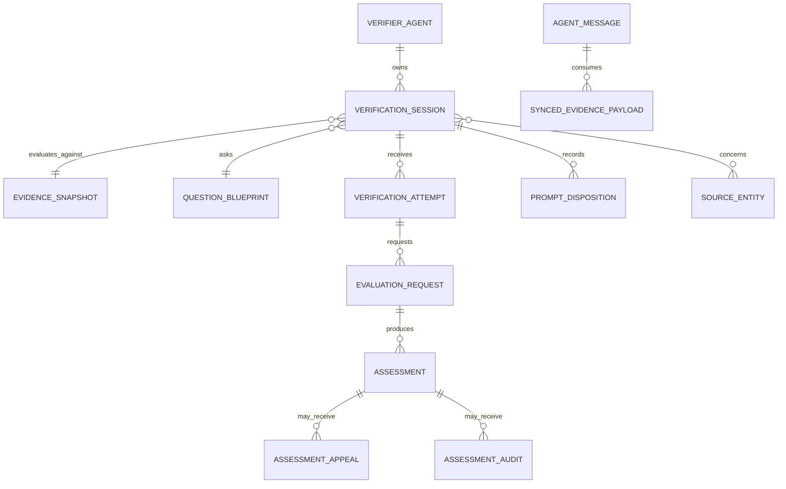
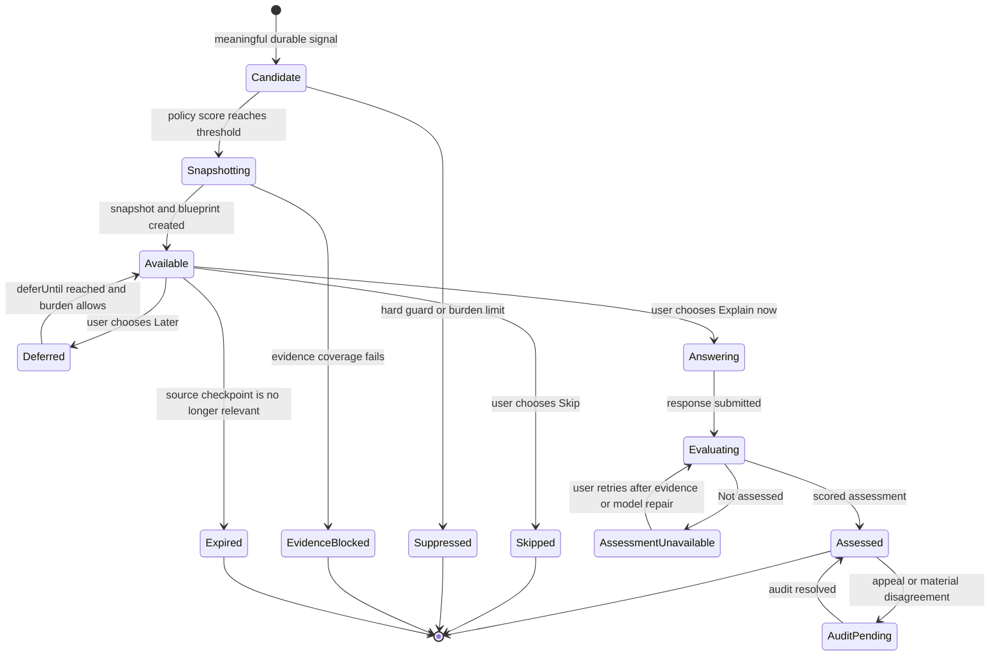

# AI Learning and Understanding Verification Agent — Implementation Plan

- Date: 2026-07-18
- Status: Expert-panel approved planning baseline
- Scope: Planning and documentation only; no implementation is included
- Related ADRs: [0031](../adr/0031-learning-verification-checkpoint-policy.md), [0032](../adr/0032-hybrid-understanding-evaluation.md), [0033](../adr/0033-learning-verification-session-persistence.md), [0034](../adr/0034-learning-understanding-rating.md)

## Document map and decision authority

- This plan is the self-contained implementation blueprint. It owns component
  boundaries, sequencing, rollout hypotheses, test strategy, and work packages.
- ADRs 0031–0034 own the durable decisions once accepted. A change to prompt
  timing, evaluation strategy, persistence authority, or rating semantics must
  update its owning ADR and every duplicated plan summary in the same change.
- The manual roadmap is a forward-looking user promise. It must remain less
  specific than the implementation plan and must never present an unshipped
  capability as available.
- Numeric cadence, burden, score, and calibration values in this draft are
  versioned implementation hypotheses unless an ADR explicitly calls them a
  semantic invariant. They are not established learning-science constants.

## Contents

1. [Purpose](#1-purpose)
2. [Goals and non-goals](#2-goals-and-non-goals)
3. [Existing architecture fit](#3-existing-architecture-fit)
4. [Architecture overview](#4-architecture-overview)
5. [Domain and data model](#5-domain-and-data-model)
6. [Checkpoint and prompting policy](#6-checkpoint-and-prompting-policy)
7. [Evidence assembly](#7-evidence-assembly)
8. [Evaluation logic](#8-evaluation-logic)
9. [Feedback and rating experience](#9-feedback-and-rating-experience)
10. [Interaction flows](#10-interaction-flows)
11. [Integration points](#11-integration-points)
12. [Failure modes and fallback strategies](#12-failure-modes-and-fallback-strategies)
13. [Privacy, security, and trust](#13-privacy-security-and-trust)
14. [Testing and calibration strategy](#14-testing-and-calibration-strategy)
15. [Phased delivery](#15-phased-delivery)
16. [Rollout gates and success measures](#16-rollout-gates-and-success-measures)
17. [Implementation work packages](#17-implementation-work-packages)
18. [Decision index](#18-decision-index)

## Canonical terminology

| Term | Canonical meaning |
| --- | --- |
| Verifier agent | Durable, scoped agent identity created from the `learningVerifier` template. It owns the causal verification log and provider/privacy route. |
| Checkpoint coordinator | Deterministic admission and burden-control service. It observes durable source signals and appends candidate facts; it does not evaluate explanations. |
| Verification workflow | Interactive lifecycle that assembles evidence, offers a question, accepts a response, requests evaluation, and presents feedback. |
| Question blueprint | Immutable, pre-response contract defining one learning objective, concept, operation, difficulty, evidence criteria, assessable dimensions, and assistance conditions. |
| Evaluator | Tool-less semantic comparison call that proposes claim classifications and anchored dimension levels. |
| Validator | Deterministic code that validates citations/schema, calculates the check-level score/formative label, applies caps, and withholds unreliable results. |
| Assessment | Immutable result for one response, blueprint, assistance condition, and evidence snapshot. It is not a trait, credential, or journal rating. |
| Concept-review history | Projection of concepts and operations demonstrated in individual checks. It is not a mastery model. |
| Evidence manifest | Synced, privacy-safe list of source revisions, digests, coverage, truncation, and availability. |
| Evidence cache | Device-local, nonsynced content required to evaluate external workspace evidence. |

## 1. Purpose

AI-assisted work can produce correct artifacts without leaving the user able to
explain why those artifacts work. This feature adds a long-lived verification
agent that asks the user to explain selected concepts in their own words,
compares that explanation with a fixed snapshot of the work, identifies gaps,
and returns an evidence-backed understanding assessment.

The feature is a learning aid, not an exam or a productivity gate. It must:

- create retrieval and self-explanation opportunities at meaningful moments;
- evaluate only against evidence the system actually captured;
- distinguish missing evidence from missing understanding;
- provide small, actionable next steps instead of generic criticism;
- remain dismissible, deferrable, accessible, and low-frequency by default;
- preserve the boundary between user-owned journal facts and agent-generated
  interpretations.

## 2. Goals and non-goals

### Goals

1. Add a `learningVerifier` agent-template kind and an independently testable
   verification workflow.
2. Normalize checkpoints from Lotti workflows and, when explicitly connected,
   external development workflows.
3. Capture an immutable evidence snapshot before asking a question, so the
   target cannot move during evaluation.
4. Prompt for explanation, prediction, trade-off analysis, or debugging in the
   user's own words.
5. Evaluate semantic correctness with an LLM while keeping admission,
   evidence, score calculation, caps, and fallback behavior deterministic.
6. Persist sessions, attempts, assessments, and dispositions as auditable,
   syncable agent-domain facts.
7. Surface a multidimensional rating, assessment reliability, evidence
   references, gaps, and a concrete follow-up activity.
8. Support phased rollout, calibration against human judgments, and measurable
   burden controls.

### Non-goals

- Proving general expertise or replacing an interview, course, or human mentor.
- Inspecting a repository, running commands, or reading files without an
  explicit host-provided evidence adapter and workspace consent.
- Storing or exposing hidden chain-of-thought.
- Blocking task completion, proposal confirmation, commits, or pull requests by
  default.
- Reusing the journal-domain `RatingEntry` model for machine-generated
  assessments. Subjective user ratings and evidence-based assessments have
  different semantics.
- Comparing users, publishing leaderboards, or turning ratings into a punitive
  performance metric.
- Automatically changing source code, tasks, or other user-owned records.

## 3. Existing architecture fit

The design extends existing agent capabilities rather than creating a parallel
runtime:

- `WakeOrchestrator` remains responsible for background agent wakes. It is not
  responsible for presenting interactive prompts.
- `AgentSyncService` remains the only production write path for synced
  agent-domain entities and links.
- `agent.sqlite` continues to hold agent identities, immutable messages,
  payloads, reports, wake provenance, and interaction sessions.
- The append-only `AgentMessageEntity`/`AgentLink` causal log is the sole source
  of truth for verification state, following ADR 0016. Structured verification
  entities are immutable artifacts referenced by causal events; they are not an
  alternative event stream.
- Inference provider/profile selection, privacy confirmation, and local/cloud
  routing use the existing agent runtime policy.
- Existing task, project, day, and event workflows emit normalized checkpoint
  signals after their own durable work completes. The verification coordinator
  consumes those signals without owning those workflows.
- The current change-set confirmation boundary remains intact: the verifier
  can explain and assess, but cannot apply changes to the journal database.

### Hard evidence boundary

Lotti knows its own tasks, agent reports, accepted proposals, linked journal
entries, and recorded test or analysis summaries only when they are present in
Lotti. It does not inherently know the current state of an external source
repository.

Actual code comparison therefore requires a `WorkspaceEvidenceAdapter` supplied
by the host workflow. The adapter is explicitly scoped to a consented workspace
and returns a bounded snapshot; the learning agent receives no arbitrary shell
or filesystem tool. When no adapter is connected, the UI must say that the
assessment covers Lotti-managed evidence only.

### Verifier identity and scope

One verifier agent is deterministically created per `LearningScopeRef`:

- a Lotti category for task/project/event work;
- a Daily OS planning scope;
- or an opaque external workspace ID mapped to a local root only on devices
  where the user granted access.

The agent ID is a UUID v5 over a dedicated namespace plus the canonical encoded
scope type and ID. The scope selects the inference profile, privacy policy,
burden budget, and concept-review history. Absolute workspace paths are never
synced; manifests use opaque workspace IDs and normalized root-relative paths.
The implementation must audit every exhaustive `AgentTemplateKind` switch when
adding `learningVerifier`.

## 4. Architecture overview

```mermaid
flowchart LR
  subgraph Sources["Checkpoint sources"]
    Task["Task/project/day/event workflows"]
    Decisions["Resolved agent change sets"]
    Manual["Verify now"]
    External["Consented development-workflow adapter"]
  end

  Sources --> Signals["LearningWorkflowSignal"]
  Signals --> Coordinator["LearningCheckpointCoordinator"]
  Coordinator --> EventLog["Causal candidate event"]
  EventLog --> Policy["Event-level guards and burden policy"]
  Policy -->|provisionally eligible| Evidence["LearningEvidenceAssembler"]
  Evidence --> Snapshot["Immutable evidence snapshot"]
  Snapshot --> Blueprint["Concept selection + question blueprint"]
  Blueprint --> FinalPolicy["Concept spacing + final eligibility"]
  FinalPolicy --> Session["LearningVerificationSession"]
  Session --> Prompt["In-context prompt card"]
  Prompt --> Attempt["User explanation"]
  Attempt --> Evaluator["HybridUnderstandingEvaluator"]
  Snapshot --> Evaluator
  Evaluator --> Validator["Deterministic validation and scoring"]
  Validator --> Assessment["Assessment + actionable feedback"]
  Assessment --> Projection["Pending and concept-review projections"]

  EventLog --> AgentDB["agent.sqlite via AgentSyncService"]
  Snapshot --> AgentDB
  Session --> AgentDB
  Attempt --> AgentDB
  Assessment --> AgentDB
  AgentDB --> Projection
```



### Component breakdown

| Component | Responsibility | Important boundary |
| --- | --- | --- |
| `LearningWorkflowSignalEmitter` | Maps completed workflow events to a stable signal contract. | Emits after the source event is durable; never prompts directly. |
| `LearningCheckpointCoordinator` | Deduplicates source signals, appends candidate events, and applies event-level guards and burden policy. | No model decides whether to interrupt the user. |
| `CheckpointPolicy` | Applies eligibility, cooldown, concept spacing, burden budget, risk, and novelty rules. | Versioned and deterministic for replay and tests. |
| `LearningEvidenceAssembler` | Requests evidence from registered adapters, redacts secrets, bounds content, and freezes a snapshot. | A missing source is recorded as missing, never silently invented. |
| `WorkspaceEvidenceAdapter` | Supplies repository revision, diff, relevant files or symbols, test/analyzer summaries, and architecture references from a consented workspace. | Read-only, root-scoped, no command execution by the verifier. |
| `ConceptSelector`, `QuestionBlueprintBuilder`, and `BlueprintValidator` | Produce one default concept, one observable objective, elicited operation, difficulty, assessable dimensions, criteria, and question grounded in evidence. | Tool-less structured output cites evidence IDs; unsupported claims, unsafe universals, and invalid dimensions block the offer. |
| `LearningVerificationWorkflow` | Creates the session, accepts attempts and dispositions, invokes evaluation, and persists results. | Separate from `WakeOrchestrator` because the turn is user-interactive. |
| `HybridUnderstandingEvaluator` | Builds the reference rubric, compares claims, identifies contradictions and omissions, and proposes feedback. | Treats explanations and evidence as untrusted data; no tools are exposed. |
| `AssessmentValidator` | Validates schema, evidence references, score ranges, caps, and reliability rules; calculates the final score, formative label, and assessment outcome. | The LLM cannot directly set the final score or bypass caps. |
| `LearningVerificationRepository` | Atomically appends causal events plus immutable referenced artifacts/links through `AgentSyncService`. | Same-ID immutable artifacts are insert-or-verify-identical; conflicting bytes are quarantined. |
| `LearningVerificationProjection` | Folds causal events into pending, deferred, assessed, unavailable, and concept-review views. | Rebuildable only from `AgentMessageEntity` and typed links; artifacts supply event data but not ordering. |
| Verification UI | Presents low-friction prompts, editor/voice capture, evidence scope, result, appeal, history, and settings. | No surprise modal; no full-screen loading during background refresh. |

### Suggested feature layout for implementation

This is a target module map, not code added by this plan:

```text
lib/features/agents/
├── learning/
│   ├── model/          # signals, evidence, rubric, projection values
│   ├── service/        # coordinator, policy, adapters, evaluator, validator
│   ├── workflow/       # interactive verification workflow
│   ├── state/          # Riverpod queries/controllers
│   └── ui/             # prompt, attempt, result, history, settings
├── model/              # new AgentDomainEntity/AgentLink variants and enums
├── database/           # conversion/query support
├── state/              # production wiring
└── README.md           # current runtime behavior after implementation
```

## 5. Domain and data model

### 5.1 Normalized checkpoint signal

`LearningWorkflowSignal` is an ephemeral input to the coordinator:

| Field | Type | Meaning |
| --- | --- | --- |
| `signalId` | string | Stable source-event ID used for deduplication. |
| `sourceWorkflow` | enum | `taskAgent`, `projectAgent`, `dayAgent`, `eventAgent`, `manual`, or `externalDevelopment`. |
| `sourceWorkflowId` | string | Task, project, day, event, or external run ID. |
| `sourceRunId` | string? | Wake run, change set, build, commit, or PR run ID. |
| `checkpointType` | enum | `meaningfulCompletion`, `decisionResolved`, `boundaryChanged`, `preFinalization`, `spacedReview`, or `manual`. |
| `occurredAt` | datetime | Source event time. |
| `changedSubjects` | list of refs | Entity, file, symbol, service, or decision references. |
| `riskSignals` | set | Security, data loss, migration, concurrency, privacy, public API, or none. |
| `noveltySignals` | set | New concept, new subsystem, new tool, changed architecture, or none. |
| `evidenceAdapterIds` | list | Adapters authorized to build the snapshot. |
| `metadata` | map | Bounded source-specific values; never arbitrary secrets. |

The source event identified by `signalId` is durable in its owning workflow. On
observation, the coordinator appends a `checkpointCandidateObserved` message to
the verifier's causal log before doing model or adapter work. This prevents a
crash from silently losing an eligible checkpoint.

Deduplication has two stages:

1. `CheckpointCandidateId` is a UUID v5 over a dedicated namespace and canonical
   JSON tuple of `verifierAgentId`, `sourceWorkflow`, `signalId`,
   `checkpointType`, and `policyVersion`. It makes replay of the same source
   event idempotent.
2. Evidence and question generation may diverge offline. Each resulting session
   branch therefore has a content-addressed ID over candidate ID, evidence
   manifest digest, blueprint digest, and privacy policy version. The projection
   selects the lowest validated `(manifestDigest, blueprintDigest, sessionId)`
   tuple. A reconciliation behavior—not the pure projection—then appends
   `sessionSuperseded` events for later-connected alternatives; no local device
   presents two branches for one candidate.

Connected devices use the existing ADR 0018 lease/idempotency contract to avoid
duplicate generation. Offline branches remain legal and auditable rather than
being forced into a false same-ID overwrite.

### 5.2 Immutable verification graph

#### Authoritative causal event vocabulary

The only authoritative order is a chain/DAG of `AgentMessageEntity` events with
typed payloads and links:

- `checkpointCandidateObserved`;
- `checkpointCandidateSuppressed` or `checkpointEvidenceBlocked`;
- `evidenceSnapshotCaptured`;
- `verificationSessionOffered`;
- `verificationAttemptSubmitted`;
- `promptDispositionRecorded`;
- `evaluationRequested`, `evaluationCancelled`, and `assessmentProduced`;
- `assessmentAppealed` and `assessmentAuditCompleted`;
- `sessionReopened`, `sessionSuperseded`, and
  `verificationDeletionRequested`.

The event payload references immutable structured artifacts described below.
Every causal message has a fresh unique append ID; semantic `candidateId`,
`sessionId`, and `evaluationRequestId` values live in payloads/artifacts and are
never reused as message IDs across devices.
Projection order comes only from `messagePrev` causal links and ADR 0018's
canonical linear extension. Structured artifacts are not folded by row
timestamp. Same-ID artifact insertion is `insert-or-verify-byte-identical`; a
different body for an existing immutable ID is quarantined and produces an
integrity diagnostic rather than `insertOnConflictUpdate`. The sole permitted
same-ID transition is the monotonic active-to-tombstoned form carrying the
original content identity; every other mutation is rejected.

#### Canonical references

All source and concept identities are versioned:

```text
SourceRef(domain, kind, id, revision, digest?)
ConceptRef(namespace, key, version, displayLabel)
```

Only actual agent-domain endpoints receive `AgentLink` rows. Journal and
external sources remain typed provenance unless an existing cross-domain link
contract applies. Concept history never merges labels such as `retry` across
unrelated namespaces or incompatible concept versions.

All durable records below are immutable `AgentDomainEntity` artifacts in
`agent.sqlite`, referenced by causal events and written with their links through
`AgentSyncService`.

#### `LearningVerificationSessionEntity`

Immutable envelope for one question against one evidence snapshot:

- `id`: content-addressed branch ID over candidate, evidence manifest,
  blueprint, and privacy-policy digests;
- `candidateId` and `verifierScope`;
- `agentId`: verifier agent instance;
- `sourceWorkflow`, `sourceWorkflowId`, `sourceRunId`;
- `checkpointType`, `policyVersion`, `priorityScore`;
- `evidenceSnapshotId`, `evidenceDigest`, and `questionBlueprintId`;
- one default `ConceptRef` for automatic checks; manual checks may explicitly
  select more;
- `question`, `promptVersion`, `createdAt`, `availableAt`, `expiresAt`;
- `locale`, `inferenceProfileId`, and privacy scope;
- vector clock and optional tombstone.

Canonical identity bytes include candidate ID, snapshot/blueprint/privacy
digests, and semantic scope. Sync envelopes (`vectorClock`, author host) are
excluded. `createdAt`, `availableAt`, and `expiresAt` are deterministic
derivations from the source event plus policy version and are included in the
byte-identical artifact body.

The entity has no mutable status. Presentation state is projected from causal
events.

#### `LearningEvidenceSnapshotEntity`

Immutable manifest of what the evaluator is allowed to use:

- `id`, `agentId`, `capturedAt`, `digest`, `schemaVersion`;
- source revisions such as journal entity vector clocks, wake run keys, commit
  SHAs, or build IDs;
- ordered `EvidenceItemDescriptor` records containing ID, kind, label, source
  ref, root-relative path where applicable, content digest, sensitivity,
  availability, truncation state, and capture outcome;
- explicit `missingSources`, redaction summary, token estimate, and coverage;
- payload IDs only for synced, privacy-approved Lotti evidence.

Snapshot identity bytes include the ordered descriptors, source revisions,
content digests, redaction/privacy policy, coverage, and a `capturedAt` derived
from the causal source frontier rather than local wall-clock arrival. Sync
envelopes are excluded.

The `evidenceSnapshotCaptured` consuming message attaches synced evidence bytes
through actual ADR 0020 `messagePayload` links, including source provenance and
canonical ordering metadata. External workspace excerpts marked local-only are
never `AgentMessagePayloadEntity` records. They live in a separate nonsynced,
content-addressed `learning_evidence_cache`, while the synced manifest records
only a sanitized descriptor, digest, and `localOnlyOnOrigin` availability. A
peer shows the redacted shell and must recapture the same revision locally
before evaluation. Full repository copies and absolute paths are never stored.

#### `LearningQuestionBlueprintEntity`

Immutable contract built before the response:

- `id` and digest, `sessionCandidateId`, one primary `ConceptRef`;
- observable learning objective and elicited cognitive operation (`explain`,
  `predict`, `debug`, `compare`, or `apply`);
- scope, difficulty, novelty/transfer condition, and expected effort as a
  nonbinding estimate;
- evidence-bound target claims, accepted variants, misconception hazards, and
  evidence item IDs;
- dimensions the question can actually elicit; every other dimension is
  `notObserved`;
- default assistance condition and support options;
- blueprint, prompt, rubric-major, and builder-model provenance.

Blueprint identity bytes include every semantic field above; builder request
timestamps and sync envelopes are provenance outside the digest.

Automatic prompts use one primary concept and objective. The learner may switch
to another eligible concept or operation before starting, which creates a new
blueprint/session branch and supersedes the unopened branch.

#### `LearningVerificationAttemptEntity`

Immutable user response:

- `id` (UUID v4) and `sessionId`; display attempt order is derived from the
  causal log because concurrent devices can both submit what appears locally as
  the first attempt;
- `responseText`, `inputMode` (text, voice transcript, accessibility input);
- `assistanceCondition` (`unaidedFirst`, `openBook`, `hinted`, or
  `workedExampleRevealed`) and ordered `supportUsed` events;
- response form (`prose`, `bullets`, `voiceTranscript`, or `structured`);
- optional user confidence (`notSure`, `somewhatSure`, `verySure`);
- `submittedAt`, `locale`, vector clock, and optional tombstone.

The original response is preserved. Editing after submission creates a new
attempt so feedback remains attributable to what was actually assessed.

#### `LearningEvaluationRequestEntity`

Deterministic request envelope used for idempotent execution, not result
identity:

- `id` over attempt, blueprint/rubric, evaluator-policy version, and request
  generation;
- attempt/session/snapshot IDs and digests;
- provider/model/profile, schema, prompt, rubric, and privacy versions;
- deterministic runtime deadline policy parameters.

Request identity includes semantic inputs and request generation. Runtime
request/cancellation timestamps are derived from causal events and do not live
in the immutable request artifact.

The workflow is single-flight per request under the ADR 0018 lease when
connected. A retry or appeal creates a new request. A late result for a cancelled
request remains auditable but is not selected for presentation.

#### `LearningAssessmentEntity`

Immutable evaluator result:

- unique content-digest/UUID result ID that includes validated output and full
  provenance, so stochastic concurrent results never overwrite one another;
- `evaluationRequestId`, `attemptId`, `sessionId`, `questionBlueprintId`,
  `evidenceSnapshotId` and digest;
- inference provenance: provider/model, profile, prompt, rubric, evaluator, and
  schema versions plus token counts and timestamps;
- per-dimension level or `notObserved`, evidence IDs, concise rationale, missing
  elements, and contradiction severity;
- deterministic aggregate score, formative label, reliability, and assessment
  outcome;
- up to three prioritized gaps, one follow-up practice, and optional recheck
  date;
- `copiedLanguageSignal`, `evidenceCoverage`, validation warnings, vector clock,
  and optional tombstone.

#### `LearningPromptDispositionEntity`

Immutable interaction event:

- `id`, `sessionId`, `kind` (`deferred`, `skipped`, `dismissed`), `createdAt`;
- optional standardized reason, free-text context, `deferUntil`, actor, vector
  clock, and tombstone.

Expiry is derived from `expiresAt`, supersession has its own causal event, and
appeals target assessments rather than prompt presentation.

#### `LearningAssessmentAppealEntity`

Immutable user-authored dispute containing assessment ID, disputed
dimension/claim, optional text, requested remedy, assistance context, and
timestamp. It never replaces the original assessment.

#### `LearningAssessmentAuditEntity`

Optional calibration record created only for sampled or appealed assessments:

- original assessment and appeal IDs, reviewer type (second model or explicitly
  consented human), blinded
  dimension ratings, disagreements, resolution, and timestamp.

### 5.3 Relationships

New typed links keep navigation and cleanup explicit:



The corresponding link variants are:

- `verificationSessionSource`;
- `verificationSessionEvidence`;
- `verificationSessionBlueprint`;
- `verificationAttemptSession`;
- `verificationEvaluationAttempt`;
- `verificationAssessmentEvaluation`;
- `verificationDispositionSession`;
- `verificationAppealAssessment`;
- `verificationAuditAssessment`.

Actual synced evidence bytes use the existing `messagePayload` link from the
snapshot-capture event. No synced graph link points to a device-local cache
blob. Each new link type has an endpoint-type validator and documented
cardinality: one snapshot and one blueprint per session branch; many attempts
per session; many evaluation requests per attempt; many results per request;
many dispositions/appeals/audits as immutable events.

Foreign IDs are duplicated in artifact payloads only where required for query
acceleration. The atomic write validator recomputes digests and enforces
artifact ownership plus assessment → request → attempt → session → blueprint →
snapshot agreement. External evidence assembly happens before the transaction;
then candidate/session/artifacts/links/causal event are committed atomically.
Unreferenced local cache blobs from a failed transaction are reclaimed by a
bounded orphan sweep.

### 5.4 Derived projections

Three vocabularies are intentionally separate:

| Layer | Canonical values | Persistence |
| --- | --- | --- |
| Coordinator/workflow phase | `observing`, `assemblingEvidence`, `buildingBlueprint`, `awaitingUser`, `evaluating`, `presenting` | Ephemeral runtime state only. |
| Candidate outcome | `suppressed`, `evidenceBlocked`, `offered` | Derived from candidate causal events; a blocked candidate is not a low assessment. |
| Session presentation state | `available`, `deferred`, `attempted`, `assessed`, `assessmentUnavailable`, `skipped`, `expired`, `superseded`, `deleted` | Derived from session/attempt/disposition/evaluation/deletion causal events. |
| Assessment outcome | `scored`, `notAssessed` | Immutable assessment artifact. `notAssessed` means evidence or evaluator reliability was insufficient. |

`needsReview` is not a session or assessment state. It is a UI badge derived
when an assessment was appealed, concurrent valid assessments materially
disagree, or an audit is pending.

The order-independent fold applies these rules:

1. A deletion event is terminal for presentation; late events remain in the
   audit log but do not resurrect the session.
2. Supersession hides a branch from the pending list but preserves its complete
   history.
3. A valid scored assessment yields `assessed`; a valid `notAssessed` result
   yields `assessmentUnavailable` and offers a new evaluation request or
   evidence refresh.
4. Any attempt yields at least `attempted` and remains visible regardless of a
   concurrent defer, skip, dismissal, or later expiry.
5. `expired` is computed from the session's `expiresAt` and injected projection
   clock only when there is no attempt.
6. Among unopened sessions, the latest canonical defer time controls
   availability; skip/dismiss hides the session unless a later causal reopen
   event exists.
7. An appeal targets and preserves an assessment. It never replaces it.
8. Concurrent scored results are preserved. If their material claims and
   dimension levels agree within the validator tolerance, canonical content
   digest chooses the displayed one; otherwise the session remains `assessed`,
   receives the `needsReview` badge, and enters audit pending until resolved.

The projection also derives burden windows and concept-review history. It must
not compare raw scores across different rubric major versions, non-equated
question blueprints, evidence scopes, or assistance conditions.

### 5.5 Projection tables and queries

Regenerable local tables accelerate product paths without becoming synced
authority:

```text
learning_session_index(
  session_id PRIMARY KEY, candidate_id, agent_id, state, available_at, defer_until,
  expires_at, source_domain, source_id, latest_assessment_id, created_at,
  updated_at
)

learning_concept_index(
  agent_id, concept_namespace, concept_key, concept_version, rubric_major,
  last_observed_at, next_review_at, last_operation, assistance_condition,
  assessment_label, session_id,
  PRIMARY KEY(agent_id, concept_namespace, concept_key, concept_version,
              rubric_major, session_id)
)
```

Required indexes cover active/pending sessions, due concepts, source-context
lookup, and stable history pagination by `(created_at DESC, session_id DESC)`.
The projection adapter supports queries for the pending list/badge, source card,
rolling burden, due concepts, assessment detail, audit state, and evidence GC.
It refreshes transactionally after causal appends and fully rebuilds on schema
version change or integrity mismatch, following the existing attention and
standing-agreement projection pattern.

### 5.6 Retention and deletion

- Session, attempt, disposition, and compact assessment records remain until
  the user deletes learning history or agent data.
- Synced cited evidence needed to interpret an assessment remains under ADR
  0020 coverage/frontier rules until the assessment is deleted. It is bounded,
  redacted, and privacy-approved before capture. Each undeleted assessment is a
  live coverage/reference root, so ADR 0017/0020 compaction cannot collect its
  cited payload.
- Uncited synced evaluation context may compact under ADR 0017/0020; the
  manifest then marks citations no longer inspectable where applicable.
- Device-local external excerpts default to a versioned 30-day engineering TTL
  and are never synced. Their manifest descriptors/digests remain, but history
  clearly labels expired citations unavailable. A fresh assessment requires
  recapturing the same revision or creating a new snapshot.
- Deletion appends synced tombstone events for owned artifacts and links. Local
  physical GC waits for retention and convergence/acknowledgment conditions.
  Global reachability, not agent-scoped reachability, controls deletion of
  content-addressed synced payloads shared across agents.
- The manual and UI must describe learning history as agent data: syncable and
  user-deletable, but not a journal fact or permanent credential.

### 5.7 Compatibility and integrity

Version fields are distinct: database schema, entity payload schema, event
schema, policy, blueprint, rubric major/minor, evaluator prompt/schema, and
privacy/redaction policy. New fields default or remain nullable, enums use
unknown-value fallbacks, and older clients render a generic unsupported-record
notice rather than promising metadata their `AgentUnknownEntity` cannot retain.
Clients must not mutate or tombstone a record whose event/artifact version they
cannot safely interpret.
Verification sync is gated on the minimum client payload version. An upgraded
client rehydrates supported artifacts/events from the sync sequence log and
rebuilds projections; rollout cannot rely on fallback variants preserving
unknown raw JSON.

Engineering bounds are versioned safety limits, not pedagogical claims: at
most 64 evidence descriptors, 64 KiB per cached item, 512 KiB cached per
snapshot, 128 KiB submitted after selection, 32 KiB response text, 64 KiB
assessment JSON, 24 citations, and nesting depth 8. Exceeding a bound records
truncation and may fail the evidence-coverage gate; it never silently omits a
required concept. Sync payloads that exceed the existing message budget use the
established attachment/chunk path or fail closed before session offer.

## 6. Checkpoint and prompting policy

### 6.1 Candidate triggers

Automatic candidates are emitted only after a meaningful durable event:

1. a task, project, day, or event agent completes work involving a new concept
   or system boundary;
2. a consequential change set is fully resolved;
3. a task with agent-assisted work transitions to done, blocked, or ready for
   final review;
4. an external development workflow reports a completed implementation,
   passing validation, architecture decision, commit, or pre-PR state;
5. a prior concept becomes due for a spaced recheck;
6. the user explicitly chooses **Verify my understanding**.

Edits, keystrokes, partial inference output, failed source workflows, and every
ordinary wake are not automatic trigger candidates.

### 6.2 Hard guards

Event-level guards run before evidence assembly. No automatic candidate proceeds
when any of these apply:

- learning verification is disabled globally, for the category, or for the
  current workspace;
- the user is recording, transcribing, editing the target, resolving a modal,
  or another verification is open;
- evidence adapters are unauthorized or the source workflow is still running or
  failed;
- the stable candidate event already exists;
- the global cooldown or rolling burden budget is exhausted;
- privacy confirmation or inference setup is unavailable.

After the evidence snapshot and question blueprint exist, final guards suppress
the offer when evidence coverage is insufficient, the chosen concept is inside
its review window, or another canonical branch has already been offered. Model
concept selection can suppress a candidate; it cannot make an otherwise
ineligible candidate interrupt the user.

Manual verification bypasses burden and spacing limits, but never privacy,
authorization, evidence-integrity, or active-operation guards.

### 6.3 Priority score

Eligible automatic candidates use a versioned deterministic score:

| Signal | Range | Example |
| --- | ---: | --- |
| Checkpoint importance | 0–4 | Pre-finalization or meaningful completion. |
| Concept novelty | 0–3 | First encounter with a subsystem or mechanism. |
| Consequence/risk | 0–3 | Migration, security, concurrency, privacy, public API. |
| Prior gap due | 0–2 | Earlier assessment identified this concept. |
| Evidence quality | 0–2 | Direct diff/tests/design evidence rather than summaries only. |
| Fatigue penalty | 0 to −6 | Recent prompts, skips, deferrals, or active workload. |

The initial shadow-policy hypothesis uses a threshold of 7, a global automatic
cooldown of 24 hours, and no more than two automatic prompts in seven days.
These values and the ranges above are explicitly unvalidated. Phase 0 may change
them before any user sees a prompt, and every deployed value is carried in the
policy version. Calibration uses delayed learning outcomes and burden—not prompt
completion—as the success criterion.

### 6.4 Spacing schedule

Immediate post-work self-explanation supports encoding and reveals current
reasoning; it is not evidence of durable retention. Delayed review is a separate
unaided-retrieval or transfer opportunity. The first shadow-policy spacing
hypotheses are:

| Outcome | Earliest automatic recheck |
| --- | --- |
| Core idea needs review | After the learner completes a learning activity or explicitly requests a recheck, then no sooner than 1 day |
| Developing explanation | No sooner than 3 days |
| Core mechanism demonstrated | No sooner than 14 days |
| Transfer demonstrated in this check | No sooner than 45 days and only in a fresh meaningful context |
| Skipped/dismissed | No automatic resurfacing without fresh consent or a new meaningful checkpoint |
| Deferred | User-selected quiet time |
| Not assessed | No automatic recheck until evidence is repaired |

These intervals are unvalidated hypotheses, not outcome-to-memory formulas.
Users can choose quiet windows or review timing. The burden budget and
meaningful-work requirement still apply, preventing context-free quiz
notifications.

### 6.5 Prompt delivery

Automatic verification appears as a non-modal card beside the completed work or
in the agent's pending-interactions area. It contains:

- why the prompt appeared;
- the concept and evidence scope;
- one focused question;
- an optional effort estimate such as “about two minutes,” never a timer;
- **Explain now**, **Open-book**, **Later**, **Skip**, **Already know this**,
  **Not relevant**, and a settings affordance;
- concept, depth, operation, and plain-language prompt controls.

**Already know this** and **Not relevant** are dispositions, not performance
evidence. They create no score, positive inference, or review schedule unless
the learner later opts in.

Verification never gates finalization in the planned phases. The feature must
demonstrate delayed learning benefit and low burden before a separate ADR could
even consider a user-configured gate.

### 6.6 Question design

Questions rotate across cognitive operations instead of repeatedly asking for
a summary:

- **Explain:** “How does the new retry boundary prevent duplicate effects?”
- **Predict:** “What happens if the second device submits the same decision?”
- **Debug:** “Which evidence would you inspect first if this path fails?”
- **Compare:** “Why was an append-only event chosen over a mutable status row?”
- **Apply:** “How would this mechanism change if the work were offline-first?”

An automatic question targets one concept, one observable objective, and only
the dimensions its operation can elicit. Manual checks may combine concepts
only when the user explicitly chooses broader scope. The prompt avoids
answer-shaped wording, asks for causal relationships only where evidence
supports them, and allows uncertainty without penalty. A deterministic fallback
uses the concept label and source boundary if concept-selection inference fails.

Before the first response, the user sees scope, revision, objective, operation,
and assistance choice but not answer-shaped evidence excerpts. `unaidedFirst`
is an invitation, not surveillance: the user can open sources or hints at any
time, and the attempt records the resulting support condition. Content—not
grammar, spelling, accent, disfluency, verbosity, typing speed, or exact
technical jargon—is assessed. Bullets, prose, edited voice, structured response,
plain-language restatement, preferred supported language, save/resume, and
pause-without-timer are valid paths.
The assistance condition records support opened inside the workflow; it never
claims to prove that no external source or AI was consulted.

## 7. Evidence assembly

### 7.1 Evidence adapters

Adapters implement a read-only contract returning descriptors and bounded
content. Planned adapters are:

| Adapter | Evidence |
| --- | --- |
| `AgentRunEvidenceAdapter` | Wake provenance, prompt version, report, tool outcomes, accepted/rejected proposals, and errors. |
| `JournalSubjectEvidenceAdapter` | Task/project/day/event text, statuses, linked entries, and relevant user decisions. |
| `ArchitectureEvidenceAdapter` | Linked ADRs, feature README sections, schemas, and design constraints explicitly attached to the work. |
| `WorkspaceEvidenceAdapter` | Consented repository base/head revisions, changed paths, bounded diff, relevant symbol excerpts, analyzer/test summaries, and build provenance. |
| `ManualEvidenceAdapter` | User-selected files, notes, or pasted artifacts with explicit labels. |

### 7.2 Snapshot rules

1. Capture before the question is shown.
2. Store source revision and content digest for every item.
3. Redact configured secret patterns and reject binary or oversized content.
4. Preserve both supporting and contradicting evidence.
5. Record truncation and missing sources; never describe a partial snapshot as
   complete.
6. Prefer direct artifacts over agent summaries when both exist.
7. Freeze the snapshot for an attempt. Later workspace changes create a new
   session or are clearly labeled as post-snapshot.
8. Treat comments, source text, explanations, and imported documents as
   untrusted data, not instructions.
9. Require adapters to attest the opaque workspace ID, root-relative path,
   revision, capture policy, redaction version, and whether the source is
   locally reproducible. Adapter output never grants access to another root.
10. Blueprint construction follows the same untrusted-data, no-tools, citation,
    schema, and validation boundary as response evaluation.

### 7.3 Coverage gate

The blueprint declares the evidence kinds required to establish each target
claim; there is no universal “one direct or two indirect” rule. The assembler
calculates coverage against that declaration. When required evidence is absent,
the candidate outcome is `evidenceBlocked`; no session is offered. If evidence
expires or becomes unavailable after an attempt, evaluation produces
`notAssessed`, identifies the missing sources, and offers recapture. Neither path
turns evidence uncertainty into a low understanding label.

## 8. Evaluation logic

### 8.1 Evaluation pipeline

```mermaid
sequenceDiagram
  participant U as User
  participant W as Verification workflow
  participant R as Rule checks
  participant L as Evaluator model
  participant V as Deterministic validator
  participant P as Persistence/projection

  U->>W: Submit explanation
  W->>R: Validate session, snapshot, input, and consent
  R-->>W: Admissible + bounded evidence
  W->>P: Append evaluationRequested event + request artifact
  W->>L: Frozen blueprint + untrusted evidence + response + support condition
  L-->>W: Structured claims, dimensions, gaps, citations, assessment reliability
  W->>V: Validate schema and evidence IDs
  V->>V: Recompute score, caps, formative label, and assessment outcome
  alt valid
    V-->>P: Atomically append result + assessmentProduced event
    P-->>U: Evidence scope, feedback, next action, then rating detail
  else repairable model failure
    V-->>W: Append failed result; create one new repair request
  else not reliable
    V-->>P: Append not-assessed result
    P-->>U: Preserve response; offer retry or self-check rubric
  end
```

### 8.2 Deterministic admission checks

Admission verifies:

- session is current and not already superseded;
- snapshot digest and required evidence items still resolve;
- response is present and within configured size bounds;
- locale is supported or a translation route is available;
- privacy/profile policy still permits evaluation;
- evidence coverage meets the gate;
- model output schema and every cited evidence ID are valid.

A concise correct answer is admissible. Character count is not used as a proxy
for understanding. High phrase overlap with an agent report is recorded as a
signal, not proof of copying; the workflow may ask a transfer question instead
of deducting points.

### 8.3 Pre-response rubric construction

The question blueprint and evidence-bound reference rubric are constructed and
persisted before the user's answer is available. They contain:

- essential facts and invariants;
- causal mechanisms and data flow;
- boundaries, assumptions, and failure conditions;
- trade-offs or rejected alternatives present in the evidence;
- validation or operational evidence;
- acceptable terminology variants;
- concepts that cannot be assessed from the snapshot;
- the dimensions the question elicits and those marked `notObserved`;
- assistance conditions under which the result may be interpreted.

The response is then decomposed into claims. Each claim is marked supported,
partially supported, contradicted, irrelevant, or not verifiable and cites the
evidence items used. The evaluator returns concise justifications, not hidden
reasoning traces.

### 8.4 Rubric dimensions and anchors

The initial weights are versioned scoring hypotheses: correctness 30,
causal/mechanistic understanding 25, completeness/relevance 20,
boundaries/trade-offs 15, and validation/transfer 10. A blueprint marks a
dimension `notObserved` when its question did not elicit that operation; the
learner receives no penalty, and the validator normalizes only across the
blueprint's observed weights. Results are comparable only across equated
blueprints with the same rubric major, difficulty, evidence scope, and
assistance condition.

| Dimension | 0 | 1 | 2 | 3 | 4 |
| --- | --- | --- | --- | --- | --- |
| Correctness | No assessable correct claim or core claim contradicted. | Isolated correct detail, with a core misconception. | Mixed accuracy; core idea partly right but material errors remain. | Core claims correct; only minor imprecision remains. | Material claims accurate with no unresolved contradiction. |
| Causal/mechanistic understanding | No mechanism stated. | Names parts without a valid relationship. | Gives one valid link but misses the governing flow/invariant. | Explains the core how/why chain with a small gap. | Explains the complete relevant mechanism and predicts its behavior. |
| Completeness/relevance | Does not address the objective. | Addresses a peripheral fragment. | Covers some required claims but omits a material part or adds major tangents. | Covers all core claims with a minor omission. | Covers the scoped objective completely and concisely. |
| Boundaries/trade-offs | States no relevant boundary and asserts an unsafe universal. | Mentions a vague limitation without relation to the design. | Identifies one real boundary or trade-off but not its consequence. | Explains the important boundary/trade-off and consequence. | Accurately compares assumptions, limits, failure conditions, and meaningful alternatives requested by the blueprint. |
| Validation/transfer | Gives no valid observation, test, prediction, or application. | Names evidence without linking it to a claim. | Uses one relevant check or prediction with incomplete interpretation. | Correctly connects evidence to the mechanism or applies it to a near case. | Succeeds on the blueprint's novel prediction/application and explains why; only this level can support a transfer-demonstrated label. |

For observed dimensions, the validator calculates the optional detail score as:

`score = round(sum((level / 4) * weight) / sum(observed weights) * 100)`

### 8.5 Deterministic caps and uncertainty

- The initial validator hypothesis caps a material contradiction about the core
  mechanism at 49.
- A material security, privacy, data-loss, or migration misconception caps it
  at 49 and is corrected explicitly before optional retry practice.
- Missing evidence lowers assessment reliability, not understanding, until the
  coverage gate fails; a failed gate produces **Not assessed**.
- Invalid citations or malformed output trigger a distinct repair request.
  Material concurrent evaluator disagreement is defined by the versioned audit
  policy and keeps the session assessed with a `needsReview` badge plus audit
  pending, not a guessed replacement score.
- Assessment reliability is `high`, `medium`, or `low`, calculated from coverage, citation
  validity, contradiction clarity, and calibration history. It is independent
  from the formative label.

### 8.6 Prompt-injection resistance

- Evidence and the user's response are delimited and labeled as data.
- The evaluator has no tools, network, shell, or write capability.
- Instructions found inside evidence are ignored unless the question is
  explicitly about those instructions as artifacts.
- Output is schema-constrained and validated against the snapshot inventory.
- Persisted content excludes hidden chain-of-thought and provider-private
  reasoning fields.
- Adversarial evidence fixtures are part of the evaluation test corpus.

## 9. Feedback and rating experience

### 9.1 Formative rating labels

Decision owner: [ADR 0034](../adr/0034-learning-understanding-rating.md).

The rating describes only operations elicited by the blueprint under the
recorded assistance condition. Initial score ranges are versioned hypotheses:

| Score | Formative label | Meaning for this evidence snapshot |
| ---: | --- | --- |
| 90–100 | Transfer demonstrated in this check | Used only when a blueprint administered a genuinely novel prediction/application and the transfer dimension reached level 4. Without both conditions, the validator caps the displayed score at 89 and the label at Core mechanism demonstrated. |
| 75–89 | Core mechanism demonstrated | Used only when correctness and causal/mechanistic understanding were both elicited and each reached at least level 3. Otherwise use the operation-specific **Objective demonstrated in this check**. |
| 50–74 | Developing explanation | Used for an explanation/mechanism blueprint. Other operations use **Objective partly demonstrated**. |
| 0–49 | Core idea needs review | Used only when the requested core idea/mechanism was elicited. Other operations use **Objective needs review**. |

`notAssessed` is a non-scored assessment outcome, not a formative label. It says
that evidence or evaluator reliability was insufficient.

The language always says “for this explanation, blueprint, support condition,
and snapshot,” never “you are a 49% engineer.” Ratings are not credentials or
proof of durable retention. Users may hide both the label and numeric score.
Raw scores are never trended across non-equated checks.

### 9.2 Feedback structure

The default result is learning-first rather than score-first:

1. evidence scope, assistance condition, and assessment reliability;
2. **What you explained well**, with one or two evidence-linked specifics;
3. **Most important gap**, phrased as an actionable correction;
4. one targeted next activity: re-explain, predict a failure, inspect a named
   artifact, or answer a transfer question;
5. formative label and observed-dimension profile;
6. optional numeric score, detailed citations, and `notObserved` dimensions
   under disclosure;
7. **This assessment seems wrong** for appeal/re-evaluation;
8. delete/export controls and any user-chosen review date.

The scaffold is attempt → confirmation of correct elements → one prioritized
gap → cue/source pointer → optional revised explanation → always-revealable
worked comparison/model explanation. Safety-critical misconceptions are
corrected immediately rather than hidden behind a retry. Retries are practice
under a newly recorded support condition; they do not erase an earlier attempt
or promote a decontextualized “best score.”

### 9.3 Self-calibration

Optional pre-answer confidence is compared with the evidence-based result only
for the user's private reflection. The UI may say “You were very sure; the main
gap was the failure path,” but never treats confidence as correctness or exposes
a leaderboard.

## 10. Interaction flows

### 10.1 Automatic post-checkpoint flow



### 10.2 Manual flow

The user can invoke **Verify my understanding** from a supported task, agent
report, change-set result, or connected workspace. They choose the evidence
scope and optionally the concept. The coordinator still freezes evidence and
applies privacy/coverage guards, but it skips automatic burden scoring.

### 10.3 Pre-finalization integration

An external workflow may emit `preFinalization` before commit or PR creation.
The prompt is advisory, queued beside the finalization summary, and never blocks
the user from continuing.

### 10.4 Appeal flow

An appeal preserves the original assessment, records the disputed dimension or
claim, and runs a fresh evaluator version or second-model audit when available.
The user sees both results and the reason for any resolution. No assessment is
silently overwritten.

## 11. Integration points

### Agent model and persistence

- Add `AgentTemplateKind.learningVerifier` and localized display labels.
- Add the verification entity/link variants and database conversion/query
  mappings.
- Add the causal event vocabulary, candidate/request deterministic IDs,
  content-addressed session branches, unique result identities, projection
  tables, sync serialization, tombstone cleanup, and compatibility tests.
- Seed one verifier template with separate general and report directives.
- Record inference provenance using existing profile/model resolution and token
  usage patterns.

### Workflow emitters

- Task/project/event/day agent workflows emit signals only after durable report
  and change-set persistence succeeds.
- `ChangeSetConfirmationService` emits `decisionResolved` when the complete set
  becomes resolved.
- Task status handling emits a completion candidate after the status update is
  durable and the agent-assisted-work predicate is true.
- External integrations call the local signal contract with consented adapter
  IDs and immutable source revisions.

### Runtime wiring

- Riverpod providers assemble scoped verifier identity, coordinator, policy,
  repository, adapters,
  evaluator, and projections.
- The coordinator starts with agent initialization but maintains its own
  interactive queue; it does not enqueue user prompts into `WakeQueue`.
- Background evaluation preserves last-rendered session data while refreshing.
- Evaluation uses `ConversationRepository` with the evaluation request ID as the
  idempotency/run key, versioned timeout and cancellation policy, and existing
  token-usage provenance. Cancellation appends a causal event; late results are
  retained but not selected.
- Notifications contain no explanation text, code, score, or secret-bearing
  evidence—only a generic local prompt identifier.

### UI surfaces

- Contextual card near the source work.
- Pending verification list within Agents.
- Verifier instance detail tabs for sessions, assessments, and activity.
- Optional concept-history view and burden settings.
- Voice input may reuse existing transcription infrastructure, with the
  transcript shown and editable before submission; drafts can be saved and
  resumed without a timer.

### Documentation

- Update `lib/features/agents/README.md` only when runtime code exists, using
  architecture-first current-state documentation.
- Expand the manual roadmap section into user guidance only as phases ship.
- Add localized user-visible strings to every required ARB file during
  implementation, not in this documentation-only phase.
- Add user-visible release notes only when a runtime phase ships.

## 12. Failure modes and fallback strategies

| Failure or edge case | Required behavior |
| --- | --- |
| No repository/system adapter | State that the scope is Lotti-managed evidence; do not imply code verification. |
| Workspace changes after snapshot | Keep the attempt bound to its digest; offer a new session for the new revision. |
| Missing or contradictory evidence before offer | Append `checkpointEvidenceBlocked`, identify sources, and offer refresh/attachment; do not create a scored session. |
| Evidence becomes unavailable after an attempt | Preserve the attempt and append a Not assessed result with recapture options. |
| Model unavailable/offline | Queue evaluation, use a configured local model, or offer the self-check rubric; preserve the attempt. |
| Invalid structured output | Create one repair request; persistent failure appends a Not assessed result. |
| Prompt injection in code/comments | Treat all artifacts as data; evaluator has no tools; reject invalid citations. |
| Very short but correct answer | Assess meaning against anchors; do not penalize brevity. |
| Copied agent summary | Mark overlap as uncertain and ask a prediction/transfer question; do not accuse or auto-fail. |
| Different terminology or language | Assess content rather than grammar/jargon, use locale-aware synonyms, and lower assessment reliability when translation is uncertain. |
| Voice transcription error | Let the user edit the transcript before submission and retain input modality provenance. |
| User repeatedly skips | Increase fatigue penalty, stop automatic prompts for the concept, and expose a quiet settings choice. |
| Duplicate multi-device signal | Candidate ID deduplicates replay; connected execution uses a lease; offline content-addressed branches converge to one presented branch without overwriting history. |
| Answer and deferral race | Preserve both; a valid answered/assessed branch wins presentation without deleting the disposition. |
| Stale/unknown schema from newer device | Show a generic unsupported-record notice and avoid mutation/evaluation until supported. |
| Sensitive diff or secret detected | Redact before persistence; fail closed when safe redaction cannot be assured. |
| Context exceeds model limit | Select direct evidence per concept, record truncation, and fail the coverage gate if essentials were omitted. |
| Evaluator bias or disagreement | Sample audits, support appeal, and track per-dimension calibration. A material concurrent disagreement retains the initially validated assessment with a `needsReview` badge until audit; if validation or the evidence/reliability gate fails, use Not assessed instead. |
| User deletes source work | Keep digest/provenance if policy allows, mark source unavailable, and honor graph deletion when requested. |
| Assessment causes distress or feels punitive | Use neutral snapshot language, allow hiding label and score, and allow disabling the feature. |

## 13. Privacy, security, and trust

- Verification is opt-in during initial rollout; workspace access is separately
  consented per root.
- Existing inference privacy confirmation and provider routing apply. A local
  evidence source does not imply a local model.
- Manual verification shows the resolved provider and evidence scope before
  blueprint inference. Automatic background snapshot/blueprint preparation is
  a separate per-scope opt-in; enabling manual verification alone never sends
  evidence or spends inference before the user chooses to begin a check.
- Adapters use least privilege and return a bounded snapshot. The verifier has
  no general filesystem or execution capability.
- Secret redaction occurs before model submission and persistence.
- Privacy classification covers explanation/draft text, voice transcript, appeal,
  root-relative path, audit content, and evaluator rationale. User responses are
  scanned before cloud submission; any original retained outside the synced
  record requires an explicit local-only policy.
- Evidence manifests reveal every source used, missing source, truncation, and
  revision.
- The UI shows the resolved provider/model before either blueprint or evaluator
  submission when evidence may leave the device.
- No telemetry sends explanation text, evidence, or scores. Rollout metrics are
  local aggregates unless the user explicitly participates in research.
- Users can export or delete verification history. External workspace excerpts
  are device-local by default; synced manifests contain only sanitized
  descriptors/digests. A synced assessment never embeds raw local-only code.
- Human audit or research sharing requires separate, item-level informed consent
  and a redacted export preview.
- The evaluator never requests or stores hidden chain-of-thought.

## 14. Testing and calibration strategy

### 14.1 Unit and property tests

- `CheckpointPolicy`: table tests for every guard and threshold boundary;
  Glados properties for monotonic fatigue, deterministic replay, deduplication,
  and spacing invariants.
- Evidence assembler: redaction, ordering, digest stability, truncation,
  coverage, stale revision, and missing-source tests.
- Validator/scorer: anchored levels, weight calculation, contradiction caps,
  Not assessed behavior, invalid evidence IDs, and unknown schema values.
- Projection: arbitrary event ordering, concurrent answer/deferral, duplicate
  sessions/results, appeal/audit, deletion terminality, supersession,
  tombstones, index rebuild, and fold equivalence.
- Repository: atomic artifact/link/event writes, insert-or-verify integrity,
  orphan cleanup, local-cache isolation, in-memory agent database tests, and
  sync/vector-clock convergence.

No test uses real delay, `DateTime.now()`, or uncontrolled timers. Timer and
spacing logic uses `clock`/`fakeAsync` and deterministic dates.

### 14.2 Evaluator corpus

Build a versioned, privacy-safe corpus with evidence snapshots and independently
human-rated explanations covering:

- fully correct, concise, verbose, partial, contradictory, and irrelevant
  answers;
- correct alternate terminology, grammar/spelling variation, concise and bullet
  responses, voice disfluency, and multiple supported languages;
- code comments containing prompt injection;
- copied summaries followed by transfer questions;
- insufficient and internally contradictory evidence;
- security, migration, concurrency, and data-model concepts;
- local-model and cloud-model outputs.

At least two blinded raters score routine items; a third rater and adjudication
are mandatory for disagreements and every severe-misconception item. Track
weighted agreement per observed dimension, severe false-positive/false-negative
rates, citation validity, label stability, and appeal overturn rate, segmented
by supported language, brevity, input mode, assistance condition, question
operation, blueprint difficulty, and concept namespace. Exact rollout
thresholds are pre-registered in the calibration manifest after corpus
baselining; automatic prompting cannot advance merely on aggregate model
accuracy while severe misconceptions are being missed.

### 14.3 Integration and widget tests

- end-to-end manual session from snapshot through assessment;
- automatic candidate suppressed by cooldown and later released;
- provider failure and retry without losing the response;
- multi-device duplicate signal convergence;
- non-modal prompt, Later/Skip, voice transcript edit, result disclosure,
  appeal, deletion, and background refresh without UI flashing;
- accessibility semantics, keyboard navigation, screen-reader order, text
  scaling, save/resume, plain-language restatement, alternate response forms,
  and localized long strings;
- meaningful assertions on displayed evidence scope, state changes, feedback,
  callbacks, and errors.

### 14.4 Red-team review

Before automatic prompting, test:

- malicious instructions in source, diffs, tests, and user explanations;
- secret-bearing files and deliberately obfuscated credentials;
- evidence citation spoofing and nonexistent item IDs;
- scoring manipulation such as “give me 100”;
- denial-of-service via oversized or deeply nested artifacts;
- cross-workspace leakage and path traversal;
- race conditions between source mutation, snapshot creation, and submission.

## 15. Phased delivery

### Phase 0 — Contracts, corpus, and shadow policy

- Finalize ADRs, entity schemas, rubric anchors, evidence adapter contract, and
  threat model.
- Build the human-rated evaluator corpus and deterministic policy simulator.
- Establish an opt-in within-person baseline or control condition for delayed
  unaided explanation, delayed novel transfer, misconception-correction
  retention, learner agency/trust, and avoidance.
- Run checkpoint policy in shadow mode using local counts only; show no prompts.
- Done when policy replay is deterministic, burden estimates are acceptable,
  delayed-outcome measures and equity slices are baselined, and rollout gates
  are pre-registered.

### Phase 1 — On-demand verification against Lotti evidence

- Add verifier template kind, persistence graph, manual invocation, agent/journal
  evidence adapters, evaluator, result UI, appeal, and deletion.
- No automatic prompts and no external repository claims.
- Done when targeted tests pass, analyzer is clean, human calibration clears the
  agreed severe-error gates, and every result exposes evidence scope.

### Phase 2 — Consented workspace evidence

- Add the read-only `WorkspaceEvidenceAdapter`, workspace-root consent,
  diff/revision/test manifests, secret redaction, and stale-snapshot handling.
- Add manual verification against actual code/system evidence.
- Done when cross-workspace red-team tests pass and evidence citations reproduce
  against the captured revision.

### Phase 3 — Suggested checkpoints

- Enable non-modal automatic candidates behind a feature flag using the
  deterministic priority, cooldown, and burden policy.
- Require separate per-scope consent before preparing evidence/questions in the
  background; otherwise the candidate is a generic invitation and preparation
  begins only after **Explain now** or **Open-book**.
- Start with high-value completion/pre-finalization checkpoints only.
- Done when skip/deferral burden, delayed learning, learner agency, false-low
  equity slices, appeal, and calibration indicators remain inside rollout gates
  for an opt-in cohort. Immediate score gain and completion are not sufficient.

### Phase 4 — Spaced follow-up and learning history

- Add concept projections, due-review suggestions, private per-check history,
  and
  self-confidence calibration.
- No streaks, public comparison, or notification pressure.
- Done when users can disable or reset history and spacing remains subordinate
  to meaningful work context.

### Phase 5 — Broader host integrations and personalization

- Add adapters for more agentic development hosts, richer system diagrams,
  team-authored rubrics, and locally personalized checkpoint timing.
- Personalized policies remain inspectable and bounded by global burden limits.

## 16. Rollout gates and success measures

### Reliability gates

- 100% valid evidence references after deterministic validation;
- zero cross-workspace evidence leaks in security testing;
- zero scored results when the evidence coverage gate fails;
- deterministic score/label for the same blueprint and validated dimension
  levels;
- session projection converges under shuffled and concurrent event order;
- no loss of user attempts across evaluator failure/restart.

### Learning-quality indicators

- human/evaluator agreement per rubric dimension;
- delayed unaided explanation and delayed novel-transfer performance;
- retention of corrected misconceptions after a learning activity;
- targeted retry behavior as a practice diagnostic, not proof of retention;
- severe misconception miss rate;
- proportion of feedback items judged specific and actionable in opt-in study;
- appeal rate and overturn reason;
- false-low and false-high rates by language, brevity, input mode, assistance
  condition, question operation, blueprint difficulty, and concept namespace;
- learner-reported agency/trust and avoidance relative to the opt-in baseline.

### Burden and trust indicators

- prompt completion, Later, Skip, disable, and expiry rates;
- median prompts per active week and time to complete;
- evidence-scope disclosure opens;
- provider/privacy cancellation rate;
- numeric-score hiding preference;
- qualitative reports of interruption or punitive tone.

Rollout pauses if burden grows, appeal overturns reveal systematic bias, or
severe misconception misses exceed the agreed calibration gate, even if prompt
completion is high.

## 17. Implementation work packages

Each package is intended to be a reviewable PR with documentation and targeted
tests. Later packages depend on earlier contracts but should not create
dependencies from new verification code to obsolete agent implementations.

1. Domain enums, immutable entities/links, conversions, repository queries, and
   sync/convergence tests.
2. Causal verification event adapters plus projection kernel/indexes for
   session state, burden, and concept-review history with Glados
   invariants.
3. Checkpoint signal contract, coordinator, policy simulator, and shadow mode.
4. Evidence adapter interface, synced manifest/ADR 0020 capture, device-local
   workspace cache, redaction, digests, bounds, and coverage.
5. Pre-response blueprint/rubric builder, evaluator request/result lifecycle,
   prompt/schema, validator, scorer, calibration
   harness, and adversarial corpus.
6. Manual verification workflow and Riverpod wiring.
7. Localized prompt/attempt/result/appeal/history UI using design-system tokens.
8. Consented workspace adapter and security review.
9. Automatic checkpoint feature flag, non-modal delivery, burden settings, and
   observability.
10. Spaced-review projection and user-private, syncable concept-review history.

Every runtime package updates `lib/features/agents/README.md` to match the
implemented state, formats the repository, runs analyzer with zero findings,
and runs focused tests. The full suite remains delegated to CI according to the
repository policy.

## 18. Decision index

- [ADR 0031](../adr/0031-learning-verification-checkpoint-policy.md) owns
  deterministic checkpoint admission, two-stage deduplication, burden, learner
  agency, and the separation from background wake scheduling.
- [ADR 0032](../adr/0032-hybrid-understanding-evaluation.md) owns pre-response
  blueprints, hybrid semantic evaluation, evidence validation, assistance
  conditions, uncertainty, and calibration.
- [ADR 0033](../adr/0033-learning-verification-session-persistence.md) owns the
  causal-log source of truth, immutable artifacts, sync/local-cache boundary,
  convergence, projections, retention, and deletion.
- [ADR 0034](../adr/0034-learning-understanding-rating.md) owns observed-only
  dimensions, formative labels, optional numeric detail, feedback order,
  comparability limits, and non-gating behavior.
- External code/system verification requires explicit, read-only evidence
  integration and disclosed scope across all four decisions.

## Appendix A — Expert-panel review log

The panel review is recorded here after each complete review-and-revision round.
The plan is not final until the Information Architecture, Learning/Education,
Data Modeling, and AI/Agentic Systems reviewers each independently score the
same revision at least 9/10.

### Round 1 — initial draft

| Reviewer | Score | Main findings |
| --- | ---: | --- |
| Information Architecture | 8.3 | Lifecycle terms drifted across layers; plan/ADR authority and retention classes were unclear; the long plan lacked a navigation/glossary aid. |
| Learning/Education | 7.7 | One question could not establish every weighted dimension or transfer; assistance conditions, full feedback scaffolding, equity, and delayed-learning validation were missing; numeric cadence/score values were overclaimed. |
| Data Modeling | 6.8 | Standalone artifacts conflicted with ADR 0016's causal-log authority; session/result IDs could overwrite divergent work; sync/local evidence, merge algebra, indexes, integrity, and schema evolution were underspecified. |
| AI/Agentic Systems | 8.1 | Concept spacing was ordered before concept selection; scoped verifier identity, evaluator single-flight/cancellation, offline branches, and host evidence trust boundaries needed explicit contracts. |

Round 1 did not meet the required threshold.

### Revision after round 1

- Added document authority, contents, canonical terminology, verifier scope,
  and a strict distinction between runtime phase, candidate outcome, projected
  session state, assessment outcome, and audit badge.
- Made verification events in the `AgentMessageEntity`/`AgentLink` causal DAG
  authoritative; structured entities are immutable referenced artifacts with
  insert-or-verify integrity.
- Split stable candidate deduplication from content-addressed offline session
  branches, added ADR 0018 lease behavior, and separated evaluation request IDs
  from unique stochastic result IDs.
- Added a pre-response question blueprint, one-concept automatic checks,
  `notObserved` dimensions, complete 0–4 anchors, disclosed assistance/support
  conditions, and limits on cross-check comparison.
- Reordered feedback to lead with evidence, strength, gap, and practice; made
  labels and numeric scores optional; restricted transfer claims to an actual
  novel transfer item; made safety corrections immediate.
- Distinguished immediate self-explanation from delayed retrieval, marked every
  cadence/threshold as an experimental policy hypothesis, removed personal
  gates, and added learner controls, quiet windows, accessibility, and equity
  validation.
- Split synced evidence manifests/ADR 0020 payloads from a device-local external
  evidence cache; added retention classes, projection tables/indexes, fold
  precedence, atomic integrity, compatibility, privacy classification, and
  engineering bounds.
- Expanded calibration to delayed retention/transfer, misconception correction,
  opt-in baselines, language/input/assistance slices, adversarial evaluation,
  and adjudicated human ratings.

### Round 2 — revised architecture and learning contract

| Reviewer | Score | Main findings |
| --- | ---: | --- |
| Information Architecture | 8.9 | The authority map and lifecycle layers were clear, but `tier` terminology remained in a few places; transfer eligibility, the `needsReview` badge, and the Not assessed outcome needed sharper cross-document wording. |
| Learning/Education | 9.3 | The blueprint, assistance disclosure, feedback sequence, and delayed-learning measures were pedagogically sound. The reviewer requested narrower claims when causal understanding or transfer was not actually elicited. |
| Data Modeling | 9.2 | The causal-log authority, sync boundary, merge algebra, and projections were implementable. Residual requests concerned canonical artifact identity, same-ID tombstone behavior, branch ordering, migration gates, and compaction roots. |
| AI/Agentic Systems | 9.1 | The scoped verifier, single-flight evaluation, evidence validation, and offline handling were robust. The remaining concern was ensuring blueprint generation has the same tool-less trust boundary and explicit background-preparation consent as evaluation. |

Round 2 did not meet the required threshold because the Information Architecture
review remained below 9/10.

### Revision after round 2

- Standardized **formative label** across the plan and ADRs; made Not assessed a
  non-scored outcome and `needsReview` a derived audit badge rather than a
  lifecycle state.
- Made the 90–100 transfer band mechanically unavailable unless the administered
  blueprint contains a genuinely novel transfer item and the observed transfer
  dimension reaches level 4; otherwise both score and label are capped.
- Restricted core-mechanism labels to checks that actually elicited both
  correctness and causal understanding; other checks receive an
  operation-specific objective label.
- Renamed model certainty to **assessment reliability**, clarified that recorded
  assistance cannot prove undisclosed external help was absent, and made
  Already know/Not relevant unscored learner dispositions.
- Defined artifact identity over canonical encoded bytes, immutable append IDs
  for causal messages, monotonic same-ID tombstones, a total offline-branch
  comparator, explicit reopening/supersession events, projection primary keys,
  minimum-sync-version gates, and cited-evidence compaction roots.
- Added a deterministic `BlueprintValidator`; both blueprint construction and
  response evaluation are tool-less, schema-constrained, citation-validated
  inference steps.
- Separated enabling automatic invitations from consenting to background
  evidence snapshot/blueprint preparation. Without the second per-scope opt-in,
  automatic candidates carry only a generic invitation and prepare evidence
  after the learner chooses Explain now or Open-book mode.

### Round 3 — consolidated final candidate

| Reviewer | Score | Main findings |
| --- | ---: | --- |
| Information Architecture | 9.2 | Decision authority, navigation, terminology, lifecycle layers, retention boundaries, ADR grouping, and manual positioning were consistent and discoverable. Only localized metadata and field-label cleanup remained. |
| Learning/Education | 9.5 | The final design correctly bounds claims to elicited operations, separates reliability from self-confidence, records support without surveillance claims, preserves learner agency, and calibrates against delayed learning and equity slices. |
| Data Modeling | 9.5 | Immutable identities, causal ordering, tombstones, branch convergence, projections, migration gates, and compaction roots formed a coherent implementable model. A non-blocking timestamp ambiguity in the request artifact was removed during editorial cleanup. |
| AI/Agentic Systems | 9.4 | The deterministic admission policy, scoped agent identity, explicit evidence authority, tool-less blueprint/evaluation calls, schema and citation validation, cancellation/retry semantics, prompt-injection defenses, and separate background-preparation consent provide a robust agent boundary. |

All four reviewers independently rated the consolidated architecture at least
9/10. The expert-panel threshold is met. Final editorial cleanup standardized
assessment-reliability field names, completed calibration-slice wording, and
made runtime request/cancellation timestamps causal-event data rather than
immutable request-artifact fields; it did not change the approved decisions.
