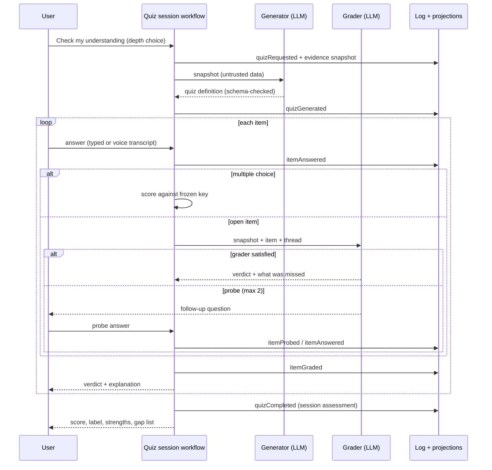
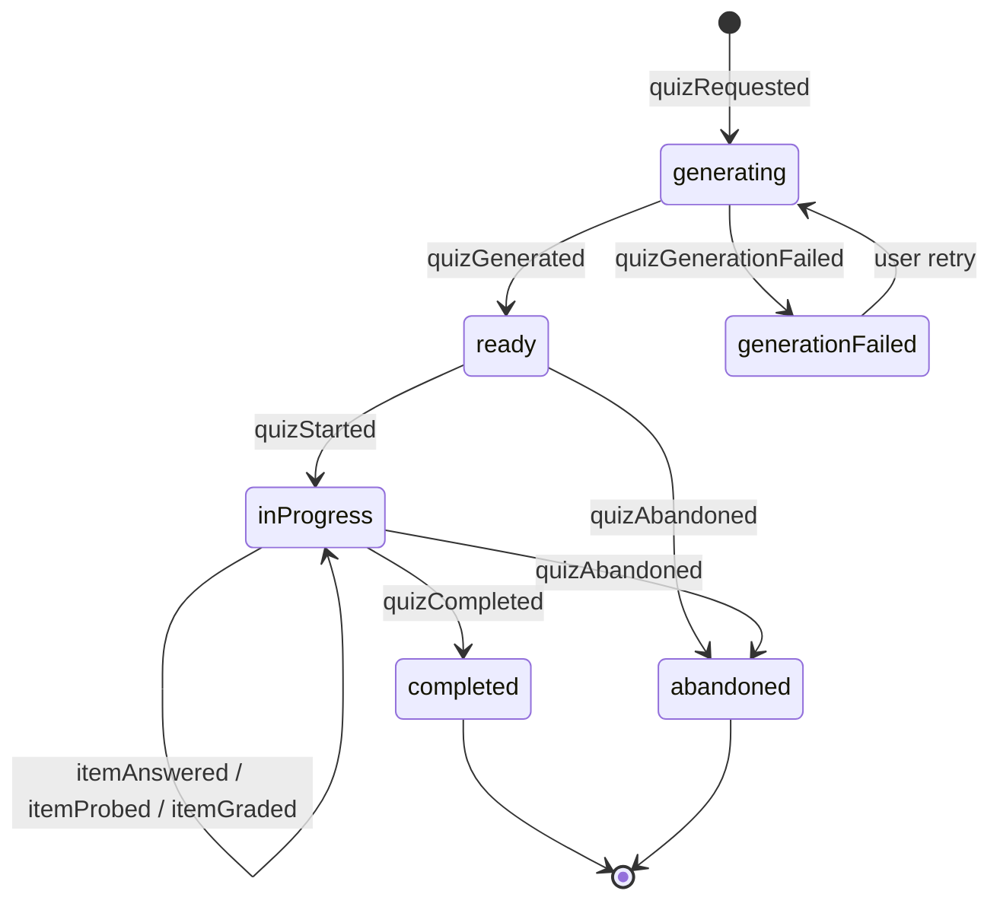

# AI Learning and Understanding Verification Agent — Implementation Plan

> **Revision 2026-07-21.** This plan was substantially simplified and
> re-centered on user-initiated quizzes. The earlier draft specified a
> checkpoint-driven verification pipeline with a cryptographic authority chain
> (signed attestations, control keys, sequence fences, deletion-GC receipts)
> and fail-closed human calibration gates. Both were deliberately descoped:
> Lotti's sync already runs among the user's own trusted devices, and grades
> are now accepted as clearly-labeled AI feedback. The previous draft and its
> expert-panel review log are preserved in git history on this file.

## Document map and decision authority

- This plan is the self-contained implementation blueprint. It owns component
  boundaries, sequencing, UX, test strategy, and work packages.
- [ADR 0031](../adr/0031-learning-verification-checkpoint-policy.md) owns when
  quizzes can start: manual-first entry, suggestion triggers, guards, and caps.
- [ADR 0032](../adr/0032-hybrid-understanding-evaluation.md) owns evidence
  snapshots, quiz generation, conversational grading with probes, and the
  model trust boundary.
- [ADR 0033](../adr/0033-learning-verification-session-persistence.md) owns
  events, artifacts, links, identity, sync, local boundaries, and deletion.
- [ADR 0034](../adr/0034-learning-understanding-rating.md) owns per-item
  verdicts, session scores/labels, honesty rules, and grade storage.
- Any change updates its owning ADR and every duplicated plan summary in the
  same change. Numeric values (question counts, weights, label bands, caps)
  are versioned hypotheses, not invariants.

## Contents

1. [Purpose](#1-purpose)
2. [Goals and non-goals](#2-goals-and-non-goals)
3. [Existing architecture fit](#3-existing-architecture-fit)
4. [Experience walkthrough](#4-experience-walkthrough)
5. [Architecture overview](#5-architecture-overview)
6. [Domain and data model](#6-domain-and-data-model)
7. [Evidence snapshots](#7-evidence-snapshots)
8. [Quiz generation](#8-quiz-generation)
9. [Grading and probing](#9-grading-and-probing)
10. [Feedback and grades](#10-feedback-and-grades)
11. [Triggering and suggestions](#11-triggering-and-suggestions)
12. [Voice answers](#12-voice-answers)
13. [Privacy and provider routing](#13-privacy-and-provider-routing)
14. [Failure modes](#14-failure-modes)
15. [Testing strategy](#15-testing-strategy)
16. [Phased delivery](#16-phased-delivery)
17. [Implementation work packages](#17-implementation-work-packages)
18. [Decision index](#18-decision-index)

## Canonical terminology

| Term | Canonical meaning |
| --- | --- |
| Verifier agent | Durable per-category agent identity created from the `learningVerifier` template. It owns quiz sessions for that category's tasks and selects the inference profile and privacy route. |
| Quiz session | One user-initiated run: frozen evidence snapshot, generated quiz definition, item threads, and a final assessment. Keyed by the UI-minted `quizRequestId`. |
| Evidence snapshot | Immutable, bounded bundle of task content sections with stable IDs and digests, captured before generation. Generation and grading read only this. |
| Quiz definition | Immutable generated quiz: tailored mix of multiple-choice and open items, each citing snapshot sections. |
| Item thread | Ordered answer and probe rounds for one item, ending in a grade or a skip/reveal. |
| Probe | Grader follow-up question asked before judging an ambiguous or shallow answer. Bounded per item. |
| Grade | Per-item verdict and score plus the session score/label, presented as AI feedback. Multiple choice is scored deterministically; open items by the grader. |
| Gap explanation | The "what you missed" text attached to any non-correct item and summarized at session end. |
| Suggestion | Optional later-phase non-modal card offering a quiz after a deterministic trigger. Runs zero inference before acceptance. |

## 1. Purpose

Work captured in Lotti — study notes, reading summaries, decisions, tasks done
with AI assistance — can look finished without the user being able to explain
it. This feature adds a per-category learning agent that turns any task into a
tailored quiz on demand: it freezes the task's content, generates questions
that fit that content, lets the user answer by text or voice, probes with
follow-ups when an answer is shallow, grades the session, and explains exactly
what was missed.

It is a learning aid, not an exam or a productivity gate. It must:

- be available from any task in one tap, with questions tailored to that
  task's actual content;
- evaluate only against content the system actually captured, and say so when
  content is thin or missing;
- probe before judging, the way a good tutor would, and explain gaps
  concretely instead of issuing generic criticism;
- present grades honestly as AI feedback about one session;
- remain dismissible, skippable, low-pressure, and free of comparison
  mechanics;
- preserve the boundary between user-owned journal facts and agent-generated
  interpretations.

## 2. Goals and non-goals

### Goals

1. Add a `learningVerifier` agent-template kind with a deterministic
   per-category identity.
2. Add a "Check my understanding" entry point on every task, with a
   quick-check or deep-dive depth choice.
3. Freeze an immutable evidence snapshot before generating, so the target
   cannot move during a session and citations stay checkable.
4. Generate tailored quizzes — multiple-choice and open questions across
   explain/predict/apply/debug/compare operations — scaled to content
   richness.
5. Grade conversationally: deterministic multiple-choice scoring, LLM grading
   for open answers, bounded follow-up probes before verdicts, and gap
   explanations for everything missed.
6. Support typed and spoken answers, reusing the existing transcription
   pipeline with an editable transcript.
7. Persist sessions, item threads, and assessments as auditable, syncable
   agent-domain facts with plain deletion and export.
8. Keep every model call tool-less, schema-constrained, and injection-resistant.

### Non-goals

- Calibration programs, human-rated corpora, or preregistered efficacy
  studies. Grades ship as clearly-labeled AI judgment; optional quality
  tracking can come later.
- Cryptographic event attestation, trusted-control keys, signed clock
  authority, or deletion-GC certificate protocols. Learning data uses the
  same sync trust model as every other Lotti entity.
- Spaced-repetition scheduling. Questions are freshly generated per session
  and are not usually repeated; "quiz me again" is a user action.
- Inspecting repositories or running commands. Workspace evidence arrives
  only through a later read-only, consented adapter phase.
- Reusing journal `RatingEntry` for machine grades, comparing users,
  leaderboards, streaks, or gating any workflow.
- Storing hidden chain-of-thought.

## 3. Existing architecture fit

The design extends existing agent capabilities rather than creating a parallel
runtime:

- The append-only `AgentMessageEntity`/`AgentLink` causal log remains the sole
  source of truth (ADR 0016). Quiz state is a projection; structured entities
  are immutable artifacts referenced by events.
- `AgentSyncService` remains the only production write path for synced
  agent-domain entities and links; convergence follows ADR 0018 with
  insert-or-verify content-addressed artifacts.
- Inference provider/profile selection and privacy confirmation use the
  existing agent runtime policy, resolved through the task's category.
- Generation and grading calls run through `ConversationRepository` with
  deterministic request keys, the standard timeout/cancellation policy, and
  existing token-usage provenance.
- Voice answers reuse the existing recording and transcription
  infrastructure.
- `WakeOrchestrator` is not involved: quiz sessions are user-interactive and
  foreground-only. Suggestions (later phase) are computed from projections on
  foreground, not from background wakes.
- The change-set confirmation boundary is untouched: the learning agent never
  modifies journal records.

## 4. Experience walkthrough

The core loop, from the user's chair:

1. Open any task — say, notes on a paper about spaced repetition, or a task
   where an agent helped build a retry mechanism. Tap **Check my
   understanding**. Choose **Quick check** (~3 questions) or **Deep dive**
   (~6–8), and see which provider/model will be used.
2. Lotti freezes the task content and generates a quiz tailored to it. Notes
   about a paper get comprehension and application questions; an engineering
   task gets mechanism, prediction, and debugging questions. Thin content
   yields fewer questions and says so.
3. Questions come one at a time. Multiple-choice answers get instant feedback
   with an explanation. Open questions accept typed or spoken answers —
   spoken ones show an editable transcript before submission.
4. If an open answer is shallow or ambiguous, the grader asks a follow-up
   ("What would happen if the second device submitted the same decision?")
   — up to two probes per item — before settling on a verdict. The user can
   always say "just tell me" to end probing, or skip/reveal an item.
5. After the last item: session score and label, what went well, and the gap
   list — a concrete explanation of each thing missed, citing the task
   content it comes from. From there: **Quiz me again**, review per-item
   threads, or flag **This grade seems wrong**.



## 5. Architecture overview

```mermaid
flowchart LR
  Task["Any task"] -->|Check my understanding| Entry["Quiz entry (depth + provider disclosure)"]
  Suggest["Deterministic suggestion (later phase)"] -.->|accepted| Entry
  Entry --> Snapshot["LearningEvidenceSnapshot (frozen)"]
  Snapshot --> Generator["QuizGenerator (tool-less LLM call)"]
  Generator --> Validate["Deterministic validation (schema, citations, keys)"]
  Validate --> Definition["LearningQuizDefinition (frozen)"]
  Definition --> Session["Quiz session workflow"]
  Session -->|MC answer| KeyScore["Deterministic key scoring"]
  Session -->|open answer| Grader["QuizGrader (tool-less LLM call)"]
  Grader -->|probe ≤ 2| Session
  Grader --> ItemGrade["Item grade + gap explanation"]
  KeyScore --> ItemGrade
  ItemGrade --> Assessment["Session assessment (score in code, label, gaps)"]
  Session --> Log["agent.sqlite via AgentSyncService"]
  Snapshot --> Log
  Definition --> Log
  Assessment --> Log
  Log --> Projections["Session / per-task history projections"]
```



### Component breakdown

| Component | Responsibility | Important boundary |
| --- | --- | --- |
| `LearningQuizEntryController` | Entry action on tasks: depth choice, provider disclosure, `quizRequestId` minting. | One request ID per user action, reused through retries. |
| `LearningEvidenceAssembler` | Collects task content through adapters, bounds and sections it, records truncation/missing sources, freezes the snapshot. | A missing source is recorded as missing, never invented. |
| `QuizGenerator` | One tool-less structured-output call producing the tailored quiz definition. | Snapshot is delimited untrusted data; no tools, no network. |
| `QuizDefinitionValidator` | Deterministic checks: schema, citation resolution, MC key membership, option uniqueness, count bounds; one repair call. | A quiz that fails validation is never shown. |
| `LearningQuizSessionWorkflow` | Runs the session: presents items, records answers/probes, requests grading, assembles the assessment. | User answers are durable before any grading call. |
| `QuizGrader` | Tool-less per-item grading call that may return bounded probes before a verdict. | Verdict/score accepted as issued after schema/range checks; probes capped. |
| `LearningQuizRepository` | Atomic append of events plus immutable artifacts/links through `AgentSyncService`. | Same-ID immutable artifacts are insert-or-verify; conflicts quarantined. |
| `LearningQuizProjection` | Folds events into open-session, per-task history, and category history views. | Rebuildable from the log; background refresh keeps last-rendered data. |
| `LearningSuggestionPolicy` (later) | Deterministic trigger/guard/cap evaluation for suggestion cards. | Zero inference before acceptance. |
| Quiz UI | Entry sheet, item cards, probe thread, voice capture, result view, history, settings. | Non-modal, skippable, no timers, design-system tokens. |

### Suggested feature layout

```text
lib/features/agents/
├── learning/
│   ├── model/          # snapshot, definition, attempt, grade, assessment values
│   ├── service/        # assembler, generator, validator, grader, suggestion policy
│   ├── workflow/       # interactive quiz session workflow
│   ├── state/          # Riverpod controllers/queries
│   └── ui/             # entry, item, probe, result, history, settings
├── model/              # new AgentDomainEntity/AgentLink variants and enums
├── database/           # conversion/query support
└── README.md           # updated to current runtime behavior as code ships
```

## 6. Domain and data model

Ownership: [ADR 0033](../adr/0033-learning-verification-session-persistence.md).

### Events

`LearningQuizEventEnvelope` in `AgentMessageMetadata`, closed union:

| Event | Emitted when | Key payload |
| --- | --- | --- |
| `quizRequested` | User starts a quiz (or accepts a suggestion). | `quizRequestId`, task ref, depth, scope. |
| `quizGenerated` | Definition validated and frozen. | definition artifact ref, snapshot ref. |
| `quizGenerationFailed` | Generation/repair failed. | reason code; enables durable retry UI. |
| `quizStarted` | First item shown. | session ref. |
| `itemAnswered` | User submits an answer or probe reply. | attempt artifact ref (item, round, modality). |
| `itemProbed` | Grader asks a follow-up. | probe text ref, item, round. |
| `itemGraded` | Verdict settled for an item. | item grade artifact ref. |
| `itemGradingFailed` | Grading call failed after retry. | item ref, reason; answer preserved. |
| `quizCompleted` | All items resolved. | assessment artifact ref. |
| `quizAbandoned` | User leaves the session for good. | session ref. |
| `suggestionOffered` / `suggestionDismissed` | Later phase. | deterministic suggestion ID, disposition. |
| `quizDeleted` | User deletes quiz history. | covered session/task/category selector. |

Causal order comes from the message DAG; timestamps are ordinary best-effort
`createdAt` values, as everywhere else in Lotti.

### Artifacts and links

Immutable `AgentDomainEntity` variants (full field lists in ADR 0033):

- `LearningQuizSessionEntity` — the per-run anchor linked to the task, ID
  equal to its `quizRequestId`; carries task ref, scope, and depth choice.
  No status field — lifecycle is projected from events.
- `LearningEvidenceSnapshotEntity` — sectioned content bundle with IDs,
  digests, source refs, truncation and missing-source markers.
- `LearningQuizDefinitionEntity` — items (type, prompt, MC options + key +
  explanation, open expected points, operation, citations, probe-worthiness
  flag) plus generator provenance (model, profile, prompt version).
- `LearningQuizAttemptEntity` — one answer or probe reply: item ID, round,
  text, modality, transcript provenance.
- `LearningQuizItemGradeEntity` — verdict, item score, gap explanation,
  citations.
- `LearningQuizAssessmentEntity` — session score, label, strengths, gap
  summary, and the weight/band versions that produced them.

Typed `AgentLink`s: session → task, session → snapshot, session → definition,
attempt → item thread, grade → thread, assessment → session.

### Identity

- `quizRequestId`: UUID v4 minted once per UI action; the session key.
- Content-addressed artifacts (snapshot, definition, grades, assessment):
  UUID v5 over canonical payload; insert-or-verify-identical on sync.
- Attempts: user-authored UUID v4; never deduplicated or superseded.
- If concurrent devices produce sibling definitions for one request, an
  engaged session (any attempt) wins presentation; equally unengaged siblings
  converge on lowest definition digest.

### Session lifecycle



Deletion (`quizDeleted`) can cover any state; projections hide covered
history and devices purge covered payloads on observing the event.

### Projections

- Session detail — each session renders as its own timeline in causal order:
  questions, answers and probe rounds, per-item verdicts with explanations,
  and the final assessment. Completed sessions replay this thread read-only.
- Open-session view (resume an in-progress quiz).
- Per-task quiz history (sessions, scores, gap lists) shown on the task.
- Per-category history for the verifier agent's detail view.

All rebuildable from the log; no mutable status rows.

## 7. Evidence snapshots

Ownership: [ADR 0032](../adr/0032-hybrid-understanding-evaluation.md).

### Adapters

| Adapter | Evidence | Phase |
| --- | --- | --- |
| `TaskContentEvidenceAdapter` | Task title, description/notes, checklist items, status history worth quizzing. | 1 |
| `LinkedEntryEvidenceAdapter` | Text and audio transcripts of linked journal entries. | 1 |
| `AgentReportEvidenceAdapter` | Agent reports, summaries, accepted proposals attached to the task. | 1 |
| `WorkspaceEvidenceAdapter` | Read-only, consented repository revisions, bounded diffs, symbol excerpts, test summaries. | later |

### Rules

1. Capture before generation; the session is bound to the snapshot digest.
2. Section the content with stable IDs; store a digest per section.
3. Bound total size; record truncation explicitly and prefer direct artifacts
   over summaries when both exist.
4. Record missing/empty sources rather than inventing content.
5. Treat all captured text as untrusted data end to end.
6. Thin content degrades gracefully: fewer questions, or an honest "not
   enough content here to quiz on" instead of filler questions. The
   generator receives the measured content richness and must respect it.

## 8. Quiz generation

Ownership: [ADR 0032](../adr/0032-hybrid-understanding-evaluation.md).

One tool-less, schema-constrained call. The generator is instructed to:

- infer the content kind (reading/study notes, engineering work, decision
  log, meeting notes, planning) and tailor tone and question mix to it;
- scale question count to the chosen depth and the content's richness
  (quick ≈ 3, deep ≈ 6–8, fewer when thin);
- mix item types: multiple-choice items with plausible distractors, exactly
  one keyed answer, and a written explanation; open items rotating across
  explain, predict, apply, debug, and compare where the content supports
  them;
- cite the snapshot sections each item is grounded in;
- mark items where a "why?" probe after a multiple-choice answer is worth
  asking;
- avoid answer-shaped wording, trick questions, and questions the snapshot
  cannot support.

Deterministic validation then checks schema, citation resolution, key
membership, option uniqueness, and count bounds; one repair call carries the
validation errors back. A quiz that still fails is a `quizGenerationFailed`
event with retry UI — never a shown quiz.

Questions are freshly generated per session. "Quiz me again" regenerates
against current content; there is no fixed question bank.

## 9. Grading and probing

Ownership: [ADR 0032](../adr/0032-hybrid-understanding-evaluation.md);
grade semantics in [ADR 0034](../adr/0034-learning-understanding-rating.md).

- **Multiple choice** is scored in code against the frozen key, instantly,
  with the stored explanation shown. If the item is probe-worthy, the grader
  may ask one "why did you choose that?" follow-up whose reply feeds the
  session's gap summary (it does not change the deterministic MC score).
- **Open items** go to the grader with the snapshot, the frozen item, and the
  full thread so far. The grader returns either a bounded probe (max 2 per
  item) or a final verdict (`correct` / `partial` / `missed`), an item score
  0–100, and a gap explanation citing snapshot sections. At the probe bound
  it must issue a verdict with what it has.
- The user can end probing anytime ("just tell me"), skip an item, or reveal
  the expected answer; skipped/revealed items are excluded from scores and
  still explained.
- Answers are durably appended (`itemAnswered`) before any grading call, so a
  crash or provider outage never loses user work; `itemGradingFailed`
  preserves the thread and offers retry.
- Trust boundary: both calls are tool-less with no network/shell/write
  capability; snapshot text, answers, and transcripts are delimited untrusted
  data; instructions inside them are ignored; outputs are schema-constrained;
  citations are validated against the snapshot; no chain-of-thought is
  requested or stored.

## 10. Feedback and grades

Ownership: [ADR 0034](../adr/0034-learning-understanding-rating.md).

- Per item: verdict, explanation of what was missed (or confirmation of what
  was right), and the evidence citations behind it.
- Session: score = weighted mean of answered items (MC weight 1, open weight
  2), label bands **Solid grasp** (≥ 85), **Getting there** (60–84),
  **Needs review** (< 60). Computed in code; versions stored with the
  assessment. All-skipped/revealed sessions get explanations, no score.
- Presentation order: what went well → gap list → per-item review → score
  and label. Grades are visibly AI-issued and session-scoped ("in this
  quiz"); numeric scores can be hidden by preference.
- **This grade seems wrong** records the disagreement with the session; it
  does not silently regrade. No leaderboards, streaks, cross-user
  comparison, or gating anywhere.
- Machine grades never touch journal `RatingEntry`.

## 11. Triggering and suggestions

Ownership: [ADR 0031](../adr/0031-learning-verification-checkpoint-policy.md).

Phase 1 is manual-only: the entry point exists on every task; preconditions
are quizzable content, configured inference for the category, and no other
open quiz for the task.

A later feature-flagged phase adds suggestions: after a task with substantial
content transitions to done, or a consequential change set resolves, a small
non-modal card offers a quiz. Guards: feature enabled (global + category),
foreground, not recording/in a modal, no open quiz, ≤ 2 suggestions per
rolling week, ≤ 1 per task completion; snooze/dismiss/disable always
available. Suggestions run zero inference before acceptance and never use
push notifications. Dedup across devices is best-effort via deterministic
suggestion IDs; a rare duplicate card resolves on sync.

## 12. Voice answers

- Answer recording reuses the existing audio recording and transcription
  pipeline.
- The transcript is shown and editable before submission; the submitted
  transcript is the answer of record, with modality and transcript provenance
  stored on the attempt.
- Raw audio is discarded after the transcript is accepted unless the user
  explicitly keeps it as a journal audio entry.
- Transcription quality issues are handled by the edit step, not by grading
  leniency heuristics; the grader is instructed to assess content, not
  disfluency.

## 13. Privacy and provider routing

- Quizzing a task sends its captured content to the category's configured
  inference provider — the same consent surface as existing AI features. The
  entry sheet shows the resolved provider/model before generation when
  content may leave the device.
- Suggestions reveal no generated content and spend no inference before
  acceptance.
- Synced learning artifacts contain task-derived content the user already
  syncs (snapshot sections, questions, answers, grades); device-local tables
  hold drafts and raw audio only.
- Quiz history is private to the user, exportable with agent data, and
  deletable per session, task, or category.
- No telemetry contains question text, answers, or grades.
- Future workspace evidence (code) adds separate root-scoped consent and
  secret redaction before any model call; it is out of scope until that
  phase.

## 14. Failure modes

| Failure or edge case | Required behavior |
| --- | --- |
| Task has too little content | Offer fewer questions or say "not enough content to quiz on"; never pad with filler. |
| Generation call fails or returns invalid schema after repair | `quizGenerationFailed` + retry UI; no quiz shown. |
| Provider offline mid-session | Preserve answers; queue/retry grading; session resumable. |
| Grading output invalid after repair | `itemGradingFailed`; thread preserved; retry affordance. |
| User abandons mid-quiz | Session resumable from the open-session projection; abandoning is explicit or after long inactivity, never data loss. |
| Task edited during a session | Session stays bound to its snapshot; a banner offers "quiz the updated task" as a new session. |
| Prompt injection in task content | All content is delimited untrusted data; tool-less calls; schema-constrained outputs; citation validation; adversarial fixtures in tests. |
| Very short but correct answer | Grade content, not length; probe if unsure. |
| Answer copied from visible task text | Acceptable — open-book by nature; the grader probes for understanding beyond restatement when the item warrants it. |
| Voice transcription errors | User edits the transcript before submission; modality recorded. |
| Duplicate session from double-tap/retry | `quizRequestId` reuse deduplicates; content-addressed artifacts insert-or-verify. |
| Concurrent devices generate siblings for one request | Engaged session wins; unengaged converge on lowest digest; attempts never discarded. |
| Grade feels wrong | "This grade seems wrong" records disagreement; user can regenerate or re-quiz; no silent regrade. |
| Repeated suggestion annoyance | Weekly cap, snooze, per-category and global disable; dismissals sync. |
| User deletes the task | Quiz history follows the app's deletion flow for linked agent data; snapshot copies are covered by `quizDeleted` selectors. |

## 15. Testing strategy

Standard repository testing rules apply (one test file per source file,
centralized mocks, fake time, meaningful assertions).

- **Unit**: snapshot sectioning/bounding/truncation; definition validation
  (citations, keys, counts, repair path); MC scoring; session score/label
  arithmetic incl. skip/reveal exclusion; suggestion policy guards/caps;
  projection folds from shuffled event orders; deletion coverage.
- **Model-contract fixtures**: golden request/response fixtures for the
  generator and grader schemas, including probe-then-verdict threads, the
  probe bound, "just tell me", and repair; adversarial snapshots with
  embedded instructions must not alter behavior.
- **Widget**: entry sheet (depth, provider disclosure), item cards (MC,
  open, probe thread), voice capture with editable transcript, result view
  (gap list first, hideable score), history views, background refresh
  keeping last-rendered data.
- **Integration**: full session against a fake inference server (generate →
  answer → probe → grade → complete); crash/resume mid-session; sync
  convergence of a completed session across two simulated devices.
- Analyzer zero-warning policy and `make l10n` for all new user-visible
  strings.

## 16. Phased delivery

### Phase 1 — Quiz any task (MVP)

- `learningVerifier` template kind, per-category identity, persistence graph,
  projections.
- Entry point on every task; snapshot assembly from task/linked-entry/agent
  evidence; generation + validation; conversational grading with probes;
  typed and voice answers; result view with gap list; per-task history;
  deletion/export.
- Done when: analyzer clean, targeted tests pass, a task with rich content
  yields a tailored quiz end-to-end offline against the fake server, and
  answers survive crash/retry.

### Phase 2 — More surfaces and suggestions

- Entry points on projects, Daily OS days, and agent reports.
- Feature-flagged suggestion cards with ADR 0031 guards and caps.
- "Quiz me again" affordance surfaced on tasks with previously missed items.

### Phase 3 — Workspace evidence

- Read-only `WorkspaceEvidenceAdapter` with root-scoped consent, bounded
  diffs/symbols/test summaries, and secret redaction before any model call.
- Engineering tasks gain code-grounded questions.

### Phase 4 — History insights and optional quality tracking

- Category-level view of recurring gap themes.
- Optional grade-quality tracking from "this grade seems wrong" reports and
  sampled self-review; only here does any calibration work return, and only
  as improvement input, never as a gate.

## 17. Implementation work packages

Each package is a reviewable PR with docs and targeted tests; later packages
depend on earlier contracts.

1. Model + persistence substrate: template kind, scope identity, event
   envelope, artifact/link variants, conversions, atomic repository writes,
   quarantine, projections.
2. Evidence assembly: adapters, sectioning, bounds, truncation/missing
   markers, snapshot freezing.
3. Generation: prompt + schema, `QuizDefinitionValidator`, repair path,
   failure events, fake-server fixtures.
4. Session workflow + grading: item threads, MC scoring, grader
   conversation with probe bounds, durable answers, failure/retry.
5. UI: entry sheet, item/probe cards, voice capture, result view, history,
   settings; localization for all ARB files.
6. Deletion/export coverage and per-task history integration.
7. Phase 2 surfaces + suggestion policy behind a feature flag.
8. Phase 3 workspace adapter with consent + redaction.

Every runtime package updates `lib/features/agents/README.md` to the
implemented state, passes analyzer with zero findings, and runs focused tests.

## 18. Decision index

- [ADR 0031](../adr/0031-learning-verification-checkpoint-policy.md) — when
  quizzes start: manual-first entry, suggestion triggers/guards/caps, no
  gating, no spaced-repetition scheduler.
- [ADR 0032](../adr/0032-hybrid-understanding-evaluation.md) — frozen
  snapshots, tailored generation, deterministic validation, conversational
  grading with bounded probes, LLM grade authority, injection resistance.
- [ADR 0033](../adr/0033-learning-verification-session-persistence.md) —
  events/artifacts/links on the existing agent log, identity, sync
  convergence, device-local boundaries, plain deletion.
- [ADR 0034](../adr/0034-learning-understanding-rating.md) — verdicts,
  session scores/labels, feedback-first presentation, honesty rules,
  storage separate from journal ratings.
