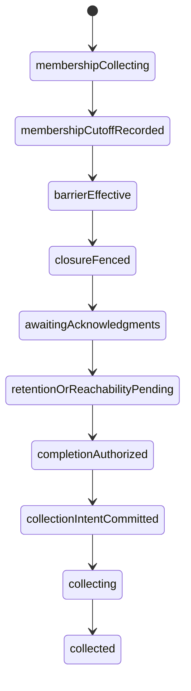
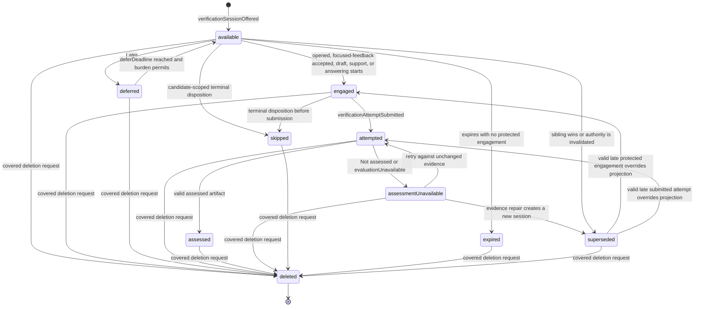

# AI Learning and Understanding Verification Agent — Implementation Plan

- Date: 2026-07-18
- Status: Revision under expert-panel re-review
- Scope: Planning and documentation only; no implementation is included
- Related ADRs: [0031](../adr/0031-learning-verification-checkpoint-policy.md), [0032](../adr/0032-hybrid-understanding-evaluation.md), [0033](../adr/0033-learning-verification-session-persistence.md), [0034](../adr/0034-learning-understanding-rating.md)

## Document map and decision authority

- This plan is the self-contained implementation blueprint. It owns component
  boundaries, sequencing, rollout hypotheses, test strategy, and work packages.
- ADR 0031 owns staged checkpoint eligibility, candidate invitations, preparation consent,
  burden, and the scheduling fold after eligibility is known. ADR 0032 owns exact-question blueprint admission,
  response-evaluation inputs/validation, assessment reliability, and calibration
  clearance. ADR 0033 owns
  event encoding, scope/candidate/session persistence, convergence,
  compatibility, and deletion. ADR 0034 owns rating availability, dimensions,
  labels, feedback, comparability, and the exact independent promotion- and
  schedule-eligibility decision semantics. Any change updates its owning ADR and
  every duplicated plan summary in the same change.
- The manual roadmap is a forward-looking user promise. It must remain less
  specific than the implementation plan and must never present an unshipped
  capability as available.
- Numeric cadence, burden, score, and calibration values in this draft are
  versioned implementation hypotheses unless an ADR explicitly calls them a
  semantic invariant. They are not established learning-science constants.

## Contents

1. [Purpose](#1-purpose)
2. [Goals and non-goals](#2-goals-and-non-goals)
3. [Existing architecture fit](#3-existing-architecture-fit)
4. [Architecture overview](#4-architecture-overview)
5. [Domain and data model](#5-domain-and-data-model)
6. [Checkpoint and prompting policy](#6-checkpoint-and-prompting-policy)
7. [Evidence assembly](#7-evidence-assembly)
8. [Evaluation logic](#8-evaluation-logic)
9. [Feedback and rating experience](#9-feedback-and-rating-experience)
10. [Interaction flows](#10-interaction-flows)
11. [Integration points](#11-integration-points)
12. [Failure modes and fallback strategies](#12-failure-modes-and-fallback-strategies)
13. [Privacy, security, and trust](#13-privacy-security-and-trust)
14. [Testing and calibration strategy](#14-testing-and-calibration-strategy)
15. [Phased delivery](#15-phased-delivery)
16. [Rollout gates and success measures](#16-rollout-gates-and-success-measures)
17. [Implementation work packages](#17-implementation-work-packages)
18. [Decision index](#18-decision-index)
19. [Appendix A — Expert-panel review log](#appendix-a--expert-panel-review-log)

## Canonical terminology

| Term | Canonical meaning |
| --- | --- |
| Verifier agent | Durable, scoped agent identity created from the `learningVerifier` template. It owns the causal verification log and provider/privacy route. |
| Checkpoint candidate | Privacy-safe semantic anchor for one meaningful source checkpoint. Host-specific authority and source detail live in separate candidate observations; candidate identity is stable across policy revisions. |
| Candidate action epoch | Deterministic branch key for the initial opportunity or one explicit reopen. Causal-prefix validation and the maximal-reopen fold make concurrent epochs converge without discarding protected engagement. |
| Generic invitation | Pre-evidence, pre-blueprint automatic offer shown when background preparation is not consented. It reveals no source-derived details and becomes a prepared session only after explicit acceptance. |
| Preflight priority | Deterministic signal/history-only eligibility score calculated before evidence access. |
| Offer-quality gate | Deterministic post-preparation gate over coverage/directness, blueprint-admission status, concept spacing, and branch engagement. |
| Learning scope | Synced opaque `LearningScopeRef` anchored to the verifier agent; never an absolute workspace path or cross-device consent grant. |
| Checkpoint coordinator | Deterministic checkpoint-eligibility and burden-control service. It observes durable source signals and appends candidate facts; it does not evaluate explanations. |
| Verification workflow | Interactive lifecycle that assembles evidence, offers a question, accepts a response, requests evaluation, and presents feedback. |
| Question blueprint | Immutable, pre-response contract defining the exact rendered question/locale/variant, objective, concepts, operation, difficulty, evidence criteria, assessable dimensions, and assistance conditions. A separate admission artifact records independent review of the complete contract. |
| Blueprint admission | Independent, calibrated review of every complete learner-facing blueprint for claim support/sufficiency, question alignment, dimension elicitation, difficulty, assistance fit, and answer leakage. It is distinct from checkpoint eligibility. |
| Admission authority | A materially agreeing direct admission result, or a group-stable semantic authority artifact created after explicit review settles disagreement. Stochastic reviewer-result identity and digest order never define session authority. |
| Admission-review policy set | Canonical authority-semantics and closed execution-compatibility contract embedded in preparation, review requests/nodes, sessions, and authority artifacts. Its full body—not a bare version label—partitions review lineages. |
| Preparation generation | Content-addressed branch within one candidate action epoch, keyed by source authority, authorization, assistance, and admission-review policy set. Policy migration creates a new generation without rewriting protected work. |
| Assistance selection | Immutable explicit choice or replayable background-default fold, including the exact preference revisions/frontier and fold policy that selected it. Mutable current preferences are never consulted when replaying preparation. |
| Reviewer disclosure manifest | Canonical, route-specific inventory and redacted-preview digest of every artifact/payload byte exposed to a human or model reviewer, separate from the result-lineage inputs used for settlement. |
| Evaluator | Tool-less semantic comparison call that proposes claim classifications and anchored dimension levels. |
| Validator | Deterministic code that validates structure, known evidence references, coverage declarations, score eligibility, caps, and reliability inputs. It does not decide whether free-text claims are semantically entailed by evidence. |
| Assessment | Immutable result for one response, blueprint, assistance condition, and evidence snapshot. It is not a trait, credential, or journal rating. |
| Dimension availability | `notObserved` means the blueprint did not elicit a dimension; `notRateable` means it did but evidence/system reliability could not support a judgment. Neither is a numeric level. |
| Evaluation generation | Content-addressed contract owning one attempt's route, authorization, required capabilities, request generation, deadline anchor/value, and evaluation/capability/unavailability/peer-membership policy versions. |
| Sync-peer enrollment revision | Immutable global-registry fact that an opaque sync host was enrolled, seen, retired, or restored. It defines the peer universe independently of whether that host can advertise learning capabilities. |
| Peer capability revision | Immutable capability advertisement, or explicit unknown bootstrap, for one enrolled opaque host. It cannot create or remove a peer from the enrollment universe. |
| Learning event author attestation | Persisted origin signature in the typed learning-event envelope. It binds the originating host/key epoch, vector-clock counter, causal instant, event payload, parents, and owned artifact/link refs; transport `originatingHostId` is not authentication. |
| Authenticated causal instant | Source-only, versioned reference to the verified origin-time claim in a signed source event, represented as a bounded interval. Later validation anchors are separate support and never change its identity. Causal order still comes from the DAG. |
| Authenticated deadline | Content-addressed boundary derived from a prior authenticated instant and pinned relative/UTC/local-time specification. The deadline is reached conservatively; same-event artifacts may declare only the derivation spec. |
| Time-validation support | Independently signed later clock evidence that makes one stable causal instant usable. Support arrival/revocation may change validity but cannot rewrite the instant or downstream IDs. |
| Trusted control key | Independently bootstrapped global key revision authorized for one or more closed capabilities: clock anchors, sequence fences, schedule-policy activation, activity-contract activation, or deletion-collection-policy activation. It is distinct from peer event-author keys. |
| Evaluation capability observation | Privacy-safe, generation-specific host fact stating whether the exact authorized evidence/route can execute locally; global unavailability requires one selected observation per active peer. |
| Evaluation unavailability | Non-assessment fact that the exact submitted route is unsupported/uncleared, required evidence became unavailable before valid inference, or its one repair was exhausted. It changes session presentation but creates no learner rating/history row. |
| Review timing basis | Immutable contract over the source attempt and, when present, the latest qualifying learning exposure. Its authenticated deadline never derives from evaluator/result latency. |
| Learning-activity completion | Typed, actively produced learner practice tied to exactly one concept and a registered source completion contract. Passive views and model output do not qualify; its owning event supplies time. |
| Support exposure | Typed learner-visible support or feedback with exact concept/source provenance and cognitive class. Answer-bearing exposure can qualify an attempt or postpone a quiet boundary but never counts as active learning completion. |
| Registered activity contract | Immutable globally activated contract that defines an external workflow's exact completion predicate, actor/time authority, concept rule, and assistance provenance. Unknown or incompatible contracts fail closed. |
| Schedule source lineage | Policy-invariant identity for one scope, exact concept, and source learner attempt. Evaluation request, assessment group, rubric, audit, selection, exposure, timing, and policy revisions remain children of this lineage. |
| Review-due opportunity | Stable group derived only from the schedule source lineage. Historical selection/timing/policy variants fold to at most one effective automatic due; protected engagement suppresses all automatic siblings. |
| Concept-review history | Projection of concepts and operations demonstrated in individual checks. It is not a mastery model. |
| Evidence manifest | Synced, privacy-safe list of source revisions, digests, coverage, truncation, and availability. |
| Evidence cache | Device-local, nonsynced content required to evaluate external workspace evidence. |

## 1. Purpose

AI-assisted work can produce correct artifacts without leaving the user able to
explain why those artifacts work. This feature adds a long-lived verification
agent that asks the user to explain selected concepts in their own words,
compares that explanation with a fixed snapshot of the work, identifies gaps,
and returns an evidence-backed understanding assessment.

The feature is a learning aid, not an exam or a productivity gate. It must:

- create retrieval and self-explanation opportunities at meaningful moments;
- evaluate only against evidence the system actually captured;
- distinguish missing evidence from missing understanding;
- provide small, actionable next steps instead of generic criticism;
- remain dismissible, deferrable, accessible, and low-frequency by default;
- preserve the boundary between user-owned journal facts and agent-generated
  interpretations.

## 2. Goals and non-goals

### Goals

1. Add a `learningVerifier` agent-template kind and an independently testable
   verification workflow.
2. Normalize checkpoints from Lotti workflows and, when explicitly connected,
   external development workflows.
3. Capture an immutable evidence snapshot before asking a question, so the
   target cannot move during evaluation.
4. Prompt for explanation, prediction, trade-off analysis, or debugging in the
   user's own words.
5. Evaluate semantic correctness with model-based blueprint admission and
   response comparison while keeping evidence inventory, admission-output
   validation/final-policy selection, score calculation, caps, and fallback
   behavior deterministic.
6. Persist sessions, attempts, assessments, and dispositions as auditable,
   syncable agent-domain facts.
7. Surface a multidimensional rating, assessment reliability, evidence
   references, gaps, and a concrete follow-up activity.
8. Support phased rollout, calibration against human judgments, and measurable
   burden controls.

### Non-goals

- Proving general expertise or replacing an interview, course, or human mentor.
- Inspecting a repository, running commands, or reading files without an
  explicit host-provided evidence adapter and workspace consent.
- Storing or exposing hidden chain-of-thought.
- Blocking task completion, proposal confirmation, commits, or pull requests by
  default.
- Reusing the journal-domain `RatingEntry` model for machine-generated
  assessments. Subjective user ratings and evidence-based assessments have
  different semantics.
- Comparing users, publishing leaderboards, or turning ratings into a punitive
  performance metric.
- Automatically changing source code, tasks, or other user-owned records.

## 3. Existing architecture fit

The design extends existing agent capabilities rather than creating a parallel
runtime:

- `WakeOrchestrator` remains responsible for content-free background agent
  wakes. It never presents an interactive prompt or carries evidence/question
  content.
- `AgentSyncService` remains the only production write path for synced
  agent-domain entities and links.
- `agent.sqlite` continues to hold agent identities, immutable messages,
  payloads, reports, wake provenance, and interaction sessions.
- The append-only `AgentMessageEntity`/`AgentLink` causal log is the sole source
  of truth for verification state, following ADR 0016. Structured verification
  entities are immutable artifacts referenced by causal events; they are not an
  alternative event stream.
- Inference provider/profile selection, privacy confirmation, and local/cloud
  routing use the existing agent runtime policy.
- Existing task, project, day, and event workflows emit normalized checkpoint
  signals after their own durable work completes. The verification coordinator
  consumes those signals without owning those workflows.
- The current change-set confirmation boundary remains intact: the verifier
  can explain and assess, but cannot apply changes to the journal database.

### Hard evidence boundary

Lotti knows its own tasks, agent reports, accepted proposals, linked journal
entries, and recorded test or analysis summaries only when they are present in
Lotti. It does not inherently know the current state of an external source
repository.

Actual code comparison therefore requires a `WorkspaceEvidenceAdapter` supplied
by the host workflow. The adapter is explicitly scoped to a consented workspace
and returns a bounded snapshot; the learning agent receives no arbitrary shell
or filesystem tool. When no adapter is connected, the UI must say that the
assessment covers Lotti-managed evidence only.

### Verifier identity and scope

One learning-agent identity is deterministically created per `LearningScopeRef`:

- a non-interactive user-global policy scope with stable ID `learning-global`;
- a Lotti category for task/project/event work;
- a Daily OS planning scope;
- or an opaque external workspace ID mapped to a local root only on devices
  where the user granted access.

The agent ID is a UUID v5 over a dedicated namespace plus the canonical encoded
scope type and ID. The scope selects the inference profile, privacy policy,
burden budget, and concept-review history. Absolute workspace paths are never
synced; manifests use opaque workspace IDs and normalized root-relative paths.
The canonical synced shape is:

```text
LearningScopeRef(schemaVersion, scopeType, opaqueScopeId)
```

`scopeType` is `global`, `category`, `dailyOs`, or `externalWorkspace`; Daily OS
uses `daily-os`. The global identity owns cross-scope preferences, the burden-
projection namespace, the append-only opaque sync-peer enrollment roster, and
the separate capability-advertisement registry;
authoritative burden events remain in their scoped logs. It never owns evidence
or sessions. Display labels are resolved metadata
and never participate in identity. The agent configuration references a durable
`LearningVerifierScopeEntity`, and candidate artifacts copy its ID/digest for
validated query acceleration, so scope can be recovered after restart rather
than inferred from a non-reversible UUID. Each device keeps a nonsynced
`learning_workspace_scope_binding` from an external `opaqueScopeId` to a local
root and its purpose-specific consent records. Revoking that binding prevents
new capture and deletes its local drafts, original-response cache, and evidence
cache; it does not silently delete already-synced redacted history.
The implementation must audit every exhaustive `AgentTemplateKind` switch when
adding `learningVerifier`.

## 4. Architecture overview

```mermaid
flowchart LR
  subgraph Sources["Checkpoint sources"]
    Task["Task/project/day/event workflows"]
    Decisions["Resolved agent change sets"]
    Manual["Verify now"]
    External["Consented development-workflow adapter"]
  end

  Sources --> Signals["LearningWorkflowSignal"]
  Trust["Trust & control registry"] --> Signals
  Signals --> Coordinator["LearningCheckpointCoordinator"]
  Coordinator --> EventLog["Candidate artifact + causal event"]
  EventLog --> Policy["Preflight guards + invitation priority"]
  Policy -->|background preparation consent| Evidence["LearningEvidenceAssembler"]
  Policy -->|automatic, no preparation consent| Invitation["Generic invitation"]
  Invitation -->|Explain now or Open-book| Evidence
  Policy -->|explicit Verify now + manual authority| Evidence
  Evidence --> Snapshot["Immutable evidence snapshot"]
  Snapshot --> Blueprint["Concept selection + question blueprint"]
  Blueprint --> Admission["Independent blueprint-admission audit"]
  Admission -->|settled| FinalPolicy["Admission result + concept spacing + final eligibility"]
  Admission -->|material disagreement| AdmissionReview["Explicit admission review"]
  AdmissionReview -->|confirmed| FinalPolicy
  AdmissionReview -->|blocked| Blocked["Candidate evidence blocked"]
  FinalPolicy --> Session["LearningVerificationSession"]
  Session --> Prompt["In-context prompt card"]
  Prompt --> Attempt["User explanation"]
  Attempt --> Evaluator["HybridUnderstandingEvaluator"]
  Snapshot --> Evaluator
  Evaluator --> Validator["Deterministic validation and scoring"]
  Validator --> Assessment["Assessment + actionable feedback"]
  Assessment --> Projection["Pending and concept-review projections"]
  Projection --> ScheduleAuthority["Schedule authority coordinator"]
  ActivityRegistry["Learning activity registry"] --> ScheduleAuthority
  ScheduleAuthority --> Scheduler["Eligibility scheduler"]
  Scheduler --> Policy

  EventLog --> Gc["Deletion-GC coordinator"]
  Trust --> Gc

  EventLog --> AgentDB["agent.sqlite via AgentSyncService"]
  Snapshot --> AgentDB
  Session --> AgentDB
  Attempt --> AgentDB
  Assessment --> AgentDB
  AgentDB --> Projection
```



### Component breakdown

| Component | Responsibility | Important boundary |
| --- | --- | --- |
| `LearningWorkflowSignalEmitter` | Maps completed workflow events to a stable signal contract. | Emits after the source event is durable; never prompts directly. |
| `LearningTrustAndControlRegistry` | Folds peer-author and trusted-control key revisions, signed clock anchors, sequence fences, and bounded compromise invalidations in the global policy scope. | Trust roots and independent configuration authority are installed before learning events; ordinary learning events cannot bootstrap their own validators. |
| `LearningCheckpointCoordinator` | Deduplicates source signals, atomically appends candidate artifacts/events, and applies event-level guards and burden policy. | No model decides whether to interrupt the user. |
| `LearningEligibilityScheduler` | Re-evaluates deferred/available candidates on projection changes, foreground/resume, and deterministic due-time wakes. | Background wakes append or re-evaluate content-free facts only; presentation waits for the next foreground. |
| `CheckpointPolicy` | Applies preflight eligibility/invitation priority before evidence, then concept spacing and evidence-quality eligibility after an admitted blueprint exists. | Versioned and deterministic for replay and tests; post-blueprint signals may suppress but never promote a failed preflight candidate. |
| `GenericInvitationWorkflow` | Offers a privacy-neutral automatic invitation when background evidence preparation is not consented and records acceptance or dismissal. | It never names an inferred concept, reads an adapter, or spends inference before acceptance. |
| `LearningEvidenceAssembler` | Requests evidence from registered adapters, redacts secrets, bounds content, and freezes a snapshot. | A missing source is recorded as missing, never silently invented. |
| `WorkspaceEvidenceAdapter` | Supplies repository revision, diff, relevant files or symbols, test/analyzer summaries, and architecture references from a consented workspace. | Read-only, root-scoped, no command execution by the verifier. |
| `ConceptSelector`, `QuestionBlueprintBuilder`, `BlueprintValidator`, and `BlueprintAdmissionAuditor` | Produce one default concept, objective, operation, difficulty, dimensions, criteria, and rendered question, then independently audit the complete item/evidence contract through durable request/result lifecycles. | Concept selection is a logical step inside the single blueprint-build operation, not a separate inference. Deterministic validation checks structure/references; semantic audit checks claim support, sufficiency, alignment, elicitation, difficulty, and answer leakage without editing the item. Duplicate calls are idempotent; admission disagreement fails closed. |
| `LearningVerificationWorkflow` | Creates the session, accepts attempts and dispositions, invokes evaluation, and persists results. | Separate from `WakeOrchestrator` because the turn is user-interactive. |
| `HybridUnderstandingEvaluator` | Compares the response with the frozen blueprint/reference rubric, classifies claims, identifies contradictions and omissions, and proposes feedback. | Treats explanations and evidence as untrusted data; no tools are exposed. |
| `AssessmentValidator` | Validates schema, evidence references, minimum-information/calibration/assistance eligibility, score ranges, caps, and reliability inputs; solely calculates rating availability, reliability, final score, formative label, transfer eligibility, and outcome. | The LLM cannot set reliability, score, label, or bypass caps. |
| `LearningScheduleAuthorityCoordinator` | Folds immutable learner-act lineages, signed policy generations, normalized selection authorities, timing bases, support exposures, and due opportunities. | One learner act has one protected opportunity regardless of evaluation, audit, rubric representation, support arrival, or policy replacement. |
| `LearningActivityRegistry` | Validates globally activated registered-workflow contracts and records typed learner-production completions and support exposures. | Unknown or incompatible contracts fail closed; passive exposure is never active learning completion. |
| `LearningDeletionGcCoordinator` | Builds signed membership cutoffs, barriers, closure manifests, proofs, collection intents, resumable local jobs, and post-execution receipts. | Logical invalidation is distinct from deletion; shared collection requires an explicit deletion request and completed proof protocol. |
| `LearningVerificationRepository` | Atomically appends causal events plus immutable referenced artifacts/links through `AgentSyncService`. | Same-ID immutable artifacts are insert-or-verify-identical; conflicting bytes are quarantined. |
| `LearningVerificationProjection` | Folds causal events into pending, deferred, assessed, unavailable, and concept-review views. | Rebuildable only from `AgentMessageEntity` and typed links; artifacts supply event data but not ordering. |
| Verification UI | Presents low-friction prompts, editor/voice capture, evidence scope, result, appeal, history, and settings. | No surprise modal; no full-screen loading during background refresh. |

### Suggested feature layout for implementation

This is a target module map, not code added by this plan:

```text
lib/features/agents/
├── learning/
│   ├── model/          # signals, evidence, rubric, projection values
│   ├── service/        # coordinator, policy, adapters, evaluator, validator
│   ├── workflow/       # interactive verification workflow
│   ├── state/          # Riverpod queries/controllers
│   └── ui/             # prompt, attempt, result, history, settings
├── model/              # new AgentDomainEntity/AgentLink variants and enums
├── database/           # conversion/query support
├── state/              # production wiring
└── README.md           # current runtime behavior after implementation
```

## 5. Domain and data model

### 5.1 Normalized checkpoint signal

`LearningWorkflowSignal` is an ephemeral input to the coordinator:

| Field | Type | Meaning |
| --- | --- | --- |
| `signalId` | string | Stable source-event ID within its owning workflow. It need not be globally unique. |
| `sourceWorkflow` | enum | `taskAgent`, `projectAgent`, `dayAgent`, `eventAgent`, `learningVerifier`, `manual`, or `externalDevelopment`. |
| `sourceWorkflowId` | string | Stable owning workflow instance ID, defined for every source variant below. |
| `sourceRunId` | string? | Optional durable execution/run ID with per-source nullability below. |
| `checkpointType` | enum | `meaningfulCompletion`, `decisionResolved`, `boundaryChanged`, `preFinalization`, `spacedReview`, or `manual`. |
| `sourceInstantRef` | `AuthenticatedCausalInstantRef` | Authenticated source-event instant supplied by the registered workflow clock bridge. Raw source or receipt timestamps are display-only and cannot control eligibility. |
| `changedSubjects` | list of refs | Entity, file, symbol, service, or decision references. |
| `riskSignals` | set | Security, data loss, migration, concurrency, privacy, public API, or none. |
| `noveltySignals` | set | New concept, new subsystem, new tool, changed architecture, or none. |
| `conceptHints` | list of `ConceptRef` | Optional only when the durable source already identifies a concept, such as a due spaced review; never model-inferred at signal time. |
| `evidenceAdapterIds` | list | Adapters authorized to build the snapshot. |
| `metadataSchema` | string | Registered allow-list schema for optional source-specific values. Unknown schemas fail closed. |
| `metadata` | map | Values validated by `metadataSchema`; secrets, free text, absolute paths, and unregistered keys are rejected before candidate persistence. |

For `externalDevelopment`, `sourceWorkflowId`, `sourceRunId`, and `signalId` are
stable opaque connector identifiers, never branch names, commit hashes, paths,
symbols, issue/PR titles, or other source text. Exact revision IDs and changed
subjects are external-source detail governed by the manifest-sync boundary
below.

Every source variant uses the following retry-stable identity contract. A source
emitter must not substitute a display label, timestamp, local row number, or a
new retry UUID for any of these fields.

| `sourceWorkflow` | `sourceWorkflowId` | `sourceRunId` | `signalId` |
| --- | --- | --- | --- |
| `taskAgent` | Durable task-agent/entity ID. | Nullable durable wake/change-set ID. | Durable source event/message ID for the checkpoint. |
| `projectAgent` | Durable project-agent/entity ID. | Nullable durable wake/change-set ID. | Durable source event/message ID for the checkpoint. |
| `dayAgent` | Durable Daily OS agent/day-scope ID. | Nullable durable wake ID. | Durable source event/message ID for the checkpoint. |
| `eventAgent` | Durable event-agent/entity ID. | Nullable durable wake/change-set ID. | Durable source event/message ID for the checkpoint. |
| `externalDevelopment` | Opaque connector workspace/workflow ID. | Nullable opaque connector build/commit/PR-run ID. | Opaque durable connector event ID, reused for retries. |
| `manual` | Verifier-agent ID that owns the UI request. | Null. | UUID v4 `manualRequestId` created once for the explicit UI action and reused through retry. |
| `learningVerifier` | Host-invariant effective `LearningSpacedReviewDueEntity.id`. | Null. | The effective due artifact's deterministic signal ID, equal to that artifact ID by contract. |

The source event identified by the owning workflow and `signalId` is durable in
that workflow. The coordinator validates consent before copying source-derived
metadata, then atomically writes the host-invariant
`LearningCheckpointCandidateEntity`, a host-specific
`LearningCandidateObservationEntity`, their typed links, and one
`checkpointCandidateObserved` message before doing model or adapter work. This
prevents a crash from silently losing an eligible checkpoint without placing
host authority or unauthorized source detail in the semantic candidate.

Identity and replay use four separate keys:

1. `SourceCheckpointKey` is canonical JSON of `verifierAgentId`, the complete
   `LearningScopeRef`, `sourceWorkflow`, `sourceWorkflowId`, `sourceRunId`,
   `signalId`, and `checkpointType`. `CheckpointCandidateId` is UUID v5 over that
   key and deliberately excludes policy version, so an upgrade cannot create a
   second semantic candidate for the same source event.
2. `CandidateActionEpochId` is UUID v5 over candidate ID and either the literal
   `initial` or a tagged closed source `reopen(dispositionOrInvitationId,
   digest)`. Duplicate reopens of the same closure produce one epoch; a later
   closure necessarily produces another. A reopen is validated against its
   event's causal prefix: the named source must close the candidate in that
   prefix, and the event records that observed frontier. Among causally maximal
   reopen events, a causally later event dominates; concurrent unengaged epochs
   converge on the lowest action-epoch ID. Any concurrently engaged epoch is
   retained as a parallel protected branch, while the lowest engaged epoch is
   the canonical presentation/current epoch and no further prompt is offered.
   Actions validate against the epoch that was current in their own causal
   prefix and their source surface, not a later merged projection. The canonical
   current epoch ID is persisted in the candidate projection; every policy
   decision, invitation, session, disposition, and `candidateReopened` event
   persists its own epoch.
3. `CandidatePolicyDecisionId` is content-addressed over candidate ID, action
   epoch ID, policy version, decision stage, canonical policy inputs, and the
   deterministic decision output. Policy upgrades append
   a new decision only after an explicit `candidatePolicyReevaluationRequested`
   event; they never replay all historical source events implicitly.
4. Evidence and question generation may diverge across devices. Each resulting
   session branch is content-addressed over its complete canonical immutable
   payload, including candidate/source/scope references, staged policy-decision
   IDs and digests, evidence and blueprint digests, the settled admission
   authority, authorization/privacy/inference-profile inputs, concept selection,
   availability/expiry policy inputs, and schema version. Only `id`, derived
   `artifactDigest`, and the sync envelope are excluded. The session therefore cannot reuse an ID when any body
   byte changes.

Correctness is idempotency-first, matching ADR 0018's currently implementable
convergence path. A connected device may claim a best-effort, device-local
execution slot, but no cross-device lease is assumed. Duplicate blueprint or
evaluation calls therefore remain legal: immutable artifacts and deterministic
request keys deduplicate equal work, while stochastic results receive separate
IDs and converge. A future soft coordinator may reduce cost and duplicate work
without changing correctness.

Branch reconciliation is engagement-aware. Once any branch has an accepted
invitation, saved draft, submitted attempt, or assessment, all unopened branches
for that candidate are hidden and may be superseded; the engaged branch is never
superseded by digest order. If concurrent devices create multiple engaged
branches, all user-authored attempts remain first-class history, the candidate
produces no further prompt, and the UI groups the branches for optional audit.
Only equally unengaged branches use the lowest validated
`(manifestDigest, pinnedAdmissionAuthorityDigest, sessionId)` tuple as a final tie-break.
Only settled, materially agreeing admission authority enters that comparator;
digest order never chooses between conflicting semantic admission results.

### 5.2 Immutable verification graph

#### Authoritative causal event vocabulary

The only authoritative order is a chain/DAG of `AgentMessageEntity` events. The
implementation adds a nullable, typed `learningVerificationEvent` field to
`AgentMessageMetadata`; using a generic metadata map or `operationId` is not
permitted. Its compact envelope wraps a discriminated payload union; variants
carry required fields rather than one bag of nullable IDs:

```text
C(value) = canonicalPayloadBytesV1(value)
D(domain, value) = SHA256(UTF8(domain) || 0x00 || C(value))

LearningVerificationEventEnvelope(
  schemaVersion,
  scopeRef,
  claimedCausalInstant(clockDomainId, physicalUtcMicros, logicalCounter,
                       uncertaintyMicros, authenticatedTimePolicyRef),
  authorAttestation,
  event: LearningVerificationEventPayload
)

LearningEventAuthorAttestation(
  unsignedBody = AuthorAttestationUnsignedBodyV1(
    schemaVersion,
    signatureAlgorithm = ed25519,
    hostId,
    authorKeyRevisionRef,
    keyEpoch,
    authorVectorCounter,
    authorTimeChain = continue(priorAuthorAttestationRef)
                    | authorizedReset,
    priorTrustedClockAnchorRef,
    messageCommitmentDigest),
  signature = Ed25519.Sign(
    authorPrivateKey,
    D("lotti.learning.author-attestation-signature.v1", unsignedBody)),
  digest = D("lotti.learning.author-attestation-record.v1",
             (unsignedBody, signature))
)

AuthenticatedCausalInstantRefV2(
  sourceMessageId,
  sourceMessageCommitmentDigest,
  sourceEventPayloadDigest,
  authorAttestationDigest,
  clockDomainId,
  earliestUtcMicros,
  latestUtcMicros,
  authenticatedTimePolicyRef,
  digest = D("lotti.learning.authenticated-causal-instant.v2",
             all preceding fields)
)

TrustedClockAnchorRef(
  unsignedBody = TrustedClockAnchorUnsignedBodyV1(
    schemaVersion,
    clockDomainId,
    authorityId,
    authorityKeyRevisionRef,
    authorityKeyEpoch,
    anchorSequence,
    priorAnchorRef?,
    anchorEventId,
    coveredEventFrontierRef,
    physicalUtcMicros,
    uncertaintyMicros,
    timeAuthorityPolicyRef),
  signature = Ed25519.Sign(
    authorityPrivateKey,
    D("lotti.learning.clock-anchor-signature.v1", unsignedBody)),
  digest = D("lotti.learning.clock-anchor-record.v1",
             (unsignedBody, signature))
)

TimeValidationSupportEntity(
  schemaVersion,
  authenticatedCausalInstantRef,
  validationClockAnchorRef,
  authenticatedTimePolicyRef,
  observedClockAuthorityFrontierRef
)

TimeValidationDecisionRef(
  authenticatedCausalInstantRef,
  observedClockAuthorityFrontierRef,
  orderedTimeValidationSupportRefs,
  authenticatedTimePolicyRef
)

DeadlineDerivationSpecV1 =
    relative(durationMicros, baseEdge = latest)
  | explicitUtc(targetUtcMicros)
  | explicitLocal(localDateTime, timeZoneId, tzdbVersion, overlapChoice)

AuthenticatedDeadlineRef(
  schemaVersion,
  sourceArtifactRefAndField,
  baseInstantRef,
  derivationSpec,
  canonicalBoundaryUtcMicros,
  authenticatedTimePolicyRef,
  deadlinePolicyRef,
  digest = D("lotti.learning.authenticated-deadline.v1",
             all preceding fields)
)

ArtifactRef(entityType, id, digest)
LinkRef(linkType, id, fromId, toId, digest)
```

All later uses of `AuthenticatedCausalInstantRef` in this plan mean the V2
source-only schema above; V1 bytes, if encountered during migration, remain
audit-only and cannot authorize deadlines, scheduling, membership, or GC.

`canonicalPayloadBytesV1` is a pinned, cross-platform encoding. It rejects
unknown or duplicate fields, preserves exact UTF-8 strings, represents integers
losslessly, encodes explicit nulls, and requires every semantic set/reference
collection to be sorted by its declared comparator. Derived IDs/digests,
signatures, and sync-envelope fields are excluded unless the schema above names
them. Golden bytes are part of the compatibility suite.

The exact message commitment is:

```text
MessageCommitmentBodyV1(
  envelopeSchemaVersion,
  messageId,
  agentId,
  threadId,
  messageKind,
  createdAt,
  scopeRef,
  claimedCausalInstant,
  canonicalVectorClock,
  orderedCausalParentMessageRefs,
  completeDiscriminatedEventPayload,
  orderedNewlyOwnedArtifactRefs,
  orderedNewlyOwnedLinkRefs
)

messageCommitmentDigest = D(
  "lotti.learning.message-commitment.v1",
  MessageCommitmentBodyV1)

sourceEventPayloadDigest = D(
  "lotti.learning.source-event-payload.v1",
  (envelopeSchemaVersion, scopeRef, claimedCausalInstant,
   completeDiscriminatedEventPayload))
```

`createdAt` is signed only for display/diagnostics. `anchorEventId` is a
preallocated, non-content-derived ID and may not include an owning message or
attestation digest; this prevents an anchor/message commitment cycle. Every
unsigned attestation or anchor field is covered by its exact domain-separated
signature input, and the stored record digest also covers the signature.

Every same-log frontier embedded in an event or in any artifact owned by that
event MUST equal a fully resolved strict parent-prefix of the owning message.
It excludes the owning message, every sibling artifact/link created by that
message, and every future message. Cross-log frontiers use their separately
declared proof contract. The atomic validator rejects unresolved tips,
non-ancestor members, sibling/self references, and a frontier whose canonical
tip set or ancestor-closure digest does not recompute. This universal rule
applies to key, time, activation, evaluation, audit, schedule, deletion, and GC
frontiers; a per-entity section cannot weaken it.

`messagePrev`/`prevMessageId` provides causal order. Wall-clock comparisons use
only an `AuthenticatedCausalInstantRef`; `AgentMessageEntity.createdAt` is a
signed input to that validation but is never trusted independently. Effective
times use `AuthenticatedDeadlineRef`. An artifact created by an event may carry
only its `DeadlineDerivationSpecV1`; it may not embed a deadline or instant
derived from that same owning event. The derived ref becomes available after
the append and may be referenced by projections or later artifacts.
Free text never lives in this envelope. System transitions use message kind
`system`; user actions use kind `user`. The conditional kind shown below is part
of validation, not documentation shorthand. This table is the complete initial
union contract:

| Variant | Allowed message kind | Required payload after envelope `scopeRef` |
| --- | --- | --- |
| `learningTrustedControlKeyChanged` | `system` for genesis/rotation; `user` for recovery/revocation | `trustedControlKeyRevisionArtifactRef`, exact authority/signature refs required by its tagged variant (global policy scope only) |
| `learningTrustedControlKeyCompromiseInvalidated` | `user` with unaffected-control-key authorization; `system` through independently authenticated configuration bridge | `trustedControlKeyCompromiseInvalidationArtifactRef`, exact authorization proof (global policy scope only) |
| `learningTrustedClockAnchorRecorded` | `system` through independently authenticated clock bridge | `trustedClockAnchorArtifactRef`, `controlKeyRevisionRef` (global policy scope only) |
| `learningSignedSequenceFenceRecorded` | `system` through independently authenticated control bridge | `signedSequenceFenceArtifactRef`, `controlKeyRevisionRef`, `fenceDomain` (global policy scope only) |
| `schedulePolicyGenerationRecorded` | `system` | `schedulePolicyGenerationArtifactRef`, `signedActivationArtifactRef`, complete predecessor-maxima refs (global policy scope only) |
| `scheduleSourceLineageRecorded` | `system` | `scheduleSourceLineageArtifactRef`, `sourceAttemptRef` |
| `scheduleSelectionAuthorityRecorded` | `system` | `scheduleSourceLineageRef`, `scheduleSelectionAuthorityArtifactRef`, exact support-assessment refs |
| `learningActivityContractGenerationRecorded` | `system` | `registeredActivityContractArtifactRef`, `signedActivationArtifactRef`, complete predecessor-maxima refs (global policy scope only) |
| `deletionCollectionPolicyGenerationRecorded` | `system` | `deletionCollectionPolicyArtifactRef`, `signedActivationArtifactRef`, complete predecessor-maxima refs (global policy scope only) |
| `spacedReviewDueRecorded` | `system` | `conceptRef`, `scheduleSourceLineageKey`, `reviewDueOpportunityKey`, `scheduleSelectionAuthorityRef`, `reviewTimingBasisRef`, `spacedReviewDueArtifactRef`, `spacedReviewDueObservationArtifactRef` |
| `checkpointCandidateObserved` | `system` | `candidateId`, `candidateArtifactRef`, `observationArtifactRef` |
| `candidatePolicyEvaluated` | `system` | `candidateId`, `stage`, `decisionArtifactRef` (the artifact carries `suppressed`/`evidenceBlocked`) |
| `candidatePolicyReevaluationRequested` | `user` for `userRequested`; otherwise `system` | `candidateId`, `priorDecisionId`, `triggerReason = userRequested \| authorizationRestored \| providerCapabilityRestored \| policyVersionActivated`, `observedFrontier` |
| `genericInvitationOffered` | `system` | `candidateId`, `invitationArtifactRef` |
| `candidatePreparationAuthorized` | `system` for background consent; `user` for invitation acceptance/manual invocation | `candidateId`, `actionEpochId`, `preparationGenerationId`, complete `admissionReviewPolicySet(body, digest)`, `assistanceSelection = explicit(choice) \| backgroundDefault(choice, orderedContributingPreferenceRevisionRefs, observedPreferenceFrontierDigest, preferenceFoldPolicyVersion)`, `source = backgroundConsent(consentRevisionRef, authorizationSnapshotRef) \| invitationAcceptance(invitationArtifactRef, authorizationSnapshotRef) \| manualInvocation(manualRequestId, authorizationSnapshotRef)` |
| `evidenceSnapshotCaptured` | `system` | `candidateId`, `authorizationSnapshotId`, `evidenceSnapshotArtifactRef` |
| `questionBlueprintBuildRequested` | `system` | `candidateId`, `evidenceSnapshotId`, `buildRequestArtifactRef` |
| `questionBlueprintBuildCancelled` | `system` | `candidateId`, `buildRequestId`, `reasonCode` |
| `questionBlueprintBuildFailed` | `system` | `candidateId`, `buildRequestId`, `failureArtifactRef` |
| `questionBlueprintBuilt` | `system` | `candidateId`, `buildRequestId`, `questionBlueprintArtifactRef`, `executionObservationArtifactRef` |
| `questionBlueprintAdmissionRequested` | `system` | `candidateId`, `blueprintId`, `admissionRequestArtifactRef` |
| `questionBlueprintAdmissionCancelled` | `system` | `candidateId`, `blueprintId`, `admissionRequestId`, `reasonCode` |
| `questionBlueprintAdmissionFailed` | `system` | `candidateId`, `blueprintId`, `admissionRequestId`, `failureArtifactRef` |
| `questionBlueprintAdmissionRecorded` | `system` | `candidateId`, `blueprintId`, `admissionRequestId`, `admissionArtifactRef`, `executionObservationArtifactRef` |
| `questionBlueprintAdmissionReviewRequested` | `system` | `candidateId`, `blueprintId`, `admissionReviewRequestArtifactRef` |
| `questionBlueprintAdmissionReviewCancelled` | `system` or `user` | `candidateId`, `blueprintId`, `admissionReviewRequestId`, `reasonCode` |
| `questionBlueprintAdmissionReviewFailed` | `system` | `candidateId`, `blueprintId`, `admissionReviewRequestId`, `reviewFailureArtifactRef` |
| `questionBlueprintAdmissionReviewCompleted` | `system` | `candidateId`, `blueprintId`, `admissionReviewRequestId`, `admissionReviewArtifactRef`, `executionObservationArtifactRef` |
| `questionBlueprintAdmissionReviewSettled` | `system` | `candidateId`, `blueprintId`, `admissionReviewRequestId`, `observedReviewResultGroupFrontier`, `nodeStateDigest`, ordered agreeing `admissionReviewResultRefs`, `admissionReviewAuthorityArtifactRef` |
| `verificationSessionOffered` | `system` | `candidateId`, `sessionArtifactRef` |
| `sessionEngagementRecorded` | `user` | `candidateId`, `sessionId`, `engagementKind = opened \| dimensionOnlyAccepted(disclosureVersion) \| draftSaved \| supportOpened(supportExposureRef) \| answeringStarted` |
| `learningSupportExposureRecorded` | `user` | `supportExposureArtifactRef`; the authenticated instant comes only from this owning event |
| `verificationAttemptSubmitted` | `user` | `candidateId`, `sessionId`, `attemptArtifactRef` |
| `learningActivityCompletionRecorded` | `user` for `verifierPractice`; `system` for `registeredWorkflow` | `learningActivityCompletionArtifactRef`, exact source-event ref, one exact `ConceptRef`, and contract ref for `registeredWorkflow`; the artifact never embeds this owning event's instant |
| `learningActivityRecoveryBindingRecorded` | `system` | `learningActivityCompletionArtifactRef`, `scheduleSourceLineageKey`, `learningActivityRecoveryBindingArtifactRef` |
| `learningReviewReminderRecorded` | `user` | `learningReviewReminderArtifactRef`; reminder timing is independent of automatic schedule authority |
| `promptDispositionRecorded` | `user` | `candidateId`, `surface = invitation(invitationId) \| session(sessionId)`, `dispositionArtifactRef` |
| `learningSyncPeerEnrollmentChanged` | `system` for enrollment/heartbeat; `user` for explicit retirement/restoration | `syncPeerEnrollmentRevisionArtifactRef`, `sourceContext = enrolledFact(authoritativeRosterEventRef, observedEnrollmentFrontier) \| actionOwned` (global policy scope only) |
| `learningPeerCapabilityChanged` | `system` | `peerCapabilityRevisionArtifactRef`, `sourceContext = unknownBootstrap(migrationAuthorityRef, rosterProofRef, observedCapabilityFrontier) \| advertisedAction` (global policy scope only) |
| `learningPeerAuthorKeyChanged` | `system` for genesis/rotation; `user` for recovery/revocation | `peerAuthorKeyRevisionArtifactRef`, exact authority/signature refs required by its tagged variant (global policy scope only) |
| `learningPeerAuthorKeyCompromiseInvalidated` | `user` with unaffected-key authorization; `system` through independently authenticated configuration bridge | `peerAuthorKeyCompromiseInvalidationArtifactRef`, exact authorization proof (global policy scope only) |
| `timeValidationSupportRecorded` | `system` | `authenticatedCausalInstantRef`, `timeValidationSupportArtifactRef` |
| `evaluationRetryRequested` | `user` | `candidateId`, `sessionId`, `attemptId`, `priorGenerationId`, `priorUnavailabilityGroupDigest`, `selectedRoute`, `reasonCode` |
| `evaluationGenerationRecorded` | `system` | `candidateId`, `sessionId`, `attemptId`, `generationArtifactRef`, `source = attemptSubmission(attemptId) \| retry(retryRequestMessageId)` |
| `evaluationCapabilityObserved` | `system` | `candidateId`, `sessionId`, `attemptId`, `evaluationGenerationKey`, `capabilityObservationArtifactRef` |
| `evaluationActivePeerSnapshotRecorded` | `system` | `candidateId`, `sessionId`, `attemptId`, `evaluationGenerationKey`, `activePeerSnapshotArtifactRef` |
| `evaluationUnavailable` | `system` | `candidateId`, `sessionId`, `attemptId`, `unavailabilityArtifactRef` |
| `evaluationRequested` | `system` | `candidateId`, `sessionId`, `attemptId`, `evaluationRequestArtifactRef` |
| `evaluationCancelled` | `system` | `candidateId`, `sessionId`, `attemptId`, `evaluationRequestId`, `reasonCode` |
| `evaluationFailed` | `system` | `candidateId`, `sessionId`, `attemptId`, `evaluationRequestId`, `failureArtifactRef` |
| `assessmentProduced` | `system` | `candidateId`, `sessionId`, `attemptId`, `evaluationRequestId`, `assessmentArtifactRef`, `executionObservationArtifactRef` |
| `authorizationInvalidated` | `system` | `authorizationInvalidationArtifactRef` |
| `authorizationInvalidationApplied` | `system` | `authorizationInvalidationId`, `target = artifact(ArtifactRef) \| link(LinkRef)`, `invalidationMarkerArtifactRef` |
| `authorizationInvalidationAcknowledged` | `system` | `authorizationInvalidationId`, `invalidationAcknowledgmentArtifactRef` |
| `assessmentAppealed` | `user` | `candidateId`, `sessionId`, `assessmentId`, `appealArtifactRef` |
| `assessmentAuditSampleSelected` | `system` | `candidateId`, `sessionId`, `assessmentId`, `auditSampleArtifactRef` |
| `assessmentAuditRequested` | `system` or `user` | `candidateId`, `sessionId`, `assessmentAuditRequestArtifactRef` |
| `assessmentAuditCancelled` | `system` or `user` | `candidateId`, `sessionId`, `assessmentAuditRequestId`, `reasonCode` |
| `assessmentAuditFailed` | `system` | `candidateId`, `sessionId`, `assessmentAuditRequestId`, `reviewFailureArtifactRef` |
| `assessmentAuditCompleted` | `system` | `candidateId`, `sessionId`, `assessmentAuditRequestId`, `assessmentAuditArtifactRef`, `executionObservationArtifactRef` |
| `learningConsentChanged` | `user` | `consentRevisionArtifactRef` |
| `learningPreferencesChanged` | `user` | `preferenceRevisionArtifactRef` |
| `authorizationSnapshotRecorded` | `system` | `authorizationSnapshotArtifactRef`, `boundaryKind`, ordered `consentRevisionIds` |
| `candidateReopened` | `user` | `candidateId`, `closedSource = disposition(id, digest) \| invitationExpiry(id, digest)`, `observedFrontier`, recomputed `actionEpochId`, `reasonCode` |
| `sessionSuperseded` | `system` | `candidateId`, `sessionId`, `replacement = none \| session(replacementSessionId)`, `observedFrontier`, `reasonCode` |
| `verificationDeletionRequested` | `user` | `deletionRequestArtifactRef`, `deletionGcMembershipSnapshotArtifactRef` required for `allLearningData` and any request whose closure marks global peer/deletion-control configuration; absent otherwise |
| `verificationDeletionGcRequiredHostRecorded` | `system` | `deletionRequestArtifactRef`, `requiredHostAuthorityArtifactRef`, `source = initialSnapshot(snapshotRef) \| activationObservation(observationRef)` |
| `verificationDeletionGcActivationObserved` | `system` | `deletionRequestArtifactRef`, `requiredHostAuthorityArtifactRef`, `activationObservationArtifactRef` |
| `verificationDeletionGcMembershipReopenAuthorized` | `user` or independently authenticated configuration bridge | `deletionRequestArtifactRef`, `membershipReopenAuthorityArtifactRef`; the artifact carries only a deadline derivation spec, never a deadline/instant from this owning event |
| `verificationDeletionGcMembershipCutoffRecorded` | `system` | `deletionRequestArtifactRef`, `membershipCutoffArtifactRef`, `membershipCutoffDeadlineRef`, `authoritativeRegistryFenceRef`, `source = initial \| reopen(membershipReopenAuthorityRef)` |
| `verificationDeletionGcBarrierRecorded` | `system` | `deletionRequestArtifactRef`, `deletionGcMembershipBarrierArtifactRef` |
| `verificationDeletionGcClosureFenced` | `system` | `deletionRequestArtifactRef`, `closureManifestArtifactRef`, `closureGenerationArtifactRef`, `deletionClosureSignedSequenceFenceRef` |
| `verificationDeletionGcReachabilityProved` | `system` | `deletionRequestArtifactRef`, `closureGenerationArtifactRef`, `reachabilityProofArtifactRef` |
| `verificationDeletionGcRetentionAuthorityRecorded` | `system` | `deletionRequestArtifactRef`, `retentionProofAuthorityArtifactRef`, `retentionDeadlineRef` |
| `verificationDeletionGcRetentionObserved` | `system` | `deletionRequestArtifactRef`, `retentionProofAuthorityArtifactRef`, `retentionProofObservationArtifactRef` |
| `verificationDeletionMarkerApplied` | `system` | `deletionRequestId`, `target = artifact(ArtifactRef) \| link(LinkRef)`, `deletionMarkerArtifactRef` |
| `verificationDeletionAcknowledged` | `system` | `deletionRequestId`, `acknowledgmentAuthorityArtifactRef`, `acknowledgmentObservationArtifactRef` |
| `verificationDeletionGcCompletionAuthorized` | `system` | `deletionRequestArtifactRef`, `deletionGcCompletionArtifactRef`, `effectiveMembershipBarrierArtifactRef`, `closureGenerationArtifactRef` |
| `verificationDeletionGcCollectionCommitted` | `system` | `deletionRequestArtifactRef`, `deletionGcCompletionArtifactRef`, `deletionGcCollectionIntentArtifactRef` |
| `verificationDeletionGcCollected` | `system` | `deletionRequestArtifactRef`, `deletionGcCollectionIntentArtifactRef`, `deletionGcCollectionReceiptArtifactRef` |

Every authoritative learning event persists its origin attestation inside
`AgentMessageMetadata.learningVerificationEvent`. The validator recomputes the
exact `MessageCommitmentBodyV1`, requires
`vectorClock[hostId] == authorVectorCounter`, verifies proof of possession and
the host/key epoch that was authorized at that event's frontier, and preserves
the original attestation through relay, bundles, and backfill. Nullable
`SyncMessage.originatingHostId` remains sequence/routing metadata only. Key
rotation does not rewrite valid history; a compromise requires an explicit
counter/frontier-bounded invalidation. Legacy unsigned learning events are
audit-only and can never be retroactively signed.

An `AuthenticatedCausalInstantRefV2` is a non-circular, source-only derived
reference to that
verified claim and its versioned uncertainty interval. It is embedded only in
later dependent artifacts, not in the signed source event.
`earliestUtcMicros = physicalUtcMicros - uncertaintyMicros` and
`latestUtcMicros = physicalUtcMicros + uncertaintyMicros`; overflow, negative
uncertainty, or a value above the pinned policy maximum is invalid. The validator
recomputes both edges from the signed claim and rejects stored interval bytes
that differ; they are not independently asserted values.
`sourceEventPayloadDigest` covers the complete discriminated event payload and
claimed instant but excludes `authorAttestation`; the separately stored
attestation digest commits the signed proof. A later validation anchor lives
only in `TimeValidationSupportEntity`, so two observers using different valid
anchors derive the same instant, deadline, and downstream semantic IDs.
External workflow,
roster, or configuration sources must expose an equivalent durable origin
attestation through a registered clock-domain bridge. An unresolved predecessor,
credential epoch, clock anchor, or bridge yields `timeUnresolved`; it is not
silently replaced with local receipt time.
`TrustedClockAnchorRef` is issued by a policy-registered independently
verifiable time authority (for example, an authenticated sync-service event),
persists the authority key epoch/signature and uncertainty, and is retained with
every dependent attestation. An offline HLC advances from its latest prior anchor
only inside the policy's maximum offline age, and the later validation anchor
bounds future skew. An instant becomes authoritative only when its historical
author key and time chain validate, its HLC strictly advances or uses an
authorized genesis/recovery reset, its prior anchor predates it, at least one
current later support bounds future skew, and no required clock-authority anchor
at the complete observed frontier contradicts it. Missing, conflicting,
revoked, or incomplete clock authority yields `timeUnresolved`/`timeFault`;
receipt time never becomes an unrecorded fallback. A closure that must freeze
the proof set references a separate `TimeValidationDecisionRef`; semantic
entities never hash recorder-selected support refs.

The conservative time predicates are exact and overflow-checked:

```text
source.latestUtcMicros - priorAnchor.earliestUtcMicros
  <= authenticatedTimePolicy.maxOfflineAnchorAgeMicros

source.latestUtcMicros
  <= validationAnchor.earliestUtcMicros
     + authenticatedTimePolicy.maxFutureSkewMicros
```

`TimeValidationSupportEntity` is content-addressed with domain
`lotti.learning.time-validation-support.v1`; adding support changes only the
validity fold. `TimeValidationDecisionRef` is used only when a historical
closure must pin one complete observed clock-authority frontier/support set.

Relative deadlines use `baseInstant.latestUtcMicros + durationMicros` and are
reached only when trusted current time's earliest instant reaches the boundary.
Explicit local deadlines pin the IANA zone, tzdb version, and selected overlap
occurrence; DST gaps are rejected. An event is definitely on/before a boundary
when `event.latest <= boundary`, definitely after it when
`event.earliest > boundary`, and ambiguous otherwise. Ambiguity blocks the
authority transition instead of guessing.

The event payload references immutable structured artifacts described below.
Every newly created artifact reference in an event receives both its domain-
specific typed graph link and a `verificationEventArtifact` link in the same
atomic append. Pre-existing input references receive only their required domain
links. One event may therefore own several artifacts, such as candidate plus
observation or result plus execution observation. Snapshot-capture events link any synced bytes via
`messagePayload`. Payload IDs, artifact ownership, `scopeRef`, message kind, and
the link set are validated together.
For `manualInvocation`, `manualRequestId` must equal the manual candidate's
durable `signalId`, the action epoch must be selected in that event's causal
prefix, and the snapshot must grant `manualEvidence` plus the selected
provider/privacy route.
Every `candidatePreparationAuthorized` append atomically writes its
`verificationPreparationAuthorization` message-to-snapshot link; a missing,
revoked, or payload-mismatched snapshot rejects the event.
The same validator recomputes `PreparationGenerationId` from the complete tagged
source, authorization, complete `AssistanceSelection`, action epoch, and embedded canonical
`AdmissionReviewPolicySet`; a bare/mismatched digest or incompatible policy body
rejects the event before any evidence/model work.
`backgroundConsent` requires `backgroundDefault`; its exact preference frontier,
contributing revisions, selected choice, and fold policy must recompute. The two
user-authorized sources require `explicit`. No replay reads mutable current
preferences or supplies an implicit default.
Admission-review completion never snapshots an `affectedSessionIds` list.
Affected sessions are derived at fold/deletion time through direct admission,
semantic authority, and candidate ancestry, so offline or future descendants
cannot be omitted and result completion cannot masquerade as settlement.
Every causal message has a fresh unique append ID; semantic `candidateId`,
`sessionId`, and `evaluationRequestId` values live in payloads/artifacts and are
never reused as message IDs across devices.
Projection order comes only from `messagePrev` causal links and ADR 0018's
canonical linear extension. Structured artifacts are not folded by row
timestamp. Same-ID artifact insertion is `insert-or-verify-byte-identical`; a
different body for an existing immutable ID is quarantined rather than updated.
Deletion uses separately identified deterministic marker artifacts, not a
same-ID mutation of immutable content.

#### Canonical references

All source and concept identities are versioned:

```text
SourceRef(domain, kind, id, revision, digest?)
ConceptRef(namespace, key, version, displayLabel)
```

`ConceptRef` identity is `(namespace, key, version)`; `displayLabel` is resolved
metadata and never participates in candidate, spacing, or history identity.

Only actual agent-domain endpoints receive `AgentLink` rows. Journal and
external sources remain typed provenance unless an existing cross-domain link
contract applies. Concept history never merges labels such as `retry` across
unrelated namespaces or incompatible concept versions.

All synced durable records below are immutable `AgentDomainEntity` artifacts in
`agent.sqlite`, referenced by causal events and written with their links through
`AgentSyncService`. Explicitly named local tables are outside the sync outbox.
For every deterministic/content-addressed artifact, identity and byte-equality
use only the canonical payload. Author host, vector clock, database timestamps,
and other sync-envelope fields are excluded even when a schema bullet mentions
them for transport. An authenticated causal instant belongs in the event unless the artifact says
it is deterministically derived from a named source frontier.

Every durable artifact has a derived
`artifactDigest = SHA-256(canonicalPayloadBytes)`. Unless a section explicitly
declares a UUID v4 execution/user-action identity, its ID is UUID v5 in the
domain namespace over that digest; UUID v4 artifacts retain their independent
ID but use the same complete-payload digest contract. The canonical payload
excludes `id`, the derived `artifactDigest`, and sync-envelope fields; those
values form the storage/reference envelope and never hash themselves. A phrase
such as “ID over X” is valid only when X is that complete payload or contains
digests that commit to every remaining byte; partial identity tuples are
forbidden. Semantic anchors such as candidate and spaced-review due remain
stable because their artifact bodies are deliberately restricted to their exact
semantic keys and host/frontier data lives in separate observation artifacts.
`ArtifactRef.digest` always means this derived `artifactDigest` and therefore
commits to the complete canonical immutable payload. Schema shorthand such as
“`id`, digest” means the envelope pair, not a payload field. Explicitly named
content/output/frontier/set digests remain ordinary canonical payload fields.

#### `LearningVerifierScopeEntity`

One-to-one scope anchor for a verifier agent:

- deterministic ID over the complete canonical body of `agentId`,
  `LearningScopeRef`, and scope digest;
- no created time or separate payload-schema field in the anchor body;
  `LearningScopeRef.schemaVersion` owns reference encoding and causal creation
  time belongs to the event;
- sync-envelope vector clock excluded from payload equality;
- one `verificationAgentScope` link from verifier agent to scope artifact.

Candidate/session copies of the scope ID or digest must match this anchor. An
external scope contains only its opaque ID; a local root or consent never enters
the synced artifact.

#### `LearningCheckpointCandidateEntity`

Privacy-safe immutable semantic checkpoint anchor:

- `id`, `sourceCheckpointKey`, `agentId`, and complete `LearningScopeRef`;
- exactly the host-invariant key fields: `sourceWorkflow`, `sourceWorkflowId`,
  `sourceRunId`, stable `signalId`, and `checkpointType`;
- no other canonical body fields. Payload decoding epoch lives in the outer
  domain envelope. Author host, vector clock, policy version, timestamps, source
  metadata, adapters, and authorization are excluded from both candidate body
  and identity.

The candidate contains no inferred concept, raw code, explanation text, absolute
path, or model output. Its identity excludes policy version.

#### `LearningCandidateObservationEntity`

Immutable authority record for observing a semantic candidate:

- content-addressed ID over the complete mode-specific canonical body, including
  candidate ID/digest, authorization-snapshot ID/digest, observation/capture
  privacy policy, host, reasons, schema, and only the fields permitted by
  `detailMode`;
- `candidateId`, exact source `AuthenticatedCausalInstantRef`, allow-listed
  coarse risk/novelty flags,
  authorization snapshot, observed/authorized adapter capability IDs, host ID,
  reason codes, and `detailMode` (`privacyNeutral` or
  `sanitizedManifestAuthorized`);
- in `privacyNeutral` mode, only an opaque connector event/frontier identifier
  and a signal-projection digest recomputed solely over the privacy-neutral
  fields named below—never an exact source revision or a digest that commits to
  changed subjects, concept hints, paths, symbols, labels, or metadata;
- in `sanitizedManifestAuthorized` mode, a sanitized source revision/frontier,
  typed changed-subject refs, non-display concept hints, metadata schema,
  validated metadata, and a projection digest over exactly those authorized
  fields;
- schema version and vector clock.

`automaticInvitations` authorizes only the candidate anchor plus a
`privacyNeutral` observation/policy/invitation: opaque IDs, checkpoint type,
authenticated source-instant ref, coarse registered risk/novelty enums, and capability identifiers.
It never authorizes paths, symbols, commit hashes, source labels, concept text,
or free/source-specific metadata. For an external workspace, syncing those
sanitized details requires a concurrent `syncExternalEvidenceManifest` grant;
otherwise the synced lists are empty and raw details remain only in the local
table below. Granting that purpose later creates a new content-addressed
observation rather than rewriting the neutral one.

Separating this artifact preserves one stable candidate ID when devices observe
the same source checkpoint under different local capabilities or consent
frontiers. The `checkpointCandidateObserved` event references both artifacts.
The fold projects the candidate only from a valid observation and retains all
concurrent observations for audit without producing duplicate prompts.
Policy-decision identity includes the ordered valid observation IDs/digests it
consumed, so differing source frontiers or sanitized metadata never masquerade
as the same policy input.

#### `LearningCandidatePolicyDecisionEntity`

Immutable replay record for either `preflight` or `finalEligibility`:

- `id`, `candidateId`, `actionEpochId`, `stage`, policy version, canonical input digest, and
  decision (`eligible`, `temporarilyDeferred`, `suppressed`, `invite`, `prepare`,
  or `evidenceBlocked`);
- ordered valid candidate-observation IDs/digests and the authorization snapshot
  used for the decision;
- normalized factor values, total where applicable, threshold, stable reason
  codes, and nullable `nextEligibleDeadlineSpec`; the owning decision event
  yields its `AuthenticatedDeadlineRef` after append;
- for final eligibility only, blueprint/concept/evidence digests, the
  `PreparationGenerationId`, complete `AdmissionReviewPolicySet` body/digest
  for this action epoch, and the evidence-
  quality and concept-spacing result;
- schema version and vector clock.

#### `LearningGenericInvitationEntity`

Immutable, pre-evidence automatic invitation:

- UUID v5 over the digest of the complete canonical immutable payload, excluding
  only `id` and sync-envelope fields;
- `candidateId`, `actionEpochId`, `agentId`, `scopeRef`, policy-decision ID/
  digest, locale, copy-template/privacy/invitation-policy versions, generic
  reason category, `availableDeadlineRef`, and `expiryDeadlineRef`;
- the named prior decision `AuthenticatedCausalInstantRef` and complete deadline
  derivation specs from which those refs are deterministically derived;
- no inferred concept, evidence descriptor, changed-subject label, question, or
  external provider call.

No abbreviated invitation identity is permitted; every byte-varying field and
time-derivation input above participates in the digest. **Explain now** or
**Open-book** appends the single canonical
`candidatePreparationAuthorized` event with source `invitationAcceptance`, which
is both acceptance and the start authority. Background preparation uses the
same event with source `backgroundConsent`; it has no invitation ID and carries
`backgroundDefault` with the exact preference revisions/frontier and fold policy
that selected the assistance choice. Invitation acceptance and manual invocation
carry `explicit`, so later preference changes cannot reinterpret their choice.
An explicit on-demand action uses `manualInvocation` with the durable UI request
ID, explicit assistance selection, and an authorization snapshot granting `manualEvidence`;
it does not create a generic invitation.
Later/decline/skip uses the single `promptDispositionRecorded` event.
No atomic pair is required, so a crash cannot leave acceptance without authority
or duplicate decline semantics. The invitation is not a verification session
and cannot be answered until preparation produces an admitted blueprint.

#### Consent, preferences, and local drafts

`LearningConsentSubject` is a tagged canonical value:

- `scope(scopeRef)` for ordinary feature purposes; or
- `reviewItem(reviewKind, ownerArtifactRef, reviewerDisclosureManifest)` for
  `humanAudit`; or
- `researchItem(ownerArtifactRef, orderedInputArtifactRefs, inputSetDigest)` for
  a separately disclosed research export; or
- `studyItem(protocolId, protocolVersion, consentDisclosureDigest)` for
  efficacy-study participation. The disclosure covers learner-level
  randomization, possible active-control assignment, feedback delay/window,
  data collected, rescue correction, withdrawal, and retention.

`LearningRequiredCapabilityContract` is an embedded canonical value, never a
bare digest. It contains contract schema/policy version, scope ref, adapter kind
and API major, a closed implementation-version allow-list or range plus pinned
compatibility-matrix digest, required capability enums, opaque source revision
and descriptor refs, required local availability, content/redaction/privacy
policy versions, and no host, local root, or binding generation. Its
`requiredCapabilityContractDigest` is recomputed from that complete body.

`ReviewerDisclosureManifest` is an embedded immutable canonical value distinct
from dispute-lineage inputs. It contains ordered tagged lineage `ArtifactRef`s;
ordered `ReviewDisclosureRef`s, tagged as `artifact(type, id, digest)`,
`syncedPayload(id, digest)`, or
`localContent(descriptorId, contentDigest, requiredCapabilityContract,
requiredCapabilityContractDigest, originCaptureAttestationDigest)`;
separate lineage/disclosure-set digests; the exact
redacted reviewer-preview digest; disclosure-schema/redaction-policy versions;
and the reviewer route/provider-profile restriction. The manifest digest covers
every field. For blueprint-admission review, the owner is the blueprint,
lineage inputs are every admission/prior-review artifact, and disclosures
enumerate the blueprint, evidence snapshot, every evidence payload/excerpt
shown, and every rendered lineage artifact. For assessment audit, the owner is
the session, lineage inputs are every assessment/prior-audit/sample artifact,
and disclosures enumerate the session, blueprint, evidence snapshot and shown
payloads/excerpts, attempt and exact sanitized submitted response, every
rendered lineage artifact, and the appeal artifact/text when applicable. The
owner and every rendered lineage input must also occur in the disclosure set.
Order and tags participate in both digests; an omitted reviewer-visible byte
fails validation. Artifact and synced-payload refs receive typed graph links. A
local-content ref never creates a synced blob/link. The origin attestation is
host-bound provenance only; execution instead validates the current host's own
attestation against the executor-neutral required-capability contract and must
resolve the exact content digest. A peer may execute after same-revision
recapture produces that digest and satisfies the same neutral contract.
Otherwise the request remains pending or is cancelled; content is never
substituted.

`LearningConsentRevisionEntity` is an immutable synced revision with UUID v4 `id`,
`scopeRef`, `consentSubject`, purpose (`manualEvidence`, `automaticInvitations`,
`backgroundPreparation`, `cloudBlueprint`, `cloudEvaluation`,
`syncExternalEvidenceManifest`, `syncDerivedLearningContent`, `humanAudit`, or
`researchExport`, or `efficacyStudyParticipation`), action (`grant` or `revoke`), privacy-policy version,
provider/profile restriction, authorized adapter IDs, actor, and vector clock.
All purposes except `humanAudit`, item-level `researchExport`, and
`efficacyStudyParticipation` require the scope subject; those purposes require
an exact `reviewItem`, `researchItem`, or `studyItem` subject respectively.
Study participation never implies research export or vice versa. Human review may consume only the exact bytes committed
by the granted reviewer-disclosure manifest. The review/audit request pins the
same manifest byte-for-byte, links every artifact and synced payload it names,
and locally validates every `localContent` ref. Any
later adjudication, appeal, evidence change, or route change that expands or
alters disclosure requires a new informed-consent revision.
`automaticInvitations`
has only the privacy-neutral meaning defined above; it is never evidence or
external-manifest consent.

Consent projection is keyed by purpose plus subject digest: a concurrent revoke wins over a grant;
only a later causally ordered grant can restore the purpose. Runtime workspace
capture additionally requires a valid device-local root binding. Existing
provider privacy confirmation remains authoritative; this record captures the
learning-specific purpose, not a substitute provider authorization.

`LearningPreferenceRevisionEntity` is an immutable synced partial update with
UUID v4 `id`, keyed
to either the canonical `global` scope or one ordinary scope. Global revisions
own global enablement, delivery-device policy, cooldown/burden ceilings, and
default label/numeric visibility. Scope revisions own only stricter enablement,
quiet window plus time-zone interpretation, burden reduction, default operation/
depth/assistance, and visibility overrides. A scope may never relax a global
deny or ceiling. Each field folds independently by causal order with ADR 0018's
stable concurrent tie-break. Preferences never override missing/revoked consent.

`LearningAuthorizationSnapshotEntity` freezes the exact authority used for one
candidate/preparation/request boundary:

- content-addressed ID/digest, scope, `(purpose, consentSubjectDigest)` to
  consent-revision ID/digest map, and consent projection frontier;
- provider privacy-confirmation/profile/version, authorized adapter IDs,
  external-manifest/derived-content sync purposes, and output-scan policy;
- opaque local-capability attestation digest over host, scope-binding generation,
  and adapter capabilities—never the local root; this records origin/capture
  provenance and is not an equality requirement for another executor;
- ordered executor-neutral `LearningRequiredCapabilityContract` bodies and their
  recomputed digests;
- capture time derived from the causal frontier, schema version, and vector clock.

Before local-content execution, the device derives a nonsynced current executor
attestation from its own binding/capabilities and proves that it satisfies the
snapshot/request's neutral required-capability contract. It never compares its
host-bound attestation for byte equality with the origin attestation. Consent,
provider/privacy authority, exact revision, and content digest must still match;
a different executor cannot broaden the request.

Contract satisfaction is deterministic: schema/policy, scope, adapter kind/API
major, opaque revision/descriptor refs, and redaction/privacy versions must
match exactly; executor implementation version must satisfy the pinned closed
compatibility rule; executor capabilities must be a superset of required enums;
and every required local descriptor/content digest must be available. Unknown
fields, an unavailable compatibility matrix, or any mismatch fails closed. The
full contract body accompanies every digest in the snapshot, request, and local-
content disclosure ref, so a peer never attempts to invert or interpret a bare
hash.

Candidate observation pins the snapshot through
`LearningCandidateObservationEntity`; `candidatePreparationAuthorized` pins it
through both its payload and `verificationPreparationAuthorization` link;
evidence capture, session identity,
blueprint/admission requests, admission-review requests, evaluation requests,
and assessment-audit requests each pin the snapshot valid at that boundary.
Later consent revisions do not rewrite historical authority.

Admission-review and assessment-audit request validation requires the exact
`reviewItem` subject and byte-identical `ReviewerDisclosureManifest`, with
`verificationConsentSubjectArtifact`/`Payload` links to its owner plus every
ordered lineage and synced disclosed content ref and local digest validation for
every `localContent` ref. Revoking that item subject
invalidates only requests/results/observations that pin it and the authority-
support event/links derived from those results; it does not terminally mark a
content-stable semantic authority that still has or may later gain independent
valid support. Scope-level human-audit settings cannot silently authorize a
different item or additional reviewer-visible byte.

Revocation has prospective, fail-closed runtime semantics. The workflow rechecks
the current consent projection and local capability immediately before every
adapter/model call and again before persisting derived synced output. A known
revocation cancels queued or in-flight work; late provider output is discarded
without persistence. On merge, a revoke wins over every operation that is
concurrent with or causally after it and relies directly or transitively on the
invalidated snapshot. Causally completed earlier history remains visible until
the user deletes it; revocation is not represented as retroactive erasure.

`LearningAuthorizationInvalidationEntity` is content-addressed over its complete
canonical body: invalidated authorization-snapshot ID/digest, winning revoke-
revision ID/digest, invalidation-policy version, and the revoke revision's
canonical causal frontier. Local knowledge/arrival frontier is event-envelope data and
cannot change root identity. The root defines a rule-based closure over
candidate observations, preparation-authority events, policy decisions,
invitations, evidence snapshots, build/admission/review/evaluation/audit
requests, evaluation-capability observations, results, failures/execution
observations, sessions, and their later
descendants that pin or transitively rely on the snapshot. It also follows each
typed due-observation support link into a spaced-review opportunity and its
descendants when the last valid supporting schedule assessment is invalidated.
The `authorizationInvalidated` event
references this root.

Admission-review semantic authority is the intentional exception to ordinary
transitive artifact closure. Invalidating one supporting snapshot marks the
affected request/result/observation artifacts and their
`verificationAdmissionReviewAuthorityRequest`/
`verificationAdmissionReviewAuthorityResult` support links; that settlement
event becomes ineffective. The authority artifact itself is marked only when
its selected admission or blueprint/group lineage is intrinsically invalidated,
not because one support authorization failed. Projection recomputes authority
from remaining valid support. If none remains, the authority is ineffective but
auditable; a later reauthorized request may add valid support to the same
byte-identical authority ID. This exception cannot preserve authority whose
selected admission is itself invalid.

`verificationAdmissionReviewRequestAuditContext` is also a traversal boundary.
A new request may reference an old result and its invalidation/deletion marker
for audit completeness, but invalidation closure does not cross that edge and
the reference cannot satisfy semantic input, dominance, disclosure, or authority
by itself. Rendering old result content requires a newly consented disclosure;
otherwise only the content-free marker/provenance is available.

Each affected artifact or support link receives a separately content-addressed
`LearningAuthorizationInvalidationMarkerEntity` over invalidation-root ID,
target kind/type/ID/original digest, and policy version. An
`authorizationInvalidationApplied` event links it. New offline descendants are
matched by the same closure and receive the same deterministic marker; the root
does not need a mutable affected-ID list.

Each peer appends a `LearningAuthorizationInvalidationAcknowledgmentEntity`
containing host, invalidation root, applied frontier, ordered marker-set digest,
and local-purge completion. Physical collection of invalidated system-derived
content uses the same active-peer acknowledgment, global reachability, and
safety-retention conditions as deletion; the minimal root/markers remain to
prevent offline resurrection.

Projection effects are target-specific:

- an invalid observation is excluded; if no valid observation and no protected
  engagement remain, the candidate becomes
  `evidenceBlocked(authorizationInvalidated)` and offers reauthorization;
- a preparation event is effective only while its pinned snapshot is valid. If
  preparation authority is revoked while candidate observation remains valid,
  the candidate still becomes `evidenceBlocked(authorizationInvalidated)` for
  that epoch; its unengaged policy/invitation descendants cannot project
  `preparing` or start further work;
- unengaged evidence/build/admission/session work is hidden or superseded and
  cannot start another call;
- an engaged/attempted session and its user-authored response remain visible
  with an authorization warning, but no evaluator call, assessment display, or
  concept promotion is allowed; reauthorization/recapture creates a new branch;
- concurrent/later system-derived blueprint, feedback, or assessment content is
  marked, locally purged, and retained only through its minimal invalidation
  marker; a causally earlier completed assessment remains ordinary history.
- admission-review authority is recomputed after invalid support edges are
  removed. Another independently authorized support keeps it effective; zero
  valid supports makes it ineffective without poisoning its content-stable ID.

These rules are derived from pinned snapshot ancestry, not event arrival order.

External roots and unfinished text remain device-local:

```text
learning_workspace_scope_binding(
  opaque_scope_id PRIMARY KEY, normalized_local_root, adapter_capabilities,
  granted_at, last_verified_at, revoked_at, local_schema_version
)

learning_candidate_observation_local_detail(
  candidate_id, host_id, source_frontier_digest, changed_subjects,
  source_revisions, metadata_schema, validated_metadata, updated_at, expires_at,
  PRIMARY KEY(candidate_id, host_id, source_frontier_digest)
)

learning_attempt_draft(
  draft_id PRIMARY KEY, device_id, candidate_id, session_id, response_text, input_mode,
  locale, assistance_condition, support_state, redaction_state,
  redaction_policy_version, updated_at, expires_at,
  UNIQUE(session_id, device_id)
)
```

Drafts use the application's existing at-rest protection, do not sync in the
initial version, and have a versioned default TTL of 30 days. The first save
appends a content-free `sessionEngagementRecorded(draftSaved)` event. Drafts are
purged on successful submission, candidate/session deletion, agent-history
deletion, workspace-consent revocation, or expiry. Syncing draft text would
require a future ADR and separate consent.

External observation detail uses the same at-rest protection and versioned
30-day default TTL as the evidence cache. It is purged on scope/history deletion,
workspace revocation, local-binding removal, or expiry. It never enters the sync
outbox; an authorized sanitized observation is rebuilt from it only after the
manifest-sync grant and output scan succeed.

#### `LearningVerificationSessionEntity`

Immutable envelope for one question against one evidence snapshot:

- `id`: UUID v5 over the digest of the complete canonical immutable payload
  described below;
- `candidateId`, `actionEpochId`, and `verifierScope`;
- `agentId`: verifier agent instance;
- `sourceWorkflow`, `sourceWorkflowId`, `sourceRunId`;
- `checkpointType`, `preflightDecisionId`/digest,
  `finalPolicyDecisionId`/digest, its byte-matching `PreparationGenerationId`
  and complete `AdmissionReviewPolicySet` body/digest, and pinned authorization-
  snapshot ID/digest;
- `evidenceSnapshotId`, `evidenceDigest`, `questionBlueprintId`/digest, and
  `blueprintAdmissionId`/digest plus a tagged `pinnedAdmissionAuthority` of
  `directAdmission(id, digest)` or
  `settledAdmissionReviewAuthority(id, digest)`;
- one default `ConceptRef` for automatic checks; manual checks may explicitly
  select more;
- `availableDeadlineRef`, `expiryDeadlineRef`, their complete derivation specs,
  source `AuthenticatedCausalInstantRef`, `inferenceProfileId`, privacy-policy/
  scope inputs, and session schema version;
- vector clock.

The canonical identity input is every field in the immutable payload after
canonical encoding; `id`, derived `artifactDigest`, and sync-envelope fields are
outside it, and no abbreviated identity tuple is permitted.
The sync envelope (`vectorClock`, author host, database timestamps) is outside
that payload. Offer time comes from the `verificationSessionOffered` causal
event. Availability and expiry are authenticated-deadline derivations from the
pinned prior source instant and named policy; both refs and derivation inputs are
in the payload. The session does not duplicate
question text: presentation dereferences the immutable blueprint. Any cached
rendering must be byte-equal to the blueprint and is never authoritative.

`pinnedAdmissionAuthority` never changes. A later admission review is a
projection overlay. The session index separately records the current effective
authority/review state and may suspend display or promotion without rewriting
the immutable session. Every session writes `verificationSessionAdmission` to
its direct underlying admission; a session created after settlement additionally
writes `verificationSessionAdmissionReviewAuthority` to the group-stable
authority named by the tagged value. Payload IDs and both links must agree
atomically.

The entity has no mutable status. Presentation state is projected from causal
events.

#### `LearningEvidenceSnapshotEntity`

Immutable manifest of what the evaluator is allowed to use:

- `id`, derived `artifactDigest`, `agentId`, `scopeRef`, `capturedAt`,
  `schemaVersion`, and pinned
  authorization-snapshot ID/digest;
- source revisions such as journal entity vector clocks, wake run keys, commit
  SHAs, or build IDs;
- ordered `EvidenceItemDescriptor` records containing ID, kind, label, source
  ref, root-relative path where applicable, content digest, sensitivity,
  availability, truncation state, and capture outcome;
- explicit `missingSources`, redaction summary, token estimate, and coverage;
- payload IDs only for synced, privacy-approved Lotti evidence.

Snapshot ID is UUID v5 over the digest of the complete canonical immutable
payload: agent/scope, authorization ID/digest, schema and redaction/privacy
versions, ordered descriptors and payload IDs, source revisions/content
digests, missing sources, redaction summary, token estimate, coverage, and
`capturedAt` plus its named causal-source-frontier derivation input. `id`,
derived `artifactDigest`, and sync-envelope fields are excluded; no shorter
identity tuple is permitted.

The `evidenceSnapshotCaptured` consuming message attaches synced evidence bytes
through actual ADR 0020 `messagePayload` links, including source provenance and
canonical ordering metadata. External workspace excerpts marked local-only are
never `AgentMessagePayloadEntity` records. They live in a separate nonsynced,
content-addressed `learning_evidence_cache`, while the synced manifest records
only a sanitized descriptor, digest, and `localOnlyOnOrigin` availability. A
peer shows the redacted shell and must recapture the same revision locally
before evaluation. Full repository copies and absolute paths are never stored.

#### Blueprint build/admission request lifecycle

`LearningBlueprintBuildRequestEntity` is a deterministic execution envelope:

- ID over candidate and valid observation IDs/digests, evidence-snapshot and
  authorization-snapshot IDs/digests; a tagged concept-selection contract of
  `userPinned(ordered ConceptRef values)` or
  `modelSelect(candidate concept hints, prior-gap refs, allowed operations,
  difficulty bounds, selector policy/version)`; requested operation/difficulty/
  locale/assistance constraints; builder provider/model/profile/prompt/schema/
  policy; the action epoch's `PreparationGenerationId` and complete
  `AdmissionReviewPolicySet` body/digest; request generation; and a complete
  `DeadlineDerivationSpecV1` to be resolved from the owning request event only
  after append;
- no wall-clock request/cancellation time in the artifact; causal events own
  those facts.

`ConceptSelector` is a logical, schema-constrained stage inside this same
tool-less blueprint-build call. The call returns one atomic final blueprint,
including the selected concept; no evidence-consuming concept-selection model
operation exists before or outside the request. A selection failure is a build
failure, and a different selection contract, selector policy, or returned
concept necessarily produces a different request or blueprint identity.

`LearningBlueprintAdmissionRequestEntity` is similarly deterministic over the
final blueprint and snapshot IDs/digests, authorization snapshot, auditor route,
admission policy/schema/prompt, pinned admission-calibration manifest, risk
class, the byte-matching `PreparationGenerationId` and complete
`AdmissionReviewPolicySet` body/digest, request generation, and deadline
parameters. It is created for every
learner-facing blueprint, including an all-structured-fact item.

Both operations use one local in-flight call per request ID, pass the ID as a
provider idempotency key when supported, resume the same unterminated ID after
restart, and assume no cross-device lease. A schema-repair request is allowed
once and has an ID over parent request, repair ordinal `1`, and repair-policy
version. Further retries require an explicit new generation. Cancellation and
failure append their named causal events; a late result is retained for audit
but cannot be selected merely because it arrived.

`LearningInferenceFailureEntity` is shared by build, admission, and response-
evaluation failure events. Its content-addressed body contains operation kind,
request ID, failure stage, sanitized provider/error category, retryability,
attempt ordinal, and failure-policy version—never raw evidence, response, or
unvalidated model output.

Successful build, admission, response-evaluation, admission-review, and
assessment-audit calls also create a separate
`LearningOperationExecutionObservationEntity`. Its UUID v4 identity permits
multiple executions of one deterministic request without collision. Its
canonical immutable body contains operation kind, request ID, executor host,
sanitized provider transaction reference, actual route/model version when
applicable, token/input/output counts, latency, and completion category. It may
reference the validated result ID/digest but never contains evidence, learner
text, model output, or reviewer rationale. The result-completion event owns the
authenticated completion instant; local start time is operational telemetry, not
result identity. Thus equal stochastic output may deduplicate to one result
while every execution keeps a distinct observation.

`LearningReviewFailureEntity` provides the parallel failure envelope for
admission-review and assessment-audit requests, including model and human
routes. Its content-addressed body contains operation kind, deterministic
request ID, failure stage, sanitized category, retryability, route type,
attempt ordinal, and failure-policy version. Completion/failure causal events
own time; neither failure type stores sensitive inputs or unvalidated output.

#### `LearningQuestionBlueprintEntity`

Immutable contract built before the response:

- `id`, derived `artifactDigest`, `buildRequestId`, `sessionCandidateId`, one primary `ConceptRef`, and ordered
  optional secondary concept refs only for a user-requested manual broad check;
- exact normalized UTF-8 `renderedQuestion`, locale, question-template ID and
  version, and optional plain-language variant ID;
- observable learning objective and elicited cognitive operation (`explain`,
  `predict`, `debug`, `compare`, or `apply`);
- scope, difficulty, novelty/transfer condition, and expected effort as a
  nonbinding estimate;
- evidence-bound target claims, accepted variants, misconception hazards,
  evidence item IDs, and per-claim support mode (`structuredFact` or
  `semanticInference`);
- dimensions the question can actually elicit; every other dimension is
  `notObserved`;
- default assistance condition and support options;
- blueprint, prompt, rubric-major, and builder-model provenance.

Blueprint identity bytes include every semantic field above, including the
exact rendered question, locale, template/variant, assistance contract, and
complete target-claim/dimension contract. Audit references are deliberately
excluded, so the blueprint digest is final before review. Builder request
timestamps and sync envelopes are provenance outside the digest. Changing
wording, locale, operation, concept, or assistance contract creates a different
blueprint/session branch.

`BlueprintValidator` verifies schema, known evidence IDs, registered structured
facts, allowed operations/dimensions, question bounds, and declared coverage
shape. It never claims that free-text evidence semantically entails a target
claim. Every learner-facing blueprint requires a separate, tool-less
`BlueprintAdmissionAuditor` call over the complete frozen blueprint and
evidence, without builder reasoning. It cannot edit the blueprint. Claims copied
from adapter-emitted structured facts may bypass only per-claim semantic-
entailment inference; they never bypass full-item review of claim-set
sufficiency, question alignment, elicitation, leakage, difficulty, or assistance.
The auditor returns per-claim `entailed`, `contradicted`, or `notEstablished`
citations and
independently judges claim-set sufficiency, exact-question/objective alignment,
operation and difficulty fit, answer leakage, assistance fit, and whether every
aggregate-required dimension is explicitly elicited without revealing its
answer. A missing required dimension can cap admission at
`dimensionOnlyEligible`; an unsupported/trivial claim set, answer-shaped
wording, unsafe mismatch, material
builder/auditor disagreement, or uncleared audit slice blocks the offer. This is
a calibrated semantic safeguard, not mislabeled deterministic proof.
For security, privacy, data-loss, migration, or public-API target claims, either
the claim must come from a registered structured fact or the auditor must use a
separately calibrated model family from the builder. If that route is unavailable
or not consented, the candidate is `evidenceBlocked` with an admission reason
rather than silently using correlated self-review.

`LearningBlueprintAdmissionEntity` is a stochastic result with a UUID v5 over
admission-request ID, canonical validated audit-output digest, and validator-
policy version. It also stores the output digest separately, so equal results
deduplicate and different results never overwrite. It stores the admission and
builder request IDs, per-claim results/citations, claim-set and question-alignment judgments,
dimension-elicitation map, answer-leakage and operation/difficulty findings,
auditor provider/model/prompt/schema provenance, reason codes, and
`admissionCeiling` (`aggregateEligible`, `dimensionOnlyEligible`, or `blocked`).
ADR 0034 maps that ceiling to rating availability. The session references both the
blueprint and admission IDs/digests. Deterministic final policy verifies audit
schema/citations and the ceiling; neither artifact refers to an identity that
has not yet been computed.

All validated admissions for the same blueprint/request generation form one
admission group. If their material findings and ceilings agree, canonical digest
selects only the byte representation referenced by a new session; it does not
resolve meaning. If any result materially disagrees—including `blocked` versus
an eligible ceiling—the group becomes `admissionDisputed` and no new session may
be offered until explicit review.

#### Blueprint-admission review request, result, and authority

`BlueprintAdmissionGroupId` is UUID v5 over verifier agent, blueprint ID/digest,
evidence-snapshot ID/digest, admission-policy major, admission request generation,
and material-admission-group-policy version. It is independent of which device
or auditor result was seen first.

`AdmissionReviewPolicySet` is one canonical embedded value, never an informal
list or bare digest:

```text
AdmissionReviewPolicySet(
  schemaVersion,
  reviewLineagePolicyMajor,
  materialFindingNormalizationPolicyRef(id, version, digest),
  semanticAgreementPolicyRef(id, version, digest),
  resolutionNodeAndDominancePolicyRef(id, version, digest),
  selectedAdmissionEligibilityPolicyRef(id, version, digest),
  authorityValidatorPolicyRef(id, version, digest),
  authorityArtifactSchemaVersion,
  executionCompatibilityDeclaration(
    declarationVersion,
    orderedAllowedContracts(
      routeKind, reviewPromptMajor, reviewOutputSchemaMajor,
      reviewCalibrationManifestMajor, resultValidatorMajor
    ),
    calibratedEquivalenceEvidenceManifestDigest
  )
)
```

Its digest is SHA-256 over the complete canonical encoded value. Every branch,
request, resolution node, and authority stores the full value plus recomputed
digest. An execution contract is compatible only when it exactly matches an
allowed tuple and the equivalence manifest is cleared for the admission slice;
unknown fields or an unavailable manifest fail closed. Any field change creates
a new digest. `AdmissionReviewLineageId` is UUID v5 over
`(BlueprintAdmissionGroupId, AdmissionReviewPolicySet.digest)`. Every initial,
sibling, retry, and adjudication request governed by that exact set carries the
same lineage ID; a validator rejects a request whose ancestry, embedded policy
body/digest, or execution compatibility differs. Cross-lineage results cannot
vote, dominate, or support authority.

Each preparation branch has `PreparationGenerationId = UUIDv5(candidateId,
actionEpochId, AdmissionReviewPolicySet.digest, complete tagged source value
including artifact digests where applicable, authorizationSnapshotId/digest,
complete canonical AssistanceSelection)`. Its effective
`candidatePreparationAuthorized` event pins that ID and the complete policy set.
The build/admission/review requests, final policy decision, and session must
byte-match both. Multiple preparation generations in one action epoch are
content-addressed branches; engagement protection and the ordinary session
comparator apply, never last-write-wins.

Activating a new policy set appends `candidatePolicyReevaluationRequested` for
unopened work. A still-valid background grant may authorize a new preparation
generation automatically only after folding and pinning the then-effective
background-default assistance preference; otherwise the normal new generic invitation or
manual action obtains explicit user authority. Old unengaged preparation is
suppressed only after the new branch is valid. A protected session retains its pinned
historical lineage and receives `needsReview` if that lineage is no longer
permitted for evaluation. A migration review under the new lineage re-evaluates
the original admission group and may disclose old results as audit context, but
old-lineage results are not semantic inputs. These rules allow at most one
authority identity for one branch/policy lineage while preserving historical
cross-version review.

`LearningBlueprintAdmissionReviewRequestEntity` is a first-class deterministic
request envelope. Its UUID v5 covers the complete canonical execution payload:
blueprint and snapshot IDs/digests; ordered tagged inputs of
`admission(id, digest)` or `priorReview(id, digest)`; request purpose
(`initialDispute` or `adjudication`); `BlueprintAdmissionGroupId` and
`AdmissionReviewLineageId`, complete `AdmissionReviewPolicySet` body, and
recomputed digest;
authorization-snapshot ID/digest; reviewer
route plus provider/model/profile where applicable; review prompt/schema/policy;
pinned review-calibration manifest; risk/slice key; request generation; and
optional repair-parent/ordinal/policy inputs plus deterministic deadline
parameters; the exact `ReviewerDisclosureManifest`; and three separately
digested views:

- `observedAdmissionGroupFrontier`, covering the complete ordered current
  admission-result group in the request event's causal prefix;
- `observedValidReviewLineageFrontier`, covering every undeleted, uninvalidated,
  currently authorized review result in that prefix; these exact results are the
  only `priorReview` semantic inputs; and
- `observedAuditReviewLineageFrontier`, covering every prior review identity
  with a retained result ref or its deletion/invalidation marker; a content-free marker stands in for result
  content that policy no longer permits to be traversed. It therefore preserves
  the identity of results excluded from semantic authority without requiring
  their body. Audit-only refs are tagged separately and never grant authority
  or create transitive authorization dependence.

For `initialDispute`, admission inputs equal the admission group and there are
no prior semantic nodes. An adjudication includes every current/original
admission and every valid semantic result in its causal prefix, including merged
sibling requests, plus ordered
`consumedReviewNode(requestId, nodeStateDigest,
observedValidResultGroupFrontierDigest)` values for the nodes those inputs
represent. The validator recomputes all three canonical views. Only exact
frontier/digest/input equality is `selecting`; an omitted valid result,
extra/nonmember semantic input, or frontier mismatch makes the request
`advisory`. It may only recommend a complete-lineage request and cannot settle
or dominate. A reauthorized request therefore excludes marked old results from
semantic inputs while retaining their marker/result refs in audit context. It
pins a new authorization/disclosure manifest; an audit-only edge never revives
or inherits authority from the marked artifact.

The review route must be cleared for the same admission slice. Every route
receives only the bytes committed by the request's disclosure manifest. A human
route also requires item-level `humanAudit` consent in the pinned authorization
snapshot whose `reviewItem` manifest matches byte-for-byte; a model route
rechecks provider authority before its call and runs tool-less, without network,
shell, or write capability. All blueprint, evidence, payload, admission, and
prior-review content is delimited as untrusted data; output is schema-constrained
and every cited evidence ID is validated. One local
in-flight execution is allowed per request ID, provider idempotency is used when
available, and restart resumes the same unterminated request. Cancellation,
failure, and completion have distinct causal events. A retry follows a terminal
failure/cancellation and increments the explicit request generation; a late
result remains audit-only. A model review may make one schema-repair request
keyed by parent request, ordinal `1`, and repair-policy version; another invalid
output fails. Revocation invalidates the request and every derived
review result/observation through the standard authorization closure.

`LearningBlueprintAdmissionReviewEntity` is a stochastic result with UUID v5
over review-request ID, canonical validated review-output digest, and review-
validator policy. It records blinded reviewer provenance, finding-by-finding
resolution, and `confirmed(selectedAdmissionId)`, `blocked`, or
`furtherReviewRequired`; its authenticated completion instant belongs to its causal event.
The validated-output digest includes the stable pseudonymous reviewer ID, route,
qualification/training/adjudication versions, and conflict declaration in
addition to the findings. Contact identity and execution timing are excluded.
Thus identical findings from different reviewers have different result IDs and
can be compared by the semantic-agreement rule without byte collision.

Review resolution obeys these selection invariants:

| Resolution | Selected admission | Validation |
| --- | --- | --- |
| `confirmed(selectedAdmissionId)` | Required. | The ID/digest must be a tagged admission input for this request, belong to the same blueprint and admission request generation, remain undeleted/uninvalidated, come from a cleared admission route, have `aggregateEligible` or `dimensionOnlyEligible` ceiling, and agree with every resolved material finding. |
| `blocked` | Must be absent. | The complete lineage establishes that no input may authorize a session; reason codes identify unsupported, unsafe, leaking, misaligned, or otherwise blocked findings. |
| `furtherReviewRequired` | Must be absent. | No admission or session authority is created. |

The atomic result validator recomputes input membership, blueprint/request
ancestry, calibration, authorization, deletion/invalidation, ceiling, and
resolution nullability before accepting a review result.

All current valid semantic results for one selecting review request form a
dynamic review-result group. Projection derives one `ReviewResolutionNode` per
nonempty selecting group with request ID, valid-result-group frontier/digest,
and normalized `nodeStateDigest`. Its state is
`confirmed(selectedAdmissionId)`, `blocked`, `furtherReviewRequired`, or
`disputed`. The first three require semantic agreement on resolution, selected
admission where applicable, and every material finding; any material mismatch
creates `disputed`. Every selecting group therefore participates in dominance,
including an internally disputed group. Advisory groups are audit-only and
produce no node.

Node membership is not frozen at the first settlement event. A late valid
result recomputes the group. Reviewer identity and byte-distinct but materially
agreeing representations are excluded from `nodeStateDigest`; such a late
result leaves the node state/digest unchanged, remains audit evidence, and does
not invalidate existing dominance or authority support. A materially new or
disagreeing result changes the state/digest—often to `disputed`—which
immediately invalidates any dominance/support pinned to the old state and
requires expanded adjudication. Canonical `(validatedOutputDigest, resultId)`
order chooses display representation only after semantic agreement.

Node dominance is causal and semantic-input-complete. Node B dominates node A
only when B belongs to a selecting `adjudication` request whose valid-lineage
frontier covers A, whose `priorReview` inputs include every valid result in A at
that prefix, and whose `consumedReviewNode` entry exactly matches A's request
and `nodeStateDigest`. B may itself be confirmed, blocked, further-review, or
disputed and may dominate several conflicting siblings. A later agreeing
representation preserves A's digest and dominance; a material state change
breaks it. Advisory and audit-only/marked groups never vote or enter dominance,
so incomplete or invalid historical output cannot block a later complete,
reauthorized adjudication.

For a `confirmed` resolution node, deterministic code creates a
`LearningBlueprintAdmissionReviewAuthorityEntity` and appends
`questionBlueprintAdmissionReviewSettled`. Its complete canonical body contains
the `AdmissionReviewLineageId`, blueprint/group ID/digests, selected-admission
ID/digest, normalized semantic-resolution digest, the complete canonical
`AdmissionReviewPolicySet` body and recomputed digest, and no review-request or
reviewer-result ID. Its UUID v5/artifact
digest therefore stays stable across materially agreeing results and concurrent
sibling requests. The settlement event records its supporting request, observed
review-result-group frontier, `nodeStateDigest`, and agreeing result refs. One request may produce
multiple historical authority artifacts from different locally complete views,
and one semantic authority may have multiple supporting requests/events;
there is no graph-level uniqueness assumption. `blocked` and
`furtherReviewRequired` never create an authority artifact.

The order-independent projection first filters to the one complete
`AdmissionReviewPolicySet` body/digest pinned by the candidate/session branch; nodes
from other policy lineages remain audit-only. Within that lineage it removes
every node dominated by a still-valid
complete adjudication node, then evaluates the undominated maximal node set.
Exactly one authority is effective only when that set is nonempty, contains no
`disputed` node, every node is `confirmed`, all confirm the same admission plus
material findings, and the matching authority artifact has valid support pinned
to one of those current node-state digests. Concurrent maximal nodes may jointly
authorize only by semantic agreement; `blocked`, `furtherReviewRequired`, or
`disputed` leaves every
historical authority audit-only. Thus conflicting siblings can be resolved by a
later adjudication node that consumes both, without requiring its resolution to
agree with the superseded raw findings. Protected sessions receive
`needsReview` and unengaged sessions are blocked whenever no authority is
effective. Digest order is never used across semantic authorities.

Settlement is valid only while each maximal node's admission-group, valid-
semantic-lineage, and node-state digests validate under the rule above. A late
material result changes node state and immediately clears stale downstream
authority; a late materially agreeing representation does not. A new concurrent
maximal confirmed node may add support only when it semantically agrees with
every other maximal node. Neither case can change the group-stable authority ID,
selected admission, or an immutable session pin by digest order.

The `settledAdmissionAuthorityDigest` is either the materially agreeing direct
admission digest or the `artifactDigest` of a validated
`LearningBlueprintAdmissionReviewAuthorityEntity`.

A session created after review pins the tagged group-stable review-authority
ID/digest, never a stochastic reviewer-result ID. A session that existed
before a late conflict keeps its immutable original admission digest; the later
review is linked as a causal projection overlay and can confirm or permanently
disqualify that authority without rewriting session identity.

A conflicting admission that arrives after a session offer is never ignored. An
unengaged session is hidden/superseded and the candidate projects
`evidenceBlocked(admissionDisputed)`. An engaged or attempted session and all
user-authored text remain visible with `needsReview`, but evaluator calls,
learner-facing assessment display, and concept-history promotion are blocked
until review confirms the exact admission authority. An in-flight evaluator is
cancelled when possible; its late result is audit-only. If review blocks it, any
already-produced assessment remains an audit artifact but never qualifies or
becomes the displayed primary.

A manual blueprint with secondary concepts is always capped at
`dimensionOnlyEligible` and never promotes per-concept review state. A learner seeking aggregate/history
credit creates separate one-concept checks, avoiding ambiguous concept-level
elicitation and scheduling.

Automatic prompts use one primary concept and objective. The learner may switch
to another eligible concept or operation before starting, which creates a new
blueprint/session branch and supersedes the unopened branch.

#### Support exposure and `LearningVerificationAttemptEntity`

Every learner-visible support item that can affect cognitive independence is a
typed, immutable fact rather than a generic UI click:

```text
LearningSupportExposureEntity(
  schemaVersion,
  scopeRef,
  conceptRef,
  sourceSessionRef,
  questionBlueprintRef,
  source = verifierSupport(supportItemId, supportItemDigest)
         | assessmentFeedback(assessmentRef, feedbackItemId,
                              feedbackItemDigest)
         | registeredWorkflowSupport(sourceEventRef, contractRef,
                                     supportItemId, supportItemDigest),
  supportKind = answerBearingHint
              | workedExample
              | answerBearingFeedback
              | nonAnswerBearingProcessCue
              | evidenceView
              | accessAccommodation,
  cognitiveClass = answerBearing | processOnly | passive | accommodation,
  assistanceCarryoverPolicyRef
)
```

The exposure ID is UUID v5 under
`lotti.learning.support-exposure.v1` over the complete canonical body above;
`id`, artifact digest, owning event, instant, and sync envelope are excluded.
The entity contains no instant derived from itself.
`learningSupportExposureRecorded` is a signed user event and supplies its
authenticated instant after append. Its atomic links bind the exact scope,
concept, session, blueprint, and support-item or assessment source. A
`sessionEngagementRecorded.supportOpened(exposureRef)` may accompany it for
presentation/burden state, but cannot replace the exposure fact. An assessment
feedback view is represented through the same event even when it occurs in a
later session or on another device.

Assistance for an attempt is derived from the complete causally relevant
support-exposure set across devices and sessions, not trusted from the attempt's
claimed enum. A same-concept answer-bearing exposure definitely before the
submission and inside the calibrated carryover interval makes the attempt
`practiceOnly`; ambiguous ordering fails closed as `assistanceUnresolved` and
also cannot promote. An exposure after that interval remains provenance but no
longer contaminates eligibility. `processOnly`, `passive`, and `accommodation`
never contaminate assistance; accommodations remain separately disclosed.
Unrelated concepts never contribute. A late-arriving, definitely pre-submission
answer-bearing exposure adds an immutable overlay that clears aggregate display,
promotion, and schedule selection derived from that attempt while preserving
the response and audit history. The carryover interval and ordering rule are
versioned/calibrated policy, not an inference made by the evaluator.

#### `LearningVerificationAttemptEntity`

Immutable user response:

- `id` (UUID v4) and `sessionId`; display attempt order is derived from the
  causal log because concurrent devices can both submit what appears locally as
  the first attempt;
- `submittedResponseText`, its digest, `inputMode` (text, voice transcript,
  accessibility input), locale, and response form;
- submitted redaction state (`notNeeded` or `userApproved`), redaction-policy
  version, and a non-sensitive redaction summary;
- claimed `assistanceCondition` (`unaidedFirst`, `openBook`, `hinted`, or
  `workedExampleRevealed`) plus ordered exposure refs used for immediate UX;
  the validator recomputes the authoritative condition from the complete
  relevant exposure frontier and rejects a more permissive claim;
- access accommodations recorded separately from cognitive assistance;
- optional user confidence (`notSure`, `somewhatSure`, `verySure`);
- `localOriginalRetentionRequestedAtSubmission`, `submittedAt`, and vector clock.

Secret scanning occurs before persistence or cloud submission. When redaction
changes text, the user reviews the sanitized preview; the system persists and
evaluates exactly `submittedResponseText`. A blocked response is not submitted.
Editing after submission creates a new attempt so feedback remains attributable
to the exact assessed bytes. Assistance eligibility is derived from all
causally relevant typed exposures in the attempt's complete observed support
frontier. Post-assessment support cannot rewrite the submitted attempt bytes,
but it is history for a later attempt and can postpone a recovery quiet
boundary. Late pre-submission cross-device support creates the fail-closed
overlay above rather than mutating history.

The original is not retained by default. Explicit per-attempt consent may place
it in the nonsynced `learning_response_original_cache` keyed by attempt ID, with
local digest, created time, and versioned default 30-day expiry. The cache uses
the application's existing at-rest protection, is never evidence for an
assessment, and is purged on consent withdrawal, attempt/session/history
deletion, workspace revocation, or expiry. Appeals and exports identify the
sanitized representation that was assessed; exports omit the local original
unless the user separately selects it.

#### Evaluation generation and active-peer snapshot

The preparatory release adds an append-only global peer-key registry before any
learning peer state can become authoritative:

```text
KeyChangeAuthorizationBodyV1(
  schemaVersion,
  owningEventId,
  hostId,
  keyLineageId,
  keyEpoch,
  observedKeyRegistryFrontier,
  policyRef,
  change =
      genesis(publicKey, keyId, effectiveFromHostCounter,
              authoritativeRosterRef,
              independentUserEnrollmentAuthorityRef)
    | rotation(priorKeyRevisionRef, newPublicKey, newKeyId,
               effectiveAfterHostCounter)
    | recovery(orderedResolvedMaximalKeyRevisionRefs,
               newPublicKey, newKeyId, effectiveFromHostCounter,
               independentUserConfigurationAuthorityRef)
    | revocation(targetKeyRevisionRef, revokedAfterHostCounter,
                 independentUserConfigurationAuthorityRef)
)

LearningPeerAuthorKeyRevisionEntity(
  id = UUIDv4,
  authorizationBody = KeyChangeAuthorizationBodyV1,
  newKeyProofOfPossession?,
  previousOrTargetKeyAuthorization?
)

IndependentConfigurationAuthorityAttestationUnsignedBodyV1(
  schemaVersion,
  configurationAuthorityId,
  configurationAuthorityKeyRevisionRef,
  authoritySequence,
  purpose,
  targetBodyDigest,
  observedConfigurationFrontierRef,
  policyRef
)

IndependentConfigurationAuthorityAttestationV1(
  unsignedBody = IndependentConfigurationAuthorityAttestationUnsignedBodyV1,
  signature = Ed25519.Sign(
    configurationAuthorityPrivateKey,
    D("lotti.learning.configuration-authority-attestation.v1",
      unsignedBody))
)

PeerAuthorKeyCompromiseInvalidationUnsignedBodyV1(
  schemaVersion,
  hostId,
  targetKeyRevisionRef,
  invalidFromHostCounterInclusive,
  invalidThroughHostCounterExclusive?,
  observedTargetEventFrontier,
  policyRef
)

LearningPeerAuthorKeyCompromiseInvalidationEntity(
  unsignedBody = PeerAuthorKeyCompromiseInvalidationUnsignedBodyV1,
  authorization =
      unaffectedPeerAuthorKey(
        authorizingUnaffectedKeyRevisionRef,
        signature = Ed25519.Sign(
          unaffectedPrivateKey,
          D("lotti.learning.peer-key-compromise-invalidation.v1",
            unsignedBody)))
    | independentConfigurationAuthority(
        IndependentConfigurationAuthorityAttestationV1)
)

peerKeyCompromiseInvalidationBodyDigest = D(
  "lotti.learning.peer-key-compromise-invalidation-body.v1",
  PeerAuthorKeyCompromiseInvalidationUnsignedBodyV1)
```

An event's persisted `LearningEventAuthorAttestation`, not a claimed payload
host or nullable transport origin, selects the effective historical key epoch.
Genesis, rotation, and recovery require
`newKeyProofOfPossession = Ed25519.Sign(newPrivateKey,
D("lotti.learning.key-proof-of-possession.v1", authorizationBody))`. Rotation
also requires `previousKeyAuthorization = Ed25519.Sign(previousPrivateKey,
D("lotti.learning.key-change-authorization.v1", authorizationBody))`. Normal
revocation signs the same exact authorization body with the target key through
its boundary and also requires independent user-configuration authority. A
suspected compromised key can never authorize its own compromise handling; that
event requires an unaffected active/recovered key or the independently
authenticated user-configuration bridge.
For `unaffectedPeerAuthorKey`, the authorizing revision must be active for the
same host/configuration lineage, distinct from the target, outside every
compromise interval, and its signature above must verify; the owning `user`
event's persisted author attestation must use that revision. For
`independentConfigurationAuthority`, the owning event is `system`, the
configuration attestation purpose is `peerKeyCompromiseInvalidation`, and
`targetBodyDigest` must equal `peerKeyCompromiseInvalidationBodyDigest`.

The normative fold validates external authorities, event ownership, complete
canonical bodies, signatures, proofs, epochs, and counter boundaries before
considering graph order. Genesis pins the independently authorized initial epoch
and is accepted only when no predecessor exists at its complete frontier.
Rotation and recovery use `max(predecessorEpoch) + 1`; revocation retains the
target epoch and overflow is invalid. Rotation extends the unique current maximum and makes
the new key valid strictly after its boundary. Recovery must name every current
maximal key revision, advances the epoch, and resolves no branch unless coverage
is complete. Normal revocation keeps signatures through its boundary valid and
admits no later ordinary event. Compromise invalidation rejects every event in
its half-open counter range, including late arrivals, and invalidates derived
authority without deleting audit history. Concurrent genesis, rotation, or
recovery maxima never resolve by digest; they project `authorKeyConflict` until
a recovery covers all maxima. Concurrent active reuse of one key ID across
different hosts is invalid. An ordinary event is authoritative only when exactly
one valid key interval covers its author counter and its prior-attestation chain
crosses every applicable rotation/recovery boundary.

Only the atomic `learningPeerAuthorKeyChanged(genesis|recovery)` append may use
the key revision it creates to sign its own owning event. Validation first
checks the independent roster/configuration authority, exact key artifact and
owning event ID, then proof of possession, then the event signature. It rejects
any mismatched host/epoch/counter/ref, extra sibling key artifact, or ordinary
unbound self-signed event. Genesis and recovery may use the bare
`authorizedReset` tag only with their independent authority and the outer
attestation's exact `authorKeyRevisionRef` and
`priorTrustedClockAnchorRef`. The reset tag carries no duplicate fields. Any
reset on another event, or any mismatch between those outer fields and the
authorized key-change body, is rejected. All other events must continue the
author-time chain. Lost-key recovery without that authority retires the old
host and enrolls a new host epoch.

Clock anchors, sequence fences, schedule-policy activations, registered-
activity-contract activations, and deletion-collection-policy activations use
one independently bootstrapped global trusted-
control-key registry. It is separate from peer author keys and is persistable:

```text
TrustedControlCapability = clockAnchor | sequenceFence
                         | schedulePolicyActivation
                         | activityContractActivation
                         | deletionCollectionPolicyActivation

TrustedControlKeyChangeAuthorizationBodyV1(
  schemaVersion,
  owningEventId,
  authorityId,
  keyLineageId,
  keyEpoch,
  orderedCapabilities,
  observedControlRegistryFrontier,  // strict parent-prefix
  policyRef,
  change =
      genesis(publicKey, keyId, effectiveFromAuthoritySequence,
              independentUserConfigurationAuthorityRef,
              deploymentTrustRootRef)
    | rotation(priorKeyRevisionRef, newPublicKey, newKeyId,
               effectiveAfterAuthoritySequence)
    | recovery(orderedResolvedMaximalKeyRevisionRefs,
               newPublicKey, newKeyId, effectiveFromAuthoritySequence,
               independentUserConfigurationAuthorityRef)
    | revocation(targetKeyRevisionRef, revokedAfterAuthoritySequence,
                 independentUserConfigurationAuthorityRef)
)

LearningTrustedControlKeyRevisionEntity(
  id = UUIDv4,
  authorizationBody = TrustedControlKeyChangeAuthorizationBodyV1,
  newKeyProofOfPossession?,
  previousOrTargetKeyAuthorization?
)

TrustedControlKeyCompromiseInvalidationUnsignedBodyV1(
  schemaVersion,
  authorityId,
  targetKeyRevisionRef,
  capability,
  invalidFromAuthoritySequenceInclusive,
  invalidThroughAuthoritySequenceExclusive?,
  observedTargetRecordFrontier,
  policyRef
)

LearningTrustedControlKeyCompromiseInvalidationEntity(
  unsignedBody = TrustedControlKeyCompromiseInvalidationUnsignedBodyV1,
  authorization =
      unaffectedTrustedControlKey(
        authorizingUnaffectedControlKeyRevisionRef,
        signature = Ed25519.Sign(
          unaffectedControlPrivateKey,
          D("lotti.learning.trusted-control-key-compromise-invalidation.v1",
            unsignedBody)))
    | independentConfigurationAuthority(
        IndependentConfigurationAuthorityAttestationV1)
)

trustedControlKeyCompromiseInvalidationBodyDigest = D(
  "lotti.learning.trusted-control-key-compromise-invalidation-body.v1",
  TrustedControlKeyCompromiseInvalidationUnsignedBodyV1)
```

Proof of possession and previous/target-key authorization use the exact
`lotti.learning.trusted-control-key-pop.v1` and
`lotti.learning.trusted-control-key-change-authorization.v1` domains over the
complete authorization body. Genesis/recovery additionally require independent
configuration authority; a compromised target key cannot authorize its own
invalidation. Epoch advancement, complete-maxima recovery, ambiguity, range
invalidation, and revocation boundaries follow the peer-key fold above, but are
partitioned by authority lineage and capability. Each signed control record
names its control-key revision, key epoch, capability, and monotonically
increasing authority sequence in its unsigned body. It is valid only in one
unambiguous interval with that capability and outside every applicable
compromise range.

For `unaffectedTrustedControlKey`, the authorizing revision must be an active,
uncompromised revision in the same authority lineage, distinct from the target,
and carry the capability being invalidated; its exact domain-separated signature
must verify and the owning `user` event must be authored through that revision.
For `independentConfigurationAuthority`, the owning event is `system`, the
attestation purpose is `trustedControlKeyCompromiseInvalidation`, and
`targetBodyDigest` must equal
`trustedControlKeyCompromiseInvalidationBodyDigest`. In both cases the
configuration/control authority sequence must be monotonic at the strict parent
frontier; an unknown, revoked, self-authorizing, replayed, or mismatched proof is
quarantined.

`learningTrustedControlKeyChanged` and
`learningTrustedControlKeyCompromiseInvalidated` own these artifacts in the
global policy scope. The global scope links every revision; revisions link
their predecessor/target and external authority.
`learningTrustedClockAnchorRecorded` and
`learningSignedSequenceFenceRecorded` own signed anchor/fence records through
their independently authenticated bridges and link them to the global scope;
clock anchors, sequence fences, schedule-policy activations, activity-contract
activations, and deletion-collection-policy activations each link the exact
validating revision.
`learning_trusted_control_key_index` is rebuilt
from those events. Revisions and invalidations are retained while any signed
record references them and through the maximum offline-return/anti-resurrection
window. Migration installs the authoritative roster, peer-author roots, trusted
control roots, and independent configuration bridge atomically before durable
verification is enabled. An anchor must continue the signed anchor sequence or
an independently authorized reset. Learning events cannot bootstrap the clock
authority that validates them.

`LearningSyncPeerEnrollmentRevisionEntity` is the authoritative immutable
global-policy-scope roster stream for one opaque sync host, independent of
learning capability advertisement. Its `enrolled` variant is a host-invariant
semantic fact with exactly this canonical body:

```text
EnrolledPeerFact(
  schemaVersion,
  hostId,
  authoritativeRosterEventRef(id, digest,
                              authenticatedCausalInstantRef),
  enrollmentPolicyMajor
)
```

Its ID is UUID v5 over the complete canonical body. Recorder host, recorder
time, prior learning-log frontier, and migration provenance are excluded and
remain in each fresh signed recorder event. Multiple events may therefore
reference the same fact; snapshots count its ref once, and a late duplicate
recorder event can never reactivate a retired host. A distinct authoritative
roster event is a distinct fact. `heartbeat`, `retired`, and `restored` are UUID
v4 action revisions containing host, kind, exact prior-enrollment frontier,
actor-authority ref where applicable, and schema/policy version; their owning
signed event supplies the authenticated instant. They contain no device label,
root, binding, path, capability, evidence descriptor, or content. A compatible
peer records `enrolled` whenever the underlying roster first exposes a host, so
a legacy host with no learning advertisement remains enumerable. Heartbeats are
immutable actions, not a mutable `lastSeen` field.

`LearningPeerCapabilityRevisionEntity` is a separate immutable global-policy-
scope stream for one enrolled opaque host. Its `unknownBootstrap` variant is the
host-invariant neutral fact:

```text
UnknownCapabilityFact(
  schemaVersion,
  hostId,
  firstEnrollmentFactRef(id, digest),
  capabilityState = unknown,
  readableEpochs = [],
  writableEpochs = [],
  unknownBodyPreservation = false,
  bootstrapPolicyMajor
)
```

Its ID is UUID v5 over that complete body; recorder/migration host, append time,
and prior capability frontier remain in the signed recorder event. Advertised
capability is a UUID v4 action revision containing host, readable/writable
payload epochs, unknown-body preservation, privacy-safe provider/profile and
capability enums, client build ID, signed release-manifest digest, prior-
capability frontier, and schema/policy version. Its owning event supplies the
authenticated instant. The migration materializes the one canonical unknown
fact for every enrolled host lacking an advertisement. Unknown is incompatible
and never satisfies an execution contract. Capability facts cannot enroll,
retire, restore, or remove a host and contain no root, binding, path, evidence
descriptor, or content.

Authenticated actor constraints are part of atomic event validation, not trust
in a claimed payload host:

| Fact | Required authenticated authority |
| --- | --- |
| `enrolled` | The named host must exist in the authoritative underlying sync-roster event/ref; the recorder may be another compatible peer. |
| `heartbeat` | Verified learning-event author host equals payload host. |
| `retired` / `restored` | User-kind event with current configuration authority for that exact host; a peer cannot self-restore by heartbeat. |
| `unknownBootstrap` | System migration/bootstrap authority plus an enrolled-host roster proof. |
| `advertised` capability | Verified learning-event author host equals payload host; schema/epoch/capability claims byte-match the signed release manifest for the claimed client build. |
| Evaluation capability observation | Verified learning-event author host equals observation host; generation/authorization checks still apply separately. |
| Deletion-GC acknowledgment observation or authorization-invalidation acknowledgment | Verified learning-event author host equals acknowledgment host and the applied frontier/marker digest validates locally. |

A mismatched or unauthenticated actor is quarantined and contributes to no fold,
snapshot, closure, compatibility decision, or GC membership. These constraints
also apply when an otherwise byte-valid offline event arrives later.

Wall-clock decisions use one embedded `AuthenticatedTimePolicy` containing its
schema version, accepted clock/bridge domains, maximum future skew, maximum
uncertainty, maximum offline-anchor age, HLC monotonicity rule, deadline-boundary
rule, and policy digest. `physicalUtcMicros` is never accepted from a learning
payload alone. The per-kind authority is normative:

| Fact | Canonical authenticated instant |
| --- | --- |
| `enrolled` | The referenced authoritative roster event, never recorder append time. |
| `heartbeat` | The self-authenticated heartbeat event. |
| `retired` / `restored` | The exact user-authorized configuration event. |
| `unknownBootstrap` | The first enrollment fact's instant, never migration time. |
| advertised capability / capability observation | The self-authenticated owning event. |
| evaluation generation | The referenced attempt-submission or retry-request event. |
| active-peer snapshot / closure | The owning event, whose trusted current-time lower bound must have reached the generation deadline. |
| deletion/invalidation acknowledgment | The acknowledging host's owning event. |
| review timing source | The exact attempt submission or typed learning-activity completion owning event through an approved clock-domain bridge. |

Validation verifies the message/signature commitment, credential epoch, roster
binding, author/vector counter, prior origin-time attestation, trusted clock
anchor, later validation-anchor coverage of the source event, bridge,
uncertainty, and policy digest. Each host successor's HLC tuple
must be greater than every prior attestation it covers; equal physical values
use the logical counter. It also applies the one conservative predicate defined
above: `source.latest - priorAnchor.earliest <= maxOfflineAnchorAge` and
`source.latest <= validationAnchor.earliest + maxFutureSkew`. Excess future skew,
uncertainty, or offline-anchor age is rejected without imposing a receipt-time
lower bound on otherwise valid offline events. A time interval is pre-deadline only when its latest instant is
at or before the deadline, post-deadline only when its earliest instant is after
it, and otherwise `deadlineAmbiguous`. Liveness is certainly expired only when
its latest possible instant is outside the heartbeat window; overlap is
`activeTimeUnknown` and blocks rather than omits the peer. The generation
deadline is the source interval's latest instant plus its duration. Automatic
review due is the anchor interval's latest instant plus its interval, and a
learning activity is strictly later only when its earliest instant exceeds the
attempt's latest instant.

An invalid signature/credential/actor is hard-quarantined. An authenticated
event with regressing, excessive-skew, incompatible-domain, missing, or
unresolved time remains audit-only as `timeFault`/`timeUnresolved`; it never
silently disappears. Wherever omission could fail open, it blocks peer
compatibility, snapshot/closure completion, GC membership reduction, or
automatic scheduling. A roster host with unresolved enrollment time projects
`activeTimeUnknown` plus unknown capability. A time-invalid heartbeat cannot
refresh or reduce earlier liveness, a time-invalid advertisement cannot replace
unknown, and an ambiguous observation cannot prove exhaustion. A later valid
causal action restores future operation but never rehabilitates an old snapshot
or closure. Deletion requests and deterministic markers remain available.

Membership uses the following versioned per-host transition/join contract over
all valid revisions in the observed enrollment frontier:

| Input | Sequential transition | Concurrent join |
| --- | --- | --- |
| First `enrolled` | Establish `activeCandidate`; initialize liveness to its authenticated roster instant interval. | Equivalent concurrent recorder events collapse to one fact ref; distinct valid enrollment facts merge by maximum latest authenticated instant. |
| `heartbeat` with no latched retirement | Keep `activeCandidate`; set liveness to `max(previous, heartbeat authenticated instant)`. | Merge all valid positive branches and take maximum latest authenticated instant. |
| `retired` | Latch `retired`; clear effective liveness for active-membership testing while retaining prior time for audit. | Retirement wins every concurrent enrolled/heartbeat/restored branch. Concurrent retirements merge as one latched state. |
| `enrolled` or `heartbeat` causally after a latched retirement but before restoration | Invalid operational transition; retain audit-only and do not refresh liveness. | Cannot defeat the retirement latch. |
| `restored` causally after every retirement in its observed frontier | Clear the latch, establish `activeCandidate`, and initialize liveness to the configuration event's authenticated instant. | A restoration concurrent with any still-maximal retirement is ineffective; concurrent valid restorations after the same covered retirement set merge and use the maximum latest authenticated instant. |

The fold first validates each branch transition, then joins retirement latches,
then positive liveness. Canonical time comparison uses the validated immutable
instant interval and canonical event ID only to break a semantically equal
representation tie; it never uses unsigned payload or local receipt time. `active` means the final
state is `activeCandidate` and its folded liveness is inside the generation's
versioned heartbeat window. This makes a newly enrolled or restored unknown-
capability host active immediately and therefore fail closed.

Capability folding separately uses all valid causally maximal capability
revisions. `unknownBootstrap` is a neutral placeholder, so any valid self-
authenticated `advertised` revision concurrent with or later than it supersedes
it. Multiple semantically equivalent advertisements merge and may choose lowest
canonical ID as display representation; concurrent materially different
advertisements produce `ambiguousIncompatible`. No advertisement means
`unknown`, and neither unknown nor ambiguous satisfies an execution contract.
The resulting `EffectivePeerState` contains each ordered contributing enrollment/
capability fact or action ref once, their owning-event/authenticated-instant refs,
folded membership/capability state, last effective liveness interval,
actor/key/time-validation policy versions, and a canonical digest. Duplicate
recorder events never duplicate a semantic fact ref. No ID
tie-break may turn retirement, unknownness, or capability disagreement into
eligibility.

`LearningEvaluationGenerationEntity` is the one durable canonical contract for
pre-request checks, execution, repair, and unavailability. Its content-addressed
ID is `evaluationGenerationKey`; the complete body contains attempt/session/
snapshot and authorization IDs/digests, blueprint/rubric/assistance, exact
provider/model/route/profile, prompt/schema/privacy, validator/scorer/rating/
reliability/calibration policy versions, required-capability contract bodies/
digests, explicit request generation, capability-observation and unavailability-
policy versions, active-peer enrollment/membership/capability-fold/snapshot
policy versions plus heartbeat-window duration, complete deadline-policy and
derivation bodies, complete `AuthenticatedTimePolicy` ref/digest, source anchor
(`verificationAttemptSubmitted` or `evaluationRetryRequested` message ID plus
`AuthenticatedCausalInstantRef`), and its `AuthenticatedDeadlineRef`. No request
may override these fields. The
`evaluationGenerationRecorded` transition writes the contract before any
capability observation, request, or unavailability artifact.

Cross-log dependency is explicit and is not `messagePrev` causality.
`ObservedLogFrontierRef(agentId, scopeRef, orderedTipMessageRefs,
frontierDigest)` commits
to a resolved prefix of another verifier log. Its validator loads that scope's
causal DAG, verifies every tip/digest and ancestor closure, and rejects a missing,
extra, unknown, quarantined, or unresolved message. Frontier A covers B only
when every message in B's ancestor closure is in A's; concurrent tips are joined
by ordered set union and a recomputed digest. This value establishes an observed
dependency for validation/querying but never orders events across agent logs or
participates in assessment/closure causal precedence.

At that deadline, deterministic code may append a
`LearningActivePeerSnapshotEntity`. Its content-addressed body pins the
generation ID/digest, exact deadline ref, authenticated-time policy/ref,
membership/snapshot/fold policies, exact
heartbeat-window value, one complete `observedGlobalPeerRegistryFrontier` for
the global policy log plus recomputed filtered key/enrollment/capability set digests
through the deadline, one ordered `EffectivePeerState` record
for every enrolled host, active/inactive/unknown classification with reason,
and recomputed ordered active-peer-set and full-peer-state digests. It contains
no superseded-snapshot refs or locally observed history. Active
membership comes only from the enrollment fold and heartbeat window; capability
unknownness or incompatibility remains a separate fail-closed classification.
The validator enumerates the enrollment universe first, rejects an omitted or
extra host, then recomputes every contributing revision set and effective state.

A generation may have multiple immutable historical snapshots. Deterministic
code first derives `requiredPeerFrontier` as the canonical set-union join of the
creation events for every valid peer key/enrollment/capability fact or action
classified definitely pre-deadline. A boundary-ambiguous or time-unresolved fact
makes the requirement incomplete and prevents snapshot/closure authority; it is
never omitted. The expected snapshot bytes are then recomputed solely from the
generation and that frontier. The content-addressed artifact matching those
bytes is the sole effective snapshot. A newly synced definitely pre-deadline
revision permanently invalidates an incomplete snapshot and every closure that
cites it; neither artifact is rehabilitated or deleted. Snapshots at older or
frontier-incomparable prefixes are historical/invalid once observed together,
even if their derived peer states agree. Supersession and invalid-history sets
are projection metadata derived from frontier coverage, never identity-bearing
payload. Thus two peers with the same joined peer frontier/fold create the same
replacement ID even when each knows different historical scoped snapshots.
Until that artifact exists, closure remains pending. The scoped snapshot event
need not and cannot be a DAG descendant of global-log events; repository
validation of its `ObservedLogFrontierRef` is the cross-log contract. Facts
classified definitely post-deadline do not affect that generation.

Invalidating a closure's snapshot returns the old generation to
`closureRebuildPending`, not execution-pending: the expired deadline prohibits
new base/repair calls, and the invalid closure no longer fences or projects
unavailability. A fresh closure may be appended only against the effective
replacement snapshot and exact deadline-eligible observation/result/failure
frontiers. If those historical inputs are incomplete, the workflow offers a
retry; the learner's explicit `evaluationRetryRequested` evaluates only in a
new generation, while the old generation projects `retryRequired`. An already valid assessment stays
eligible because membership snapshots govern global-unavailability proof, not
the assessment's request-pinned semantic validity. Thus replacement never
causes post-deadline execution or revives a stale closure.

Enrollment and capability revisions are retained as shared configuration while
referenced; a generation and all of its active-peer snapshots are session
history. Session deletion marks the historical snapshots and their links,
collecting shared enrollment/capability revisions only at zero global
reachability. Replay
therefore reconstructs both the exact peer universe and each peer's historical
state without consulting mutable current `lastSeen` state.

#### `LearningEvaluationCapabilityObservationEntity`

Immutable, privacy-safe host observation used only to decide whether one
evaluation generation can execute somewhere. Its UUID v5 covers the complete
canonical body: generation ID/digest, attempt/session and authorization-
snapshot IDs/digests, opaque host ID, the host's selected peer-capability-
state digest plus ordered contributing enrollment/capability revision refs,
ordered required-capability-contract digests,
provider/profile route,
status (`eligible`, `contractUnsatisfied`, `contentUnavailable`,
or `providerUnavailable`), opaque affected descriptor refs,
capability-observation policy version, and observed causal frontier. It contains
no root, path, source label, response/evidence content, or inferred learner fact.

Validation partitions the body explicitly. Generation-owned fields—generation,
attempt/session, authorization, required-contract set, provider/profile route,
and observation-policy version—must byte-match the pinned generation. The host-
owned fields—host ID, contributing peer revisions/effective-state digest,
status, affected descriptors, and observed frontier—must instead satisfy the
versioned observation predicate. The host derives status by applying the
contract-satisfaction predicate to its nonsynced attestation and exact local
content availability; the validator recomputes all privacy-safe outputs it can
derive and rejects a status inconsistent with the contract or peer state.

For one active host in an effective snapshot, a **deadline-eligible
observation** is undeleted/uninvalidated, belongs to the generation and host,
was causally observed no later than the generation deadline, byte-matches every
generation-owned field, and pins exactly the contributing revision refs and
`EffectivePeerState.digest` recorded for that host by the snapshot. Any field,
revision, state-digest, deadline, or authority mismatch is explicitly `stale`
and cannot prove closure. Projection discards causally dominated eligible
observations. Among concurrent maxima, `eligible` conservatively dominates any
ineligibility status; materially different noneligible statuses yield
`ambiguous` and keep the generation pending; only semantically equal statuses
may select the lowest canonical representation. This fold yields exactly one
selected semantic observation per active peer or no selection.

The active-peer capability frontier used below names the effective immutable
active-peer snapshot and the selected observation representation for every
active member, then recomputes ordered peer/observation-set and eligible-set
digests. Missing, stale, or ambiguous observation state prevents global
exhaustion and keeps closure pending. An observation made after the deadline
applies only to a new generation. These observations require the same derived-
learning sync authority as the attempt and are deleted/inactivated with it.

#### `LearningEvaluationUnavailabilityEntity`

Immutable, non-assessment record created when the exact submitted route cannot
produce a valid evaluator judgment. It covers deterministic pre-call
ineligibility and terminal operation failure, but never encodes a learner
judgment:

- content-addressed ID over the complete canonical body, including generation/
  attempt IDs/digests, exact calibration-slice key, pinned manifest,
  unavailability-policy version, reason/options, optional operation lineage,
  and schema version;
- generation ID/digest, `attemptId`, `sessionId`, reason
  (`calibrationSliceUncleared`, `routeUnsupported`,
  `providerRouteUnavailable`, `evidenceUnavailableAfterAttempt`, or
  `repairExhausted`), affected slice/evidence factors, and available recapture,
  retry, eligible-peer, or static-guidance options;
- exactly one tagged authority:
  `policyGate(observedPolicyFrontier, policyFactDigest)` for globally uncleared/
  unsupported routes;
  `capabilityExhausted(observedActivePeerCapabilityFrontier,
  activePeerSnapshotRef, orderedCapabilityObservationRefs,
  activeEligiblePeerSetDigest,
  evidenceRouteAvailabilityDigest)` for provider
  or evidence absence proven across the complete active-peer set; or
  `terminalFailure(parentRequestRef, repairRequestRef,
  orderedTaggedTerminalFailureRefs, observedExecutionFrontier,
  observedActivePeerCapabilityFrontier, activePeerSnapshotRef,
  orderedCapabilityObservationRefs,
  activeEligiblePeerSetDigest)` for
  `repairExhausted`. The terminal form requires exactly the base and ordinal-1
  repair requests, at least one `parent`-tagged and one `repair`-tagged failure,
  every terminal failure for
  their active eligible execution branches at the recorded frontier, no valid
  result in that frontier, and deterministic deadline/generation closure under
  the pinned policy. Every other reason rejects request/failure fields. Failure
  artifacts carry provider-safe diagnostic codes, not learner-performance
  claims;
- schema version; vector clock remains in the sync envelope. It contains no
  evaluator output or inferred learner judgment.

`evaluationUnavailable` references this artifact. Its maximal group may project
the session to `assessmentUnavailable` under the rules below while creating no `LearningAssessmentEntity`, rating,
assessment-history row, or `assessmentProduced` event. Because no validated
evaluator result exists, no execution-observation reference is required by this
event; any attempted-call telemetry remains attached to its failed request.

Host-local incapability is never a synced unavailability reason. A peer that
cannot resolve local evidence or execute the route leaves the generation
pending for an eligible peer and may show ephemeral local recapture guidance.
It may persist `capabilityExhausted` only after the complete active-peer
capability frontier satisfies the predicate above. A future retry/recapture is
a new generation; a returning retired peer must ingest the old generation
closure before writing.

For this predicate, the effective active-peer snapshot applies the versioned
enrollment, membership, and capability folds above at the deadline pinned by
the generation contract. The frontier must cover that snapshot, each member's
selected generation-specific capability observation and all contributing
enrollment/capability revisions, plus every known result/failure/cancellation
through the deadline. A policy/
capability closure requires every peer to be route-ineligible or unable to
resolve the exact contract/content and therefore an empty eligible-set digest;
terminal repair derives the eligible set from `eligible` observations and additionally requires both
deterministic requests, at least one validated terminal failure for each, no
valid result, and every known terminal event in the linked/frontier set. The
`evaluationUnavailable` append closes that generation only while its cited
snapshot and closure remain valid. A peer that observes a valid closure may not
start it afterward. A later pre-deadline registry revision makes the old
snapshot/closure permanently audit-only and moves the generation to
`closureRebuildPending` under the replacement rules above; the passed deadline
still forbids new calls. An offline execution already started without observing
the then-valid closure remains a concurrent race handled by the precedence
algorithm below.

Unavailability is frontier-relative, not a scalar winner over inference. For
one generation, projection applies this exact order-independent algorithm:

1. Validate every closure's tagged authority, effective snapshot, complete
   frontier, and no-result predicate independently.
2. Invalidate any closure causally after a valid `assessmentProduced` event,
   because that result had to appear in the closure's complete no-result
   frontier. Keep the complete remaining valid closure set at this step.
3. Mark an assessment audit-only if its result event causally descends from any
   member of that complete remaining set, including a closure that is an
   ancestor of another closure.
4. If at least one non-audit assessment is concurrent with every closure in the
   complete remaining set—or the set is empty—the normal assessment-result
   group rules govern and every closure is presentation/audit-only. Otherwise no
   assessment dominates the group. Only now reduce the closures to their
   causally maximal antichain for unavailability presentation.

Consequently, preceding one closure invalidates only that closure; neither
maximal-antichain reduction nor a concurrent later closure may resurrect a
result that descends from any surviving ancestor closure. This full-set-before-
maximal-reduction rule is used verbatim by projection, UI summaries, failure
handling, and tests.

Without a valid assessment, projection retains the complete causally maximal
unavailability antichain. The versioned
`UnavailabilitySemanticAgreementPredicate` requires the same reason, affected
factors, remediation-option semantics, tagged authority form, and—where
applicable—active-peer snapshot/eligible-set and terminal request/failure state.
If all agree, lowest `(artifactDigest, id)` chooses a display representation
only. If they disagree, no single artifact is primary: a group digest covers the
ordered complete set, the UI shows the de-duplicated union of system limitations
and remedies in versioned reason order, and the session still projects
`assessmentUnavailable` with no assessment/history row. A newer pending
generation projects evaluation/pending instead of inheriting the older group.
These rules make every replica preserve concurrent closure facts while a
concurrently successful peer converges to its assessment.

Generation selection uses the retry-source causal prefix. A causally later
`evaluationRetryRequested` source supersedes an older generation for current
presentation. Concurrent retry sources choose the lowest generation ID while
all are unengaged; a generation with a valid assessment is protected, and
multiple concurrently assessed generations remain labeled parallel evaluations
of the same immutable attempt rather than having scores merged.

#### `LearningEvaluationRequestEntity`

Deterministic request envelope used for idempotent execution, not result
identity:

- `id`: UUID v5 over the digest of every field in the complete canonical
  execution payload below; `id`, derived `artifactDigest`, and the sync envelope
  are outside that payload;
- attempt/session/snapshot IDs and digests;
- generation ID/digest; the request validator copies route, authorization,
  policies, deadline, and request generation exactly from that canonical
  contract, and the ordinal-1 repair carries the same generation ref;
- blueprint ID/digest, rubric major/minor, and assistance interpretation;
- authorization-snapshot ID/digest;
- provider/model/profile, schema, prompt, rubric, and privacy versions;
- assessment-validator/scorer/rating-policy version, reliability-policy, and
  pinned calibration-manifest versions;
- exact calibration-slice key, request generation, optional repair-parent/
  repair-policy inputs, and the generation's deterministic runtime deadline
  policy parameters.

There is no abbreviated identity tuple: authorization, route, profile, prompt,
schema, privacy, calibration, validator/scorer/rating, reliability, repair,
generation, and deadline changes necessarily create a new request ID. Runtime request/cancellation times
are derived from causal events and do not live in the immutable request
artifact.

The workflow permits one in-flight execution per request ID on each device and
passes that ID as a provider idempotency key when supported. It does not assume
a cross-device lease. Concurrent execution may produce several immutable
results, which are reconciled below. Restart resumes an unterminated request
with the same ID. A retry or appeal creates a new deterministic request; the one
allowed repair request is keyed by parent request ID, repair ordinal `1`, and
repair-policy version rather than a local row count. A late result for a
cancelled request remains auditable but is not selected for presentation.

A device may execute only when every required evidence descriptor is locally
resolvable, its current host-bound attestation satisfies the request's executor-
neutral required-capability contract, and its provider/privacy capability
matches the request. Origin-attestation equality is never required. A peer
missing local-only evidence leaves the request pending for an eligible device or
offers explicit recapture; it does not win execution merely by observing the
request first and does not convert capability absence into a learner result.

#### `LearningAssessmentEntity`

Immutable evaluator result:

- UUID v5 ID over evaluation-request ID, canonical validated-output digest, and
  validator-policy version, plus the output digest as a separate field; equal
  results deduplicate and different stochastic results never overwrite;
- `evaluationRequestId`, `attemptId`, `sessionId`, `questionBlueprintId`,
  `evidenceSnapshotId` and digest;
- deterministic inference provenance copied byte-for-byte from the request:
  provider/model, profile, prompt, rubric, evaluator, schema, privacy, and
  calibration plus assessment-validator/scorer/rating-policy versions;
- per-core-dimension result `level(0..4)`, `notObserved`, or
  `notRateable(reasonCode)`, plus evidence IDs/concise rationale/missing elements
  only for numeric levels, contradiction severity, and optional separate
  transfer result;
- assessment outcome (`assessed` or `notAssessed`), nullable rating availability
  (`aggregate`, `dimensionOnly`, or `practiceOnly`) present only for `assessed`,
  and nullable deterministic aggregate score/formative label;
- assessment reliability, eligibility/reliability factor codes, and pinned
  reliability-policy plus calibration-manifest versions;
- up to three prioritized gaps and one untimed follow-up practice. Evaluator
  output containing a recheck date is schema-invalid; automatic timing belongs
  only to schedule projection;
- `copiedLanguageSignal`, `evidenceCoverage`, and validation warnings.

The deterministic validator emits two independent decisions over the same
immutable assessment facts:

```text
PromotionEligibilityDecision =
    eligible(conceptRef, promotionPolicyRef, factorDigest)
  | ineligible(reasonCodes)

ScheduleEligibilityDecision =
    ineligible(conceptRef, orderedReasonCodes,
               scheduleQualificationPolicyRef, factorDigest)
  | attemptAnchored(conceptRef, intervalClass,
                    scheduleQualificationPolicyRef, factorDigest)
  | activityRecoveryRequired(conceptRef, quietIntervalClass,
                             scheduleQualificationPolicyRef, factorDigest)
```

ADR 0034 owns the exact eligibility semantics and tagged-union bytes above;
ADR 0031 owns only the subsequent checkpoint/scheduling fold. Copies elsewhere
must remain byte-for-byte identical.

Neither decision references or derives from the other. Audit
`qualifyingAssessmentId` consumes only promotion eligibility, while
`scheduleAssessmentId` consumes only schedule eligibility; either may be null
independently. Core-needs-review or practice-only results may be promotion-
ineligible yet recovery-schedule-eligible. Dimension-only and `notAssessed`
results are ineligible for both. Invalidating one authority clears only its own
downstream projection unless shared evidence independently invalidates both.

`notObserved` is valid only when the frozen blueprint did not elicit that
dimension. `notRateable` is valid only after a schema-valid evaluator output and
actual model execution when the blueprint elicited the dimension but the
deterministic validator cannot support a judgment from the validated evidence,
citation support, or contradiction clarity in that request/output. Schema
failure, exhausted repair, pre-call evidence loss, and uncleared calibration
cannot create an assessment and therefore cannot be encoded as
`notRateable`. An `assessed` result requires at least one numeric dimension
level; a `notAssessed` result forbids all numeric levels and marks every elicited
dimension `notRateable`. A dimension-only result may mix valid numeric levels
with `notRateable`, but a required `notRateable` dimension prevents aggregate
availability. Neither nonnumeric state enters weights, labels, transfer,
concept promotion, or performance feedback; the UI describes `notRateable` as
a post-inference system/evidence limitation, never a learner gap.

Token counts, latency, provider transaction references, executor host, and
per-execution timing are excluded from the assessment body and live in distinct
`LearningOperationExecutionObservationEntity` records. Completion time is the
`assessmentProduced` event's authenticated causal instant; vector clock and author attestation remain in
the sync envelope. Consequently equal validated output for one request is
byte-identical even when duplicate executions had different telemetry.

All valid assessments for one evaluation request are compared with the
versioned `AssessmentSemanticAgreementPredicate`. Agreement requires identical
assessment outcome; identical nullable `ratingAvailability`; the same tag for
every dimension; equal numeric levels within the policy's explicit tolerance;
exact `notRateable` reason category/code and exact `notObserved` placement;
equivalent material claims, contradiction classification, transfer presence and
result, and the immutable promotion-eligibility factors plus request-local
reliability factor codes. An `assessed` versus
`notAssessed`, aggregate versus dimension/practice-only, numeric versus
nonnumeric, or materially different reason mismatch is always a substantive
disagreement. Canonical digest may choose a byte representation only after this
predicate passes. A disagreeing group has no primary display or qualifying
assessment and cannot promote concept history until audit settlement.

#### `LearningPromptDispositionEntity`

Immutable interaction event:

- UUID v4 `id`, required `candidateId`, `actionEpochId`, exactly one source
  surface (`invitationId` or `sessionId`), and `kind` (`deferred`, `skipped`,
  `dismissed`, `alreadyKnown`, or `notRelevant`);
- optional standardized reason, free-text context, and
  `deferDeadlineSpec`. Actor, vector clock, and display-only creation time belong
  to the owning signed event/sync envelope.

`deferred` requires a canonical `deferDeadlineSpec`; every other kind requires
it to be null. After append, projection derives the `AuthenticatedDeadlineRef`
from the disposition event's instant without creating a self-reference. The
action epoch must match the source invitation/session and the
candidate epoch selected in the action event's causal prefix. A later merge may
select another concurrent epoch without invalidating this already-authorized
interaction. These invariants make the burden discriminator and lifecycle fold
reconstructable without a local counter.

The action is candidate-scoped so it controls sibling offline branches; the
source-surface ID also derives that invitation/session's local presentation
state.
Expiry is derived from `expiryDeadlineRef`, supersession has its own causal event, and
appeals target assessments rather than prompt presentation.

#### `LearningAssessmentAppealEntity`

Immutable user-authored dispute with UUID v4 ID containing assessment ID, disputed
dimension/claim, optional text, requested remedy, assistance context, and
display timestamp. Its owning event's authenticated instant is authoritative;
the display value never controls ordering or deadlines. It never replaces the
original assessment.

#### Assessment-audit request and result

`LearningAssessmentAuditSampler` is deterministic code that runs after a valid
assessment projection. A versioned sampling policy hashes assessment ID/digest,
rubric/risk/locale stratum, sampling-frame version, and policy version against a
pinned inclusion threshold. When selected, it atomically appends
`LearningAssessmentAuditSampleEntity`, its links, and
`assessmentAuditSampleSelected`; no model chooses samples.

The sample entity's UUID v5 covers its complete canonical body: assessment ID/
digest, session/candidate IDs, stratum, sampling-frame/policy versions,
threshold, and selection-key digest. `sampleId` is this artifact ID. It contains
no response/evidence text. A sampled audit request must include
`sampled(sampleId)`, the sampled assessment as an input, and a
`verificationAuditRequestSample` link; mismatches fail validation.

`AssessmentDisputeGroupId` is UUID v5 over verifier agent, session, attempt,
evaluation-request ID, rubric major, validator-policy version, and material-
disagreement-policy version. It groups byte-distinct concurrent results for the
same evaluation authority without depending on which result arrived first.

`LearningAssessmentAuditRequestEntity` is a deterministic execution envelope
for a sampled assessment, learner appeal, concurrent-result dispute, or later
adjudication. Its UUID v5 covers its complete canonical payload:

- tagged source `sampled(sampleId)`, `appeal(appealId)`,
  `concurrentDisagreement(disputeGroupId)`, or
  `auditAdjudication(priorDisputeGroupId)`;
- ordered tagged inputs `assessment(id, digest)` or `priorAudit(id, digest)`;
- authorization-snapshot ID/digest and an exact matching item-level
  `humanAudit` `reviewItem`/`ReviewerDisclosureManifest` when the route is human;
- reviewer route/provider/model/profile, audit prompt/schema/policy, pinned
  audit-calibration manifest, locale/domain qualification requirements,
  `scheduleSelectionPolicyRef`, request generation, optional repair-parent/
  ordinal/policy inputs, and a complete `DeadlineDerivationSpecV1` resolved from
  the owning request event only after append;
- the exact `ReviewerDisclosureManifest`; and
- `observedResultGroupFrontier` plus the digest of the complete ordered current
  assessment-result group for every request source, not only concurrent
  disagreement; plus `observedAuditLineageFrontier` and the digest of the
  complete ordered lineage containing that assessment group and every result
  from every prior audit request named by the lineage.

Every selecting request includes every current assessment result in the group;
the sampled or appealed assessment must be among them. An adjudication request
also includes every original assessment and prior audit in the disputed
lineage. A request incomplete for either the base group or prior-audit lineage
is non-selecting and may only recommend a complete-lineage audit. One local call may run per request ID; provider
idempotency is used where available, restart resumes an unterminated request,
and cancellation/failure/completion are separate causal events. A retry is a
new explicit generation after a terminal event. A model audit may make one
schema-repair request keyed by parent request, ordinal `1`, and repair-policy
version; another invalid output fails. Revocation closes the request,
review result, execution observation, and downstream selection overlay. A human
route cannot start without the pinned item-level consent and qualification
contract. Every route receives only the disclosure-manifest bytes. A model
route is tool-less, has no network, shell, or write capability, treats the
blueprint, evidence, response, appeal, assessments, and prior audits as
delimited untrusted data, emits only the constrained schema, and must cite IDs
validated against the manifest inventory.

`LearningAssessmentAuditEntity` is a stochastic result with UUID v5 over audit-
request ID, canonical validated review-output digest, and audit-validator
policy. It records blinded reviewer provenance, per-claim/per-dimension
findings, disagreements, reason codes, and resolution (`confirmed`,
`replacementSelected`, `noQualifyingAssessment`, or
`furtherReviewRequired`), with nullable `displayAssessmentId` and
`qualifyingAssessmentId` plus independently nullable `scheduleAssessmentId`.
Resolution/completion time belongs to the
`assessmentAuditCompleted` causal event; vector clock and persisted author/time
attestation remain in its typed event envelope.
Its validated-output digest includes stable pseudonymous reviewer ID, route,
qualification/training/adjudication versions, and conflict declaration as well
as findings and all three selected IDs. Contact identity, execution time, and provider
transaction telemetry remain outside the result.

Resolution fields obey this invariant table:

| Resolution | `displayAssessmentId` | `qualifyingAssessmentId` | `scheduleAssessmentId` | Validation |
| --- | --- | --- | --- | --- |
| `confirmed` | Required input. | Same ID only when independently promotion-eligible; otherwise null. | Null or the display ID when independently schedule-eligible. | Findings confirm the selected input without material replacement. |
| `replacementSelected` | Required input. | Optional promotion-eligible input; a different ID requires an explicit reason. | Optional independently schedule-eligible input; a different ID requires an explicit scheduling reason and UI disclosure. | At least one material input finding is rejected or replaced. |
| `noQualifyingAssessment` | Optional input for explanatory display. | Must be null. | Null or an explicitly reasoned input that is Core-needs-review or practice-only and therefore requires activity recovery. | Reasons state why no input may promote concept history and, if selected, why recovery scheduling is permitted. |
| `furtherReviewRequired` | Must be null. | Must be null. | Must be null. | No display, promotion, or schedule authority is created. |

For `appeal`, the appealed assessment and appeal artifact must be an input and
disclosure respectively. For every source, assessment inputs equal the complete
current result group at `observedResultGroupFrontier`. For
`auditAdjudication`, inputs also include every prior audit in the lineage. Every
selected ID must pass
input membership, deletion/invalidation, blueprint-authority, and calibration
validation at fold time. Dimension-only and Not assessed inputs can never be
selected for scheduling.

For material concurrent disagreement, no input result is initially primary.
The UI orders all disputed results by canonical digest and explains the pending
review; order is not authority. Only a settled audit may name a display result,
a qualifying result for concept history, or a schedule result. Valid results for
one audit request settle only when resolution, all three selected IDs, and every
material finding agree; the
lowest `(validatedOutputDigest, resultId)` then chooses byte representation.
If audit results disagree, neither qualifies and a subsequent adjudication
request includes every prior audit ID/digest. Digest order never resolves a
substantive dispute.

Settlement remains conditional on the current complete assessment result group.
A later materially disagreeing assessment or prior-audit result absent from the
settled request's base-group or lineage frontier
immediately clears display/qualifying/schedule selection, restores `needsReview`, and
requires a new audit/adjudication over the expanded lineage. A later materially
agreeing result is retained as an equivalent representation but does not replace
the already selected IDs or invalidate an existing spaced-review due source
solely because its digest sorts earlier. Source qualification is lost only on a
material disagreement or explicit invalidating audit/admission/deletion rule.

Scheduling never keys a due opportunity to whichever byte representation,
audit settlement, anchor, or active policy happened to be selected. It first
derives a policy-invariant outer lineage:

```text
ScheduleSourceLineageKey = UUIDv5(
  "lotti.learning.schedule-source-lineage.v1",
  scopeRef,
  conceptRef.namespace,
  conceptRef.key,
  conceptRef.version,
  sourceAttemptRef
)

LearningScheduleSourceLineageEntity(
  id = ScheduleSourceLineageKey,
  schemaVersion,
  scopeRef,
  conceptRef,
  sourceAttemptRef,
  identityAlgorithm = lotti.learning.schedule-source-lineage.v1
)

LearningScheduleLineageMigrationEntity(
  schemaVersion,
  priorLineageRef,
  successorLineageRef,
  preservedReviewDueOpportunityKey,
  identityMigrationPolicyRef,
  signedActivationRef
)

ReviewDueOpportunityKey = UUIDv5(
  "lotti.learning.review-due-opportunity.v1",
  ScheduleSourceLineageKey
)

ScheduleAdmissionAuthority =
    directAdmission(ArtifactRef)
  | settledAdmissionReviewAuthority(ArtifactRef)

AssessmentGroupKey = UUIDv5(
  "lotti.learning.schedule-assessment-group.v1",
  scopeRef,
  sourceAttemptRef,
  evaluationRequestRef,
  rubricMajor,
  assessmentValidatorPolicyRef,
  assessmentSemanticAgreementPolicyRef
)

ScheduleAssessmentSemanticBodyV1(
  schemaVersion,
  assessmentGroupKey,
  sourceAttemptRef,
  conceptRef,
  rubricMajor,
  assessmentOutcome,
  ratingAvailability,
  scheduleEligibilityDecision,
  assistanceCondition,
  admissionAuthority = ScheduleAdmissionAuthority,
  assessmentValidatorPolicyRef,
  scheduleQualificationPolicyRef
)

sourceAssessmentSemanticDigest = D(
  "lotti.learning.schedule-assessment-semantics.v1",
  ScheduleAssessmentSemanticBodyV1)

NormalizedScheduleSemanticBodyV1(
  schemaVersion,
  scheduleSourceLineageKey,
  assessmentGroupKey,
  rubricMajor,
  sourceAttemptRef,
  conceptRef,
  scheduleEligibilityDecision,
  assistanceCondition,
  assessmentOutcome,
  ratingAvailability,
  sourceAssessmentSemanticDigest,
  admissionAuthority = ScheduleAdmissionAuthority,
  scheduleSelectionPolicyRef
)

normalizedScheduleSemanticDigest = D(
  "lotti.learning.schedule-semantic.v1",
  NormalizedScheduleSemanticBodyV1)

groupStableSemanticAuthorityDigest = D(
  "lotti.learning.schedule-direct-authority.v1",
  (assessmentGroupKey, normalizedScheduleSemanticDigest))

settledAuditNodeStateDigest = D(
  "lotti.learning.schedule-audit-node-state.v1",
  (assessmentAuditRequestRef, resolution,
   displayAssessmentSemanticDigest?,
   qualifyingAssessmentSemanticDigest?,
   selectedScheduleAssessmentSemanticDigest?, materialFindingsDigest,
   observedResultGroupFrontierDigest,
   observedAuditLineageFrontierDigest))

ScheduleAuditAuthorityBodyV1(
  schemaVersion,
  assessmentAuditRequestRef,
  settledAuditNodeStateDigest,
  selectedScheduleAssessmentSemanticDigest,
  normalizedScheduleSemanticDigest,
  materialFindingsDigest,
  orderedDominatedAuditNodeSemanticDigests,
  admissionReviewPolicySetDigest,
  assessmentAuditPolicySetDigest
)

groupStableAuditNodeSemanticDigest = D(
  "lotti.learning.schedule-audit-authority.v1",
  ScheduleAuditAuthorityBodyV1)

ScheduleSelectionKey = UUIDv5(
  "lotti.learning.schedule-selection.v1",
  scheduleSourceLineageKey,
  normalizedScheduleSemanticDigest
)

LearningScheduleSelectionAuthorityEntity(
  schemaVersion,
  scheduleSourceLineageKey,
  scheduleSelectionKey,
  assessmentGroupKey,
  conceptRef,
  sourceAttemptRef,
  scheduleEligibilityDecision,
  normalizedScheduleSemanticBody = NormalizedScheduleSemanticBodyV1,
  normalizedScheduleSemanticDigest,
  authority = directAgreement(groupStableSemanticAuthorityDigest)
            | auditSettlement(groupStableAuditNodeSemanticDigest),
  admissionAuthority = ScheduleAdmissionAuthority,
  scheduleSelectionPolicyRef,
  orderedPredecessorMaximalSelectionAuthorityRefs
)

SchedulePolicyLineageId = UUIDv5(
  "lotti.learning.schedule-policy-lineage.v1",
  globalScopeRef,
  compatibilityMajor
)

SignedPolicyActivationUnsignedBodyV1(
  schemaVersion,
  purpose = schedulePolicy(schedulePolicyLineageId)
          | activityContract(activityContractLineageId)
          | deletionCollectionPolicy(collectionPolicyLineageId),
  generationNumber,
  activatedBodyDigest,
  predecessorSetDigest,
  activationGlobalFrontierRef,
  controlKeyRevisionRef,
  authoritySequence,
  activationPolicyRef
)

LearningSignedPolicyActivationEntity(
  unsignedBody = SignedPolicyActivationUnsignedBodyV1,
  signature = Ed25519.Sign(
    controlPrivateKey,
    D("lotti.learning.policy-activation-signature.v1", unsignedBody))
)

LearningSchedulePolicyGenerationEntity(
  schemaVersion,
  schedulePolicyLineageId,
  generationNumber,
  completePolicyBody = SchedulePolicyBodyV1,
  policySemanticDigest,
  signedActivationRef,
  orderedPredecessorMaximalGenerationRefs,
  activationGlobalFrontierRef
)

SchedulePolicyBodyV1(
  schemaVersion,
  orderedAttemptIntervalRules(intervalClass, durationMicros),
  orderedRecoveryQuietIntervalRules(quietIntervalClass, durationMicros),
  timingBasisPolicyRef,
  authenticatedTimePolicyRef,
  scheduleQualificationPolicyRef,
  assistanceCarryoverPolicyRef,
  learningActivityCompletionPolicyRef,
  exactConceptRelevancePolicyRef,
  registeredActivityContractCompatibilityMajor,
  meaningfulContextPolicyRef,
  protectedEngagementPolicyRef,
  selectionConflictPolicyRef,
  compatibilityContract(
    schedulePolicySchemaMajor,
    sourceLineageIdentityMajor,
    timingBasisSchemaMajor,
    deadlineSchemaMajor,
    activityContractSchemaMajor,
    supportExposureSchemaMajor)
)

policySemanticDigest = D(
  "lotti.learning.schedule-policy-semantics.v1",
  completePolicyBody)

SchedulePolicySemanticKey = UUIDv5(
  "lotti.learning.schedule-policy-semantic-key.v1",
  schedulePolicyLineageId,
  policySemanticDigest)

SchedulePolicyActivatedBodyV1(
  schemaVersion,
  schedulePolicyLineageId,
  generationNumber,
  completePolicyBody,
  policySemanticDigest,
  predecessorSetDigest = D(
    "lotti.learning.schedule-policy-predecessor-set.v1",
    orderedPredecessorMaximalGenerationRefs),
  activationGlobalFrontierRef
)

schedulePolicyActivatedBodyDigest = D(
  "lotti.learning.schedule-policy-activated-body.v1",
  SchedulePolicyActivatedBodyV1)
```

The outer lineage is one learner act: exact scope, concept identity, and source
attempt only. It is independent of evaluator request, assessment group, audit,
validator, rubric representation, admission, assistance interpretation, timing
basis, and schedule policy. `scheduleSourceLineageRecorded` owns the immutable
lineage entity before or atomically with its first selection authority and links
it to the scope and source attempt. `assessmentGroupKey`, `rubricMajor`, and all
representation-specific authority remain child fields in the normalized
semantic body. Retry, appeal, evaluator/validator replacement, audit settlement,
or rubric migration therefore cannot create another opportunity for the same
act. A materially incompatible child variant fails closed inside the existing
lineage.

`assessmentGroupKey` is the stable evaluation authority within that child
variant, not a result ID.
The selection-authority ID is UUID v5 under
`lotti.learning.schedule-selection-authority.v1` over its complete body. A
non-genesis authority names every valid maximal predecessor in the source
lineage at its complete causal prefix; the predecessor graph must be acyclic and
partial coverage is ineffective.
The authority's tagged group-stable digest excludes equivalent result IDs,
support arrival, and mere agreeing-frontier expansion; exact audit/assessment
refs are normalized typed support links/observations, not identity fields. Any
material finding, eligibility class, admission authority, or settled-selection
change creates a causally linked child authority inside the same outer lineage.
Incomparable material maxima fail closed as `scheduleSelectionConflict`; digest
order never chooses one.

For a semantically agreeing direct group, deterministic code derives this value
from normalized immutable assessment semantics. A disputed group has no
schedule selection until settlement; then the audit's explicit
`scheduleAssessmentId` supplies a validated support for the same normalized
key. A later materially agreeing representation may add support but cannot alter
the key or due boundary. A material disagreement clears it. Exact supporting
assessment refs live in normalized due-support observations/links rather than
the host-invariant due artifact, so equivalent representations converge.

Schedule-policy generations are global, durable authority—not application
configuration sampled at projection time. A valid generation advances the
unique lineage by exactly one and names every current maximal predecessor at a
complete activation frontier. The supersession graph must be acyclic.
Generation zero has no predecessors and requires a genesis activation; every
later generation is exactly `max(predecessor.generationNumber) + 1` and its
signed activation body commits the complete predecessor-set digest and strict
parent activation frontier. The referenced trusted control-key revision must
have `schedulePolicyActivation` capability and cover the activation's authority
sequence. The generation links the global scope, activation, and every
predecessor; golden canonical bytes cover lineage derivation, activation body,
signature domain, and normalized schedule semantics. The activation's
`activatedBodyDigest` must equal `schedulePolicyActivatedBodyDigest`; its
predecessor-set digest, frontier, generation, lineage, and purpose must
byte-match the activated body.
Semantically equal concurrent maxima merge under `policySemanticDigest`;
materially different or unknown-incompatible maxima project
`schedulePolicyConflict`. Downstream identities use the semantic policy key,
not an arbitrary representation ID. Every generation remains retained while
history references it.

The V1 source-lineage algorithm is fixed for the compatibility epoch; it is not
the schedule, anchor, audit, admission, or rating policy. A future identity
algorithm must append an explicit `LearningScheduleLineageMigrationEntity` that
maps old and new lineage refs to the same pre-existing
`ReviewDueOpportunityKey`; it may not generate a parallel protected family. A
new learner attempt creates a new lineage. Every selection, audit, anchor, timing
basis, and policy revision for the same attempt remains a child of the existing
opportunity. Protected engagement anywhere in that opportunity suppresses
every automatic sibling, including audit-, anchor-, admission-, support-, or
policy-created replacements; only an explicit disclosed learner retry may
create updated work.

#### Learning-activity completion, recovery binding, and reminders

Recovery scheduling consumes an explicit active-learning fact, never a generic
workflow timestamp or model inference:

```text
LearningActivityCompletionEntity(
  schemaVersion,
  scopeRef,
  conceptRef,
  activityKind = revisedExplanationSubmitted
               | predictionPracticeSubmitted
               | debugPracticeSubmitted
               | applicationPracticeCompleted
               | evidenceInspectionResponseSubmitted
               | registeredSourcePracticeCompleted,
  source = verifierPractice(attemptRef, originatingAssessmentRef,
                            feedbackActivityId)
         | registeredWorkflow(sourceWorkflow, sourceEventRef, contractRef),
  completionEvidenceDigest,
  assistanceCondition,
  orderedSupportEventRefs,
  accessAccommodationRefs,
  completionPolicyRef,
  relevancePolicyRef
)

RegisteredContractKey(
  namespaceUtf8Nfc,
  keyUtf8Nfc
)

RegisteredSourceFieldType = null | boolean | signedInteger | utf8String
                          | canonicalBytes | artifactRef | conceptRef
                          | orderedList(itemType) | closedTaggedUnion(variants)

RegisteredSourceEventSchemaV1(
  schemaId,
  schemaMajor,
  eventDiscriminant,
  orderedFieldDescriptors(
    canonicalSchemaPath, fieldType = RegisteredSourceFieldType,
    required, nullable),
  canonicalizationPolicyRef,
  schemaDigest = D(
    "lotti.learning.registered-source-event-schema.v1",
    all preceding fields)
)

ConceptBindingRule =
    sourceExactConceptField(canonicalSchemaPath)
  | signedLearnerConfirmationRequired(
      proposedConceptFieldPath, confirmationPolicyRef)

ActivityActorAndClockAuthorityContract =
    signedLearnerEvent(orderedAllowedClockDomainIds)
  | signedSystemBridge(bridgeAuthorityRef,
                       orderedAllowedClockDomainIds)
  | signedSourceAgent(sourceAgentKind,
                      orderedAllowedClockDomainIds)

ActivityEvidenceAndAssistanceContractV1(
  learnerActionKindFieldPath,
  orderedRequiredEvidenceDigestPaths,
  supportExposureRequirement = completeRelevantExposureClosure,
  assistanceConditionDerivationPolicyRef,
  accessAccommodationFieldPath?,
  completionEvidenceSchemaDigest
)

ActivityContractLineageId = UUIDv5(
  "lotti.learning.activity-contract-lineage.v1",
  globalScopeRef,
  sourceWorkflow,
  RegisteredContractKey,
  compatibilityMajor
)

LearningRegisteredActivityContractEntity(
  schemaVersion,
  activityContractLineageId,
  generationNumber,
  sourceWorkflow,
  exactSourceEventSchema = RegisteredSourceEventSchemaV1,
  completionPredicate = closedDeterministicPredicate(...)
                      | signedNativeValidator(validatorId,
                                              releaseManifestDigest),
  conceptExtractionOrLearnerConfirmationRule = ConceptBindingRule,
  actorAndClockAuthorityContract = ActivityActorAndClockAuthorityContract,
  allowedActivityKinds,
  requiredCompletionEvidenceAndAssistanceProvenance =
    ActivityEvidenceAndAssistanceContractV1,
  compatibilityMajor,
  policyRef,
  orderedPredecessorMaximalContractRefs,
  signedActivationRef
)

ActivityContractActivatedBodyV1(
  schemaVersion,
  activityContractLineageId,
  generationNumber,
  sourceWorkflow,
  exactSourceEventSchema,
  completionPredicate,
  conceptExtractionOrLearnerConfirmationRule,
  actorAndClockAuthorityContract,
  allowedActivityKinds,
  requiredCompletionEvidenceAndAssistanceProvenance,
  compatibilityMajor,
  policyRef,
  predecessorSetDigest = D(
    "lotti.learning.activity-contract-predecessor-set.v1",
    orderedPredecessorMaximalContractRefs)
)

activityContractActivatedBodyDigest = D(
  "lotti.learning.activity-contract-activated-body.v1",
  ActivityContractActivatedBodyV1)

LearningActivityRecoveryBindingEntity(
  schemaVersion,
  learningActivityCompletionRef,
  scheduleSourceLineageKey,
  conceptRef,
  recoveryBindingPolicyRef
)

LearningReviewTimingBasisEntity(
  schemaVersion,
  scheduleSourceLineageKey,
  scheduleSelectionAuthorityRef,
  schedulePolicySemanticKey,
  sourceAttemptSubmissionInstantRef,
  selectedActiveRecoveryBindingRef?,
  selectedQuietBoundaryExposureRef = activeCompletionBinding(ref)
                                   | answerBearingSupportExposure(ref)
                                   | none,
  basis = attemptAnchored(originalAttemptDeadlineRef,
                          minimumPostExposureQuietInterval)
        | activityRecoveryRequired(quietInterval),
  effectiveDueDeadlineRef
)

LearningReviewReminderEntity(
  schemaVersion,
  scopeRef,
  conceptRef?,
  userDeadlineSpec,
  userLabel?
)
```

The closed predicate AST permits only `all`, `any`, `not`,
`fieldPresent(schemaPath)`, `fieldEquals(schemaPath, canonicalLiteral)`,
`fieldInClosedSet(schemaPath, orderedCanonicalLiterals)`,
`setContains(schemaPath, canonicalLiteral)`, `digestEquals(schemaPath,
sourceDigestPath)`, and `learnerActionKindIn(orderedKinds)`. Paths are compiled
against `exactSourceEventSchema`; unknown operators/paths/literals, recursion,
dynamic code, network/model calls, or nondeterministic values are invalid. A
native validator is allowed only when its ID and executable digest appear in the
signed release manifest named by the contract. Both routes return the same
closed completion-evidence schema and are covered by conformance vectors.
Contract namespace/key strings are 1–128 NFC code points, contain only
lowercase ASCII letters, digits, `.`, `_`, or `-`, and are unique within the
activated global registry; display labels never enter identity. Source-schema
paths are absolute, wildcard-free, unique, and sorted by UTF-8 bytes; tagged
unions are exhaustive and unknown variants fail closed. A learner-confirmation
rule requires a separate signed user event naming the exact proposed
`ConceptRef`; source extraction must decode an exact registered `ConceptRef`.
The actor/clock union validates the persisted origin attestation or registered
bridge plus one listed clock domain. Evidence digest paths and learner-action
kind must resolve under the source schema, and the complete relevant exposure
closure must satisfy the pinned assistance-derivation policy. No mutable
integration configuration, display string, model judgment, receipt time, or
unregistered field can fill a contract value.

Completion, registered-contract, recovery-binding, and timing-basis IDs are UUID
v5/content-addressed over their complete canonical bodies. A contract lineage is
owned by the global policy scope. Generation zero has no predecessor and a
genesis activation; later generations advance by one and name every maximal
predecessor at a strict parent-prefix. Its signed activation uses purpose
`activityContract`, commits `activityContractActivatedBodyDigest` and predecessor
set, and requires a trusted control key with
`activityContractActivation` capability. The contract event links global scope,
activation, predecessors, and every registered-workflow completion to its exact
contract. Unknown, unsigned, inactive, ambiguous, or compatibility-incompatible
contracts fail closed and cannot produce completion, exposure, timing, or
promotion facts. Contracts remain retained while referenced and through the
offline-return window. The reminder is a UUID v4 user action;
its deadline ref is derived from the owning event plus its stored deadline spec
after append and therefore is not embedded back into the reminder artifact.

A completion artifact contains no instant derived from its own owning event.
`learningActivityCompletionRecorded` supplies that instant after append, and a
later binding/timing-basis artifact may reference it. Each completion names
exactly one `ConceptRef`; a multi-concept source creates separate artifacts.
Exact namespace/key/version equality establishes relevance. Labels, embeddings,
changed subjects, or model judgment cannot do so.

Completion requires active learner production or application. Opening evidence,
viewing feedback, revealing a hint/worked example, clicking “done,” receiving
model output, or partially completing a workflow is not sufficient. External
workflows qualify only through a registered versioned contract whose source
event, actor, clock domain, concept rule, completion predicate, and assistance
provenance all validate. A `registeredWorkflow` completion uses a `system`
learning event after validating the source event's actor/clock contract;
built-in verifier practice uses a `user` event. External source identity is
stored as typed provenance and receives an `AgentLink` only when the endpoint is
an actual agent-domain entity. The built-in revised-response flow records a completion
only after the learner submits the revision. Answer-bearing support leaves its
attempt `practiceOnly`; the completion may restart a quiet interval but can
never promote concept history. Accessibility accommodations remain separate
from cognitive assistance.

For timing, projection first selects the latest valid active completion binding
by descending `(instant.latestUtcMicros, instant.earliestUtcMicros,
recoveryBindingDigest)`. `activityRecoveryRequired` has no automatic due until
that active completion exists; its absence alone projects
`waitingForLearningActivity`. Projection then chooses the effective quiet-
boundary exposure from that binding plus any later same-concept answer-bearing
support exposure by descending `(instant.latestUtcMicros,
instant.earliestUtcMicros, recoveryBindingOrSupportExposureDigest)`. The third
field is descending canonical byte order and therefore gives every document one
exact tie-break. Passive answer-bearing support never satisfies the active-
completion prerequisite and never promotes, but it postpones the quiet boundary
until its calibrated carryover interval has elapsed. Process-only support,
evidence views, and accommodations do neither.

For `activityRecoveryRequired`, the boundary is
`selectedQuietBoundaryExposure.latest + quietInterval`. For `attemptAnchored`,
absence of active completion falls back to the original attempt deadline; a
qualifying later exposure yields
`max(originalAttemptDeadline, exposure.latest + quietInterval)`. Invalidating
the latest exposure falls back to the next; it does not project
`waitingForLearningActivity` for an attempt-anchored decision. Evaluator, retry,
audit, repair, closure, ordinary UI-open, and result-arrival events are never
exposures.

A qualifying exposure arriving before protected engagement suppresses the old
unengaged branch and recomputes timing. After protection, preserve question,
draft, response, attempt, and assessment; create no automatic sibling; label the
branch `protectedHistorical`; show a neutral timing/provenance notice; and do
not claim that the new quiet interval was satisfied. A submitted response is a
new learner act under ordinary rules. The UI may offer an explicit updated check
only after the new boundary.

`LearningReviewReminderEntity` is user-authored convenience, labeled “your
reminder.” It never changes automatic timing, lineage, assessment, rating,
schedule eligibility, or promotion. The evaluator and assessment schema reject
recheck dates.

### 5.3 Relationships

New typed links keep navigation and cleanup explicit:

```mermaid
erDiagram
  VERIFIER_AGENT ||--|| VERIFIER_SCOPE : scoped_by
  VERIFIER_SCOPE ||--o{ CONSENT_REVISION : owns
  VERIFIER_SCOPE ||--o{ PREFERENCE_REVISION : owns
  VERIFIER_SCOPE ||--o{ DELETION_REQUEST : owns
  DELETION_REQUEST ||--o| DELETION_GC_MEMBERSHIP_SNAPSHOT : may_pin_gc_membership
  PEER_AUTHOR_KEY_REVISION }o--o{ DELETION_GC_MEMBERSHIP_SNAPSHOT : authenticates
  SYNC_PEER_ENROLLMENT_REVISION }o--o{ DELETION_GC_MEMBERSHIP_SNAPSHOT : folded_by
  DELETION_REQUEST ||--o{ DELETION_GC_REQUIRED_HOST_AUTHORITY : requires
  DELETION_GC_REQUIRED_HOST_AUTHORITY ||--o{ DELETION_GC_ACTIVATION_OBSERVATION : supported_by
  SYNC_PEER_ENROLLMENT_REVISION }o--o{ DELETION_GC_ACTIVATION_OBSERVATION : proves_activation
  DELETION_REQUEST ||--o{ DELETION_GC_MEMBERSHIP_CUTOFF : cuts_off
  DELETION_REQUEST ||--o{ DELETION_GC_MEMBERSHIP_BARRIER : barriers
  DELETION_GC_MEMBERSHIP_BARRIER }o--|| DELETION_GC_MEMBERSHIP_SNAPSHOT : starts_from
  DELETION_GC_MEMBERSHIP_BARRIER }o--o{ DELETION_GC_REQUIRED_HOST_AUTHORITY : includes
  DELETION_GC_MEMBERSHIP_BARRIER ||--|| DELETION_GC_CLOSURE_MANIFEST : closes
  DELETION_GC_CLOSURE_MANIFEST ||--|| DELETION_GC_CLOSURE_GENERATION : versioned_by
  DELETION_GC_CLOSURE_GENERATION ||--o{ DELETION_GC_ACK_AUTHORITY : requires
  DELETION_REQUEST ||--o| DELETION_GC_COMPLETION : may_complete
  DELETION_GC_COMPLETION }o--|| DELETION_GC_MEMBERSHIP_BARRIER : authorizes
  DELETION_GC_COMPLETION }o--|| DELETION_GC_CLOSURE_GENERATION : proves_closed
  DELETION_GC_COMPLETION ||--|| DELETION_GC_COLLECTION_INTENT : authorizes
  DELETION_GC_COLLECTION_INTENT ||--o{ DELETION_GC_COLLECTION_RECEIPT : executed_by
  CONSENT_REVISION }o--o{ VERIFICATION_ARTIFACT : item_authorizes
  CONSENT_REVISION }o--o{ SYNCED_EVIDENCE_PAYLOAD : item_authorizes_payload
  VERIFIER_SCOPE ||--o{ SPACED_REVIEW_DUE : schedules
  VERIFIER_SCOPE ||--o{ SCHEDULE_SOURCE_LINEAGE : owns
  SCHEDULE_SOURCE_LINEAGE }o--|| VERIFICATION_ATTEMPT : derives_from
  VERIFIER_SCOPE ||--o{ SCHEDULE_POLICY_GENERATION : global_policy_owns
  SCHEDULE_POLICY_GENERATION }o--|| SIGNED_POLICY_ACTIVATION : activated_by
  SCHEDULE_POLICY_GENERATION }o--o{ SCHEDULE_POLICY_GENERATION : supersedes
  VERIFIER_SCOPE ||--o{ REGISTERED_ACTIVITY_CONTRACT : global_contract_owns
  REGISTERED_ACTIVITY_CONTRACT }o--|| SIGNED_POLICY_ACTIVATION : activated_by
  REGISTERED_ACTIVITY_CONTRACT }o--o{ REGISTERED_ACTIVITY_CONTRACT : supersedes
  VERIFIER_SCOPE ||--o{ LEARNING_ACTIVITY_COMPLETION : records
  LEARNING_ACTIVITY_COMPLETION }o--o| REGISTERED_ACTIVITY_CONTRACT : validated_by
  LEARNING_ACTIVITY_COMPLETION ||--o{ LEARNING_ACTIVITY_RECOVERY_BINDING : binds
  SCHEDULE_SOURCE_LINEAGE ||--o{ LEARNING_ACTIVITY_RECOVERY_BINDING : admits
  SCHEDULE_SOURCE_LINEAGE ||--o{ SCHEDULE_SELECTION_AUTHORITY : revises
  SCHEDULE_SELECTION_AUTHORITY ||--o{ SPACED_REVIEW_DUE : supports
  SPACED_REVIEW_DUE }o--|| LEARNING_REVIEW_TIMING_BASIS : times
  SPACED_REVIEW_DUE }o--|| SCHEDULE_POLICY_GENERATION : governed_by
  SPACED_REVIEW_DUE ||--o{ SPACED_REVIEW_DUE_OBSERVATION : observed_as
  SPACED_REVIEW_DUE_OBSERVATION }o--o{ ASSESSMENT : supported_by
  SPACED_REVIEW_DUE ||--o{ CHECKPOINT_CANDIDATE : sources
  VERIFIER_SCOPE ||--o{ AUTHORIZATION_SNAPSHOT : records
  CONSENT_REVISION }o--o{ AUTHORIZATION_SNAPSHOT : included_in
  AGENT_MESSAGE }o--o| AUTHORIZATION_SNAPSHOT : preparation_authorizes
  AUTHORIZATION_SNAPSHOT ||--o{ AUTHORIZATION_INVALIDATION : may_invalidate
  AUTHORIZATION_INVALIDATION ||--o{ AUTHORIZATION_INVALIDATION_MARKER : applies
  AUTHORIZATION_INVALIDATION ||--o{ AUTHORIZATION_INVALIDATION_ACKNOWLEDGMENT : acknowledged_by
  VERIFIER_SCOPE ||--o{ CHECKPOINT_CANDIDATE : observes
  CHECKPOINT_CANDIDATE ||--o{ CANDIDATE_OBSERVATION : authorized_by
  AUTHORIZATION_SNAPSHOT ||--o{ CANDIDATE_OBSERVATION : pins
  CHECKPOINT_CANDIDATE ||--o{ POLICY_DECISION : evaluated_by
  CHECKPOINT_CANDIDATE ||--o{ GENERIC_INVITATION : may_offer
  CHECKPOINT_CANDIDATE ||--o{ VERIFICATION_SESSION : prepares
  VERIFICATION_SESSION }o--|| EVIDENCE_SNAPSHOT : evaluates_against
  CHECKPOINT_CANDIDATE ||--o{ BLUEPRINT_BUILD_REQUEST : requests
  EVIDENCE_SNAPSHOT ||--o{ BLUEPRINT_BUILD_REQUEST : supplies
  AUTHORIZATION_SNAPSHOT ||--o{ BLUEPRINT_BUILD_REQUEST : authorizes
  BLUEPRINT_BUILD_REQUEST ||--o{ QUESTION_BLUEPRINT : produces
  BLUEPRINT_BUILD_REQUEST ||--o{ INFERENCE_FAILURE : may_fail
  BLUEPRINT_BUILD_REQUEST ||--o{ EXECUTION_OBSERVATION : executes_as
  AUTHORIZATION_SNAPSHOT ||--o{ EVIDENCE_SNAPSHOT : authorizes
  AUTHORIZATION_SNAPSHOT ||--o{ VERIFICATION_SESSION : authorizes
  VERIFICATION_SESSION }o--|| QUESTION_BLUEPRINT : asks
  QUESTION_BLUEPRINT ||--o{ BLUEPRINT_ADMISSION_REQUEST : requests
  AUTHORIZATION_SNAPSHOT ||--o{ BLUEPRINT_ADMISSION_REQUEST : authorizes
  BLUEPRINT_ADMISSION_REQUEST ||--o{ BLUEPRINT_ADMISSION : produces
  QUESTION_BLUEPRINT ||--o{ BLUEPRINT_ADMISSION : admitted_by
  BLUEPRINT_ADMISSION_REQUEST ||--o{ INFERENCE_FAILURE : may_fail
  BLUEPRINT_ADMISSION_REQUEST ||--o{ EXECUTION_OBSERVATION : executes_as
  QUESTION_BLUEPRINT ||--o{ ADMISSION_REVIEW_REQUEST : may_require
  AUTHORIZATION_SNAPSHOT ||--o{ ADMISSION_REVIEW_REQUEST : authorizes
  BLUEPRINT_ADMISSION }o--o{ ADMISSION_REVIEW_REQUEST : input_to
  BLUEPRINT_ADMISSION_REVIEW }o--o{ ADMISSION_REVIEW_REQUEST : semantic_input_to
  VERIFICATION_ARTIFACT }o--o{ ADMISSION_REVIEW_REQUEST : audit_context_for
  ADMISSION_REVIEW_REQUEST }o--o{ VERIFICATION_ARTIFACT : discloses
  ADMISSION_REVIEW_REQUEST }o--o{ SYNCED_EVIDENCE_PAYLOAD : discloses_payload
  ADMISSION_REVIEW_REQUEST ||--o{ BLUEPRINT_ADMISSION_REVIEW : produces
  ADMISSION_REVIEW_REQUEST }o--o{ ADMISSION_REVIEW_AUTHORITY : supports
  BLUEPRINT_ADMISSION ||--o{ ADMISSION_REVIEW_AUTHORITY : selected_by
  ADMISSION_REVIEW_AUTHORITY }o--o{ BLUEPRINT_ADMISSION_REVIEW : supported_by
  ADMISSION_REVIEW_REQUEST ||--o{ REVIEW_FAILURE : may_fail
  ADMISSION_REVIEW_REQUEST ||--o{ EXECUTION_OBSERVATION : executes_as
  VERIFICATION_SESSION }o--|| BLUEPRINT_ADMISSION : uses
  VERIFICATION_SESSION }o--o| ADMISSION_REVIEW_AUTHORITY : may_pin
  VERIFICATION_SESSION ||--o{ VERIFICATION_ATTEMPT : receives
  VERIFIER_SCOPE ||--o{ LEARNING_SUPPORT_EXPOSURE : records
  VERIFICATION_SESSION ||--o{ LEARNING_SUPPORT_EXPOSURE : exposes
  QUESTION_BLUEPRINT ||--o{ LEARNING_SUPPORT_EXPOSURE : defines
  ASSESSMENT o|--o{ LEARNING_SUPPORT_EXPOSURE : may_source_feedback
  VERIFIER_SCOPE ||--o{ SYNC_PEER_ENROLLMENT_REVISION : global_roster_owns
  VERIFIER_SCOPE ||--o{ PEER_CAPABILITY_REVISION : global_capabilities_owns
  VERIFIER_SCOPE ||--o{ PEER_AUTHOR_KEY_REVISION : global_keys_owns
  VERIFIER_SCOPE ||--o{ TRUSTED_CONTROL_KEY_REVISION : global_control_keys_owns
  TRUSTED_CONTROL_KEY_REVISION }o--o{ TRUSTED_CLOCK_ANCHOR : authenticates
  TRUSTED_CONTROL_KEY_REVISION }o--o{ SIGNED_SEQUENCE_FENCE : authenticates
  TRUSTED_CONTROL_KEY_REVISION }o--o{ SIGNED_POLICY_ACTIVATION : authenticates
  VERIFICATION_ATTEMPT ||--o{ EVALUATION_GENERATION : defines
  AUTHORIZATION_SNAPSHOT ||--o{ EVALUATION_GENERATION : authorizes
  EVALUATION_GENERATION ||--o{ ACTIVE_PEER_SNAPSHOT : freezes_historically
  PEER_AUTHOR_KEY_REVISION }o--o{ ACTIVE_PEER_SNAPSHOT : authenticates
  SYNC_PEER_ENROLLMENT_REVISION }o--o{ ACTIVE_PEER_SNAPSHOT : folded_by
  PEER_CAPABILITY_REVISION }o--o{ ACTIVE_PEER_SNAPSHOT : folded_by
  VERIFICATION_ATTEMPT ||--o{ EVALUATION_CAPABILITY_OBSERVATION : reports
  AUTHORIZATION_SNAPSHOT ||--o{ EVALUATION_CAPABILITY_OBSERVATION : authorizes
  EVALUATION_GENERATION ||--o{ EVALUATION_CAPABILITY_OBSERVATION : governs
  PEER_AUTHOR_KEY_REVISION }o--o{ EVALUATION_CAPABILITY_OBSERVATION : authenticates
  SYNC_PEER_ENROLLMENT_REVISION }o--o{ EVALUATION_CAPABILITY_OBSERVATION : observed_with
  PEER_CAPABILITY_REVISION }o--o{ EVALUATION_CAPABILITY_OBSERVATION : observed_with
  VERIFICATION_ATTEMPT ||--o{ EVALUATION_UNAVAILABILITY : may_block
  EVALUATION_GENERATION ||--o{ EVALUATION_UNAVAILABILITY : governs
  ACTIVE_PEER_SNAPSHOT o|--o{ EVALUATION_UNAVAILABILITY : may_prove_membership
  EVALUATION_UNAVAILABILITY }o--o{ EVALUATION_CAPABILITY_OBSERVATION : proves
  EVALUATION_UNAVAILABILITY }o--o{ EVALUATION_REQUEST : terminal_request
  EVALUATION_UNAVAILABILITY }o--o{ INFERENCE_FAILURE : terminal_failure
  VERIFICATION_ATTEMPT ||--o{ EVALUATION_REQUEST : requests
  AUTHORIZATION_SNAPSHOT ||--o{ EVALUATION_REQUEST : authorizes
  EVALUATION_GENERATION ||--o{ EVALUATION_REQUEST : governs
  EVALUATION_REQUEST ||--o{ ASSESSMENT : produces
  EVALUATION_REQUEST ||--o{ INFERENCE_FAILURE : may_fail
  EVALUATION_REQUEST ||--o{ EXECUTION_OBSERVATION : executes_as
  CHECKPOINT_CANDIDATE ||--o{ PROMPT_DISPOSITION : may_record
  VERIFICATION_SESSION ||--o{ PROMPT_DISPOSITION : may_record
  ASSESSMENT ||--o{ ASSESSMENT_APPEAL : may_receive
  ASSESSMENT ||--o{ ASSESSMENT_AUDIT_SAMPLE : may_sample
  ASSESSMENT_AUDIT_SAMPLE ||--o{ ASSESSMENT_AUDIT_REQUEST : sources
  ASSESSMENT }o--o{ ASSESSMENT_AUDIT_REQUEST : input_to
  ASSESSMENT_AUDIT }o--o{ ASSESSMENT_AUDIT_REQUEST : prior_input_to
  ASSESSMENT_AUDIT_REQUEST }o--o{ VERIFICATION_ARTIFACT : discloses
  ASSESSMENT_AUDIT_REQUEST }o--o{ SYNCED_EVIDENCE_PAYLOAD : discloses_payload
  AUTHORIZATION_SNAPSHOT ||--o{ ASSESSMENT_AUDIT_REQUEST : authorizes
  ASSESSMENT_AUDIT_REQUEST ||--o{ ASSESSMENT_AUDIT : produces
  ASSESSMENT_AUDIT_REQUEST ||--o{ REVIEW_FAILURE : may_fail
  ASSESSMENT_AUDIT_REQUEST ||--o{ EXECUTION_OBSERVATION : executes_as
  EXECUTION_OBSERVATION }o--o| VERIFICATION_RESULT : describes
  DELETION_REQUEST }o--o{ DELETION_MARKER : applies
  DELETION_GC_ACK_AUTHORITY ||--o{ DELETION_GC_ACK_OBSERVATION : supported_by
  VERIFICATION_SESSION }o--o{ SOURCE_ENTITY : concerns
  AGENT_MESSAGE ||--o{ VERIFICATION_ARTIFACT : records
  AGENT_MESSAGE ||--o{ SYNCED_EVIDENCE_PAYLOAD : consumes
```



The corresponding link variants are:

- `verificationAgentScope`;
- `verificationConsentScope`;
- `verificationConsentSubjectArtifact`;
- `verificationConsentSubjectPayload`;
- `verificationPreferenceScope`;
- `verificationDeletionRequestScope`;
- `verificationDeletionGcMembershipRequest`;
- `verificationDeletionGcMembershipAuthorKeyRevision`;
- `verificationDeletionGcMembershipEnrollmentRevision`;
- `verificationDeletionGcRequiredHostRequest`;
- `verificationDeletionGcRequiredHostSnapshotSupport`;
- `verificationDeletionGcActivationObservationRequiredHost`;
- `verificationDeletionGcActivationObservationRevision`;
- `verificationDeletionGcReopenAuthorityRequest`;
- `verificationDeletionGcReopenAuthorityPredecessorCutoff`;
- `verificationDeletionGcCutoffReopenAuthority`;
- `verificationDeletionGcCutoffRequest`;
- `verificationDeletionGcCutoffSnapshot`;
- `verificationDeletionGcCutoffSupersedes`;
- `verificationDeletionGcBarrierRequest`;
- `verificationDeletionGcBarrierSnapshot`;
- `verificationDeletionGcBarrierCutoff`;
- `verificationDeletionGcBarrierRequiredHost`;
- `verificationDeletionGcClosureManifestBarrier`;
- `verificationDeletionGcClosureManifestSequenceFence`;
- `verificationDeletionGcClosureGenerationManifest`;
- `verificationDeletionGcClosureGenerationSupersedes`;
- `verificationDeletionGcClosureManifestMarker`;
- `verificationDeletionGcAcknowledgmentAuthorityBarrier`;
- `verificationDeletionGcAcknowledgmentAuthorityRequiredHost`;
- `verificationDeletionGcAcknowledgmentAuthorityClosureGeneration`;
- `verificationDeletionGcAcknowledgmentAuthorityClosureManifest`;
- `verificationDeletionGcAcknowledgmentObservationAuthority`;
- `verificationDeletionGcReachabilityProofClosureGeneration`;
- `verificationDeletionGcReachabilityProofClosureManifest`;
- `verificationDeletionGcRetentionAuthorityRequest`;
- `verificationDeletionGcRetentionAuthorityClosureGeneration`;
- `verificationDeletionGcRetentionAuthorityDeadline`;
- `verificationDeletionGcRetentionObservationAuthority`;
- `verificationDeletionGcCompletionRequest`;
- `verificationDeletionGcCompletionBarrier`;
- `verificationDeletionGcCompletionClosureGeneration`;
- `verificationDeletionGcCompletionClosureManifest`;
- `verificationDeletionGcCompletionAcknowledgmentAuthority`;
- `verificationDeletionGcCompletionReachabilityProof`;
- `verificationDeletionGcCompletionRetentionAuthority`;
- `verificationDeletionGcCollectionIntentCompletion`;
- `verificationDeletionGcCollectionIntentBarrier`;
- `verificationDeletionGcCollectionIntentClosureGeneration`;
- `verificationDeletionGcCollectionIntentClosureManifest`;
- `verificationDeletionGcCollectionIntentPolicySupport`;
- `verificationDeletionGcCollectionReceiptIntent`;
- `verificationDeletionGcCollectionReceiptCompletion`;
- `verificationDeletionGcCollectionReceiptClosureGeneration`;
- `verificationDeletionGcCollectionReceiptClosureManifest`;
- `verificationDeletionGcCollectionReceiptPolicySupport`;
- `verificationDeletionGcFenceControlKeyRevision`;
- `verificationSignedSequenceFencePredecessor`;
- `verificationDeletionGcCutoffRegistryFence`;
- `verificationDeletionGcClosureManifestMember`;
- `verificationScheduleSourceLineageScope`;
- `verificationScheduleSourceLineageAttempt`;
- `verificationScheduleSelectionLineage`;
- `verificationScheduleSelectionSupportAssessment`;
- `verificationScheduleSelectionSupersedes`;
- `verificationSchedulePolicyScope`;
- `verificationSchedulePolicyActivation`;
- `verificationSchedulePolicySupersedes`;
- `verificationSpacedReviewDueSelectionAuthority`;
- `verificationSpacedReviewDueTimingBasis`;
- `verificationSpacedReviewDuePolicyGenerationSupport`;
- `verificationRegisteredActivityContractScope`;
- `verificationRegisteredActivityContractActivation`;
- `verificationSignedPolicyActivationControlKeyRevision`;
- `verificationDeletionCollectionPolicyScope`;
- `verificationDeletionCollectionPolicyActivation`;
- `verificationDeletionCollectionPolicySupersedes`;
- `verificationRegisteredActivityContractSupersedes`;
- `verificationLearningActivityCompletionContract`;
- `verificationLearningActivityCompletionScope`;
- `verificationLearningActivityCompletionSource`;
- `verificationLearningActivityCompletionAttempt`;
- `verificationLearningActivityRecoveryBindingCompletion`;
- `verificationLearningActivityRecoveryBindingLineage`;
- `verificationReviewTimingBasisLineage`;
- `verificationReviewTimingBasisSelectionAuthority`;
- `verificationReviewTimingBasisSourceAttempt`;
- `verificationReviewTimingBasisActiveRecoveryBinding`;
- `verificationReviewTimingBasisSupportExposure`;
- `verificationReviewTimingBasisSchedulePolicyGenerationSupport`;
- `verificationReviewTimingBasisDeadline`;
- `verificationLearningReviewReminderScope`;
- `verificationSupportExposureScope`;
- `verificationSupportExposureSession`;
- `verificationSupportExposureBlueprint`;
- `verificationSupportExposureSourceArtifact`;
- `verificationSupportExposureContract`;
- `verificationSpacedReviewDue`;
- `verificationSpacedReviewObservationDue`;
- `verificationSpacedReviewObservationSourceAssessment`;
- `verificationSpacedReviewCandidate`;
- `verificationScopeAuthorization`;
- `verificationAuthorizationConsent`;
- `verificationPreparationAuthorization`;
- `verificationScopeCandidate`;
- `verificationCandidateObservation`;
- `verificationObservationAuthorization`;
- `verificationInvalidationAuthorization`;
- `verificationAuthorizationInvalidationMarker`;
- `verificationAuthorizationInvalidationAcknowledgment`;
- `verificationCandidateDecision`;
- `verificationCandidateInvitation`;
- `verificationSessionCandidate`;
- `verificationSessionSource`;
- `verificationSessionEvidence`;
- `verificationEvidenceAuthorization`;
- `verificationSessionAuthorization`;
- `verificationSessionBlueprint`;
- `verificationBlueprintBuildCandidate`;
- `verificationBlueprintBuildEvidence`;
- `verificationBlueprintBuildAuthorization`;
- `verificationBlueprintBuildResult`;
- `verificationAdmissionRequestBlueprint`;
- `verificationAdmissionRequestAuthorization`;
- `verificationAdmissionResultRequest`;
- `verificationBlueprintAdmission`;
- `verificationAdmissionReviewRequestBlueprint`;
- `verificationAdmissionReviewRequestAuthorization`;
- `verificationAdmissionReviewRequestInput`;
- `verificationAdmissionReviewRequestAuditContext`;
- `verificationAdmissionReviewRequestDisclosureArtifact`;
- `verificationAdmissionReviewRequestDisclosurePayload`;
- `verificationAdmissionReviewResultRequest`;
- `verificationAdmissionReviewAuthorityRequest`;
- `verificationAdmissionReviewAuthorityAdmission`;
- `verificationAdmissionReviewAuthorityResult`;
- `verificationSessionAdmission`;
- `verificationSessionAdmissionReviewAuthority`;
- `verificationAttemptSession`;
- `verificationSyncPeerEnrollmentScope`;
- `verificationPeerCapabilityScope`;
- `verificationPeerAuthorKeyScope`;
- `verificationPeerAuthorKeyCompromiseInvalidationScope`;
- `verificationPeerAuthorKeyCompromiseInvalidationTarget`;
- `verificationPeerAuthorKeyCompromiseInvalidationAuthority`;
- `verificationPeerAuthorKeyCompromiseInvalidationUnaffectedKey`;
- `verificationTrustedControlKeyScope`;
- `verificationTrustedControlKeyPredecessor`;
- `verificationTrustedControlKeyExternalAuthority`;
- `verificationTrustedControlKeyCompromiseInvalidationScope`;
- `verificationTrustedControlKeyCompromiseInvalidationTarget`;
- `verificationTrustedControlKeyCompromiseInvalidationAuthority`;
- `verificationTrustedControlKeyCompromiseInvalidationUnaffectedKey`;
- `verificationTrustedClockAnchorScope`;
- `verificationClockAnchorControlKeyRevision`;
- `verificationSignedSequenceFenceScope`;
- `verificationSignedSequenceFenceControlKeyRevision`;
- `verificationTimeValidationSupportInstant`;
- `verificationTimeValidationSupportAnchor`;
- `verificationEvaluationGenerationAttempt`;
- `verificationEvaluationGenerationAuthorization`;
- `verificationActivePeerSnapshotGeneration`;
- `verificationActivePeerSnapshotAuthorKeyRevision`;
- `verificationActivePeerSnapshotEnrollmentRevision`;
- `verificationActivePeerSnapshotCapabilityRevision`;
- `verificationEvaluationCapabilityAttempt`;
- `verificationEvaluationCapabilityAuthorization`;
- `verificationEvaluationCapabilityGeneration`;
- `verificationEvaluationCapabilityAuthorKeyRevision`;
- `verificationEvaluationCapabilityPeerEnrollmentRevision`;
- `verificationEvaluationCapabilityPeerRevision`;
- `verificationUnavailabilityGeneration`;
- `verificationUnavailabilityActivePeerSnapshot`;
- `verificationUnavailabilityCapabilityObservation`;
- `verificationUnavailabilityAttempt`;
- `verificationUnavailabilityRequest`;
- `verificationUnavailabilityFailure`;
- `verificationEvaluationAttempt`;
- `verificationEvaluationRequestAuthorization`;
- `verificationEvaluationRequestGeneration`;
- `verificationAssessmentEvaluation`;
- `verificationAuditSampleAssessment`;
- `verificationAuditRequestSample`;
- `verificationAssessmentAuditRequestAuthorization`;
- `verificationAssessmentAuditRequestInput`;
- `verificationAssessmentAuditRequestDisclosureArtifact`;
- `verificationAssessmentAuditRequestDisclosurePayload`;
- `verificationAssessmentAuditResultRequest`;
- `verificationInferenceFailureRequest`;
- `verificationReviewFailureRequest`;
- `verificationExecutionObservationRequest`;
- `verificationExecutionObservationResult`;
- `verificationDispositionCandidate`;
- `verificationDispositionSession`;
- `verificationAppealAssessment`;
- `verificationDeletionMarker`;
- `verificationDeletionAcknowledgment`;
- `verificationEventArtifact`.

Every verification causal message resolves all artifact references in its typed
event envelope and links each newly created event-owned artifact as specified
above. Actual synced evidence bytes use the existing `messagePayload`
link from the snapshot-capture event. No synced graph link points to a
device-local cache blob. `verificationEventArtifact` is message → newly created
event artifact, with exactly one such link for each new artifact reference and
none for pre-existing inputs. Each new link type has an
endpoint-type validator and documented cardinality: one scope per verifier;
exactly one owning scope per scope-consent, preference revision, authorization
snapshot, deletion request, and spaced-review due artifact; a deletion request
whose closure may mark global peer/deletion-control configuration has exactly
one GC-membership snapshot plus exact contributing enrollment-revision links;
one stable required-host authority per required host, with snapshot or
activation-observation support; one effective cutoff/barrier/closure manifest
and generation;
one stable acknowledgment authority per required host with one-or-more signed
observations; one reachability proof; one retention authority with one-or-more
clock observations; at most one effective completion; and one terminal
collection intent with the complete deterministic receipt-key set. Barrier
membership links stable host authorities, not raw
observations. Completion links the barrier, closure manifest/generation, reachability and
retention authorities, and exactly one acknowledgment authority per required
host. Each post-execution receipt links exactly one intent and its completion;
the unique `(collectorHostId, collectionDomainId)` key appears exactly once, and
`collected` requires the complete policy-derived, intent-declared set. Each
intent carries `DeletionCollectionPolicySemanticKey` and has one-or-more support
links to every observed effective generation reproducing it; later equivalent
supports may accrue without changing intent identity. Each generation links
global scope, activation, and complete predecessor maxima. Receipts carry the
same semantic key and link the exact execution-policy generation only as
representation support.
Every trusted control-key
revision links the global scope and its exact predecessor/target plus external
authority where required. Every clock anchor, sequence fence, and signed policy
or contract activation links exactly one capability-compatible key revision.
Every non-genesis signed sequence fence links exactly one predecessor and must
cover the immediately adjacent sequence range declared by that predecessor.
Every time-validation support artifact links exactly one source instant and one
validation anchor; retention traversal preserves those anchors and revisions
while referenced.
Every peer/control-key compromise invalidation links its global scope, exact
target revision, independent authority, and optional unaffected authorizing key;
all linked endpoints must reproduce its half-open invalidation range and
capability/host lineage. Each review timing basis links its lineage, selection
authority, source attempt, policy semantic key, and deadline, plus one-or-more
support links to every observed effective schedule-policy generation reproducing
that key; it links exactly one
selected active recovery binding when present and exactly one answer-bearing
support exposure only when that exposure is the selected quiet-boundary source.
The tagged `none`/active-binding-only cases forbid an exposure link.
Every activity completion links one scope and exact source event, with optional
verifier attempt/originating-assessment links matching its tagged source and
exactly one active contract for `registeredWorkflow`. Every contract generation
links global scope, one signed activation, and every predecessor maximum. Every
support exposure links one scope, concept, session, blueprint, and exactly one
tagged source support item or assessment feedback artifact; a registered source
also links exactly one active compatible contract. Every
recovery binding links one completion and one schedule source lineage. Every
selection authority links its lineage plus all and only current exact assessment
supports and every declared predecessor maximum; support cardinality is one-to-
many and never collapsed to a scalar. Every retention-proof authority links its
request, closure generation, and authenticated deadline; each observation links
that authority and its exact validation anchor.
Every source lineage links one scope and source attempt. Every schedule-policy
generation links global scope, one signed activation, and every predecessor
maximum. Every due links one selection authority, timing basis, and policy
semantic key plus one-or-more equivalent effective policy-generation supports;
support links may accrue but every linked generation must reproduce the key.
Each due
observation links one exact assessment support. A reminder links only its owning
scope/concept and user-authored deadline and has no automatic-schedule edge.
Every other deletion request has none of these GC-control artifacts; an item consent
additionally links its owner, every tagged ordered lineage/disclosed artifact,
and every disclosed synced payload, while local-content refs are digest-
validated against the executing host's cache/capability; exactly one
`verificationAuthorizationConsent` link for every consent revision named by an
authorization snapshot; every `candidatePreparationAuthorized` message has
exactly one `verificationPreparationAuthorization` link to the snapshot named in
its tagged source; many candidates per scope; every spaced-review due has one-
or-more qualification observations, each with exactly one supporting schedule
assessment, plus exactly one selection authority, timing basis, policy-semantic
key, and authenticated deadline whose source attestations, opportunity fold, and
boundary arithmetic resolve; every
spaced-review candidate has exactly one due-source
link; one snapshot, one blueprint, one direct underlying admission, and at most
one settling admission-review authority per session
branch; one snapshot/authorization per build request; one blueprint/
authorization per admission request; one authorization and ordered tagged input
set plus the exact ordered artifact/payload disclosure set per review/audit
request; an admission-review request additionally has the exact ordered audit-
context result/marker links, which are excluded from authority and invalidation
ancestry; every admission-review settlement event names exactly one supporting
request, one authority, one complete observed result frontier, and one-or-more
materially agreeing review results. An authority has exactly one selected
eligible admission but may have multiple supporting requests/events, and one
request may support multiple historical authority artifacts from concurrent
locally complete views. These historical many-to-many edges confer no graph-
level uniqueness: projection permits at most one effective authority for a
stable `AdmissionReviewLineageId`, and only while the nondominated causally
maximal selecting resolution nodes semantically agree; one assessment per audit sample and one sample per
sampled audit request; many stochastic results, failures, and execution
observations per deterministic request; many attempts per session; many
evaluation requests per attempt; and many immutable dispositions/appeals/audits.
Every sync-peer-enrollment, peer-capability, and peer-author-key revision has the
canonical global-policy scope; every capability/key revision names an enrolled
host. Canonical enrolled/unknown facts may be referenced by multiple signed
recorder events but appear once in contributing fact sets. An
evaluation generation has exactly one attempt and authorization and zero-or-
more historical active-peer snapshots; each snapshot has exactly one generation
and the exact ordered enrollment/capability revision links contributing to one
effective-state record for every host in its complete enrollment universe. At
most one snapshot is effective under the joined-frontier/dominance rule; stale
snapshots remain linked audit history. An evaluation-capability observation has
exactly one attempt, authorization, and generation plus the exact ordered
enrollment/capability revision links whose effective-state digest it pins. An
evaluation request has exactly one generation link and byte-matches its
contract. An evaluation-unavailability artifact has exactly one attempt and
generation link. `policyGate` has zero active-peer-snapshot/capability-
observation/request/failure links. `capabilityExhausted` has exactly one
currently effective active-peer snapshot and one selected capability-
observation link per active peer and zero request/failure links.
`terminalFailure` has the
same snapshot/complete per-peer observation set, exactly two ordered request links tagged `parent`
and `repair`, plus one-or-more ordered failure links for each request; the linked
repair must have ordinal `1`, every failure must target its correspondingly
tagged request, and the linked set must equal the complete terminal set at the
artifact's execution/capability frontiers.
`verificationInferenceFailureRequest` has exactly one source endpoint of build,
admission, or evaluation request and one failure target;
`verificationReviewFailureRequest` analogously accepts only admission-review or
assessment-audit requests. Each execution observation has exactly one request
link and at most one validated-result link. Review/audit input links preserve
the artifact's canonical ordinal and tagged endpoint type, so an admission can
never be decoded as a prior review or an assessment as a prior audit.
Admission-review audit-context links likewise preserve tag/ordinal/digest but
cannot satisfy semantic input membership, node dominance, or authority/
invalidation traversal.
Disclosure links likewise preserve ordinal, content tag, ID, and digest and must
recompute the request/consent manifest's disclosure-set and preview digests;
local-content refs have the same ordinal/digest validation without a synced link.
`verificationEvaluationRequestAuthorization` is exactly one evaluation request
→ authorization snapshot. The removed redundant review-result/input and audit-
result/input variants are intentionally represented only through result →
request → tagged inputs, leaving one traversal authority rather than parallel
edges that could disagree.

Foreign IDs are duplicated in artifact payloads only where required for query
acceleration. The atomic write validator recomputes digests and enforces
artifact ownership plus assessment → request → attempt → session → candidate,
candidate observation → authorization, session → blueprint/admission-authority/
snapshot, blueprint → build request → snapshot, and admission → admission
request → blueprint/snapshot → authorization agreement. It also validates
review/audit result → request → ordered semantic inputs/authorization plus the
separate non-authoritative audit-context frontier, execution/failure
→ request, audit sample → assessment, scope ownership for consent/preference/
deletion/due, item-consent manifest digest → ordered linked lineage/disclosure
artifacts/synced payloads plus locally resolved content digests, preparation
event → authorization validity plus `PreparationGenerationId`/embedded review-
policy and complete assistance-selection equality, deletion GC snapshot →
request/pre-marker observed global frontier/complete authenticated enrollment
fold and initial required set, activation observation → stable required-host
authority plus exact inactive-to-active transition including heartbeat, cutoff
→ request-event-derived deadline plus signed gap-free registry fence, barrier →
cutoff/stable required-host set, closure manifest → complete signed-fence roots/
edges/targets/markers/shared payloads and generation → complete acyclic
predecessor maxima, acknowledgment observation → stable host authority plus
covering fence, reachability and retention proofs → canonical empty/passed
predicates, completion → stable barrier/closure/ack/proof authorities, and
collection intent → effective completion/collection-policy semantic key, every
equivalent generation-support link, and its exact derived receipt-key set, and
each post-execution receipt → intent, matching semantic key/execution-generation
support,
completion/closure, unique collector/domain key, and actor/bridge authority,
session →
direct admission plus optional group-stable settling authority, review authority
→ stable lineage/selected admission plus one-or-more supporting requests/events
and agreeing results, dominance/input completeness plus effective-authority
uniqueness over the branch-pinned policy lineage and causally maximal
resolution-node set, capability observation → generation/attempt/authorization
plus partitioned generation-owned fields and exact host effective-state input
refs/digest plus verified persisted author-attestation host equality, every
authoritative event → signed message/artifact/link commitment and authenticated
time policy, peer key/enrollment/capability revision → per-kind authenticated
actor/provenance/time rule and host-invariant fact identity, active-peer snapshot
→ generation/deadline/key/enrollment/capability frontier plus complete host-
universe fold and the one expected content-addressed artifact for that frontier,
evaluation request → byte-identical generation contract, unavailability →
generation/attempt plus an optional snapshot link whose absence/presence must
match the tagged authority form, and exact
tagged capability/request/failure lineage and terminal frontiers, audit result →
independent display/qualifying/schedule selections, activity completion → exact
source contract/event/concept plus owning-event instant, recovery binding →
completion/source lineage, selection authority → stable semantic lineage plus
normalized exact supports, schedule-policy generation → signed activation and
complete acyclic predecessor maxima, timing basis → exact tagged selected
binding/exposure/policy/deadline links, peer/control compromise invalidation →
exact target/authority/unaffected-key links, and spaced-review observation → exact
supporting schedule assessment plus effective opportunity/selection/timing-basis/
policy fold → candidate ancestry. Candidate
observation atomically commits the candidate anchor, observation artifact,
authorization/scope links, and event. Policy decision/invitation, snapshot
capture, session offer, attempt, and assessment are separate atomic transitions:
each transaction commits its new artifacts, typed links, and causal message
together. External evidence assembly happens before snapshot capture.
Unreferenced local cache blobs from a
failed transaction are reclaimed by a bounded orphan sweep.

### 5.4 Derived projections

The lifecycle vocabularies are intentionally separate:

| Layer | Canonical values | Persistence |
| --- | --- | --- |
| Coordinator/workflow phase | `observing`, `awaitingInvitation`, `assemblingEvidence`, `buildingBlueprint`, `awaitingUser`, `evaluating`, `presenting` | Ephemeral runtime state only. |
| Candidate presentation state | `observed`, `temporarilyDeferred`, `suppressed`, `invitationAvailable`, `invitationDeferred`, `preparing`, `evidenceBlocked`, `sessionOffered`, `satisfied`, `closed`, `deleted` | Derived from candidate, policy, invitation, disposition, preparation, session, attempt, and deletion events. |
| Evaluation-generation state | `pending`, `executing`, `closureRebuildPending`, `retryRequired`, `closedUnavailable`, `assessed`, `auditOnly` | Derived per immutable generation. Snapshot invalidation uses `closureRebuildPending`; an incomplete historical deadline frontier advances to `retryRequired` only through an explicit retry request/new generation. |
| Schedule opportunity state | `waitingForLearningActivity`, `waitingForQuietInterval`, `due`, `scheduleSelectionConflict`, `schedulePolicyConflict`, `scheduleTimeUnavailable`, `protectedHistorical`, `suppressed` | Derived across the policy-invariant source lineage. Only `due` may emit an automatic signal; protected work is preserved without creating a sibling. |
| Deletion-GC state | `membershipCollecting`, `membershipCutoffRecorded`, `barrierEffective`, `closureFenced`, `awaitingAcknowledgments`, `retentionOrReachabilityPending`, `completionAuthorized`, `collectionIntentCommitted`, `collecting`, `collected` | Synced authority ends at intent/receipts; per-domain execution progress is explicitly device-local. Before intent commitment invalidation rolls back; afterward late hidden data is quarantined and cannot resurrect content. |
| Session presentation state | `available`, `engaged`, `deferred`, `attempted`, `assessed`, `assessmentUnavailable`, `skipped`, `expired`, `superseded`, `deleted` | Derived from session/engagement/attempt/disposition/evaluation/deletion events. `assessmentUnavailable` may have a Not assessed artifact or a non-assessment unavailability group. |
| Assessment outcome | `assessed`, `notAssessed` | Immutable assessment artifact produced only from a schema-valid model execution. `notAssessed` means post-inference evidence or evaluator reliability was insufficient for any numeric judgment. |
| Rating availability | `aggregate`, `dimensionOnly`, `practiceOnly` | Present only on an `assessed` artifact. It controls rating display/caps; independent promotion- and schedule-eligibility decisions control their respective projections. |

`needsReview` is not a session or assessment state. It is a UI badge derived
when an assessment was appealed, concurrent valid assessments materially
disagree, a protected session's blueprint admission is disputed, or an audit/
admission review is pending.
Candidate `closed` retains a projected reason: `skipped`, `dismissed`,
`alreadyKnown`, `notRelevant`, or `invitationExpired`. These reasons are not
additional states.

The order-independent fold applies these rules:

1. A deletion request is terminal for presentation and model execution across
   its closure. Late descendants receive deterministic deletion markers; they
   never resurrect candidate, session, or concept state.
2. Authorization invalidation is below deletion but above ordinary policy and
   session events. It excludes invalid observations and preparation authorities
   plus their unengaged descendants;
   protected engagement retains its candidate/session state with a warning,
   while invalidated system-derived results cannot display or promote. A new valid authorization
   creates a new evidence/session branch rather than reviving invalid bytes.
   Loss of qualifying status for a spaced-review source assessment applies the
   same unengaged suppression/protected-engagement overlay to its linked due
   fact and descendants, even when the loss came from audit/admission review
   rather than authorization.
3. Candidate precedence is stage- and engagement-aware: a protected valid
   attempt/assessment yields `satisfied` with any warning overlay; a terminal
   candidate disposition yields `closed` only without a protected attempt; an
   active final-stage `evidenceBlocked` decision or admission/authority overlay
   beats every unengaged offered session, preparation authorization, or
   invitation; then come offered session, preparation authorization, invitation
   offer/defer, temporary policy defer, suppression, and observation. A causally
   later explicit reopen may reverse a non-deletion disposition. Reopen epochs
   are validated and selected by the causal-prefix/maximal-event rule in §5.1:
   concurrent unengaged epochs converge to the lowest ID, while every protected
   engaged epoch remains a parallel branch and suppresses further offers.
4. Candidate-target Later/Skip/Dismiss/Already know/Not relevant applies to every
   sibling invitation/session branch. `Already know` and `Not relevant` create no
   performance inference or review interval.
5. Session engagement rank is `4` for a valid attempt/assessment, `3` for
   answering/draft/support use, `2` for opened or an informed
   `dimensionOnlyAccepted` event, `1` for offered, and `0` for generated only.
   Highest engagement wins presentation; earliest canonical engagement then
   digest order breaks ties.
6. `sessionSuperseded` may target only rank 0–1 branches at the event's observed
   frontier. Valid user-authored engagement in that frontier or arriving later
   overrides the supersession's projection effect: the session resumes its
   effective `engaged`, `attempted`, `assessmentUnavailable`, or `assessed`
   state and may be evaluated when all other authority/evidence/calibration
   checks pass. The supersession event remains immutable audit history. Multiple
   rank 3–4 branches remain grouped parallel checks; no further prompt is
   generated and no score is merged across them.
7. Evaluation folds by `evaluationGenerationKey` using the exact four-step
   algorithm in §5.2: first invalidate stale-snapshot closures and closures
   causally after a valid result; then classify every result against the complete
   remaining valid closure set; then allow only a non-audit result concurrent
   with every member to govern; and only afterward reduce closures to the
   maximal presentation antichain.
   A mixed-relation result cannot defeat a closure it descends from merely by
   preceding another. Snapshot invalidation projects `closureRebuildPending`
   until a fresh closure cites the effective replacement or an explicit retry
   creates a new generation. With no governing valid result, the complete
   maximal unavailability antichain yields
   `assessmentUnavailable`; semantic agreement selects only a display
   representation, while disagreement preserves an ordered group/union with no
   scalar primary. A newer pending generation instead remains pending/evaluating. A selected `assessed` artifact
   yields session state `assessed`; a selected `notAssessed` result yields
   `assessmentUnavailable`. Only Not assessed creates an assessment-history row;
   non-assessment unavailability does not. `notAssessed` contains no numeric
   dimension judgments: every elicited dimension is `notRateable`, and every
   genuinely unelicited dimension remains `notObserved`.
   `dimensionOnly` and `practiceOnly` are valid assessed outcomes but do not advance
   concept-review spacing.
8. Any attempt yields at least `attempted` and remains visible regardless of a
   concurrent defer, skip, dismissal, or later expiry. `expired` applies only
   when no protected engagement exists.
9. An appeal preserves the assessment. Concurrent results are all retained. If
   the complete `AssessmentSemanticAgreementPredicate` above agrees on outcome,
   rating availability, every tagged dimension state/reason, levels, material
   claims, contradictions, transfer, promotion-eligibility factors, and
   request-local reliability codes,
   canonical digest chooses the display representation; otherwise the session
   remains `assessed`, receives `needsReview`, has no display or qualifying
   or schedule assessment, and presents the canonically ordered disputed set
   until an audit explicitly selects display, promotion-qualifying, and schedule
   results independently. An
   assessed/Not assessed disagreement follows this disputed path; it is never
   collapsed to either outcome by digest order. That settlement applies only to its
   recorded complete assessment-group and prior-audit-lineage frontiers; a late
   material assessment or prior-audit disagreement clears all three selections,
   while a late materially agreeing result cannot replace the
   settled IDs or invalidate a due source by representation order alone.
   Group agreement/disagreement is projection and audit state only; it never
   rewrites an immutable assessment's reliability, outcome, dimension tags, or
   factor codes.
10. A material blueprint-admission disagreement blocks unengaged sessions. For
    protected engagement it preserves the session/attempt but overlays
    `needsReview`; no evaluation, assessment display, or concept promotion
    resumes until an admission review settles the authority.
11. `candidatePolicyReevaluationRequested` is the only way to reconsider a
    projected `suppressed` candidate. A user may request it explicitly; a system
    event may use only the registered triggers `authorizationRestored`,
    `providerCapabilityRestored`, or `policyVersionActivated`, and must include
    the prior decision plus observed frontier. The candidate projects back to
    `observed` until the new decision folds. `candidateReopened` applies only to
    `closed` in its recorded causal prefix and returns its selected epoch to
    `observed`. Concurrent maximal reopens follow the deterministic epoch rule;
    non-selected unengaged epochs are suppressed, and protected epochs remain
    parallel history. Skipped, expired,
    and superseded sessions are never reopened in place: retry/reconsideration
    creates a new immutable session branch and preserves the old one in history.

The projection also derives burden windows and concept-review history. It must
not compare raw scores across different rubric major versions, non-equated
question blueprints, evidence scopes, or assistance conditions.

### 5.5 Projection tables and queries

Regenerable local tables accelerate product paths without becoming synced
authority:

```text
learning_candidate_index(
  candidate_id PRIMARY KEY, agent_id, scope_type, scope_id, source_workflow,
  source_workflow_id, signal_id, checkpoint_type, state, closure_reason,
  block_reason, current_action_epoch_id, next_eligible_deadline_id,
  next_eligible_boundary, latest_decision_id, canonical_session_id,
  engagement_rank, source_instant_digest,
  updated_at
)

learning_candidate_action_epoch_index(
  candidate_id, action_epoch_id, reopen_message_id, closed_source_id,
  observed_frontier_digest, causal_maximal, canonical_current,
  protected_engagement_rank, suppressed_as_parallel_unengaged, updated_at,
  PRIMARY KEY(candidate_id, action_epoch_id)
)

learning_session_index(
  session_id PRIMARY KEY, candidate_id, action_epoch_id, agent_id, state,
  available_deadline_id, defer_deadline_id, expiry_deadline_id,
  source_domain, source_id, engagement_rank, display_assessment_id,
  qualifying_assessment_id, schedule_assessment_id, schedule_selection_key,
  evaluation_unavailability_group_digest, assessment_dispute_group_id,
  pinned_admission_authority_id, pinned_admission_authority_digest,
  effective_admission_authority_id, effective_admission_authority_digest,
  admission_disputed, authorization_invalidated, created_at, updated_at
)

learning_peer_state_index(
  host_id PRIMARY KEY, effective_key_revision_id, key_state,
  enrollment_state, liveness_earliest_at, liveness_latest_at, time_state,
  capability_state, effective_peer_state_digest,
  contributing_fact_set_digest, observed_registry_frontier_digest, updated_at
)

learning_trusted_control_key_index(
  authority_id, key_lineage_id, key_revision_id, key_epoch,
  capability_set_digest, effective_sequence_start, effective_sequence_end,
  compromise_range_set_digest, state, observed_frontier_digest, updated_at,
  PRIMARY KEY(authority_id, key_lineage_id, key_revision_id)
)

learning_deletion_gc_index(
  deletion_request_id PRIMARY KEY, initial_membership_snapshot_id,
  membership_cutoff_id, membership_cutoff_deadline_id,
  effective_membership_barrier_id, closure_generation_id,
  required_set_digest, closure_marker_digest, missing_ack_count,
  reachability_proof_id, retention_proof_authority_id, completion_id,
  collection_intent_id, required_receipt_key_set_digest,
  observed_receipt_key_set_digest, state, updated_at
)

learning_deletion_gc_collection_job(
  job_id UNIQUE, collection_intent_id, collector_host_id,
  collection_domain_id, collection_policy_id, local_job_adapter_id,
  expected_target_set_digest, expected_shared_payload_set_digest, phase,
  canonical_phase_cursor, attempt_count, sanitized_last_error,
  completed_physical_collection_digest, updated_at,
  PRIMARY KEY(collection_intent_id, collector_host_id, collection_domain_id)
)

learning_deletion_collection_policy_index(
  collection_policy_lineage_id, generation_id, generation_number,
  policy_body_digest, activation_id, predecessor_set_digest, state, updated_at,
  PRIMARY KEY(collection_policy_lineage_id, generation_id)
)

learning_deletion_gc_required_host_index(
  deletion_request_id, host_id, authority_id, support_set_digest,
  source_state, effective, updated_at,
  PRIMARY KEY(deletion_request_id, host_id)
)

learning_deletion_gc_activation_observation_index(
  authority_id, observation_id, activation_revision_id, validity, updated_at,
  PRIMARY KEY(authority_id, observation_id, activation_revision_id)
)

learning_deletion_gc_ack_authority_index(
  deletion_request_id, barrier_id, host_id, authority_id,
  support_set_digest, effective, updated_at,
  PRIMARY KEY(deletion_request_id, barrier_id, host_id)
)

learning_deletion_gc_ack_observation_index(
  authority_id, observation_id, applied_fence_id, validity, updated_at,
  PRIMARY KEY(authority_id, observation_id)
)

learning_evaluation_generation_index(
  evaluation_generation_key PRIMARY KEY, session_id, attempt_id, state,
  deadline_ref_id, deadline_boundary, effective_active_peer_snapshot_id,
  effective_active_peer_snapshot_digest, historical_snapshot_group_digest,
  invalid_closure_group_digest, governing_assessment_group_digest,
  retry_request_message_id, superseding_generation_key, updated_at
)

learning_observed_log_frontier_index(
  owner_artifact_type, owner_artifact_id, observed_agent_id, observed_scope_type,
  observed_scope_id, frontier_digest, ordered_tip_refs_digest,
  ancestor_closure_digest, resolves_completely, updated_at,
  PRIMARY KEY(owner_artifact_type, owner_artifact_id, observed_agent_id,
              observed_scope_type,
              observed_scope_id)
)

learning_evaluation_unavailability_group_index(
  evaluation_generation_key PRIMARY KEY, session_id, group_digest,
  semantically_agreeing, display_unavailability_id, ordered_reason_codes,
  ordered_remediation_codes, authority_forms_digest,
  nullable_shared_active_peer_snapshot_id, updated_at
)

learning_evaluation_unavailability_group_member_index(
  evaluation_generation_key, group_digest, ordinal, unavailability_id,
  unavailability_digest, authority_form,
  nullable_active_peer_snapshot_id, reason_code, remediation_digest,
  PRIMARY KEY(evaluation_generation_key, group_digest, ordinal)
)

learning_operation_request_index(
  request_id PRIMARY KEY, operation_kind, candidate_id, session_id, attempt_id,
  blueprint_id, evaluation_generation_key, state, request_generation, repair_parent_request_id,
  capable_executor_required, updated_at
)

learning_spaced_review_due_group_index(
  review_due_opportunity_key PRIMARY KEY, schedule_source_lineage_key,
  agent_id, concept_namespace, concept_key, concept_version,
  effective_selection_authority_id, effective_due_id,
  effective_timing_basis_id, effective_policy_semantic_digest,
  effective_due_deadline_id, effective_due_boundary, state,
  valid_support_count, valid_support_set_digest,
  nullable_display_support_assessment_id, competing_fact_group_digest,
  protected_engagement_id, updated_at
)

learning_schedule_source_lineage_index(
  schedule_source_lineage_key PRIMARY KEY, agent_id, scope_type, scope_id,
  concept_namespace, concept_key, concept_version, source_attempt_id,
  review_due_opportunity_key, state, updated_at
)

learning_spaced_review_due_support_index(
  review_due_opportunity_key, due_id, observation_id, assessment_id,
  selection_authority_id, qualification_frontier_digest, validity, state,
  PRIMARY KEY(review_due_opportunity_key, due_id, observation_id, assessment_id)
)

learning_schedule_selection_authority_index(
  schedule_source_lineage_key, authority_id, semantic_digest,
  predecessor_set_digest, support_set_digest, state, updated_at,
  PRIMARY KEY(schedule_source_lineage_key, authority_id)
)

learning_schedule_policy_generation_index(
  schedule_policy_lineage_id, generation_number, generation_id,
  policy_semantic_digest, predecessor_set_digest, state, updated_at,
  PRIMARY KEY(schedule_policy_lineage_id, generation_id)
)

learning_registered_activity_contract_index(
  activity_contract_lineage_id, generation_id, generation_number,
  source_workflow, contract_body_digest, activation_id,
  predecessor_set_digest, state, updated_at,
  PRIMARY KEY(activity_contract_lineage_id, generation_id)
)

learning_support_exposure_index(
  exposure_id PRIMARY KEY, agent_id, concept_namespace, concept_key,
  concept_version, session_id, blueprint_id, source_kind, source_id,
  cognitive_class, source_instant_earliest, source_instant_latest,
  carryover_policy_id, validity, updated_at
)

learning_activity_completion_index(
  completion_id PRIMARY KEY, agent_id, concept_namespace, concept_key,
  concept_version, source_event_id, source_instant_digest, activity_kind,
  assistance_condition, validity, updated_at
)

learning_activity_recovery_binding_index(
  schedule_source_lineage_key, completion_id, binding_id,
  source_instant_earliest, source_instant_latest, validity, updated_at,
  PRIMARY KEY(schedule_source_lineage_key, completion_id, binding_id)
)

learning_review_reminder_index(
  reminder_id PRIMARY KEY, agent_id, scope_type, scope_id,
  concept_namespace, concept_key, concept_version, user_deadline_id,
  state, updated_at
)

learning_concept_state_index(
  agent_id, concept_namespace, concept_key, concept_version, rubric_major,
  latest_qualifying_assessment_id, latest_schedule_selection_key,
  latest_schedule_assessment_id, source_due_id, latest_observed_at,
  next_review_deadline_id, next_review_boundary,
  review_timing_basis_kind, review_timing_basis_ref_digest,
  review_timing_policy_version,
  last_operation, last_assistance_condition, current_label,
  schedule_policy_version, suppression_deadline_id,
  suppression_deadline_boundary, needs_review, updated_at,
  PRIMARY KEY(agent_id, concept_namespace, concept_key, concept_version, rubric_major)
)

learning_assessment_history_index(
  assessment_id PRIMARY KEY, session_id, attempt_id, agent_id,
  concept_namespace, concept_key, concept_version, rubric_major, operation,
  assistance_condition, rating_availability, assessment_outcome,
  assessment_label, reliability, needs_review, assessed_at
)

learning_assessment_concept_index(
  assessment_id, concept_namespace, concept_key, concept_version, ordinal,
  is_primary, promotable,
  PRIMARY KEY(assessment_id, concept_namespace, concept_key, concept_version)
)

learning_burden_event_index(
  burden_event_key PRIMARY KEY, global_scope_id, verifier_agent_id,
  scope_type, scope_id, candidate_id, semantic_surface_type,
  semantic_surface_id, action_epoch_id, burden_kind,
  milestone_or_defer_boundary,
  representative_message_id, effective_at
)
```

`nullable_display_support_assessment_id` is explicitly non-authoritative UI
provenance. When several valid equivalent supports exist it selects the minimum
ascending `(assessmentDigest, assessmentId)` tuple; it is null when the support
group is disputed. No authority, deadline, identity, or deletion decision reads
that scalar. `suppression_deadline_id` is the authoritative reference and
`suppression_deadline_boundary` is only its recomputable cached boundary; a bare
wall-clock suppression timestamp is forbidden.

The generation index recomputes the effective snapshot and state from all
historical snapshot/result/closure/retry events; it never overwrites a stale
snapshot row or treats a policy-gate's null member snapshot as missing data. The
observed-log-frontier index is a cache of independently validated cross-log
commitments, not an ordering edge. A projection/query may use a snapshot or GC
membership artifact only while every tip and ancestor resolves and the stored
closure digest recomputes; global-log advancement triggers revalidation and any
required joined-frontier replacement.
The
normalized member index preserves every closure's authority form and optional
snapshot. The group-level shared snapshot is populated only when every member
has the same non-null snapshot; it is null for a policy-only group, a mixed
policy/snapshot-backed group, or members with different snapshots. No fold
reconstructs member authority from that nullable summary. Because the agreement
predicate requires the same tagged authority form and snapshot state, mixed
forms or different snapshots are semantically disagreeing: no display artifact
is primary and the UI uses the ordered reason/remedy union.

Separate consent and preference projections fold their immutable revisions by
scope/purpose or scope/field. Effective preferences apply the user-global
projection first, then allow an ordinary scope only to tighten it. The global
burden index is rebuilt from invitation/session offer, engagement, and
disposition events across every verifier-agent log. It never deduplicates on the
fresh append ID of a causal message. Instead, `BurdenEventKey` is UUID v5 over
global scope, normalized burden kind, candidate ID, persisted action epoch ID,
semantic surface ID, and a persisted milestone/disposition discriminator:

- invitation/session offers key by their complete immutable invitation/session
  ID and pinned action epoch;
- `dimensionOnlyAccepted` keys by session ID, action epoch, and disclosure
  version from the event;
- protected engagement keys once per session/action epoch, regardless of duplicate opened/
  draft/support/answering/attempt messages; and
- every disposition is mapped: `deferred` keys by candidate/action epoch plus
  canonical defer-deadline spec/ref digest, while `skipped`, `dismissed`, `alreadyKnown`, and
  `notRelevant` key by candidate/action epoch and kind. Candidate-scoped
  dispositions intentionally use the epoch as their semantic surface so sibling
  invitation/session appends deduplicate.

Duplicate appends for one key select the earliest authenticated causal instant as
`effectiveAt` and retain the lowest canonical message ID only as diagnostic
provenance. Distinct genuine offers or actions retain distinct keys. Thus two
scoped logs or devices cannot double-spend one semantic offer, while a later
explicitly generated offer remains countable. Reopening derives a new persisted
action epoch from the new closed-source artifact, so the next genuine defer or
terminal action cannot collapse into the previous epoch. Every key input is
therefore recoverable from an immutable artifact/event; no implicit policy
generation or local counter is used. The index is a projection, not
a second authority. “Fresh” means the sync service has confirmed the current
remote head after the latest local global-preference revision and reports no
unapplied gap. Automatic presentation is permitted only on the globally selected
delivery device while that condition holds; other
devices and disconnected or partitioned devices show pending checks only after
an explicit user action. The selected device includes locally appended,
not-yet-uploaded events before atomically offering another prompt, preventing
two scoped coordinators on that host from overspending the window.

Required indexes cover pending candidate
invitations, active sessions, source-signal deduplication, due concept state, and
pending build/admission/evaluation/review/audit requests by capable executor plus stable
assessment history pagination. The pending-interactions query returns a
tagged union of candidate invitations and prepared sessions; it never pretends
they share one lifecycle. `notAssessed`, `dimensionOnly`, `practiceOnly`, deleted
assessments, and materially disputed results do not replace the last qualifying
concept state or advance spacing. Audit resolution independently names display,
promotion-qualifying, and schedule assessments; the last two are never inferred
from one another.
The projection adapter also supports source cards, rolling burden, assessment
detail, audit state, and evidence/deletion GC.
Broad manual checks index every declared concept for discovery with
`promotable=false`; only a one-concept aggregate assessment can be promotable.
Operation-request projection state is one of `requested`, `cancelled`, `failed`,
`resultAvailable`, or `disputed`; local in-flight ownership is ephemeral and is
never folded as cross-device authority.
It refreshes transactionally after causal appends and fully rebuilds on schema
version change or integrity mismatch, following the existing attention and
standing-agreement projection pattern.

### 5.6 Retention and deletion

`LearningDeletionRequestEntity` is an immutable synced artifact containing UUID
v4 ID, schema version, target (`session`, `candidate`, `scopeHistory`,
`allHistory`, `scopeConfiguration`, or `allLearningData`), target selector,
canonical causal deletion frontier, actor ref, deletion-policy major, and local-
cache purge flags. It does **not** contain its owning event, attestation, or
authenticated request instant. `verificationDeletionRequested` owns it and,
where required, the initial membership snapshot; only after that append validates
does projection derive `requestAuthenticatedCausalInstantRef`. Same-event
artifacts may carry the pinned membership-open duration/policy as a deadline
spec, never the resulting request-based deadline ref. This keeps request and
snapshot bytes computable before event signing and removes the self-reference
cycle. The event immediately blocks presentation and new model work for the
rule-defined closure.

For `allLearningData` and any request whose closure can mark global peer or
deletion-control configuration, that atomic transition creates exactly one
`LearningDeletionGcMembershipSnapshotEntity`. Its content-addressed body pins
request, membership/fold and heartbeat policies, the membership-cutoff deadline
spec, authenticated-time policy, a validated unmarked global-registry frontier,
every contributing key/enrollment revision, folded host classifications
(`active`, `activeTimeUnknown`, or inactive with reason/liveness interval), and
the initial required-host set/digest. `activeTimeUnknown` is retained and blocks
unsafe exclusion. Other request targets create no membership snapshot.

GC separates stable semantic authorities from recorder-specific observations:

```text
SignedSequenceFenceUnsignedBodyV1(
  schemaVersion,
  fenceDomain = peerRegistry | deletionClosure,
  fenceId,                         // preallocated UUID; not content-derived
  issuerAuthorityId,
  controlKeyRevisionRef,
  keyEpoch,
  authoritySequence,
  orderedCoveredLogPrefixes(
    logRef(agentId, scopeRef, streamEpoch),
    contiguousFromSequenceInclusive,
    contiguousThroughSequenceInclusive,
    prefixMerkleRoot,
    orderedHeadMessageRefs,
    resolvedAncestorClosureDigest,
    gapSetDigest = CANONICAL_EMPTY),
  priorFenceRef?,
  fencePolicyRef
)

SignedSequenceFenceEntity(
  unsignedBody = SignedSequenceFenceUnsignedBodyV1,
  signature = Ed25519.Sign(
    controlPrivateKey,
    D("lotti.learning.sequence-fence-signature.v1", unsignedBody)),
  digest = D("lotti.learning.sequence-fence-record.v1",
             (unsignedBody, signature))
)

LearningDeletionGcRequiredHostAuthorityEntity(
  schemaVersion, deletionRequestRef, initialMembershipSnapshotRef,
  hostId, membershipFoldPolicyRef
)

LearningDeletionGcActivationObservationEntity(
  requiredHostAuthorityRef, recorderHostId, activationKind,
  activationRevisionAndEventRefs,
  orderedContributingKeyAndEnrollmentRevisionRefs,
  authenticatedActivationInstantRef, observedRegistryFrontierRef,
  beforeStateDigest, afterStateDigest, validationPolicyRef
)

LearningDeletionGcMembershipReopenAuthorityEntity(
  schemaVersion, deletionRequestRef, effectivePredecessorCutoffRef,
  independentUserConfigurationAuthorityRef,
  completeObservedGcFrontierRef,
  membershipOpenDurationSpec,
  reasonCode, reopenPolicyRef
)

LearningDeletionGcMembershipCutoffEntity(
  schemaVersion, deletionRequestRef, initialMembershipSnapshotRef,
  membershipCutoffDeadlineRef, authoritativeRegistryFenceRef,
  membershipFoldPolicyRef,
  source = initial(requestEventInstantRef, membershipOpenDurationSpec)
         | reopen(membershipReopenAuthorityRef,
                  reopenAuthorizationEventInstantRef)
)

LearningDeletionGcMembershipBarrierEntity(
  schemaVersion, deletionRequestRef, initialMembershipSnapshotRef,
  effectiveCutoffRef, orderedRequiredHostAuthorityRefs,
  requiredSetDigest, membershipFoldPolicyRef
)

requiredSetDigest = D(
  "lotti.learning.deletion-required-host-authority-set.v1",
  orderedRequiredHostAuthorityRefs)

LearningDeletionGcClosureManifestEntity(
  schemaVersion, deletionRequestRef, membershipBarrierRef,
  deletionClosureSignedSequenceFenceRef,
  orderedRootRefs, rootSetDigest,
  orderedTraversalEdgeRefs, traversalEdgeSetDigest,
  orderedTargetRefs, targetSetDigest,
  orderedMarkerRefs, markerSetDigest,
  orderedSharedPayloadRefs, sharedPayloadSetDigest,
  traversalPolicyRef, markerPolicyRef, closurePolicyRef
)

rootSetDigest = D(
  "lotti.learning.deletion-closure-root-set.v1", orderedRootRefs)
traversalEdgeSetDigest = D(
  "lotti.learning.deletion-closure-edge-set.v1",
  orderedTraversalEdgeRefs)
targetSetDigest = D(
  "lotti.learning.deletion-closure-target-set.v1", orderedTargetRefs)
markerSetDigest = D(
  "lotti.learning.deletion-closure-marker-set.v1", orderedMarkerRefs)
sharedPayloadSetDigest = D(
  "lotti.learning.deletion-closure-shared-payload-set.v1",
  orderedSharedPayloadRefs)
closureManifestDigest = D(
  "lotti.learning.deletion-closure-manifest.v1",
  LearningDeletionGcClosureManifestEntity canonical body)

LearningDeletionGcClosureGenerationEntity(
  schemaVersion, deletionRequestRef, membershipBarrierRef,
  generationNumber, orderedPredecessorMaximalGenerationRefs,
  closureManifestRef, closureManifestDigest, generationPolicyRef
)

LearningDeletionGcAcknowledgmentAuthorityEntity(
  schemaVersion, deletionRequestRef, membershipBarrierRef,
  requiredHostAuthorityRef, closureGenerationRef,
  closureManifestRef, requiredHostAuthoritySetDigest,
  markerSetDigest, deletionClosureSignedSequenceFenceRef,
  acknowledgmentPolicyRef
)

LearningDeletionGcAcknowledgmentObservationEntity(
  schemaVersion, acknowledgmentAuthorityRef, hostId,
  appliedDeletionControlSignedSequenceFenceRef,
  appliedClosureGenerationRef, appliedClosureManifestRef,
  appliedMarkerSetDigest,
  localLogicalPurgeManifestDigest, localPurgeState = complete,
  localValidationProofDigest, observationPolicyRef
)

LearningDeletionGcReachabilityProofEntity(
  schemaVersion, deletionRequestRef, membershipBarrierRef,
  closureGenerationRef, closureManifestRef,
  deletionClosureSignedSequenceFenceRef, reachabilityPolicyRef,
  evaluatedRootSetDigest, evaluatedTraversalEdgeSetDigest,
  evaluatedTargetSetDigest, evaluatedMarkerSetDigest,
  evaluatedSharedPayloadSetDigest,
  orderedRemainingReachableTargetRefs,
  remainingReachableTargetSetDigest,
  orderedRemainingSharedPayloadRefs,
  remainingSharedPayloadSetDigest
)

LearningDeletionGcRetentionProofAuthorityEntity(
  schemaVersion, deletionRequestRef, membershipBarrierRef,
  closureGenerationRef, retentionDeadlineRef,
  safetyRetentionPolicyRef
)

LearningDeletionGcRetentionProofObservationEntity(
  retentionProofAuthorityRef, trustedValidationClockAnchorRef,
  observedClockAuthorityFrontierRef
)

LearningDeletionGcCompletionEntity(
  schemaVersion, deletionRequestRef, membershipBarrierRef,
  closureGenerationRef, closureManifestRef,
  orderedAcknowledgmentAuthorityRefs,
  acknowledgmentAuthoritySetDigest, reachabilityProofRef,
  retentionProofAuthorityRef, completionPolicyRef
)

acknowledgmentAuthoritySetDigest = D(
  "lotti.learning.deletion-ack-authority-set.v1",
  orderedAcknowledgmentAuthorityRefs)

closurePredicateDigest = D(
  "lotti.learning.deletion-collection-closure-predicate.v1",
  (deletionRequestRef, membershipBarrierRef, closureGenerationRef,
   acknowledgmentAuthoritySetDigest, reachabilityProofRef,
   retentionProofAuthorityRef, completionPolicyRef))

DeletionCollectionPolicyLineageId = UUIDv5(
  "lotti.learning.deletion-collection-policy-lineage.v1",
  globalScopeRef,
  compatibilityMajor
)

CollectionDomainRuleV1(
  collectionDomainId = agentArtifactStore
                     | syncedEvidencePayloadStore
                     | attachmentChunkStore
                     | deviceLocalLearningCache,
  coveredTargetKinds,
  collectorSet = everyRequiredPeerHost
               | configuredCollectorHosts(orderedHostAuthorityRefs),
  receiptActorContract = signedLearningEventAuthorEqualsCollectorHost
                       | registeredStorageBridgeEqualsCollectorHost,
  localJobAdapterId,
  rulePolicyRef
)

LearningDeletionCollectionPolicyEntity(
  schemaVersion,
  collectionPolicyLineageId,
  generationNumber,
  orderedCollectionDomainRules,
  policyBodyDigest,
  signedActivationRef,
  orderedPredecessorMaximalPolicyRefs
)

DeletionCollectionPolicyActivatedBodyV1(
  schemaVersion,
  collectionPolicyLineageId,
  generationNumber,
  orderedCollectionDomainRules,
  policyBodyDigest = D(
    "lotti.learning.deletion-collection-policy-semantics.v1",
    orderedCollectionDomainRules),
  predecessorSetDigest = D(
    "lotti.learning.deletion-collection-policy-predecessor-set.v1",
    orderedPredecessorMaximalPolicyRefs)
)

deletionCollectionPolicyActivatedBodyDigest = D(
  "lotti.learning.deletion-collection-policy-activated-body.v1",
  DeletionCollectionPolicyActivatedBodyV1)

DeletionCollectionPolicySemanticKey = UUIDv5(
  "lotti.learning.deletion-collection-policy-semantic-key.v1",
  collectionPolicyLineageId,
  policyBodyDigest)

CollectionReceiptKey(collectorHostId, collectionDomainId)

requiredReceiptKeySetDigest = D(
  "lotti.learning.deletion-collection-receipt-key-set.v1",
  orderedRequiredCollectionReceiptKeys)

LearningDeletionGcCollectionIntentEntity(
  schemaVersion, deletionRequestRef, completionRef,
  membershipBarrierRef, closureGenerationRef, closureManifestRef,
  collectionPolicySemanticKey,
  orderedRequiredCollectionReceiptKeys, requiredReceiptKeySetDigest,
  targetSetDigest, markerSetDigest, sharedPayloadSetDigest,
  closurePredicateDigest,
  deletionPolicyMajor
)

LearningDeletionGcLocalCollectionJob(
  jobId = UUIDv5(collectionIntentRef, collectionReceiptKey),
  collectionIntentRef, selectedCollectionPolicyGenerationRef,
  collectionPolicySemanticKey, collectionReceiptKey,
  localJobAdapterId,
  expectedTargetSetDigest, expectedSharedPayloadSetDigest,
  phase = queued | collectingTargets | collectingSharedPayloads
         | verifyingAbsence | complete,
  canonicalPhaseCursor, attemptCount, sanitizedLastError?,
  completedPhysicalCollectionDigest?
)

LearningDeletionGcCollectionReceiptEntity(
  schemaVersion, collectionIntentRef, deletionRequestRef,
  completionRef, closureGenerationRef, closureManifestRef,
  collectorHostId, collectionDomainId,
  collectedTargetSetDigest, collectedSharedPayloadSetDigest,
  completedPhysicalCollectionDigest,
  executedClosureDigest = D(
    "lotti.learning.deletion-collection-execution.v1",
    (collectionIntentRef, deletionRequestRef, completionRef,
     closureGenerationRef, closureManifestRef, collectorHostId,
     collectionDomainId, collectedTargetSetDigest,
     collectedSharedPayloadSetDigest, completedPhysicalCollectionDigest,
     closurePredicateDigest, markerSetDigest)),
  orderedRetainedOpaqueControlRefs,
  retainedOpaqueControlDigest = D(
    "lotti.learning.deletion-retained-control-set.v1",
    orderedRetainedOpaqueControlRefs),
  collectionPolicySemanticKey, collectionImplementationVersion
)
```

The collection-policy lineage follows the same genesis, exact-maxima
supersession, strict-parent activation, and fail-closed conflict rules as the
schedule-policy lineage. Its activation requires a trusted control key with
`deletionCollectionPolicyActivation`; the activation purpose, lineage,
generation, predecessor-set digest, and `activatedBodyDigest` must byte-match
`DeletionCollectionPolicyActivatedBodyV1` and
`deletionCollectionPolicyActivatedBodyDigest`; the entity's `policyBodyDigest`
must equal the formula in that body. Domain IDs, covered target kinds,
collector authorities, actor contracts, and local job adapters are a closed
registry in the signed policy body; unknown domains or adapters are invalid.
Semantically equal concurrent maxima merge under
`DeletionCollectionPolicySemanticKey`; exact generation refs are support links,
not intent/receipt identity. Materially different incomparable maxima project
`collectionPolicyConflict` and prohibit intent commitment or execution.
The intent recomputes its complete ordered receipt-key set by applying every
domain rule to the closure manifest and effective required-host barrier:
`everyRequiredPeerHost` expands to every required host, while configured
collectors expand to their exact signed authority refs. Every physical target
kind must be covered exactly once; overlap, omission, an unavailable configured
collector, or a key not derivable from the policy fails closed.
For each derived key, `collectedTargetSetDigest` and
`collectedSharedPayloadSetDigest` use the
`lotti.learning.deletion-collection-domain-target-set.v1` and
`lotti.learning.deletion-collection-domain-shared-payload-set.v1` domains over
the ordered refs selected when the matching rule filters the complete closure
manifest. Those domain sets must form exact, non-overlapping partitions of all
physical targets and shared payloads. `closurePredicateDigest`, `requiredReceiptKeySetDigest`,
`executedClosureDigest`, and `retainedOpaqueControlDigest` use only the formulas
above; stored mismatches are rejected. Retained control refs are restricted to
the request, deterministic markers, peer/control-key revisions needed to verify
them, time anchors/support, fences, cutoff/barrier/closure/proof authorities,
completion, collection policy, intent, and prior receipts; content artifacts,
payloads, labels, response/evidence digests, and free text are forbidden.
The policy generation, activation, control-key revision, and domain rules remain
retained while any intent/receipt references them and through the offline-return
window.

`verificationDeletionGcCollected` is accepted only when its persisted origin
author equals `collectorHostId`, or when the named registered storage bridge's
independent attestation binds that exact synthetic collector host under the
rule's actor contract. The receipt's domain, adapter, intent, closure digest,
and collector must byte-match the derived key. Thus a peer cannot claim another
host/domain receipt, and duplicate keys are insert-or-verify-identical rather
than extra completion evidence.

Every semantic authority is UUID v5/content-addressed over its complete canonical
body and excludes recorder host, locally observed frontier, receipt/local-purge
time, and raw support refs. Observations are immutable support records. The
required-host authority is stable per `(request, host)`; initial snapshot or one
or more valid activation observations support it. Different recorders,
frontiers, retries, or concurrent activation causes add support without changing
the required set. Once validly admitted, required-host membership is latched and
cannot shrink.

The cutoff deadline is derived after append from the deletion-request event
instant plus the pinned membership-open duration. Barrier construction waits
until trusted-current-time earliest reaches it and a `peerRegistry` signed,
gap-free sequence fence resolves every covered prefix through that boundary.
The fence issuer revision must have `sequenceFence` capability; its signature,
authority sequence, complete heads/ancestor closure, canonical empty gap set,
and optional predecessor fence validate before use. Activations whose latest
instant is on or before the cutoff are required; those whose earliest instant is
after it are post-cutoff; an overlap, unresolved time, or possible registry gap
blocks the barrier. The barrier contains stable required-host authorities,
never raw activation observations.

`initial` is system-derived from the request instant. Reopening is deliberately
two events to avoid an owning-event deadline cycle. First,
`verificationDeletionGcMembershipReopenAuthorized` owns an authority naming the
effective predecessor cutoff, an independently authenticated user/configuration
authority, the complete observed GC strict parent-prefix covering every current
cutoff maximum, a duration spec, and a closed reason code; it contains no instant
or deadline derived from itself. A later system cutoff event derives the
authenticated deadline from the reopen-authorization event instant and pins that
authority ref in its tagged `reopen` source. Reopen authorization is allowed only
before collection-intent commitment. Partial or incomparable coverage, a
mismatched derivation, or a stale authority fails closed. A valid cutoff replaces
barrier and resets closure, acknowledgments, reachability, retention, and
completion; waiting for the existing protocol is the non-reopening alternative.

The closure fence activates the late-write gate and requires a
`deletionClosure` signed sequence fence covering every affected log. Its
deterministic generation persists the complete ordered, content-free root/edge/
target/marker manifest—not only set digests—so every peer can replay traversal
and prove membership. A stable acknowledgment authority exists once
per required host/barrier/closure generation. Signed host observations support
it only when the authenticated author equals that host and the applied frontier
covers the canonical fence/generation. Retries or broader local frontiers do not
change acknowledgment or completion identity.

Here `localPurgeState = complete` means that the required host applied the
closure markers and removed covered local caches; it is not shared-store
collection. Shared physical collection is authorized only after
all host authorities and global proofs pass.

Reachability validation reconstructs the canonical graph from the exact
manifest and fence prefix, applying the pinned edge/root/marker policy.
Completion requires empty remaining target refs and the canonical empty shared-
payload digest. The
retention authority owns a stable request-derived deadline; multiple later valid
clock anchors may support it without changing its bytes. Completion references
only stable authorities, never observation/frontier choices. Explicit signed
events own initial/activation required-host authorities, reachability proofs,
retention authorities, and retention observations before completion references
them. Sequence fences, their trusted-control revisions, complete manifests,
proofs, and acknowledgment authorities remain retained through the collection
and offline-return window.

The lifecycle is normative:



Before `collectionIntentCommitted`, invalidating any prerequisite returns the
fold to its earliest affected state. A late definitely pre-cutoff activation
invalidates the barrier, acknowledgment authorities, proofs, and completion. A
pre-fence descendant or reachability edge creates a replacement closure
generation. After the fence, the repository atomically marks covered descendants
and rejects any new unmarked edge to a collection target, so reachability cannot
increase unnoticed.

`verificationDeletionGcCollectionCommitted` atomically persists the content-free
intent and one device-local resumable `learning_deletion_gc_collection_job` row
for every required `(collectorHostId, collectionDomainId)` key. That is the
terminal anti-resurrection boundary and begins physical collection. A crash
resumes each job from its cursor. Only after one domain is physically collected
does `verificationDeletionGcCollected` append its true immutable receipt. The
projection reaches `collected` only when the observed receipt-key set exactly
equals the intent's required set and every receipt's executed-closure digest
matches. Once the intent is committed:
membership never reopens; a purported hidden pre-fence event is quarantined as a
sync-integrity fault; marked bytes cannot regain presentation, execution, or
reachability. A definitely post-cutoff or returning host remains
`activationPendingDeletionAck`, must ingest the receipt/markers, purge covered
local data, and prove application before learning writes. It does not join the
completed membership set.

The request, deterministic markers, stable required-host and acknowledgment
authorities, effective cutoff/barrier/closure, completion, intent, receipts, and enough
key/time attestations to validate them survive for the anti-resurrection/offline-
return lifetime. Recorder observations and detailed proof inputs may compact only
after intent commitment, completed receipt set, the safety/offline window, and a
verifiable compact receipt set. All remain presentation-excluded. Deletion
confirmation discloses this bounded opaque retention and never claims immediate
physical erasure across offline peers.

Session/candidate/scope requests live in that ordinary verifier log;
`allHistory` and `allLearningData` requests live in the global policy log. A
cross-scope worker appends `verificationDeletionMarkerApplied` in every affected
scope, referencing the global request. Cross-log application is idempotent, not
falsely atomic: after a crash, the durable request resumes until each scope and
peer acknowledgment covers the closure.

Original immutable artifacts are never rewritten. For each covered artifact or
owned link, the repository creates a separate
`LearningArtifactDeletionMarkerEntity`. Its deterministic ID and body contain
only target artifact/link type, target ID, original digest, and deletion-policy
major. Request ID, actor, time, and vector clock are deliberately excluded, so
concurrent requests produce the same marker bytes. Each request links to the
marker through a fresh causal `verificationDeletionMarkerApplied` event. No
response, evidence, rationale, path, or other sensitive body is copied into the
marker.

The closure rules are normative:

| Request target | Included closure | Explicitly preserved |
| --- | --- | --- |
| `session` | Session; its direct `verificationSessionAdmissionReviewAuthority` link; its attempts, evaluation generations/all historical active-peer snapshots/capability observations, evaluation-unavailability artifacts and their capability/request/failure lineage links, all operation requests/results/failures/execution observations, appeals/audits, session dispositions, and every item-scoped human-audit consent revision/disclosure link owned by that session or its exclusively owned blueprint. Include shared peer-key/enrollment/capability revisions only at zero global reachability. Include an admission-review authority entity and its authority→request/admission/result links only at zero reachability from every undeleted session and retained admission-review lineage; include exclusively owned blueprint/admission/review lineage and local caches, plus downstream spaced-review observations/due opportunities and unengaged system-derived work when their last valid schedule-assessment support is deleted. Snapshots/payloads are likewise included only at zero global reachability. | Original candidate, unrelated sibling sessions, shared peer-key/enrollment/capability revisions and admission-review authorities/lineages still reachable from undeleted history/configuration, protected user-authored downstream sessions under the source-loss overlay, scope-subject consent/preferences, workspace binding. |
| `candidate` | Candidate observations/decisions/invitations/dispositions, local observation detail, every descendant session and its closure, every candidate-owned item consent/link, and exclusively owned evidence/blueprints. | Scope-subject consent/preferences and workspace binding. |
| `scopeHistory` | Every candidate/session/history artifact in the selected verifier scope, every item-scoped consent/disclosure link whose owner is in that history, plus related local observation detail, drafts/originals/evidence caches. | Scope/global scope-subject consent and preferences, verifier/scope anchors, workspace binding. |
| `allHistory` | Every scope-history closure and the global burden-history projection inputs, including all history-owned item consent/disclosure links. | Global/scope scope-subject consent and preferences, verifier/scope anchors, workspace bindings. |
| `scopeConfiguration` | Selected scope preference/consent revisions, verifier/scope anchor, and its local binding; it also implies that scope's history closure. | Other scopes and global configuration. |
| `allLearningData` | All history and ordinary learning configuration, including the global policy scope and every local binding/cache. | Independently retained, separately consented research exports only as disclosed below; minimal opaque deletion-control key/enrollment/heartbeat/retirement/restoration ledger, request, stable required-host authorities, effective cutoff/barrier/closure, markers, acknowledgment authorities, completion certificate, content-free collection intent, and post-execution receipt set for the bounded anti-resurrection lifecycle above. |

Deletion and authorization-invalidation markers apply transitively to learning-
activity completions, recovery bindings, selection authorities/support links,
timing bases, and due observations. A session closure includes verifier-practice
completions sourced exclusively by that session/attempt and suppresses unengaged
downstream work when its last valid source disappears. Protected learner work
follows the historical-overlay rule below. User reminders are independent
user-authored records: session deletion does not infer their removal, while
scope-history/all-history/all-learning-data requests cover them according to
their explicit owning scope.

Authorization invalidation is logical authority removal only: it blocks
presentation, model execution, promotion, and scheduling but never directly
authorizes physical collection. If the user wants invalidated bytes removed,
they create an explicit `LearningDeletionRequestEntity` whose typed target
selector references the invalidation root. That request then follows the same
ordinary marker, membership, closure, proof, intent, and receipt protocol as any
other deletion. No invalidation event or acknowledgment can substitute for a
deletion request, and migration/tests reject such a shortcut.

Traversal from a deleted assessment through
`verificationSpacedReviewObservationSourceAssessment` is deliberately
engagement-aware. If it removes the final valid support for a schedule key, the
due opportunity and every unengaged derived candidate/session artifact receive
deletion markers. A downstream session with protected user-authored engagement
is outside the originating session's deletion closure; its response remains
visible with `sourceAssessmentDeleted`, while system work, assessment display,
spacing, and promotion stay blocked. The learner may delete that protected
session separately. `scopeHistory`, `allHistory`, and `allLearningData` still
cover it directly.

Any descendant later arriving from an offline peer is matched by target
ownership and receives the same deterministic marker. It cannot restore UI,
concept state, model execution, or configuration covered by the request. Shared
synced evidence remains
under ADR 0017/0020 coverage rules and is physically collected only when no
undeleted assessment anywhere references it. Uncited evaluation context may
compact earlier; the manifest then marks citations unavailable. Device-local
external excerpts retain the versioned 30-day default TTL and require exact-
revision recapture for a fresh assessment after expiry.

Item-scoped consent is history, not reusable configuration. When its owner is in
a deletion closure, the revision and every consent-subject artifact/payload link
receive deletion markers; marked links contribute no reachability. The ordinary
request-independent deletion marker is the minimal anti-resurrection receipt
and contains only target type/ID/original artifact digest and policy major—never
the disclosure manifest, response/evidence digest list, preview digest, or
content. Scope-subject grants/revokes remain configuration and are preserved by
history-only deletion exactly as the table states.

Admission-review authority ownership follows the same rule explicitly. A
session deletion always marks that session's authority link, so the deleted
session cannot keep the authority reachable. The shared
`LearningBlueprintAdmissionReviewAuthorityEntity` and each
`verificationAdmissionReviewAuthorityRequest`,
`verificationAdmissionReviewAuthorityAdmission`, and
`verificationAdmissionReviewAuthorityResult` link are marked only after graph
traversal proves zero reachability from undeleted sessions and retained review
lineages. Marked session-authority or authority-lineage links contribute no
reachability. Candidate/scope/all-history closures inherit this rule and will
collect the authority when their wider closure removes its last owner.

Each required host contributes signed
`LearningDeletionGcAcknowledgmentObservationEntity` support to its one stable
acknowledgment authority. Local purge time and telemetry are diagnostic
observation data and never completion identity. An active peer is an enrolled
sync host whose authenticated heartbeat is inside the versioned window and whose
folded enrollment state is not retired. Capability advertisement is irrelevant:
an active host with only `unknownBootstrap` capability still fails closed. The
current set is projected from the immutable global roster for ordinary deletion;
a request that can mark that roster uses its snapshot, deadline-derived cutoff,
signed registry fence, and stable required-host authorities. Historical
evaluation closure uses its own content-addressed deadline snapshot. GC
completion requires one stable acknowledgment authority per required host,
canonical zero reachability for targets/shared payloads, and a passed retention
deadline before committing the collection intent. These durations are engineering
hypotheses and require privacy/security approval in Phase 0. A retired, expired,
or newly enrolled peer that returns must ingest peer key/enrollment/capability
revisions, authorization invalidations, deletion requests, current barrier,
completion certificate, collection intent, receipt set, and markers—and produce the required
applied-frontier/purge proof—before it may append any learning artifact.

Human-audit and research exports disclose whether withdrawal propagates. A
retained research copy requires separate consent and irreversible
de-identification; ordinary deletion cannot claim to erase that independent
copy. The manual and UI describe learning history as syncable, user-deletable
agent data—not a journal fact or permanent credential.

### 5.7 Compatibility and integrity

Version fields are distinct: database schema, entity payload schema, event
schema, policy, blueprint, rubric major/minor, evaluator prompt/schema,
reliability/calibration manifest, and privacy/redaction policy. New fields
default or remain nullable and enums use unknown-value fallbacks, but rollout
does not pretend an already-installed old client can preserve an unknown body.

A preparatory compatibility release adds four append-only logical registries in
the one global policy log: peer-author keys, trusted control keys, the authoritative
`LearningSyncPeerEnrollmentRevisionEntity` roster populated for every host
exposed by the underlying sync membership source, and the separate
`LearningPeerCapabilityRevisionEntity` advertisement log with explicit canonical
`unknownBootstrap` facts. It also persists signed author/time attestations in the
typed learning-event envelope and retains them through sync sequence, relay, and
backfill. The same preparatory migration installs signed schedule-policy and
registered-activity-contract genesis generations after the trusted-control roots
exist. Durable verification remains disabled until every active peer has one
unambiguous supported peer-key binding, every required control capability has
one unambiguous active key interval, and the source/sync subsystems expose the
authenticated clock bridges required above. A claimed host ID plus vector clock
is insufficient. Legacy unsigned learning actor events remain audit-only;
signatures are never synthesized. Existing roster/bootstrap facts are
reconstructed from authoritative sources after bindings exist.

The compatibility projection applies the authenticated actor/time rules and
exact enrollment/capability transition/join table above; canonical ID is only a
representation tie-break for semantically equal state. Evaluation closure
persists a separate deadline-bound snapshot of the complete enrolled universe
and all contributing key/fact/action/instant refs.
Verification artifacts sync only when every currently active enrolled peer has
advertised the minimum epoch. If any enrolled active peer has no advertisement,
has only `unknownBootstrap`, has ambiguous concurrent advertisements, or is
otherwise incompatible,
durable learning verification is disabled: no candidate, blueprint, attempt,
result, or other new learning-history artifact/outbox row or held local artifact
is created. Deletion requests and deterministic markers for existing history
remain available as a safety/privacy control and are applied by every compatible
peer; an older returning peer must upgrade before it can expose or mutate agent
data. The UI shows an upgrade requirement; this phase has no local-only/backfill
mode. An
incompatible active or returning peer cannot append agent writes. After upgrade
it first ingests capability revisions plus all authorization invalidations and
deletion requests/markers, then rehydrates supported artifacts/events from the
sync sequence log and rebuilds
projections before learning writes resume. Migration fixtures cover an enrolled
legacy sync peer with no capability revision, generated unknown bootstrap,
concurrent key bindings/rotation, retirement/heartbeat and divergent capability advertisements, active
and retired offline peers, fallback rows, rejected old-peer writes, deletion-
first and invalidation-first rejoin, signed backfill preservation, clock faults,
and feature re-enablement. Rollout cannot rely on
`AgentUnknownEntity` preserving unknown raw JSON.

Engineering bounds are versioned safety limits, not pedagogical claims: at
most 64 evidence descriptors, 64 KiB per cached item, 512 KiB cached per
snapshot, 128 KiB submitted after selection, 32 KiB response text, 64 KiB
assessment JSON, 24 citations, and nesting depth 8. Exceeding a bound records
truncation and may fail the evidence-coverage gate; it never silently omits a
required concept. Sync payloads that exceed the existing message budget use the
established attachment/chunk path or fail closed before session offer.

## 6. Checkpoint and prompting policy

### 6.1 Candidate triggers

Automatic candidates are emitted only after a meaningful durable event:

1. a task, project, day, or event agent completes work involving a new concept
   or system boundary;
2. a consequential change set is fully resolved;
3. a task with agent-assisted work transitions to done, blocked, or ready for
   final review;
4. an external development workflow reports a completed implementation,
   passing validation, architecture decision, commit, or pre-PR state;
5. a prior concept becomes due for a spaced recheck;
6. the user explicitly chooses **Verify my understanding**.

Edits, keystrokes, partial inference output, failed source workflows, and every
ordinary wake are not automatic trigger candidates.

### 6.2 Hard guards

Preflight guards run before evidence assembly. Consent for the relevant scope is
checked before source-derived candidate metadata is persisted. An automatic
candidate is terminally suppressed when learning verification is disabled or
the source/adapter is unauthorized. It is temporarily deferred when the user is
busy, another verification is active, provider setup is temporarily unavailable,
or a quiet/burden window has not elapsed. Temporary conditions retain a pinned
next-eligible deadline spec/ref and are replayable rather than masquerading as permanent
suppression. The complete guard set includes:

- learning verification is disabled globally, for the category, or for the
  current workspace;
- the user is recording, transcribing, editing the target, resolving a modal,
  or another verification is open;
- evidence adapters are unauthorized, or the source workflow is still running
  or failed;
- the stable candidate event already exists;
- the global cooldown or rolling burden budget is exhausted;
- required learning-purpose consent, privacy confirmation, or inference setup is
  unavailable.

Missing background-preparation consent is not suppression: a preflight-eligible
candidate may create only a generic invitation. Adapter/model work begins after
the learner accepts and the workflow appends `candidatePreparationAuthorized`.
An explicit **Verify now** request instead appends the same event with the
`manualInvocation` source after candidate observation and before any adapter or
model call; it never passes through a generic invitation.

After the evidence snapshot, question blueprint, and blueprint-admission audit exist, the
offer-quality gate suppresses the prepared prompt when evidence coverage or
directness is insufficient, required content was truncated, admission failed,
the chosen concept is inside its review window, or an engaged canonical
branch already exists. A concept selected inside the blueprint-build operation
may cause final policy to block the offer for spacing; it cannot create an
invitation or prompt after preflight eligibility failed.

Manual verification bypasses burden and spacing limits, but never privacy,
authorization, evidence-integrity, or active-operation guards.

### 6.3 Staged priority and offer-quality policy

Preflight-eligible automatic candidates use a versioned deterministic score
containing only signal/history facts available before evidence access:

| Signal | Range | Example |
| --- | ---: | --- |
| Checkpoint importance | 0–4 | Pre-finalization or meaningful completion. |
| Source-declared novelty | 0–3 | Registered signal says new subsystem, concept, tool, or boundary. |
| Consequence/risk | 0–3 | Migration, security, concurrency, privacy, public API. |
| Explicit due-review boost | 0–2 | `spacedReview` signal carries a durable `ConceptRef` already due in the projection. |
| Fatigue penalty | 0 to −6 | Recent prompts, skips, deferrals, or active workload. |

Because this revision removes unavailable pre-evidence factors, the earlier
threshold of 7 is retired rather than silently reused. Phase 0 replays the new
factor range and preregisters a threshold before prompts ship. The 24-hour global
cooldown and at most two automatic invitations in seven days remain unvalidated
shadow hypotheses. Every deployed value is carried in the policy version;
calibration uses delayed learning and burden, not completion.

The post-preparation offer-quality gate records evidence coverage/directness,
missing and truncated required sources, blueprint-admission status, and concept
spacing in a `finalEligibility` decision. Prior gaps may choose among already
eligible admitted concepts, but neither prior gaps nor evidence quality may
promote a candidate that failed preflight priority.

### 6.4 Spacing schedule

Immediate post-work self-explanation supports encoding and reveals current
reasoning; it is not evidence of durable retention. Delayed review is a separate
unaided-retrieval or transfer opportunity. The first shadow-policy spacing
hypotheses are:

Every automatic interval uses the stable `ScheduleSourceLineageKey`, an
effective `LearningScheduleSelectionAuthorityEntity`, the semantic schedule-
policy generation, and one immutable `LearningReviewTimingBasisEntity`. The
source attempt instant records when the learner performed retrieval/transfer,
not when evaluation finished. A recovery exposure is a typed
`LearningActivityCompletionEntity` plus binding whose owning event instant is
strictly after that attempt under the pinned interval-ordering policy.

The policy derives an `AuthenticatedDeadlineRef`; automatic presentation is
allowed only when trusted current time's earliest value reaches its boundary.
Evaluation request, repair, snapshot/closure rebuild, result arrival, audit,
retry, and ordinary passive UI times are never learning exposures. A typed
same-concept answer-bearing feedback exposure is passive rather than active
learning, but it postpones the quiet boundary as defined in §5.2. A genuinely
new learner attempt creates a new source
lineage. An explicit user-requested check may start immediately but does not
rewrite automatic timing.

| Valid result and support condition | Earliest automatic recheck |
| --- | --- |
| Unaided-first aggregate: Core idea needs review | After a relevant learning-activity-completion anchor or explicit request, then no sooner than 1 day from that activity anchor for automatic delivery |
| Unaided-first aggregate: Developing explanation | No sooner than 3 days |
| Unaided-first aggregate: Objective/Core mechanism demonstrated | No sooner than 14 days |
| Unaided-first plus separate Transfer demonstrated result | No sooner than 45 days and only in a fresh meaningful context |
| Open-book aggregate | Label is qualified “in an open-book check”; schedule no sooner than 1 day and no later than the 3-day Developing boundary, and recommend unaided-first next |
| Hinted or worked-example support | `practiceOnly`; do not update `lastDemonstratedAt` or lengthen spacing; an unaided-first automatic recheck may occur no sooner than 1 day from a later relevant learning-activity-completion anchor |
| Dimension-only feedback | No demonstrated label or spacing advance; offer a focused follow-up when burden permits |
| Skipped/dismissed | No automatic resurfacing without fresh consent or a new meaningful checkpoint |
| Deferred | User-selected quiet time |
| Not assessed | No automatic recheck until the recorded post-inference evidence/system limitation is resolved; offer its matching recapture, eligible-route, or retry action, then create a fresh check |

The fold is normative and arrival-order independent:

1. Validate the outer lineage, all selection authorities/supports, exact source
   attempt, learning-activity completions/bindings, time/deadline proofs, and
   schedule-policy generations.
2. Select the unique effective selection and policy maxima. Semantically equal
   policy representations merge; material incomparable selection or policy
   maxima project `scheduleSelectionConflict` or `schedulePolicyConflict` and
   emit no automatic prompt.
3. Select the latest valid active completion binding by descending
   `(instant.latestUtcMicros, instant.earliestUtcMicros,
   recoveryBindingDigest)`. Only its absence under
   `activityRecoveryRequired` means `waitingForLearningActivity`;
   `attemptAnchored` retains its original deadline. From that prerequisite and
   every later relevant answer-bearing support exposure, select the quiet-
   boundary exposure by descending `(instant.latestUtcMicros,
   instant.earliestUtcMicros,
   recoveryBindingOrSupportExposureDigest)`, including the third field in
   descending canonical byte order. Compute the boundary from that exposure as
   specified in §5.2. A newer answer-bearing exposure postpones only unengaged
   work without satisfying active completion or promotion; invalidating it
   falls back to the next latest. Process cues, evidence views, and
   accommodations are excluded.
4. Recompute the one expected effective timing basis and due artifact. Before
   protection, a replacement selection, exposure, audit/admission result,
   support set, or policy suppresses obsolete unengaged descendants.
5. Protected engagement is scoped to the whole `ReviewDueOpportunityKey`. Once
   any descendant invitation is accepted, session is opened, draft/support/
   answering begins, or attempt/assessment exists, every automatic sibling is
   suppressed. Preserve all learner work and pin the historical contract as
   `protectedHistorical`; an invalidated or late-timing branch receives a
   neutral provenance warning and no further automatic model work, display/
   spacing promotion, or delayed-learning claim. Only explicit learner retry may
   request updated authority after the new quiet boundary.

Other schedule-only fail-closed states are `waitingForQuietInterval`,
`scheduleTimeUnavailable`, `scheduleSelectionConflict`, and
`schedulePolicyConflict`. They make no learner-performance claim and may offer
manual verification or an independent user reminder. Multiple activity,
selection, support, and policy facts remain auditable while only one unprotected
effective due can emit a signal. Delayed-learning metrics include only checks
whose selected latest-exposure quiet interval was actually satisfied.

Accessibility accommodations such as voice input, screen readers, preferred
language, editable transcription, structured response, extra time, or
plain-language restatement do not change rating eligibility or spacing. These
intervals are unvalidated hypotheses, not outcome-to-memory formulas. User
timing, quiet windows, consent, meaningful context, and burden limits override
automatic delivery.

### 6.5 Prompt delivery

Automatic verification appears as one of two non-modal cards beside completed
work or in pending interactions.

A **generic invitation**, used without background-preparation consent, contains
only a generic reason category, effort estimate, preparation privacy/provider
disclosure, **Explain now**, **Open-book**, **Later**, **Skip**, and settings. It
contains no inferred concept, exact question, evidence claim, changed-subject
detail, adapter read, or model output.

A **prepared verification prompt**, created only after background consent,
explicit invitation acceptance, or an authorized `manualInvocation`, contains:

- why the prompt appeared;
- the concept and evidence scope;
- one focused question;
- an optional effort estimate such as “about two minutes,” never a timer;
- **Explain now**, **Open-book**, **Later**, **Skip**, **Already know this**,
  **Not relevant**, and a settings affordance;
- concept, depth, operation, and plain-language prompt controls.

Before the learner starts answering, the prepared prompt discloses its admitted
rating ceiling. An `aggregateEligible` item may offer the applicable formative
label and optional numeric detail. A `dimensionOnlyEligible` item says plainly
that it can provide focused dimension feedback but cannot produce an aggregate
label, optional aggregate score, spacing/history promotion, or a demonstrated
result. That disclosure offers **Regenerate question**, **Switch operation**,
and **Skip** alongside an explicit **Continue with focused feedback** action.
Continuing appends `sessionEngagementRecorded` with
`dimensionOnlyAccepted(disclosureVersion)` before answering can start.

An automatically prepared `dimensionOnlyEligible` preview is classified as a
non-assessment preview in the versioned burden policy. Its offer does not spend
the automatic aggregate-check allowance or start the aggregate-offer cooldown.
Only the learner's informed `dimensionOnlyAccepted` event consumes the separate
focused-feedback allowance; declining, regenerating, switching, or skipping
does not. The global burden projection derives those classes from the session's
pinned admission ceiling and the acceptance event, so devices cannot classify
the same offer differently.

**Already know this** and **Not relevant** are candidate-scoped dispositions, not
performance evidence. They create no score, positive inference, or review
schedule unless the learner later reopens the candidate.

Verification never gates finalization in the planned phases. The feature must
demonstrate delayed learning benefit and low burden before a separate ADR could
even consider a user-configured gate.

### 6.6 Eligibility scheduling

`LearningEligibilityScheduler` listens to projection commits, app foreground/
resume, and the nearest effective candidate, defer, or concept-review
`AuthenticatedDeadlineRef`. While foregrounded it re-runs the versioned policy and may
present an eligible card on the selected delivery device.

When a concept becomes due, the scheduler waits for a related meaningful durable
work context; elapsed time alone never interrupts the learner. It then appends a
host-invariant `LearningSpacedReviewDueEntity`, a host-specific
`LearningSpacedReviewDueObservationEntity`, and one `spacedReviewDueRecorded`
event before the coordinator observes a
`LearningWorkflowSignal(sourceWorkflow = learningVerifier, checkpointType =
spacedReview)`.

The due artifact's complete immutable body contains `ReviewDueOpportunityKey`,
`ScheduleSourceLineageKey`, scope, `ConceptRef` identity (namespace/key/version;
display label excluded), effective `LearningScheduleSelectionAuthorityEntity`
ref/semantic digest, `LearningReviewTimingBasisEntity`, semantic schedule-policy
key, exact authenticated deadline ref, and recomputed boundary. Its ID and signal
ID are UUID v5 over that body. It intentionally contains no exact assessment
representation or recorder-selected time support. The atomic
append adds `verificationSpacedReviewDue` from exactly one owning scope to the
due artifact, `verificationSpacedReviewDueSelectionAuthority` from due to its
one selection authority, `verificationSpacedReviewDueTimingBasis` from due to
its one timing basis, and one-or-more
`verificationSpacedReviewDuePolicyGenerationSupport` links from due to every
currently observed effective generation whose
`SchedulePolicySemanticKey` equals the due body's key. Equivalent support links
may arrive later without changing due identity. The append also adds
`verificationSpacedReviewObservationDue` from
observation to due, and
`verificationSpacedReviewObservationSourceAssessment` from observation to one
exact supporting source assessment. Multiple observations may provide
equivalent support and are retained in the normalized due-support index. The
event and links fail atomically on any ownership/digest, lineage/selection/
support, timing-basis/source attestation, clock-domain, policy-generation, or
deadline mismatch.

“Schedule assessment” is deliberately broader than “latest promotable
assessment.” Developing/demonstrated/transfer/open-book results may support
from their own attempt-submission anchor; a Core-needs-review or practice-only
result may support scheduling only after a later registered learning-activity-completion
anchor. Dimension-only and Not assessed results never schedule automatically.
This eligibility tag affects only when another check may be offered and cannot
promote concept history or relabel the source result.

The observation is content-addressed separately over due ID/digest, exact source-
assessment ID/digest and schedule-eligibility class, its direct-group or settled
audit schedule-selection authority ID/digest, current admission authority IDs/digests,
assistance condition, rubric major, source-qualification-policy version,
observed projection frontier, host, and the first meaningful context/source
revision. Concurrent peers may therefore record different qualification
frontiers, equivalent supporting representations, or contexts without producing
same-ID/different-byte due artifacts. When
the coordinator creates the spaced-review candidate, its atomic observation
transition adds `verificationSpacedReviewCandidate` from the effective due to
that candidate. Multiple timing/selection/policy facts may create historical variants
inside one opportunity, but only the normative fold's effective due can emit a
signal or candidate. Only a distinct `ScheduleSourceLineageKey`, normally from a
new learner attempt, creates another opportunity. Evaluation/repair/retry/
closure/audit latency for the same learner act cannot create another opportunity
or move its boundary.

A due opportunity remains eligible only while at least one linked supporting
assessment, the selected timing-basis events, and at least one effective policy-
generation support for the exact semantic key
resolve and are not deletion- or authorization-invalidated, and the selection
authority remains effective under audit/admission overlays. Deleting one of
several equivalent supports does not by itself clear the key when the group-
stable selection authority still resolves; invalidating the authority-selected
sole support does. If all support or selection
authority is lost, or policy maxima conflict, the fold suppresses the
effective due and any unengaged downstream candidate/session as
`evidenceBlocked(sourceAssessmentNoLongerScheduleEligible)` and cancels pending system
work. Opportunity-wide protected user-authored engagement remains visible with
a provenance/timing warning, but no automatic sibling or further automatic model
work or schedule-derived spacing/concept promotion occurs. An independently
valid historical assessment remains visible under its own authority; an explicit
learner retry may request updated authority but remains in the same opportunity.
This check is projection-derived and therefore also
applies to late deletion markers, invalidation markers, and audit/admission
decisions from offline peers.

While the app is closed the scheduler may request a content-free
`WakeOrchestrator` wake keyed by candidate/policy or by the opaque due-key digest.
The wake may append the due source event, a policy reevaluation, or prepare
already-authorized work, but never renders a prompt or carries concept labels,
evidence, or question text. Any newly eligible interaction appears on the next
foreground. Deterministic due, candidate, and policy-decision IDs make
projection, resume, wake, and repeated-context triggers safe to repeat.

### 6.7 Question design

Questions rotate across cognitive operations instead of repeatedly asking for
a summary:

- **Explain:** “How does the new retry boundary prevent duplicate effects?”
- **Predict:** “What happens if the second device submits the same decision?”
- **Debug:** “What failure mechanism do you suspect, and which evidence would
  distinguish it from the main alternative?”
- **Compare:** “Why was an append-only event chosen over a mutable status row?”
- **Apply:** “How would this mechanism change if the work were offline-first?”

An automatic question targets one concept, one observable objective, and only
the dimensions its operation can elicit. Manual checks may combine concepts
only when the user explicitly chooses broader scope. The prompt avoids
answer-shaped wording, asks for causal relationships only where evidence
supports them, and allows uncertainty without penalty. There is no assessed
deterministic fallback built only from a concept label or source boundary. If
concept selection or blueprint admission fails, the automatic offer is blocked.
A manual path may show only static, preauthored self-check guidance after the
learner selects a concept. That guidance invokes no evaluator and creates no
session, attempt, assessment, rating availability, or learner-history result.
`dimensionOnly` and `practiceOnly` exist only on an assessed artifact produced
from a complete admitted blueprint.

Before the first response, the user sees scope, revision, objective, operation,
and assistance choice but not answer-shaped evidence excerpts. `unaidedFirst`
is an invitation, not surveillance: the user can open sources or hints at any
time, and the attempt records the resulting support condition. Content—not
grammar, spelling, accent, disfluency, verbosity, typing speed, or exact
technical jargon—is assessed. Bullets, prose, edited voice, structured response,
plain-language restatement, preferred supported language, save/resume, and
pause-without-timer are valid paths.
The assistance condition records support opened inside the workflow; it never
claims to prove that no external source or AI was consulted.

## 7. Evidence assembly

### 7.1 Evidence adapters

Adapters implement a read-only contract returning descriptors and bounded
content. Planned adapters are:

| Adapter | Evidence |
| --- | --- |
| `AgentRunEvidenceAdapter` | Wake provenance, prompt version, report, tool outcomes, accepted/rejected proposals, and errors. |
| `JournalSubjectEvidenceAdapter` | Task/project/day/event text, statuses, linked entries, and relevant user decisions. |
| `ArchitectureEvidenceAdapter` | Linked ADRs, feature README sections, schemas, and design constraints explicitly attached to the work. |
| `WorkspaceEvidenceAdapter` | Consented repository base/head revisions, changed paths, bounded diff, relevant symbol excerpts, analyzer/test summaries, and build provenance. |
| `ManualEvidenceAdapter` | User-selected files, notes, or pasted artifacts with explicit labels. |

### 7.2 Snapshot rules

1. Capture before the question is shown.
2. Store source revision and content digest for every item.
3. Redact configured secret patterns and reject binary or oversized content.
4. Preserve both supporting and contradicting evidence.
5. Record truncation and missing sources; never describe a partial snapshot as
   complete.
6. Prefer direct artifacts over agent summaries when both exist.
7. Freeze the snapshot for an attempt. Later workspace changes create a new
   session or are clearly labeled as post-snapshot.
8. Treat comments, source text, explanations, and imported documents as
   untrusted data, not instructions.
9. Require adapters to attest the opaque workspace ID, root-relative path,
   revision, capture policy, redaction version, and whether the source is
   locally reproducible. Adapter output never grants access to another root.
10. Blueprint construction follows the same untrusted-data, no-tools, citation,
    schema, and validation boundary as response evaluation.

### 7.3 Coverage gate

Each target claim selects a versioned `EvidenceRequirement` from a registered
vocabulary for its concept namespace and support mode; the builder cannot invent
a custom coverage rule. Deterministic code can verify descriptor kind,
revision/digest presence, directness, availability, truncation, and the coverage
calculation. It does not infer semantic entailment. Structured-fact claims must
match adapter-emitted facts; free-text claims additionally require the semantic
blueprint-admission audit described above. When required evidence is absent or
admission is blocked, the candidate outcome is `evidenceBlocked`; no verification session is
offered. If evidence expires after an attempt but before a valid evaluator
result, the workflow appends `evaluationUnavailable` with
`evidenceUnavailableAfterAttempt`, identifies missing sources, and offers
recapture. It creates no assessment. Neither path turns evidence uncertainty
into a low understanding label.

## 8. Evaluation logic

### 8.1 Evaluation pipeline

```mermaid
sequenceDiagram
  participant U as User
  participant W as Verification workflow
  participant R as Rule checks
  participant L as Evaluator model
  participant V as Deterministic validator
  participant P as Persistence/projection

  U->>W: Submit explanation
  W->>P: Append canonical evaluation generation contract
  W->>R: Validate session, snapshot, input, authority, generation, and exact route
  alt globally unsupported/uncleared route or frontier-proven evidence absence
    R-->>P: Append evaluationUnavailable + non-assessment artifact
    P-->>U: Preserve response; explain unavailable route + static guidance
  else evaluation route eligible
    R-->>W: Eligible + bounded evidence
    W->>P: Append evaluationRequested event + request artifact
    W->>L: Frozen blueprint + untrusted evidence + response + support condition
    L-->>W: Claims, proposed levels, citations, contradiction clarity, gaps
    W->>V: Validate schema and inventory references
    alt schema-valid evaluator output
      V->>V: Apply reliability and ADR 0034 rating rules
      V-->>P: Atomically append assessed/Not assessed result + execution observation
      P-->>U: Evidence scope, feedback/retry, then eligible rating detail
    else invalid structured output
      V-->>W: Append evaluationFailed; create one deterministic repair request
      W->>L: Same frozen input + repair contract
      L-->>V: Repaired output
      alt repair output is schema-valid
        V->>V: Apply reliability and ADR 0034 rating rules
        V-->>P: Atomically append assessed/Not assessed result + execution observation
      else generation terminal across active eligible peers
        V-->>P: Append failure + frontier-bound evaluationUnavailable(repairExhausted)
        P-->>U: Preserve response; explain system failure + retry option
      end
    end
  end
```

### 8.2 Deterministic evaluation-eligibility checks

Evaluation eligibility verifies:

- session is either the current unengaged branch or has valid protected
  engagement that overrides an unengaged supersession at fold time;
- snapshot digest and required evidence items still resolve;
- response is present and within configured size bounds;
- locale is supported or a translation route is available;
- privacy/profile policy still permits evaluation;
- evidence coverage meets the gate;
- model output schema and every cited evidence ID are valid.

The first six checks are pre-call gates. If exact post-attempt evidence cannot
be resolved or the submitted route is deterministically unsupported, the
workflow appends the applicable `LearningEvaluationUnavailabilityEntity` and
does not create an evaluation request or assessment. A capable peer may keep a
request pending instead of declaring local unavailability; host-local
incapability is ephemeral and cannot create the synced artifact. Provider or
evidence exhaustion requires the complete active-peer capability frontier.
After a call, schema
or inventory-reference failure appends `evaluationFailed`; one deterministic
repair is allowed. Exhausting it appends `evaluationUnavailable(repairExhausted)`
only after the complete request/failure and active-eligible-peer terminal
frontiers close that generation, and creates no assessment. Result/closure
precedence uses §5.2's full group algorithm: closures causally after a result
fail their no-result predicate, a result descending from any member of the
complete remaining valid closure set is audit-only, and only a non-audit result
concurrent with every member governs before maximal presentation reduction.
**Not assessed** is reserved for a schema-valid
evaluator output with an actual execution observation whose deterministic
post-inference reliability cannot support any numeric dimension judgment.

Support or translation availability is not enough for an assessed result. The
rating calibration slice is keyed by rubric major, evaluator model family and
assessment-validator/scorer/rating-policy version,
operation/difficulty, locale or translation route, question-template/variant
equivalence group, concept namespace, evidence/support mode, routine versus
high-consequence risk class, assistance interpretation, and response/input-mode
equivalence group. Every untested factor value fails closed. If that exact slice or a
pre-registered invariant group has not cleared its gates, no learner-facing
machine judgment or `LearningAssessmentEntity` is created. The workflow appends
`evaluationUnavailable`; the session becomes `assessmentUnavailable`, while the
UI may show only a static, preauthored self-check rubric and an “evaluation not
calibrated for this route” explanation. Shadow output may enter the separately consented
calibration corpus, never learner history.

A concise correct answer remains eligible for evaluation. Character count is not used as a proxy
for understanding. High phrase overlap with an agent report is recorded as a
signal, not proof of copying; the workflow may ask a transfer question instead
of deducting points.

### 8.3 Pre-response rubric construction

The question blueprint, its independently audited evidence-bound reference
rubric, and the exact rendered question are constructed and persisted before
the user's answer is available. They contain:

- essential facts and invariants;
- causal mechanisms and data flow;
- boundaries, assumptions, and failure conditions;
- trade-offs or rejected alternatives present in the evidence;
- validation or operational evidence;
- acceptable terminology variants;
- concepts that cannot be assessed from the snapshot;
- the dimensions the question elicits and those marked `notObserved`;
- assistance conditions under which the result may be interpreted.

The response is then decomposed into claims. Each claim is marked supported,
partially supported, contradicted, irrelevant, or not verifiable and cites the
evidence items used. The evaluator returns concise justifications, not hidden
reasoning traces.

### 8.4 Rubric dimensions and anchors

The five core rating dimensions use versioned weight hypotheses: correctness 30,
causal/mechanistic understanding 25, completeness/relevance 20,
boundaries/trade-offs 15, and validation 10. Novel transfer is a separate,
unweighted result only when the blueprint administers a genuinely novel
prediction or application. A blueprint marks an unelicited dimension
`notObserved`; it cannot lower the result. An elicited dimension that cannot be
judged reliably is `notRateable`, not `notObserved` or zero, and is surfaced only
as an availability explanation under the persistence rules in §5.2.

| Dimension | 0 | 1 | 2 | 3 | 4 |
| --- | --- | --- | --- | --- | --- |
| Correctness | No assessable correct claim or core claim contradicted. | Isolated correct detail, with a core misconception. | Mixed accuracy; core idea partly right but material errors remain. | Core claims correct; only minor imprecision remains. | Material claims accurate with no unresolved contradiction. |
| Causal/mechanistic understanding | No mechanism stated. | Names parts without a valid relationship. | Gives one valid link but misses the governing flow/invariant. | Explains the core how/why chain with a small gap. | Explains the complete relevant mechanism, governing relationships/invariants, and their consequences. |
| Completeness/relevance | Does not address the objective. | Addresses a peripheral fragment. | Covers some required claims but omits a material part or adds major tangents. | Covers all core claims with a minor omission. | Covers the scoped objective completely without material irrelevance. |
| Boundaries/trade-offs | Provides no relevant boundary/trade-off, or asserts an unsafe universal. | Mentions a vague limitation without relation to the design. | Identifies one real boundary or trade-off but not its consequence. | Explains the important boundary/trade-off and consequence. | Accurately compares assumptions, limits, failure conditions, and meaningful alternatives requested by the blueprint. |
| Validation | Provides no relevant check, observation, or failure signal. | Names a test, artifact, or observation without explaining what it establishes. | Identifies a relevant check and expected signal, but interpretation or coverage is incomplete. | Connects the check to the target claim, interprets the result, and identifies the relevant failure signal. | Uses sufficient complementary checks, interprets positive, negative, or conflicting results, and states what remains unproven. |

The separate transfer result uses these anchors and never contributes to the
0–100 score:

| Level | Transfer anchor |
| ---: | --- |
| 0 | Cannot apply the mechanism, or applies a core misconception. |
| 1 | Copies surface features without adapting the governing mechanism. |
| 2 | Applies part of the mechanism but misses a material changed constraint. |
| 3 | Correctly handles a near-transfer case, or a genuinely novel case with one minor gap. |
| 4 | Correctly handles a genuinely novel case, explains why the mechanism still applies, and adapts the changed constraints. |

Aggregate eligibility is operation-specific:

| Operation | Required observed core dimensions |
| --- | --- |
| Explain | Correctness, causal/mechanistic understanding, completeness/relevance |
| Predict | Correctness, causal/mechanistic understanding, boundaries/trade-offs |
| Debug | Correctness, causal/mechanistic understanding, validation |
| Compare | Correctness, completeness/relevance, boundaries/trade-offs |
| Apply | Correctness, causal/mechanistic understanding, boundaries/trade-offs |

`aggregate` requires every operation-required dimension,
`admissionCeiling == aggregateEligible`, a cleared response-calibration slice,
sufficient evidence, and an eligible assistance interpretation.
`dimensionOnly` means individual levels are valid but the operation profile is
incomplete or admission is `dimensionOnlyEligible`; it shows evidence-linked
feedback without aggregate or formative label. `practiceOnly` applies after
answer-bearing hints or a worked example and
cannot produce an aggregate, demonstrated label, transfer result, or history/
spacing promotion. `notAssessed` remains distinct: after a schema-valid model
execution, validated evidence or evaluator reliability was insufficient even
for a numeric dimension-level judgment.

Only for aggregate-eligible core dimensions, the validator calculates optional
detail as:

`score = round(sum((level / 4) * weight) / sum(observed weights) * 100)`

### 8.5 Deterministic caps and uncertainty

- The initial validator hypothesis caps a material contradiction about the core
  mechanism at 49.
- A material security, privacy, data-loss, or migration misconception caps it
  at 49 and is corrected explicitly before optional retry practice.
- Missing evidence detected before inference fails the coverage gate and creates
  `evaluationUnavailable`, never an assessment. For a schema-valid executed
  output, insufficient validated citation support may lower request-local
  assessment reliability and produce **Not assessed** without implying low
  understanding.
- Invalid citations or malformed output trigger a distinct repair request.
  Material concurrent evaluator disagreement is defined by the versioned audit
  policy and keeps the session assessed with a `needsReview` badge plus audit
  pending, not a guessed replacement score.
- Assessment reliability is `high`, `medium`, or `low`, calculated only from
  request-pinned coverage/citation facts, contradiction clarity supplied as a
  named evaluator signal, schema integrity, and the band in the pinned
  calibration manifest. The evaluator never returns reliability itself.
  Result-group agreement is excluded from this immutable calculation and is
  handled only by projection/audit. The assessment stores factor codes,
  reliability-policy version, and calibration-manifest version so replay never
  consults mutable current history. A versioned threshold below `medium`
  produces **Not assessed**.

### 8.6 Model-operation trust boundary and prompt-injection resistance

- Every model route—blueprint build including concept selection, blueprint
  admission, admission review/adjudication, response evaluation, and assessment
  audit/adjudication—has no tools, network, shell, or write capability.
- Evidence, the user's response, appeals, and prior model/reviewer findings are
  delimited and labeled as untrusted data. Each operation receives only the
  artifact/payload bytes pinned by its request and authorization/disclosure
  manifest.
- Instructions found inside evidence are ignored unless the question is
  explicitly about those instructions as artifacts.
- Every output is schema-constrained; citations, selected IDs, and input
  membership are validated against the applicable snapshot/request inventory.
- Persisted content excludes hidden chain-of-thought and provider-private
  reasoning fields.
- Adversarial evidence, response, appeal, prior-review, and prior-audit fixtures
  are part of every applicable operation's red-team corpus.

## 9. Feedback and rating experience

### 9.1 Formative rating labels

Decision owner: [ADR 0034](../adr/0034-learning-understanding-rating.md).

The rating describes only operations elicited by the blueprint under the
recorded assistance condition. Initial label rules are versioned hypotheses:

| Formative result | Eligibility for this evidence snapshot |
| --- | --- |
| **Objective demonstrated in this check** | Aggregate score at least 75, correctness at least 3, every operation-required dimension at least 3, and no material contradiction. |
| **Core mechanism demonstrated in this check** | Objective-demonstrated rule plus causal/mechanistic understanding observed at least 3 for a question that elicited mechanism. |
| **Developing explanation** / **Objective partly demonstrated** | Aggregate score 50–74, or any required dimension is level 2 even when normalization would exceed 74. |
| **Core idea needs review** / **Objective needs review** | Score below 50, correctness or another required dimension at most 1, or a material core contradiction. |
| **Transfer demonstrated in this check** | Separate result, not a score band: genuinely novel transfer item, transfer level 4, correctness and causal/mechanistic understanding at least 3, no material contradiction, and an eligible assistance condition. |

Perfect non-transfer performance may receive any core score supported by its
equated operation profile; no numeric band is reserved for transfer.
`dimensionOnly` and `practiceOnly` show no aggregate or demonstrated label.

`notAssessed` is a non-rated assessment outcome, not a formative label. It says
that evidence or evaluator reliability was insufficient. Elicited dimensions
show `notRateable` availability reasons without a level, strength/gap claim, or
promotion; `notObserved` remains reserved for dimensions the question did not
ask the learner to demonstrate.

The language always says “for this explanation, blueprint, support condition,
and snapshot,” never “you are a 49% engineer.” Ratings are not credentials or
proof of durable retention. Users may hide both the label and numeric score.
Raw scores are never trended across non-equated checks.

Assistance is interpreted before rating. Accessibility accommodations do not
reduce eligibility. `unaidedFirst` is aggregate-eligible only after its
calibration slice clears. `openBook` is separately calibrated, and every label
is qualified “in an open-book check.” `hinted` and `workedExampleRevealed`
expose answer-bearing support and are always `practiceOnly`; a future
non-answer-bearing process cue would require its own named, calibrated condition.

### 9.2 Feedback structure

The default result is learning-first rather than score-first:

1. evidence scope, assistance condition, and assessment reliability;
2. **What you explained well**, with one or two evidence-linked specifics;
3. **Most important gap**, phrased as an actionable correction;
4. one targeted next activity: re-explain, predict a failure, inspect a named
   artifact, or answer a transfer question;
5. rating-availability explanation, observed-dimension profile, and formative
   label only when aggregate-eligible;
6. optional numeric score, separate transfer result, detailed citations, and
   `notObserved` dimensions under disclosure;
7. **This assessment seems wrong** for appeal/re-evaluation;
8. delete/export controls and any user-chosen review date.

For `notAssessed`, steps 2–6 are replaced by the evidence/system limitation,
the `notRateable` reason(s), and one repair/retry option. The UI must not infer a
strength, gap, level, or learner correction from unavailable judgments.

The scaffold is attempt → confirmation of correct elements → one prioritized
gap → cue/source pointer → optional revised explanation → always-revealable
worked comparison/model explanation. Safety-critical misconceptions are
corrected immediately rather than hidden behind a retry. Rating eligibility is
frozen from support events causally preceding `verificationAttemptSubmitted`.
Opening an answer-bearing comparison after assessment never reclassifies that
immutable attempt; any revised response submitted after the reveal is a new
`practiceOnly` attempt. Retries do not erase an earlier attempt, promote a
decontextualized “best score,” or lengthen spacing without a later eligible
retrieval check.

### 9.3 Self-calibration

Optional pre-answer confidence is compared with the evidence-based result only
for the user's private reflection. The UI may say “You were very sure; the main
gap was the failure path,” but never treats confidence as correctness or exposes
a leaderboard.

## 10. Interaction flows

### 10.1 Automatic post-checkpoint flow

Candidate and session state are separate projections. These diagrams use only
the canonical values from §5.4; workflow phases such as building or evaluating
remain ephemeral and do not appear here.

```mermaid
stateDiagram-v2
  [*] --> observed: meaningful durable signal
  observed --> suppressed: suppressing guard
  suppressed --> observed: registered policy reconsideration
  observed --> temporarilyDeferred: activity, quiet, burden, or provider state
  temporarilyDeferred --> observed: nextEligibleDeadline reached
  observed --> invitationAvailable: eligible; preparation not yet authorized
  observed --> preparing: eligible + background-preparation consent
  observed --> preparing: explicit manualInvocation + valid authority
  invitationAvailable --> invitationDeferred: Later
  invitationDeferred --> invitationAvailable: deferDeadline reached
  invitationAvailable --> closed: Skip, dismiss, Already know, or Not relevant
  invitationAvailable --> closed: invitation expires
  invitationAvailable --> preparing: Explain now or Open-book
  preparing --> evidenceBlocked: evidence, admission, or authority fails
  evidenceBlocked --> preparing: explicit retry with valid authority
  preparing --> sessionOffered: admitted blueprint + final eligibility
  sessionOffered --> evidenceBlocked: unengaged late admission or authority block
  sessionOffered --> satisfied: protected attempt or assessment exists
  sessionOffered --> closed: candidate-scoped terminal disposition
  closed --> observed: explicit candidate reopen
  observed --> deleted: covered deletion request
  temporarilyDeferred --> deleted: covered deletion request
  suppressed --> deleted: covered deletion request
  invitationAvailable --> deleted: covered deletion request
  invitationDeferred --> deleted: covered deletion request
  preparing --> deleted: covered deletion request
  evidenceBlocked --> deleted: covered deletion request
  sessionOffered --> deleted: covered deletion request
  satisfied --> deleted: covered deletion request
  closed --> deleted: covered deletion request
  deleted --> [*]
```





An appeal or concurrent-result disagreement adds `needsReview` without changing
the `assessed` session state. A candidate-scoped terminal disposition derives
candidate `closed` and marks its source session `skipped` only when no submitted
attempt protects that session. Evidence repair never mutates the old session: it
supersedes it and creates a new content-addressed branch.
Authorization invalidation or late admission dispute is an overlay on protected
`engaged`/`attempted`/`assessed` history: it never invents another lifecycle
state, but it blocks further model work/display/promotion as specified in §5.4.
Session `skipped` and `expired` are immutable terminal history states except for
deletion. `superseded` is terminal only while the branch remains unengaged; a
valid engagement/attempt in the supersession event's observed frontier or
arriving later overrides its projection effect and restores the corresponding
protected state, without deleting or rewriting the supersession event. An
explicit retry or reconsideration of a genuinely unengaged terminal branch
reopens the candidate and creates a new session branch; it never rewrites that
branch back to `available`.

### 10.2 Manual flow

The user can invoke **Verify my understanding** from a supported task, agent
report, change-set result, or connected workspace. They choose the evidence
scope and optionally the concept. The durable UI action supplies a
`manualRequestId`; after the candidate observation, the user-kind
`candidatePreparationAuthorized(manualInvocation(...))` event pins the action
epoch, assistance choice, and authorization snapshot before any adapter/model
work. No generic invitation is created. The coordinator still freezes evidence and
applies privacy/coverage guards, but it skips automatic burden scoring.

### 10.3 Pre-finalization integration

An external workflow may emit `preFinalization` before commit or PR creation.
The prompt is advisory, queued beside the finalization summary, and never blocks
the user from continuing.

### 10.4 Appeal flow

An appeal preserves the original assessment, records the disputed dimension or
claim, and runs a fresh evaluator version or second-model audit when available.
The user sees both results and the reason for any resolution. No assessment is
silently overwritten.

## 11. Integration points

### Agent model and persistence

- Add `AgentTemplateKind.learningVerifier` and localized display labels.
- Add `LearningVerificationEventEnvelope` to `AgentMessageMetadata`, the scope,
  candidate, decision, invitation, consent/preference, snapshot, blueprint/
  admission, session, attempt, request/result, appeal/audit, and deletion
  artifact/link variants, plus database conversion/query mappings.
- Add stable candidate/request IDs, content-addressed session branches, unique
  stochastic result identities, candidate/session/concept/history projections,
  deterministic deletion markers, local draft/original/workspace tables, and compatibility
  capability revisions.
- Seed one verifier template with separate general and report directives.
- Record inference provenance using existing profile/model resolution and token
  usage patterns.

### Workflow emitters

- Task/project/event/day agent workflows emit signals only after durable report
  and change-set persistence succeeds.
- `ChangeSetConfirmationService` emits `decisionResolved` when the complete set
  becomes resolved.
- Task status handling emits a completion candidate after the status update is
  durable and the agent-assisted-work predicate is true.
- External integrations call the local signal contract with consented adapter
  IDs and immutable source revisions.

### Runtime wiring

- Riverpod providers assemble scoped verifier identity, candidate/invitation
  coordinator, eligibility scheduler, staged policy, repository, adapters,
  blueprint builder/admission auditor, evaluator/validator, and projections.
- The coordinator starts with agent initialization but maintains its own
  interactive queue; it does not enqueue user prompts into `WakeQueue`.
- Background evaluation preserves last-rendered session data while refreshing.
- Blueprint build, admission, and response evaluation use
  `ConversationRepository` with their deterministic request ID as the
  idempotency/run key, versioned timeout/cancellation/one-repair policy, and
  existing token-usage provenance. Cancellation/failure/result each appends its
  named causal event; late results are retained but not selected merely by
  arrival. Local single-flight reduces duplicates; correctness relies on
  immutable results, explicit semantic-disagreement review, and convergence—not
  a cross-device lease.
- Request execution is capability-aware: a device without the required
  local-only evidence or approved provider route leaves work for an eligible
  peer or offers recapture.
- Notifications contain no explanation text, code, score, or secret-bearing
  evidence—only a generic local prompt identifier.

### UI surfaces

- Separate generic-invitation and prepared-prompt cards near source work.
- Pending verification list that renders candidate invitations and prepared
  sessions as a typed union.
- Verifier instance detail tabs for sessions, assessments, and activity.
- Optional concept-history view and burden settings.
- Voice input may reuse existing transcription infrastructure, with the
  transcript shown and editable before submission; drafts can be saved and
  resumed without a timer.

### Documentation

- Update `lib/features/agents/README.md` only when runtime code exists, using
  architecture-first current-state documentation.
- Expand the manual roadmap section into user guidance only as phases ship.
- Add localized user-visible strings to every required ARB file during
  implementation, not in this documentation-only phase.
- Add user-visible release notes only when a runtime phase ships.

## 12. Failure modes and fallback strategies

| Failure or edge case | Required behavior |
| --- | --- |
| No repository/system adapter | State that the scope is Lotti-managed evidence; do not imply code verification. |
| Workspace changes after snapshot | Keep the attempt bound to its digest; offer a new session for the new revision. |
| Missing or contradictory evidence before offer | Append `candidatePolicyEvaluated` with `evidenceBlocked` and reason codes, identify sources, and offer refresh/attachment; do not offer a verification session. |
| Generic invitation accepted but preparation fails | Preserve the candidate and consent event, show the specific local/provider/evidence failure, and offer retry or cancellation without inventing a session. |
| Concurrent preparation authorization | Fold by candidate ID, permit content-addressed branches, and suppress only unopened duplicates; never discard user engagement. |
| Background assistance default is missing, ambiguous, or changes | Do not authorize background preparation without one replayable default fold. A changed preference frontier creates a new preparation generation; protected work retains its pinned selection. |
| Blueprint build/admission call fails or returns invalid schema | Append the named failure event, run at most one deterministic repair request, then keep the candidate `evidenceBlocked` with retry/cancel controls; never invent a session. |
| Same-blueprint admissions materially disagree | Set `admissionDisputed`; digest order is never authority. Require an explicit cleared review before offering a session. |
| Late admission-review result arrives | A materially agreeing representation is audit evidence, leaves the resolution-node digest/dominance unchanged, and cannot replace the group-stable authority/session pin. A material result changes the node digest—usually to `disputed`—and clears stale effective authority until complete adjudication. |
| Conflicting admission arrives after engagement | Preserve the session and user attempt with `needsReview`, but suspend evaluation, assessment display, and concept promotion until review; a blocked review leaves any prior result audit-only. |
| Blueprint admission is blocked | Persist the admission finding, then append `candidatePolicyEvaluated` with `evidenceBlocked`; offer no verification prompt and expose the unsupported, misaligned, leaking, or unclear category. |
| Evidence becomes unavailable after an attempt but before valid inference | Preserve the attempt. A single host shows local pending/recapture UI only; append synced `evaluationUnavailable(evidenceUnavailableAfterAttempt)` and create no assessment only when the complete active-peer capability frontier proves global absence. |
| Model unavailable/offline | Queue evaluation, use a configured local model, or offer the self-check rubric; preserve the attempt. |
| Invalid structured output | Append `evaluationFailed` and create one deterministically identified repair request. If repair also fails across the complete active-eligible execution frontier, append its failure plus frontier-bound `evaluationUnavailable(repairExhausted)` with exact request/failure links; create no assessment. Apply the complete closure-group algorithm: invalidate each closure causally after a result, classify results against every member of the complete remaining valid closure set, allow only a non-audit result concurrent with every member to govern, and reduce closures to maximal presentation state only afterward. |
| Prompt injection in code/comments | Treat all artifacts as data; evaluator has no tools; reject invalid citations. |
| Very short but correct answer | Assess meaning against anchors; do not penalize brevity. |
| Copied agent summary | Mark overlap as uncertain and ask a prediction/transfer question; do not accuse or auto-fail. |
| Different terminology or language | Assess content rather than grammar/jargon. An uncleared locale/translation slice appends `evaluationUnavailable`, receives only static self-check/calibration-unavailable guidance, and creates no learner assessment. |
| Voice transcription error | Let the user edit the transcript before submission and retain input modality provenance. |
| User repeatedly skips | Increase fatigue penalty, stop automatic prompts for the concept, and expose a quiet settings choice. |
| Duplicate multi-device signal or inference | Candidate/request IDs deduplicate equal work; no lease is assumed; equal validated outputs deduplicate while byte-distinct stochastic results remain unique, engaged branches are protected, and unopened branches converge. |
| Review-authority policy changes during preparation | Keep the old immutable preparation generation. Reevaluate unopened work and create a newly authorized preparation generation carrying the complete new policy set; suppress the old branch only after the new one is valid. Protected engagement retains its pinned lineage with `needsReview`; never mix cross-version results or select by digest. |
| Concurrent candidate reopens choose different closures | Validate each reopen/action against its causal prefix, select the causally later or lowest-ID concurrent unengaged epoch, retain protected parallel epochs, and suppress further offers once any epoch is engaged. |
| Late pre-deadline peer revision invalidates a closure snapshot | Make the snapshot and dependent closure permanently audit-only, require a deterministic joined observed-frontier replacement, prohibit post-deadline calls, and append a fresh closure from historical inputs or offer an explicit retry/new generation. |
| Missing/invalid learning author attestation or key binding | Hard-quarantine actor-invalid input. Unsigned legacy facts remain audit-only; disable durable verification until every active host has an unambiguous supported binding. Never treat transport origin as proof. |
| Authenticated event has unresolved, regressing, or out-of-policy time | Retain an audit-only time fault and fail closed wherever omission could reduce membership, close a snapshot/GC barrier, or emit an automatic due. A later valid action restores only future operation. |
| Key or clock authority is later revoked/compromise-invalidated | Recompute every dependent generation, snapshot, schedule, and GC authority. Quarantine invalid counter ranges and late descendants without deleting audit history; preserve protected learner work with an integrity warning but stop unengaged automation. |
| Deadline is DST-invalid, boundary-overlapping, or lacks current time support | Reject a local-time gap, pin an explicitly chosen overlap occurrence, and project the typed time-unavailable/ambiguous state. Offer manual verification or an independent reminder; never use device receipt time. |
| Peer advertises/observes for another host | Reject and quarantine the entire atomic transition because the verified persisted author attestation does not equal payload host; do not let it affect compatibility, capability exhaustion, or GC. |
| Peer activates during deletion GC | Record support for its stable required-host authority. If definitely pre-cutoff and before intent commitment, rebuild the barrier/closure and invalidate dependent acknowledgments, proofs, and completion. If boundary-ambiguous, block. If definitely post-cutoff or returning after intent, keep it write-gated until it applies the completion/intent/receipts and purges covered data; never reopen completed membership. |
| Authorized GC reopen is requested | Before intent commitment, require a complete-current-maxima predecessor cutoff, independent user/configuration authority, complete observed GC strict parent-prefix, and reason; otherwise fail closed. After intent commitment, reopening is forbidden. |
| Crash after collection intent commit but before physical collection | Resume each idempotent local collection job from its persisted `(intent, host, domain)` row. Append a true receipt only after that domain succeeds; anti-resurrection authority comes from the intent. |
| Concurrent review exposures, selections, or schedule-policy generations disagree | Select the latest valid qualifying exposure within the stable source lineage; require unique/semantically merged selection and policy maxima. Incomparable material maxima expose `scheduleSelectionConflict` or `schedulePolicyConflict` and emit no automatic prompt; digest order never chooses. |
| Passive, partial, irrelevant, or model-only activity is reported as learning | Reject it as an active completion under its signed registered contract and project `waitingForLearningActivity` when active recovery is required. A typed answer-bearing exposure may postpone the quiet boundary but cannot satisfy completion or promotion. |
| Late cross-device answer-bearing exposure predates an attempt | Preserve the attempt, derive `practiceOnly`/assistance-unresolved overlay, clear dependent aggregate display/promotion/schedule authority, and require a later quiet eligible act; unrelated concepts, process cues, and accommodations do not contaminate. |
| New qualifying exposure arrives after protected engagement | Preserve the exact learner work, suppress every automatic sibling, show a neutral timing notice, and make no delayed-spacing claim. Offer only an explicit updated check after the latest-exposure boundary. |
| Synced peer lacks local workspace binding | Show the sanitized manifest shell, keep evaluation pending for a capable peer, or offer explicit same-revision recapture. |
| Answer and deferral race | Preserve both; a valid answered/assessed branch wins presentation without deleting the disposition. |
| Malformed event envelope or unknown schema | Quarantine the event/artifact, exclude it from projections, show an integrity diagnostic, and require a compatible client before mutation. |
| Stale/unknown schema from newer device | Disable durable verification before any artifact/outbox write, show the upgrade requirement, and re-enable only after every active peer is compatible. |
| Consent is revoked during capture/model work | Cancel when possible, discard late output before persistence, append the invalidation root plus deterministic markers for every concurrent/later observation, evidence, blueprint/admission, session, request, or result descendant. Preserve user attempts with a warning, block evaluation/promotion, and offer reauthorization/recapture; already disclosed provider input cannot be recalled. |
| External manifest or derived-content sync consent is absent | Stop after any privacy-neutral invitation and before blueprint/model work or durable derived-learning artifacts; offer only static preauthored self-check guidance with no evaluator or history result. |
| Sensitive diff, draft, or response detected | Stop before persistence/cloud submission, show a sanitized preview, and evaluate only user-approved text; fail closed when safe redaction cannot be assured. |
| Context exceeds model limit | Select direct evidence per concept, record truncation, and fail the coverage gate if essentials were omitted. |
| Evaluator bias or disagreement | Sample audits, support appeal, and track per-dimension calibration. Apply the full tagged assessment-agreement predicate; material concurrent disagreement has no primary result, so show the canonically ordered disputed set with `needsReview` until audit independently selects display, qualifying, and schedule results. A schema-valid execution that fails only the post-inference evidence/reliability gate may be Not assessed; schema/repair failure is non-assessment unavailability. |
| User deletes source work | Keep digest/provenance if policy allows, mark source unavailable, and honor graph deletion when requested. |
| Offline descendant arrives after deletion | Apply the request-independent deterministic deletion marker automatically; do not restore UI, history promotion, model work, or configuration covered by that request. |
| Assessment causes distress or feels punitive | Use neutral snapshot language, allow hiding label and score, and allow disabling the feature. |
| Evaluation or audit completes after a review due boundary | Preserve the source attempt, selected latest-exposure timing basis, and authenticated deadline. At the next meaningful context, apply current consent/burden immediately if already due; never add another interval because of system latency. |

## 13. Privacy, security, and trust

- Verification is opt-in during initial rollout; workspace access is separately
  consented per root.
- Existing inference privacy confirmation and provider routing apply. A local
  evidence source does not imply a local model.
- Manual verification shows the resolved provider and evidence scope before
  blueprint inference. Automatic background snapshot/blueprint preparation is
  a separate per-scope opt-in; enabling manual verification alone never sends
  evidence or spends inference before the user chooses to begin a check.
- A generic invitation performs zero adapter/model calls and contains no inferred
  concept, changed-subject detail, question, or evidence claim. Accepting it
  creates a purpose-specific preparation authorization event.
- The `automaticInvitations` purpose permits only the privacy-neutral candidate,
  observation, policy, and invitation projection. External source identifiers
  are opaque; paths, symbols, commit hashes, labels, concept text, and metadata
  remain in an expiring local table until `syncExternalEvidenceManifest`
  separately authorizes a scanned sanitized observation/manifest.
- Synced learning-purpose consent is insufficient for an external workspace by
  itself: every device also needs its own local opaque-scope-to-root binding.
- Adapters use least privilege and return a bounded snapshot. The verifier has
  no general filesystem or execution capability.
- Secret redaction occurs before model submission or synced persistence. A raw
  unfinished draft may exist only in the explicitly device-local draft table
  under its TTL/deletion policy. The exact user-approved
  `submittedResponseText` is both the synced record and the text assessed; any
  optional original is local-only, separately consented, expiring, and
  unnecessary for appeal or reproduction.
- Privacy classification covers explanation/draft text, voice transcript, appeal,
  root-relative path, audit content, and evaluator rationale. User responses are
  scanned before cloud submission; any original retained outside the synced
  record requires an explicit local-only policy.
- Evidence manifests reveal every source used, missing source, truncation, and
  revision. Syncing an external-workspace manifest requires the separate
  `syncExternalEvidenceManifest` purpose; workspace capture consent alone is not
  permission to sync its sanitized metadata.
- Blueprint questions/claims and assessment feedback derived from local-only
  workspace evidence pass a quote/path/secret/similarity output scanner before
  sync. External-workspace sessions require explicit
  `syncDerivedLearningContent` consent. Without both required sync purposes, the
  workflow stops after any privacy-neutral invitation and before blueprint/model
  work or durable derived-learning artifacts; it
  may show only static preauthored self-check guidance, with no evaluator,
  attempt, assessment, or history result. Scanner failure also blocks durable
  creation rather than assuming paraphrase is non-sensitive.
- The UI shows the resolved provider/model before either blueprint or evaluator
  submission when evidence may leave the device.
- No telemetry sends explanation text, evidence, or scores. Rollout metrics are
  local aggregates unless the user explicitly participates in research.
- Users can export or delete verification history. External workspace excerpts
  are device-local by default; synced manifests contain only sanitized
  descriptors/digests. A synced assessment never embeds raw local-only code.
- Human audit or research sharing requires separate, item-level informed consent
  and a redacted export preview. Efficacy-study enrollment requires its distinct
  protocol-specific consent and never inherits either grant.
- No model operation requests or stores hidden chain-of-thought.

## 14. Testing and calibration strategy

### 14.1 Unit and property tests

- `CheckpointPolicy`: table tests for every guard and staged threshold boundary;
  prove preflight uses no evidence/model input and final quality cannot promote a
  failed candidate; Glados properties cover fatigue, replay, deduplication, and
  assistance-aware spacing invariants.
- Event/scope/candidate contracts: event-union serialization and unknown-version
  quarantine for every variant/kind/link invariant, scope recovery after restart,
  consent-before-metadata persistence, byte-identical host-invariant candidate
  bodies with divergent observation artifacts, canonical preparation/disposition
  payloads, `PreparationGenerationId` plus full `AdmissionReviewPolicySet` body/
  digest and complete explicit/background-default `AssistanceSelection`
  recomputation, background preference-frontier changes/default absence,
  policy-reevaluation branches, manual-invocation
  authority, action-epoch reopen deduplication and
  divergent concurrent-closure convergence with protected parallel epochs,
  privacy-neutral versus manifest-authorized external observations, exact item-
  consent/disclosure-manifest matching, preparation-authority revocation, and
  invitation zero-access tests; canonical event signing must reject mutation of
  any bound message/event/parent/vector/artifact/link field and survive restart,
  relay, bundle, and backfill with the original author. Golden canonical bytes,
  domain-separated digests, and Ed25519 signatures must match across platforms;
  wrong-domain replay fails. Key genesis self-bootstrap, rotation boundaries,
  ordinary revocation, exact-maxima recovery, partial/concurrent recovery,
  compromise half-open ranges and late arrivals, same-key/different-host,
  origin-counter mismatch, spoofed host, unsigned legacy event, HLC rollback,
  clock skew/uncertainty/offline-age equality and registered clock-bridge
  fixtures are mandatory. Asymmetric-uncertainty fixtures must prove that the
  incorrect `.latest` anchor formulas would pass while the normative
  `priorAnchor.earliest`/`validationAnchor.earliest` formulas block; equality,
  integer-overflow, and future-skew boundaries have golden results. Bare
  `authorizedReset` is accepted only on independently authorized genesis/
  recovery with exact outer key/anchor fields. Duplicate/mismatched reset fields
  and every same-log frontier containing its owner, a sibling, a future member,
  an unresolved tip, or a non-parent-prefix are rejected atomically. Trusted-
  control genesis/rotation/recovery/revocation/compromise fixtures cover each
  capability and signed anchor/fence/policy/contract record. Two different valid later clock supports must produce
  one identical instant/deadline identity; revoking all support yields
  `timeUnresolved` without ID churn. DST gaps reject, overlaps pin one occurrence,
  and no authority path may use receipt time. Host-bound origin attestations must never enter
  executor-neutral capability equality; fixtures recompute the full canonical
  capability-contract body/digest and exercise every exact/superset/version/
  unknown-field satisfaction branch; same-digest peer recapture must execute
  without changing request identity.
- Evidence assembler: redaction, ordering, digest stability, truncation,
  coverage, stale revision, missing-source tests, and complete canonical
  invitation/snapshot identity byte tests, including non-circular derived
  `artifactDigest`/`ArtifactRef.digest` fixtures.
- Blueprint admission: exact question/locale/variant digest changes, registered
  evidence requirements, structured facts, claim-set sufficiency, question/
  objective/operation/difficulty alignment, dimension elicitation, answer
  leakage, assistance fit, builder/auditor disagreement, unsupported semantic
  claims, mandatory full-item audit for all-structured facts, deterministic
  build/admission request restart/cancel/one-repair behavior, same-blueprint
  agreeing/disagreeing results, late conflict before and after engagement, and
  independent admission-calibration gates; every selecting review covers the
  complete admission-group, valid semantic-lineage, and audit-only frontiers, enforces selected-
  admission eligibility, produces group-stable authority independent of reviewer
  representation, and gives every model review the tool-less, untrusted-input
  boundary. Two devices may settle contradictory historical authorities from
  sibling requests carrying one stable lineage ID; merge must retain both for
  audit, project no effective authority, and require complete-lineage
  adjudication before exactly one can become effective. The adjudication node
  must dominate every consumed confirmed/blocked/further-review/disputed node,
  while incomplete/advisory historical output cannot vote; concurrent maximal
  nodes must agree. Late agreeing representations preserve node state/dominance,
  while material ones reopen it. Revoking one of several authority supports removes only that
  support, and later reauthorization may support the same authority ID; selected-
  admission invalidation still clears the authority intrinsically. Marked prior
  results remain in the audit frontier but are excluded from semantic inputs and
  cannot transitively invalidate the reauthorized request.
  Cross-version fixtures prove that identical authority-affecting policy sets
  derive one lineage/authority ID, while a normalization, semantic-agreement, or
  resolution/dominance/eligibility/authority/schema/compatibility change creates
  a separate audit-only lineage for a branch pinned to the old set; fixtures
  recompute the complete canonical set and reject a bare/mismatched digest,
  unknown compatibility tuple, or uncleared equivalence manifest. Migration
  requires policy reconsideration/new preparation and never an artifact-ID tie-break.
  Include a confirmed sibling plus an internally disputed sibling (no authority),
  then a complete adjudication consuming/dominating the disputed node (authority
  may resume only from the maximal node set).
- Validator/scorer: core and separate transfer anchors, operation minimum-
  information profiles, `aggregate`/`dimensionOnly`/`practiceOnly`, assistance
  eligibility, weight calculation, contradiction caps, stable validator-owned
  reliability, `notObserved` versus `notRateable`, Not assessed with no numeric
  levels only after a schema-valid executed request, pre-call evidence loss and
  exhausted repair producing unavailability with no assessment, invalid
  evidence IDs, unknown schema values, request-local reliability invariant under
  result arrival order, and
  proof that validator/scorer/rating-policy changes alter evaluation-request ID
  and return the affected response-calibration slice to shadow mode.
- Projection: arbitrary event ordering, concurrent answer/deferral, duplicate
  authorization/sessions/results, engagement-aware branch selection,
  no-primary disputed results, appeal/audit qualification, cross-agent global
  burden reconstruction for every disposition/action epoch, audit sampling and
  resolution-field/full-frontier/disclosure-manifest invariants, late agreeing/
  disagreeing base-result and prior-review/audit-lineage settlement,
  assessment-agreement cases for outcome, nullable availability, every tagged
  dimension/reason, numeric tolerance, transfer, contradiction, and promotion/
  immutable request-local reliability factors; host-local incapability never
  syncs, complete active-peer/generation terminality does, and assessment/
  closure precedence follows the exact group algorithm. Concurrent policy,
  capability, and terminal closure antichains exercise semantic agreement,
  differing-reason union/no-primary behavior, newer-generation precedence, and
  a mixed relation in which one result precedes one closure, is concurrent with
  a second, and descends from a third: the first closure is invalid, the third
  keeps the result audit-only, and the second is not incorrectly discarded;
  plus an ancestor-fence fork `U1 -> result` and `U1 -> U2` where result is
  concurrent with maximal `U2`: nonmaximal valid `U1` must still keep the result
  audit-only before presentation reduction;
  host-invariant due opportunities with normalized divergent qualification/
  support observations and due→candidate traversal; typed active completions
  reject passive/partial/irrelevant/model-only activity and exact concept-version
  mismatch. Signed registered-activity contract genesis/supersession,
  incompatible concurrent maxima, unknown contract, invalid actor/clock,
  completion→contract retention, and closed-predicate/native-validator variants
  fail closed as specified. Support-exposure fixtures cover same-session
  revision, immediate fresh manual session, unrelated concept, elapsed carryover
  boundary, cross-device late pre-submission arrival, assessment feedback,
  process cue, evidence view, and accessibility accommodation. They prove that
  passive answer-bearing support postpones quiet timing without completing
  active learning or promoting. Arbitrary arrival order selects the latest valid qualifying exposure,
  repeated practice postpones unengaged work by the full quiet interval, and
  invalidating it selects the next latest. Direct agreement, audit replacement,
  appeal/retry, evaluator/validator/rubric migration, anchor/timing replacement,
  and schedule-policy migration remain in one scope+concept+source-attempt
  lineage/opportunity; a new learner attempt creates a new one. A superseding
  policy replaces only unopened work, opportunity-wide protected engagement
  prevents every automatic sibling, and incomparable selection/policy maxima fail
  closed. Core-needs-review/practice-only audit
  schedule selection, dimension-only/Not assessed rejection, disagreement over
  `scheduleAssessmentId`, equivalent assessment representations producing one
  schedule key, and deletion of one versus every valid support are covered;
  delayed evaluation, repair, closure rebuild, retry, and audit arrival never
  count as exposure or change timing; before/after-protected-engagement matrices
  cover exposure, selection, admission, support, policy, deletion, and
  invalidation replacement. Learning completion never promotes performance,
  assessment recheck dates are rejected, user reminders remain independent, and
  delayed metrics require the quiet interval. Authorization-
  invalidation roots/markers across every descendant including late arrivals,
  artifact-versus-link marker targets, multi-support authority recomputation,
  intrinsically invalid selected admissions, and reauthorized equivalent support,
  deletion frontier/late-descendant terminality, candidate-scoped dispositions,
  deterministic markers, index rebuild, and fold equivalence.
- Repository: atomic artifact/link/event writes, insert-or-verify integrity,
  required session→direct-admission, scope→lineage, lineage→attempt,
  due→selection/timing/policy, global scope→policy/contract/control-key,
  activation→control-key, support-exposure, completion→contract, and
  time-support→instant/anchor links plus disclosure-link/
  local-content cardinality validation,
  unavailability tagged-authority validation with zero request/failure links for
  policy gates, exactly one selected host capability observation per active peer
  for capability/terminal gates, and exactly two ordered request plus complete
  per-request failure links for terminal repair; cover atomic event writes,
  canonical generation deadline/anchor/policy/time identity, host-invariant
  enrolled/unknown fact byte equality under concurrent recorders, immutable
  independent action/capability revisions, duplicate enrollment after retirement,
  and complete deadline-snapshot replay,
  privacy-safe observation bodies with generation-owned versus host-owned field
  validation, exact deadline-eligible observation selection and conservative
  concurrent-status folding, persisted authenticated-author enforcement and
  spoofed-host rejection for every actor kind, credential epoch, relay, restart,
  advertisement/observation/heartbeat/acknowledgment, missing/
  stale/ambiguous/omitted peer refusal, an
  enrolled legacy sync peer with no capability advertisement, semantic
  enrollment/restoration liveness initialization, maximum-time concurrent
  heartbeat fold, latched retirement versus later invalid heartbeat and
  concurrent restoration, concurrent unknown-bootstrap/self-advertisement,
  divergent concurrent capability advertisements, backdated enrollment,
  time-invalid heartbeat/advertisement, unresolved roster time as an active
  blocker, legitimate bounded offline time, deadline-boundary ambiguity, fast-
  clock snapshot rejection, one-to-many historical snapshots,
  late pre-deadline revision invalidation/fresh joined-frontier replacement,
  byte-identical replacement creation by peers that know different historical
  scoped snapshot sets, rejection of frontier-incomparable semantic-equality shortcuts, validated
  cross-log `ObservedLogFrontierRef` completeness with no cross-agent ordering,
  stale-closure audit-only behavior and `closureRebuildPending`/explicit retry
  versus post-deadline stability, policy-race identity, deletion, and
  frontier mismatch rejection,
  normalized heterogeneous policy/capability/terminal unavailability group
  members with optional per-member snapshots and no false shared scalar,
  concurrent request-independent deletion markers; stable required-host and
  acknowledgment authorities with recorder/retry-specific observations;
  request bytes computable before event signing; deadline-derived cutoff with
  pre-cutoff, boundary-straddling, and post-cutoff activation; signed gap-free
  registry/closure fences with exact authority sequence, capability, log prefix,
  Merkle head/ancestor closure, empty-gap proof, signature, and retention;
  deterministic barriers and closure generations; canonical complete
  root/edge/target/marker manifest and reachability proof; shared-payload blocking;
  multiple later anchors supporting one retention authority; stale
  acknowledgment/proof/completion rejection; pre-fence descendants rebuilding
  closure; post-fence unmarked edges rejected; initial cutoff plus split user
  reopen-authority/later-system-cutoff with no owning-event deadline cycle,
  partial-current-maxima reopen rejection, reopen-after-intent rejection, and
  reset of all dependent authorities; crash after intent commitment resumes each
  host/domain job idempotently, creates no premature receipt, and reaches
  `collected` only with the exact signed-policy-derived receipt-key set. Unknown,
  overlapping, or uncovered domains, missing collectors, spoofed receipt hosts,
  invalid storage-bridge attestations, duplicate keys, and wrong adapters all
  fail closed; byte-for-byte convergence under shuffled
  arrival/restart; hidden pre-fence data after intent quarantined; returning-peer
  purge-before-write; and delayed collection of the minimal control ledger,
  authorization invalidation remaining logical until an explicit deletion
  request references its root,
  item-consent/link removal from owner-history closure with zero payload
  reachability, session deletion always marking its session→review-authority
  link and collecting the shared authority/request/admission/result links only
  at zero undeleted session/review-lineage reachability,
  orphan cleanup, response/draft/local-cache isolation, fail-closed compatibility
  with no held/backfill artifact, deletion-first retired-peer rejoin, in-memory
  agent database tests, and sync/vector-clock convergence.

No test uses real delay, `DateTime.now()`, or uncontrolled timers. Timer and
spacing logic uses `clock`/`fakeAsync` and deterministic dates.

### 14.2 Blueprint-admission calibration

Blueprint admission has its own versioned corpus and calibration manifest; it
cannot inherit clearance from response evaluation. Each item freezes an
evidence snapshot, complete blueprint, builder output, and independent auditor
output. Slices are keyed by builder family/version, concept-selection mode/
selector-policy version, admission-auditor family/version, blueprint schema and
prompt versions, rubric major, operation/
difficulty, locale, question-template/variant equivalence group, assistance
contract, evidence kind/support mode, concept namespace, and routine versus
high-consequence risk class.

Independent domain-competent, locale-fluent humans label per-claim entailment/
contradiction, citation support, claim-set sufficiency, exact question-objective
alignment, operation/difficulty fit, every required dimension's elicitation,
answer leakage, and assistance fit. At least two blinded raters label routine
items; a third adjudicates disagreements and every high-consequence item.
Translation-route items require bilingual adjudicators able to compare source
meaning and evaluated wording; machine translation alone cannot create a gold
label. The manifest records qualification, training, and adjudication versions.

Initial versioned admission-gate hypotheses require, per cleared slice or
preregistered invariant group:

- at least 200 adjudicated blueprints, including at least 60 unsupported,
  contradictory, answer-leaking, misaligned, or high-consequence cases;
- one-sided 95% upper confidence bounds for false entailment of at most 2% in a
  high-consequence slice and 5% in a routine slice;
- one-sided 95% upper confidence bounds of at most 5% for contradiction misses
  and false passes on claim-set sufficiency, question/objective alignment,
  required-dimension elicitation, answer leakage, operation/difficulty fit, and
  assistance fit;
- a one-sided 95% lower confidence bound of at least 0.80 for chance-corrected
  human-human agreement on each admission judgment (Gwet AC1 for nominal and AC2
  for ordinal judgments), calculated before adjudication;
- a one-sided 95% upper confidence bound of at most 5% for rejection of
  adjudicated-valid blueprints, plus an upper bound of at most five percentage
  points on false-rejection disadvantage against a preregistered, justified
  reference slice;
- a one-sided 95% lower confidence bound of at least 95% for citation-support
  accuracy, plus 100% structurally valid evidence IDs after deterministic
  validation;
- among candidates that passed preflight and authorized preparation, a
  one-sided 95% upper confidence bound of at most 10% for blueprint-pipeline
  preparation-to-offer failure, excluding learner cancellation, authorization
  revocation, and independently measured source-evidence insufficiency; and an
  upper bound of at most five percentage points on that failure disadvantage by
  locale, template/variant group, assistance contract, and concept namespace
  against a preregistered, justified reference slice.

These numeric values are initial versioned hypotheses. Admission release
reports every agreement, false-rejection, and preparation-to-offer gate for each
required slice; aggregate success cannot hide a failed access/equity slice.

Any affected builder/auditor family or version, concept-selection policy,
prompt, schema, template/
variant group, language route, evidence support mode, rubric major, or risk
classification change returns that slice to shadow admission. An uncleared or
failed slice sets `LearningBlueprintAdmissionEntity.admissionCeiling` to
`blocked`; no learner-facing question is offered.

#### Admission-review route clearance

Review/adjudication does not inherit ordinary auditor clearance. Its manifest
adds reviewer route/family, review prompt/schema/policy, input multiplicity, and
`initialDispute` versus `adjudication` to the same admission slice. A held-out
corpus includes materially agreeing duplicates, eligible/blocked disagreement,
late conflicts, high-consequence claims, and conflicting prior reviews.
Initial versioned hypotheses require at least 100 adjudicated dispute sets per
cleared route, including 30 material/high-consequence disputes; a one-sided 95%
upper bound of 2% high-consequence/5% routine for falsely confirming a blocked
authority; at most 5% false blocking of a valid authority; a one-sided 95% lower
bound of 0.80 for pre-adjudication human-human agreement; and 100% input-set,
complete admission-group/valid-semantic/audit-only frontiers, resolution-node
state/dominance, selected-ID ancestry/eligibility, citation, consent-subject,
and resolution-schema validity. An
uncleared/failed review route leaves the admission group blocked and cannot
create a settled authority.

### 14.3 Response-evaluator calibration

Build a separate versioned, privacy-safe corpus with admitted evidence/
blueprints and independently human-rated explanations covering:

- fully correct, concise, verbose, partial, contradictory, and irrelevant
  answers;
- correct alternate terminology, grammar/spelling variation, concise and bullet
  responses, voice disfluency, and multiple supported languages;
- code comments containing prompt injection;
- copied summaries followed by transfer questions;
- insufficient and internally contradictory evidence;
- security, migration, concurrency, and data-model concepts;
- local-model and cloud-model outputs.

At least two blinded, domain-competent raters fluent in the response locale score
routine items; a third rater and adjudication are mandatory for disagreements
and every severe-misconception item. Translation-route slices require bilingual
adjudication of source meaning and evaluated wording; machine translation alone
cannot establish gold labels. Record rater qualification, training, and
adjudication versions. Track weighted agreement per observed dimension, severe
false-positive/false-negative rates, citation validity, label stability, and
appeal overturn rate.

Calibration is fail-closed per rubric major, evaluator model family and
assessment-validator/scorer/rating-policy version,
operation/difficulty, locale or translation route, question-template/variant
equivalence group, concept namespace, evidence/support mode, routine versus
high-consequence risk class, assistance interpretation, and response/input-mode
equivalence group. Initial versioned gate hypotheses are:

- at least 200 adjudicated responses per cleared slice/equivalence group and at
  least 60 severe-misconception cases;
- the one-sided 95% lower confidence bound is at least 0.75 for quadratic-
  weighted agreement on every operation-required dimension and at least 90% for
  exact-or-adjacent level agreement;
- one-sided 95% upper confidence bound at most 5% for severe-misconception misses
  and at most 10% for false-low and false-high classifications;
- the 95% upper confidence bound on each false-low/false-high disadvantage is at
  most five percentage points versus a reference slice named before collection;
  the reference must be justified and cannot silently default to English,
  typed, or unaided input;
- 100% valid evidence references after deterministic validation.

Slice pooling requires a preregistered invariance analysis naming every pooled
template/variant group, concept namespace, evidence/support mode, risk class,
locale route, assistance interpretation, and response/input mode. An untested
value or a failed invariance result is its own uncleared slice and fails closed.
Provider/model, validator/scorer/rating policy, prompt/template, evidence-mode,
risk-classification, or rubric-major changes return affected slices to shadow
evaluation. An uncleared
slice may provide only the static self-check/calibration-unavailable path; any
shadow output is separately research-consented calibration data, not a learner
assessment. Aggregate accuracy can never override a failed severe-error or
equity-slice gate.

#### Assessment-audit route clearance

Audit/adjudication has a separate manifest keyed by the full response slice plus
audit source, reviewer route/family, audit prompt/schema/policy, result-group
size, and initial versus further adjudication. Its held-out corpus covers
appeals, sampled single results, agreeing/disagreeing concurrent results, severe
misconceptions, invalid promotion attempts, and late group expansion. Initial
versioned hypotheses require at least 100 adjudicated audit sets per cleared
route, including 30 dispute/severe cases; one-sided 95% upper bounds of 2% high-
consequence/5% routine for incorrectly qualifying a severe misconception and 5%
for wrong display/qualifying/schedule selection; a one-sided 95% lower bound of 0.80 for
pre-adjudication human-human agreement; and 100% sample/source, complete-
base-group/prior-audit-lineage frontier, input-membership, consent-subject,
nullability, and promotion-
eligibility validity. An uncleared audit route cannot select display,
qualifying, or schedule IDs; the disputed group remains `needsReview`, non-
promotable, and unscheduled.

### 14.4 Integration and widget tests

- end-to-end manual session from snapshot through assessment;
- generic invitation makes zero adapter/model calls, then acceptance authorizes
  preparation; automatic candidate temporary defer later releases correctly;
- direct manual invocation emits no generic invitation and cannot prepare until
  its user-kind `manualInvocation` authorization pins `manualEvidence`, route,
  assistance, and the action epoch selected in its causal prefix;
- provider failure and retry without losing the response;
- pre-call evidence loss and exhausted schema repair preserve the response,
  create only the typed unavailability lineage after the required global/
  terminal frontiers, and never emit `assessmentProduced`; host-local inability
  stays pending, a concurrent valid peer result wins, and a schema-valid low-
  reliability execution instead emits Not assessed with its execution
  observation;
- multi-device duplicate signal/inference convergence with no lease, engaged
  branch protection, agreeing/disagreeing results, and capable-device execution;
- global preference precedence and burden windows across scoped verifier logs,
  with automatic presentation restricted to the selected, sync-fresh device;
- non-modal prompt, Later/Skip, voice transcript edit, result disclosure,
  appeal, deletion, and background refresh without UI flashing;
- accessibility semantics, keyboard navigation, screen-reader order, text
  scaling, save/resume, plain-language restatement, alternate response forms,
  and localized long strings;
- meaningful assertions on displayed evidence scope, state changes, feedback,
  callbacks, and errors.

### 14.5 Red-team review

Before automatic prompting, test:

- malicious instructions in source, diffs, tests, user explanations, appeals,
  admissions, assessments, and prior review/audit findings across every model
  route;
- secret-bearing files and deliberately obfuscated credentials;
- evidence citation spoofing and nonexistent item IDs;
- scoring manipulation such as “give me 100”;
- denial-of-service via oversized or deeply nested artifacts;
- cross-workspace leakage and path traversal;
- race conditions between source mutation, snapshot creation, and submission.
- consent revocation before calls, during calls, before persistence, and
  concurrent with a synced result; late output must never regain display.

### 14.6 Delayed-learning efficacy study

Before Phase 3 expansion, obtain privacy/security and independent research-
ethics approval, preregister the protocol, and enroll only learners who grant the
exact `efficacyStudyParticipation` `studyItem`. Consent explicitly discloses
learner-level randomization, active-control assignment, the 7 ± 2 or 14 ± 3 day
corrective-feedback delay, collected measures, immediate rescue exception,
withdrawal without feature penalty, and retention/de-identification. Ordinary
feature/research-export consent is insufficient.

High-consequence security, privacy, data-loss, migration, public-API safety, or
other registered safety-critical concepts are excluded from enrollment and
allocation. A separately validated, condition-blind safety screen runs for both
arms only to detect an unexpected registered severe/safety-critical
misconception. It immediately provides the same rescue correction and human-
help route in both arms, never withholds safety feedback for measurement, and
records rescue as contamination without removing the learner from the primary
intention-to-treat analysis.

Randomizing individual answers is prohibited because practice strategy can
contaminate later checks. First stratify by supported language, prior
familiarity, experience, and expected difficulty, then randomly allocate each
learner to exactly one confirmatory outcome cohort so an earlier delayed measure
cannot become retrieval practice for the other. Within each cohort,
independently repeat stratified learner-level randomization to intervention or
active control.

- Intervention: verification, evidence-linked feedback, and targeted practice.
- Active control: time-matched evidence review without ordinary evaluation or
  corrective feedback until that learner's terminal delayed measure completes;
  the preregistered safety-screen rescue is the sole exception, and full
  feedback follows afterward.
- Co-primary explanation cohort outcome: an equated, parallel-form unaided
  explanation after 7 ± 2 days.
- Co-primary transfer cohort outcome: a genuinely novel transfer item after
  14 ± 3 days, with no earlier delayed test on that concept.
- Never reuse the original question wording. Blind human raters to condition,
  immediate result, assistance history, and provider; raters must be domain-
  competent and fluent in the response locale.
- Analyze intention-to-treat. Treat skip, disable, and missing delayed responses
  as outcomes and run attrition sensitivity analyses. Record rescue correction,
  exposure to other AI/mentor feedback, cross-arm discussion, and outside
  practice as contamination; retain them in ITT and use preregistered sensitivity
  analyses rather than post-randomization exclusion.
- Power each co-primary outcome for a 0.20-standard-deviation minimum worthwhile
  effect and control familywise error with a preregistered Holm procedure.
  Initial rollout requires both adjusted point estimates to be at least 0.20 SD
  with their multiplicity-adjusted lower 95% confidence bounds above zero, the
  lower 95% bound on agency/trust difference above −0.20 SD, and the upper 95%
  bound on avoidance/disable increase at most five percentage points.

Assignment, exclusions, parallel forms, power analysis, thresholds, analysis,
and stopping rules are frozen before enrollment. An independent safety monitor
pauses an arm or the study at preregistered thresholds for unexpected severe-
misconception exposure, rescue-rate imbalance, distress/agency/trust harm,
privacy events, or materially differential attrition; safety correction and
withdrawal remain available after a stop. Completion or immediate-score gain
alone cannot satisfy the efficacy gate.

Protocol tests reject allocation without the exact study consent, exclude every
registered high-consequence concept, deliver identical immediate rescue across
arms, preserve withdrawal, retain rescued/contaminated/missing learners in ITT,
and exercise each stopping threshold before enrollment can open.

## 15. Phased delivery

### Phase 0 — Contracts, corpus, and shadow policy

- Finalize ADRs, entity schemas, rubric anchors, evidence adapter contract, and
  threat model.
- Land the preparatory sync-capability/unknown-payload safety contract, peer-key
  and clock-authority lifecycle, persisted origin attestation, source-only
  authenticated time plus support/deadline derivation, and deletion-GC cutoff/
  fence/proof/completion/collection-receipt support before any verification
  artifact syncs.
- Build separate human-rated blueprint-admission and response-evaluator corpora,
  deterministic policy simulator, calibration manifests, and equated parallel
  study forms.
- Preregister the learner-randomized active-control delayed-learning study in
  §14.6, including ethics/privacy approval, study consent, safety exclusions/
  rescue, power, multiplicity, contamination, attrition, equity, and stopping
  rules.
- Run checkpoint policy in shadow mode using local counts only; show no prompts.
- Done when policy replay is deterministic, burden estimates are acceptable,
  delayed-outcome measures and equity slices are baselined, compatibility
  migration fixtures pass, and rollout gates are pre-registered.

### Phase 1 — On-demand verification against Lotti evidence

- Add verifier template kind, persistence graph, manual invocation, agent/journal
  evidence adapters, evaluator, result UI, appeal, and deletion.
- No automatic prompts and no external repository claims.
- Done when targeted tests pass, analyzer is clean, enabled blueprint-admission
  and response-evaluation slices clear every severe-error/equity gate, uncleared
  slices fail closed, and every result
  exposes evidence scope and exact assessed-response representation.

### Phase 2 — Consented workspace evidence

- Add the read-only `WorkspaceEvidenceAdapter`, workspace-root consent,
  diff/revision/test manifests, secret redaction, and stale-snapshot handling.
- Add manual verification against actual code/system evidence.
- Done when cross-workspace red-team tests pass and evidence citations reproduce
  against the captured revision.

### Phase 3 — Suggested checkpoints

- Enable non-modal automatic candidates behind a feature flag using the
  staged preflight priority, cooldown, and burden policy.
- Require separate per-scope `backgroundPreparation` consent before preparing
  evidence or questions in the background; otherwise offer only a generic
  invitation and begin preparation after `candidatePreparationAuthorized`.
- Persist `genericInvitationOffered` and `candidatePreparationAuthorized`
  separately; the invitation performs zero adapter/model work.
- Start with high-value completion/pre-finalization checkpoints only.
- Done when skip/deferral burden, delayed learning, learner agency, false-low
  equity slices, appeal, calibration, and the preregistered delayed study remain
  inside rollout gates for an opt-in cohort. Immediate score gain and completion
  are not sufficient.

### Phase 4 — Spaced follow-up and learning history

- Add concept projections, due-review suggestions, private per-check history,
  and self-confidence calibration.
- Add independent schedule-assessment selection, policy-invariant source lineage,
  durable signed selection/policy authority, normalized support rows, a signed
  registered-activity-contract registry, typed learning-activity completion,
  answer-bearing support exposure/recovery binding, latest-exposure quiet intervals,
  opportunity-wide engagement protection, and independent user reminders.
- Advance spacing only from qualifying unaided-first or separately calibrated
  open-book aggregate results. Practice-only may request recovery only after a
  qualifying active-learning completion; practice-only, dimension-only,
  disputed, and Not assessed remain visible without concept-history promotion.
- No streaks, public comparison, or notification pressure.
- Done when users can disable or reset history and spacing remains subordinate
  to meaningful work context.

### Phase 5 — Broader host integrations and personalization

- Add adapters for more agentic development hosts, richer system diagrams,
  team-authored rubrics, and locally personalized checkpoint timing.
- Personalized policies remain inspectable and bounded by global burden limits.

## 16. Rollout gates and success measures

### Reliability gates

- 100% valid evidence references after deterministic validation;
- 100% of semantic target claims either match registered structured facts or
  pass the independently calibrated blueprint-admission audit, and every offered
  question clears full-item alignment/elicitation/leakage admission;
- zero cross-workspace evidence leaks in security testing;
- zero assessed rating availability, label, score, transfer result, or history
  promotion when the evidence coverage gate fails;
- zero aggregate/label/transfer/history promotion from uncleared slices,
  incomplete operation profiles, or answer-bearing support;
- deterministic score/label for the same blueprint and validated dimension
  levels;
- exact question/locale/template changes alter blueprint and session identity;
- candidate/session projection converges under shuffled and concurrent event
  order without superseding protected engagement;
- every authoritative peer fact rebuilds with verified persisted origin/time
  authority; actor/time ambiguity fails closed rather than reducing membership;
- equivalent peer frontiers produce one snapshot ID regardless of locally known
  historical snapshots, and deletion GC cannot complete without the effective
  joined membership barrier/required acknowledgment set;
- equivalent schedule supports produce one due opportunity, while incomparable
  policy generations emit no automatic prompt;
- deletion closure prevents every late-descendant resurrection;
- no loss of user attempts across evaluator failure/restart and no adapter/model
  call from a generic invitation.

### Learning-quality indicators

- human/evaluator agreement per rubric dimension;
- delayed unaided explanation and delayed novel-transfer performance;
- retention of corrected misconceptions after a learning activity;
- targeted retry behavior as a practice diagnostic, not proof of retention;
- severe misconception miss rate;
- proportion of feedback items judged specific and actionable in opt-in study;
- appeal rate and overturn reason;
- false-low and false-high rates by language, brevity, input mode, assistance
  condition, question operation, blueprint difficulty, and concept namespace;
- learner-reported agency/trust and avoidance relative to the opt-in baseline.

### Burden and trust indicators

- prompt completion, Later, Skip, disable, and expiry rates;
- median prompts per active week and time to complete;
- evidence-scope disclosure opens;
- provider/privacy cancellation rate;
- numeric-score hiding preference;
- qualitative reports of interruption or punitive tone.

Rollout pauses if burden grows, appeal overturns reveal systematic bias, or
severe misconception misses exceed the agreed calibration gate, even if prompt
completion is high.

## 17. Implementation work packages

Each package is intended to be a reviewable PR with documentation and targeted
tests. Later packages depend on earlier contracts but should not create
dependencies from new verification code to obsolete agent implementations.

1. Canonical encoding/digest domains, typed learning-event envelope,
   `LearningVerifierScopeEntity` including the global policy scope, immutable
   artifact/link references, strict-parent frontier validation, deletion-request
   primitives, conversions, atomic repository writes, deterministic markers,
   and unknown-body quarantine. This package owns the substrate used by every
   later authority.
2. Preparatory sync-capability epoch; peer-author and trusted-control key
   registries; signed author/time attestations, clock anchors/bridges, sequence
   fences, and authenticated deadlines; host-invariant roster/bootstrap facts;
   signed schedule-policy/activity-contract activation primitive; migration
   roots; old-peer rejoin fixtures; and rollout gate.
3. Deletion-GC coordinator: membership snapshot and required-host authorities,
   signed initial/reopen cutoffs, barriers, complete closure manifests,
   acknowledgments, reachability/retention proof events, completion, collection
   intent, resumable host/domain jobs, post-execution receipts, logical-
   invalidation/deletion separation, and anti-resurrection fixtures.
4. Candidate/policy/invitation/consent/preference/session/attempt entities,
   support-exposure facts, operation request/result/failure/execution-observation
   entities, local workspace/draft/original-cache tables, and their complete
   event/link lifecycle.
5. Candidate/session/concept-state/assessment-history projections, semantic
   burden keys, independent promotion/schedule decisions, immutable policy-
   invariant schedule source lineage, signed schedule-selection/policy and
   registered-activity-contract registries, normalized spaced-review support,
   typed activity completion/exposure timing, engagement-aware convergence, and
   Glados invariants.
6. Checkpoint signal contract, staged preflight/final policy simulator, generic
   invitation workflow, candidate dispositions, and shadow mode.
7. Evidence adapter interface, synced ADR 0020 manifest capture, device-local
   workspace cache, response/evidence redaction, digests, bounds, and coverage.
8. Exact-question blueprint/rubric builder, full-item admission auditor,
   request/cancellation/failure/result lifecycles, admission-review and
   assessment-audit adjudication, group-stable admission-review authority,
   validator-owned reliability, rating-availability scorer,
   separate calibration harnesses, and adversarial corpora.
9. Manual verification workflow, capability-aware execution, and Riverpod wiring.
10. Localized invitation/prompt/attempt/result/appeal/history/settings UI using
   design-system tokens.
11. Consented workspace adapter, privacy/security review, and deletion/export
   verification.
12. Automatic checkpoint feature flag, burden settings, observability, and
    slice-level rollout enforcement.
13. Assistance-aware spaced-review projection, latest-exposure quiet-interval
    fold, independent user reminders, and user-private, syncable concept-review
    history.
14. Preregistered delayed-learning study instrumentation and decision report.

Every runtime package updates `lib/features/agents/README.md` to match the
implemented state, formats the repository, runs analyzer with zero findings,
and runs focused tests. The full suite remains delegated to CI according to the
repository policy.

## 18. Decision index

- [ADR 0031](../adr/0031-learning-verification-checkpoint-policy.md) owns
  deterministic staged checkpoint eligibility, generic invitation/preparation authorization,
  global burden, learner agency, and review intervals after consuming ADR 0034
  schedule eligibility independently of promotion eligibility; it remains
  separate from background wake scheduling.
- [ADR 0032](../adr/0032-hybrid-understanding-evaluation.md) owns pre-response
  exact-question blueprints, independent full-item admission, hybrid response
  evaluation inputs, deterministic validation, assessment reliability,
  uncertainty, and separate fail-closed calibration clearance.
- [ADR 0033](../adr/0033-learning-verification-session-persistence.md) owns the
  typed causal-event encoding, durable scope/candidate/session artifacts,
  key/time/deadline authority, sync/local-cache boundary, opportunity-wide
  engagement convergence, normalized schedule/activity projections,
  compatibility, retention, and deletion/collection finality.
- [ADR 0034](../adr/0034-learning-understanding-rating.md) owns observed-only
  core versus transfer semantics, minimum-information/rating availability,
  scores, caps, assistance-qualified labels, feedback order, comparability,
  non-gating behavior, typed qualifying learning activities, and independent
  concept-history promotion and review-schedule eligibility. The validator
  applies these rules; ADR 0032 does not redefine them.
- External code/system verification requires explicit, read-only evidence
  integration and disclosed scope across all four decisions.

## Appendix A — Expert-panel review log

The panel review is recorded here after each complete review-and-revision round.
The plan is not final until the Information Architecture, Learning/Education,
Data Modeling, and AI/Agentic Systems reviewers each independently score the
same revision at least 9/10.

### Review protocol

Each round freezes one complete plan/ADR revision and gives those identical
bytes to all four reviewers. Reviews are collected independently before scores
or critiques are shared; no material edit occurs between reviewers. Persona
charters are:

- **Information Architecture:** navigation, terminology, decision ownership,
  traceability, lifecycle clarity, and implementation discoverability.
- **Learning/Education:** construct validity, retrieval/spacing, feedback,
  burden, engagement, accessibility, equity, and efficacy measurement.
- **Data Modeling:** identity, schemas, relationships, integrity, convergence,
  retention/deletion, projections, scalability, and compatibility.
- **AI/Agentic Systems:** policy, prompt/evidence trust boundaries, admission,
  evaluation, concurrency, failure recovery, calibration, and robustness.

If any score is below 9, the baseline returns to revision and the complete next
revision is reviewed by all four again. A score of 9 with a blocking
recommendation does not pass until the blocker is resolved or explicitly shown
to require unavailable external authority; the plan records that exception.
After a passing round, any semantic schema/decision change triggers another full
round. Pure spelling/link cleanup may be recorded without re-review.

### Round 1 — initial draft

| Reviewer | Score | Main findings |
| --- | ---: | --- |
| Information Architecture | 8.3 | Lifecycle terms drifted across layers; plan/ADR authority and retention classes were unclear; the long plan lacked a navigation/glossary aid. |
| Learning/Education | 7.7 | One question could not establish every weighted dimension or transfer; assistance conditions, full feedback scaffolding, equity, and delayed-learning validation were missing; numeric cadence/score values were overclaimed. |
| Data Modeling | 6.8 | Standalone artifacts conflicted with ADR 0016's causal-log authority; session/result IDs could overwrite divergent work; sync/local evidence, merge algebra, indexes, integrity, and schema evolution were underspecified. |
| AI/Agentic Systems | 8.1 | Concept spacing was ordered before concept selection; scoped verifier identity, evaluator single-flight/cancellation, offline branches, and host evidence trust boundaries needed explicit contracts. |

Round 1 did not meet the required threshold.

### Revision after round 1

- Added document authority, contents, canonical terminology, verifier scope,
  and a strict distinction between runtime phase, candidate outcome, projected
  session state, assessment outcome, and audit badge.
- Made verification events in the `AgentMessageEntity`/`AgentLink` causal DAG
  authoritative; structured entities are immutable referenced artifacts with
  insert-or-verify integrity.
- Split stable candidate deduplication from content-addressed offline session
  branches, added ADR 0018 lease behavior, and separated evaluation request IDs
  from unique stochastic result IDs.
- Added a pre-response question blueprint, one-concept automatic checks,
  `notObserved` dimensions, complete 0–4 anchors, disclosed assistance/support
  conditions, and limits on cross-check comparison.
- Reordered feedback to lead with evidence, strength, gap, and practice; made
  labels and numeric scores optional; restricted transfer claims to an actual
  novel transfer item; made safety corrections immediate.
- Distinguished immediate self-explanation from delayed retrieval, marked every
  cadence/threshold as an experimental policy hypothesis, removed personal
  gates, and added learner controls, quiet windows, accessibility, and equity
  validation.
- Split synced evidence manifests/ADR 0020 payloads from a device-local external
  evidence cache; added retention classes, projection tables/indexes, fold
  precedence, atomic integrity, compatibility, privacy classification, and
  engineering bounds.
- Expanded calibration to delayed retention/transfer, misconception correction,
  opt-in baselines, language/input/assistance slices, adversarial evaluation,
  and adjudicated human ratings.

### Round 2 — revised architecture and learning contract

| Reviewer | Score | Main findings |
| --- | ---: | --- |
| Information Architecture | 8.9 | The authority map and lifecycle layers were clear, but `tier` terminology remained in a few places; transfer eligibility, the `needsReview` badge, and the Not assessed outcome needed sharper cross-document wording. |
| Learning/Education | 9.3 | The blueprint, assistance disclosure, feedback sequence, and delayed-learning measures were pedagogically sound. The reviewer requested narrower claims when causal understanding or transfer was not actually elicited. |
| Data Modeling | 9.2 | The causal-log authority, sync boundary, merge algebra, and projections were implementable. Residual requests concerned canonical artifact identity, same-ID tombstone behavior, branch ordering, migration gates, and compaction roots. |
| AI/Agentic Systems | 9.1 | The scoped verifier, single-flight evaluation, evidence validation, and offline handling were robust. The remaining concern was ensuring blueprint generation has the same tool-less trust boundary and explicit background-preparation consent as evaluation. |

Round 2 did not meet the required threshold because the Information Architecture
review remained below 9/10.

### Revision after round 2

- Standardized **formative label** across the plan and ADRs; made Not assessed a
  non-scored outcome and `needsReview` a derived audit badge rather than a
  lifecycle state.
- Made the 90–100 transfer band mechanically unavailable unless the administered
  blueprint contains a genuinely novel transfer item and the observed transfer
  dimension reaches level 4; otherwise both score and label are capped.
- Restricted core-mechanism labels to checks that actually elicited both
  correctness and causal understanding; other checks receive an
  operation-specific objective label.
- Renamed model certainty to **assessment reliability**, clarified that recorded
  assistance cannot prove undisclosed external help was absent, and made
  Already know/Not relevant unscored learner dispositions.
- Defined artifact identity over canonical encoded bytes, immutable append IDs
  for causal messages, monotonic same-ID tombstones, a total offline-branch
  comparator, explicit reopening/supersession events, projection primary keys,
  minimum-sync-version gates, and cited-evidence compaction roots.
- Added a deterministic `BlueprintValidator`; both blueprint construction and
  response evaluation are tool-less, schema-constrained, citation-validated
  inference steps.
- Separated enabling automatic invitations from consenting to background
  evidence snapshot/blueprint preparation. Without the second per-scope opt-in,
  automatic candidates carry only a generic invitation and prepare evidence
  after the learner chooses Explain now or Open-book mode.

### Round 3 — consolidated final candidate

| Reviewer | Score | Main findings |
| --- | ---: | --- |
| Information Architecture | 9.2 | Decision authority, navigation, terminology, lifecycle layers, retention boundaries, ADR grouping, and manual positioning were consistent and discoverable. Only localized metadata and field-label cleanup remained. |
| Learning/Education | 9.5 | The final design correctly bounds claims to elicited operations, separates reliability from self-confidence, records support without surveillance claims, preserves learner agency, and calibrates against delayed learning and equity slices. |
| Data Modeling | 9.5 | Immutable identities, causal ordering, tombstones, branch convergence, projections, migration gates, and compaction roots formed a coherent implementable model. A non-blocking timestamp ambiguity in the request artifact was removed during editorial cleanup. |
| AI/Agentic Systems | 9.4 | The deterministic checkpoint policy, scoped agent identity, explicit evidence authority, tool-less blueprint/evaluation calls, schema and citation validation, cancellation/retry semantics, prompt-injection defenses, and separate background-preparation consent provide a robust agent boundary. |

All four reviewers independently rated the consolidated architecture at least
9/10. The expert-panel threshold is met. Final editorial cleanup standardized
assessment-reliability field names, completed calibration-slice wording, and
made runtime request/cancellation timestamps causal-event data rather than
immutable request-artifact fields; it did not change the approved decisions.

On 2026-07-20, a separate implementation-readiness review identified material
gaps in semantic grounding, candidate/invitation persistence, question identity,
engagement-aware convergence, lease assumptions, response privacy, assistance-
aware ratings, minimum-information scoring, staged priority, and deletion. That
review reopened the Round 3 baseline; its scores remain historical and do not
approve the current revision.

### Revision from round 3 to round 4

- Added durable scope, candidate, policy-decision, generic-invitation,
  consent/preference, draft/original, deletion, and split concept/history
  contracts plus a typed verification-event envelope.
- Replaced lease-dependent correctness and digest-only branch selection with
  idempotent execution and engagement-aware convergence.
- Bound exact question and sanitized response content to immutable artifacts;
  added semantic claim grounding and derived-content privacy controls.
- Split core validation from a separate transfer result; added operation-specific
  minimum-information, aggregate/dimension/practice availability, assistance-
  aware labels/spacing, and fail-closed calibration slices.
- Added compatibility gating, deletion anti-resurrection, detailed failure/tests,
  and a preregistered delayed-learning efficacy design.

### Round 4 — independent implementation-readiness review

| Reviewer | Score | Main findings |
| --- | ---: | --- |
| Information Architecture | 8.2 | Lifecycle table/diagram drift, an unrepresented qualitative path, circular blueprint/audit identity, incomplete audit/global-preference contracts, and overlapping invitation events remained. |
| Learning/Education | 8.6 | Question-to-rubric alignment was unaudited; completeness and transfer anchors leaked irrelevant constructs; delayed outcomes contaminated one another; rater/slice rules needed tightening. |
| Data Modeling | 8.4 | Authorization identity, concurrent deletion, disputed-result display, global burden, multi-concept promotion, and compatibility/backfill semantics were not yet deterministic. |
| AI/Agentic Systems | 8.6 | The blueprint still self-certified overall item quality; grounding-auditor calibration and the no-sync external-workspace fallback were incomplete; scheduling and revocation races needed explicit behavior. |

Round 4 did not meet the threshold. Every blocking recommendation was internally
actionable; none qualified for the external-blocker exception.

### Revision after round 4

- Replaced the mixed lifecycle diagram with exact candidate/session projection
  diagrams, added candidate `closed` reasons, normalized preparation/disposition
  payload unions, and represented an uncleared response route with a dedicated
  non-assessment `evaluationUnavailable` artifact.
- Finalized blueprint identity before review and added independent full-item
  admission for claim support/sufficiency, question-objective/operation/
  difficulty alignment, dimension elicitation, answer leakage, and assistance
  fit, backed by a calibration corpus/manifest separate from response evaluation.
- Removed construct-irrelevant anchor requirements, froze assistance at
  submission, required qualified locale-fluent/domain-competent raters plus
  confidence-bound gates, and split delayed explanation/transfer into powered,
  multiplicity-controlled, non-contaminating cohorts.
- Separated host-specific candidate authorization from semantic candidate
  identity, pinned immutable authorization snapshots at every execution
  boundary, and defined cancellation/discard/projection behavior for concurrent
  revocation.
- Replaced same-ID deletion mutation with request-independent markers, normative
  per-target closure, peer acknowledgments, deletion-first rejoin, and
  reachability/frontier/safety-retention GC conditions.
- Defined no-primary disputed assessment/audit behavior, cross-agent global
  preference/burden projections, selected-device delivery, non-promotable broad
  manual checks, and a compatibility gate with no local-only/backfill workflow.
- Added the eligibility scheduler, consent purpose for external manifest sync,
  and a fail-closed static-guidance-only path when derived workspace content may
  not be synced.
- Completed the tagged causal-event union and typed-link vocabulary, split the
  host-invariant candidate anchor from authorized observations, and made session
  plus evaluation-request IDs cover every canonical byte-varying input.
- Added deterministic, authorization-pinned build, admission, admission-review,
  evaluation, and assessment-audit request lifecycles with explicit generations,
  cancellation/failure/completion, separate execution telemetry, semantic-
  agreement settlement, and further-adjudication paths.
- Replaced append-ID burden deduplication with a semantic `BurdenEventKey`, tied
  spaced-review due facts to their exact qualifying assessment, and defined
  invalidation/deletion/source-disqualification behavior for every downstream
  unengaged or protected branch.
- Disclosed dimension-only ceilings before learner effort, separated their
  burden allowance, bounded open-book rechecks to one-to-three days, expanded
  admission/response calibration slices and false-block/equity gates, and made
  both outcome-cohort and treatment allocation explicitly stratified/randomized.
- Added a persisted candidate action epoch and an explicit manual-invocation
  authorization source, then made every invitation, session, disposition,
  reopen, and global burden key validate against that epoch.
- Made automatic external-workspace observations privacy-neutral, retained
  detailed source context locally by default, and required a separate manifest-
  sync grant before any sanitized source details can cross the sync boundary.
- Added canonical scope, review-item, and research-item consent subjects with
  exact reviewer-disclosure manifests, typed artifact/payload ownership, local-
  content digest validation, and item-scoped revocation so one human-review
  grant cannot authorize a different item or unseen extra byte.
- Tightened the global content-addressing rule and completed invitation,
  snapshot, invalidation, review/audit-result, and reviewer-provenance identity
  contracts so immutable payloads cannot converge to the same ID with different
  bytes.
- Split stable spaced-review due identity from host-specific qualification
  observations, linked due facts to their source assessments and candidates,
  and defined engagement-aware source-loss behavior.
- Added deterministic assessment-audit sampling, complete result-group
  frontiers, resolution-specific nullability and input-membership invariants,
  and reopen behavior for late material disagreement.
- Reconciled the ER diagram, typed-link vocabulary, cardinalities, and atomic
  validators for consent, preferences, deletion, authorization, evaluation,
  sampling, review, audit, and spaced-review traversal.

### Post-round-4 blocker audit — unscored pre-freeze pass

The four panelists independently re-read the revised plan and ADRs before a
scored round. This was deliberately blocker-only, so no numeric scores were
requested or inferred.

| Reviewer | Blocking findings | Revision made |
| --- | --- | --- |
| Information Architecture | Manual entry contradicted the shared delivery flow; human-review disclosure omitted evidence/response content; selecting review frontiers were incomplete; `manual` and `learningVerifier` source identity was undefined. | Added the canonical manual path to architecture/delivery, a complete route-specific disclosure manifest, complete-group frontiers for every selecting request, and a per-source workflow/run/signal identity table. |
| Learning/Education | None. | No pedagogical contract changed in this pass. |
| Data Modeling | Concurrent reopen epochs lacked convergence; preparation authority survived revocation; direct session-admission and scope-due links were incomplete. | Added causal-prefix/maximal-reopen convergence with protected parallel epochs, preparation-snapshot invalidation semantics, and required atomic links/cardinalities/validators. |
| AI/Agentic Systems | Concept selection lacked a managed lifecycle; review/adjudication lacked the model trust boundary; disclosure and neutral-observation privacy were incomplete; validator policy was absent from request/calibration identity; late-engagement supersession semantics conflicted. | Folded concept selection into the blueprint-build request, applied the tool-less untrusted-input boundary to every model route, made observations mode-specific, pinned validator/scorer policy, and made valid protected engagement override only the projection effect of unengaged supersession. |

Every finding was internally actionable; none qualified for the external-
blocker exception. The next step is a fresh blocker audit of these exact
revisions before the scored panel round.

### Post-round-4 blocker audit — second unscored pass

The next frozen revision cleared the AI/agentic review but exposed further
cross-contract issues under the other independent lenses.

| Reviewer | Blocking findings | Revision made |
| --- | --- | --- |
| Information Architecture | Admission terminology still crossed eligibility boundaries; adjudication completeness omitted prior review/audit result frontiers; admission-review selection lacked input/eligibility invariants; manual multi-concept cardinality differed across ADRs. | Reserved admission for blueprints, added complete base-group and prior-result-lineage frontiers, specified selected-admission invariants plus atomic validation, and documented the non-promotable broad-manual exception in ADRs 0031/0032. |
| Learning/Education | An elicited dimension that could not be judged had no representation distinct from blueprint-level `notObserved`. | Added `notRateable(reasonCode)`, prohibited numeric levels on Not assessed results, and barred unavailable judgments from feedback, scoring, labels, transfer, or promotion. |
| Data Modeling | Self-digest fields made identity circular; item consent survived owner-history deletion and retained reachability; late agreeing review results could replace immutable session authority; host-bound local-content attestation contradicted peer recapture. | Defined derived envelope `artifactDigest`/`ArtifactRef.digest`, included item consent/links in owner deletion closure, introduced group-stable semantic admission-review authority, and split origin attestation from an executor-neutral capability contract. |
| AI/Agentic Systems | None. | No agentic contract changed solely for this pass. |

All findings were internally actionable. The revised lineage rules also clear
downstream authority/selection when a materially disagreeing late prior-review
or prior-audit result expands the recorded lineage; agreeing representations
remain audit-only and cannot rewrite immutable pins.

### Post-round-4 blocker audit — third unscored pass

The four panelists independently reviewed the next exact revision. The learning
contract had no blocking finding; the other lenses found seven remaining
cross-device and failure-lifecycle ambiguities.

| Reviewer | Blocking findings | Revision made |
| --- | --- | --- |
| Information Architecture | Review-request → authority cardinality implied one historical settlement even though concurrent local settlements may conflict; the review-completion contract still named an undefined stored session list. | Made request/authority support many-to-many for audit while allowing at most one effective authority per stable lineage, and made affected sessions a derived graph traversal rather than an event field. |
| Learning/Education | None. | No pedagogical contract changed in this pass. |
| Data Modeling | Required-capability digests lacked a complete portable contract and deterministic satisfaction rule; concurrent sibling review requests lacked a shared convergence key; session deletion did not explicitly govern review-authority ownership. | Embedded and versioned the full executor-neutral capability contract with fail-closed matching, introduced a deterministic cross-request `AdmissionReviewLineageId`, and specified session-link deletion plus zero-reachability collection for shared authority entities/links. |
| AI/Agentic Systems | Pre-call evidence loss and exhausted schema repair could create Not assessed without a valid model execution; concurrent assessment agreement compared too little state. | Routed pre-inference/terminal-operation failures to typed non-assessment unavailability, reserved Not assessed for schema-valid executed output, and defined agreement over outcome, availability, tagged dimension states/reasons, levels, claims, contradictions, transfer, and promotion/reliability factors. |

Every finding was internally actionable and has been reflected in the plan,
ADRs, failure table, diagrams, and test strategy. The next revision is eligible
for another independent blocker-only freeze audit.

### Post-round-4 blocker audit — fourth unscored pass

The next frozen revision exposed seven final-state inconsistencies when the
panel traced adjudication, invalidation, and evaluator failure across devices.

| Reviewer | Blocking findings | Revision made |
| --- | --- | --- |
| Information Architecture | Terminal repair unavailability named request/failure lineage without graph links, cardinality, atomic validation, deletion, or test contracts. | Added tagged unavailability→request/failure links, exact form-dependent cardinalities, ER/validator rules, session-deletion ownership, and repository fixtures. |
| Learning/Education | One stale uncertainty rule still mapped a pre-call coverage failure to Not assessed; the spacing table allowed recovery only after evidence repair even when a system/reliability limitation was recorded. | Made pre-inference coverage failure non-assessment unavailability and tied recheck availability to resolution of the exact evidence-or-system limitation with matching recapture/route/retry guidance. |
| Data Modeling | Requiring all historical lineage results to agree made adjudication unable to supersede consumed conflicts; invalidating one support could terminally poison a content-stable authority shared by other or later authorized supports. | Defined causal, input-complete proposal dominance and maximal-proposal agreement; made support edges independently invalidatable and authority artifacts intrinsically invalid only through their selected admission/semantic lineage. |
| AI/Agentic Systems | Immutable assessment reliability depended circularly on mutable result-group agreement; host-local or single-device failure could project synced unavailability over a concurrently successful peer. | Restricted assessment reliability to request-pinned inputs/output, moved group agreement to projection/audit, required capability/execution terminal frontiers for synced unavailability, and made a valid result concurrent with or causally before closure dominate. |

All seven recommendations were internally actionable. The revised design now
has explicit convergence rules for conflicting sibling review proposals,
reauthorized authority support, host-local incapability, terminal generation
closure, and late valid inference. A fresh exact-byte audit is required before
numeric scoring.

### Post-round-4 blocker audit — fifth unscored pass

The fifth frozen revision closed the prior failure lifecycle but revealed seven
remaining replay, lineage, and research-safety gaps.

| Reviewer | Blocking findings | Revision made |
| --- | --- | --- |
| Information Architecture | Pre-request exhaustion referred to a generation deadline not owned by a durable identity or shared policy contract. | Added a content-addressed evaluation-generation artifact owning route/authorization, required capabilities, deadline value/anchor, request generation, and evaluation/capability/unavailability/membership policies; every downstream artifact byte-validates it. |
| Learning/Education | The active-control study delayed correction without study-specific consent and conflicted with immediate safety-critical correction. | Added exact study-item consent, ethics/privacy review, exclusion of registered high-consequence concepts, condition-blind immediate rescue, ITT contamination handling, and independent stopping rules/tests. |
| Data Modeling | Late agreeing versus material review results had contradictory effects; reauthorization could not escape marked semantic ancestry; historical active-peer membership was not replayable; concurrent unavailability had a scalar fold. | Replaced proposals with dynamic resolution nodes whose semantic digest ignores agreeing representations but changes on material results; split valid semantic and audit-only lineages; added immutable peer revisions plus a deadline-bound active-peer snapshot; and retained the full maximal unavailability antichain with agreement/no-primary union semantics. |
| AI/Agentic Systems | A selecting request group with internally disagreeing results produced no dominance object and could authorize incorrectly or block forever. | Derived a confirmed/blocked/further-review/disputed resolution node for every nonempty selecting request group and allowed complete adjudication nodes to dominate consumed disputed nodes. |

All findings were internally actionable. The next blocker audit must verify the
generation/snapshot replay chain, semantic-versus-audit traversal boundary,
late-result node semantics, concurrent closure group, and study rescue contract
before any scored review.

### Post-round-4 blocker audit — sixth unscored pass

The sixth frozen revision cleared the learning review. The other independent
traces found five remaining contradictions concentrated in peer-registry replay,
snapshot replacement, observation selection, cross-version review identity, and
duplicated closure-precedence summaries.

| Reviewer | Blocking findings | Revision made |
| --- | --- | --- |
| Information Architecture | Replacement snapshots conflicted with one-snapshot cardinality and permanent closure wording; policy-gate unavailability conflicted with a mandatory snapshot edge; observation byte matching/staleness was not executable; scalar summaries contradicted the closure antichain. | Made snapshots append-only one-to-many with a unique effective joined-frontier replacement and explicit rebuild/retry states; made snapshot links form-dependent; partitioned observation fields and defined exact deadline eligibility/staleness/concurrent folding; replaced every summary with one four-step group algorithm plus a mixed-relation test. |
| Learning/Education | None. | No pedagogical contract changed in this pass. |
| Data Modeling | Capability advertisements could not enumerate an enrolled-but-unknown legacy peer; replacement cardinality was inconsistent; authority-affecting review-policy changes could produce multiple equally effective authority IDs inside one lineage. | Added an independent immutable sync-peer enrollment roster and unknown capability bootstrap, conservative enrollment/capability folds, historical snapshot cardinality, and a lineage/branch policy-set digest covering every authority-affecting version with explicit cross-version migration behavior. |
| AI/Agentic Systems | Snapshot replacement and invalidated closure fencing were undefined; canonical-ID selection could override retirement semantics. | Kept invalid snapshots/closures permanently audit-only, prohibited post-deadline execution, required effective replacement plus fresh closure or explicit new generation, and made semantic enrollment/capability folding precede representation-only ID tie-breaks. |

Every recommendation was internally actionable; none qualified for the
external-blocker exception. The next exact-byte audit must verify the independent
enrollment universe, effective-peer fold, replacement lifecycle, observation
predicate, policy-lineage partition, and mixed closure relation before scoring.

### Post-round-4 blocker audit — seventh unscored pass

The seventh exact-byte audit found that the new peer/snapshot model still lacked
several executable boundary rules and that model latency could accidentally
alter pedagogical spacing. All findings were reviewed independently before this
consolidated revision.

| Reviewer | Blocking findings | Revision made |
| --- | --- | --- |
| Information Architecture | Enrollment liveness aggregation was undefined; semantic-equality snapshot collapse contradicted joined-frontier validity; scoped replacement relied on unrepresentable global-log causality; review-policy composition drifted across plan/ADRs; heterogeneous closure groups could not fit one snapshot scalar. | Added the normative enrollment/capability transition table, required one deterministic joined-frontier replacement, introduced validated noncausal `ObservedLogFrontierRef`, defined one canonical embedded `AdmissionReviewPolicySet`, and normalized group/member projections with per-member optional snapshots. |
| Learning/Education | Delayed evaluation, closure rebuild, or retry could shift a review interval because no immutable spacing anchor was defined. | Added tagged attempt-submission or learning-activity-completion review anchors, computed due time only from anchor source time plus policy interval, separated schedule eligibility from concept promotion, and added latency/retry invariance tests. |
| Data Modeling | Enrollment fold edge cases and peer authorship were not deterministic/authenticated; replacement used cross-scope causality; mixed antichains were not representable; deleting global configuration could erase the roster used to authorize GC. | Added per-kind actor constraints, latched-retirement/liveness/capability joins, explicit observed-frontier validation/indexing, normalized closure members, and a pre-marker deletion-GC membership snapshot plus retained minimal deletion-control ledger. |
| AI/Agentic Systems | Maximal-antichain reduction could drop an ancestor closure and resurrect its descendant result; replacement ancestry was cross-log undefined; enrollment/bootstrap races were fail-open. | Classified results against the complete valid closure set before maximal presentation reduction, removed cross-agent ancestry, made enrollment/restoration immediately live, and specified concurrent unknown-bootstrap/advertisement behavior with fail-closed ambiguity. |

Every finding was internally actionable; none qualified for the external-
authority exception. The next frozen audit must trace actor authentication,
joined observed frontiers, closure ancestor fences, normalized group members,
deletion-GC membership, policy-set/preparation identity, and review-anchor
invariance end to end before numeric scoring.

### Post-round-4 blocker audit — eighth unscored pass

The eighth exact-byte audit cleared the learning design but found nine concrete
identity, authentication, time, GC, and scheduling defects (including one
cross-panel GC overlap). The panel reviewed one frozen digest; no document was
edited until every reviewer returned.

| Reviewer | Blocking findings | Revision made |
| --- | --- | --- |
| Information Architecture | Replacement snapshot identity depended on each recorder's locally known superseded snapshots; background preparation had no replayable assistance default; concurrent recovery anchors/policy generations had no fold; GC omitted heartbeat reactivation. | Removed superseded history from snapshot identity and derive it by frontier; added a complete background-default assistance selection; introduced stable schedule-selection/due-opportunity keys with earliest-anchor, explicit-policy-supersession, conflict, and protected-engagement rules; expanded GC from the complete membership fold. |
| Learning/Education | None. | No pedagogical blocker was found; the authenticated-time revision preserves the prior latency-invariant anchor while making its boundary verifiable. |
| Data Modeling | Deterministic enrollment/bootstrap IDs covered only partial bodies; actor provenance was not durably replayable; GC had neither heartbeat expansion nor a durable final membership barrier; audit could not select non-promotable schedule sources. | Split canonical host-invariant enrollment/unknown facts from signed recorder events; added peer-key revisions plus persisted event-author attestations; added membership expansion, joined barrier, matching acknowledgment, and completion artifacts; added independent `scheduleAssessmentId` and normalized `ScheduleSelectionKey` support observations. |
| AI/Agentic Systems | Unauthenticated/unbounded source time controlled peer liveness, deadline inclusion, and review spacing. | Added `AuthenticatedCausalInstantRef`, versioned HLC/skew/uncertainty/offline-age policy, per-kind authority, conservative interval comparisons, time-fault states, and source-workflow clock bridges; propagated them through generations, snapshots, GC, and review anchors. |

Every finding was internally actionable; none qualified for the external-
authority exception. The next frozen audit must verify non-circular signing,
host-invariant peer facts, same-frontier snapshot identity, authenticated time
at every boundary, heartbeat-driven GC expansion and barrier reopening,
background assistance replay, independent schedule selection, and concurrent
due-opportunity folding before numeric scoring.

### Post-round-4 blocker audit — ninth unscored pass

The ninth independent audit reviewed the same seven-file revision with SHA-256
bundle digest
`36b609f1dcec7211d361b4a69558859293986bebb93dfb16c1560cda929da90c`.
It rejected that revision for implementable blockers; no score was requested or
inferred. The four reviews were completed independently before consolidation.

| Reviewer | Blocking findings | Revision made |
| --- | --- | --- |
| Information Architecture | Causal-instant identity depended on a later validation anchor; deletion request embedded its own event-derived instant; due-opportunity identity varied with schedule selection/anchor policy; protection covered policy replacement but not all branches; GC completion and collection were contradictory; decision ownership made schedule consume promotion eligibility. | Made instant identity source-only with separate validation support; removed request self-reference; introduced policy-invariant `ScheduleSourceLineageKey`; made protected engagement opportunity-wide; split reversible completion authorization from terminal collection receipt; and made schedule eligibility independent of promotion. |
| Learning/Education | Recovery selected the earliest rather than latest learning exposure; no typed concept-relevant activity completion existed; audit/policy changes could bypass protected work by creating a new opportunity; evaluator-owned recheck dates competed with automatic scheduling. | Added typed active-learning completion, registered source contracts, exact concept relevance, recovery bindings, and latest-exposure quiet intervals; kept every revision in one source lineage; removed assessment recheck dates; and added optional user reminders as independent convenience. |
| Data Modeling | Peer-key bootstrap, rotation, recovery, revocation, and compromise folds were incomplete; time-support identity and deletion request were cyclic; GC activation/frontier/ack retries could create multiple semantic completions and finality proof was underspecified; schedule policy/selection authority was not durable; due-group projection collapsed one-to-many supports. | Defined exact canonical/signature bodies and key/clock lifecycles, stable instant/deadline support, convergent GC authority/observation artifacts with signed fences, canonical reachability/retention proofs and receipt finality, durable schedule selection/policy generations, and normalized due-support rows. |
| AI/Agentic Systems | Signature preimages omitted attestation fields; later clock support altered causal-instant identity; authority-driving bare timestamps remained; peer-key compromise lifecycle was absent; GC cutoff/finality and post-cutoff return behavior were incomplete; schedule-policy supersession lacked durable authority and stable outer lineage. | Added domain-separated canonical bytes/digest/signature formulas; isolated time supports; migrated authority times to authenticated deadlines with same-event cycle rules; added genesis/rotation/recovery/revocation/compromise folds; derived GC cutoff from request time and pinned policy with return gates; and made schedule policies signed, acyclic global generations inside a stable source lineage. |

All ninth-pass findings were internally actionable and are reflected in the
plan, ADRs, lifecycle diagrams, projection schemas, failure handling, and test
fixtures. The next review must freeze and audit the revised bytes, especially
canonical signature vectors, key/clock invalidation propagation, same-event
deadline rules, latest-exposure timing, schedule-lineage protection, normalized
support convergence, and collection finality.

### Post-round-4 blocker audit — tenth unscored pass

The tenth independent audit reviewed the same seven-file revision with SHA-256
bundle digest
`768944434eb82cc2168e7ced4f9bf486cdeb05d9256bc69412715d7b3df09789`.
It rejected that revision for implementable blockers; no score was requested or
inferred. All four reviewers returned before revision began.

| Reviewer | Blocking findings | Revision made |
| --- | --- | --- |
| Information Architecture | Eligibility and exposure schemas drifted across documents; schedule lineage was used as an endpoint without an entity; policy/activity-contract ownership and due links were incomplete; GC proof events and collection state were unrepresentable; two projection fields lacked deterministic authority; architecture/work-package ordering omitted new coordinators. | Made ADR 0034 the eligibility owner and synchronized the exact union; defined an immutable scope+concept+attempt lineage; unified the exposure comparator and attempt fallback; added signed policy/contract ownership and exhaustive due links; added explicit proof events and intent/job/receipt states; made display-support selection non-authoritative and deterministic; replaced bare suppression time with an authenticated deadline; added component owners and reordered foundational packages. |
| Learning/Education | Answer-bearing support was not reconstructable across sessions/devices and could be evaded or persist forever; evaluation/audit/rubric changes could create another protected schedule opportunity; authenticated-time summaries disagreed. | Added typed support/feedback exposure with cognitive class, complete cross-device causal reconstruction, calibrated carryover, conservative ambiguity, and late-arrival overlays; fixed the outer lineage to one learner act independent of evaluation representation; and retained only the conservative time predicate. |
| Data Modeling | Clock/control-key lifecycle was promised but not persistable; same-log frontiers could create digest cycles; schedule normalization/activation and registered activity contracts were incomplete; declared link cardinalities lacked variants; fences, closure manifests, acknowledgments, and collection proof were not byte-exact. | Added the durable trusted-control registry and signed anchor/fence/policy/contract lifecycle; imposed a universal strict parent-prefix rule; defined normalized schedule bytes and activation signatures; added a globally governed activity-contract registry; completed links/cardinalities/projections/retention; and specified signed sequence fences, complete manifests, stable proof authorities, split reopen authorization, collection intent, resumable jobs, and post-execution receipts. |
| AI/Agentic Systems | Time predicates conflicted; reset duplicated key/anchor fields; GC reopen lacked authority; authorization invalidation could trigger undefined physical collection. | Made `.earliest` anchor edges uniquely normative with asymmetric tests; made reset a bare tag validated against outer fields; split independently authorized reopen from later cutoff materialization to avoid a same-event deadline cycle; and made invalidation logical-only unless an explicit deletion request references its root. |

Every tenth-pass recommendation was internally actionable; none qualified for an
external-authority exception. The next review freezes a new digest and first
runs blocker-only traces over the synchronized persistence, evaluation,
scheduling, rating, link, and GC contracts. Numeric scoring resumes only after
that audit reports no implementable blocker.
