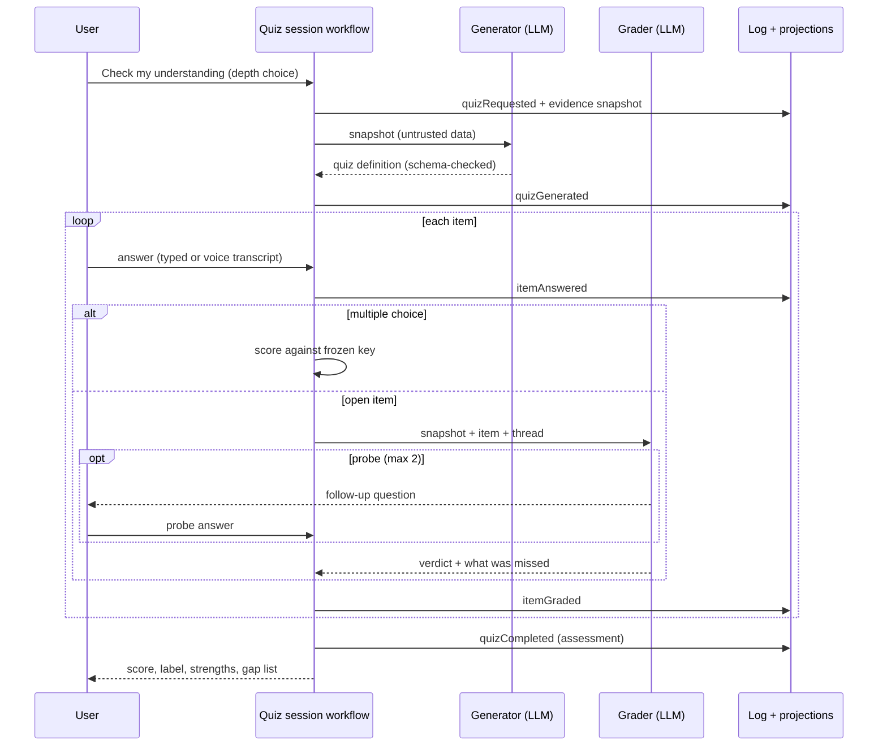
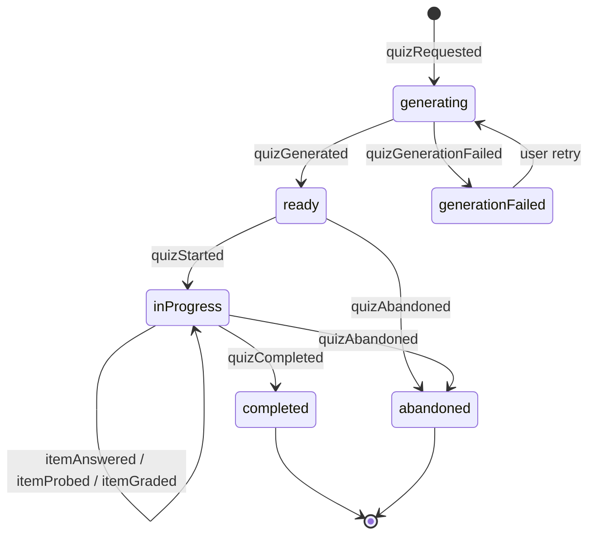

# AI Learning and Understanding Verification Agent — Implementation Plan

Turn any task into a tailored quiz: freeze the task's content, generate
questions that fit it, let the user answer by text or voice, probe with
follow-ups when an answer is shallow, grade the session, and explain exactly
what was missed.

## Document map and decision authority

- This plan owns component boundaries, UX, sequencing, tests, and work
  packages.
- [ADR 0033](../adr/0033-learning-verification-checkpoint-policy.md) — when
  quizzes start (manual-first entry, later suggestions, guards, caps).
- [ADR 0034](../adr/0034-hybrid-understanding-evaluation.md) — evidence
  snapshots, generation, conversational grading, model trust boundary.
- [ADR 0035](../adr/0035-learning-verification-session-persistence.md) —
  events, artifacts, links, identity, sync, deletion.
- [ADR 0036](../adr/0036-learning-understanding-rating.md) — verdicts,
  session scores/labels, honesty rules.
- Numeric values (question counts, weights, label bands, caps) are versioned
  hypotheses, not invariants.

## 1. Purpose

Work captured in Lotti — study notes, reading summaries, decisions, tasks
done with AI assistance — can look finished without the user being able to
explain it. A per-category learning agent makes any task quizzable on
demand. It is a learning aid, not an exam: dismissible, skippable, honest
about being AI feedback, free of comparison mechanics, and it never modifies
user-owned journal records.

## 2. Goals and non-goals

### Goals

1. `learningVerifier` agent-template kind with a deterministic per-category
   identity.
2. "Check my understanding" on every task, with quick-check or deep-dive
   depth.
3. Immutable evidence snapshot frozen before generation.
4. Tailored quizzes: multiple-choice plus open questions across
   explain/predict/apply/debug/compare, scaled to content richness.
5. Conversational grading: deterministic multiple-choice scoring, LLM
   grading with bounded probes for open answers, gap explanations for
   everything missed.
6. Typed and voice answers via the existing transcription pipeline.
7. Sessions, item threads, and assessments persisted as syncable
   agent-domain facts with plain deletion and export.
8. Tool-less, schema-constrained, injection-resistant model calls.

### Non-goals

- Calibration programs or human-rated corpora; grades ship as
  clearly-labeled AI judgment.
- Any cryptographic event attestation or trust layer beyond the existing
  agent sync model.
- Spaced-repetition scheduling; questions are freshly generated per session.
- Repository inspection or command execution (workspace evidence arrives via
  a later read-only, consented adapter phase).
- Reusing journal `RatingEntry`, comparing users, leaderboards, streaks, or
  gating any workflow.
- Storing hidden chain-of-thought.

## 3. Existing architecture fit

- The append-only `AgentMessageEntity`/`AgentLink` causal log is the source
  of truth (ADR 0016); quiz state is a projection over immutable artifacts.
- `AgentSyncService` remains the only write path for synced agent entities;
  convergence follows ADR 0018.
- Provider/profile selection and privacy confirmation use the existing agent
  runtime policy, resolved through the task's category.
- Generation and grading run through `ConversationRepository` with
  deterministic request keys and existing token-usage provenance.
- Voice answers reuse existing recording and transcription infrastructure.
- `WakeOrchestrator` is not involved; sessions are foreground-only and
  suggestions are computed from projections on foreground.

## 4. Experience walkthrough

1. Open any task and tap **Check my understanding**; pick **Quick check**
   (~3 questions) or **Deep dive** (~6–8) and see which provider/model will
   be used.
2. Lotti freezes the task content and generates a quiz tailored to it; thin
   content yields fewer questions and says so.
3. Questions come one at a time. Multiple choice gets instant feedback with
   an explanation. Open questions accept typed or spoken answers — spoken
   ones show an editable transcript before submission.
4. If an open answer is shallow or ambiguous, the grader asks a follow-up
   (at most two per item) before settling on a verdict; the user can always
   say "just tell me", skip, or reveal.
5. After the last item: session score and label, what went well, and the gap
   list citing the task content each explanation comes from. From there:
   **Quiz me again**, review the session timeline, or flag **This grade
   seems wrong**.

## 5. Components

| Component | Responsibility |
| --- | --- |
| `LearningQuizEntryController` | Entry action on tasks: depth choice, provider disclosure, `quizRequestId` minting. |
| `LearningEvidenceAssembler` | Collects and sections task content, records truncation, freezes the snapshot. |
| `QuizGenerator` + `QuizDefinitionValidator` | Tool-less generation call plus deterministic checks (schema, citations, keys, counts) with one repair. |
| `LearningQuizSessionWorkflow` | Presents items, records answers/probes durably, requests grading, assembles the assessment. |
| `QuizGrader` | Tool-less per-item grading conversation with bounded probes. |
| `LearningQuizRepository` / `LearningQuizProjection` | Atomic event+artifact appends via `AgentSyncService`; rebuildable session/history views. |
| `LearningSuggestionPolicy` (later) | Deterministic suggestion triggers, guards, caps. |
| Quiz UI | Entry sheet, item and probe cards, voice capture, result view, history, settings — non-modal, no timers, design-system tokens. |

Feature code lives under `lib/features/agents/learning/` (model, service,
workflow, state, ui), with shared entity/link variants in the agents model
and database layers.

## 6. Domain and data model

Ownership: [ADR 0035](../adr/0035-learning-verification-session-persistence.md),
including the full event union and artifact field lists.

- Events (`LearningQuizEventEnvelope`): `quizRequested`, `quizGenerated`,
  `quizGenerationFailed`, `quizStarted`, `itemAnswered`, `itemProbed`,
  `itemGraded`, `itemGradingFailed`, `quizCompleted`, `quizAbandoned`,
  `suggestionOffered`, `suggestionDismissed`, `quizDeleted`.
- Artifacts: session anchor (ID = `quizRequestId`, linked to the task),
  evidence snapshot, quiz definition, attempts (one per answer or probe
  reply), item grades, session assessment.
- Identity: request ID minted once per tap; content-addressed artifacts are
  UUID v5 insert-or-verify; attempts are never deduplicated; an engaged
  session wins over unengaged siblings.

Projections: session-detail timeline (questions, answers, probes, grades,
assessment in causal order; read-only replay once completed), open sessions,
per-task history, per-category history.

## 7. Evidence, generation, and grading

Ownership: [ADR 0034](../adr/0034-hybrid-understanding-evaluation.md).

- Phase 1 evidence adapters: task content (title, notes, checklist), linked
  journal entries and transcripts, agent reports when present. A later phase
  adds a read-only, consented `WorkspaceEvidenceAdapter` with secret
  redaction.
- The generator infers the content kind (study notes, engineering work,
  decision log, …) and tailors the question mix, count, and difficulty;
  it cites the snapshot sections each item is grounded in and avoids
  answer-shaped wording. Thin content yields fewer questions or an honest
  "not enough content to quiz on".
- Grading: multiple choice scored in code; open items graded
  conversationally with at most two probes before a verdict plus a
  "what you missed" explanation with citations.
- Trust boundary: tool-less calls, delimited untrusted inputs, schema
  validation with one repair, citation checks, no chain-of-thought storage.
- Answers are durably persisted before any grading call; failures produce
  typed events with retry and never lose user work.

## 8. Feedback and grades

Ownership: [ADR 0036](../adr/0036-learning-understanding-rating.md).
Per-item verdicts with gap explanations; session score computed in code
(multiple-choice weight 1, open weight 2) with labels Solid grasp ≥ 85,
Getting there 60–84, Needs review < 60; feedback-first presentation;
hideable numbers; "this grade seems wrong" records disagreement; no
leaderboards, comparison, or gating; grades never touch `RatingEntry`.

## 9. Triggering

Ownership: [ADR 0033](../adr/0033-learning-verification-checkpoint-policy.md).
Phase 1 is manual-only on every task. A later feature-flagged phase adds
non-modal suggestion cards after deterministic triggers, capped at two per
week with snooze/disable, running zero inference before acceptance.

## 10. Privacy

- Quizzing sends captured task content to the category's configured
  inference provider — the same consent surface as existing AI features;
  the entry sheet shows the resolved provider/model.
- Synced learning artifacts contain only task-derived content the user
  already syncs; drafts and raw audio stay device-local.
- History is private, exportable, and deletable per session, task, or
  category. No telemetry contains questions, answers, or grades.

## 11. Failure handling

| Case | Behavior |
| --- | --- |
| Thin task content | Fewer questions or an honest "not enough content"; no filler. |
| Generation invalid after repair | `quizGenerationFailed` + retry; no quiz shown. |
| Provider offline mid-session | Answers preserved; grading queued/retryable; session resumable. |
| Task edited during a session | Session stays bound to its snapshot; banner offers a fresh quiz. |
| Prompt injection in content | Untrusted-data delimiting, tool-less calls, schema + citation checks; adversarial fixtures in tests. |
| Voice transcription errors | User edits the transcript before submitting. |
| Double-tap / retry duplicates | `quizRequestId` reuse plus insert-or-verify artifacts dedupe. |
| Grade feels wrong | Disagreement recorded; regenerate or re-quiz; no silent regrade. |

## 12. Testing

Standard repository rules (one test file per source file, centralized mocks,
fake time, meaningful assertions).

- Unit: snapshot sectioning/truncation, definition validation and repair,
  MC scoring, score/label arithmetic with skip/reveal exclusion, suggestion
  guards, projection folds from shuffled event orders, deletion coverage.
- Model-contract fixtures: golden generator/grader schemas, probe-then-
  verdict threads, probe bound, "just tell me", repair; adversarial
  snapshots with embedded instructions must not alter behavior.
- Widget: entry sheet, item/probe cards, voice capture, result view (gap
  list first, hideable score), history; background refresh keeps rendered
  data.
- Integration: full session against a fake inference server; crash/resume;
  two-device sync convergence of a completed session.
- Analyzer zero-warning policy; `make l10n` for all new strings.

## 13. Phased delivery

1. **Quiz any task (MVP)** — template kind, persistence, projections, entry
   point, snapshot assembly, generation + validation, conversational
   grading, typed + voice answers, result view, per-task history, deletion.
   Done when a rich task yields a tailored quiz end-to-end against the fake
   server and answers survive crash/retry.
2. **More surfaces and suggestions** — projects, days, agent reports;
   feature-flagged suggestion cards; "Quiz me again" surfaced on tasks with
   missed items.
3. **Workspace evidence** — read-only consented adapter with secret
   redaction; code-grounded questions for engineering tasks.
4. **History insights** — recurring gap themes; optional grade-quality
   tracking from disagreement reports.

## 14. Work packages

1. Model + persistence substrate (template kind, envelope, artifacts, links,
   conversions, projections).
2. Evidence assembly and snapshot freezing.
3. Generation prompt/schema, validator, repair, fixtures.
4. Session workflow and grading conversation.
5. UI + localization for all ARB files.
6. Deletion/export coverage and per-task history integration.
7. Phase 2 surfaces + suggestion policy behind a flag.
8. Phase 3 workspace adapter with consent + redaction.

Every runtime package updates `lib/features/agents/README.md`, passes the
analyzer with zero findings, and runs focused tests.
