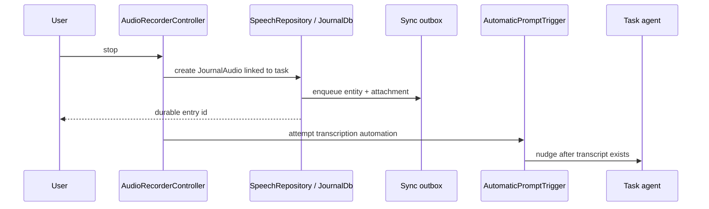
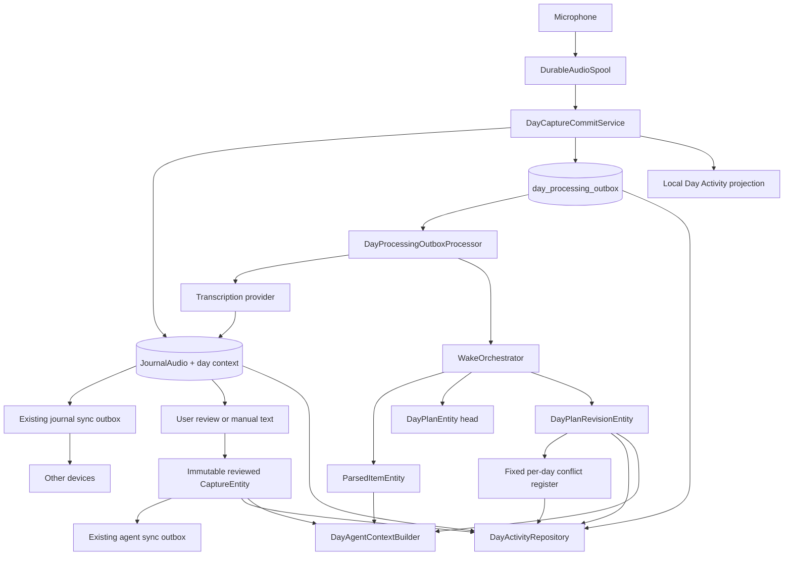
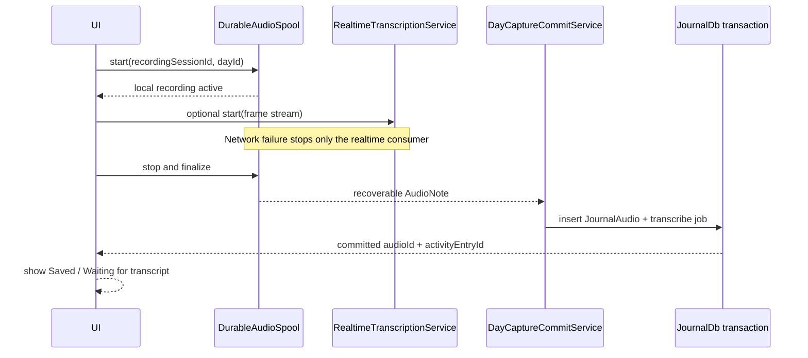
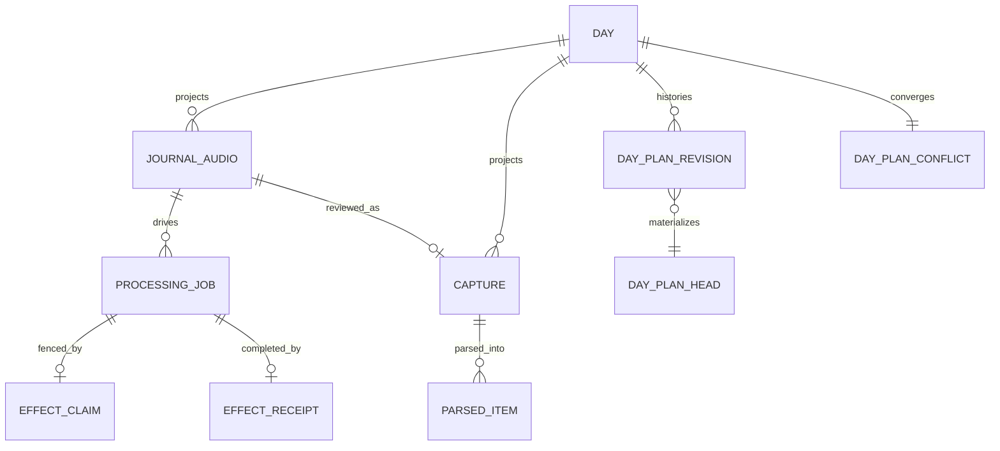
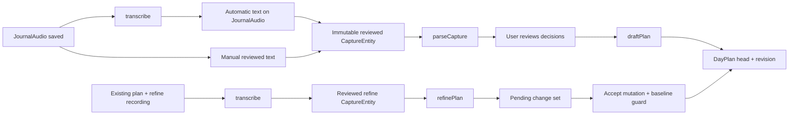

# Resilient Day Planning Capture, Processing Outbox, and Day Activity Timeline

- **Status:** Accepted implementation plan
- **Date:** 2026-07-18
- **Labels:** Agents, Bug, Daily Operating System
- **Related decisions:** ADR 0013, ADR 0016, ADR 0018, ADR 0020, ADR 0022,
  ADR 0028, ADR 0031

## Review gates

ADR 0031 passed its independent architecture/reliability/product panel at
9.2/9.6/9.4 (average 9.40) with no critical blockers. This plan has a separate
user-required target of 9.0 average; an 8.x result is acceptable only after two
additional plan-review rounds fail to reach 9.0 and no critical blocker remains.

| Plan round | Architecture | Reliability | Product/testing | Average | Result |
| --- | ---: | ---: | ---: | ---: | --- |
| 1 | 8.1 | 7.8 | 8.6 | 8.17 | Rejected; critical blockers |
| 2 | 9.3 | 9.2 | 9.5 | 9.33 | Accepted; no critical blockers |

## Implementation progress

The shared capture foundation is implemented and under its final quality gate:

- `DurableAudioSpool` publishes a checksummed, typed capture context before
  microphone access and accepts PCM locally before realtime forwarding;
- output artifacts are session-owned and collision-safe, with deterministic
  recording/activity identity and explicit recovery disposition invariants;
- Daily OS uses the durable PCM source in both live-backend and local-only
  modes, eliminating a weaker file-backed admission window;
- Daily OS, chat, and journal realtime controllers fence asynchronous teardown
  and obsolete starts; a failed durable admission never opens the microphone;
- Daily OS local-only audio is persisted before transcription, and retained failures
  use warning/saved language rather than a destructive error presentation.

The processing outbox, day-context journal migration, Activity projection,
manual retry controls, and runtime context integration remain the next slices.

## Executive decision

Day-planning audio must become durable **before** any network-dependent work
starts. A successful recording stop commits three local facts:

1. recoverable audio exists on disk;
2. a `JournalAudio` row identifies that artifact and its day workspace; and
3. a durable local processing-outbox row records the next required operation.

Automatic transcription, reviewed-capture parsing, and day-plan generation are
derived work. They may be attempted immediately, but their failure must never
remove or hide the source recording. A failed or interrupted
operation remains retryable after app restart, connectivity restoration, or an
explicit user action.

The Day surface gains an Activity view that projects every Daily OS entry for
the selected `dayId`: voice and typed check-ins, their processing state,
planner check-ins, and immutable plan revisions. It is backed entirely by local
storage and therefore remains usable offline.

This design deliberately introduces a **processing outbox**, not another sync
transport. The existing sync outbox continues to move journal and agent
entities between devices. `WakeQueue` remains the in-process execution queue.
The new outbox is the durable source of pending day work and rehydrates
`WakeJob`s when necessary.

## Non-negotiable invariants

1. **No inference before durable audio.** No transcription provider, realtime
   socket, or planner wake may be the only owner of recorded bytes.
2. **A stop acknowledged as Saved is durable.** After that acknowledgement, the
   Day Activity view can render and play the local recording even with no
   network and no transcript; otherwise the UI says Recovery retained.
3. **Derived failures never delete source data.** Transcription, parsing, and
   planning errors change processing state; they do not delete audio,
   transcripts, or day entries.
4. **Every user intent is restart-safe.** Pressing Review, Build my day, Retry,
   or Adapt creates or advances durable work before showing an active state.
5. **At-least-once execution, exactly-once semantic effects.** A job may run
   again after a crash. Owning-database claim generations, immutable operation
   IDs, and receipts make repeated execution safe.
6. **A day is a workspace, not another agent.** The existing
   `dayplan-YYYY-MM-DD` key remains the aggregate boundary under the single
   `daily_os_planner` identity.
7. **The timeline is local-first.** No network request is required to enumerate
   a day's entries or render their last known processing state.
8. **The user's text wins.** Automatic retries never overwrite a transcript the
   user has edited.
9. **Nothing is silently dropped under load.** Queue pressure reduces
   concurrency and exposes backlog; it never evicts unprocessed recordings.

## Current implementation and failure analysis

### Baseline capture path at design time

Before the foundation work above, `CaptureController` had two paths:

- Batch capture records to an `.m4a` file, stops the recorder, calls
  `AudioTranscriptionService.transcribe`, and only then calls
  `SpeechRepository.createAudioEntry`.
- Realtime capture streams PCM to `RealtimeTranscriptionService`; local
  `JournalAudio` persistence happens only after `stop()` returns an audio-file
  result.

`CaptureState.audioId` is therefore populated late. The UI calls
`RealDayAgent.submitCapture` only after a non-empty transcript reaches the
editable Review state. `DayAgentCaptureService.submitCapture` then persists a
`CaptureEntity` and enqueues a manual parse wake.

This creates four loss-shaped gaps:

| Gap | Current behavior | User-visible consequence |
| --- | --- | --- |
| Batch transcription fails | The method enters `CapturePhase.error` before creating `JournalAudio`; the stopped file is no longer represented by state | The recording appears lost and is not discoverable from the day |
| Realtime start/stop fails | Persistence depends on the realtime service producing/finalizing an artifact | A network failure can prevent any durable recording row |
| Audio persistence fails | Persistence is caught as best-effort and the transcript may continue with `audioId == null` | The plan may use text while the original audio is unavailable |
| App exits after capture submission | `CaptureEntity` is durable, but `WakeQueue` documents itself as in-memory and manual wakes are not rehydrated | Parsing or drafting intent can disappear until the user happens to trigger it again |

The existing `CapturesPanel` is downstream of all of these gaps: it queries
`CaptureEntity` rows and only then resolves `CaptureEntity.audioRef` to
`JournalAudio`. An audio artifact without a `CaptureEntity` is invisible on the
Day surface.

### Why task-agent audio is more resilient

The standard task recording path has the correct ownership order:



The task and its linked `JournalAudio` remain available when automation fails.
A later task-agent wake can rediscover the journal entry through the task link.
The existing sync outbox also recognizes an initial `JournalAudio` and ships
its attachment with high priority.

### Reuse versus new work

| Capability | Reuse | Adapt or build |
| --- | --- | --- |
| Audio capture | Reuse `AudioNote` and the established journal asset layout | Use one crash-recoverable PCM spool for Daily OS; make realtime an optional consumer of locally acknowledged frames |
| Durable audio entity | Reuse `JournalAudio`, `SpeechRepository`, `PersistenceLogic` | Add optional Daily OS origin/workspace metadata and an atomic capture commit API |
| Playback | Reuse `AudioPlayerWidget` and waveform infrastructure | Render it directly from a day entry before a transcript exists |
| Device sync | Reuse journal/agent sync outboxes and attachment handling | Do not put processing retries in the Matrix outbox |
| Agent input memory | Reuse immutable reviewed `CaptureEntity`, `AgentWakeMemory`, and `search_memory` | Add nullable versioned Daily-OS provenance, strict day-scoped compaction, and a metadata-only entry index |
| Wake execution | Reuse `WakeOrchestrator`, workspace tokens, wake-run logging, and the day workflow | Add durable job correlation, completion acknowledgement, and startup rehydration |
| Day plan head | Reuse `DayPlanEntity`, `DayPlanData`, `dayPlanId`, and edit APIs after centralization | Revision every mutation, fixed per-day conflict register, authoritative read projection |
| Day UI | Reuse the Day page, stale-while-revalidate providers, design-system components, and plan/actual timeline | Add a chronological Activity projection; retire the separate captures-only panel |

## Target architecture



There are three distinct durability domains:

1. **Source domain:** audio file plus `JournalAudio`. This is the user's
   irreplaceable input.
2. **Intent domain:** local processing-outbox rows. This records work that still
   has to happen on this device.
3. **Derived domain:** captures, parsed items, plan heads/revisions, and agent
   memory. Deterministic projections can be recreated; nondeterministic effects
   are adopted through strict receipts rather than guessed or replayed blindly.

The UI joins all three. It never infers “no recording” from “no derived agent
entity.”

## Recording lifecycle

### Local audio must lead realtime transcription

Realtime transcription must no longer own the recording stream. The capture
controller starts a local spool first and tees frames to realtime transcription
only after local recording is active:



Daily OS always records PCM through the spool and persists each frame locally
before an optional realtime backend receives it. To survive a process kill
while the container is not finalized, use
small independently recoverable PCM/WAV chunks plus an atomically replaced
manifest. Normal stop consolidates chunks to the standard playback format.
Startup recovery can salvage all complete chunks and create a playable entry;
it must not depend on a remote provider.

### Recording state machine

```mermaid
stateDiagram-v2
  [*] --> Idle
  Idle --> RecordingLocal: local spool started
  RecordingLocal --> RecordingWithRealtime: realtime consumer connected
  RecordingWithRealtime --> RecordingLocal: realtime degraded/disconnected
  RecordingLocal --> Finalizing: user stops
  RecordingWithRealtime --> Finalizing: user stops
  Finalizing --> SavedPending: JournalAudio + outbox committed
  SavedPending --> TranscriptReady: transcription succeeds
  SavedPending --> WaitingForNetwork: retryable provider failure
  WaitingForNetwork --> SavedPending: connectivity/app-resume retry
  SavedPending --> NeedsSetup: no usable inference route
  NeedsSetup --> SavedPending: route configured / manual retry
  TranscriptReady --> ReadyToReview: automatic text available on JournalAudio
  ReadyToReview --> Reviewed: user confirms/edits; immutable CaptureEntity
  TranscriptReady --> Reviewed: user adds reviewed text manually
  Reviewed --> PlanningQueued: user chooses Build my day
  PlanningQueued --> PlanReady: plan revision committed
  PlanningQueued --> PlanRetrying: retryable wake failure
  PlanRetrying --> PlanReady: retry succeeds
```



`Cancel` remains the only action that deletes an active, not-yet-committed
recording. It requires the existing explicit discard confirmation. Errors do
not implicitly take the cancel path.

## Data model

### Day and Activity projection

`Day` remains the logical ADR 0022 workspace keyed by
`dayPlanId(localDay(date))`; no mutable Day row and no generic synced
`DayEntryEntity` are added. `DayActivityItem` is a local read model over:

- recovery manifests and Daily-OS `JournalAudio`;
- immutable reviewed `CaptureEntity` for typed input/text joins;
- `DaySummaryEntity`;
- `DayPlanRevisionEntity` and the fixed per-day `DayPlanConflictEntity`; and
- device-local processing claims/status/receipts.

One voice session keeps one `activityEntryId` from spool through journal,
review, processing, and plan usage. Stable ordering is
`(occurredAt, sourceTypeOrder, sourceId)` with voice `0`, typed `1`, summary
`2`, revision `3`, conflict `4`.

### Journal audio and capture provenance

Extend `AudioData` with nullable `DayAudioContext` containing session/day/
Activity IDs, intent, origin host, plan date/timezone/offset, optional refine
operation/baseline, and latest review operation/time. Add indexed nullable
`day_id` and unique partial `recording_session_id` columns to JournalDb.

Extend `CaptureEntity` with nullable versioned `DailyOsCaptureProvenance`.
Fields inside schema v1 are required for new rows: review operation, intent,
session/Activity/day provenance, origin host, and refine continuation/baseline
where applicable. Automatic transcripts never create CaptureEntity. Null
provenance is legacy historical input and never automatic-repair eligibility;
`refine_capture:*` is classified legacy-refine with no inferred baseline.

### Plan revision and conflict model

Every plan mutation writes `DayPlanRevisionEntity` plus the mutable head in one
AgentDb transaction. Revision identity is operation-addressed, semantic bytes
use `day_plan_revision_semantic_v1` + SHA-256, and parent IDs are canonical.
Mutation kinds cover generated draft/refine acceptance, ChangeSet acceptance,
commit/uncommit, rename/edit/reschedule/state/undo, delete, and recreate.

`DayPlanEntity` gains `currentRevisionId` and repairable `activeConflictId`.
There is one grow-only `DayPlanConflictEntity` per day containing candidate
revision clocks and resolution-attempt IDs. The authoritative
`DayPlanReadProjection` derives the causal frontier/provisional state; direct
feature reads of raw head data are removed.

Legacy and later old-peer null-head plans normalize through deterministic
legacy snapshot revisions. Identical semantic payloads join envelope clocks;
different payloads become conflict candidates.

### Processing outbox, claims, and receipts

`day_processing_outbox` lives in JournalDb with the complete ADR 0031 schema:
operation/root semantic identity, supersession links, day/source/baseline,
immutable input/provider/payload snapshots and digests, priority/state/retry
times, owning-claim mirror, errors, and timestamps. Operations are
`transcribe`, `parseCapture`, `draftPlan`, `refinePlan`, and
`resolvePlanConflict`; there is no materialization job.

AgentDb adds local `day_agent_effect_claims` and
`day_agent_effect_receipts`. Handlers commit synced domain effects and a strict
receipt with the owning generation/token. The outbox supports non-claimable
`preparing` replacements and terminal `superseded` rows using the ADR's
prepare/fence/activate saga.

Required indexes cover day/session lookup, semantic chain, and due-work order.
Pending/failed/preparing work is never age-pruned. Completed state is retained
until source/domain deletion makes its claim/receipt safe to remove.

Identity implementation uses fixed persisted UUIDv5 namespaces: JournalAudio
and initial transcribe operation derive from session; Activity voice ID derives
from session; capture and initial parse operation derive from review operation/
capture; draft/refine/conflict-resolution jobs use preallocated operation IDs;
plan revisions use their mutation operation; the conflict register derives
only from `dayId`. Same-operation retry never allocates another ID.



## Persistence and sync strategy

### Capture commit

`CaptureSessionContext` is allocated before microphone permission/start and is
written to the first manifest generation. The spool owns 16-kHz mono PCM before
any realtime consumer. Concrete source constants:

| Setting | Value |
| --- | ---: |
| Published chunk | 2 seconds / 64,000 bytes PCM |
| Active flush maximum | 1 second |
| Bounded writer channel | 256,000 bytes (8 seconds); saturation stops/checkpoints |
| Pre-start free-space floor | 64 MiB |
| Spool quota | 512 MiB, excluding all protected recovery/non-terminal work |
| Committed PCM grace | 24 hours after WAV digest + source/job commit |
| Startup recovery page | 64 manifests |

Stop assembles and SHA-256-validates a WAV, reserves a vector clock, then uses
one dedicated JournalDb transaction to strictly insert deterministic
`JournalAudio` plus initial transcribe job. The VC scope commits only with both
rows. Sequence binding, sidecar generation, Matrix enqueue, UI notification,
and manifest `committed` marking happen after the source transaction and have
explicit repair scans. “Saved” is emitted only after the source transaction;
otherwise the manifest remains “Recovery retained.”

Recovery reconciles directory contents before trusting the manifest, adopts
contiguous complete chunks, trims a final odd byte, derives duration from
sample count, quarantines gaps/digest conflicts, and repeats the deterministic
source commit without allocating a replacement identity/vector clock.

### Sync behavior

- `JournalAudio` and its attachment use the existing high-priority journal sync
  outbox.
- `CaptureEntity`, parsed items, plan revisions/heads/conflicts, and summaries use
  the existing agent sync path.
- Processing-outbox rows do not sync.
- Execution remains source-device-only in P1. Peers may play/export and submit
  reviewed text, but Retry/Build actions explain that work continues on the
  recording device. There is no peer takeover phase in this implementation.
- Day plans bypass generic divergent-head LWW and use the fixed per-day conflict
  register/read projection. Same semantic revision IDs join envelope clocks;
  different semantic payloads quarantine.
- Deletion fences owning claims first, then mirrors queue cancellation, soft
  deletes derived references, enters explicit journal deletion, and respects
  outstanding attachment transport references. Processing failure never
  deletes source data.

## Processing outbox

### Job graph



Jobs store immutable source/baseline IDs, user decisions, provider/model
snapshots, digests, and retry boundaries. Large transcript/plan text stays in
journal or agent entities; raw audio stays in the asset directory.

### Claiming and execution

Use `<application-support>/locks/day_processing.lock` via
`RandomAccessFile.lock(FileLock.exclusive)` (released by process death) plus
45-second owning-database processor leases heartbeat every 15 seconds. A second
live process never steals from a different boot ID. If a platform cannot prove
exclusive-lock release, it waits for lease expiry.

| Operation family | Concurrency | Job lease | Heartbeat | Provider timeout |
| --- | ---: | ---: | ---: | ---: |
| Transcribe (Journal effect) | 1 | 180 s | 30 s | 120 s |
| Parse/draft/refine/resolve conflict (Agent effect) | 1 total | 360 s | 30 s | 300 s |

Transcribe uses three boundaries: a short JournalDb claim transaction;
provider I/O outside every database transaction; then a short fenced JournalDb
completion transaction. Completion opens a VC scope, re-reads the latest
JournalAudio, dedupes `sourceProcessingJobId`, appends the transcript while
preserving reviewed text/context, and marks success under generation/token.
No-op completion follows existing VC release/burn semantics; sidecar/sequence/
Matrix work remains post-commit and repairable. Agent effects claim in AgentDb,
mirror generation/token to JournalDb, then strict-
insert output + receipt and mark `effectCommitted` in one AgentDb transaction.
Valid receipts reconcile any non-cancelled/non-superseded Journal state without
repeating inference.

Cancellation linearizes in the effect-owning DB. Replacement configuration or
immutable input uses the ADR prepare/fence/activate saga: full replacement row
`preparing`, old-effect fence, atomic old/new link switch and activation.
Startup repairs every prepared/fenced/committed boundary.

Claim due work in pages of 32. Reserve one maintenance/oldest-due slot after
five interactive claims or 60 seconds of interactive activity. UI/backlog reads
are paged; there is no eviction/cardinality cap.

| Bounded scan | Page |
| --- | ---: |
| Due claims | 32 |
| Spool manifests / source repair | 64 |
| Invariant reconciliation | 64 |
| Terminal Agent-claim mirror repair | 64 |
| Prepared replacement sagas | 32 |
| Sidecar/sequence/Matrix post-commit repair | 64 |
| Activity/backlog UI | 50 |

Each foreground cooperative drain processes at most one page or 50 ms of local
work, whichever comes first, then schedules another injected-scheduler turn
when `hasMore`; it never recurses or blocks first paint. Tests drive the
scheduler/fake clock without real waits.

### Retry policy

Classify failures rather than treating every exception alike:

| Class | Examples | Queue action | UI |
| --- | --- | --- | --- |
| Retryable network | offline preflight, DNS/socket | `waitingForNetwork`; hints may advance due time but do not burn attempts | Saved · Waiting for connection |
| Timeout/HTTP 408/5xx | provider request began | full-jitter retry schedule | Saved · Retrying |
| Provider busy | HTTP 429/capacity | persist hard `retryNotBefore` from `Retry-After`; otherwise full jitter | Saved · Provider busy |
| Setup required | no profile, missing credential, disabled model | `waitingForUser`; resume on configuration update or manual retry | Saved · Set up processing |
| Source unavailable | attachment not downloaded, spool still recovering | short local retry; request existing attachment sync if remote | Saved · Audio is still arriving |
| Deterministic validation | corrupt unsupported audio, invalid plan output after forced retry | `failed`, retain source, offer alternate action | Audio saved · Couldn't process |
| Cancellation | explicit user cancel of queued derived work | `cancelled`; retain audio/day entry | Saved · Processing cancelled |

HTTP 401/403 and missing local model assets are setup-required. Other 4xx
(except 408/409/425/429) and provider protocol/schema failures are deterministic
failures with retained source. 408/409/425/5xx/timeouts retry. A malformed
`Retry-After` is recorded diagnostically and falls back to jitter. Local
I/O/SQLite errors do not burn provider attempts; they remain recovery/local
retry with 1-second base/30-second cap.

Use injected clocks/jitter. Transcribe base/cap is 5 s/15 min; parse/draft/
refine/conflict resolution is 10 s/30 min. Full jitter is
`random(0, min(base * 2^attempt, cap))`.
Attempts increment only after an external request begins. No retry count
discards source or prunes the job.

Connectivity signals are hints, not proof. An online event advances
`nextAttemptAt` to now; the actual request remains the authority. A periodic
safety scan every 60 seconds while foregrounded and app-resume scan cover missed
connectivity events. Neither bypasses `retryNotBefore`.

### Manual triggers

Every relevant Activity card exposes actions based on its durable state:

- every saved voice source without a reviewed capture: **Add reviewed text**;
- pending/failed audio: **Transcribe now** when `retryNotBefore` permits;
- automatic transcript ready: **Review check-in**;
- reviewed capture: **Use to build plan**;
- failed draft: **Retry plan** and **Back to decisions**;
- processed capture not used by the current plan: **Add to plan**;
- any voice entry: playback and **Open recording**.

Manual retry of the same immutable operation moves the same job to `queued`
without bypassing `retryNotBefore`. Changed input/provider/decisions preallocate
a new operation ID and activate it through supersession; receipt identity is
never reused.

### Queue pressure and disk pressure

- No fixed queue length causes eviction. Claim concurrency is bounded; storage
  is not.
- The UI can summarize a large backlog without building every card at once.
- Before recording starts, check that a safe minimum of local storage is
  available. If space runs low while recording, stop gracefully, finalize the
  captured portion, and explain that it was saved early.
- Never delete unsynced audio to make room. Committed PCM chunks are reclaimable
  only after verified WAV + source/job commit + 24-hour grace; retain the small
  manifest tombstone. Explicit deletion still respects job/recovery/transport
  references.
- Emit metrics for pending count, oldest age, retry count, lease recovery, and
  orphan repair. Do not log transcript text or audio paths containing user
  content.

## Day Activity timeline design

The existing `DayTimeline` is a spatial plan-versus-actual schedule. It should
remain. The new requirement is an event timeline, so the Day header gains a
third view: **Agenda · Schedule · Activity**. The existing captures-only panel
is folded into Activity to avoid two competing histories.

### Wireframe

```text
┌─────────────────────────────────────────────────────────────┐
│ Saturday, 18 July                         Offline · 2 pending│
│ [ Agenda ] [ Schedule ] [ Activity ]                       │
├─────────────────────────────────────────────────────────────┤
│ 07:42  Voice check-in                                      │
│        [▶ 01:18 ─────────────]                              │
│        Saved on this device · Waiting for connection        │
│        [Transcribe now]  [Open recording]                   │
│                                                             │
│ 08:06  Voice check-in                                      │
│        “Gym first, then finish the proposal…”               │
│        Ready to review                                      │
│        [Review check-in]                                    │
│                                                             │
│ 08:14  Plan generated · Revision 1                          │
│        5 blocks · 6h 10m planned                            │
│        Built from 2 check-ins                               │
│        [Open this version]                                  │
│                                                             │
│ 12:31  Planner check-in                                    │
│        “The proposal block is still ahead…”                 │
│        [Open context]                                       │
│                                                             │
│ 15:20  Plan update failed                                  │
│        Your recording and reviewed decisions are saved.     │
│        [Retry plan]  [Back to decisions]                    │
└─────────────────────────────────────────────────────────────┘
```

All copy must be localized through the six required ARB files. Spacing,
typography, color, radius, elevation, and progress treatment must come from the
existing design-system tokens/components; this document introduces no visual
token.

### Rendering rules

- Show entries oldest-to-newest to tell the day's story. On open, position at
  the latest entry, with a “Jump to latest” affordance after the user scrolls
  away.
- Group by local day using the entry's `dayId`, not the wall-clock date on the
  device performing a retry.
- A voice card appears as soon as the source transaction commits. Playback does
  not wait for transcription.
- Preserve the last rendered entries during background refresh. A local job
  state update changes only its card; it never replaces the whole page with a
  loading or error shell.
- Pending is neutral/informational, not an error. The headline is “Saved on this
  device,” with connectivity/processing as secondary state.
- Failure copy explicitly says the recording is saved. Never use an empty-state
  illustration when entries exist but derived output does not.
- Plan cards reference immutable revisions. Opening one shows that revision and
  offers a separate route to the current plan when it has changed.
- Every saved voice card without reviewed CaptureEntity keeps playback plus
  **Add reviewed text manually**, including offline/waiting/setup states;
  retryable cards also offer **Retry transcription** when allowed. A
  plan-conflict card compares frontier candidates and creates a causally
  dominating resolution revision.
- Entry-only/no-plan days open Activity; no-entry/no-plan days retain Schedule.
  Peer cards omit local Retry/Build and explain source-device processing.
- Navigating back from Review/Drafting returns to the same Activity entry and
  preserves its scroll position.
- Accessibility semantics combine time, entry kind, state, and available
  action. Status is never conveyed by color alone. Desktop traversal/activation,
  focus restoration, text scale, debounced meaningful announcements, and
  reduced motion are covered explicitly.

### Timeline projection

`DayActivityRepository.watch(dayId)` merges:

1. `JournalAudio` rows with `AudioData.dayContext.dayId`;
2. recoverable spool manifests for the same immutable day context;
3. `CaptureEntity` and parsed-item summaries;
4. local outbox/claim/receipt state;
5. `DayPlanRevisionEntity`, `DayPlanConflictEntity`, and day summaries.

It coalesces voice sources by stable `activityEntryId`; a journal-only source is
visible without AgentDb. The provider uses existing update streams and
root-level stale-while-revalidate. Activity cards remain stable while sources
enrich or one store temporarily errors.

## Agent runtime integration

### Current-day discoverability

The current runtime already projects submitted `CaptureEntity.transcript`
values into the long-lived planner's episodic log, and `search_memory` can
retrieve older captures. That only helps after `CaptureEntity` exists. Add a
current-day read model to `DayAgentContextBuilder` so every day-scoped wake can
discover durable entries independently of the wake that originally created
them.

The prompt receives a bounded metadata-only `<day_entries>` section. Reviewed
text already enters the selected day's `<day_log>` and is never duplicated:

```text
<day_entries>
[
  {
    "entryId": "day_audio:recording-123",
    "kind": "voice_check_in",
    "occurredAt": "2026-07-18T07:42:00+02:00",
    "state": "ready",
    "captureId": "capture:review-operation-123",
    "usedByPlanRevisionIds": []
  },
  {
    "entryId": "day_audio:recording-124",
    "kind": "voice_check_in",
    "occurredAt": "2026-07-18T08:06:00+02:00",
    "state": "pending_transcription"
  }
]
</day_entries>
```

Rules for this context:

- Sort canonically by `(occurredAt, sourceTypeOrder, sourceId)` and cap at the
  newest 32 items/4 KiB encoded bytes with deterministic overflow cursor.
- Include only stable IDs, kind, time, review/processing state, supersession,
  and plan usage. Pending input is discoverable but its content cannot be
  inferred; automatic text is never planner input before review.
- Include stable entry/capture/revision IDs so tool calls can reference sources
  exactly.
- Mark which captures informed the current plan. A later invocation can surface
  an unused check-in rather than silently planning without it.
- Keep a bounded inline window, then expose `list_day_entries(dayId, cursor)`
  and `get_day_entry(entryId)` read-only tools for lazy retrieval. Existing
  `search_memory` remains the cross-day episodic recall path.
- Snapshot the exact index and reviewed text frontier consumed through ADR
  0020. Replay never re-reads live status.

`CaptureEventMeta` gains `dayId`. Repository selection, inline resolution,
compaction, and `<day_log>` assembly filter to the wake workspace before text
resolution. Compacted records gain `globalObservations` or
`dayCaptures(dayId)` scope. New wakes exclude legacy unscoped/mixed summaries,
rebuild safe scopes from immutable raw sources, and assemble global observations
before selected-day captures. Old prompt replay keeps frozen bytes.

### Later invocation behavior

When the user returns to a day:

1. the Day surface shows all saved entries immediately;
2. the modal can resume from a selected entry instead of starting at the mic;
3. a draft request defaults to all reviewed, not-yet-used captures for that
   day, with explicit user confirmation;
4. pending audio is called out separately and is not silently excluded;
5. the planner prompt receives day-scoped reviewed text through `<day_log>`,
   metadata through `<day_entries>`, and the conflict-aware current plan;
6. successful output records its source capture IDs in the plan revision.

This is stronger than task parity: task agents rediscover linked journal
content; the day planner additionally has an explicit per-day source ledger and
plan provenance.

## API and component changes

The names below describe ownership; final file splits should preserve the
repository's one-source/one-test-file convention.

| Area | Existing files to change | Principal new production files |
| --- | --- | --- |
| Capture/spool | `daily_os_next/state/capture_controller.dart`, `ai_chat/services/realtime_transcription_service.dart`, `realtime_audio_buffer.dart` | `speech/services/durable_audio_spool.dart`, `daily_os_next/state/capture_session_context.dart` |
| Journal/outbox | `classes/journal_entities.dart`, `database/database.drift`, `database/database_migration_recent.dart`, `database/conversions.dart`, inbound journal sync/upsert, `logic/persistence_logic.dart` / create-update collaborators | `daily_os_next/services/day_capture_commit_service.dart`, `day_capture_recovery_service.dart`, `day_processing_outbox_repository.dart`, `day_processing_outbox_processor.dart` |
| Agent model/DB/sync | `agents/model/agent_domain_entity.dart`, `agent_constants.dart`, `agents/database/agent_database.drift`, `agent_db_conversions.dart`, repository/core, `agents/wake/wake_queue.dart`, wake-run schema/conversions, `sync/matrix/sync_event_processor_agent_handlers.dart` | `daily_os_next/agents/service/day_plan_read_projection.dart`, `day_processing_invariant_reconciler.dart` |
| Plan writes/reads | `day_agent_plan_writer.dart`, `day_agent_plan_editor.dart`, `day_agent_plan_service.dart`, `day_agent_plan_reads.dart`, week context, workflow/tools/providers | Central revision/conflict transaction helpers split one source/one test |
| Memory/context | `agents/sync/agent_log_compactor.dart`, `daily_os_next/agents/workflow/day_capture_events.dart`, workflow/tool handlers | scoped compaction/context projection helpers and read-only day-entry tools |
| Day UI | `day_page.dart`, `day_page_header.dart`, `ui/widgets/plan_view_toggle.dart`, planning modal/routes, `day_agent_provider.dart`, `captures_panel.dart` | `day_activity_repository.dart`, `day_activity_view.dart`, focused card widgets, recovered-recordings UI |

Generated `.g.dart`/`.freezed.dart` files are regenerated only after source
schema edits; they are never patched directly.

### Speech/source layer

- Add shared `durable_audio_spool.dart` + model/recovery helpers under Speech;
  adapt realtime service to accept frames only after durable writer acceptance.
- Add immutable `capture_session_context.dart` and make
  `captureControllerProvider` family/scoped by it. Refine snapshots operation +
  baseline before mic start.
- Add `DayCaptureCommitService` around a dedicated PersistenceLogic/JournalDb
  source-plus-job transaction; do not compose public create then enqueue.
- Add `DayCaptureRecoveryService` and `LegacyRecordingRecoveryRepository` for
  manifest recovery and the proof-safe unreferenced-audio inbox.
- Task/chat realtime callers of the changed shared service adopt the same spool
  in this implementation; no second RAM-only owner remains.

### Persistence/processing layer

- Extend `lib/classes/journal_entities.dart` with `DayAudioContext` and versioned
  transcript source-job provenance; regenerate Freezed/JSON.
- Extend `database.drift`, recent migration, and JournalDb queries with day/
  session columns, outbox table/indexes, atomic source commit, bounded claim,
  supersession, and receipt-reconciliation CAS APIs. Update conversions and
  inbound/local upserts to populate denormalized fields; backfill only from
  proven `CaptureEntity.audioRef` links and test the non-null session partial
  uniqueness predicate; regenerate Drift.
- Run proof-based legacy audio backfill as an idempotent application-level
  reconciler only after JournalDb and AgentDb are both open. It is not part of
  the JournalDb Drift transaction and never attempts a cross-database atomic
  query.
- Add `DayProcessingOutboxRepository`, `DayProcessingOutboxProcessor`, owning
  processor lock/lease, injected clock/jitter/connectivity hooks, and separate
  transcribe/parse/draft/refine/conflict handlers.
- Add `DayProcessingInvariantReconciler` for reviewed journal -> deterministic
  capture/continuation, new-format typed continuation, terminal claim mirrors,
  prepared replacement sagas, missing sidecars/sync gaps, and bounded startup
  pages.
- Extend `WakeJob`/run records with `processingJobId`; handler success is
  receipt/output validation, never `WakeResult.success` alone.

Required transactional contracts (request/result objects carry immutable
digests and typed outcomes; none return ambiguous booleans):

```text
commitDayAudioSource(DaySourceCommitRequest) -> DaySourceCommitResult
selectDueJournalJob(DueJobRequest) -> DueJournalJob?
claimTranscriptionInJournal(TranscribeClaimRequest) -> JournalClaim
completeTranscription(TranscriptionCompletionRequest) -> CompletionResult
claimAgentEffectInAgentDb(AgentClaimRequest) -> AgentEffectClaim
mirrorAgentClaimToJournal(AgentEffectClaim) -> MirrorResult
commitAgentEffectAndReceipt(AgentEffectCompletion) -> CompletionResult
ackAgentEffectInJournal(AgentEffectReceipt) -> AcknowledgeResult
repairTerminalAgentClaim(TerminalClaimRepairRequest) -> ReconcileResult
prepareReplacement(ReplacementRequest) -> PreparedReplacement
fenceReplacement(PreparedReplacement) -> FenceResult
activateReplacement(PreparedReplacement) -> ActivationResult
cancelDayJob(CancellationRequest) -> CancellationResult
reconcileEffectReceipt(ReceiptReconcileRequest) -> ReconcileResult
mutateDayPlan(PlanMutationRequest(operationId, expectedRevisionId))
  -> PlanMutationResult(applied | branched | conflict | noOp)
normalizeAndMergeIncomingDayPlan(IncomingEnvelope)
  -> PlanSyncMergeResult
```

Journal constraints are `UNIQUE(recording_session_id) WHERE ... IS NOT NULL`, a
partial unique semantic-key index where `superseded_by_job_id IS NULL` and
status is neither cancelled nor superseded, and at most one claimable row per
`root_semantic_id` where `pending_replacement_job_id IS NULL` and status is one
of `queued`, `running`, `waitingForNetwork`, `waitingForUser`,
`retryScheduled`, or `failed`. `preparing`, cancelled, succeeded, and
superseded rows are retained history, not claimable current work.
`PlanMutationResult.noOp` means validated replay of the same operation ID and
semantic digest only; a content-equal new operation still creates a distinct
revision.

### Agent/domain layer

- Extend `CaptureEntity` with nullable `DailyOsCaptureProvenance`; add
  `DayPlanRevisionEntity` and `DayPlanConflictEntity`. Regenerate, then add old
  JSON/peer compatibility tests before creating new rows.
- Extend AgentDb with local effect claims/receipts and transactional effect
  methods. Add semantic-v1 canonicalization through `content_digest.dart`.
- Centralize **all** DayPlan mutations from plan writer/editor/service and sync
  ingest behind a revisioned repository transaction. Add continuous old-peer
  normalization and type-specific conflict merge.
- In `sync_event_processor_agent_handlers.dart`, route DayPlan envelopes to a
  specialized pre-generic-LWW handler calling
  `normalizeAndMergeIncomingDayPlan`; that AgentRepository transaction creates
  legacy revisions, preserves candidates, merges the fixed conflict register,
  and repairs the head cache atomically.
- Introduce `DayPlanReadProjection`; migrate day providers, week context,
  tools, workflow, plan parser/editor/UI away from raw head data reads.
- Add day-scoped `CaptureEventMeta`, compaction scopes, legacy checkpoint
  exclusion/rebuild, metadata entry tools, and exact ADR 0020 snapshotting.

### UI layer

- `DayActivityRepository` and `dayActivityProvider(dayId)`.
- `DayActivityView`, entry cards, local status presentation, and retry actions.
- `DayPage` owns async initial-view selection from local entry availability and
  holds its shell until known, preventing Schedule from flashing before an
  entry-only Activity day; `plan_view_toggle.dart` renders three measured tabs.
- Route Review/Reconcile/Drafting from stable Activity/source IDs and restore
  selected card/focus/scroll.
- Add Recovered recordings inbox/assignment and plan-conflict comparison/
  resolution surfaces.
- Replace `CapturesPanel` with the Activity view after parity tests cover audio
  playback, transcript rendering, and navigation.
- Add all visible labels to six required ARBs, use existing design tokens, and
  regenerate l10n.

## Testing strategy

### Test architecture

Use three layers:

1. **Pure/property tests** for queue/state-machine invariants and deterministic
   IDs. Use Glados with the mandatory `glados` tag.
2. **Service/widget tests** with a fake clock, fake jitter, fake recorder,
   temporary asset directory, in-memory databases, and scripted transport.
3. **Targeted integration tests** that exercise process restart and real file
   recovery. Device/manual runs add OS-level airplane mode and network shaping.

No test should use `Future.delayed`, real timers, or `DateTime.now`. Queue and
lease tests advance fake time. Widget tests pump explicit durations and assert
meaningful content/state/actions.

Per phase: regenerate with `make build_runner`/`make l10n` as required, run
`make sort_arb_files`, run `fvm dart format .`, then use dart-mcp analyzer and
targeted test files/folders. The final gate runs zero-warning analysis, the
full suite requested for this work, integration/device scenarios, and a
coverage report audited against every new branch/state/action. Tests use
central mocks/fallbacks, `setUpTestGetIt`/`tearDownTestGetIt`,
`makeTestableWidget`, and one mirrored test file per source file.
Repeated provider/app/database setup is extracted into file helpers or test-bench
classes; fallback values live in `test/helpers/fallbacks.dart`; mock signatures
match mixin call shapes. Widget tests use explicit `pump(duration)` and only use
bounded `pumpAndSettle` when all animation completion is the assertion.

### Persistence-order tests

- Batch transcription throws: `JournalAudio` and outbox row still exist, audio
  plays, Activity says saved, no `CaptureEntity` yet.
- Realtime configuration lookup throws before socket connection: local
  recording continues and commits normally.
- Realtime socket drops mid-recording: complete local audio is retained;
  partial transcript is not treated as user-reviewed text.
- Realtime stop times out: local spool finalization and commit succeed without
  waiting for the socket.
- Journal transaction fails: UI does not claim “saved”; the recoverable manifest
  remains and startup recovery retries the commit.
- Crossing midnight/changing selected date/timezone while recording never
  rebinds the snapshotted day/session context.
- Writer-channel saturation and ENOSPC checkpoint the accepted prefix with
  partial-recovery copy; no frame is silently dropped as a complete save.
- Recovery adopts contiguous unlisted chunks/odd-byte final part and
  quarantines gaps, duplicates, and digest conflicts.
- Sidecar/sequence/Matrix enqueue fails after source commit: Activity renders
  the journal source and repair completes each post-commit obligation.
- Duplicate stop/commit call: one audio entity, one Activity voice item, one transcribe
  job.
- Review-before-transcribe and transcribe-before-review delivery orders both
  retain one job transcript, preserve reviewed `entryText`/review context, and
  produce identical continuation without VC gaps.

### Crash/restart matrix

Inject a crash at every durable boundary:

1. after manifest creation, before first frame;
2. after several complete chunks while recording;
3. after recorder stop, before container consolidation;
4. after audio file finalization, before journal transaction;
5. after `JournalAudio` insert, before outbox insert (transaction rollback);
6. after VC/source transaction, before sidecar/sequence/sync/manifest marking;
7. after owning claim, before Journal mirror/provider call;
8. after provider success, before transcript/effect transaction;
9. after Agent output + receipt, before Journal acknowledgement;
10. after cancellation fence, before Journal cancellation mirror;
11. after replacement prepare, after owning fence, and before/after activation;
12. during concurrent plan resolution/head cache repair.

After restart, assert the invariant appropriate to the boundary: either no user
recording had begun, or a discoverable source/recovery item exists; completed
outputs are not duplicated; expired leases are reclaimed.

Mandatory automated journey: fully offline record -> Saved/playable -> kill/
restart -> transcription unavailable -> add reviewed text manually -> repair
deterministic capture/continuation -> decisions -> enqueue draft -> kill/
restart -> revision/head appears, with the original audio visible throughout.

### Network scenarios

- Fully offline before recording starts.
- Network disappears while recording.
- Network disappears during transcription upload.
- Network disappears during planner streaming after transcription succeeded.
- Provider accepts/commits a request, then the client disconnects before
  acknowledgement. Providers that support idempotency receive the processing
  job ID; otherwise remote invocation may repeat, but owning claims/receipts
  still permit exactly one local semantic effect/revision.
- Intermittent online/offline flapping does not create parallel jobs or reset
  backoff incorrectly.
- Very slow upload exceeds the UI's old 60-second wait but continues as durable
  background work.
- DNS failure, TLS failure, socket reset, timeout, 408, 429 with `Retry-After`,
  and 5xx map to the expected retry state.
- Invalid credentials/no profile maps to `waitingForUser`, then resumes on a
  configuration update.
- Connectivity restoration may advance `nextAttemptAt` but never bypasses a
  persisted `retryNotBefore`.

### Queue and idempotency scenarios

- Multiple recordings for one day remain separate; no superseding or token
  merge drops an earlier capture.
- Recordings for different days never share a workspace job.
- A duplicate job insert validates and returns the existing semantic row;
  mismatched immutable payload is corruption, not overwrite.
- Claim order respects interactive priority then due time/FIFO.
- Agent/Journal claim generations fence expired workers; a second live process
  cannot steal the owner lease, while OS lock release proves process death.
- Retrying after output commit acknowledges existing output without another
  inference request.
- Manual retry advances one job and does not create a new timeline entry.
- Changed reviewed text/provider/decisions creates a new operation through the
  prepare/fence/activate saga; every crash boundary leaves at most one claimable
  job and exactly one durable current-or-prepared continuation.
- Cancelled/superseded retained history with the same semantic key does not
  block a legitimate new operation; two current/non-superseded rows still
  violate the partial unique constraint.
- A queue of thousands of items remains enumerable and drains without deleting
  entries; interactive work leapfrogs maintenance work.
- Pruning never removes non-terminal jobs or jobs whose expected output is
  missing.
- Old/new Capture JSON round trips preserve nullable provenance; legacy normal
  and `refine_capture:*` rows never auto-enqueue continuation.
- Same-payload legacy plans from two peer clocks merge one semantic revision;
  different payloads enter the fixed day conflict register.
- Parameterize every plan mutation kind: enqueue stale job, apply mutation,
  complete job, assert branch/conflict and no overwrite.
- Concurrent conflict resolutions, late offline candidates, and post-resolution
  descendants converge without rollback under every delivery order.

Glados generates operation sequences over enqueue, prepare, claim, mirror,
fail, advance time, recover lease, commit receipt, reconcile, cancel,
supersede, retry, resolve conflict, sync permutation, and prune. Assert at least:

- every non-cancelled source has either a pending job or its expected output;
- at most one live lease exists per job;
- completed output IDs are stable under replay;
- pruning cannot break the first invariant.
- conflict merge is commutative, associative, idempotent, and
  permutation-invariant under duplicate/late/missing-ancestor delivery.

### Timeline/widget scenarios

- Offline audio appears with playback and “Saved on this device.”
- A pending entry remains visible while its provider refreshes.
- A failed plan card shows both Retry plan and Back to decisions while the
  source audio/transcript remains visible.
- A successful state transition updates only the card and preserves scroll.
- Spool-only recovery enriches into the same voice card when JournalAudio
  arrives without changing stable sort kind.
- Plan revisions render in chronological order and open the requested snapshot.
- Concurrent plan candidates render an explicitly provisional conflict and
  keyboard-accessible compare/resolve actions.
- Accessibility semantics announce entry kind, time, state, and actions;
  focus restores, retry chatter is suppressed, and reduced motion is honored.
- Empty Day with saved audio is not rendered as “No entries.”
- A manual “Use to build plan” flow reuses the selected persisted capture.
- The three-segment Agenda/Schedule/Activity header measures and navigates at
  phone/desktop widths and large text scale; async entry-only selection opens
  Activity without a one-frame Schedule flash.

### Agent-context scenarios

- A later draft wake sees prior reviewed captures for the same day.
- It does not see another day's raw entries in `<day_entries>`.
- The foreign transcript is absent from both `<day_entries>` and `<day_log>`.
- It receives pending-entry metadata without fabricated transcript text.
- It does not consume JournalAudio automatic text or legacy-refine input as new
  reviewed planning input.
- User-edited transcript wins over an automatic transcript.
- Already-used versus unused capture IDs are represented correctly.
- Prompt order is stable across database insertion order and replicas.
- The exact consumed transcript is captured into ADR 0020 wake memory.
- Legacy mixed compaction checkpoints never enter a new wake; old prompt replay
  retains frozen bytes.
- Peer review syncs immutable provenance to the source device without creating
  a peer-local processing job; corrections show the newest superseding capture
  while prior reviewed history stays navigable.
- Recovered-recordings tests enforce supported-root allowlisting, referenced-
  asset subtraction, Ignore-without-delete, and deterministic explicit-day
  assignment.

### Device/manual degraded-network runbook

For release qualification, run the complete flow on at least one phone and one
desktop profile:

1. enter airplane mode;
2. record two check-ins, stop, leave the modal, and restart the app;
3. verify both recordings play from Activity;
4. restore a throttled/high-latency connection;
5. verify retries begin without reopening the modal;
6. kill the app during transcription, relaunch, and verify lease recovery;
7. build a plan, interrupt the planner request, relaunch, and use Retry plan;
8. verify the final plan revision references both source captures;
9. sync to a second device and verify audio/review/revisions converge without
   duplicate cards; peer Retry/Build is unavailable with honest source-device
   copy.

Record timestamps and job IDs in diagnostics, not transcript content.

## Rollout and migration

### Phase 0 — instrumentation and regression lock

- Add structured logs/metrics around the current order: recording stop,
  transcript request, audio persistence, capture persistence, wake enqueue, and
  wake result.
- Add regression tests that reproduce batch and realtime failure loss.
- Do not change UI copy to imply safety before the durable source transaction
  exists.

### Phase 1 — durable source and recovery

- Add `DayAudioContext`, the complete JournalDb outbox schema/index migration,
  strict initial-job repository/validation APIs, spool manifests/chunks, atomic
  journal + initial-job commit, and bounded startup/post-commit recovery.
- Before any reviewed planner input can run, add `CaptureEventMeta.dayId`,
  day-filtered repository reads, scoped compaction/checkpoints, and exclusion/
  rebuild rules for legacy mixed checkpoints.
- Route every caller of the changed shared realtime capture service through the
  durable writer-before-send path, including task/chat realtime capture.
- Make Capture UI transition to a saved-pending state before transcription.
- Ship Activity's minimum voice-card view so saved audio is always reachable.

This phase closes the P1 data-loss condition even before automatic processing
retry is complete and prevents the new path from inheriting cross-day leakage.

### Phase 2 — processing outbox

- Add AgentDb claim/receipt schemas, owner lock/leases, transcribe handler,
  exact error taxonomy/backoff, cancellation, receipt reconciliation, and
  supersession saga.
- Add nullable/versioned capture provenance, voice/typed review boundaries,
  intent-specific invariant reconciler, parse handler, durable user gates, and
  manual retry. Do not enable draft/refine/conflict execution in this phase.
- Inventory and feature-gate legacy direct `WakeQueue` drafting/refine entry
  points (`enqueueDraftingWake`, `enqueueRefineWake`, and call sites) while the
  new capture path is active; Build/Refine becomes available again only through
  Phase-3 durable handlers after the revision cutover.
- Gate on migration tests, state/property tests, crash harness, targeted analyze,
  format, and targeted tests before plan-generation work.

### Phase 3 — revision-safe plan processing

- Add revision/conflict entities and semantic canonicalizer.
- Centralize every mutation/read path behind revision transactions and
  `DayPlanReadProjection`; normalize current and later old-peer heads.
- Gate cutover with an `rg` source inventory of every `DayPlanEntity` read and
  direct upsert. The checked-in allowlist may contain only repository/sync/
  projection internals; feature UI/workflow/tools must use the projection and
  all mutations must use `mutateDayPlan`.
- Only after that cutover, add draft/refine claims/receipts/handlers, ChangeSet
  acceptance guards, conflict resolution, resolver algebra/concurrency
  coverage, and an expert implementation panel.

### Phase 4 — full Activity and discoverability

- Add full local Activity projection/cards/navigation; replace `CapturesPanel`
  only after playback/transcript/action parity.
- Add bounded metadata-only `<day_entries>` context plus lazy read tools,
  exact status snapshotting, and replay tests over the Phase-1 scoped log.
- Default later planning invocations to surfaced unused reviewed captures.
- Complete localization/accessibility/responsive/SWR coverage and the mandatory
  offline-manual-text end-to-end journey.

### Phase 5 — migration, recovery inbox, and release hardening

- Add proof-based linked-audio migration and Recovered recordings inbox without
  heuristic day assignment. Continuous old-peer normalization already shipped
  with the Phase-3 revision cutover.
- Add diagnostics, paging/fairness/load coverage, 24-hour spool cleanup,
  deletion/transport safety, and peer read/review/source-device action copy.
- Migrate older Daily OS audio where association can be proven from
  `CaptureEntity.audioRef`. Do not guess a day for unlinked generic audio.

Every phase stops if its existing/new targeted tests are not green. Each major
implementation stage receives independent architecture/reliability/product
critique; critical findings are fixed before the next stage. Final verification
runs formatter, zero-warning analyzer, all targeted tests, full suite, coverage
audit for every new branch/state/action, and device runbook before PR creation.
Within a phase, add the mirrored behavioral/property test first, make that
target green, then proceed to the next production source; do not accumulate a
stack of unverified new files.

Each user-visible phase updates the Daily OS and Speech feature READMEs,
localizations, CHANGELOG under the current `pubspec.yaml` version, and Flatpak
metainfo together. Generated Freezed/Drift/localization code is regenerated,
never edited directly.

## Acceptance criteria

The P1 is resolved only when all of the following are demonstrated:

- Recording and stopping completely offline produces a playable entry on the
  selected Day before any inference succeeds.
- Restarting the app cannot make that entry disappear.
- Connectivity restoration automatically resumes pending transcription and
  plan work.
- Every failure state offers a recovery action and explicitly preserves the
  source recording.
- A user can build or retry a plan later from a persisted entry without
  re-recording.
- Later planner wakes can enumerate prior reviewed entries for that day and
  cite stable source IDs.
- Multiple same-day recordings all survive and remain individually navigable.
- Every plan mutation advances revision identity; stale inference and concurrent
  resolution cannot overwrite or roll back a user edit.
- Targeted and full analyzer/test runs are clean; every new production branch,
  legal state, recovery outcome, and user action has meaningful coverage.
- Device testing covers offline, intermittent, slow, and killed-app scenarios.
- The final branch is published as an open mergeable PR with review comments
  and CI failures addressed.

## Explicit non-goals

- Sending raw audio directly to the planning model. Audio remains a journal
  artifact; the planner consumes reviewed text.
- Replacing the Matrix sync outbox with the processing outbox.
- Replacing the spatial plan/actual `DayTimeline` with the Activity feed.
- Auto-generating a plan merely because audio was recorded. Plan creation stays
  an explicit user intent after review; the intent itself becomes durable.
- Cross-device processing takeover. Peers render/sync/review, but source-device
  execution remains the honest P1 boundary.
- Keeping unused compatibility code or a second legacy day-planning path.

## Decision summary

The core correction is an ownership inversion:

```text
CURRENT: record → network inference → persist audio → persist capture → wake
TARGET:  record → persist audio + day + intent → retry inference → derive capture/plan
```

Once the first arrow after recording is a local durable commit, poor reception
can delay assistance but can no longer erase the user's account of their day.
