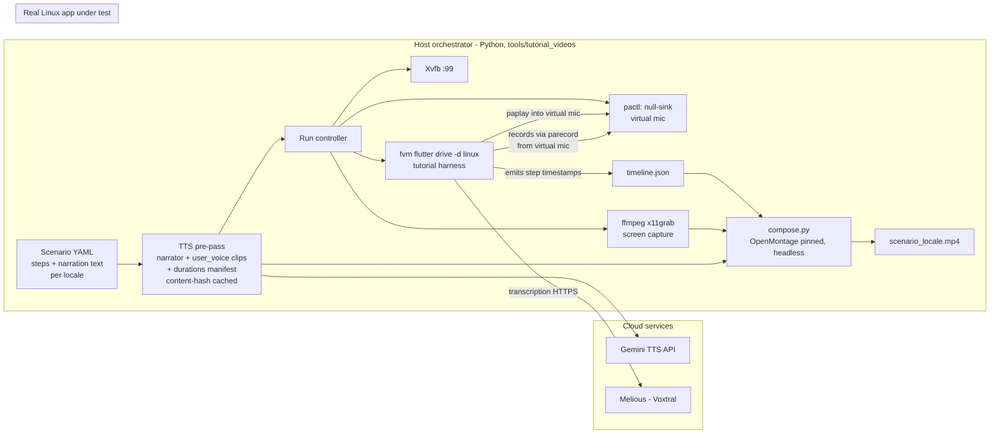

# Tutorial Video Workbench — Design & Implementation Plan

Date: 2026-07-21
Status: proposed
Target platform: Linux (validated on Ubuntu 24.04 ARM64, PipeWire + pipewire-pulse, ffmpeg with x11grab/pulse/libx264/aac, Xvfb available)

## Goal

Fully automated generation of localized onboarding/tutorial videos: drive the real Linux
desktop app through a scripted flow, record the screen, feed pre-generated speech into the
app's audio-transcription feature, narrate every step with an off-screen voice-over, and
compose the result into one MP4 per locale. Start with `en` + `de`; design for all 11
manual locales. No manual intervention anywhere in the pipeline.

The demo content reuses the existing **Intergalactic Penguin Logistics** world
(`test/helpers/manual_demo_world.dart`, localized via
`test/helpers/manual_screenshot_locale.dart` / `LOTTI_MANUAL_LOCALE`), so the videos and
the manual screenshots tell the same story in the same locales.

## Toolchain decisions

### App automation: Flutter `integration_test` driving the real Linux app

| Option | Verdict |
| --- | --- |
| **`integration_test` on `-d linux`** | **Chosen.** Runs the real desktop binary, full finder API (by key/text/type), deterministic, CI-ready, reuses `ManualDemoWorld` + `LOTTI_MANUAL_LOCALE`, and the repo already has the (legacy) precedent `integration_test/manual_screenshots_test.dart` + `test_driver/manual_screenshots_driver.dart`. Crucially, on desktop the test code runs **in the app process with `dart:io`**, so the test itself can shell out (`paplay`, timeline writes) to coordinate with the host. |
| Marionette MCP (`marionette_mcp` / `marionette_flutter`, LeanCode, 0.6.0) | Not for the production pipeline: debug-builds only, pre-1.0, element targeting needs `isInteractiveWidget`/`extractText` config for our custom design-system widgets, and LeanCode positions it for interactive dev-loop use, not structured E2E. **Keep as an authoring aid**: an agent can explore the running app interactively to script new scenarios, which then get frozen as integration tests. |
| Playwright | Rejected. Browsers only — cannot drive a Flutter Linux desktop binary. The only route is the flutter-web build via the semantics tree over a CanvasKit canvas: fragile, and it would record the wrong artifact (web build, not the shipped desktop app). |
| AT-SPI / dogtail | Rejected. Flutter's Linux ATK bridge has known AT-SPI gaps (flutter#159460); dogtail targets GTK apps and would see a sparse tree. |

**Pacing note:** integration tests normally run as fast as possible; a tutorial needs
human pacing. The tutorial harness therefore paces each step explicitly (min-duration per
step, per locale — German narration runs ~30% longer than English) and emits a **timeline
JSON** of actual wall-clock step boundaries, because some durations (transcription
inference) are inherently variable.

### Screen recording: Xvfb + ffmpeg `x11grab`

Run the app on a dedicated virtual X display (`Xvfb :99 -screen 0 1920x1080x24`), record
with `ffmpeg -f x11grab -framerate 30 -i :99`. Headless, CI-friendly, resolution fully
controlled, cursor optional via `-draw_mouse`. The host Wayland session is irrelevant —
the Flutter Linux embedder runs fine under X11/Xvfb. Capture to a lightly-compressed
intermediate (`libx264 -preset ultrafast -qp 0` or `-crf 18`) and do the final encode in
the composition step, keeping capture-time CPU low (matters on the 4-core ARM VM).

Rejected: wf-recorder (wlroots-only, not GNOME, not headless-friendly), GNOME
portal screencast (needs an interactive session/portal dialog).

### Audio into the app: PipeWire null-sink virtual microphone

The `record` plugin's Linux implementation shells out to **`parecord`** (PulseAudio
protocol; served by `pipewire-pulse` here), recording from the **default source**. So a
virtual mic makes the app's *real, unmodified* recording path hear our TTS audio:

```sh
pactl load-module module-null-sink sink_name=lotti_tutorial_mic \
      sink_properties=device.description=LottiTutorialMic
pactl set-default-source lotti_tutorial_mic.monitor
paplay --device=lotti_tutorial_mic penguin_task_de.wav   # app "hears" this
```

Validated on this machine (module loads, `.monitor` source appears). Restore defaults and
unload the module in teardown. Fallback seam if audio routing is ever flaky in CI:
`importAudioXFiles` (`lib/logic/audio_import.dart`) accepts an `.m4a` and creates the
identical `JournalAudio` entry a recording would — same downstream pipeline, skips the
mic. The virtual-mic path is preferred because the video should *show* the real recording
modal doing its thing.

### Transcription inference (in-app): Voxtral on Melious (cloud)

On Linux the app's on-device path (`mlxAudio`) is macOS-only. **Decision: use Voxtral on
Melious** — the dev machine's `ai_config.sqlite` already has the Melious provider with
`voxtral-small-24b-2507` (plus Whisper large-v3 variants) configured, so this matches
real-world app usage exactly. Deliberately via the **chat-completions endpoint, not the
plain transcription endpoint**: a Melious model id containing `voxtral` routes through
`isMeliousChatAudioModel` → `MeliousInferenceRepository.transcribeChatAudio`
(`cloud_inference_generate_more.dart:219-237`), which merges the **speech-dictionary
terms into the prompt** — so seeding the speech dictionary with penguin vocabulary
("Project Waddle", "sardine futures", …) per locale makes the quirky terms transcribe
correctly. The workbench seeds the integration-test app instance with a Melious provider
(API key from `.env`, never committed), the Voxtral model, and a profile with a
transcription skill — transcription is profile/skill-driven via
`profileAutomationService.tryTranscribe` → `skillInferenceRunner.runTranscription`, so
this seeding is what makes recording-stop actually trigger inference. Network latency is
absorbed by the timeline design (below); the harness polls for the transcript with a
generous timeout and retries once on transient failure. Local whisper/omlx remain
possible via the same provider-seeding switch but are explicitly not the default.

### Text-to-speech: cloud, Gemini TTS as default engine, pluggable

Local engines (Piper et al.) are ruled out on quality grounds. Cloud engines, evaluated:

| Engine | Notes |
| --- | --- |
| **Gemini native TTS** (default) | Runs on the **same Gemini API key already configured** in the dev app — zero new accounts. Multi-speaker-capable, style steerable via natural-language instructions ("calm tutorial narrator"), covers de/en/es/fr/ro (verify `cs` coverage before scaling past the first locales). Cheap. |
| ElevenLabs (premium fallback) | Best-in-class naturalness, 70+ languages incl. all of ours; ~$0.10/1k chars. Add as second adapter if Gemini narration quality disappoints for any locale. |
| Azure Speech | Widest accent-correct per-locale voice catalog (~$16/1M chars); third option, only if a locale is weak on both of the above. |

Two distinct streams, different voices from the same engine:

| Stream | Purpose | Voice selection |
| --- | --- | --- |
| `user_voice` | Played into the virtual mic — the "user" dictating the penguin task. Must transcribe accurately via Voxtral. | conversational voice, plain style prompt |
| `narrator` | Off-screen voice-over explaining each step. | a *clearly different* voice + calm-narrator style prompt, so viewers never confuse narrator with user |

Engine interface is pluggable (`tts/base.py`, adapters `tts/gemini.py`,
`tts/elevenlabs.py`): per-locale/stream voice mapping lives in `config/voices.yaml`, so
switching vendors per locale is config, not code. TTS output is cached by content hash
(text + voice + engine) — narration scripts change rarely, so repeat builds cost nothing
and stay byte-identical.

### Composition: OpenMontage (pinned), driven headlessly

Composition is delegated to **OpenMontage** (github.com/calesthio/OpenMontage, AGPLv3 —
an external dev tool cloned outside the repo like `lotti-docs`, never linked into the
app). It bundles Remotion, HyperFrames, and ffmpeg as selectable rendering backends and
provides exactly the post-production we need: narration clips placed at the **actual**
timestamps from `timeline.json`, multi-track mixing with ducking (optional virtual-mic
monitor bed so viewers *hear* the user dictating), intro/outro titles from style
playbooks, optional word-level captions, loudness normalization, and ffprobe-based
post-render self-review. Output: `build/tutorial_videos/<scenario>_<locale>.mp4`.

Integration rules:

- Our `compose.py` calls OpenMontage's Python tools **directly and headlessly**; its
  human approval gates are agent-workflow conventions and stay out of the CI path.
- The OpenMontage checkout is **pinned to a commit** (`config/openmontage.pin`) — the
  project has no releases yet.
- **Determinism is validated** (same inputs rendered twice → identical output) before
  the pipeline relies on it; the fallback is a thin ffmpeg/Remotion composition of our
  own driven by the same timeline JSON.

### Future: character overlay (design-for, don't build)

The character engine (`lib/features/character/`) already renders deterministic frames to
`ui.Canvas` → transparent-background PNGs (see `test/features/character/film_strip_test.dart`).
Composition therefore treats video as **layers**: layer 0 = screen capture, layer 1
(future) = character PNG sequence with alpha (OpenMontage/ffmpeg alpha compositing),
driven by the same timeline JSON (character gestures keyed to step IDs). Nothing in
phases 1–4 assumes a single video input.

## Architecture



Run sequence for one (scenario, locale):

```mermaid
sequenceDiagram
    participant O as Orchestrator
    participant T as TTS pre-pass
    participant X as Xvfb + ffmpeg
    participant A as App (integration_test)
    participant C as Compositor
    O->>T: render narration + user_voice clips (locale)
    T-->>O: clips + durations manifest
    O->>X: start display, start capture
    O->>A: fvm flutter drive -d linux --target=integration_test/tutorial/&lt;scenario&gt;_tutorial_test.dart (env: locale, manifest, timeline path)
    A->>A: seed penguin world, open task
    A->>A: step "record": open modal, start recording
    A->>A: paplay user_voice clip into virtual mic, stop recording
    A->>A: step "inference": await transcription (Voxtral on Melious)
    A->>A: step "check off": tap checklist checkbox
    A-->>O: exit 0 + timeline.json (actual step timestamps)
    O->>X: stop capture
    O->>C: compose(capture, clips, timeline)
    C-->>O: scenario_locale.mp4
```

### Module boundaries

- **Scenario config** (`config/scenarios/*.yaml`) — the single source of truth for a
  tutorial: ordered steps, per-locale narration text, per-locale user-dictation text
  (the penguin task, phrased naturally per language — not machine-translated at runtime),
  per-step minimum duration. Adding a locale = adding text blocks; adding a language the
  app supports but the scenario lacks fails validation loudly.
- **TTS layer** (`tts/`) — `Engine` interface (`synthesize(text, voice, style, out_path) -> duration`);
  Gemini adapter now, ElevenLabs/Azure adapters later. Voice mapping per locale/stream in
  `config/voices.yaml`; clips cached by content hash so unchanged scripts never re-hit
  the API. Emits a durations manifest consumed by both the Dart harness (pacing) and the
  compositor (placement).
- **Session layer** (`session/`) — context managers for Xvfb, the virtual mic
  (load/unload + default-source save/restore), and the ffmpeg capture process.
  Everything crash-safe: teardown always restores audio defaults. Secrets
  (`GEMINI_API_KEY`, `MELIOUS_API_KEY`) come from `.env`, per repo policy.
- **Dart tutorial harness** (`integration_test/tutorial/`) — `TutorialHarness` wraps
  `step(id, action)` : records start/end timestamps, enforces the locale's min duration
  from the manifest, writes `timeline.json`, and provides `speakIntoMic(clipPath)`
  (Process.run `paplay`, await completion + tail silence). Individual scenarios are thin:
  seed world → sequence of `step()` calls using standard finders.
- **Compositor** (`compose.py`) — pure function `(capture.mkv, clips/, timeline.json) -> mp4`
  that maps its inputs onto headless OpenMontage tool invocations (narration at
  timestamps, ducked mic-monitor bed, titles, captions, loudnorm). Layer-based; the
  future character overlay is just another input layer.
- **CLI** (`python -m tutorial_videos build --scenario create_task_from_audio --locale de`)
  plus `--all-locales`, `--keep-intermediates`, `--engine piper|azure`.

### Language handling

- Locale enters through one door: `--locale` → sets `LOTTI_MANUAL_LOCALE` for the app run
  (reusing `manualScreenshotLocaleFromEnvironment`) and selects scenario text + voices.
- App UI strings localize themselves (real `AppLocalizations`); demo data localizes via
  `ManualDemoWorld` / `manualScreenshotText`; narration + dictation come from the
  scenario YAML.
- Validation gate mirrors the manual pipeline: a scenario is buildable for a locale only
  if narration, dictation, and voices all exist for it (same spirit as
  `manual_check_media`).

## Project structure

```text
tools/tutorial_videos/
  README.md
  pyproject.toml            # google-genai, pyyaml; stdlib otherwise
  tutorial_videos/
    __main__.py             # CLI
    scenario.py             # YAML load + validation
    tts/base.py  tts/gemini.py
    session/xvfb.py  session/virtual_mic.py  session/capture.py
    compose.py            # OpenMontage wrapper
  config/openmontage.pin # pinned OpenMontage commit
  config/
    voices.yaml
    scenarios/create_task_from_audio.yaml
integration_test/tutorial/
  tutorial_harness.dart     # step timing, timeline.json, speakIntoMic, world seeding
  create_task_from_audio_tutorial_test.dart
Makefile:
  tutorial_video SCENARIO=... LOCALE=...   /  tutorial_videos_all
```

## Phased plan

**Phase 0 — Environment bootstrap (½ day).** Smoke scripts, each independently
verifiable: Gemini TTS synthesis of both streams in en + de (listen check + duration
extraction); x11grab of a trivial app under Xvfb; virtual-mic round-trip (`paplay` into
sink → `parecord` from monitor → non-silent WAV); Voxtral-on-Melious API round-trip —
transcribe a Gemini-TTS German penguin sentence and eyeball accuracy (this validates the
whole TTS→STT loop before any app involvement).

**Phase 1 — Scenario + TTS pre-pass (1 day).** Scenario schema + validation;
`create_task_from_audio.yaml` authored in en + de (penguin dictation text adapted from
`ManualDemoWorld` copy); Gemini engine adapter + content-hash cache + durations
manifest; unit-tested (pure Python, API mocked).

**Phase 2 — Dart tutorial harness (2–3 days, the real work).** `TutorialHarness` with
paced steps + timeline emission; real-app seeding of the penguin world (the widget-test
fixture currently rides mocks — the integration run needs DB-backed seeding; the legacy
`integration_test/manual_screenshots_test.dart` path is the precedent to build on), plus
a real Melious provider/Voxtral model/profile row (key from `.env`) so recording-stop
triggers transcription. Scenario test: open task → record modal → `speakIntoMic` → stop
→ await transcript on the entry (poll DB/provider state, generous timeout) → check off
checklist item (`Checkbox` in `checklist_item_row_state.dart`). Runs green headless under
Xvfb before any video exists.

**Phase 3 — Record + compose (1–2 days).** Session managers, capture; `compose.py`
drives pinned OpenMontage headlessly; determinism validation (render twice, byte/frame
compare); `make tutorial_video` produces `create_task_from_audio_en.mp4` and `_de.mp4`
end-to-end from a clean checkout. Definition of done for the prototype.

**Phase 4 — Polish + scale.** loudnorm, intro/outro title cards (drawtext or rendered
stills), mic-monitor audio bed, cursor emphasis, remaining locales (text first, voices
per Piper availability), CI job (artifacts like the manual screenshots workflow),
optional embedding in the docs-site.

**Phase 5 (future) — Character overlay.** Character film-strip renderer → PNG sequence
with alpha at capture resolution, timeline-keyed gestures, extra compositor layer.
Explicitly out of scope now; the layered compositor and timeline JSON are the designed-in
hooks.

## Risks / open points

- **Real-app data seeding** is the main unknown (Phase 2): the penguin fixture must be
  persisted through the real DB path at integration-test startup. Precedent exists but
  is labeled legacy; budget time here.
- **Cloud dependency**: TTS and ASR both need network + keys, so runs are not hermetic.
  Acceptable by decision; TTS caching keeps repeat builds mostly offline, and the
  timeline design absorbs variable Voxtral latency. Budget is negligible (a few minutes
  of TTS audio + short transcriptions per build).
- **Transcription trigger** requires an agent profile with a transcription skill on the
  linked task — seeded config must satisfy `profileAutomationService.tryTranscribe`.
- **Gemini TTS locale coverage**: verify `cs` (and any weak locale) before scaling past
  en/de; ElevenLabs/Azure adapters are the hedge.
- **OpenMontage maturity**: 40k-star but unversioned/young project — pinned commit +
  Phase-3 determinism validation gate its role; thin ffmpeg/Remotion composition is the
  documented fallback. (Note: the Voxtral **chat-audio** path passes `impactCollector`,
  so AI consumption attribution works for tutorial transcriptions — the known Melious
  attribution gap affects other audio paths, not this one.)
- 4-core VM: capture with ultrafast preset, encode after; keep capture ≤1080p30.
