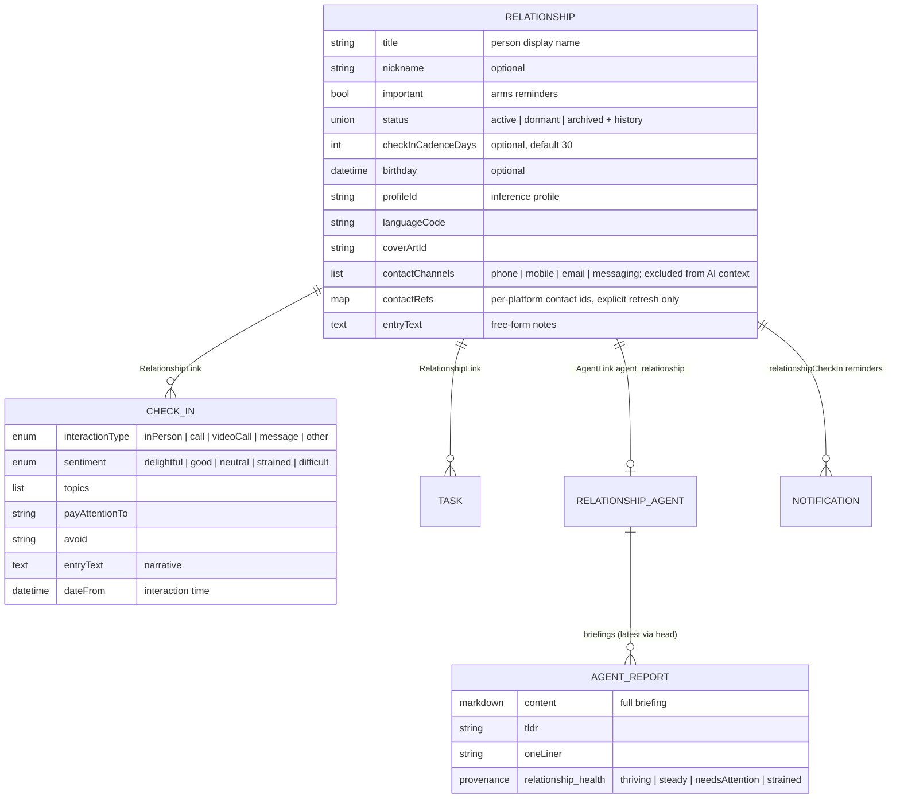

# Relationship Management — Implementation Plan

- Date: 2026-07-22
- Status: Plan (nothing implemented)
- ADRs: [0037](../adr/0037-relationship-on-device-storage-and-privacy.md),
  [0038](../adr/0038-relationship-domain-model.md),
  [0039](../adr/0039-relationship-check-in-reminders.md),
  [0040](../adr/0040-relationship-executive-briefing.md),
  [0041](../adr/0041-relationship-contact-linking.md)

## Goal

Relationships as a first-class, long-running concept: one entity per person
with a timeline, structured check-ins, importance-gated reminders, and an
AI executive briefing before the next interaction. Local-first per
ADR 0037: on-device storage, opt-in end-to-end encrypted sync, cloud AI
only by explicit choice. Pre-1.0 roadmap item.

## Data model summary

Both new entities are `JournalEntity` subtypes (JSON in the `journal`
table); links reuse `linked_entries` with a new `RelationshipLink` variant;
reminders are `NotificationEntity.relationshipCheckIn` rows in
`NotificationsDb`; briefings are `AgentReportEntity` rows. No journal
schema migration in phase 1.

## Phase 1 — Domain model and persistence

1. `lib/classes/relationship_data.dart`: `RelationshipStatus` sealed union
   (`active`/`dormant`/`archived`, mirroring `ProjectStatus` field shape)
   and `RelationshipData` per ADR 0038.
2. `lib/classes/check_in_data.dart`: `CheckInInteractionType`,
   `CheckInSentiment`, `CheckInData`.
3. `lib/classes/journal_entities.dart`: `JournalEntity.relationship` and
   `JournalEntity.checkIn` factories; extend the `affectedIds` switch.
4. `lib/classes/entry_link.dart`: `RelationshipLink` variant.
5. Exhaustive-switch sweep (compiler-driven):
   `lib/database/conversions.dart` (`type` strings `Relationship`/`CheckIn`,
   link `type` mapping), `lib/utils/file_utils.dart`
   (`folderForJournalEntity`, `typeSuffix`),
   `lib/features/journal/ui/widgets/list_cards/journal_card.dart`,
   `lib/features/journal/ui/widgets/entry_details_widget.dart`.
6. `lib/logic/persistence_logic.dart`: `createRelationshipEntry`,
   `createCheckInEntry` (auto-links check-in to its relationship).
7. Deletion cascade: deleting a relationship soft-deletes linked check-ins,
   agent links/reports, and pending reminder rows (ADR 0037 §5).
8. `make build_runner`; unit tests for JSON round-trips, conversions,
   cascade, and link queries.

Exit: analyzer clean, targeted tests green, sync round-trip test for both
subtypes (payload-agnostic path needs no new sync code).

## Phase 2 — UI: list, detail, check-in capture, task linking

1. `lib/features/relationships/` feature module (state, repository facade
   over `JournalRepository`, UI) plus feature README with lifecycle
   Mermaid diagram.
2. Relationships list page (nav entry): name, one-liner (from briefing when
   present), importance star, last-check-in recency; sorted by recency.
3. Relationship detail page: header (name, status, importance, cadence,
   briefing card placeholder), timeline via the existing
   `LinkedEntriesController` machinery, "Log check-in" action.
4. Check-in capture sheet: interaction type, date, sentiment selector,
   topics, pay-attention/avoid fields, narrative text; editable afterwards
   like any journal entry.
5. Task linking: "Link task" from relationship detail and "Link person"
   from task detail, writing `RelationshipLink` rows; linked tasks section
   on the relationship page.
6. Contact channels (ADR 0041): editable channel list on the relationship
   editor (all platforms); "Link contact" OS picker on iOS/Android (new
   dependency, e.g. `flutter_contacts`) with explicit "Update from
   contact" refresh; call/message/email quick actions on the detail header
   via `url_launcher`; pending-interaction marker + post-resume check-in
   prompt pre-filled with interaction type and time.
7. All strings in all six ARB files (`make l10n`, informal tone; Romanian
   formal); design-system tokens only; widget tests per touched widget.

Exit: full flow usable end-to-end on desktop and mobile layouts; widget
tests cover list/detail/capture; analyzer clean.

## Phase 3 — Reminders

1. `NotificationEntity.relationshipCheckIn` variant + exhaustive-switch
   updates in the notifications feature and sync event processor.
2. `RelationshipReminderService`: eligibility rule (important + active +
   cadence elapsed), producer hooks on check-in save and relationship save,
   stable ids per ADR 0039 §4.
3. Wire `NotificationScheduler.reconcile()` into app startup; tests for
   restart re-arming (fake time, no real timers per `test/README.md`).
4. Inbox rendering + tap-through to the relationship detail page;
   localized, content-minimal notification copy.
5. Windows/Linux: verify inbox-only behavior degrades gracefully.

Exit: reminder fires for an important relationship past cadence on
iOS/macOS/Android; acting on it syncs `actedOnAt` across devices; service
and scheduler tests green.

## Phase 4 — Executive briefing

1. Agent registration: `AgentKinds.relationshipAgent`,
   `AgentLinkTypes.agentRelationship`,
   `AgentTemplateKind.relationshipAgent`; audit every exhaustive switch.
2. `RelationshipAgentService` (lazy create + link, mirroring
   `TaskAgentService`).
3. `relationship_agent_workflow.dart`: context assembly per ADR 0040 §4,
   profile-resolved inference, `update_report` tool emitting
   content/tldr/oneLiner + `relationship_health` provenance.
4. Report contract file mirroring `project_agent_report_contract.dart`;
   extract the shared health-band provenance parsing into a common helper
   used by both project and relationship metrics.
5. Briefing UI: card in the relationship detail header (resolver in the
   `TaskSummaryResolver` style), health-band chip, "Brief me" trigger with
   provider disclosure when the profile routes to a cloud model, debounced
   post-check-in refresh, and the call/message quick-action row on the
   briefing card (ADR 0041).
6. Template honesty rules (grounding, recency, not-enough-data) with tests
   on the context builder and provenance parsing.

Exit: briefing generates from seeded check-ins against a local profile in
tests; health band renders; no inference without a trigger.

## Phase 5 — Documentation and release readiness

1. Manual: promote the roadmap section into a full feature page under
   `docs-site/docs/organize-and-reflect/` with registered screenshot cases
   (`features.json`, `screenshot-cases.json`, capture tests), all 11
   locales; trim the roadmap entry accordingly.
2. `PRIVACY.md`: relationship-data section per ADR 0037 §6.
3. Feature README kept current throughout; CHANGELOG entry under the
   then-current version when the feature ships.
4. Flip ADRs 0037–0040 to Accepted as their phases land.

## Testing and quality gates (every phase)

- `dart-mcp.analyze_files` zero warnings; `fvm dart format .`.
- One test file per source file; centralized mocks/fallbacks;
  `makeTestableWidget`; fake time only; deterministic dates.
- No dependencies from new code on deprecated legacy AI paths
  (`AiResponseType.taskSummary` et al.).

## Open questions (decide before the affected phase)

- Phase 2: does the relationships list live in the main nav or under a
  hub page? (Nav real estate decision — needs product input.)
- Phase 3: default cadence 30 days — confirm, and whether cadence presets
  (weekly/monthly/quarterly) beat a free integer field.
- Phase 4: whether birthdays produce their own reminder variant or wait for
  a later iteration.
