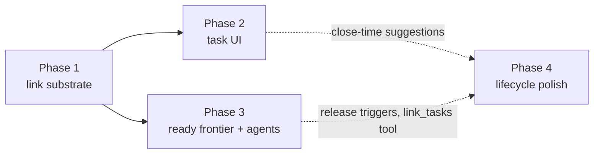

# Typed Task Relationship Links — Implementation Plan

Grounds ADR 0042 (typed task relationship links) and ADR 0043
(dependency-aware planning) in the code as it exists on main. Written
2026-07-23.

## Goal

Give tasks first-class semantic relationships — blocks / is blocked by,
follows up on, duplicates, fixes, supersedes — on the existing
`EntryLink`/`linked_entries` substrate, then feed the derived ready
frontier into the planning agents' task corpus and the coordinator's
directive ritual, and surface the relationships in the task UI.

## What the code audit established

- `linked_entries` needs **no schema change**: `type TEXT NOT NULL`,
  `UNIQUE(from_id, to_id, type)`, and indexes on `from_id`, `to_id`,
  `type`, `(to_id, type)` already exist. The type column is derived from
  the `EntryLink` union variant on write (`linkedDbEntity` in
  `lib/database/conversions.dart`).
- Every basic-link consumer is already type-scoped
  (`basicLinksForEntryIds` filters `type = 'BasicLink'` in SQL), so time
  attribution, the linked-entries timeline, and capture attribution cannot
  see new types by construction.
- `EntryLink` is `@Freezed(fallbackUnion: 'basic')`: old builds
  deserialize unknown variants as `BasicLink` (visible generic link, no
  crash). Old-build *mutation* of a typed link would down-type it on
  re-serialization — rare (links are barely mutated after creation), and
  mitigated by shipping model variants one release before UI writes them.
- Creation/sync path is generic: `PersistenceLogic.createLink` (uuid v1,
  vector-clock scope, `SyncMessage.entryLink` outbox enqueue, update
  notifications) and `JournalDb.upsertEntryLink` (equality precheck +
  triple-conflict guard) work for any variant; only the hardcoded
  `EntryLink.basic(...)` constructor call needs a type parameter. The sync
  receive path deserializes via `EntryLink.fromJson` and is likewise
  generic.
- Task statuses: `open | inProgress | groomed | blocked | onHold | done |
  rejected`; `isClosedTask` = `DONE | REJECTED`
  (`day_agent_capture_helpers.dart`). The manual `blocked` status stays
  and can be optionally enriched with a named blocker (ADR 0042 §4).
- Task-link UI today: `lib/features/tasks/ui/linked_tasks/`
  (`linked_tasks_widget.dart`, `link_task_modal.dart`).
- Agent corpus: `DayAgentCorpusService.buildTaskCorpusSnapshot`
  (`getOpenTasksForDayAgentCorpus` + `getTasksDueOnOrBefore`, cap 200)
  serves both capture matching and drafting — blocked tasks must stay in
  it (annotate, never exclude; ADR 0043 §1).

## Phases

### Phase 1 — Link substrate (model, storage, sync)

1. **Union variants** in `lib/classes/entry_link.dart`: `blocks`,
   `followsUp`, `duplicates`, `fixes`, `supersedes` — same field shape as
   `BasicLink`. Regenerate freezed/json.
2. **Type derivation**: extend the `link.map(...)` in `linkedDbEntity`
   (compile-time exhaustive, the compiler finds every fold site). Type
   strings follow the existing convention (`'BlocksLink'`, …).
3. **Typed batch query** in `database_links_ratings.dart`:
   `typedLinksForTaskIds(Set<String> ids, {required Set<String> types})`
   returning live links where `to_id IN ids` or `from_id IN ids` for the
   requested types (two indexed selects, union in Dart). Mirror the
   `basicLinksForEntryIds` snapshot discipline; coalescing only if a
   profiler shows the same fan-out pressure.
4. **Creation/deletion**: `PersistenceLogic.createLink` gains a link-type
   parameter (default basic — zero call-site churn); the existing
   tombstone/delete path is verified for typed links. Direct-cycle guard
   for `blocks` (bounded local traversal, reject on visible cycle;
   ADR 0042 §5).
5. **Sync verification**: round-trip test through the sync processor for a
   typed link (serialize → receive → upsert → read back), plus a
   fallback-union test pinning that an unknown future type degrades to
   `BasicLink` without crashing.
6. **Tests**: conversions (type column per variant), query (direction +
   type scoping + tombstone exclusion), persistence (vector clock, outbox
   enqueue, UNIQUE-triple upsert), cycle guard.

Phase 1 ships alone (model-first rollout, no UI writes) to open the
old-build compatibility window before any device can create typed links.

### Phase 2 — Task UI

1. **Relationship picker** in `link_task_modal.dart`: choose the relation
   when linking task→task (both phrasings per ADR 0042 §2 — picking
   "is blocked by" swaps from/to before persisting `blocks`).
2. **Grouped rendering** in `linked_tasks_widget.dart`: labeled sections —
   Blocks, Blocked by, Follow-ups, Duplicates, Fixes, Superseded by — with
   inverse labels computed from direction; tap navigates to the task.
3. **Blocked affordance on task detail**: a chip/banner naming the open
   blocker(s) when the ready computation says blocked; mutual-block
   (cycle) rendering per ADR 0042 §5.
4. **Status enrichment (optional path)**: setting `TaskStatus.blocked`
   offers — never requires — picking the blocking task, persisting a
   `blocks` edge alongside the status.
5. **l10n**: every label in all six arb files (informal tone; `en_GB`
   only when spelling differs), `make l10n` + `make sort_arb_files`.
   Design-system tokens only for all styling.
6. **Tests**: modal flow (direction swap verified against the persisted
   row), grouped rendering with meaningful assertions, blocked-chip
   states, status-enrichment flow.

### Phase 3 — Ready frontier + agents (ADR 0043)

1. **Dependency resolver**: batch seam answering blocked-status for a set
   of task ids — one `(to_id, type)`-indexed link fetch + one batch
   blocker-status load; one hop, visited-set safe, no per-task fan-out.
2. **Corpus annotation**: `buildTaskCorpusSnapshot` rows gain `blockedBy:
   [{taskId, title, status}]` on link-blocked rows only. Absence means
   *link-ready*, not free to schedule: "blocked for planning" is the union
   `status == BLOCKED || blockedBy.isNotEmpty` (ADR 0043 §1) — the manual
   status is already visible in every row's `status` field, so the corpus
   shape needs no second flag.
3. **Prompt rules** in `day_agent_prompt_builder.dart`, conditional on the
   dependency data path being configured. Drafting/refine carry the ADR
   0043 §3 predicate verbatim: a task blocked for planning
   (`status == BLOCKED` or non-empty `blockedBy`) may be placed only if
   (a) the same plan places work on its blocker earlier in the day, or
   (b) the block's `reason` explicitly names the blocker and why the work
   can proceed despite it; prefer scheduling blockers. Digest: commitments
   target ready work or name the blocker in an attention note.
4. **Tests**: resolver (direction; closed blocker → released; tombstoned
   blocker → released; unresolvable blocker (link without loadable task)
   → still blocked, per ADR 0042 §4; cycles → all-blocked), corpus
   annotation shape including the manually-blocked-without-links case
   (status `BLOCKED`, no `blockedBy` key), workflow prompt assertions for
   both rule blocks, byte-stability of the snapshot for dependency-free
   corpora.
5. **Docs**: feature READMEs (tasks, daily_os_next) updated with the new
   sections and a state/flow diagram; ADR 0042/0043 status flipped to
   Accepted with amendments for any deviations found while building.

### Phase 4 — Lifecycle polish (deferred, separately justified)

Not committed by this plan; listed so they are decided deliberately later:

- Close-time suggestions: canonical closed → offer closing duplicates;
  `supersedes` created → offer closing the superseded task (ADR 0042 §6).
- `link_tasks` agent tool so capture parsing can assert dependencies the
  user speaks ("the deploy waits on the fix") behind the ChangeSet gate.
- Blocker-closed release notifications / wake triggers.
- Task-list row badges for blocked state.

## Acceptance criteria

- Analyzer zero warnings; all suites green; patch coverage ≥99%.
- A typed link created on device A renders with correct semantics on
  device B (sync round-trip) and as a plain link on a pre-rollout build
  without crashing.
- Time attribution and the linked-entries timeline are byte-identical
  before/after (typed links invisible to `type = 'BasicLink'` consumers) —
  pinned by regression tests.
- A blocked task remains matchable by capture parsing and is annotated,
  not hidden, in the drafting corpus.
- Phase gating: no UI write path ships in the same release as the model
  variants (old-build mutation window, ADR 0042 Consequences).

## Risks

| Risk | Handling |
| --- | --- |
| Old build mutates a typed link and down-types it | Model-first rollout (phase 1 alone), rarity of link mutation; accepted in ADR 0042 |
| Concurrent cross-device cycle creation | Read-time visited-set tolerance; cycle = mutual block, surfaced not hidden |
| Corpus token growth | Annotation only on blocked rows; absence means ready |
| Vocabulary creep | Closed set; additions require an ADR 0042 amendment |
| Capture matching regression from corpus changes | Annotate-never-exclude rule + explicit test |
