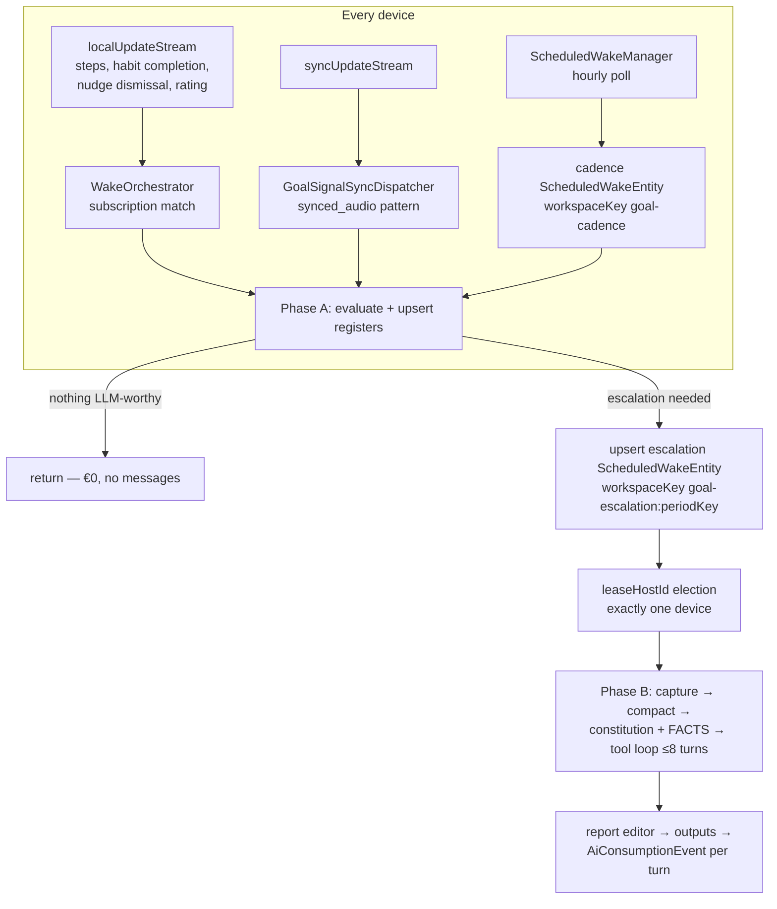

# Goal-Driven Agents — Design Specification (Phase 3)

- Status: Draft for review, 2026-08-08
- Decisions this design implements: ADR 0053 (per-goal producers), 0054
  (deterministic-first two-tier wakes), 0055 (banner-nudge channel, rating &
  reuse), 0056 (need-to-know visual brief), 0057 (decade-scale memory)
- Companions: [phase-1 assessment](2026-08-08_goal_agents_phase1_assessment.md),
  [kickoff plan](2026-08-08_goal_agents_kickoff_plan.md),
  [eval methodology](../evaluations/goal_agent_models/README.md),
  [chat requirements](2026-08-08_reusable_chat_interface_requirements.md)
- Already on the branch: the pure-Dart goal core
  (`lib/features/goals/model/`, `lib/features/goals/evaluation/`) and the
  eval harness (`test/features/agents/eval/goal/`), both green.

## 1. Wake architecture

Invariant (ADR 0054): **a tick that changes nothing costs €0 and writes no
messages.** Two tiers:

- **Phase A — deterministic, every device, every trigger.** Pure Dart, no
  model, no capture, no agent messages. Loads the goal spec head, re-arms
  the cadence wake, runs `GoalProgressEvaluator` + `GoalTrackPolicy` over a
  `GoalSignalWindow` read from the journal, upserts the `goalProgress`
  keyed register (recompute-never-accumulate → LWW-convergent), derives
  `GoalWakeFacts`, and *returns* unless something is LLM-worthy.
- **Phase B — LLM, lease-elected single device.** Runs only on state
  transitions, ad staleness, scheduled dialogue moments, or an unanswered
  user message. The system prompt + tool surface are the eval spec
  (`goal_agent_spec.dart`), graduated into `lib/`.

### Triggers and routing



- **Subscriptions per goal** (registered by `GoalRuntimeMaintenance
  implements AgentRuntimeMaintenance`, restored at startup, wired in
  `app_bootstrap.dart` beside the Daily OS block): the criterion tree's
  `dataType` strings (e.g. `cumulative_step_count`), its `habitId`s (NOT
  the global `HABIT_COMPLETION` sentinel), and
  `goalNudgeToken(agentId)` for dismissal/rating writes.
- **Sync blind spot** (phase-1 assessment §4): synced entries reach only
  `syncUpdateStream`, so a desktop would never wake from phone-imported
  steps. `GoalSignalSyncDispatcher` follows
  `synced_audio_inference_dispatcher.dart` 1:1 and wakes **Phase A only**
  on receiving devices — idempotent keyed registers make N devices
  converge rather than duplicate.
- **Phase B single-flight**: Phase A never invokes the LLM directly; it
  arms an *escalation* `ScheduledWakeEntity` at a deterministic id, and
  the existing `leaseHostId` election picks exactly one device. The
  arming device nudges its own scheduled-wake manager for immediacy;
  if it dies, any other device picks the wake up within the hourly poll.
  Worst case ≤1 h remote latency — accepted and documented.
- **Recurrence without schema change**: cadence wakes re-arm at Phase A
  start at a deterministic id (workspaceKey `goal-cadence`), self-healed
  by `beforeWakeScan()`. Hourly granularity is ample for a coach.
- **Registry trap** (phase-1 assessment §2): `wireWakeExecutor` falls back
  to the task-agent workflow *silently* for unregistered kinds. PR 2 ships
  a regression test asserting `goal_agent` resolves to its own runner.

### GoalWakeFacts and the tool gate (ADR 0051 designed in)

Phase A's output is a typed facts object; Phase B's tool surface is gated
on it (`task_agent_tool_gate.dart` precedent — "a tool that cannot succeed
is an invitation to invent its arguments"):

| Fact | Tool exposed |
| --- | --- |
| `statusTransitioned` | `update_goal_report` (absent tool = wake CANNOT churn) |
| `hasActiveNudge` | `retire_goal_ad` |
| `offTrackOrWorseningAndNoFreshNudge` | `create_goal_ad` |
| ...and `topRatedReusableNudges` non-empty | `rerun_goal_ad` (offered alongside create; prompt prefers it) |
| `inDialogue` / clear change request | `propose_goal_revision` (ChangeSet-gated) |
| `specImpliesCadenceAndDrifted` | `upsert_standing_agreement` (ChangeSet-gated) |
| always | `record_goal_observation`, `remember`, `search_memory`, `set_next_check_in` (bounded/day) |

The FACTS block rendered into the prompt is exactly the shape the eval
fixtures author (`buildStepsFacts`/`buildGymFacts`) — the eval is the
contract; the runtime renders the same JSON from real registers.

## 2. Ad pipeline

```
Phase B decides (create_goal_ad | rerun_goal_ad)
  → goalNudge DRAFT row carrying ONLY the typed GoalNudgeBrief
  → GoalAdPipeline consumes drafts
      create: GenerateImageService → Nano Banana Pro (direct Gemini)
              → brief-match verification (one cheap vision call, ≤1 retry)
              → importGeneratedImageBytes → JournalImage → status ready→active
      rerun:  re-activate existing row + image, fresh staleAt — zero image cost
  → activeGoalNudgesProvider (reactive) → banner surfaces
```

- **Privacy boundary at the handler** (ADR 0056): the outbound image
  prompt is built exclusively from the typed brief fields
  (`sceneConcept`, `mood`, `stylePreset`) plus a fixed style contract
  (16:9, centre-safe, no readable text — the Flux cover-art skill
  contract). The handler has **no repository access** in its
  prompt-construction path; that is enforced by constructor shape, not
  review. Reference images (persona consistency) must carry non-null
  `aiAttribution` — user photos are structurally excluded. The leakage
  eval (`ad_leakage_pressure`) checks the model side; a unit test on the
  prompt builder checks the code side.
- **`GenerateImageService` extraction**: lift
  `skill_inference_runner.dart:884-965` (generateImage → attribution →
  `importGeneratedImageBytes(linkedId: null)`) into a service both the
  skill runner and the goal pipeline call. Needs an agent-origin
  `AiWorkAttribution` variant so image spend lands on the goal's
  `agentId` (per-goal cost rollups come free via
  `AiWorkType.imageGeneration`).
- **Verification**: one flash-class vision call returning
  `{matchesBrief, mismatches[]}`; one regeneration with corrections; then
  typed failure (`status: failed` + observation), never publish a wrong
  banner. Flag-gated, default ON. Outcome recorded in the nudge's
  `provenance` map.
- **Headline/caption composited on-device** (ADR 0055): text never
  travels to the image provider, past ads render forever in history, and
  copy stays accessible and theme-aware.

### goalNudge lifecycle

`draft → ready → active → dismissed | retired | expired | superseded |
failed`, with **reuse re-entry** `retired → active` (fresh `staleAt`, same
row, full history kept). Fields beyond the brief: `briefDigest` (dedupe),
`runKey`/`threadId` provenance, `imageEntryId`, `staleAt`,
`triggerProgressId`, `reasonSummary`, `headline`/`caption`,
**`ratings: [{rating, ratedAt}]`** (append per run — the trajectory
detects wear-out), **`totalVisibleMs`, `impressionCount`,
`firstShownAt`/`lastShownAt`** (visibility sessions reported by the banner
widget; LWW-merged per device, summed for display).

Respect mechanics (quality, not budget): `briefDigest` dedupe against the
trailing week; 24 h post-dismissal cool-down per goal. **No spending
caps** — see §6.

## 3. Banner presentation

New `lib/features/goals/ui/` (tokens mandatory, l10n for static chrome in
all catalogs; generated ad copy is content, not localized):

- **`GoalAdBanner`** — shrink-to-nothing when no active nudge (the
  `KnowledgeNudge` contract). Mounts v1: Daily OS day page nudge stack
  (after `KnowledgeNudge`, `day_page.dart:411-428`) and the habits tab
  (after `HabitsSummaryCard`). The app-shell structural band
  (`DemoModeScaffold` pattern) stays a documented escalation, not built.
- **`GoalAdCard`** — `EventCoverImage` ingredients (cover fit, scrim,
  gradient fallback, `FileWatcherMixin` for late-synced image bytes),
  on-device headline overlay, persona attribution line, 44 px dismiss X,
  tap → goal chat. Dismiss and tap are never one gesture.
  The card **reports visibility sessions** (visible ≥50% → session start;
  hidden/disposed → session end, accumulated onto the nudge row).
- **`GoalAdCarousel`** — first carousel primitive: `PageView` + dots,
  manual swipe only, fixed height, reduced-motion respected.
- **Rating prompt** — on tap-through, the chat opens with a lightweight
  inline rating strip for the tapped ad (skippable; every re-run asks
  anew; skipped prompts don't nag within the same run). Ratings append to
  the nudge row; the agent reads top-/bottom-rated briefs in its FACTS.

## 4. Goal evolution

- The **only** mutation path is `propose_goal_revision` → ChangeSet →
  user approval → new `goalSpecVersion` + head move (template/soul
  version+head pattern; `authoredBy` provenance via
  `AgentAuthors.isSystemAuthored`). No auto-accept tier: over a decade of
  trust, the coach never quietly moves its own goalposts. User-authored
  edits write directly.
- "State your current goal" is a head→version read, zero inference —
  the eval's `wk_dialogue_over_report` scenario pins the behaviour.
- Habit-rule import: `GoalCriterion.fromAutoCompleteRule` (shipped, on
  this branch) seeds a goal from an existing habit in one tap; the setup
  sheet offers window/aggregation upgrades ("same threshold, but as a
  rolling weekly average").
- StandingAgreement becomes a **derived projection** with its first
  writer: ChangeSet-gated `upsert_standing_agreement` at a deterministic
  id when the spec implies calendar cadence. Planner negotiation stays a
  future seam (ADR 0023 unchanged on that axis).

## 5. Memory over a decade (ADR 0057)

- **Bounded reads are the invariant; pruning defaults to OFF.** No wake
  ever re-reads full history: context = spec head render + last ~8
  `goalProgress` periods as a table + nudge state + knowledge hooks +
  compacted tail. Raw history stays forever as cold, searchable data.
- Reuse `PlannerKnowledgeEntity` as-is; goal context reads
  `allFor(agentId)`; `remember` writes user-stated facts to `confirmed`.
- Extract shared `agent_memory_search.dart` from
  `day_agent_tool_handlers.dart:275-353`; goal agents get `search_memory`
  on day one (memory stops being write-only for non-day agents).
- Observation reads bounded: repository method "recent N + all critical";
  the task-agent read-all site gets the same one-line fix as cleanup.
- Epoch summaries: quarterly fold → `summaryDepth: 1` message; yearly →
  depth 2. ADR 0017 machinery unchanged underneath; epochs double as the
  agent's own retrospective.
- Cold-prefill budgets: `compactAndAssemble(budget: 12000,
  retainTokens: 4000)` per call (parameters exist), ≤8K input target. The
  50k/20k defaults stay for task agents whose warm-cache assumption holds.

## 6. Cost: monitoring, never caps

Session decision (2026-08-08): **no hard spending caps anywhere.**

- Every Phase B turn and every image generation already lands as an
  `AiConsumptionEvent{agentId, wakeRunKey, credits, tokens, …}` — per-goal
  rollups are a `consumption_repository` query away.
- Goal detail UI surfaces per-goal spend (text + image, `formatCredits`
  EUR presentation).
- Evals report credits/case and credits/goal-month as **observed
  estimates** with the wakes/day assumption printed (see the evaluations
  README). Predictions to validate, not budgets: Phase B ~4/wk ≈
  €0.08/mo, dialogue ≈ €0.20/mo, images cents each at a few per off-track
  day — order €0.1–1/goal-month expected.
- The rating library bends the image curve down over time: the more
  history, the more often `rerun_goal_ad` (€0) beats `create_goal_ad`.
- Caps remain a documented future option if monitoring ever shows a
  problem. Phase A/B stays as engineering discipline, not quota.

## 7. Component inventory

New (`lib/features/goals/`): `model/` + `evaluation/` (shipped),
`service/goal_agent_service.dart`, `service/goal_ad_pipeline.dart`,
`service/generate_image_service.dart` (extraction),
`state/` (active-nudges, per-goal spend, goal list providers),
`workflow/goal_agent_workflow.dart` + `goal_wake_facts.dart` +
`goal_tool_dispatcher.dart`, `sync/goal_signal_sync_dispatcher.dart`,
`ui/` (banner/card/carousel/rating strip, setup sheet, goal chat page).

Modified: `agent_domain_entity.dart` (+4 variants: goalSpecVersion,
goalSpecHead, goalProgress, goalNudge), `agent_db_conversions.dart`,
`agent_constants.dart` (`goalAgent` kind), `app_bootstrap.dart`
(runner + maintenance registration), retention policy (register
exemptions, skip-deadlock repair), db-notification token helper,
`skill_inference_runner.dart` (delegates to the extracted service),
day-agent tool handlers (search extraction).

## 8. Build phasing (each PR green and mergeable)

| PR | Contents | Proof |
| --- | --- | --- |
| 0 (this branch) | ADRs, docs, goal core, eval harness | 211 tests, eval run book |
| 1 | Entity variants + conversions | JSON round-trips, register id determinism |
| 2 | Deterministic runtime, headless | Phase A unit tests; **non-fallback regression test**; sync dispatcher tests |
| 3 | Phase B LLM tier | Workflow tests with recorded strategy; live smoke vs eval scenarios; consumption attribution asserted |
| 4 | Revision flow + StandingAgreement writer | ChangeSet approval tests; head-move provenance |
| 5 | Nudges: pipeline, banner UI, rating, visibility | Widget tests incl. dismiss/rate/reuse; screenshot pairs per surface |
| 6 | Decade hardening: epochs, search extraction, retention repair | Property tests on fold boundaries |

CHANGELOG: first user-visible entry lands with PR 5 (banners) — earlier
PRs are invisible work.

## 9. Risks

- **Wake latency bound** — lease pickup after armer death is ≤1 h; fine
  for a coach, documented so nobody "fixes" it with polling.
- **Lease race duplicate Phase B** — costs ~€0.005 and is idempotent
  (keyed registers, report editor); accepted.
- **Silent task-agent fallback** — regression test in PR 2 (the registry
  falls back silently today).
- **Evaluator vs habit-UI drift** — habit streak semantics live in
  `habits_controller.dart`; fixtures pin the shared cases; any divergence
  is a defect in whichever side changed contract-free.
- **Image-brief leakage** — dual enforcement: typed brief + no-repo
  handler (code), leakage eval (model). Neither alone is sufficient.
- **Voice/token creep in chat** — budgets are structural (§5), not
  advisory.
- **Rating-prompt fatigue** — skippable, never nags within a run; if
  telemetry shows skip-rates near 100%, drop to sampling rather than
  removing the signal.
