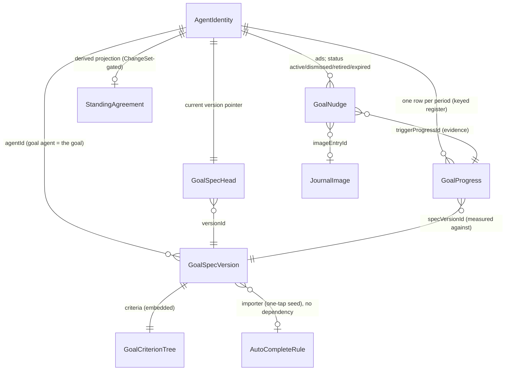

# Goal-Driven Agents — Phase 1 Assessment: the Existing Agentic Substrate

- Date: 2026-08-08
- Status: Assessment (input to ADRs 0053–0057 and `2026-08-08_goal_agents_design.md`)
- Method: code audit of `lib/features/agents/`, `lib/features/daily_os_next/agents/`,
  `lib/features/ai*/`, the eval suites, and ADRs 0001–0052, performed against the tip of `main`
  (`04e6eeb2b`). Every claim carries a code or document reference; where a claim matters to a
  build decision, re-verify against source before depending on it.

## 1. Executive summary

The substrate for a long-running, mostly dormant, one-per-goal agent **mostly exists and is
unusually well factored**. The wake orchestration, content-addressed capture, prefix-coverage
compaction, versioned template/soul machinery, the ChangeSet user-approval gate, per-call cost
attribution, and the kind-agnostic agent UI are all reusable as-is. Two findings reframe the
feature before any new design work:

1. **ADR 0023 (`docs/adr/0023-durable-domain-agents-and-time-negotiation.md`, status Proposed,
   zero code) already specifies the producer-side "domain agent" this feature needs** — durable,
   self-scheduled, evidence-citing agents for fitness/sleep that negotiate with the day planner.
   Goal agents should be built as that ADR's producer side, at deliberately finer granularity
   (per goal, not per scope; §5), rather than as an unrelated feature.
2. **`StandingAgreementEntity` is a fully modeled goal container that nothing writes**
   (`lib/features/agents/model/agent_domain_entity.dart:516` — scope incl. `fitness`/`sleep`,
   cadence daily…yearly, `minCount`/`minMinutes` quotas, enforcement tiers, evidence refs). It is
   read by the day-planner context builder and by nothing else. The goal agent becomes its first
   writer — as a *derived projection* of the goal spec, not as the goal record itself (§6.4).

What is genuinely missing: a goal entity with version history, a criteria representation with
time windows and quotas, **any evaluator** for criteria (the existing `AutoCompleteRule` tree has
never had one), a recurrence story for scheduled wakes, wake routing for sync-origin data, a
banner surface, and a memory policy that survives ten years. None of these require redesigning the
core; they are additions at seams the framework already exposes, plus a small number of targeted
fixes to policies that are actively hostile to long-lived agents (§7).

## 2. What exists and works (reuse as-is)

| Capability | Where | Assessment |
|---|---|---|
| Evidence-triggered wakes | `WakeOrchestrator` (`lib/features/agents/wake/wake_orchestrator.dart:141`), token match → vector-clock self-suppression → 120 s throttle → deterministic run keys → per-agent single-flight | Sound. Trigger tokens for our data sources already exist (§4.1). |
| Scheduled wakes + single-device election | `ScheduledWakeManager` (`lib/features/agents/wake/scheduled_wake_manager.dart:30`), `ScheduledWakeEntity.leaseHostId/leaseUntil` | Hourly poll granularity is ample for goal cadences. The lease election is the mechanism the two-tier wake design rides on. |
| Capture + compaction | `AgentWakeMemory` (ADR 0020), prefix-coverage summary checkpoints (ADR 0017), content-addressed payloads, byte-stable prompt prefix (property-tested) | Never destructive; convergence-safe. Budgets are per-call parameters, so goal agents can run far smaller windows than the task-agent 50k/20k defaults. |
| Versioned configuration | Templates + souls: immutable versions, head pointers, `authoredBy` provenance (ADR 0052 fixed the provenance-by-string-comparison bug via `AgentAuthors.isSystemAuthored`) | The exact pattern the goal spec should copy (§6.1). |
| User-approval gate | `ChangeSetBuilder` + deferred tools + `ChangeDecision` (ADR 0006) | Reused unchanged for goal revisions and standing-agreement writes. |
| Tool-surface discipline | `TaskAgentWakeFacts` precondition gating (`lib/features/agents/tools/task_agent_tool_gate.dart`), staged exposure, ADR 0051 | The "a tool that cannot succeed is an invitation to invent its arguments" doctrine is proven and must be designed in from day one for goal agents, not retrofitted (task agents ship with it flag-off; §8). |
| Cost attribution | `AiConsumptionEvent{agentId, wakeRunKey, credits, costCreditsDecimal, tokens, energy…}` in synced `ai_consumption.sqlite`; EUR presentation via `formatCredits` | Per-goal cost rollups are a query away — this is the entire basis of the monitoring-not-caps cost policy. Only Melious reports credits, and only on the non-streaming path (`knowledge/features/ai/provider-routing.md:106-121`). |
| Kind-agnostic UI | `AgentListingShell`, `AgentInternalsBody` (Stats/Reports/Conversations/Observations/Activity), `AgentConversationLog`, pending-wakes tab | Goal agents appear in all of it for free once the kind exists. |
| Image generation | `SkillInferenceRunner.runImageGeneration` → `CloudInferenceRepository.generateImage` → `importGeneratedImageBytes` (`lib/logic/image_import.dart:653`); **Nano Banana Pro already catalogued** as `models/gemini-3-pro-image-preview` (`lib/features/ai/util/known_models_data.dart:390-397`, reference-image support) | Exists end-to-end as an app-invoked skill. Needs extraction into a shared service and a tool-facing entry point (design doc). |
| Verification patterns | Cross-model report editor with defect taxonomy + bounded repair (`task_agent_report_editor.dart`); ADR 0034: deterministic validation gates, one repair call, typed failure | The ad-image verification step copies the ADR 0034 shape. |
| Runtime plug-in seam | `agentWakeRunnersProvider` + `AgentRuntimeMaintenance` (`lib/features/agents/state/agent_runtime_registry.dart`), registered in `lib/app_bootstrap.dart:246-257`; reference implementation is 76 lines (`lib/features/daily_os_next/agents/state/day_agent_workflow_providers.dart:57`) | The intended extension point, already exercised once by Daily OS. One trap: an unregistered kind falls through to the task-agent executor **silently** (`agent_runtime_registry.dart:33-43`) — a regression test must guard the registration. |

## 3. What needs extending (existing mechanism, new consumer)

1. **Trigger sources.** `QuantitativeEntry.affectedIds` already emits the data-type string
   (`lib/classes/journal_entities.dart:256` — `'cumulative_step_count'` is a working token
   today); `HabitCompletionEntry` emits `{habitId, HABIT_COMPLETION}` (`:243`). A goal agent
   subscribes per criterion. No journal changes needed.
2. **Keyed durable memory.** `PlannerKnowledgeEntity` (hooked ≤120 chars, scoped,
   compaction-exempt) is generic in storage; only its *read path* is day-agent-bound. Goal
   context reads `allFor(agentId)`; a `remember` tool writes user-stated facts.
3. **Memory search.** The `search_memory` handler exists only in
   `lib/features/daily_os_next/agents/workflow/day_agent_tool_handlers.dart:270-347`; the
   underlying `AgentLogCompactor.searchLog`/`resolveByIds` are generic. Extract a shared helper.
4. **Templates/evolution.** `TemplateEvolutionWorkflow` is template-kind agnostic. Goal agents
   reuse souls for persona. (v1 uses **no template** at all — see §8, `AgentTemplateKind` freeze.)
5. **Eval infrastructure.** Three eval families exist; the inference-eval pattern
   (`test/features/ai/eval/support/local_task_agent_inference_eval.dart`) is the chassis for
   goal-agent evals before the workflow exists; the day-planning framework contributes the
   reporting ideas (leaderboard, judge bundles, cost rows). Detailed in
   `docs/evaluations/goal_agent_models/README.md` (produced by this kickoff).
6. **Notification inbox (later).** The durable synced inbox (`notifications.sqlite`) has
   task-shaped variants only; banner-only v1 doesn't need it, but a future re-visit of push
   notifications would extend it (and would also have to *build* notification-tap routing, which
   does not exist — the deep-link payload is written and never consumed,
   `lib/services/notification_service.dart:123-131`).

## 4. What is genuinely missing (new build)

1. **A goal record.** Nothing goal-shaped exists in the `lib/classes` unions; dashboards encode a
   step target only as a color ramp (`dashboard_health_config.dart:139-144`); `MeasurableDataType`
   has no target field; insights are period deltas. §6 proposes the model.
2. **A criteria evaluator.** `AutoCompleteRule` (`lib/classes/entity_definitions.dart:68-114`)
   models health/measurable thresholds with and/or composition and has **no evaluator anywhere**
   ("the data model is more ambitious than the editing surface" — `knowledge/features/habits.md:131`).
   The goal evaluator is the codebase's first rule-tree evaluator; an adapter for
   `AutoCompleteRule` becomes trivial afterwards, closing that gap as a side effect.
3. **Recurrence.** One `scheduledWakeAt` per agent or per-`(agentId, workspaceKey)`
   `ScheduledWakeEntity` rows, re-armed manually, polled hourly. No cron/recurrence model. The
   design re-arms in the workflow (day-agent `set_next_wake` precedent) rather than extending the
   entity — deferred until a third agent kind needs true recurrence.
4. **Sync-origin wakes.** `WakeOrchestrator` consumes `localUpdateStream` only
   (`lib/features/agents/state/agent_providers.dart:529`); synced entries land on
   `syncUpdateStream` and never wake agents. Health data **originates mobile-only and pull-only**
   (`lib/logic/health_import.dart:279-281`; deltas fire when dashboard charts mount, throttled to
   10 minutes; no background fetch). A desktop goal agent would never learn about phone-imported
   steps. New: a sync-origin dispatcher modeled on
   `lib/features/sync/services/synced_audio_inference_dispatcher.dart`, waking the deterministic
   phase only; LLM execution single-flighted via the lease election (design doc, ADR 0054).
5. **A banner surface.** No carousel primitive exists (two ad-hoc `PageView`s); the app-wide-band
   precedent is the demo-mode banner (`beamer_app.dart:1386-1393`); the cleanest per-tab slots are
   the Daily OS day-page nudge stack (`day_page.dart:392-505`) and the habits tab after
   `HabitsSummaryCard`. Dismissible-AI-card precedent: `ProjectAgentReportCard`
   (`project_recommendation_service.dart:107-135`).
6. **A user-facing conversation.** The one real chat (`EvolutionChatPage`) already demonstrates
   display-history-decoupled-from-model-context, but its messages are in-memory and die with the
   provider. Nothing bridges durable `AgentMessageEntity` rows to an interactive chat. The goal
   chat renders a *persisted projection* of the agent log (design doc); the generalized chat is a
   separate requirements doc (`2026-08-08_reusable_chat_interface_requirements.md`).

## 5. Reconciliation with ADR 0023: per-goal, not per-scope

ADR 0023 Decision 1 chooses one durable agent per `StandingAgreementScope`, on the principle
"memory coherence, not claim volume, sets the granularity" — while Open Question 1 leaves the
granularity explicitly open. Goal agents choose **one durable identity per goal**, and the ADR's
own principle argues for it:

- A goal is one narrative thread over ten years: one conversation, one evolving spec, one
  attainment series. A per-scope fitness agent interleaving "10k steps", "gym 3×/week", and a
  composite goal in one message log makes compaction summaries mushy, memory search noisier, and
  "state your current goal" plural.
- Goals end. Per-goal identity retires cleanly (`AgentLifecycle` on one agent, history intact).
- The arbitration side never observes producer granularity: claims and agreements carry
  scope/category on themselves; the planner aggregates from the log.
- The deterministic evaluation is per-goal either way; a per-scope agent would re-implement
  per-goal sub-state internally.

ADR 0053 records this as an **amendment** to 0023, not a contradiction: goal agents are its
producer side; planner negotiation (claims → weighing → awards) remains a compatible future seam
and is not built in this feature. The banner-ad channel *is* a deliberate departure from 0023's
framing that "attention is scheduled calendar time, not push-notification interruption" — argued
explicitly in ADR 0055 (banner-only, dismissible, never push, dismissal-is-data).

## 6. Proposed extended data model

Four new variants in the existing `AgentDomainEntity` union (one table, `fallbackUnion: 'unknown'`
forward compatibility, no schema-version bump — the `(agent_id, type, subtype, created_at)`
indexes serve every new query). Full field lists in the design doc; shape and rationale here.

### 6.1 `goalSpecVersion` + `goalSpecHead`

Immutable versions + head pointer, copying the template/soul pattern. A version carries `title`,
a `statement` the agent can literally speak, the `GoalCriterion` tree, `authoredBy`
(user | goal_agent | system), provenance (`sourceSessionId`, `diffFromVersionId`), optional
`startDate`/`targetDate`, `rationale`. **"State your current goal" is a head read — zero
inference, hallucination-proof.** Agent-authored versions exist only after user approval of a
`propose_goal_revision` ChangeSet; there is no auto-accept tier (a decade-long coach must never
quietly move its own goalposts).

### 6.2 `GoalCriterion` (new union, agents domain)

Purpose-built criteria with what `AutoCompleteRule` leaves lack — windows, aggregation,
direction, quotas: `.metric{dataType, window, aggregation, target, direction}`,
`.habit{habitId, window, targetCount}`, `.measurable`, and `.allOf/.anyOf/.atLeastCount`
composites, each node carrying a stable `criterionId`. A `fromAutoCompleteRule` importer seeds a
goal from an existing habit rule. Embedding `AutoCompleteRule` itself was rejected: its leaves are
point-in-time same-day thresholds owned by habit autocompletion; grafting windows/quotas onto it
couples two features' evolution permanently.

### 6.3 `goalProgress` (deterministic attainment register)

One row per `(agentId, periodKey)`, **recomputed from source, never accumulated** (the
`weekRollup` convergence trick — concurrent devices agree by construction). Carries
`trackStatus` (onTrack | atRisk | offTrack | achieved | insufficientData, mirrored into `subtype`
for indexed scans), `attainment 0..1`, per-criterion results, and `specVersionId` so the 10-year
chart stays honest across goal revisions. ~1 MB per goal-decade; retention-exempt — it *is* the
chartable history and the agent's cheap wake context.

### 6.4 `goalNudge` (the ad)

One append-only row per generated ad: typed `GoalNudgeBrief` (the **only** payload the image
request may ever see — the need-to-know boundary of ADR 0056 is the parameter *type*), status
lifecycle draft → ready → active → dismissed | retired | expired | superseded | failed (+
timestamps; the agent retires, the clock expires, the user dismisses), `briefDigest` (dedupe),
`imageEntryId` (a `JournalImage`, so media sync is free), `headline`/`caption` **composited
on-device and never sent to the provider**, `runKey`/`threadId` provenance,
`triggerProgressId` evidence, and a `provenance` map recording verification outcome. Dismissal is
an LWW status write the agent reads deterministically at its next wake.

### 6.5 `StandingAgreementEntity`: first writer, right role

The goal spec is the source of truth. When the head spec contains a quota criterion implying
calendar time (gym 3×/week), the agent proposes `upsert_standing_agreement` (ChangeSet-gated,
deterministic id, `targetKind: 'goal'`, evidence refs → `goalProgress` rows). The day planner
already reads agreements for its planning window — integration costs zero planner code. Metric
goals (steps average) imply no agreement.

## 7. The ten-year gap table

Policies that are correct for task agents and **actively hostile to a decade-long identity**, with
the adopted remedy (details in ADR 0057):

| # | Trap (verified) | Where | Remedy |
|---|---|---|---|
| 1 | Every wake loads **all** observations, then keeps the newest 20; the critical-observation self-review scans only those 20 | `task_agent_execute.dart:201` + `task_agent_context_builder.dart:686-691` | Bounded query from day one (`getMessagesByKind` takes `limit`); "recent N + all critical" repo method. Task agent gets the same one-line fix as cleanup. |
| 2 | Observations pruned at 180 days — "you always stall in November" is exactly what dies | `agent_retention_policy.dart` (`observations: 180 days`) | **Distill-then-prune**: quarterly fold into keyed knowledge + an epoch summary before raw pruning is allowed. |
| 3 | `maxAgentMessages: 20000` makes pruning **skip the agent entirely** — a daily-waking agent crosses it around year 8 and then grows unbounded and unpruned | same file | Change skip into "prune only the summary-covered prefix" (checkpoint-frontier aware). |
| 4 | Single rolling prose summary; `summaryDepth` exists but nothing builds a hierarchy — a decade compresses into one lossy blob | ADR 0017 mechanism; `AgentMessageEntity.summaryDepth` | Epoch summaries: quarter → depth 1, year → depth 2; collapsible in UI, searchable. |
| 5 | Compaction watermarks are global 50k/20k, sized for a warm provider prefix cache; a once-daily goal agent is almost always a **cold** prefill | `task_agent_workflow.dart:118-119`; `knowledge/features/agents/overview.md:199` | Goal wakes pass per-call budgets (12000/4000), ≤8K-token input target (below the day agent's 12K bar). |
| 6 | Memory is write-only in practice for non-day agents: `search_memory` day-only, planner knowledge unread by task agents, memory links never traversed | `day_agent_tool_handlers.dart:270-347`; ADR 0052 ("Task agents do not read it") | Shared search extraction + knowledge read path for goal agents (§3.2–3.3). |
| 7 | No quantitative history of the *subject* (only of the agent: wake counters, token usage) | `wake_run_time_series.dart` measures the agent | `goalProgress` register (§6.3). |

## 8. Dependencies on the runtime/evolution improvement track (flagged, not fixed here)

A separate improvement track owns the known imperfections of the wake runtime and evolution
cycle. The goal-agent design *depends on the lessons* but not on the fixes landing first:

- **ADR 0051 is implemented but flag-off** (`TaskAgentWorkflow.narrowToolSurface = false`, no
  production caller). Goal agents adopt fact-gated tool exposure **from day one** — the measured
  no-op failure ("four of five models rewrote a correct report anyway") is the common case for a
  frequently-ticked goal agent, so restraint must be structural (no report tool offered when
  nothing transitioned), not prose.
- **The forced-report retry hack** (`task_agent_workflow.dart:261-347`) and report-editor routing
  are task-agent-specific mitigations; goal reports are smaller and status-typed, and the eval
  suite measures whether they are needed at all before any is copied.
- **Evolution rewrites whole directives, validates nothing before store, and can silently disable
  the model-tuned report contract** (ADR 0052 follow-ups 1–3, unstarted). Goal *spec* revision
  deliberately does not reuse that machinery: `propose_goal_revision` is a structured diff against
  typed fields, ChangeSet-gated — the shape ADR 0052's follow-ups point toward.
- **`AgentTemplateKind` is a closed enum whose decode has no fallback** — adding a member poisons
  template rows on not-yet-upgraded peers. v1 goal agents therefore use **no template**: the goal
  constitution is fully code-owned (the ADR 0052 posture, which goal agents are the first kind
  born under). Persona arrives later via soul links (link types are free strings — non-breaking).
- **The silent task-agent fallback** for unregistered kinds (`agent_wiring.dart`) is a live
  misroute risk; the runtime PR carries a regression test asserting `goal_agent` resolves to the
  registered runner.

## 9. Memory & "writing away memories": usage assessment

The phrase maps to three mechanisms; none is a memory blob, and read-back is asymmetric:

- **`record_observations`** (typed priority/category) — written by agents, read back only as the
  newest-20 window (trap #1) and pruned at 180 days (trap #2). Effectively **write-mostly**.
- **`PlannerKnowledgeEntity`** — the only durable "never dissolves" tier (hooked, scoped,
  compaction-exempt, proposed→confirmed→retracted). Written and read **only by the day agent**.
  Well designed, under-used; goal agents adopt it unchanged (write path: a `remember` tool;
  user-stated facts go straight to confirmed).
- **Memory links (ADR 0026)** — author-time `[[refines|supersedes|contradicts|relates:id]]`
  tokens; convergence-safe, but **write-only in practice** since no non-day agent can search.

The compaction layer itself (ADR 0017) is genuinely good — never destructive, convergence-safe,
property-tested byte-stable prefix — and is reused as-is. What the goal agent adds is entirely on
the read side (search, knowledge injection, epoch hierarchy). Retention is inverted twice over:
bounded reads — never re-reading the whole history — are the correctness invariant, so nothing
*needs* to be pruned at all (the default is keep everything as cold, searchable history); and if
space reclamation is ever explicitly wanted, it is distill-then-prune, with pruning *allowed only
after* distillation.

## 10. Cost posture

Decision (2026-08-08): **monitoring, not caps.** Every model call already lands as an
`AiConsumptionEvent` carrying `agentId`, `wakeRunKey`, tokens, and — on Melious — credits and
energy; per-goal rollups reuse `consumption_repository` queries and surface in the goal UI
(design doc §cost). The eval harness reports cost per call and an extrapolated €/goal-month as an
**observed estimate with a printed wakes/day assumption — never a target**. The architecture keeps
inference cheap by construction (deterministic Phase A decides whether the LLM runs at all; lean
≤8K prompts; lease-elected single execution), and the prediction to validate is on the order of
€0.1–1 per goal-month. If monitoring ever shows a problem, caps remain a documented future option
(`AgentConfig` fields), deliberately not built now.

## 11. Sources

Exploration and design records: `docs/implementation_plans/2026-08-08_goal_agents_kickoff_plan.md`
(the approved kickoff plan, which embeds the full audit digests with file:line references), ADRs
0006, 0010, 0016–0023, 0026, 0032, 0034, 0048, 0051, 0052, `knowledge/features/agents/*`,
`docs/evaluations/task_agent_models/README.md`, and the code cited inline above.
