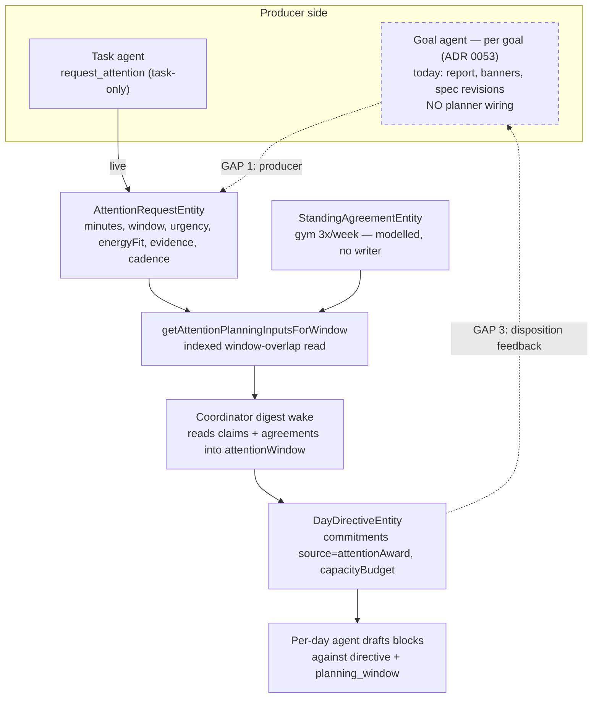
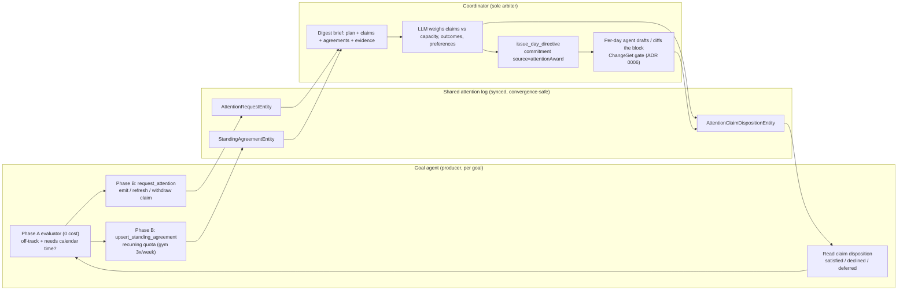
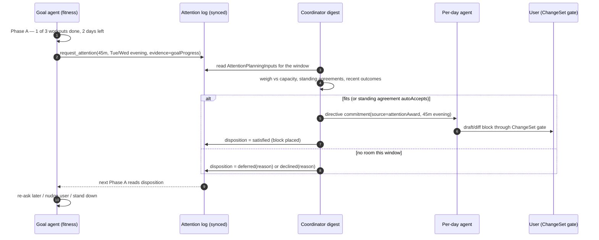
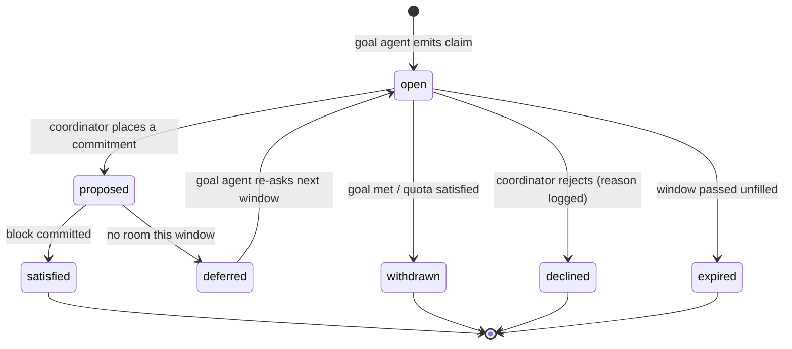

# Goal‑Agent ↔ Planner Time Negotiation — Design Sketch

- Date: 2026-08-13
- Status: Design sketch (input to a future ADR 0059; promotes ADR 0023's arbitration
  path to the `goal_agent` producer of ADR 0053)
- Method: code audit of `lib/features/goals/`, `lib/features/agents/` (attention
  subsystem), and `lib/features/daily_os_next/agents/` (directive + digest loop),
  cross-read against ADRs 0019, 0021, 0022, 0023, 0032, 0053. Every claim carries a
  code or ADR reference; re-verify against source before depending on any of them —
  the code outranks this map.

## 1. Executive summary

The product wants goal agents to **negotiate with the planner for calendar time** — a
fitness goal asking that gym time be placed in the day plan, a sleep goal protecting a
wind-down window. That negotiation is **already ~70% designed and ~40% built**: it is a
*wiring* job over existing substrate, **not a new protocol**.

Three findings frame the work:

1. **The read-side of the loop already runs in production.** The coordinator's digest
   wake already loads attention claims and standing agreements into its prompt
   (`getAttentionPlanningInputsForWindow` → `day_agent_context_builder.dart:633`) and
   already has `DayCommitmentSource.attentionAward` as a directive-commitment source
   (`day_directive_models.dart:11`). The coordinator LLM **is** the arbiter ADR 0021
   specifies — it weighs claims by judgement, not a deterministic scorer.
2. **The producer side is missing for goals.** `AttentionRequestEntity` (the "ask")
   exists and is live, but the only writer is task agents — `AttentionRequestHandler`
   hardcodes `targetKind = 'task'` and reads `task.categoryId`. Goal agents are fully
   siloed: their only outward signal today is user-facing banners (`goalNudge`). There
   is no goal→planner channel of any kind.
3. **The feedback half is missing.** Nothing tells a goal agent whether its ask was
   scheduled, declined, or deferred. That is the difference between a one-shot request
   and an actual negotiation.

The recommended path routes a goal ask through the **existing** claim → digest →
directive channel, keeps the coordinator LLM as the sole arbiter (ADR 0021/0023), and
closes the loop with claim-disposition feedback. It avoids building the unbuilt
`AttentionAwardEntity`/deterministic-arbiter machinery until provenance/audit needs it.

## 2. Current state (verified in code)

| Piece | State | Reference |
|---|---|---|
| `AttentionRequestEntity` (the ask) | Live | `agent_domain_entity.dart:439` |
| Producer `request_attention` | Task-only (hardcoded `targetKind='task'`) | `attention_request_handler.dart` |
| Planner reads claims + agreements into its prompt | Live | `day_agent_context_builder.dart:633` |
| Directive commitment source `attentionAward` | Enum exists | `day_directive_models.dart:11` |
| Arbitration | LLM-in-coordinator; no arithmetic arbiter | `day_agent_workflow_models.dart:913` |
| `AttentionAwardEntity` (concrete-block proposal + provenance) | Scaffolding, no producer | tests only |
| Goal agent → claims / standing agreements | Absent — fully siloed | `lib/features/goals/**` has no `daily_os`/`planner` refs |
| Claim lifecycle projection (`AttentionClaimDispositionEntity`) | Live for task claims | `agent_attention_projection.dart:504` |

Directive facts worth stating precisely, because the seam depends on them:

- The `DayDirectiveEntity` is a coordinator-only register (`day_directive:<dayId>`); the
  `_issueTool` rejects any author other than `dailyOsPlannerAgentId`
  (`day_agent_directive_service.dart:147`). Directives flow **downward** to per-day
  agents; goal agents must not write them.
- `raise_day_status` (`onTrack | attentionNeeded | dayClosed` + typed reasons) is the
  per-day agent's **upward** channel, read at the coordinator's next digest. It is a
  day-agent channel, not a goal-agent one.
- Over-commitment has **no arithmetic arbiter**: capacity lives on
  `DayCapacityBudget{availableMinutes, alreadyScheduledMinutes}`; when commitments
  exceed it the day agent escalates `raise_day_status(attentionNeeded,[overCommitted])`
  and the coordinator re-issues a revised directive. The judgement is the model's.

## 3. Target state — the negotiation loop

The end-state ADRs 0021/0023 already describe. Goal asks become claims the digest
already reads; the coordinator arbitrates by LLM judgement and expresses the outcome as
a directive commitment (and, for recurring quotas, honours a standing agreement); the
outcome flows back to the goal agent as a claim disposition.

The round-trip that makes it a *negotiation* rather than a fire-and-forget request:

Claim lifecycle is a projection over the immutable request (already modelled by
`AttentionClaimDispositionEntity`), so the original ask stays auditable:

## 4. The gaps, precisely

1. **Producer** — goal Phase B cannot author a claim; `AttentionRequestHandler` is
   task-shaped (`_taskTargetKind = 'task'`, reads `task.categoryId`). ADR 0023
   Decision 3 already calls for generalising this off the task-only path.
2. **Horizon** — claims are range-scoped ("3 workouts this week") but the digest reads a
   ~2-day window. ADR 0023 Decision 7 proposes a `planning_window:<range>` wake; the
   cheaper first step is widening the digest attention window to the claim's cadence.
3. **Feedback** — no disposition path informs the goal agent of the outcome, so the loop
   never closes. `AttentionClaimDispositionEntity` already models the states; the goal
   agent's Phase A just needs to read them.
4. **Recurring quotas** — `StandingAgreementEntity` has no writer. ADR 0053 Decision 6
   already designates the goal agent as its first writer (derived projection of the goal
   spec); this is unbuilt.

## 5. Recommended build — two increments

**Increment 2a — one-way ask (thin vertical slice).**

- Generalise `AttentionRequestHandler` off the task path (ADR 0023 Decision 3):
  `targetKind` domain-shaped (`goal`), `categoryId` from the goal's configuration rather
  than a task, evidence refs pointing at `goalProgress` rows. The task path becomes one
  caller among several.
- Add a goal Phase-B tool (`request_attention`-shaped) that emits / refreshes / withdraws
  a claim when the deterministic evaluator says the goal is off-track and calendar time
  would help. Keep it Phase B (LLM) so the ask carries a real rationale, not a mechanical
  bid.
- The coordinator already ingests the claim; it can place it as a
  `DayDirectiveCommitment(source: attentionAward)`. Add a provenance link
  (`AgentLink.attentionAwardRequest` already exists) so an accepted claim is traceable.

Result: a fitness goal can get a block into the day plan, gated by the existing ChangeSet
flow. No new arbiter, no `AttentionAwardEntity` producer required.

**Increment 2b — close the loop (true negotiation).**

- **Disposition feedback**: the coordinator (or the draft's ChangeSet outcome) writes an
  `AttentionClaimDispositionEntity` of `satisfied | declined | deferred`; the goal agent's
  Phase A reads it to re-ask, nudge, or stand down.
- **Standing agreements** (ADR 0053 Decision 6): `upsert_standing_agreement` for recurring
  quotas, with `approvalMode` (autoAccept / ask / reject) and `enforcement`
  (preference / target / nonNegotiable) governing whether an award is silent or
  user-gated. This is what lets "gym 3x/week" outrank a soft work block without the goal
  agent ever writing the calendar.
- **Horizon**: widen the digest attention window to the claim's cadence before committing
  to a first-class `planning_window:<range>` wake.
- *(Optional, later)* materialise the `AttentionAwardEntity` provenance record + the
  "No Bullshit" audit view (what was claimed, what the planner proposed, what the user
  accepted, what actually happened).

## 6. Invariants to preserve

- **Goal agents never write the calendar or the directive.** They author claims and
  standing agreements only; the coordinator is the sole arbiter of shared day-plan state
  (ADR 0023 Decision 2/4). This keeps one accountable arbiter instead of N peers writing
  shared state.
- **Bids are events, not RPCs.** A claim is a synced log entity discovered through the
  window-overlap projection, never a synchronous call into the planner during drafting
  (ADR 0019 Decision 2) — convergence-safe across devices.
- **The user stays in control.** Every block a goal wins is either user-approved through
  the ChangeSet gate or governed by a standing agreement the user previously set
  (ADR 0023 Decision 5).
- **No new dependency from planner internals into goals or vice versa.** Both sides touch
  only the shared attention/agreement log.

## 7. Decisions required (the ADRs leave these open)

1. **Producer identity** — confirm the per-goal `goal_agent` (ADR 0053) is the producer,
   retiring ADR 0023's original per-scope `domain_agent` kind. Reconcile by amending
   0023's granularity note (0053 already refined it once).
2. **Arbiter** — keep LLM-in-coordinator (recommended; matches today and ADR 0021), and
   add the deterministic `AttentionAwardEntity` record only later, for provenance.
3. **Approval defaults per scope** — silent recurring block vs. always-ask (product call;
   ADR 0023 Open Question 2).
4. **Cadence verifier ownership** — the goal agent withdraws its own claim once the quota
   is met, or the planner refuses to retire it until the quota is satisfied (ADR 0023
   Open Question 3).
5. **Horizon wake** — derive the horizon from active claims (cheap) or add a first-class
   `planning_window:<range>` scheduled wake (ADR 0023 Open Question 4).

## 8. Non-goals

- Building the deterministic auction / `AttentionAwardEntity` producer up front — the
  coordinator LLM is the arbiter (ADR 0021).
- Goal agents mutating the calendar directly (ADR 0023 Non-Goal).
- Per-scope "domain coach" agents — superseded by per-goal agents (ADR 0053).
- Push notifications — the goal agent's user channel stays banner-only (ADR 0055).

## Related

- [ADR 0019: Attention Negotiation Protocol](../adr/0019-attention-negotiation-protocol.md)
- [ADR 0021: LLM-Mediated Attention Claim Weighing](../adr/0021-llm-mediated-attention-claim-weighing.md)
- [ADR 0022: Long-Lived Daily OS Planner](../adr/0022-long-lived-daily-os-planner.md)
- [ADR 0023: Durable Domain Agents and Time Negotiation](../adr/0023-durable-domain-agents-and-time-negotiation.md)
- [ADR 0053: Goal-Driven Agents — Per-Goal Durable Producers](../adr/0053-goal-driven-agents-per-goal-producers.md)
- Assessment: `docs/implementation_plans/2026-08-08_goal_agents_phase1_assessment.md`
