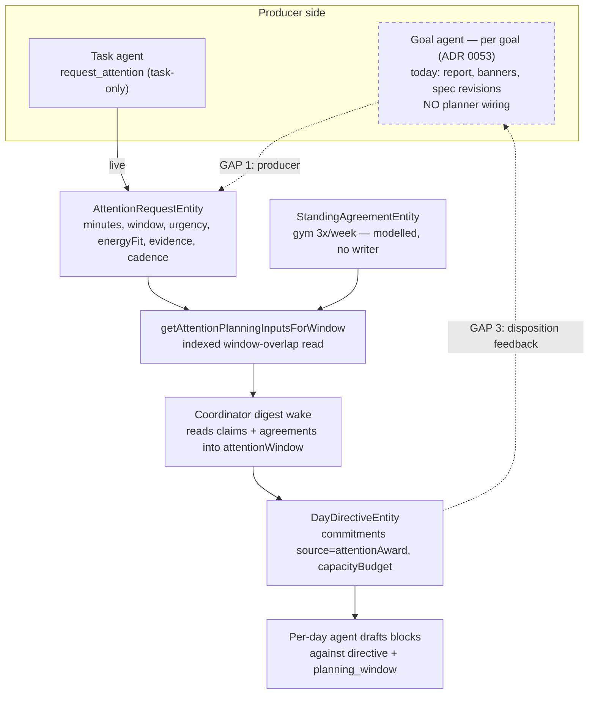
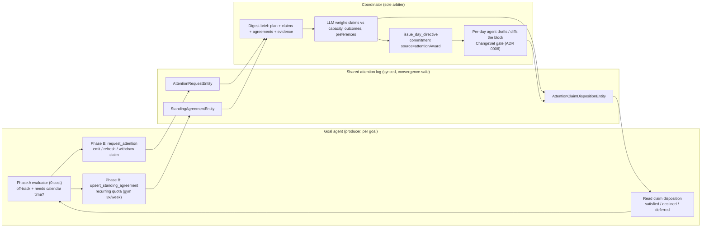
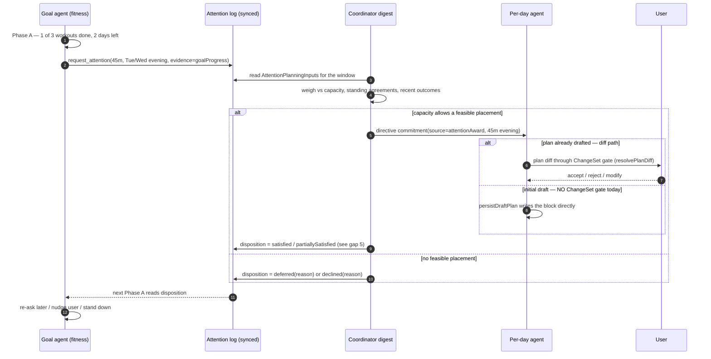
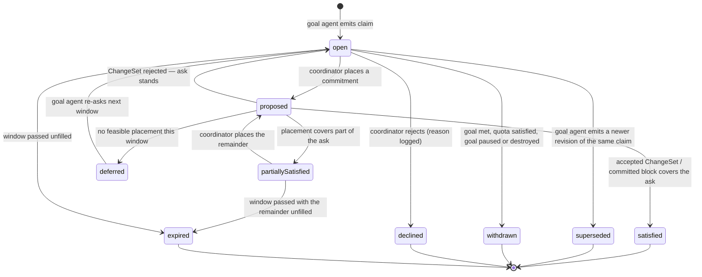

# Goal‑Agent ↔ Planner Time Negotiation — Design Sketch

- Date: 2026-08-13
- Status: Design sketch (input to a future ADR 0059; promotes ADR 0023's arbitration
  path to the `goal_agent` producer of ADR 0053)
- Method: code audit of `lib/features/goals/`, `lib/features/agents/` (attention
  subsystem), and `lib/features/daily_os_next/agents/` (directive + digest loop),
  cross-read against ADRs 0019, 0021, 0022, 0023, 0032, 0053. Every claim carries a
  code or ADR reference; re-verify against source before depending on any of them —
  the code outranks this map.

## 1. Executive summary

The product wants goal agents to **negotiate with the planner for calendar time** — a
fitness goal asking that gym time be placed in the day plan, a sleep goal protecting a
wind-down window. That negotiation is **already ~70% designed and ~40% built**: it is a
*wiring* job over existing substrate, **not a new protocol**.

Three findings frame the work:

1. **The read-side of the loop already runs in production.** The coordinator's digest
   wake already loads attention claims and standing agreements into its prompt
   (`getAttentionPlanningInputsForWindow` → `day_agent_context_builder.dart:633`) and
   already has `DayCommitmentSource.attentionAward` as a directive-commitment source
   (`day_directive_models.dart:11`). The coordinator LLM **is** the arbiter ADR 0021
   specifies — it weighs claims by judgement, not a deterministic scorer. One
   qualifier: it weighs them on *thin* evidence. `_attentionPlanningToJson`
   serialises each evidence ref as `kind`/`id`/`label` only
   (`day_agent_context_builder.dart:764`) and no coordinator tool loads the
   referenced `GoalProgressEntity`, so a claim citing "1 of 3 workouts" reaches
   the arbiter as an opaque id plus the producer's own assertion. Evidence
   hydration is a prerequisite for arbitration that ADR 0021 would recognise —
   see Increment 2a.
2. **The producer side is missing for goals.** `AttentionRequestEntity` (the "ask")
   exists and is live, but the only writer is task agents — `AttentionRequestHandler`
   hardcodes `targetKind = 'task'` and reads `task.categoryId`. Goal agents are fully
   siloed: their only outward signal today is user-facing banners (`goalNudge`). There
   is no goal→planner channel of any kind.
3. **The feedback half is missing.** Nothing tells a goal agent whether its ask was
   scheduled, declined, or deferred. That is the difference between a one-shot request
   and an actual negotiation.

The recommended path routes a goal ask through the **existing** claim → digest →
directive channel, keeps the coordinator LLM as the sole arbiter (ADR 0021/0023), and
closes the loop with claim-disposition feedback. It avoids building the unbuilt
`AttentionAwardEntity`/deterministic-arbiter machinery until provenance/audit needs it.

## 2. Current state (verified in code)

| Piece | State | Reference |
|---|---|---|
| `AttentionRequestEntity` (the ask) | Live | `agent_domain_entity.dart:439` |
| Producer `request_attention` | Task-only (hardcoded `targetKind='task'`) | `attention_request_handler.dart` |
| Planner reads claims + agreements into its prompt | Live | `day_agent_context_builder.dart:633` |
| Directive commitment source `attentionAward` | Enum exists | `day_directive_models.dart:11` |
| Arbitration | LLM-in-coordinator; no arithmetic arbiter | `day_agent_workflow_models.dart:913` |
| `AttentionAwardEntity` (concrete-block proposal + provenance) | Scaffolding, no producer | tests only |
| Goal agent → claims / standing agreements | Absent — fully siloed | `lib/features/goals/**` has no `daily_os`/`planner` refs |
| Claim lifecycle projection (`AttentionClaimDispositionEntity`) | Live for task claims | `agent_attention_projection.dart:504` |

Directive facts worth stating precisely, because the seam depends on them:

- The `DayDirectiveEntity` is a coordinator-only register (`day_directive:<dayId>`); the
  `_issueTool` rejects any author other than `dailyOsPlannerAgentId`
  (`day_agent_directive_service.dart:147`). Directives flow **downward** to per-day
  agents; goal agents must not write them.
- `raise_day_status` (`onTrack | attentionNeeded | dayClosed` + typed reasons) is the
  per-day agent's **upward** channel, read at the coordinator's next digest. It is a
  day-agent channel, not a goal-agent one.
- Over-commitment has **no arithmetic arbiter**: capacity lives on
  `DayCapacityBudget{availableMinutes, alreadyScheduledMinutes}`; when commitments
  exceed it the day agent escalates `raise_day_status(attentionNeeded,[overCommitted])`
  and the coordinator re-issues a revised directive. The judgement is the model's.

## 3. Target state — the negotiation loop

The end-state ADRs 0021/0023 already describe. Goal asks become claims the digest
already reads; the coordinator arbitrates by LLM judgement and expresses the outcome as
a directive commitment (and, for recurring quotas, honours a standing agreement); the
outcome flows back to the goal agent as a claim disposition.

The round-trip that makes it a *negotiation* rather than a fire-and-forget request:

Claim lifecycle is a projection over the immutable request (already modelled by
`AttentionClaimDispositionEntity`), so the original ask stays auditable:

All nine states below are members of `AttentionClaimStatus`
(`attention_negotiation.dart:79-105`); none is invented here.

Two rules the diagram depends on, both currently unowned (see §7):

- **One disposition writer.** A claim reaches `satisfied` only on the accepted
  ChangeSet or the defined placement event — never optimistically when the
  commitment is issued. Exactly one component may write the disposition.
- **`partiallySatisfied` is not a terminal shortcut.** Placing one 45-minute
  block against a 90-minute ask must leave the remainder live; collapsing it to
  `satisfied` makes Phase A stand down, while re-asking the whole request
  double-books the time already allocated.

## 4. The gaps, precisely

1. **Producer** — goal Phase B cannot author a claim; `AttentionRequestHandler` is
   task-shaped (`_taskTargetKind = 'task'`, reads `task.categoryId`). ADR 0023
   Decision 3 already calls for generalising this off the task-only path.
2. **Horizon** — claims are range-scoped ("3 workouts this week") but the digest reads a
   ~2-day window. ADR 0023 Decision 7 proposes a `planning_window:<range>` wake; the
   cheaper first step is widening the digest attention window to the claim's cadence.
3. **Feedback** — no disposition path informs the goal agent of the outcome, so the loop
   never closes. `AttentionClaimDispositionEntity` already models the states; the goal
   agent's Phase A just needs to read them.
4. **Recurring quotas** — `StandingAgreementEntity` has no writer. ADR 0053 Decision 6
   already designates the goal agent as its first writer (derived projection of the goal
   spec); this is unbuilt.
5. **The ChangeSet gate does not cover initial drafting.** `persistDraftPlan`
   (`day_agent_plan_writer.dart:278`) writes a model-emitted draft plan straight to
   the `DayPlanEntity`; the ChangeSet path is `resolvePlanDiff`
   (`day_agent_plan_writer.dart:92`), which covers *diffs against an existing plan*.
   So a goal-won block landing during initial drafting is not user-gated today, and
   has no ChangeSet outcome to derive a disposition from. This is the one place where
   the invariant in §6 does not yet hold — it needs either a gate on the initial path
   or a disposition bound to the direct commit/uncommit path.
6. **Claim contracts are day-shaped, not range-shaped.** `AttentionRequestEntity`
   carries `rangeStart`, `rangeEnd` and `cadence` (`agent_domain_entity.dart:456-465`),
   but `_attentionPlanningToJson` omits all three from the claim payload while
   serialising `cadence` for standing agreements. A weekly goal claim therefore reaches
   the coordinator with no recurrence metadata at all, and `request_attention` has no
   parameters to set them.

## 5. Recommended build — two increments

**Increment 2a — one-way ask (thin vertical slice).**

- Generalise `AttentionRequestHandler` off the task path (ADR 0023 Decision 3):
  `targetKind` domain-shaped (`goal`), evidence refs pointing at `goalProgress` rows.
  The task path becomes one caller among several. `_taskTargetKind = 'task'` is
  hardcoded at three write sites (`attention_request_handler.dart:23,137,211,286`).

  Two contract details this slice must settle first, neither of which the ADRs answer:

  - **Typed kind.** `targetKind` is a free-form `String?`, so `'goal'` is legal and
    matches ADR 0053:84 — but the *typed* `AttentionRequestKind` has no `goal` member
    (`task`, `project`, `projectPhase`, `outcome`, `maintenance`). `outcome` — "a
    long-term outcome wants protection of a leading indicator" — reads as the slot this
    was designed for, which would mean no enum change and no migration. Confirm before
    adding a member. (§7.6)
  - **Category source.** `AttentionRequestEntity.categoryId` is **required**, but goal
    identities are created with `const AgentConfig(automaticUpdatesEnabled: true)`
    (`goal_agent_service.dart:101`) and so carry an empty `allowedCategoryIds`; metric,
    measurable and habit criteria hold no category either. Sleep, steps and weight goals
    therefore cannot populate a required field. Either add a user-chosen scheduling
    category to the goal spec or relax the field. (§7.7)

- **Hydrate claim evidence into the digest brief.** Serialise enough of the referenced
  `GoalProgressEntity` for the coordinator to weigh the ask independently, rather than
  the `kind`/`id`/`label` triple it gets today. Without this the arbiter is taking the
  producer's word for it, which is not the arbitration ADR 0021 describes.
- Add a goal Phase-B tool (`request_attention`-shaped) that emits / refreshes / withdraws
  a claim when the deterministic evaluator says the goal is off-track and calendar time
  would help. Keep it Phase B (LLM) so the ask carries a real rationale, not a mechanical
  bid.
- The coordinator already ingests the claim; it can place it as a
  `DayDirectiveCommitment(source: attentionAward)`. Add a provenance link
  (`AgentLink.attentionAwardRequest` already exists) so an accepted claim is traceable.

Result: a fitness goal can get a block into the day plan, gated by the existing ChangeSet
flow. No new arbiter, no `AttentionAwardEntity` producer required.

**Increment 2b — close the loop (true negotiation).**

- **Disposition feedback**: **exactly one** writer emits the
  `AttentionClaimDispositionEntity` — not "the coordinator or the ChangeSet outcome",
  which is two writers racing on one field. Because the accepted-ChangeSet signal does
  not exist on the initial-draft path (gap 5), this slice must either gate that path or
  bind the disposition to the direct commit/uncommit path with block-to-request
  provenance. Statuses include `partiallySatisfied`, and a claim may not reach
  `satisfied` before the placement event actually lands.
- **Standing agreements** (ADR 0053 Decision 6): `upsert_standing_agreement` for recurring
  quotas. This is what lets "gym 3x/week" outrank a soft work block without the goal
  agent ever writing the calendar. Three constraints, all of which ADR 0053 or the model
  already fixes:

  - **The upsert is ChangeSet-gated** (ADR 0053:83). `approvalMode` and `enforcement`
    are user-owned trust policy, not model output — an agent free to write itself
    `autoAccept` + `nonNegotiable` has authorised its own silent calendar mutations.
    The entity's defaults (`ask`, `target`) are the safe floor; changes to them go
    through the gate.
  - **`approvalMode` is not a capacity verdict.** `autoAccept` means "a *matching*
    proposal need not interrupt the user" (`attention_negotiation.dart:182`). It never
    makes a claim fit. Feasibility is decided first — by the coordinator against
    `DayCapacityBudget` — and only then does approval mode decide whether the user sees
    it. Conflating the two silently overcommits the day.
  - **One agreement per quota leaf, not per goal.** ADR 0053:83 pins the deterministic
    id `standing_agreement:goal:<agentId>`, and one `StandingAgreementEntity` carries a
    single `cadence` with one `minCount`/`maxCount`/`minMinutes` set
    (`agent_domain_entity.dart:523-551`). Goals are trees — `allOf`, `anyOf`,
    `atLeastCount` (`goal_progress_evaluator.dart:303-324`) — so "gym 3× weekly and
    meditation daily" cannot be projected into one row without one quota silently
    overwriting the other. Key by criterion. (§7.8)
- **Horizon**: widen the digest attention window to the claim's cadence before committing
  to a first-class `planning_window:<range>` wake. This is blocked on gap 6 — the claim
  payload carries no cadence for the horizon to key on, so `request_attention`,
  deduplication and `_attentionPlanningToJson` all have to carry `rangeStart`/`rangeEnd`/
  `cadence` first. Widening the window alone would expose a range claim with no per-day
  allocation, no remaining-quota arithmetic and no dedup across days; a "3 workouts this
  week" claim would read as a standing demand on every day in range. (§7.9)
- *(Optional, later)* materialise the `AttentionAwardEntity` provenance record + the
  "No Bullshit" audit view (what was claimed, what the planner proposed, what the user
  accepted, what actually happened).

## 6. Invariants to preserve

- **Goal agents never write the calendar or the directive.** They author claims and
  standing agreements only; the coordinator is the sole arbiter of shared day-plan state
  (ADR 0023 Decision 2/4). This keeps one accountable arbiter instead of N peers writing
  shared state.
- **Bids are events, not RPCs.** A claim is a synced log entity discovered through the
  window-overlap projection, never a synchronous call into the planner during drafting
  (ADR 0019 Decision 2) — convergence-safe across devices.
- **The user stays in control.** Every block a goal wins is either user-approved through
  the ChangeSet gate or governed by a standing agreement the user previously set
  (ADR 0023 Decision 5). **This invariant does not hold today on the initial-draft
  path** — `persistDraftPlan` writes the first draft with no gate (gap 5). It holds on
  the diff path (`resolvePlanDiff`) only. Closing that hole is a precondition of
  Increment 2b, not a later refinement: it is the difference between a goal agent that
  asks for time and one that takes it. Trust policy on standing agreements
  (`approvalMode`, `enforcement`) is user-owned and ChangeSet-gated for the same reason.
- **No new dependency from planner internals into goals or vice versa.** Both sides touch
  only the shared attention/agreement log.

## 7. Decisions required (the ADRs leave these open)

1. **Producer identity** — confirm the per-goal `goal_agent` (ADR 0053) is the producer,
   retiring ADR 0023's original per-scope `domain_agent` kind. Reconcile by amending
   0023's granularity note (0053 already refined it once).
2. **Arbiter** — keep LLM-in-coordinator (recommended; matches today and ADR 0021), and
   add the deterministic `AttentionAwardEntity` record only later, for provenance.
3. **Approval defaults per scope** — silent recurring block vs. always-ask (product call;
   ADR 0023 Open Question 2).
4. **Cadence verifier ownership** — the goal agent withdraws its own claim once the quota
   is met, or the planner refuses to retire it until the quota is satisfied (ADR 0023
   Open Question 3).
5. **Horizon wake** — derive the horizon from active claims (cheap) or add a first-class
   `planning_window:<range>` scheduled wake (ADR 0023 Open Question 4).
6. **Typed claim kind for goals** — reuse `AttentionRequestKind.outcome` (no enum change,
   no migration) or add a `goal` member and migrate decoding, indexing, sync and every
   consumer. Recommended: reuse `outcome` until something needs to tell them apart.
7. **Category source for non-category goals** — add a user-chosen scheduling category to
   the goal spec, or relax `AttentionRequestEntity.categoryId` to optional. Sleep, steps
   and weight goals cannot proceed until one of these lands.
8. **Agreement keying for composite goals** — one agreement per quota leaf (breaking
   ADR 0053's single deterministic id) or one agreement carrying a list of obligations
   (extending the entity). Composite goals are not representable today.
9. **Claim identity and revision ordering** — a claim needs a stable correlation key,
   monotonic revision ordering and explicit withdrawal semantics so that a refresh,
   replay or horizon change finds its current request instead of opening a duplicate or
   applying a stale disposition to a newer ask. The planner read path is keyed by time
   window (`agent_attention_projection.dart:25-81`), which cannot answer "what is this
   goal's live ask?". Same question governs idempotent `upsert_standing_agreement`
   convergence across synced devices.
10. **Retirement on goal revision, pause and destroy** — withdrawal cannot wait for a
    later off-track Phase-B wake. Goal deletion destroys the identity while preserving
    its owned rows and scheduling no further wake, and a spec revision can drop a quota
    entirely. Without synchronous reconciliation, open claims and active agreements stay
    in the indexed planning window and keep winning time for a goal the user removed.
    Needs a defined owner and trigger.

## 8. Non-goals

- Building the deterministic auction / `AttentionAwardEntity` producer up front — the
  coordinator LLM is the arbiter (ADR 0021).
- Goal agents mutating the calendar directly (ADR 0023 Non-Goal).
- Per-scope "domain coach" agents — superseded by per-goal agents (ADR 0053).
- Push notifications — the goal agent's user channel stays banner-only (ADR 0055).

## Related

- [ADR 0019: Attention Negotiation Protocol](../adr/0019-attention-negotiation-protocol.md)
- [ADR 0021: LLM-Mediated Attention Claim Weighing](../adr/0021-llm-mediated-attention-claim-weighing.md)
- [ADR 0022: Long-Lived Daily OS Planner](../adr/0022-long-lived-daily-os-planner.md)
- [ADR 0023: Durable Domain Agents and Time Negotiation](../adr/0023-durable-domain-agents-and-time-negotiation.md)
- [ADR 0053: Goal-Driven Agents — Per-Goal Durable Producers](../adr/0053-goal-driven-agents-per-goal-producers.md)
- Assessment: `docs/implementation_plans/2026-08-08_goal_agents_phase1_assessment.md`

## Revision note

2026-08-25 — corrected against source after automated review of PR #3901. The
substantive changes: the ChangeSet gate was claimed for the initial-draft path where it
does not exist (gap 5, §6); the claim lifecycle omitted `partiallySatisfied` and
`superseded`, both modelled; `approvalMode` was conflated with capacity feasibility;
`upsert_standing_agreement` was described without ADR 0053's ChangeSet gate; the
`targetKind`/`AttentionRequestKind` distinction, the required `categoryId`, composite
quota keying and the missing claim cadence were all unstated. Open decisions 6–10 are
new. The sketch still outranks nothing — verify against source before depending on it.
