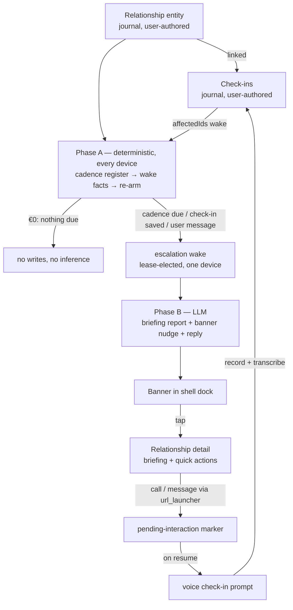

# Relationship Management — Implementation Plan v2

- Date: 2026-08-13
- Status: Plan (nothing implemented)
- Supersedes: [2026-07-22_relationship_management.md](2026-07-22_relationship_management.md)
- ADRs: [0037](../adr/0037-relationship-on-device-storage-and-privacy.md) (holds),
  [0038](../adr/0038-relationship-domain-model.md) (holds, two deltas),
  [0039](../adr/0039-relationship-check-in-reminders.md) (superseded in part — banner channel first),
  [0040](../adr/0040-relationship-executive-briefing.md) (amended — two-tier wakes, no template),
  [0041](../adr/0041-relationship-contact-linking.md) (holds, one delta — multi-select import),
  [0059](../adr/0059-relationship-agent-runtime-and-nudge-generalization.md) (records D2/D3 — written before Phase 3, per Phase 9 item 3)
- Runtime foundation: ADRs [0053](../adr/0053-goal-driven-agents-per-goal-producers.md)–[0058](../adr/0058-procedural-text-banners-no-generative-imagery.md)
  and [knowledge/features/goals.md](../../knowledge/features/goals.md)

## Why a v2

The July plan and ADRs 0037–0041 were written before the goal-agent stack
existed. Since then (ADRs 0053–0058; foundation PRs #3857–#3881) the app has
shipped, behind `enable_agents_page`:

- a **runtime registry for pluggable agent kinds** (`agentWakeRunnersProvider`,
  `AgentRuntimeMaintenance`, merged in `app_bootstrap.dart`),
- **deterministic-first two-tier wakes** — a €0 pure-Dart Phase A on every
  tick, LLM Phase B only on lease-elected escalation,
- the **banner-nudge attention channel** — procedural text banners in a
  shell-level dock, with lifecycle, dismissal quiet-windows, snooze, ratings,
  and exposure metrics as synced CRDT data,
- a **kind-agnostic chat projection** and a durable, retryable chat-turn
  pattern (`GoalChatService`).

That is exactly the machinery a relationship agent needs: "days since last
check-in vs. desired cadence" is a deterministic register; "remind me to call
my sister, and tell me what we talked about" is a fact-gated Phase B banner.
This plan keeps the July plan's domain model and rebases everything
agent-shaped onto the new runtime. It also folds in three product additions
from the 2026-08-13 pitch: a **post-call spoken check-in loop**, a
**multi-select contact import**, and **banner nudges as the primary attention
channel**.

## Product definition

A personal CRM for a *small, curated* set of people (a handful, not an
address book). Per relationship:

1. **A record**: who the person is, contact channels, desired check-in
   cadence, importance, free-form notes, and a timeline of **check-ins**
   (structured interaction logs: type, sentiment, topics, narrative).
2. **A dedicated agent** that deterministically tracks cadence health and,
   when attention is warranted, speaks through a banner: *"Check in with
   Anna — it's been 5 weeks. Last time: her job search."* Tapping through
   lands on the relationship with a fresh **executive briefing** (what was
   discussed, sentiment trajectory, what to bring up, what to avoid).
3. **A capture loop**: call/message/email the person from inside the app
   (`tel:`/`sms:`/`mailto:`); on next resume Lotti offers to log a check-in
   pre-filled with interaction type and time, and the user can **speak** the
   check-in — recorded, transcribed, attached to the check-in narrative.
4. **Privacy as the product**: everything on-device per ADR 0037; inference
   local-first or via an explicitly named zero-retention provider; contact
   channels never enter AI context (ADR 0041 §5).

## Architecture decisions (the rebase)

**D1 — The domain model stays journal-side. ADR 0038 holds.**
Relationships and check-ins are what the user authored — they belong in the
journal with `private`, categories, export, linking, and payload-agnostic
sync, exactly as ADR 0038 argues. The agent *reads* them, mirroring how
task/project/event agents bind to journal entities. (Goals are the outlier —
agent-owned specs — because no journal goal entity existed.) Two deltas:

- `CheckInData` gains a required **`relationshipId`** (denormalized alongside
  the `RelationshipLink`), so `CheckInEntry.affectedIds` can emit it — the
  precise wake-subscription token, exactly the `HabitCompletionEntry.habitId`
  precedent (ADR 0054 §5).
- `RelationshipData.checkInCadenceDays` stays, but the editor offers presets
  (weekly / fortnightly / monthly / quarterly) over a free integer.

**D2 — The agent is a registered runtime kind on two-tier wakes. ADR 0040
amended.** `AgentKinds.relationshipAgent`, linked to its journal entity via
`AgentLinkTypes.agentRelationship`, contributed through
`relationshipAgentWakeRunnersProvider` + `RelationshipRuntimeMaintenance` in
`app_bootstrap.dart` — never via the silent task-agent fallback in
`agent_wiring.dart`. Following the goal precedent (ADR 0053 Decision 7),
**no `AgentTemplateKind`** — the constitution is code
(`relationshipAgentSystemPrompt`, ADR 0052); ADR 0040's template assumption
is dropped. Phase A is pure Dart: read the relationship + linked check-ins,
recompute a **cadence-health register** (recomputed-never-accumulated, so
multi-device runs converge), re-arm the daily cadence tick
(`workspaceKey: 'relationship-cadence'`, calendar arithmetic, the
`goal-cadence` pattern), and escalate to Phase B only on facts: cadence
newly due, check-in saved since last report, user chat message, or explicit
"Brief me". Escalations are lease-elected and **per-episode**: the workspace
key derives from the due-day key (`relationship-escalation:<dueDayKey>`, the
`goal-escalation:<periodKey>` precedent), so devices arming the same logical
escalation write identical records, and the trigger tokens carry a
**baseline token** with the pre-transition cadence state — Phase A has
already updated the register by the time Phase B re-derives, so "newly due"
vs. "still due" is unreconstructable from storage (the `goal-baseline`
lesson). Extend the `requiresLease` predicate in `agent_providers.dart`.

**D3 — Attention is the banner channel; OS reminders come later. ADR 0039
superseded in part.** The primary nudge surface is the shell banner dock
(ADR 0055/0058): quiet by default, dismissal = rest-of-local-day quiet
window, snooze as provenance, per-activation ratings, exposure metrics —
all inherited. Banner copy is model-authored text rendered procedurally;
tap opens the relationship (briefing + quick actions); dismiss is separate
and explicit. ADR 0039's `NotificationEntity.relationshipCheckIn` +
`reconcile()` path is **deferred to Phase 8** — it is still wanted (a phone
should alert when the app is closed), but wiring `reconcile()` revives OS
alerts for *all* inbox types and deserves its own change. The banner channel
requires **generalizing the goal-typed nudge substrate** (~1,500 structurally
kind-agnostic lines: `goalNudge` entity, `goal_nudge_models.dart`, the six
`goal_banner_*.dart` files, snooze logic, `GoalNudgeInteractions`, the dock
mount) into a kind-agnostic form — Phase 3, a behavior-preserving refactor.

**D4 — Post-call capture is a resume heuristic plus voice. ADR 0041 holds.**
No telephony code, no call logs, no CallKit (deliberately, on every
platform). Launching a call/message from Lotti writes a device-local
pending-interaction marker; on next resume a dismissable prompt offers a
check-in pre-filled with type and time — now with a **"Speak it"** path that
opens the existing recording flow, transcribes, and lands the transcript in
the check-in narrative. Requires generalizing automatic transcription beyond
tasks (today `AutomaticPromptTrigger` early-returns without a
`linkedTaskId`) — Phase 6.

**D5 — Contact import is multi-select curation. ADR 0041 delta.** The pitch's
"import selected contacts" becomes a multi-select OS picker that creates one
relationship per *chosen* contact — still deliberate curation, still no bulk
sync, no background address-book access, permission requested only at picker
time. ADR 0041's reasoning (dormant entities destroy the nudge signal)
survives intact; only the one-at-a-time restriction is relaxed.

**D6 — Privacy posture unchanged. ADR 0037 holds.** Local journal + agent
storage, E2E-encrypted opt-in sync, deletion cascade (check-ins, agent,
reports, nudges, reminders), full export. Inference is profile-routed
(`RelationshipData.profileId` → category default → app default); before any
cloud-bound trigger the UI names the provider, using the existing
fails-closed `profileIsLocal` helper (`lib/features/ai/helpers/profile_locality.dart`).
Contact channels and refs never enter model context.

## What the runtime gives us for free

`WakeOrchestrator`/`WakeQueue`/`WakeRunner`, `ScheduledWakeManager` (+ lease
election), `AgentSyncService` outbox buffering, `agent_chat_projection.dart`
(already kind-agnostic), `AgentChatView` (voice-enabled),
`AgentReportEntity` + head resolution, `ChangeSetConfirmationService`
(callback-injected), token/cost attribution (`AiConsumptionEvent` per Phase B
call), and the retention machinery. None of it changes.

## Phase plan

Statuses: `todo` throughout. Everything ships behind a new
`enable_relationships` flag (default **off**; `lib/utils/consts.dart`,
`config_flags.dart`, `flags_page.dart` — the `enable_agents_page` pattern)
until the loop is coherent. Phases 3 and 6 are independent tracks that can
run in parallel with 1–2.

### Phase 1 — Domain model and persistence (journal-side)

Per ADR 0038 with the D1 deltas:

1. `lib/classes/relationship_data.dart` — `RelationshipStatus` sealed union
   (`active`/`dormant`/`archived` + history, `ProjectStatus` shape) and
   `RelationshipData` (title, nickname, `important`, `checkInCadenceDays`,
   birthday, `profileId`, `languageCode`, `coverArtId`, `contactChannels`,
   `contactRefs`).
2. `lib/classes/check_in_data.dart` — `CheckInInteractionType`,
   `CheckInSentiment`, `CheckInData` **incl. `relationshipId`** (D1).
3. `lib/classes/journal_entities.dart` — `JournalEntity.relationship` and
   `.checkIn` factories; `affectedIds` emits the check-in's `relationshipId`.
4. `lib/classes/entry_link.dart` — `RelationshipLink` variant (the header
   comment requires an ADR 0042-cluster note; ADR 0038 §3 already grants it),
   plus the `entryLinkTypeDbName`/`entryLinkTypeName`/`entryLinkTypeOf`
   helpers in lockstep.
5. Compiler-driven exhaustive-switch sweep: `lib/database/conversions.dart`
   (`type` strings `Relationship`/`CheckIn` + link mapping),
   `lib/utils/file_utils.dart` (`folderForJournalEntity`, `typeSuffix`),
   `journal_card.dart`, `entry_details_widget.dart`.
6. `lib/features/relationships/repository/relationship_repository.dart` —
   `createRelationship` / `createCheckIn` (writes the `RelationshipLink` and
   the denormalized id together), mirroring `ProjectRepository` rather than
   growing `persistence_logic.dart`.
7. Deletion cascade (ADR 0037 §5): relationship delete soft-deletes linked
   check-ins, the agent identity + its entities (reports, nudges, registers),
   and pending reminder rows. Explicit tests.
8. `make build_runner`; JSON round-trip, conversion, cascade, and link tests.

Exit: analyzer clean; sync round-trip for both subtypes (payload-agnostic
path needs no new sync code).

### Phase 2 — Relationship UI (list, detail, check-in capture)

1. `lib/features/relationships/` module + README; routes under a new beamer
   location (`/people`), nav visibility gated on the flag (the
   `agents_location.dart` + `nav_service.dart` pattern).
2. List page: name, one-liner (from latest briefing when present),
   importance star, last-check-in recency; sorted by recency. Coarse chips,
   design-system tokens only.
3. Detail page: header (status, importance, cadence, briefing placeholder),
   timeline via the existing `LinkedEntriesController` machinery, "Log
   check-in" action, linked-tasks section (`RelationshipLink` both ways).
4. Check-in capture sheet: interaction type, date, sentiment, topics,
   `payAttentionTo`/`avoid`, narrative; editable afterwards like any journal
   entry. Sentiment is user-set, never AI-filled (ADR 0038).
5. Manual contact-channel editor (all platforms — desktop parity by manual
   entry, ADR 0041 §2).
6. All strings in every ARB catalog per
   [localization.md](../../knowledge/conventions/localization.md); widget
   tests per touched widget.

Exit: full CRUD + check-in flow usable on desktop and mobile; no agent yet.

### Phase 3 — Generalize the banner channel (refactor, no behavior change)

The nudge substrate moves from goal-typed to kind-agnostic so a second kind
can speak through it:

1. `lib/classes/`: extract the nudge vocabulary (`tone`, `status` lifecycle,
   animation/accent catalogs, brief, rating) from `goal_nudge_models.dart`
   into shared models; keep goal aliases during migration.
2. `features/agents`: a sibling `relationshipNudge` variant beside
   `goalNudge`. Existing `goalNudge` rows are **never converted or renamed**
   — older peers must keep decoding them. Older peers decode
   `relationshipNudge` as the `unknown` fallback and never surface it (the
   agent kind doesn't exist for them), so mixed-fleet rollout is safe by
   construction. The concurrent-resolver rules (terminal dismissal
   dominance, G-counter merges) are extracted into shared helpers applied
   per-variant rather than duplicated.
3. Generalize the six `goal_banner_*.dart` widgets + `goal_banner_snooze.dart`
   + `GoalNudgeInteractions` to operate on the shared entry type; the shell
   dock (`beamer_app.dart` mounts) merges active nudges across kinds and
   keeps the reserved-lane height contract. The page-visibility gate
   (`_showsGoalBannerDock`) becomes **per-kind**: goal nudges keep their
   current surfaces (tasks, dailyOs, habits); relationship nudges show on
   those same surfaces plus the `/people` pages.
4. Goal behavior pinned by existing tests throughout; this phase lands green
   with `enable_relationships` still off and zero visible change for goals.

Exit: goals run on the generalized substrate; dock/regression tests green.

### Phase 4 — Relationship agent, Phase A (deterministic)

1. `features/agents` shared touches (the unavoidable set):
   `agent_constants.dart` (`AgentKinds.relationshipAgent`,
   `AgentLinkTypes.agentRelationship`, entity-type tags, deterministic id
   helpers), `agent_domain_entity.dart` (register variant:
   `relationshipHealth`, one row per agent, recomputed each tick),
   `agent_db_conversions.dart` fold sites, `agent_providers.dart`
   `requiresLease` for `relationship-escalation:*`, `agent_wiring.dart`
   `reportUpdated` propagation (generalize the goal-only condition).
2. `lib/classes/relationship_trigger_tokens.dart` — the token contract,
   runtime-visible without importing the feature: the cadence workspace key,
   the per-episode escalation workspace key (derived from the due-day key),
   the baseline token carrying the previous cadence state, and parse
   helpers. A check-in landing while an escalation is pending changes the
   due day and thus the episode; Phase B re-derives facts first and returns
   before any inference when the armed fact no longer holds.
3. `lib/features/relationships/runtime/` — `RelationshipAgentPhaseA`
   (facts: days-since-last-check-in vs. cadence, due-crossing, report
   staleness, nudge expiry sweep; register upsert + escalation arming in one
   transaction) and `RelationshipRuntimeMaintenance` (subscription restore,
   cadence self-heal, `onIdentityReceived`).
4. `service/relationship_agent_service.dart` — lazy create + link on first
   "important" mark or explicit enable; subscriptions:
   `matchEntityIds = {relationshipId}` + check-in tokens via the D1
   `affectedIds`.
5. `state/relationship_agent_providers.dart` — runner router (chat token →
   Phase B user message; escalation/report-refresh → Phase B; else Phase A);
   bootstrap merge (two lines in `app_bootstrap.dart`) and the
   `app_bootstrap_test.dart` override-count bump.
6. **Regression test: `relationship_agent` resolves to its registered
   runner** — the silent task-agent fallback is the documented trap
   (ADR 0054 consequences; knowledge/features/goals.md gotchas).

Exit: cadence ticks re-arm daily; register converges across devices in
tests; a due cadence arms exactly one lease-elected escalation; €0/no-write
no-op proven by test.

### Phase 5 — Relationship agent, Phase B (briefing, banner, chat)

1. `workflow/relationship_agent_contract.dart` — code constitution + tools:
   `update_report` (briefing: content/tldr/oneLiner + `relationship_health`
   provenance band per ADR 0040 §3, grounded first in user-set sentiments),
   `create_nudge` (headline/tagline/cta + tone/animation/accent from the
   shared catalogs), `snooze_nudge`, `reply_to_user`. Fact-gated exposure
   (ADR 0051): no `update_report` without a report-worthy fact, no
   `create_nudge` when a fresh one is active or the quiet window holds.
2. `workflow/relationship_agent_workflow.dart` + strategy + facts renderer —
   the goal Phase B shape: re-derive facts via Phase A (never trust the
   arming device), bounded context per ADR 0040 §4 (relationship + last N
   check-ins + linked task titles/statuses + previous report; **channels and
   refs excluded**), `temperature: 0`, single-transaction `persistOutputs`.
3. Health-band provenance parsing: extract the shared helper from
   `project_health_metrics.dart` (ADR 0040 consequence) and use it for both.
4. Chat: `RelationshipChatService` on the `GoalChatService` pattern (durable
   turn → manual wake → await completion); UI reuses `AgentChatView` and the
   kind-agnostic projection unchanged.
5. Briefing card on the relationship detail header; "Brief me" trigger with
   provider disclosure when the resolved profile is not local; debounced
   post-check-in refresh.
6. Banner surfaces: relationship nudges join the generalized dock; tap →
   relationship detail; dismissal/snooze/rating semantics inherited.

Exit: seeded check-ins + due cadence produce a banner and a briefing against
a local profile in tests; no inference without a trigger fact; consumption
events carry the agent id.

### Phase 6 — Voice check-in and transcription generalization

1. Generalize automatic transcription to arbitrary subject entities:
   `AutomaticPromptTrigger`/`ProfileAutomationService.tryTranscribe` take a
   subject entity id instead of `required String taskId` (benefits events and
   projects too). The task-free Daily OS capture path
   (`daily_os_next/state/capture_controller.dart`,
   `AudioTranscriptionService`) is the fallback shape if the general fix
   proves too entangled — decide at implementation time, prefer the general
   fix.
2. "Speak check-in" on the capture sheet and the post-call prompt: record via
   the existing `AudioRecordingModal` flow linked to the relationship,
   transcribe per the relationship's (or category's) profile, mirror the
   transcript into the check-in narrative for user edit-and-confirm. The
   check-in remains user-authored; nothing auto-saves.
3. Wake the agent on transcription completion (`WakeReason.transcriptionComplete`
   already exists) so the briefing refreshes after a spoken check-in.
4. Category `speechDictionary` picks up person names for transcription
   accuracy — document in the feature README.

Exit: record → transcript → prefilled check-in → save → agent report refresh,
end-to-end in an integration-style test with a fake transcription backend.

### Phase 7 — Contact linking, quick actions, post-call loop, import

1. Dependency: `flutter_contacts` (iOS/Android). Manifests (currently absent,
   verified): iOS `NSContactsUsageDescription` +
   `LSApplicationQueriesSchemes` (`tel`, `sms`); Android `READ_CONTACTS` +
   a `<queries>` intent block for `tel:`/`sms:`/`mailto:` resolution; macOS
   contacts entitlement deferred (manual entry).
2. "Link contact" per relationship (picker → copy channels, store
   `contactRefs`; explicit "Update from contact" refresh only) — ADR 0041.
3. **Multi-select import (D5)**: picker returns N chosen contacts → creation
   review screen (name, channels, importance, cadence preset per row) →
   N relationship entities. No background sync, permission at picker time.
4. Quick actions on detail header + briefing card: call/message/email via
   `url_launcher`; write the device-local pending-interaction marker.
5. On-resume prompt: offer a check-in pre-filled with interaction type and
   time; "Speak it" (Phase 6) or type; declining leaves no trace.

Exit: import→call→resume→spoken-check-in loop demonstrated on iOS and
Android; desktop parity via manual channels.

### Phase 8 — OS reminders (deferred ADR 0039, optional for v1)

`NotificationEntity.relationshipCheckIn` variant; producer on check-in/
relationship save; wire `NotificationScheduler.reconcile()` at startup
(behavior change for **all** inbox types — own tests; `taskOverdue` rows
scanned); make the scheduler's `_deepLinkFor` variant-aware (today it
hardcodes `/tasks/<id>`). Content-minimal lock-screen copy. Gate: only build
this once banner-channel dogfooding shows closed-app reminders are actually
missed.

### Phase 9 — Docs, privacy, release readiness

1. `knowledge/features/relationships.md` concept (+ index/code-map rows,
   `make knowledge_check`); feature README kept current from Phase 2 on.
2. `PRIVACY.md` relationship-data section (ADR 0037 §6); manual page under
   `docs-site` with registered screenshots, all locales.
3. ADR housekeeping: flip 0037/0038/0041 to Accepted as phases land; mark
   0039 superseded-in-part and 0040 amended (pointing here); write the new
   ADR recording D2/D3 (relationship agents on the shared runtime + the
   nudge generalization) before Phase 3 starts.
4. CHANGELOG + `flatpak/com.matthiasn.lotti.metainfo.xml` when the flag
   flips; nothing before (unreleased work).

## Testing and quality gates (every phase)

- `dart-mcp.analyze_files` zero warnings; `fvm dart format .`.
- One test file per source file; central mocks/fallbacks;
  `makeTestableWidget`; fake time only, deterministic dates
  ([testing.md](../../knowledge/conventions/testing.md), `test/README.md`).
- Multi-device convergence tests for the register and nudge lifecycle (the
  goal-agent test suites are the template).
- Every new regression test re-run with the fix reverted.
- No dependencies on deprecated legacy AI paths (`AiResponseType.*`).

## Risks and traps (verified against the code)

| Risk | Mitigation |
|---|---|
| Unregistered kind silently runs the task-agent workflow (`agent_wiring.dart` fallback) | Phase 4 regression test pinning runner resolution |
| `app_bootstrap_test.dart` pins the override count | bump alongside the bootstrap merge |
| Nudge generalization breaks goal banner sync-compat | sibling `relationshipNudge` variant; existing `goalNudge` rows never converted or renamed; resolver rules shared, not duplicated; goal tests pin behavior |
| `reconcile()` wiring revives dormant OS alerts app-wide | isolated in Phase 8 with its own tests |
| Transcription generalization destabilizes the task path | task-path tests pin behavior; Daily OS capture shape as fallback |
| Banner fatigue / signal destruction | curation by design (import review, `important` flag as the consent switch, quiet windows inherited) |
| "profile" is triple-booked (world / AI profile / sync node) | `RelationshipData.profileId` documented as inference profile, matching `ProjectData` |

## Open questions (decide before the affected phase)

- **Phase 2**: nav placement — own "People" tab vs. hub entry (needs product
  input; route reserved as `/people` either way).
- **Phase 5**: does a relationship nudge tap open the detail page (proposed)
  or the agent chat (goal precedent)?
- **Phase 7**: minimum iOS/Android OS versions the contacts plugin pins.
- **Phase 8**: build at all for v1, or is the synced inbox + banner enough
  until dogfooding says otherwise?
- Birthday nudges: deterministic Phase A fact feeding a banner — v1.x, not
  v1.

## Links

- Pitch: 2026-08-13 voice memo (relationship management as personal CRM,
  post-call voice check-ins, contact selector, banner attention channel).
- Prior plan: [2026-07-22_relationship_management.md](2026-07-22_relationship_management.md)
- Goal-agent state: [2026-08-11_goal_agents_roadmap.md](2026-08-11_goal_agents_roadmap.md)
- Runtime map: [knowledge/features/agents/](../../knowledge/features/agents/index.md),
  [knowledge/features/goals.md](../../knowledge/features/goals.md)
