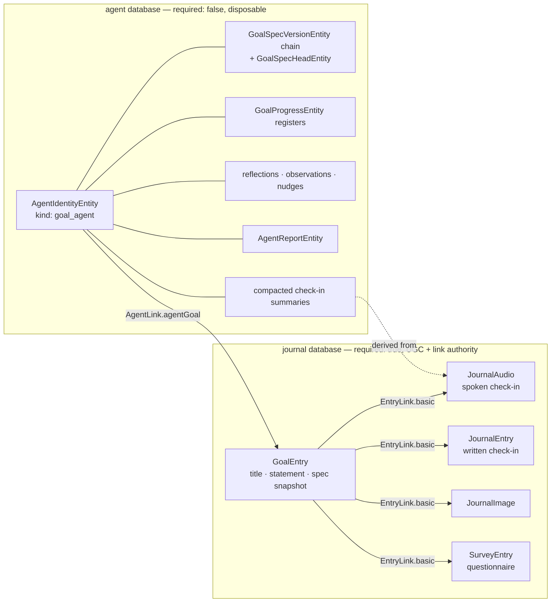
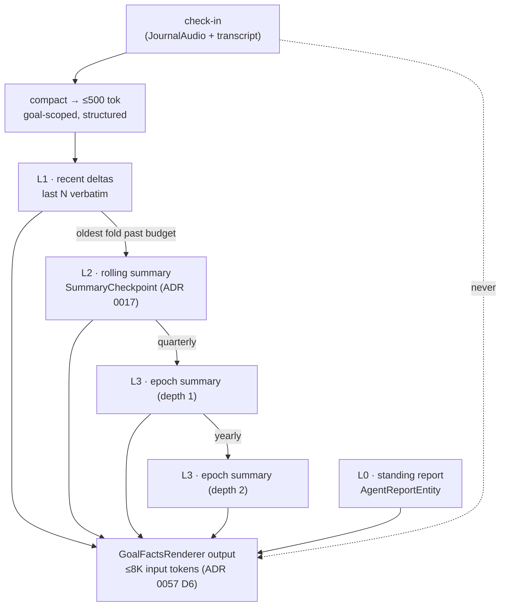

# Goal Check-ins on a Timeline — Design Handover

- Date: 2026-08-18
- Status: Design handover. No implementation decisions are locked in code; this
  document describes **what** to build and **where it attaches** to what already
  exists. It contains no code changes.
- Scope: the goal surface (`lib/features/goals/`), the events timeline component
  (`lib/features/events/`), the speech capture/playback stack
  (`lib/features/speech/`) and the goal agent's Phase B context assembly
  (`lib/features/goals/workflow/`).
- Audience: the implementation pass that follows. It assumes the reader can read
  the code but has not yet read *this* code.

---

## 0. One-paragraph summary

A goal today can be reflected on **once per day, after the fact, in a structured
sheet**. This design adds a second, complementary channel: a **free-form check-in
the user can record at any moment, in their own voice**, that lands as a dated
beat on a **goal timeline**. The timeline is the events detail view's vertical
rail, extracted into a shared component and reused. Each audio check-in is
transcribed by the existing pipeline and then **compacted to a ~500-token
summary**; those summaries — never the raw transcripts — are what reaches the
goal agent's context, layered as a decaying case file rather than an
ever-growing log. The existing daily reflection is not replaced: it becomes one
more kind of beat on the same timeline.

**One precondition is missing before any of it can be built.** "A goal is like a
task: it can have linked entries" is the right pattern and the wrong tense: a
task and a project each have a **journal-side entity** to hang links from, and a
goal has none — it exists only in the agent database. So a goal gets the
companion `JournalEntity.goal` it should always have had, after which the premise
becomes literally true and the linked-entry machinery works untouched. This also
keeps the feature on the right side of a standing principle the repository
already encodes in its backup catalog: **the journal is the required link
authority; the agent database is optional and disposable.** Check-ins are the
user's own recorded words — losing the coach must never cost them. §4.

---

## 1. Current state inventory

### 1.1 The goal detail screen

`lib/features/goals/ui/pages/goal_agent_detail_page.dart` (~1980 lines) is the
whole surface. Its body is assembled in a local `detailList()` closure
(from ~L360) as a flat `List<Widget> sections`, rendered eagerly in one
`SingleChildScrollView` — deliberately *not* a lazy `ListView`, because heavy
cards laid out mid-fling made scrolling janky and unmounted sections nulled the
`ensureVisible` anchors.

Section order today:

| # | Section | Widget | File |
|---|---|---|---|
| 1 | Title + status chips | `_GoalHeader` | same file, L956 |
| 2 | AI summary / "the read" | `_AgentReadCard` | same file, L1086 |
| 3 | Goal days strip + "Reflect on today" | `GoalThisWeekCard` | `ui/goal_progress_card.dart` L705 |
| 4 | Active banner(s) | `GoalBannerCard` | `ui/goal_banner_card.dart` |
| 5 | Pending revision proposals | `ChangeSetSummaryCard` | agents feature |
| 6 | Per-dimension habits/metrics | `GoalProgressCard` | `ui/goal_progress_card.dart` |
| 7 | Completion-rate chart | `HabitsChartCard` | habits feature |
| 8 | Daily reflections history | `GoalAssessmentHistoryCard` | `ui/goal_assessment_widgets.dart` L467 |
| 9 | "Talk to agent" tail button | `DesignSystemButton` | — |
| 10 | Banner history | `_GoalHistorySection` | same file, L1581 |

The **cost/energy chips** (`€0.29 · 106 Wh · 20 g`) live in
`ui/goal_agent_lifetime_pills.dart` and are rendered by `_AgentReadCard`, along
with freshness state, "Update now" and the automatic-updates toggle.

**Layout split (important, this is where a second column has to fit).**
`isDesktopLayout(context)` selects between two bodies (from ~L730):

- **Not desktop, or chat unavailable** — a single `detailList()`, full width,
  bottom padding clearing the overlaid bottom navigation
  (`DesignSystemBottomNavigationBar.occupiedHeight`).
- **Desktop + active goal** — a `Stack`: `detailList()` capped at
  `kUnifiedGoalsContentMaxWidth` and *centred*, with `_GoalChatDrawer`
  (`kGoalChatDrawerWidth`, ~400px, L847) sliding in from the trailing edge as a
  **non-modal overlay**. When the drawer opens, the content column is padded by
  the drawer width — but only while `paneWidth − kGoalChatDrawerWidth >=
  kPageHeaderFoldWidth`; below that the drawer is a true overlay and the content
  does not reflow. Escape closes it; `TapRegion` closes on outside tap; the
  drawer stays mounted while closed so the draft survives.

On mobile the conversation is a **route**, not a drawer: `goalChatPath(agentId)`
= `/goals/details/<id>/chat`, reached from an app-bar icon
(`ValueKey('goal-detail-chat-action')`) and the tail button. Routes are in
`ui/goal_routes.dart`.

### 1.2 The daily reflection sheet ("Reflect on today")

**Entry point.** `GoalThisWeekCard` renders the day strip; its last row is the
reflect row (`goal_progress_card.dart` ~L860–914) — an `InkWell` with a minimum
tap height, `Icons.edit_note_rounded` when unrecorded, otherwise the recorded
verdict's glyph and label. Any day in the strip can be reopened, past days
included. The detail page opens the sheet with
`showModalBottomSheet(isScrollControlled: true, useSafeArea: true)` (~L390).

**The sheet.** `GoalDayAssessmentSheet` in `ui/goal_assessment_widgets.dart`
(L40–L465). Structure, top to bottom:

1. Date title (`DateFormat.yMMMMEEEEd`) + `Goal v{n} applied` caption.
2. `DesignSystemSectionCard` — **"What Lotti measured"**, with the
   `goalAssessmentMeasuredReadOnly` caption and one row per measured dimension.
   The card is an explicit *fence*: read-only evidence above, editable decision
   below. Rows come from the pure `_measuredRows()` helper (L380+), which also
   emits derived rolling-average rows marked `ratable: false`.
3. **"How did the day go?"** — `DsSegmentedToggle<GoalAssessmentRating>` over
   `met / improving / mixed / missed`. Pre-seeded from
   `suggestedDayVerdict(progress, day)` (`logic/goal_day_verdict.dart`); the
   provenance hint shows only while the suggestion still stands, and
   `_touchedVerdict` distinguishes "accepted the suggestion" from "chose the
   same value deliberately".
4. **"Note (optional)"** — a single `DesignSystemTextarea`, `minLines: 2`,
   `growWithContent: true`. **This is the insertion point for audio.**
5. **"Rate individual dimensions (optional)"** — an `ExpansionTile` of
   per-criterion `DsSegmentedToggle`s, label above control (a side-by-side
   layout collapsed the label to zero width on phone).
6. Full-width `DesignSystemButton` — `Record for {weekday}`.

The sheet has its own gap scale (`_sectionGap`/`_bindGap`/`_rowGap`, L26–28).
Reuse it; do not invent a fourth gap for the audio affordance.

**Persistence.** `service/goal_assessment_service.dart` writes an
*append-only agent action*, not a journal entry: an
`AgentDomainEntity.agentMessagePayload` holding
`{recordId, day, specVersionId, rating/ratingV2, note, dimensionRatings(V2),
provenance, suggestedBy}`, plus an `AgentDomainEntity.agentMessage` of kind
`action` with `toolName: goal_record_daily_assessment`, both inside one
`AgentSyncService` transaction. Wire compatibility is handled by writing both a
legacy `rating` and a `ratingV2` — read the comments before touching that shape.

**Projection.** `state/goal_assessment_state.dart`:
`goalAssessmentHistoryProvider(agentId)` queries actions by subtype (deliberately
un-row-limited), decodes them into `GoalAssessmentRecord`
(`model/goal_assessment.dart`), sorts newest-first, and
`latestAssessmentsByDay(records, specVersionId:)` resolves the record standing
for each day (latest `createdAt` wins, ties break on higher id — so two devices
colour the same day identically). **Spec-scoping is load-bearing**: a verdict
passed under old criteria must not colour a date under the new ones.

### 1.3 The events timeline component (the thing to extract)

`lib/features/events/ui/widgets/event_detail_view.dart`:

- `_Timeline` (L907) — a plain `Column` of tiles, `isLast` flag for rail
  termination.
- `_TimelineTile` (L928) — `IntrinsicHeight` + `Row`: a 28px rail column holding
  a 12px `cs.primary` dot and a 2px `cs.outline` connector that `Expanded`s to
  fill the tile's height, then the content column (time label in `bodySmall` /
  `onSurfaceVariant`, then the beat body), then a top-pinned `chevron_right`
  that appears **only** when both a navigable `entryId` and an `onOpenEntry`
  handler exist. When it can't open, the tile isn't an `InkWell` at all — the
  affordance always matches the behaviour.
- `_TimelineContent` (L1020) — switches on `EventTimelineKind`:
  - `photo` — a 196px lead frame + a horizontally scrolling 72px thumb cluster +
    an italic caption; degrades to the caption if the beat arrived with no
    images.
  - `note` — `bodyLarge` text.
  - `timeRecording` — a `TimeSpanBar` (start → end · elapsed) with the note
    beneath; degrades to a plain note if either span label is missing.
  - `audio` — **the weakest case today**: a static `play_circle_outline` icon, a
    duration string and a single ellipsized transcript line. It does not play.

**View model** — `ui/model/event_view_data.dart`: `EventTimelineKind {photo,
note, audio, timeRecording}`, `EventTimelineEntry {timeLabel, kind, entryId,
text, photos, durationLabel, endTimeLabel}`, `EventPhoto`. Explicitly
persistence-free, so screenshot harnesses can feed real `ImageProvider`s without
a database.

**Mapping** — `state/event_view_mapping.dart`: `eventTimelineEntryFor(entity,
timeLabel:, formatTime:, imageProviderFor:)` maps one `JournalEntity` to one
beat (returning `null` for kinds surfaced elsewhere), and
`eventDetailDataFromEntities(...)` sorts all linked entries **once**, oldest
first, and feeds the timeline, the photo grid and the AI-summary fallback from
that single ordering. `formatTime` and `imageProviderFor` are injected precisely
so the mapping stays pure and testable.

**Two-column precedent.** `EventDetailView` already splits at
`_twoColumnBreakpoint = 900` into a main column (summary + timeline) and a fixed
320px rail (tasks), capped overall at `_contentMaxWidth = 1080`.

### 1.4 How linked entries are projected

`lib/features/journal/state/linked_entries_controller.dart`:

- `linkedEntriesControllerProvider(id)` loads outgoing `EntryLink`s from a
  journal entry id, subscribes to `UpdateNotifications` and re-fetches whenever
  the source or any current target changes.
- `resolvedOutgoingLinkedEntriesProvider(id)` (L307) watches each link's
  `entryControllerProvider(link.toId)` and returns the resolved
  `List<JournalEntity>`.

`EventDetailPage` (`features/events/ui/pages/event_detail_page.dart` L69) is the
whole projection: watch the event, watch `resolvedOutgoingLinkedEntriesProvider`,
map with `eventDetailDataFromEntities`, render. New linked entries are created
with `linkedFromId` / `linkedId` on the shared create paths, and the timeline
updates itself.

### 1.5 Audio: capture, playback, transcription

- **Capture** — `AudioRecordingModal.show(context, linkedId:, categoryId:)`
  (`features/speech/ui/widgets/recording/audio_recording_modal.dart`). A Wolt
  single-page sheet with a VU meter / orb. **`linkedId` already ties the
  recording to a parent entry**, and when `linkedId` is null the modal navigates
  to the new entry instead. Discarding mid-recording deletes the partial file and
  creates nothing.
- **Persistence** — `SpeechRepository.createAudioEntry` produces a
  `JournalEntity.journalAudio` with `AudioData {dateFrom, dateTo, audioFile,
  audioDirectory, duration, transcripts, language, ...}`.
- **Playback** — `AudioPlayerWidget(journalAudio)`
  (`features/speech/ui/widgets/audio_player.dart`): one app-wide player, play
  control, speed cycling, waveform scrubber (`ui/widgets/progress/`). There is a
  compact variant already (`_playControlDiameterCompact = 40`).
- **Transcription** — runs *after* the file is saved; there is no live mode. Two
  live paths exist:
  - the journal path, driven by an `AiResponseType.audioTranscription` prompt
    config through `unified_ai_inference_repository.dart`;
  - the Daily OS path, `AudioTranscriptionService` called directly from
    `features/daily_os_next/state/capture_controller.dart`, with
    `TranscriptAttributionCoordinator` recording cost/energy attribution
    (`AiWorkType.audioTranscription`).
  The resulting text lands on the audio entry's `entryText` (and
  `AudioData.transcripts`).

**The closest existing precedent for a spoken check-in is Daily OS capture**:
record → persist `JournalAudio` → transcribe → write an agent-side
`AgentDomainEntity.capture {transcript, audioRef, capturedAt, dayId,
parseCompletedAt}` → parse into items. A goal check-in is the same shape with a
different consumer.

### 1.6 Relationship check-ins (the naming precedent — and a warning)

`JournalEntity.checkIn` **already exists** (`lib/classes/journal_entities.dart`
L236, `lib/classes/check_in_data.dart`). It is a *relationship* check-in: it
carries `relationshipId`, `CheckInInteractionType`, `CheckInSentiment`, topics
and next-time guidance, and binds to its person through `EntryLink.relationship`
(ADR 0038). Its log is rendered as flat rows (`_CheckInRow`,
`features/relationships/ui/pages/relationship_details_page.dart` L458), not a
timeline rail, and it is captured through
`ui/widgets/check_in_capture_sheet.dart`. Voice check-ins are listed as an
unbuilt phase 6 there.

**Do not overload `CheckInData` for goals.** Its payload is person-shaped and
its privacy stance (ADR 0037: contact channels never enter AI context) is
specific to third-party data. Reusing the *word* is right; reusing the *entity*
is not.

### 1.7 The goal agent's context assembly

Phase B assembles context in `workflow/goal_agent_workflow.dart` (~L340–380) and
renders it through `GoalFactsRenderer.render(...)`
(`workflow/goal_facts_renderer.dart` L53), which emits a single labelled JSON
fence with these sections: `generatedAt`, `localTime`, `goal`, `evaluation`,
optional raw `signals`, `reporting`, `ads`, `personaTone`,
`unansweredUserMessages`, `observations`. Every verdict is **pre-computed**; the
prompt instructs the model to restate, never derive.

`observations` come from `_recentObservationTexts(agentId)` (L1032): the newest
`goalObservationLookback` messages of kind `observation`, each resolved to its
payload's `text`. The agent writes them itself via the `record_goal_observation`
tool (`workflow/goal_agent_contract.dart`).

The standing output is an `AgentDomainEntity.agentReport` with `tldr`,
`oneLiner`, `content` and structured `provenance` sections
(`GoalReportSectionKeys`: tldr / currentPeriod / rollingWindow / latestChange /
coverage / nextActions) — rendered by `_GoalReportCard`.

**Note what is *not* there:** the goal workflow does **not** call
`compactAndAssemble` (`features/agents/workflow/agent_wake_memory.dart` L134).
Task, project and day agents do; the goal agent builds a fresh deterministic
FACTS block every wake. That is a deliberate design (bounded, convergent, cheap)
and it is also why there is currently **nowhere for narrative history to
accumulate** — which is exactly the gap this feature fills.

### 1.8 Existing compaction machinery

- `features/agents/projection/compaction_plan.dart` — `planCompaction({tail,
  budget})`: a pure prefix/suffix split. Folds the **oldest** entries until the
  most-recent suffix fits the budget; always keeps the last entry even if it
  alone exceeds it; monotonic in budget.
- `features/agents/projection/compaction_summary.dart` — `SummaryCheckpoint`
  (covers a log **prefix**, identified by `contentDigest`, with `coveredSources`
  and a `cutoff`) and `selectActiveSummary({summaries, log})`, which picks the
  checkpoint covering the longest prefix and breaks ties deterministically so
  two devices converge (ADR 0017).
- `features/agents/service/agent_log_llm_summarizer.dart` — the LLM edge: folds
  `RenderedSource`s into rolling prose using **the wake's own resolved model**,
  chunked at `maxInputTokensPerCall = 12000`, capped at `maxSummaryTokens =
  2048`, temperature 0.3, system prompt "preserve durable facts, drop filler".
- `features/agents/workflow/agent_wake_memory.dart` — `capture()` then
  `compactAndAssemble({budget: 50000, retainTokens: 20000, ...})` with a
  read-flip gate: the compacted log is only used when a real compacted
  replacement exists.

**ADR 0057 (Decade-Scale Agent Memory, Proposed) already specifies the layered,
decaying "case file"** this brief asks for — quarterly depth-1 epoch summaries
folding into yearly depth-2 summaries over the ADR 0017 checkpoint machinery,
bounded observation reads, and cold-prefill-sized goal wakes (`budget: 12000,
retainTokens: 4000`, target ≤8K input tokens). **It is not implemented**:
`summaryDepth` exists on the entity and nothing writes a hierarchy, and
`search_memory` is wired for the day agent only. §6 is written to land *inside*
that ADR rather than beside it.

### 1.9 The banner / nudge channel

`ui/goal_banner_card.dart` renders one `NudgeBannerEntry`. The brief
(`lib/classes/nudge_models.dart`, `NudgeBrief`) is model-authored:
`headline`, `tagline`, `cta`, plus `tone` / `accent` / `animation` presets —
procedural text only, no generated imagery (ADR 0058). The card body navigates
to `entry.tapRoute`; the CTA pill's action is overridable via `onCtaPressed`,
which the detail page already uses to run `_logToday(progress)` (opening
`GoalLogTodaySheet`, `ui/goal_log_today_sheet.dart`) rather than navigating to
itself. Snooze/dismiss/rate live in `features/nudges/`.

---

## 2. Feature vision

**A check-in is the user telling their goal agent what is actually going on, in
whatever form is cheapest at that moment.**

- **Audio first.** Tap once, talk for thirty seconds, done. No agent response
  inside the recording — this is capture, not conversation. The response arrives
  later, in the read, in the banner, in the chat.
- **Anytime, not end-of-day.** The daily reflection asks "how did today go?" and
  can only be answered honestly in the evening. A check-in answers "what's
  happening / what am I about to do / why can't I" and is worth most in the
  moment.
- **Later kinds, same rail.** Guided questionnaires (the `surveys` feature),
  images/screenshots (`JournalImage`), and plain text. The timeline is designed
  now to carry all four; only audio and the existing structured reflection are
  built in the first slices.
- **The agent's one job is helping the user do what they said they would do.**
  That only works if what the user said is in context. Check-ins are the input;
  compacted summaries are the transport; better banners, better reads and better
  chat answers are the output.
- **The agent prepares the check-in.** Before the user speaks, the sheet shows
  what is worth reflecting on — the measured facts already there, plus one
  agent-authored line: a prompt, a spin, a way to fit what they committed to
  into the rest of the day.
- **Check-in is the universal escape hatch.** "Can't do it right now? Say when
  you will, or record why it isn't possible." That makes it the natural CTA for
  every banner that currently has nowhere useful to point.

---

## 3. UI / design specification

> **This section stands on its own.** Where the entities live (§4) does not change
> any layout, interaction or state described here — with exactly two exceptions,
> both raised as questions rather than assumed: whether check-ins are visible in
> the main journal and search (§7 Q2), and whether the goal's new container entry
> is itself a journal destination (§7 Q2b). Everything else below can be designed
> and reviewed before §4 is implemented.

### 3.1 The centralized timeline component

Extract the events rail into a shared, feature-agnostic component. Suggested
home: `lib/widgets/timeline/` (a cross-feature widget, alongside
`lib/widgets/cards/`) — **not** `features/events/`, and **not**
`features/goals/`, so neither feature depends on the other.

**Reuse as-is (it is already right):**

- The rail geometry: 28px rail, 12px dot, 2px connector, `IntrinsicHeight` so the
  connector spans the tile.
- Colour sourcing from the theme (`cs.primary` dot, `cs.outline` connector) and
  spacing from `tokens.spacing` — no literals were introduced there and none
  should be.
- The open-affordance rule: chevron and `InkWell` appear **only** when the beat
  is actually navigable.
- The pure view-model + injected-resolver shape (`timeLabel` pre-formatted,
  `formatTime` and `imageProviderFor` injected), which keeps the mapping
  testable and lets the screenshot harness drive it.
- Degrade-don't-crash content handling (photo beat with no photos, span beat with
  no end label).

**Improve while extracting:**

1. **Real audio playback.** The `audio` beat must host the actual player, not a
   dead icon. Use the compact `AudioPlayerWidget` presentation, plus the
   transcript beneath it — collapsed to ~2 lines with a "show more", not a
   single ellipsized line. This is the single largest gap and it is also the
   feature's headline interaction.
2. **Date separators.** Events use a bare clock label per beat because an event
   is one day. A goal timeline spans months, so the component needs an optional
   **day/month divider row** on the rail (a labelled node, not a tile), and a
   `timeLabel` that is date-aware. Keep the grouping decision in the pure mapping
   layer, not the widget.
3. **A beat kind that is a rendered card, not a switch case.** `EventTimelineKind`
   is a closed enum with a `switch` in the widget; a goal needs beats the events
   feature will never have (a recorded reflection, a questionnaire result, an
   agent milestone). Give the shared model an escape hatch — a beat that carries
   a caller-supplied body widget alongside the shared rail/time/chevron chrome —
   so features add kinds without editing the shared component. Keep the four
   existing kinds as built-ins so events changes nothing.
4. **Leading glyph per beat.** With more than four kinds on one rail, the dot
   alone stops distinguishing them. Allow the dot to carry a small glyph
   (mic / note / image / checklist / sparkle) and an accent colour, defaulting to
   today's plain primary dot so events is visually unchanged.
5. **Newest-first, and paging.** Events render oldest-first over a bounded set. A
   goal accumulates indefinitely, so the shared component must accept an
   ordering and render a bounded window with a "load older" tail. Do not resolve
   an unbounded list of linked entries into providers.
6. **Empty and loading states as first-class props** (see §3.6), instead of each
   caller inventing an `_EmptyHint`.

**Migration rule.** Events must be ported onto the extracted component in the
same slice that extracts it, and `EventDetailView` must lose its private
`_Timeline`/`_TimelineTile`/`_TimelineContent`. Two timelines is the failure
mode this extraction exists to prevent. `EventTimelineEntry`/`EventTimelineKind`
either move into the shared model or become thin aliases — no duplicated view
model.

### 3.2 Goal detail — desktop

Today's desktop layout is *one centred column + an overlay chat drawer*. The
target is *two columns + the same overlay drawer*.

```
┌───────────────────────────────────────────────────────────────┐
│ AppBar   ‹  Blood Pressure 🫀              [Talk to agent] [⋮] │
├───────────────────────────────────┬───────────────────────────┤
│ DETAILS COLUMN (flex)             │ TIMELINE RAIL (fixed)     │
│                                   │                           │
│  _GoalHeader + status chips       │  ┌ Check-ins ───── [＋] ┐  │
│  _AgentReadCard (the read)        │  │ ── Today ──────────  │  │
│  GoalThisWeekCard (14-day strip)  │  │ ● 08:12  ▶ 0:42 🎙  │  │
│    └ Reflect on today          ›  │  │        "took the …"  │  │
│  Banner(s)                        │  │ ● 07:05  ✓ Reflection│  │
│  GoalProgressCard (dimensions)    │  │ ── Yesterday ──────  │  │
│  HabitsChartCard                  │  │ ● 21:30  ▶ 1:15 🎙  │  │
│  Reflections history              │  │ …                    │  │
│  Banner history                   │  │      [Load older]    │  │
│                                   │  └──────────────────────┘  │
└───────────────────────────────────┴───────────────────────────┘
      ↑ chat drawer slides over the trailing edge, unchanged
```

Specifics:

- **Breakpoint.** Reuse the existing desktop decision (`isDesktopLayout`) for
  *whether* two columns are possible, but gate the second column on **available
  pane width**, the way the chat drawer already does — the goals tab sits behind
  a navigation sidebar whose width varies. Below the threshold the timeline
  collapses to the mobile treatment (§3.3) inside the single column.
- **Column widths.** Details column keeps `kUnifiedGoalsContentMaxWidth` as its
  reading measure. The timeline rail is fixed-width (the events tasks rail's
  320px is a good starting point; a timeline with a player needs a little more —
  360px is the recommendation). The rail is `Expanded`-free and does not steal
  from the reading measure until the pane genuinely cannot hold both.
- **Three panes, two of which are optional.** The chat drawer must keep
  overlaying rather than becoming a third column: it is a conversation, it is
  transient, and it already has correct focus/semantics/escape behaviour. When
  the drawer opens, the existing `AnimatedPadding` glide should push **both**
  columns, and the same fold guard applies — below `kPageHeaderFoldWidth` of
  residual width the drawer overlays without reflow. Do not attempt a
  three-column layout.
- **Independent scrolling.** The timeline rail scrolls on its own axis, pinned
  under the app bar; the details column keeps its single `SingleChildScrollView`.
  The rail's header ("Check-ins" + the `＋` create action) is sticky.

### 3.3 Goal detail — mobile

Do **not** put a timeline column on a phone, and do not add a tab bar to the
detail page (the page already carries a range picker, a chat action and an
overflow menu; a fourth navigation control on one screen is too many).

Recommended treatment — **inline preview + dedicated route**:

1. A **"Check-ins" section card** joins the detail list, positioned directly
   **after `GoalThisWeekCard`** — the reflect row and the check-in list are the
   two halves of "what I've said about this goal", and they belong adjacent.
2. The card renders the shared timeline in a bounded mode: the **3 most recent
   beats**, each fully interactive (audio plays inline), with a section header
   carrying the count and a `＋` action, and a **"See all check-ins"** row at the
   bottom.
3. "See all" pushes a dedicated route — `/goals/details/<id>/timeline`, added to
   `ui/goal_routes.dart` beside `goalChatPath` — a full-height scrolling timeline
   with the create CTA pinned. Same component, unbounded window + paging.
4. The **create affordance is always reachable** without scrolling: see §3.5.

The same "Check-ins" section card is what the desktop layout hoists into the
rail, so there is one composition, rendered in two places.

### 3.4 Where audio attaches to the daily reflection sheet

The **"Note (optional)"** block becomes **"Note (optional)" with two ways to
answer**, keeping the sheet's existing gap scale and section rhythm:

- The `DesignSystemTextarea` stays exactly as it is and remains the default.
- Directly beneath it, a **single-row record affordance**: a mic control plus a
  short label. Tapping opens `AudioRecordingModal.show(...)` — the same sheet the
  rest of the app uses, so the VU meter, the discard semantics and the
  transcription path are inherited, not rebuilt.
- Once a recording exists, the row **becomes the recording**: a compact
  `AudioPlayerWidget` plus duration, with a delete/re-record affordance. More
  than one recording per reflection is allowed; they stack in the same block.
- The transcript, once it lands, is **not** silently pasted into the textarea.
  The note and the recording are two separate contributions to the same
  reflection; merging them would make it impossible to tell which words the user
  typed. Render the transcript under the player (collapsed) instead.
- The submit CTA (`Record for {weekday}`) is unchanged and still governs the
  whole sheet. Recording without submitting must not orphan audio: either the
  recording is created linked to the goal immediately (and the reflection later
  associates with it), or it is discarded with the sheet — pick one and state it;
  the recommendation is **create immediately, link immediately**, because the
  recorder already deletes partial files on discard and a saved recording that
  vanishes because a sheet was dismissed is the worse failure.

**Naming note for the sheet.** With audio in it, "Reflect on today" is still
right for the *day* sheet. The anytime check-in is a different, lighter surface
(§3.5) — do not merge them into one modal with a mode switch.

### 3.5 The always-available check-in CTA

Three placements, one action:

1. **On the goal detail screen** — the `＋` in the Check-ins section header
   (mobile) / rail header (desktop). Always visible without scrolling on desktop;
   on mobile the section may be below the fold, which is why (2) exists.
2. **In the app bar** — a mic icon beside the existing chat icon on mobile, and
   beside "Talk to agent" on desktop. This is the ever-present affordance the
   brief asks for. It costs one slot in a bar that currently holds chat +
   overflow.
3. **As the banner CTA** — `onCtaPressed` on `GoalBannerCard` already accepts an
   override, and the detail page already uses it. A nudge whose brief asks for a
   check-in ("can't do it now? tell me when you will") should open the check-in
   composer directly rather than navigating. The `cta` copy stays model-authored;
   only the *action* is bound in the app.

**The composer itself** is a light sheet, not the day-reflection sheet:

```
┌ Check in · Blood Pressure 🫀 ───────────────────────┐
│  Tuesday, 18 August · 14:20                         │
│                                                     │
│  ✦ You said you'd walk after lunch. It's 14:20 —    │  ← agent-prepared line
│    still time. What's the plan?                     │     (§3.7)
│                                                     │
│            ◉  hold to talk / tap to record          │
│              ▁▂▅▇▅▂▁  0:14                          │
│                                                     │
│  [ ✎ Write instead ]                    [ Done ]    │
└─────────────────────────────────────────────────────┘
```

- Opens straight into the recorder — the point of the feature is that it costs
  one tap and no typing.
- "Write instead" swaps the recorder for a textarea, producing a text beat.
- Discard semantics are the recorder's own: a discarded recording creates
  nothing.
- On submit the beat appears on the timeline **immediately**, with transcription
  pending (§3.6).

### 3.6 States

Follow the repository's no-flash rule (`AGENTS.md`: never swap established UI to
a loading shell during background refresh).

| State | Treatment |
|---|---|
| **Initial load** | Rail/section shows a bounded skeleton, once. |
| **Background refresh** (sync, DB notification) | Keep the last rendered beats; any progress is local and subtle. Never a full-section spinner. |
| **Empty** | Not a blank void, and not an apology. One line of what a check-in is for, plus the record affordance as the primary action — the events `_EmptyHint` pattern, upgraded from a hint to a real invitation. |
| **Audio saved, transcription pending** | The beat renders with a working player and a pending marker where the transcript will be. The recording is usable before its text exists; that is the whole point of saving first. |
| **Transcription failed** | Beat stays, player works, transcript slot shows a retry. Never drop the beat. |
| **Playback** | One player app-wide (already true). Starting a beat stops any other. Scrubber + speed available; the collapsed beat shows play + duration only. |
| **Paging** | "Load older" at the tail; never resolve the full history into providers. |
| **Goal dormant/retired** | Timeline is readable; creation affordances are absent (mirroring how `canReflect` gates the reflect row today). |

### 3.7 Agent-prepared check-in context

The reflection sheet already does half of this: `_measuredRows()` shows what
Lotti measured, and `suggestedDayVerdict()` pre-computes a verdict with an
explicit "change it if you disagree" hint and honest provenance
(`ratedByUser` vs `suggestedAndAccepted`). Extend the same pattern:

- **The check-in composer shows a short agent-authored prompt line** — one or two
  sentences, tone-matched to the goal's persona, grounded in the same
  deterministic facts the banner is grounded in. It is the moderator's opening
  question, not advice.
- **Provenance stays visible and reversible.** The line is labelled as the
  agent's, exactly as the verdict suggestion is. The user is never answering a
  form they didn't ask for.
- **Where it comes from** is an open decision (§7, Q4): the cheapest correct
  answer is that the *existing* Phase B wake authors it alongside the banner and
  stores it on the nudge or the report, so opening the composer costs no
  inference. Generating it on sheet-open is a per-open inference cost on a
  surface designed to be opened casually — recommended against.
- **The deterministic half needs no model at all**: what was measured today, what
  is still open, what the user committed to in the last check-in. Render that
  from `GoalProgressView` and the last beat, and let the agent line be
  additive-when-available rather than required.

### 3.8 Existing structured sheets as timeline entries

A recorded daily reflection should appear on the timeline as its own beat:

- **Time label** — the reflection's day; **body** — the verdict pill (reusing
  `goalAssessmentRatingGlyph` / `goalAssessmentRatingLabel` /
  `goalAssessmentRatingSurfaceInk` from `goal_progress_card.dart`, so the
  timeline, the strip and the history card can never disagree), the note when
  present, and a count of per-dimension verdicts.
- **Tapping it reopens `GoalDayAssessmentSheet` for that day**, with `existing`
  populated — the strip's behaviour, reached from a second place.
- **Do not duplicate `GoalAssessmentHistoryCard`.** Once reflections are beats,
  that card is the timeline filtered to one kind. Either retire it in the same
  slice or state explicitly why both stay; two lists of the same records on one
  page is the outcome to avoid.
- Only the **standing** record per day appears (`latestAssessmentsByDay`,
  spec-scoped) — a day reflected on three times is one beat, not three.

---

## 4. Data model

### 4.1 The guiding principle this has to satisfy

**Check-ins are user-generated content. The agent database is not where UGC
lives.** Deleting, resetting or failing to restore the agent database must cost
the user their *coach* — its state, its history, its opinions — and nothing they
themselves authored.

This is not an aspiration bolted onto this feature; the repository already
encodes it. `lib/features/backup_restore/domain/profile_backup_catalog.dart`:

| Store | `required` | Stated rationale |
|---|---|---|
| `journal` | **`true`** | "Primary journal, task, definition, and **link authority**." |
| `agents` | `false` | "Owns agent state, history, proposals, and observations." |

A restore with no agent database is therefore a **supported state**, and the
journal is declared the authority for links. Tasks, projects, events and
relationships all follow from that: the user-authored thing is a `JournalEntity`,
its contents hang off it through journal-side `EntryLink`s, and the agent is a
separate, optional participant that merely *points at* it.

### 4.2 What that means for the premise

> "No new data model needed. A goal is like a task: it can have linked entries."

The **intent** is exactly right and the pattern is exactly the one tasks and
projects use. What is missing is its precondition: a task and a project each have
a journal-side entity to hang links from, and **a goal does not**. A goal today
is only an `AgentDomainEntity.agent` (`kind == AgentKinds.goalAgent`) in the
agent database, with its spec, registers, nudges and reflections as sibling rows
there. Nothing about a goal exists in `journal`, so `linked_entries` cannot
address it and `resolvedOutgoingLinkedEntriesProvider(goalId)` would return
empty forever.

So the correct move is not to invent an agent-side binding — it is to **give the
goal the journal-side companion entity it should always have had**, after which
"a goal is like a task" becomes literally true and the linked-entry machinery
works with no new projection code at all.

An earlier draft of this document proposed binding check-ins to the goal with a
new `AgentLink.agentCheckIn`. **That is wrong and is superseded by §4.3.** It
would have put the user's own recordings behind an optional store: restore
without the agent database and the audio survives as orphaned journal entries
with no way to know which goal it was about.

### 4.3 The shape: a companion `JournalEntity.goal`

Add `JournalEntity.goal` (`GoalEntry` + `GoalData`), the exact sibling of
`ProjectEntry` and `RelationshipEntry`, and bind the agent to it the way every
other agent kind binds to its subject.



**1. `GoalEntry` is the goal's durable identity and its link container.**
`GoalData` carries what the user authored and what a reader needs to understand
the goal without a coach: the **title**, the **statement** ("Average 10,000 steps
a day over a rolling week"), and a **snapshot of the active spec** — the head
version id plus a human-readable rendering of the criteria. Lose the agent
database and the user still has a titled goal with a legible definition and every
check-in they ever recorded against it, in date order.

**2. Check-ins bind journal-side, with the link type that already exists.**
`PersistenceLogic.createLink` defaults to `EntryLinkType.basic`, and that is
exactly what events use for their linked photos, notes and audio — events never
needed a typed link. Goal check-ins do not either. **No new `EntryLinkType`, and
therefore no ADR 0042 amendment.** (A typed `EntryLink.goal` would be the thing
requiring an amendment; the recommendation is not to ask for one until a query
actually needs the semantics. Projects and relationships took typed links because
they needed directed "belongs to" traversal; a goal's check-ins are read by
container id, which `basic` serves.)

**3. The agent binds to the entity, not the reverse.** One new
`AgentLink.agentGoal` (`fromId` = agent id, `toId` = goal entry id), the exact
sibling of `AgentEventLink`, `AgentProjectLink` and `AgentDayLink`. This is a
union-member addition inside the agents feature's own model — the compiler
enforces the `softDeleted` arm and the conversions. It also slots straight into
the existing derived-state machinery: `derived_agent_state.dart` already projects
`slots.activeProjectId` from an `AgentProjectLink`, so an `activeGoalId` slot is
the same one-line pattern.

**4. The timeline projection is then free.**
`resolvedOutgoingLinkedEntriesProvider(goalEntryId)` — the provider
`EventDetailPage` already uses — returns the resolved linked entries, live-updated
through `UpdateNotifications`. **No goal-specific projection code, no new
repository query.** The goal detail page resolves its goal entry id once (from the
`agentGoal` link, or directly when the page is entered from a journal context) and
hands it to the same component events uses.

**5. Reflections stay agent-side, and that is consistent.** A daily reflection is
a *judgement against a spec version* — it is only meaningful in the presence of
the criteria it judged, and it already has a clean, convergent, day-keyed
projection (`latestAssessmentsByDay`, spec-scoped). It is coaching state, not
free-standing UGC, and losing it with the coach is defensible in a way that
losing a recording is not. **Open question Q10 (§7) asks whether the user's own
free-text note inside a reflection deserves better than that.** The timeline
therefore merges two sources into one ordered beat list — linked journal entries
plus projected `GoalAssessmentRecord`s — in a pure mapping function, the
`eventDetailDataFromEntities` shape.

**6. Compacted summaries are derived and stay agent-side.** They are a lossy
projection of journal content for one agent's context budget, regenerable from
the source recordings. Losing them costs an inference pass, not information — the
correct side of the line.

### 4.4 What adding a journal entity variant actually costs

Small, and there are two recent precedents (`relationship` and `checkIn` were
both added this way):

- **No schema migration.** `journal` is a serialized-payload table with `type` /
  `subtype` columns (`lib/database/database.drift`); a new union member is a new
  `type` value.
- `lib/classes/journal_entities.dart` — the union member; `make build_runner`
  regenerates the freezed/JSON code.
- `lib/database/conversions.dart` — optionally a `subtype` arm. Worth taking one:
  denormalizing the **agent id** (or nothing) into `subtype` follows the
  `habitCompletion`/`habitId` and `checkIn`/`relationshipId` precedent and makes
  "the goal entry for this agent" an indexed lookup instead of a scan.
- `affectedIds` on the union extension — so a goal write emits a precise wake
  token, the same way `CheckInData.relationshipId` does.
- The entry-type filter (`lib/widgets/search/entry_type_filter.dart`), entry
  detail rendering, and export/import paths inherit the payload-agnostic
  handling automatically; the flag-gating pattern (`enableUnifiedGoalsFlag`) is
  already in place for hiding it where goals are off.

### 4.5 The bigger finding this exposes

**The goal's own definition is already on the wrong side of the line.** The
title, the statement and the criteria a user authored live *only* in
`GoalSpecVersionEntity`/`GoalSpecHeadEntity` — in the `required: false` store.
Losing the agent database today loses the goals themselves, not just the coach.
No check-in feature caused that; this work merely makes it visible.

Recommended response, in order of ambition:

1. **Ship the mirror (in scope here).** `GoalData` carries title + statement +
   active-spec snapshot, refreshed whenever the head moves. The versioned spec
   chain remains the operational source of truth for evaluation; the journal
   entity is the durable, readable record. Cheap, additive, and it makes the
   principle hold for everything a user can see.
2. **Consider moving the spec chain to the journal (out of scope, own decision).**
   Cleaner, and it makes goals structurally identical to projects — but it moves
   immutable-version + head-pointer + CRDT-merge semantics that ADR 0053 designed
   for the agent store, and it is a migration with sync implications across
   devices on mixed builds. Do not attempt it inside this feature. §7 Q11.

### 4.6 Creation, deletion and sync ordering

- **Creation order is journal-first.** Create the `GoalEntry`, then the agent,
  then the `agentGoal` link. A partial failure then leaves a usable goal with no
  coach (recoverable — attach an agent later, exactly as projects do) rather than
  a coach with no goal.
- **Two stores, two sync paths.** Journal entities ride the journal outbox; agent
  entities ride `AgentSyncService`. They are already independent everywhere else;
  the link is the only cross-store reference and it lives on the disposable side,
  so a device that receives the goal entry before the agent shows a goal without a
  read, which is a correct intermediate state.
- **Deleting the goal** is now a journal delete of the `GoalEntry` (soft delete,
  `deletedAt`, like every other entry), with the agent retired separately. The
  question of what happens to check-ins is unchanged in substance and easier in
  form: recommendation remains **unlink, do not delete** — a recording of the user
  talking about their life is theirs beyond the goal — stated explicitly in the
  confirmation copy. Relationships chose cascade (ADR 0037 §5) because a check-in
  describes a *third party*; that reasoning does not transfer.
- **Cross-linking is native.** One recording can be linked from two goal entries;
  `linked_entries` has always allowed that. Compaction must therefore be keyed by
  `(agentId, entryId)` so the same recording can be summarised differently for two
  goals.

### 4.7 Residual mismatches, flagged honestly

- **`JournalEntity.checkIn` is taken** by relationships and is person-shaped
  (`relationshipId`, `CheckInInteractionType`, `CheckInSentiment`), with a privacy
  stance specific to third-party data (ADR 0037: contact channels never enter AI
  context). Goal check-ins reuse the *word*, never the entity. In code the
  goal-side unit is a *beat* over ordinary journal entries.
- **Category and privacy** still need a product call (§7 Q2): a `GoalEntry` has a
  `categoryId` like any entry, and whether a check-in inherits it decides
  visibility in the journal, in search and in Insights time attribution.
- **The `enable_unified_goals` flag** must gate the new entity's visibility in the
  journal and in search filters, the way `enable_events` gates events
  (`entry_type_filter.dart`), or turning goals off leaves stray entries visible.

---

## 5. Compaction and agent context

### 5.1 The problem, precisely

Today the goal agent's context is a deterministic FACTS block, freshly rendered
each wake, with a bounded `observations` list. It has no narrative history and it
does not grow. If raw transcripts are appended to it, that property is destroyed:
a daily 45-second check-in is roughly 100–150 words, i.e. ~1.5–2K tokens a week,
~100K a year, against ADR 0057's target of **≤8K input tokens per goal wake** on
a cold prefill. The event agent already demonstrates the failure mode it would
reproduce: `event_agent_context_builder.dart` (~L214) renders every linked
audio's full transcript into the prompt as a bullet list, unbounded.

### 5.2 The per-check-in compaction step

For each new check-in, produce one **compacted summary, hard-capped at ~500
tokens**, and treat *that* as the check-in's representation in every agent-facing
context. Properties it must have:

- **Written once, keyed by `(agentId, sourceEntryId)`.** Idempotent: re-running
  must not create a second summary, and a synced duplicate must resolve
  deterministically (the existing `contentDigest` + lowest-`(digest, id)`
  tie-break from `compaction_summary.dart` is the pattern to copy — it is what
  makes two devices converge).
- **Goal-scoped.** The summariser is told the goal statement and its current
  criteria, so it keeps what is relevant to *this* goal and drops the rest. The
  same recording summarised for two goals yields two different summaries; that is
  correct, not duplication.
- **Structured, not free prose.** A fixed small schema is far more useful to the
  later layering step and to the UI than a paragraph. Suggested slots (each a
  sentence or a short list): *what happened*, *what the user committed to*,
  *blockers/excuses stated*, *mood/energy signal*, *anything asked of the agent*.
  "What the user committed to" is the slot the whole feature exists for — it is
  what the next check-in and the next banner are measured against.
- **Faithful, not interpretive.** Reuse the existing summariser's stance
  (temperature 0.3, "preserve durable facts, drop filler, write in the dominant
  language of the entries") from `agent_log_llm_summarizer.dart`. Do not let the
  compactor form opinions; that is the coach's job at wake time.
- **Cheap and attributed.** It is one small generation call per check-in. Route
  it through the same attribution path the transcription already uses
  (`AiWorkType` / `TranscriptAttributionCoordinator`) so it appears in the goal's
  lifetime cost/energy pills rather than being invisible spend.
- **Non-fatal.** A failed compaction must leave the beat intact and retry later;
  a check-in with no summary simply does not enter agent context yet. Never block
  the UI on it.
- **Storage.** An `AgentDomainEntity.agentMessagePayload` holding the structured
  slots, referenced by a message row — the shape
  `GoalAssessmentService.record()` already uses for reflections. Reusing that
  shape means the history projection, sync and retention all work unchanged.

### 5.3 The layered, decaying case file

The brief's patient-file analogy — *a current "last report", plus recent deltas,
plus progressively coarser history* — is **already specified as ADR 0057** (§1.8)
and is exactly what the goal agent's context should become. The layers map onto
things that mostly exist:

| Layer | Horizon | What it is | Status today |
|---|---|---|---|
| **L0 — the standing report** | now | `AgentReportEntity` (`tldr`, `oneLiner`, `content`, structured sections) | **exists**, rendered by `_GoalReportCard` |
| **L1 — recent deltas** | last ~2 weeks | the last N per-check-in 500-token summaries, verbatim | **new** (§5.2) |
| **L2 — the fold** | older than L1 | one rolling summary of folded L1 summaries | machinery exists (`planCompaction` + `AgentLogLlmSummarizer` + `SummaryCheckpoint`), **not wired for goals** |
| **L3 — epochs** | quarters, then years | depth-1 / depth-2 epoch summaries | **specified in ADR 0057, unimplemented**; `summaryDepth` field exists and nothing writes it |
| **Cold** | everything | raw audio + transcript, searchable, never in context | exists (journal) |

The decay is the point: a check-in is verbatim for a fortnight, a sentence in the
rolling fold for a quarter, a clause in the epoch summary for a year, and always
retrievable in full from the journal underneath. ADR 0057 Decision 4 is explicit
that nothing is deleted — old history is *cold*, not gone.



### 5.4 Where compacted summaries enter agent context

**One place: `GoalFactsRenderer.render(...)`
(`workflow/goal_facts_renderer.dart` L53).** It is the single point where the
model's worldview is assembled, by design ("the prompt instructs the model to
restate, never derive, so this renderer is the single place"). Add a new
top-level section beside `observations` — `checkIns`, or better `userVoice`, to
make unmistakable that this is the *user talking*, not the agent's own notes.

Constraints for that section:

- **Bounded by tokens, not by count**, using `planCompaction({tail, budget})`
  from `projection/compaction_plan.dart` — it is a pure function, already tested,
  and its "always keep the most recent entry" guarantee is exactly right here.
- **Newest last** (chronological within the block), so the model reads toward the
  present, matching how the rest of FACTS is ordered.
- **Each entry carries its date and its provenance** (recorded vs written vs
  questionnaire). "You said on Tuesday you'd walk after lunch" is only sayable if
  the date survives compaction.
- **An interpretation policy line**, matching the one the `signals` block already
  carries: user voice is context for coaching and for detecting commitments; it
  **does not override deterministic criterion results**. This is what stops a
  cheerful check-in from turning a missed week into "on track".
- **Feeding the callers too.** The same block belongs in the goal *chat* wake
  (already the same workflow) and should inform the banner brief — a nudge that
  can reference what the user said last night is the visible payoff of the whole
  feature.

The check-in should also **wake the agent** on the existing paths: a new check-in
is a bounded, meaningful signal, so it belongs in the trigger-token vocabulary
(`sync/goal_signal_sync_dispatcher.dart` policy split: immediate Phase A vs
report-stale-only). Recommendation: a check-in **marks the standing report
stale** and lets cadence or "Update now" consume it, rather than triggering a
Phase B wake per recording — otherwise three check-ins in a morning is three
inference runs.

### 5.5 Follow-up (explicitly out of scope here)

**Reuse of the existing layered compaction machinery for goals is its own
task.** The pieces (`planCompaction`, `SummaryCheckpoint` / `selectActiveSummary`,
`AgentLogCompactor`, `AgentLogLlmSummarizer`, `AgentWakeMemory.compactAndAssemble`
with ADR 0057's `budget: 12000 / retainTokens: 4000`) are built and used by three
other agent kinds; the goal workflow does not call them at all. Wiring them up
means deciding what the goal agent's *input log* is (today it has none — FACTS
are re-derived every wake), which is a design question of its own weight. **Slice 3
below should implement L0+L1 only and leave L2/L3 to that follow-up**, so the
first version ships without taking on ADR 0057's implementation.

---

## 6. Suggested phasing

Each slice is independently shippable and independently valuable. Every slice
carries its own tests, ARB entries in **all 12 catalogues**, and a CHANGELOG
entry only where a user would notice a difference.

### Slice 1 — Extract the centralized timeline component

- Move the rail out of `EventDetailView` into `lib/widgets/timeline/`, with the
  shared view model.
- Add: date separators, per-beat glyph/accent, ordering + bounded window +
  "load older", first-class empty/loading props, the caller-supplied-body escape
  hatch.
- **Port events onto it in the same slice** and delete the private widgets.
- No goal changes. No visible change to events beyond the improvements above.
- Done when: events looks the same or better, one timeline exists in the repo.

### Slice 2 — Audio check-in creation and playback

- `JournalEntity.goal` (`GoalEntry`/`GoalData`) + `AgentLink.agentGoal`, with
  journal-first creation ordering (§4.6) and backfill of a `GoalEntry` for every
  existing goal agent.
- Check-ins linked with the existing `EntryLink.basic`; the timeline reads
  `resolvedOutgoingLinkedEntriesProvider(goalEntryId)` — no new projection code.
- The check-in composer sheet; the three CTA placements (§3.5).
- The audio row in the daily reflection sheet's Note block (§3.4).
- Real playback in the timeline's audio beat (which also upgrades events).
- Goal timeline surfaces: rail on desktop, section card + `/timeline` route on
  mobile.
- Reflections rendered as beats; `GoalAssessmentHistoryCard` retired or justified.
- **No agent context change yet.** The agent cannot see check-ins in this slice,
  and that is fine — the user can, and the recordings accumulate.
- Done when: a user can record a check-in from three places, it appears dated on
  the timeline, and it plays.

### Slice 3 — Compaction and agent context (L0 + L1)

- The per-check-in compaction step (§5.2), with attribution and retry.
- The `userVoice` FACTS section (§5.4), token-bounded via `planCompaction`, with
  its interpretation policy line.
- Trigger-token wiring: a check-in marks the report stale.
- Agent-prepared check-in line (§3.7), authored on the existing Phase B wake.
- Eval coverage: the goal agent eval fixtures under
  `test/features/agents/eval/goal/` validate the FACTS shape — a new section
  means new fixtures, and the contract file is shared with the runtime so they
  cannot drift.
- Done when: the agent quotes something the user actually said, correctly dated,
  without the prompt growing past its budget.

### Slice 4 — Questionnaire and image check-ins

- Questionnaire beats from the existing `surveys` feature; image beats from
  `JournalImage` (the events timeline already renders photos — reuse directly).
- Compaction extended to those kinds.

### Deferred (own task)

- Wiring goals into `AgentWakeMemory.compactAndAssemble` — L2.
- ADR 0057's epoch hierarchy — L3.

---

## 7. Open questions / decisions needed

**Q1 — Is the check-in composer a third sheet, or a mode of the reflection
sheet?** Recommendation: **a third, lighter sheet**. The day sheet is a
judgement about a completed day; the check-in is a moment. Merging them produces
a modal with a mode switch, which is how both get worse. *Needs a product call.*

**Q2 — Which category does a goal check-in belong to, and is it private?** This
decides whether check-ins appear in the main journal timeline, in search, and in
Insights time attribution. Options: the goal's category (if it has exactly one
allowed), no category, or the user's choice at record time. Relationships chose
strict privacy inheritance; events chose full journal visibility. *Needs a
product call before Slice 2.*

**Q2b — Is the `GoalEntry` itself visible in the journal?** It is a journal entry
now (§4.3), so it *can* appear in the logbook, in search results and in the
entry-type filter, and it *can* have an entry detail page — a second door into a
goal that already has a rich detail page of its own. Recommendation: **the goal
entry is a container, not a destination** — excluded from the logbook and the
entry-type filter, and any navigation to it redirects to
`goalDetailPath(agentId)`. Events took the opposite call (full visibility)
because an event *is* a journal moment; a goal is a standing definition.
*Design + product call, and the only place §4 reaches into the UI.*

**Q3 — Does deleting a goal delete its check-ins?** Recommendation: **unlink, do
not delete** (§4.6), stated in the confirmation copy. Relationships cascade
(ADR 0037 §5) because a check-in there describes a third party; a goal check-in
is the user talking about their own life and outlives the goal. *Needs a product
call.*

**Q4 — Where does the agent-prepared check-in line come from?** Recommendation:
authored on the existing Phase B wake and stored with the nudge/report, so
opening the composer costs no inference. The alternative (generate on open) puts
a per-open inference cost on a deliberately casual surface. *Needs a decision
before Slice 3.*

**Q5 — Does a check-in wake the agent?** Recommendation: mark the report stale,
consume on cadence or "Update now" (§5.4). The alternative — a Phase B wake per
check-in — is three inference runs for a talkative morning. *Needs a decision
before Slice 3.*

**Q6 — Does the desktop timeline rail displace the chat drawer, or coexist?**
Recommendation: coexist; the drawer keeps overlaying and glides both columns
(§3.2). Worth validating on a narrow desktop window with a wide navigation
sidebar, which is the case that already forced the drawer's fold guard.

**Q7 — Should the timeline show more than check-ins?** A goal's timeline could
legitimately carry spec revisions, banner activations, status transitions and
milestones — the material currently in `_GoalHistorySection`. That is a richer
and arguably better product, and it is also scope. Recommendation: **build the
rail so it can carry them (the escape-hatch beat kind exists for this) but ship
only check-ins + reflections first**, and revisit once the rail is real.

**Q8 — Cap and cost of compaction.** ~500 tokens is a good target, but it is an
assertion, not a measurement. Slice 3 should measure real check-in lengths and
confirm that 500 tokens preserves the commitment slot, which is the one that
matters. Also confirm the per-check-in compaction cost is small enough to sit in
the lifetime pills without alarming anyone.

**Q9 — Does the extracted timeline component belong to a feature or to
`lib/widgets/`?** Recommendation: `lib/widgets/timeline/`, because both events
and goals consume it and neither may depend on the other. If a third consumer
never appears, this is easy to revisit; the reverse is not.

**Q10 — Does the free-text note inside a daily reflection deserve to be UGC?**
§4.3 keeps reflections agent-side because a verdict is a judgement against a spec
version and is meaningless without it. But the **note** the user typed is their
own words, and by the §4.1 principle it arguably belongs in the journal like every
other thing they wrote. Options: leave it (a verdict and its note are one record);
mirror notes as linked journal entries; or accept the asymmetry and steer users
toward check-ins for anything they would mind losing. Recommendation: **leave it
for now and revisit once check-ins exist**, since a check-in is the better home
for a note worth keeping — but this is a real edge of the principle and should be
decided deliberately rather than by omission.

**Q11 — Should the goal spec chain move to the journal?** §4.5: the mirror on
`GoalData` makes the principle hold for everything the user can see, and is in
scope. Moving `GoalSpecVersionEntity`/`GoalSpecHeadEntity` themselves would make
goals structurally identical to projects, but relocates immutable-version, head-
pointer and CRDT-merge semantics that ADR 0053 designed for the agent store, with
sync implications across devices on mixed builds. Recommendation: **not in this
feature**; raise it as its own decision (and probably its own ADR) once the mirror
is shipped and the duplication is visible in practice.

---

## 8. Non-goals

- Replacing the daily reflection sheet. It stays, it gains audio, and it becomes
  visible on the timeline.
- Conversational check-ins (agent replies inside the recording flow). Capture is
  capture; the conversation lives in the chat pane.
- Live transcription. The repository's speech stack saves first, transcribes
  after, deliberately.
- Generated imagery anywhere in this surface (ADR 0058).
- Implementing ADR 0057. This design is shaped to fit inside it, not to deliver
  it.

---

## Related

- [ADR 0017: Deterministic, Content-Addressed Log Compaction](../adr/0017-deterministic-log-compaction.md)
- [ADR 0020: Agent Input Capture](../adr/0020-agent-input-capture.md)
- [ADR 0042: Typed Task Relationship Links](../adr/0042-typed-task-relationship-links.md) — the closed `EntryLinkType` vocabulary this design deliberately does not need to grow
- [ADR 0037: Relationship On-Device Storage and Privacy](../adr/0037-relationship-on-device-storage-and-privacy.md) — the cascade-delete reasoning that does *not* transfer to goals
- [ADR 0038: Relationship Domain Model](../adr/0038-relationship-domain-model.md) — the journal-side container + typed-link precedent
- [ADR 0053: Goal-Driven Agents — Per-Goal Durable Producers](../adr/0053-goal-driven-agents-per-goal-producers.md)
- [ADR 0054: Deterministic-First Two-Tier Wakes](../adr/0054-deterministic-first-two-tier-wakes.md)
- [ADR 0055: Banner Nudge Attention Channel](../adr/0055-banner-nudge-attention-channel.md)
- [ADR 0057: Decade-Scale Agent Memory](../adr/0057-decade-scale-agent-memory.md) — the layered case file this design plugs into
- [ADR 0058: Procedural Text Banners, No Generative Imagery](../adr/0058-procedural-text-banners-no-generative-imagery.md)
- [Goal Agents — UI Design Brief](./2026-08-10_goal_agents_ui_design_brief.md)
- [Goal Agents — Roadmap](./2026-08-11_goal_agents_roadmap.md)
- [knowledge/features/goals.md](../../knowledge/features/goals.md)
- [knowledge/features/events.md](../../knowledge/features/events.md)
- [knowledge/features/speech/](../../knowledge/features/speech/)
