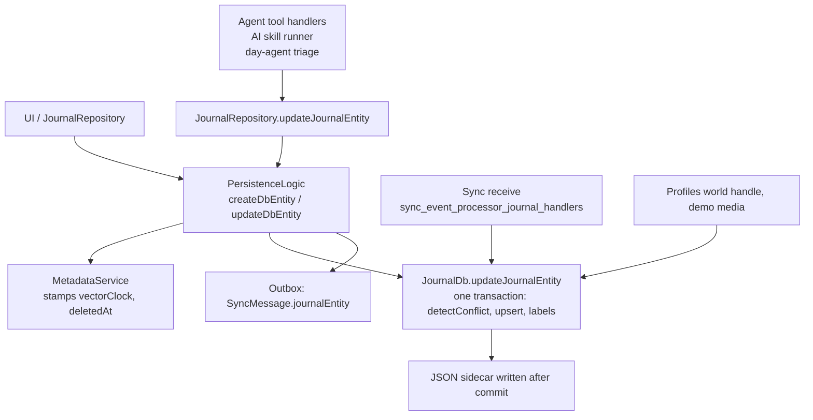

# Record provenance and integrity: Phase 0 mapping

Status: Phase 0 deliverable for the *Lotti Record Provenance and Integrity
Spec* (draft). Mapped against `main` at `bc62f446b` (2026-09-25). No code has
been written.

The spec asks for a map of five areas before any implementation, and for every
assumption that contradicts the codebase to be flagged rather than adapted to.
Section 6 lists those contradictions and what each one means for the spec. Read
it first if you only need the decisions.

## 1. Raw entries: where they are created, stored and mutated

**Storage.** Journal entries live in the `journal` table
(`lib/database/database.drift`). The whole `JournalEntity` is kept as JSON in
`serialized`. The other columns are copies of fields pulled out for queries:
`deleted`, `private`, `starred`, `flag`, `task_status`, `category`,
`project_id`, `plain_text` and so on. `toDbEntity`
(`lib/database/conversions.dart`) builds the row. Entities come in 19 variants,
all sharing one `Metadata` (`lib/classes/journal_entities.dart:33`): `id`,
`createdAt`, `updatedAt`, `dateFrom`, `dateTo`, `categoryId`, `labelIds`,
`utcOffset`, `timezone`, `vectorClock`, `deletedAt`, `flag`, `starred`,
`private`. **There is no author, agent, model or device field.**

**JSON sidecars.** Every write that is applied also writes the entity to a
JSON file on disk. `JournalDb.updateJournalEntity` does this after the commit,
in commit order, via `_publishSidecar`. For images and audio the file is
`<media path>.json`; for everything else it is
`/<folder>/<yyyy-MM-dd>/<id>.<type>.json`. The sidecar is what sync uploads
(section 5). Media files sit next to it and carry no content hash.

**Write path.**

- **Transaction choke point:** `JournalDb.updateJournalEntity`
  (`lib/database/database_entity_ops.dart:215`). Every entity-level write ends
  here. It compares vector clocks (`detectConflict`, `:74`), stores concurrent
  versions as a `Conflict` row, merges concurrent deletions, and upserts.
- **App-level facade:** `PersistenceLogic` (`lib/logic/persistence_logic.dart`).
  It creates entries with `createDbEntity` (`lib/logic/persistence_entries.dart:244`)
  and updates them with `updateDbEntity` (`lib/logic/persistence_updates.dart:145`).
  Both stamp metadata, write, reindex FTS5 and enqueue sync.
- **Writes that go straight to `JournalDb`:** sync receive
  (`lib/features/sync/matrix/sync_event_processor_journal_handlers.dart:376`),
  profile worlds (`lib/features/profiles/service/world_handle.dart:111`) and
  demo media. Some column-only writes also skip the entity path:
  `updateTaskPriorityColumn`, the `project_id` recompute in
  `upsertJournalDbEntity`, migrations and the purge.

**Deletion today.**

- *Soft delete* (`JournalRepository.deleteJournalEntity`,
  `lib/features/journal/repository/journal_repository.dart:177`) stamps
  `deletedAt` through an ordinary versioned update. The tombstone syncs. Links
  are tombstoned the same way.
- *Purge* (`purgeDeleted`, `lib/database/database_entity_ops.dart:450`) is
  started by hand from Maintenance and runs locally only. It takes a DB backup,
  deletes media and sidecars, then hard-deletes the rows. Peers keep their
  tombstones and their content.

**Crypto today.** `crypto` (SHA-256) and `pointycastle` are dependencies, and
Matrix uses `flutter_vodozemac`. Journal rows and sidecars have no hash,
signature or at-rest encryption. The databases are not encrypted at rest, as
`knowledge/architecture/security-and-privacy.md` says. SHA-256 is used for
other things: embedding content keys, AI interaction digests, speech model
checks, image-migration copy checks and run keys. The draft profile backup
(`lib/features/backup_restore`) is the one component with real authenticated
encryption: Argon2id key slots and ChaCha20-Poly1305 chunks, with per-file
SHA-256 in the manifest.

## 2. Append-only logs and compaction

**"Dreaming" does not exist.** No process, file or document uses the name, and
there is no global or journal-level compaction job. What does exist:

| Log / artifact | Store | Append-only? | Notes |
|---|---|---|---|
| Journal entries | `journal` (db.sqlite) | **No**: edited in place, soft-deleted, purgeable | Raw, user-authored. Not event-sourced. |
| Agent message log (`AgentMessageEntity`) | agent.sqlite | Yes, except retention | Immutable messages chained by `messagePrev` (ADR 0016); agent state is a projection of it. Modelled by `specs/tla/AgentMessageLog.tla`. |
| Captured inputs (message payloads + links) | agent.sqlite | Yes | Content-addressed copies of the source text an agent saw. A removed source gets a retraction line, never a delete. |
| Summary checkpoints | agent.sqlite | Yes | Written by `AgentLogCompactor` (`lib/features/agents/sync/agent_log_compactor.dart:39`, ADR 0017/0071). Once the uncovered tail passes 50k tokens, the LLM folds it into a summary. Only the prompt sees the summary; sources stay. Modelled by `specs/tla/LogCompaction.tla`. |
| Goal check-in summaries | agent.sqlite | Upserted under a deterministic id | `lib/features/goals/service/goal_checkin_compactor.dart`. The raw check-in stays in the journal. |
| Agent reports (`tldr`, `oneLiner`, content) | agent.sqlite | Snapshots immutable; head pointer mutable | Written live by the `update_report` tool, not by a batch job. |
| `AiResponseEntry` (incl. `oneLiner`, `tldr`) | journal | New entity per run | Derived, but stored in the journal next to raw entries. |
| Observations; day-status events | agent.sqlite | **No**: hard-deleted after 180 and 90 days | `lib/features/agents/service/agent_retention_policy.dart` |
| Sync outbox | sync db | One row per version (ADR 0086); **pruned** after send | A send queue, not a history. |
| Sync sequence log | sync db | **No**: status updated in place | Tracks counter status per host, not events. |

**The critical check passes.** No compaction or retention path rewrites or
drops raw user-authored journal entries. Compaction only adds rows to
agent.sqlite, and retention deletes only derived agent residue.

## 3. Vector clocks, sequence log and the TLA+ models

- **Representation.** `VectorClock` (`lib/features/sync/vector_clock.dart`)
  is a `Map<String,int>` from host id to counter. An absent host ranks below
  counter 0 (ADR 0080). `merge` takes the per-host maximum.
- **Host id.** A random UUIDv4 generated by `VectorClockService.setNewHost`
  and stored in SettingsDb (`VC_HOST`). It has no key pair and no relation to
  the Matrix device id. Guest and demo worlds get their own host id.
- **Counter.** `reserveNextVectorClock`
  (`lib/services/vector_clock_service.dart:291`) hands out **one counter per
  host, shared across every synced payload type**: journal entity, entry link,
  agent entity, agent link, notification, notification state update and
  consumption event. It starts at 1 (`firstVectorClockCounter`); hosts created
  by older builds started at 0.
- **The counter is strictly increasing but deliberately not gap-free.**
  Counters are skipped or never applied through:
  - a catch-up jump when the previous clock is ahead;
  - burns after a rejected or failed write;
  - reservations that no store recorded;
  - outbox collapse of superseded versions (`coveredVectorClocks`);
  - legacy counter 0;
  - re-hosting.
- **Sequence log** (`lib/database/sync_db_sequence.dart`, watermarks,
  backfill). Gaps are closed by explicit states rather than by structure:
  reserved, received, burnPending, burned, backfilled, deleted, unresolvable.
  Only the originator may declare a counter `unresolvable`.
- **Merge and conflicts:**
  - Journal entries raise a user-resolved `Conflict` when versions are
    concurrent (`lib/features/sync/state/conflict_resolution_service.dart`).
  - Agent entities resolve deterministically: dominance, then a per-type
    override, then `updatedAt`, then canonical order.
  - Entry links use a lexicographic key.
- **TLA+.** `specs/tla/` holds 26 specs, run by TLC in CI. The history is in
  `LEDGER.md` and the per-spec reference in `README.md`.
  - `JournalReplication` models clocks as `[Replica -> Nat]` with a per-entry
    counter, so it abstracts away the cross-type counter sharing.
  - `SyncSequence` has a single originator.
  - `OutboxCausality` checks that collapse is causal.
  - Each fix has a switch that reproduces its counterexample, and conformance
    traces replay model scenarios against the Dart code, so the §13.3 "trace
    validation" stretch goal has infrastructure to extend.
  - **No model has hashes, signatures, per-device chains or device identity.**

## 4. How agent writes reach the record

**Proposal and approval already exist, as change sets.**

- `ChangeSetEntity` and `ChangeItem` (tool name, args, human summary, status,
  effect key, base value) hold proposals
  (`lib/features/agents/model/agent_domain_entity.dart:707`).
- `ChangeDecisionEntity` records one verdict per item: confirmed, rejected,
  deferred or retracted.
- Both sync through `AgentSyncService` and are model-checked: `ChangeSetConfirm`,
  `ChangeSetLifecycle` (ADR 0067) and `ChangeSetDependency`. The guaranteed
  properties include `AtMostOnceApply`, `RejectedMeansNotApplied` and
  `NoClobber`.

**Gated** by a change set, with per-item confirm or reject:
- task-agent field, checklist, label, link, follow-up, migration and
  time-entry tools;
- project-agent status and task creation;
- event-agent follow-ups;
- query-chat actions;
- day-plan diffs;
- goal spec revisions.

**Applied immediately, with no approval:**

| Path | Where | Writes |
|---|---|---|
| Initial task title and language, when the field is empty | `lib/features/agents/workflow/task_agent_strategy.dart:356` | task title / language |
| Day agent `apply_triage` | `lib/features/daily_os_next/agents/service/day_agent_triage_service.dart:102` | task status, due date |
| Day agent `create_task_from_phrase` | `lib/features/daily_os_next/agents/service/day_agent_capture_service_tools.dart` | new task (and assigns a task agent) |
| AI transcription (automatic behind a category consent switch, or manual) | `lib/features/ai/services/skill_inference_runner.dart` | `JournalAudio.transcripts` and `entryText` |
| AI summaries, image analysis, prompt generation | same runner | new `AiResponseEntry` plus links |
| AI image generation | same runner | imports an image, sets the task cover art |
| Legacy prompt path | `lib/features/ai/repository/unified_ai_inference_repository.dart` | updates the entity (can append analysis to `entryText`) |

**There is no single choke point.**
- Task-agent immediate writes go through `AgentToolExecutor` (category check,
  audit messages).
- Project, event and day agents use their own strategies and services.
- The AI skill runner uses no executor at all.
- Confirmed change-set items are applied by calling the tool dispatchers
  directly (`lib/features/agents/state/change_set_providers.dart`). That
  **skips** `AgentToolExecutor`.
- All of these end in `JournalRepository`, `PersistenceLogic`,
  `ChecklistRepository` or `LabelAssignmentProcessor`. None of them takes an
  actor.

**How authorship is recorded.**
- `Metadata` has no author.
- Partial exceptions:
  - `ChecklistItemData.checkedBy` (user or agent).
  - `ChecklistItemProvenance` (`lib/classes/checklist_item_data.dart:127`):
    approvedBy, approvalHost, changeSetId, decisionId. It is built only for
    query-chat confirmations.
  - `AiWorkAttribution` (model, cost, actor) on AI responses, images and
    transcripts.
- A checklist item confirmed from the summary card gets no receipt and is
  stamped `checkedBy: agent`
  (`lib/features/ai/functions/lotti_checklist_update_handler.dart:458`).
- `ChangeDecisionEntity` stores `actor` (user or agent), but no device or
  host. Undo rewrites the decision in place as `deferred`, so the original
  verdict is overwritten.

## 5. What Matrix payloads carry

- **The envelope.** `SyncMessage` (`lib/features/sync/model/sync_message.dart:73`)
  has 25 variants. The metadata goes as base64 JSON in an `m.text` event with
  Lotti's msgtype.
- **Journal entities** are not inline. The entity JSON (the sidecar, gzipped)
  is uploaded as a separate `m.file` event. The envelope binds to it by
  `attachmentEventId` plus `relativePath` and carries `vectorClock`,
  `originatingHostId` and `coveredVectorClocks`. Outbox bundles send one
  gzipped manifest of several entities.
- **Media** goes as a further `m.file`, sent only on the initial version or on
  request.
- **Inline families:** links, agent entities and links, configs, definitions,
  flags, consumption events, backfill and onboarding messages.
- **Integrity comes only from megolm and vector clocks.** Lotti adds no hash,
  checksum or signature of its own; the only hash is the Matrix SDK's
  ciphertext hash for encrypted files, which Lotti never reads.
- **Inbound trust is room membership plus the ability to decrypt.**
  - All devices share one Matrix user
    (`lib/features/sync/queue/queue_pipeline_coordinator.dart:395`).
  - ADR 0045 (`ShareKeysWith.directlyVerifiedOnly`) limits who *receives*
    megolm keys.
  - Nothing on the receive path authenticates which device *sent* an event,
    and `originatingHostId` is self-asserted.
  - There is no cross-signing; devices verify each other by SAS.
  - Revoking a device means deleting its Matrix session. Nothing revokes a
    vector-clock host id.
- **Other transports:**
  - The draft profile backup bundle (`lib/features/backup_restore`).
  - The legacy per-database copy around migrations.
  - QR and manual pairing, which carries credentials only.

## 6. Where the spec contradicts the codebase

Each row is a place where the spec as written cannot be implemented without a
decision. The proposed resolution is a recommendation, not a decision.

| # | Spec | What the code does | Consequence | Proposed resolution |
|---|---|---|---|---|
| C1 | §2, §10: an existing "compaction ('dreaming')" | No such process. Compaction is per-agent input-log folding into agent.sqlite, plus goal check-in summaries. | §10 has no single target. | Apply §10 to `AgentLogCompactor` checkpoints, goal check-in summaries, agent reports and `AiResponseEntry`. The "never removes raw entries" rule already holds. |
| C2 | §2: an "append-only log" | Journal entries are mutable rows with soft delete and a local purge. Only agent-side logs are append-only. The outbox and sequence log are mutable and pruned. | Per-device chains (§6) are a new structure, not a wrapper over an existing log. | Add a new `envelope` table per database. Keep the envelope as a signed *version* record pointing at the current row, rather than making the row itself append-only. |
| C3 | §6.2 I5: the vector clock component for `device_id` equals `seq` | One counter per host is shared by 7 payload types, and it has burns, catch-up jumps, collapse and legacy 0. | I3 (gap-free `seq`, `prev` hash) and I5 cannot both hold. | Keep `seq` as a separate gap-free counter per device chain, assigned only when an envelope is actually written. Carry the vector clock inside the envelope as data. Replace I5 with "`vector_clock[host_id]` is strictly increasing along the chain". |
| C4 | §6: `device_id` = signing key fingerprint | The sync identity is a random UUID host id with no key. It is separate from the Matrix device id and re-created per world. | Envelopes need both identities. | Bind `host_id` into the `device_cert` so one cert covers both. Treat re-hosting as a new device (a new cert, and a revocation of the old chain at its last `seq`). |
| C5 | §8: agents change the record only through signed proposals | Change sets exist and are model-checked, but seven paths apply immediately (section 4). Confirmed items skip `AgentToolExecutor`, and there is no single choke point. | R1 needs new work and a product decision on the immediate paths. | Build the R1 choke point at the persistence layer: every write carries an actor, and an agent actor needs an approval hash. Section 7, D7 covers the auto-apply paths. |
| C6 | §8.1 step 3: an approval records the approving user device | `ChangeDecisionEntity` has `actor` but no host or device, and undo overwrites the verdict in place. | Approvals are not attributable or immutable today. | Make `approval`/`rejection` envelopes append-only. Model undo as a new envelope that supersedes the old one, not a rewrite. |
| C7 | §8.4, §10: derived artifacts are not record entries | `AiResponseEntry`, audio transcripts (in `JournalAudio`) and AI-set cover art live **inside** journal entities. | The raw/derived boundary runs through single entities. | Decide per field (section 7, D8). Transcripts are arguably raw once the user accepts them; `AiResponseEntry` is derived. |
| C8 | §4 terminology | `AgentRetentionPolicy` calls day plans, day summaries and reports "user authored". | Two taxonomies for one concept. | Adopt the spec's raw/derived split in the knowledge docs and code comments once D8 is settled. |
| C9 | §9.2: every device destroys content once the tombstone syncs | Soft deletes sync, but purge is manual and local, and peers keep the content. Backups and sidecars keep copies. | Crypto-shredding needs per-entry data keys, which do not exist. | Phase 7 adds per-entry keys. Until then, deletion is "hidden and tombstoned", not "unrecoverable", and the UI should say so. |
| C10 | §2 item 3: "the TLA+ sync model" | There are 26 specs, not one, and none models identity or hashing. | §13.1 is several new specs, not an extension of one. | Add `EnvelopeChain.tla` (I1–I4, fork detection, revocation), and extend `ChangeSetLifecycle` with approval identity and R4 staleness. |
| C11 | §3: the sync server cannot alter history undetected | Server-side tampering is already bounded by megolm. The larger gap is the one above: nothing authenticates the *sending device*. | The threat model undersells the win. | Also list "a device that holds room keys but was never certified" in §3's "detects or prevents" set. |

## 7. New decisions the mapping surfaced

These are in addition to the six open decisions in the spec (§17).

- **D7. What happens to the paths that apply immediately?** Either route
  initial title/language, day-agent triage/create and AI transcription through
  proposals, or define them as a named class of *pre-approved* change that is
  still signed as `author.type = agent`. The latter needs a per-category
  approval envelope (a standing consent) that the spec's R2 currently forbids.
  This overlaps with the product stance that agents are essential, so
  pre-approval should be the first thing looked at.
- **D8. Where is the raw/derived line inside an entity?** Specifically for
  transcripts, AI-set cover art and AI appends to `entryText`.
- **D9. Which stores get chains?** The journal only, or also agent.sqlite
  (reports, plans, planner knowledge that the retention policy calls "user
  authored"), entry links, definitions and settings. Recommendation: journal
  entries and entry links in v1. The agent DB already has its own immutable log.
- **D10. What does the envelope's `content_commitment` cover?** The full
  serialized entity, including derived fields such as `AiResponseData`, or a
  canonical projection of user-authored fields only.
- **D11. Guest and demo worlds.** Recommendation: no chains, since they never
  sync.

## 8. Doc drift found while mapping

Per the repository rule, the knowledge concept is the defect when it disagrees
with the code. None of these is fixed here; they are follow-ups.

- `knowledge/features/agents/index.md` says there is "a human review gate in
  front of every task mutation". Section 4 lists the exceptions.
- `knowledge/features/agents/task-agents.md` has three problems:
  - It says non-local writes go through `AgentToolExecutor`; confirmed change
    sets skip it.
  - It describes approval receipts as general; they are query-chat only.
  - It calls `approvalHost` the human's sync host; the decision entity has no
    host.
- `knowledge/features/sync/send-path.md` still describes the merge-in-place
  outbox. ADR 0086 moved it to one row per version, collapsed at send time.
- `knowledge/domain/journal-entity.md` says there are 18 entity variants; the
  `goal` variant makes 19.
- `docs/architecture/sync_current_architecture.md` is historical. It predates
  counter reservations and ADR 0080.
- The Matrix SDK version is cited as 7.0.0, 8.1.0 and 10.0.0 in different code
  comments and docs.
