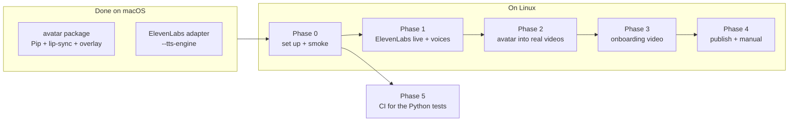

# Tutorial Videos: Talking Avatar, ElevenLabs Narration and the Onboarding Video

Date: 2026-10-07
Status: in progress — avatar and ElevenLabs adapter built on macOS; everything
that records the app continues on Linux
Branch: `feat/tutorial-avatar-prototype`
Builds on: [2026-07-21_tutorial_video_workbench.md](2026-07-21_tutorial_video_workbench.md)
Runbook: `.claude/skills/tutorial-videos/SKILL.md` · Architecture: `tools/tutorial_videos/README.md`

## Goal

From the product call (paraphrased): a face is better than a voice from
off-screen — even a cartoon character talking from a little round badge in the
corner. Start with onboarding: the very first steps, **pasting the Melious API
key, setting up the first category, and getting the first task running**.
ElevenLabs is believed to sound much better than the current voices. Build it,
then come back with options for feedback.

Concretely, the finished state is:

1. Every published tutorial video can carry **Pip** (a cartoon penguin from the
   demo world) in a corner badge, lip-syncing the narrator.
2. Narration can be rendered with **ElevenLabs** or Gemini, and one of them is
   chosen as the default after listening.
3. A new **`onboarding_first_run`** tutorial video walks a brand-new user from
   the welcome screen through Melious key → first category → first spoken task,
   in all 11 locales, desktop and mobile, published and embedded in the manual.

## Where things stand (hand-off from macOS)

Done on this branch (see the commits on `feat/tutorial-avatar-prototype`):

| Piece | Where | State |
|---|---|---|
| Avatar rasterizer + PNG encoder (stdlib-only) | `tools/tutorial_videos/tutorial_videos/avatar/raster.py` | done, tested |
| Pip, the only character | `avatar/characters.py` (`PIP`) | done, tested |
| Loudness lip-sync, 4 mouth levels | `avatar/lipsync.py` | done, tested |
| Seeded blinking, pose runs | `avatar/track.py` | done, tested |
| Preview + corner overlay via ffmpeg | `avatar/render.py` | done, tested (incl. 2 real-ffmpeg tests) |
| `avatar-preview` / `avatar-overlay` commands | `avatar/cli.py`, `tutorial_videos/__main__.py` | done, tested |
| ElevenLabs TTS adapter | `tutorial_videos/tts/elevenlabs.py` | done, tested against mocked HTTP only |
| Engine factory + `--tts-engine` flag | `tts/engines.py`, `__main__.py` | done, tested |
| Per-engine voice config | `config/voices.yaml` (`engines.gemini`, `engines.elevenlabs`) | done |
| Docs | `tools/tutorial_videos/README.md` ("TTS engines", "Talking avatar (prototype)"), skill runbook | done |
| Changelog fragment | `changelog.d/2026-10-06-tutorial-video-avatar.md` | done |

Verified so far: Python unit tests (100% line + branch coverage of `avatar/`
and `tts/`), Pip rendered to preview clips, and the overlay on a plain
1920×1080 stand-in frame (frame count unchanged, badge bottom-right).

**Not verified yet** (impossible on macOS or without keys):

- a real ElevenLabs request (no `ELEVENLABS_API_KEY` was available) — the
  default voice ids `JBFqnCBsd6RMkjVDRZzb` (George) and `EXAVITQu4vr4xnSDxMaL`
  (Sarah) came from a third-party list and may not exist on the account;
- Pip on a real recorded tutorial;
- anything that records the app (`build`): it needs Xvfb, x11grab and a
  PulseAudio/PipeWire virtual microphone.



Phases 1 and 2 are independent of each other and can run in either order;
Phase 3 needs Phase 0 only, but should use the voice and avatar decisions from
1 and 2 before its final renders.

---

## Phase 0 — Linux set-up and smoke test

The original workbench was validated on **Ubuntu 24.04 ARM64** with PipeWire +
`pipewire-pulse`.

### 0.1 Packages and tools

```sh
sudo apt install xvfb ffmpeg pulseaudio-utils x11-utils python3-venv
# pulseaudio-utils provides pactl/paplay/parecord (they talk to pipewire-pulse)
ffmpeg -hide_banner -devices 2>&1 | grep -E "x11grab|pulse"   # both must be listed
ffmpeg -hide_banner -encoders 2>&1 | grep -E "libx264|aac"    # both must be listed
```

Flutter through FVM: after pulling, compare `.fvmrc` with `fvm list` and
`fvm install` the pinned SDK first — a missing SDK makes every background `fvm`
call sit on an interactive install prompt.

### 0.2 OpenMontage sibling checkout

Exactly as `tools/tutorial_videos/config/openmontage.pin` says:

```sh
git clone https://github.com/calesthio/OpenMontage.git ../OpenMontage
git -C ../OpenMontage checkout "$(grep ^commit= tools/tutorial_videos/config/openmontage.pin | cut -d= -f2)"
make -C ../OpenMontage setup
```

### 0.3 Secrets (`.env` at the repo root — never committed)

| Key | Needed for |
|---|---|
| `GEMINI_API_KEY` | Gemini narration (current default engine) |
| `MELIOUS_API_KEY`, `MELIOUS_BASE_URL` | transcription + task agent in every scenario; **also typed into the onboarding video** (Phase 3) |
| `ELEVENLABS_API_KEY` | `--tts-engine elevenlabs` |
| `R2_ACCOUNT_ID`, `R2_ACCESS_KEY_ID`, `R2_SECRET_ACCESS_KEY`, `R2_BUCKET_NAME`, `R2_PUBLIC_BASE_URL` | publishing only (Phase 4) |

### 0.4 Python environment

The system Python is externally managed (PEP 668). One venv for the tool:

```sh
cd tools/tutorial_videos
python3 -m venv .venv
.venv/bin/pip install pyyaml boto3 coverage
```

`make tutorial_video` calls plain `python3`, so either activate the venv first
or call `.venv/bin/python -m tutorial_videos ...` directly.

### 0.5 Smoke test (in this order)

- [ ] `cd tools/tutorial_videos && .venv/bin/python -m unittest discover -s tests`
      — everything passes; the two real-ffmpeg avatar tests now run instead of
      skipping. Only skips allowed: the existing boto3/network ones.
- [ ] `.venv/bin/python -m tutorial_videos validate --scenario category_setup --locale en`
- [ ] `make tutorial_video TUTORIAL_SCENARIO=category_setup TUTORIAL_LOCALE=en`
      (Gemini, no avatar) — produces `build/tutorial_videos/category_setup_en.mp4`.
      This proves the Linux box can record before anything new is layered on.
- [ ] `.venv/bin/python -m tutorial_videos avatar-overlay --video build/tutorial_videos/category_setup_en.mp4`
      — produces `category_setup_en_avatar.mp4`. Watch it end to end.

If the build fails, the failure-time screenshots in `build/tutorial_videos/`
(`LOTTI_SCREENSHOT_DIR`) are the first thing to read. The runbook's
"Debugging a failing run" covers the known causes.

---

## Phase 1 — ElevenLabs: verify live, pick voices, pick the default

### 1.1 First live request

- [ ] `.venv/bin/python -m tutorial_videos tts --scenario category_setup --locale en --tts-engine elevenlabs`
- [ ] If it fails with HTTP 404 / `voice_not_found`, the default voice ids are
      not on the account: list the account's voices
      (`GET https://api.elevenlabs.io/v2/voices`, header `xi-api-key`) and put
      real ids into `config/voices.yaml` → `engines.elevenlabs.streams`.
- [ ] If it fails with 422, the response names the offending field — most
      likely a `settings` key; ElevenLabs' `voice_settings` accepts
      `stability`, `similarity_boost`, `style`, `speed`, `use_speaker_boost`.
- [ ] Clips land in `build/tutorial_videos/tts_cache/` — listen to them.

### 1.2 Voice auditions (needs the stakeholder)

The call said voice samples would be shared separately. For each candidate:

- [ ] render `category_setup` narration in `en` and `de` (the longest locale)
      with the candidate voice id;
- [ ] judge: natural German/French/Czech pronunciation (multilingual_v2 reads
      the language off the text — check it does not carry an English accent
      into other locales), pace against the video, and that the `user_voice`
      is unmistakably a different person from the narrator.

Tuning knobs, in `voices.yaml` per stream: `stability` (lower = livelier,
less consistent), `similarity_boost`, `style`, `speed`. Every change is a new
cache key, so old clips are never reused by mistake.

### 1.3 Decide the default engine

- [ ] If ElevenLabs wins, set `engine: elevenlabs` in `config/voices.yaml` and
      update `tests/test_tts.py::LoadVoicesTest.test_defaults_to_gemini_with_a_style_per_locale`
      (it pins today's default), plus `test_main.py::TtsCommandTest.test_uses_voices_yamls_default_engine`.
- [ ] Re-render every published scenario × locale with the new voices before
      publishing any of them, so the manual never mixes two narrators.
- [ ] Note the per-character cost of a full re-render (11 locales × all
      scenarios) before kicking it off.

---

## Phase 2 — Put the avatar into real videos

### 2.1 Placement on real UI (do this first — it may change the design)

The badge sits bottom-right at 22% of the video height. On real screens that
corner is busy:

- **Desktop**: create buttons and floating action buttons can sit near the
  bottom-right — the badge may cover the very control the cursor clicks
  (check `create_task_from_audio` and `category_setup` first: both click a
  create action).
- **Mobile**: the bottom navigation runs along the bottom edge.

- [ ] Render the overlay onto every existing scenario (desktop + mobile) and
      grab frames at each step (`ffmpeg -ss <t> -frames:v 1`).
- [ ] If anything the narration refers to is covered, make the corner
      configurable: add a `position` (`bottom_right`, `bottom_left`,
      `top_right`, …) to `overlay_command` / `render_overlay`, choose it per
      device (and per scenario if needed — a scenario YAML field
      `avatar_position` is the natural home), and test every position's
      overlay expression. Top-right on desktop and above-the-nav-bar on
      mobile are the likely winners.

### 2.2 Pip must only lip-sync the narrator

`avatar-overlay` reads `<stem>.narration.wav`, which `compose.py` mixes from
the narrator clips **and the dictation clip** (the "user" speaking into the
app) — so Pip currently mouths the user's voice too.

Fix: build Pip's level track from the narrator clips alone, placed where
`compose.py` places them:

- [ ] New function (e.g. `avatar/narration_track.py::narration_levels`) that
      takes the manifest, the timeline and fps, runs the same
      `timewarp.plan_segments(timeline, durations)` as `compose.py` and
      `captions.py`, and for each timeline step drops
      `frame_levels(narration_clip, fps)` at
      `round(output_time(segments, step.start) * fps)`; overlapping clips take
      the louder value; dictation clips are never read.
- [ ] `avatar-overlay` gains `--manifest` and `--timeline` (defaults derived
      from the video stem: `<scenario>_<locale>.manifest.json` — shared
      across devices, so strip a `_mobile` suffix — and
      `<scenario_locale>.timeline.json`); `--narration` stays as the fallback
      for videos without a timeline.
- [ ] Tests: a clip lands at its warped offset; the dictation span stays
      closed-mouthed; two overlapping clips; a step without narration; a
      `_mobile` stem finds the shared manifest.

### 2.3 Loudness reference over speech only

`mouth_track` judges each frame against the 95th-percentile loudness of the
**whole** track. In a real tutorial much of the timeline can be silence
(fast-forwarded waits): if speech covers less than ~5% of frames the
reference becomes the silence level and the mouth either never opens or
opens on noise.

- [ ] Compute the reference over frames above a small noise floor only
      (e.g. `level > 0.01`), with a regression test of mostly-silent input
      (speech in 3% of frames still opens the mouth fully) — and re-run that
      test with the fix reverted to prove it fails.

### 2.4 Make the avatar part of `build`

- [ ] `build --avatar` (and `make tutorial_video TUTORIAL_AVATAR=1`): after
      `compose_video`, call `render_overlay` into a temporary file and
      `os.replace` it over `<scenario_locale>.mp4`, so captions, publish and
      the docs site need no change.
- [ ] Decide with the stakeholder whether the avatar becomes the default;
      until then keep it opt-in.
- [ ] Update the README ("Talking avatar"), the runbook, and drop the word
      "prototype" once it is on by default.

### 2.5 Visual sign-off

- [ ] One desktop and one mobile video with Pip, reviewed by the stakeholder:
      size, corner, readability of the beak at 22% height, blink rate,
      whether the teal ring matches the docs site.
- [ ] Optional polish from feedback (all in `avatar/characters.py` /
      `track.py`): idle motion (a slow 1–2px bob), a slightly larger badge on
      mobile, entry/exit fade at the video's start and end.

---

## Phase 3 — The onboarding video (`onboarding_first_run`)

This is the main deliverable from the call. It records the **real** first-run
flow (`lib/features/onboarding/ui/onboarding_welcome_modal.dart`, steps
`welcome → connect → apiKey → success → recordingStyle → category → firstTask`)
in an app with no AI provider configured.

### 3.1 How the flow works today (verified in code)

- The welcome auto-shows from `MyBeamerApp` (`lib/beamer/beamer_app.dart`,
  `_showOnboardingWelcome`) when `shouldAutoShowOnboardingProvider` resolves
  `true`. The tutorial harness **forces it to `false`**
  (`integration_test/tutorial/tutorial_harness.dart`, `providerOverrides`).
- The API-key step (`onboarding_api_key_panel.dart`) runs a **live connection
  probe** against the provider as the key is typed; the Connect button only
  enables once the probe returns verified. Connecting saves the provider,
  revives its bundled inference profile, and runs the FTUE setup
  (`runFtueSetupForType`) that seeds models and profiles.
- The category step creates the chosen areas and switches on automatic
  transcription for them (`knowledge/features/onboarding.md`, "Where the
  consent flag is written").
- The first-task step (`onboarding_first_task_step.dart`) records through the
  shared capture controller — the same mic → transcription path the
  `create_task_from_audio` scenario already drives with the virtual mic — and
  structures the transcript into a real task.

### 3.2 Harness changes (`integration_test/tutorial/tutorial_harness.dart`)

- [ ] Add `autoShowOnboarding` (default `false`) to `setUp` and make
      `providerOverrides()` return `true` from `shouldAutoShowOnboardingProvider`
      when it is set. Every existing scenario keeps today's behaviour.
- [ ] The scenario boots with `aiConfigs: const []` (as `category_setup`
      already does) — no provider, exactly what a first run sees.
- [ ] Decide `seedDemoWorld`: `false` gives a genuinely empty first-run app
      (most honest); `true` keeps the penguin world behind the modal. Prefer
      `false` and check the empty app renders cleanly behind the modal.
- [ ] Verify the onboarding metrics store (`onboarding_metrics.sqlite`) and
      the settings the cadence writes land in the harness's temp documents
      directory, never the developer's real data.
- [ ] Verify the base URL the onboarding flow uses for Melious (the
      provider's built-in default) reaches the same endpoint as
      `MELIOUS_BASE_URL`; if not, the probe will fail on camera.

### 3.3 Scenario YAML (`tools/tutorial_videos/config/scenarios/onboarding_first_run.yaml`, new)

Schema as documented in `create_task_from_audio.yaml`. Proposed steps (ids are
the contract with the Dart test):

| Step id | On screen | Narration intent |
|---|---|---|
| `welcome` | the welcome modal appears | what Lotti does: speak a thought, get a task |
| `choose_brain` | tap "Choose your AI brain" | Lotti needs an AI provider to understand you |
| `pick_melious` | tap the Melious tile | why Melious (one key, transcription + thinking) |
| `paste_key` | key typed into the obscured field; probe shows verified | paste your key — it stays hidden and on your device |
| `connected` | success view → continue | you're connected |
| `recording_style` | pick a style → continue | how recording looks |
| `choose_areas` | select area chip(s) → continue | categories keep areas of life apart; transcription is on for them |
| `first_task` (`dictation: true`) | tap record, user voice plays into the mic, stop | say what you need to do |
| `task_appears` | transcript → structured task (fast-forwarded wait) | Lotti turns it into a task |
| `outro` | the task is open | that's it — next: categories, checklists |

- [ ] `title`, `dictionary`, `narration` and `dictation_text` for all 11
      locales: `en de fr it es cs nl ro pt da sv`. Informal register
      everywhere; **Romanian is the deliberate formal exception** (matches the
      existing scenarios and the repo l10n rules). Write `en` + `de` first,
      build and review them, then the other nine.
- [ ] The dictated sentence should produce a task with an obvious title and a
      checklist (penguin vocabulary is fine even in an empty app, e.g. "Order
      sardines for Friday's emperor penguin roll call").
- [ ] Never say anything about the key's value; never show it.

### 3.4 Scenario test (`integration_test/tutorial/onboarding_first_run_tutorial_test.dart`, new)

Model it on `category_setup_tutorial_test.dart` (boot, cursor layer, HUD,
manifest-paced `driver.step(...)`) and `create_task_from_audio_tutorial_test.dart`
(the mic: `driver.speakIntoMic`, transcript waits).

- [ ] Read the key from `Platform.environment['MELIOUS_API_KEY']` (already
      exported by `cmd_build`), type it with `tester.enterText` into the key
      field, then `pumpUntil` the probe's verified state before tapping
      Connect.
- [ ] **Never tap the visibility toggle**; assert the field's `obscureText`
      is still `true` right before and after typing (fail the run otherwise).
- [ ] Finders: localized labels via the same helpers the existing scenarios
      use; scope to the visible, hit-testable page (duplicate keys across
      offstage stacks are a known trap — see the README's "Hard-won
      constraints").
- [ ] Mobile: check how the welcome modal lays out at the phone's 402px
      logical width (sheet vs. dialog) and branch on
      `tutorialDeviceIsMobile()` only where the real UI differs.
- [ ] Waits on the network (probe, FTUE setup, transcription, structuring)
      go through `pumpUntil*` so they are recorded as wait spans and
      fast-forwarded.

### 3.5 Secret safety (the video is public)

- [ ] The key is only ever rendered as dots; check every step's frame
      before publishing (`ffmpeg -ss <t> -frames:v 1`).
- [ ] grep the build outputs (`*.timeline.json`, `*.manifest.json`, `*.vtt`,
      failure screenshots, logs) for the key value — must find nothing.
- [ ] Prefer a dedicated demo Melious key for recordings, so it can be
      rotated without touching anyone's own setup.

### 3.6 Build, review, iterate

- [ ] `validate` for every locale.
- [ ] `make tutorial_video TUTORIAL_SCENARIO=onboarding_first_run TUTORIAL_LOCALE=en`
      (then `TUTORIAL_DEVICE=mobile`), with the chosen engine and `--avatar`.
- [ ] Review against the runbook's checklist: cursor glides, HUD clock
      top-centre, key obscured, transcript and task visible, narration audible
      at each step start, duration ≈ warped timeline total, Pip not covering
      what is being clicked.
- [ ] Then `de`, then all locales (`make tutorial_videos_all
      TUTORIAL_SCENARIO=onboarding_first_run TUTORIAL_LOCALES="en de fr it es cs nl ro pt da sv"`).

---

## Phase 4 — Publish and embed

- [ ] `make tutorial_video_publish TUTORIAL_SCENARIO=<s> TUTORIAL_LOCALE=<l>`
      for each scenario × locale, and again with `TUTORIAL_DEVICE=mobile`.
      Publishing uploads captions (`.vtt`) alongside when present.
- [ ] Embed the onboarding video with `<TutorialVideo scenario="onboarding_first_run" … />`
      in `docs-site/docs/getting-started/onboarding.mdx` and its translations
      under `docs-site/i18n/<locale>/docusaurus-plugin-content-docs/current/getting-started/onboarding.mdx`
      (see `docs-site/docs/getting-started/first-task.mdx` for the pattern).
      The `maintain-docusaurus-manual` skill covers locale parity.
- [ ] If Phase 1 changed the voices, re-publish every existing scenario so the
      manual has one narrator throughout.
- [ ] Update `tools/tutorial_videos/README.md` (scenario list, avatar no
      longer "prototype") and the changelog fragment — fragments only describe
      what a user will notice, so word it around the published videos.

---

## Phase 5 — CI for the tutorial-video Python tests

The workbench's `tests/` have never run in CI (`.github/workflows/python-tools-ci.yml`
covers other tools only).

- [ ] Add a job: Python 3.12+, `pip install pyyaml coverage`, `apt install
      ffmpeg` (so the real-ffmpeg avatar tests run rather than skip), then
      `cd tools/tutorial_videos && python -m coverage run --branch -m unittest discover -s tests`
      and fail under 100% for `tutorial_videos/avatar` and
      `tutorial_videos/tts` (`coverage report --include=... --fail-under=100`).
- [ ] No network: the TTS tests patch `urllib.request.urlopen`; keep it that way.

---

## Phase 6 — Optional: timing-accurate lip-sync

ElevenLabs offers a with-timestamps variant of the same endpoint that returns
per-character start/end times. Mapping characters to mouth shapes (vowels open,
m/b/p closed) would make the beak follow speech rather than loudness. Only
worth it if the stakeholder finds the loudness sync unconvincing in Phase 2.5;
it would feed the same per-frame mouth track, so the renderer does not change.

---

## Decisions needed from the stakeholder

| Decision | Phase | Default if nobody answers |
|---|---|---|
| ElevenLabs voices (narrator, user voice) | 1.2 | keep George / Sarah if they exist on the account |
| Default engine: ElevenLabs or Gemini | 1.3 | Gemini |
| Avatar corner per device | 2.1 | whatever covers nothing the narration points at |
| Avatar on by default in every video | 2.4 | opt-in |
| Re-render existing scenarios with Pip / new voices | 1.3, 4 | only after both above are decided |
| Dedicated demo Melious key | 3.5 | ask before recording |

## Definition of done

- [ ] All 11 locales × desktop + mobile of `onboarding_first_run` built,
      reviewed, published, embedded on the onboarding manual page.
- [ ] Pip appears in every published tutorial, lip-syncing only the narrator,
      never covering the clicked control.
- [ ] One narration engine and voice pair across all published videos.
- [ ] Workbench tests green in CI with 100% coverage of `avatar/` and `tts/`.
- [ ] README, runbook and changelog fragment describe what actually shipped.

## Working rules carried over

- Run only the tests for files you touched (CI runs the rest).
- Every regression test is re-run with its fix reverted and must fail.
- `fvm flutter test`/`drive` rewrites `lib/l10n/app_localizations_*.dart` and
  touches `ios/Podfile.lock`: `git checkout --` them before committing.
- Never run more than two `fvm flutter test`/`drive` processes at once in one
  checkout (hooks-runner lock timeouts).
- No secrets in commits, logs, screenshots or published frames.
