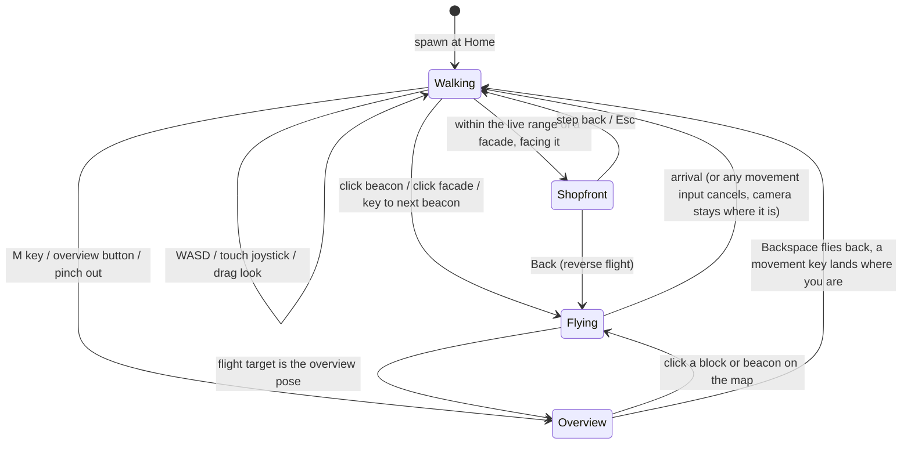

# Project plaza: design for a usable walkable space

Companion to [HANDOVER.md](HANDOVER.md), which describes what exists and
how to drive it. This document answers: **what would it take to make the
plaza a usable, appealing, cognitively useful walkable space?** It was
written on 2026-09-03 as a proposal against the M0 prototype; milestones
M1 to M3 were implemented on 2026-09-04. The text below keeps the intent,
with the passages that described M0 mechanisms updated; where the code
departs from the spec, section 10 says so and why. The numbers that
actually run are in
[knowledge/features/plaza.md](../../knowledge/features/plaza.md), not here.

Design decisions here are driven by two hard facts from M0:

1. **Nothing ever moves.** Placement is a pure function of merged task data
   (`createdAt`, `id`, week bucket). Every idea below is an *overlay* on
   that layout or an extension that is itself a pure function of bucket
   index and project id. If a feature needs a building to move, it is wrong.
2. **Capture is the only cost.** Hosting hundreds of widget subtrees is
   free; rendering one to a texture is what costs (in the M0 VM
   measurement, well under a millisecond per live widget per frame, but it
   adds up linearly). So: live widgets only where the user is looking,
   captured widgets that re-capture only when they must, and everything at
   a distance is geometry and colour.

---

## 1. Principles

- **Three ranges, three questions.** Every design element answers exactly
  one of: *How is the project?* (skyline range, > 140 m), *What is over
  there?* (street range, 26 to 140 m), *What do I do with this?* (shopfront
  range, < 26 m). If an element does not read at its range, it is noise.
- **The world is opinionated about where you look.** Free walking exists,
  but the default way to move is a beacon: a visible point that flies you to
  a curated pose. Walking is for the last twenty metres.
- **Never cut, never lose the horizon.** Every camera change is an animated
  flight with the horizon level; the user can always tell which way is
  "newer" and where "home" is.
- **Attention is earned.** Only what deviates from the expected pattern gets
  a billboard, a lantern or a beacon. A healthy project is quiet.
- **Height means importance, not verbosity.** M0 sized buildings by content;
  the design sizes them by weight (priority, links, open items) and moves
  content into the facade layout instead.
- **Same place, every device.** Everything the layout does must be
  reproducible from synced data alone, which the property tests enforce for
  the street, the fold, the plaza and the beacons.

## 2. Navigation model

Three ways to move, one camera, no cuts.



Overview and Shopfront are poses and ranges of the one camera, not modes:
the same walk, the same flights and the same back stack apply throughout.

### 2.1 Walking

Keep the M0 walk camera, with four fixes:

- **Collision with buildings and street edges.** You cannot walk through a
  facade; the walker slides along walls. Removes the disorientation of
  ending up inside a box.
- **Eye height 2.2 m, not 5 m.** Facades become taller and content sits at
  eye level (section 4.3), so the camera no longer needs to float.
- **Auto-align.** Standing still for a moment near a facade gently yaws the
  camera to face it square-on, which makes the live widget usable without
  pixel-precise mouse work.
- **Touch.** Left-thumb virtual joystick to walk, right-thumb drag to look,
  tap to select, pinch to overview. Same controller, second input source.

### 2.2 Beacons (teleport points)

A beacon is a **curated pose**, not a location: a camera position, yaw,
pitch, and an optional focus building. Beacons render as small glowing
dots sized in *screen space*, so they are visible from across the district
and from up close, and through buildings at reduced opacity. Hovering one
shows its label.

Beacon kinds, all deterministic:

| Kind | Placed where | Why it exists |
|---|---|---|
| **Home** | The frontier plaza (section 3.2), facing the newest block | The morning starting point; `H` or the compass tap always flies here |
| **Block** | At the head of each week's road segment, looking down the block | The unit of "I remember this place"; there is one per built week, so the street has a rhythm of stops |
| **Corner** | Each district fold (section 3.1), looking along the new heading | Removes "what is round the bend" |
| **Overview** | Above and behind the district, pitched down at it | The map, reachable by flight, not by a separate mode |
| **Attention** | On the road in front of each anomalous building (section 4.4) | The thing that needs you, one flight away |
| **Task** | In front of any facade, created on demand when you click a facade or search for a task | Search result, link target, "open in plaza" from the task page |

Home, Block, Corner and Overview are pure functions of the `StreetPlan`;
Attention beacons are pure functions of task data plus the attention score;
Task poses are transient. None of them affects the layout: they are
overlays.

### 2.3 Flights

A flight is the only way the camera moves other than walking:

- **Path.** A straight line from the current pose to the target, eased so
  the flight leaves and arrives without a kick. Flights across the district
  rise into an arc proportional to distance, which keeps the destination and
  the route legible and reads as pleasing on its own; a climb to the
  overview is already an arc and gets none.
- **Timing.** 0.8 s minimum, 2.5 s maximum, duration grows with the square
  root of distance so far flights feel fast but not teleport-instant.
- **Orientation.** Yaw and pitch interpolate on the short arc; roll is
  always zero (horizon level). The camera turns into where it is going for
  the middle of the flight and settles to the target pose at the end, so it
  never slides sideways or backwards through the street; over an arc it
  looks down at what it is crossing.
- **Interruptible.** Any movement input cancels the flight in place, and
  the user is walking from wherever they are (coming down first when the
  flight was mid-arc). No forced sequences.
- **Back.** Every flight pushes the departure pose; `Backspace` flies the
  reverse. The stack is the breadcrumb trail.
- **LOD during flight.** No promotions to live during a flight; the
  destination's focus building is pre-captured at the sign tier when the
  flight starts and promoted to live on arrival. This is what removes the
  promotion hitch on weak hardware.

### 2.4 Overview is a pose, not a mode

M0 had a separate overhead blend 90 m over the walker's head that tracked
the walker and showed roofs only. In the design, overview is simply a pose
high over the district, reached by a flight (`M`, the Overview button, the
morning walk), from which the whole district reads as a skyline map
(section 4.1). Blocks and beacons are clickable from there, and clicking one
flies down; stepping off it lands you where you are. That coexists with
walking without disorientation because the same camera, the same horizon
rule and the same Back stack apply.

### 2.5 Keyboard and search

- `Tab` / `Shift-Tab`: fly to the next / previous beacon along the street.
- `H` Home, `M` Overview, `Backspace` Back, `Esc` leave the panel.
- `/` opens search: type a title, pick a result, fly to its Task pose.
  Search is the escape hatch that makes a large district navigable on day
  one, before spatial memory has formed.

## 3. Scene organisation beyond one street

### 3.1 Folding the street into a district

A long project is a kilometres-long line. The fix keeps the street exactly
as it is (same buckets, same plots, same ordering) and folds it: instead of
a seeded random bend, **every 4th bucket boundary turns 90°**, runs a short
connector with no buildings, and turns 90° again, alternating left and
right, so the street snakes into a compact rectangle. The fold is a pure
function of bucket index, so it is as stable as the bends it replaces, and
it gives every district the same readable shape: rows of blocks, newest row
at the front.

```
            oldest                     (district, from above)
   ┌──────────────────┐
   │ b0  b1  b2  b3 → │   row 0, heading +X
   └──────────────┐ ↓ │   connector, no buildings
   │ ← b7  b6  b5  b4 │   row 1, heading −X
   │ ↓ ┌──────────────┘
   │ b8  b9  b10 b11 →│   row 2
   └──────────────┐ ↓ │
   ...
   ╔══════════════════╗
   ║  FRONTIER PLAZA  ║   the "now" square, beside the last row's mouth
   ╚══════════════════╝
            newest
```

Four buckets per row makes a short row, and the plaza sits beside the last
row's mouth on the district's outside so it never lands on an earlier row.
Corner beacons sit at each fold. Empty weeks still collapse to short gaps,
so a project with a quiet quarter has a visibly short row.

Small projects stay a lane: the waddle world is six built weeks of straight
street and does not fold. The rule is the same; it just never reaches a
fold.

### 3.2 The frontier plaza (Times Square)

The end of the newest bucket opens into a **plaza**: a square with the Home
pose in it, looking back at the street. Around it stand the
**billboards**: enlarged, elevated panels for the tasks that currently
deserve attention (section 4.4), on free-standing pylons in the square and
mounted on the plaza-facing walls of the newest blocks, with a ticker
gantry over the street mouth and a jumbotron on a tower behind the square.
The plaza is where you land in the morning; the billboards are the
headlines; the street behind them is the history.

Billboards never move buildings. A billboard is an additional captured
surface on a pylon whose slot is a pure function of the attention rank, so
the top-ranked task is always on the same pylon. When the attention set
changes, the *content* of the pylons changes, the pylons do not.

### 3.3 Districts and the world

A **project** is a district. Multiple projects live on a **world grid**:
each project id hashes to a cell on a spiral around the origin (stable, no
collisions by construction: the spiral index is the rank of the project id
hash among all known project ids, which only changes when a project is
added or removed, and a new project is always appended at the end of the
spiral). Districts are separated by wide, dark boulevards and connected by
Overview beacons, so the world reads as a city of named districts from the
world overview pose.

The **goals map** is the same machinery with a different projection:
each goal is a district, its tasks are the buildings, and the world overview
is the map. A goal without tasks is a plaza with a single billboard (the
goal statement). Health at world scale is the skyline of each district
(section 4.1).

### 3.4 The morning walk

A **playlist** of beacons, generated deterministically every morning:

1. World overview (5 s hold): the skyline of every district.
2. For each district in attention order: its Overview pose (3 s), then
   its top Attention beacons (3 s each, at most three per district).
3. Home of the district with the most in-progress work.

The walk is a sequence of flights; the user can pause at any stop, interact
with the live facade, and resume (`Space`). Total length is capped at
~90 s. This is the ritual the vision describes: not a report, a place you
visit.

## 4. Information design at distance

### 4.1 Skyline range (> 140 m, and the overview pose)

What must read: **health**, **activity**, **anomalies**. Only geometry,
colour and light are available.

- **Roof lanterns.** Every building carries a small emissive lantern on its
  roof, coloured by state: done = off (dark), open = dim warm light, in
  progress = blue, blocked = red, overdue = amber, cancelled = off. Lanterns
  are screen-space-clamped so they never shrink below a few pixels; from the
  overview pose a district is a field of dots and the ratio of lit to dark
  is the health, with red and amber standing out by contrast. This is the
  "everything is fine" glance, done with light on a night scene rather than
  green paint.
- **Wall tint by category** stays as in M0, dimmed so it never competes with
  lanterns; walls carry window grids whose lit ratio follows the state.
- **Height by weight.** Building height is priority × log(links + open
  items + checklist items), capped at 14 m; a tall dark building is a heavy
  task nobody has touched, a tall blue one is heavy and active. Content no
  longer sets height; the facade layout adapts to the wall instead
  (section 4.3).
- **Sky and fog.** A gradient sky and distance fog matched to the horizon:
  silhouettes read, far rows fade, and the district has depth instead of
  floating boxes on black. Both are cheap (a skybox and a fog term in the
  unlit material).
- **Block markers.** A low, wide plate on the road at every bucket start
  carries the week label as a captured texture (`W12 · Mar 23`) readable
  from the overview pose, which gives the map a time axis.

### 4.2 Street range (26 to 140 m)

What must read: **which building is which**, and **what state it is in**.
The M0 facade was unreadable here; the design adds a **sign** variant.

- **Sign facade.** A captured surface with a few elements only: the title
  large (a few lines, ellipsised), the state as a marquee band, and the
  category bar. No checklist. Legible at 100 m on a 12 m wide wall.
- **Progress as a light bar** along the building's base, not a fill behind
  text: cheap, readable, and true at any angle.
- **Lanterns still on**, which is how the street range degrades into the
  skyline range without a visual jump.

### 4.3 Shopfront range (< 26 m)

The live facade, reorganised for a 2.2 m walker:

- Cover art fills the wall above the sign line; the interactive strip
  (checklist, state chip, details button) sits at the bottom, at eye level;
  the title is the sign above the door. Nothing important is above 4 m.
- A **focus ring** on the building the walker faces, and a subtle hover
  highlight on interactive items: you can see what will react.

### 4.4 Attention and anomalies ("what's that over there?")

An **attention score** per task, deterministic from synced data plus the
local clock at day granularity:

| Signal | Weight |
|---|---|
| Blocked | 3 |
| Overdue | 3 (+1 per week overdue, capped at 6) |
| Due within 3 days | 2 |
| In progress with no activity for 14 days | 2 (a lit building in old history) |
| High priority and open | 1 |
| Heavy (many links / items) and old (> 8 weeks) | 1 |

Score ≥ 3 makes a task **anomalous**: it gets an Attention beacon, its
lantern pulses slowly (a luminance cycle, no extra geometry), a billboard on
its own roof, and, if it is in the top *N* (N = 6 for a district), a
billboard on the frontier plaza. Because the score is based on pattern
breaks, a healthy project has few or no anomalies and a quiet plaza, which
is the point: the eye is drawn by exceptions.

## 5. Stability and spatial memory

The M0 layout invariants stay and extend:

| Element | Function of | Test |
|---|---|---|
| Building placement | `(createdAt, id)`, week bucket | exists |
| Fold (90° turn) | bucket index | exists: shuffled arrival gives identical folds, the fold ignores task data |
| Block / Corner beacons | `StreetPlan` | exists: same plan, same beacons, order and poses |
| Frontier plaza | last segment | exists: appending tasks to the newest week does not move the plaza |
| Billboard pylons | attention rank (slot), not task | exists: four pylons in rank order, facing the focal point |
| District cell | rank of project id hash among known project ids | to add with M4 |
| Attention beacons | task data + day | exists: attention is scored on the UTC day |

Two layout fixes for the M0 edge cases, both still to do:

- **Fixed project epoch.** Persist the project's week-zero epoch with the
  project (or derive it from the project's own `createdAt`), so a task older
  than all known ones syncing in cannot shift bucket zero. `StreetLayout.plan`
  already accepts an explicit epoch; nothing supplies one yet.
- **Reserve empty weeks.** Instead of collapsing an empty week to a gap, give
  it a "vacant lot" segment that already reserves one building slot per
  side. A task syncing into an empty week then fills the reserved slot and
  nothing downstream moves. The short gap was a hike-avoidance trade-off;
  with beacons and flights, walking length no longer matters and the
  invariant can be made absolute.

Recognisability comes from the combination: the fold shape is the same for
every district (you learn one shape), row depth is the project's age, the
plaza is always at the front, and a task's block never changes. "The
blocked one is in row three, left side, past the corner" stays true for
years.

## 6. Interaction with tasks

- **Click a facade** (tap threshold 6 px, 250 ms, so drag-look never
  triggers it): fly to its Task pose. On arrival the facade is live.
- **Checkboxes** on the live facade write through the app's real checklist
  services (M5). Optimistic tick, sync via the normal path, the captured
  sign and the lantern update on the next data change.
- **Details** button: the task detail opens as a **side panel** over the
  plaza (the world stays visible and keeps rendering), not as a route away
  from the world. Closing the panel returns to the same pose.
- **Links** draw as faint ground lines between linked buildings while one
  of them is focused, and the linked building's lantern brightens. Clicking
  the far end flies there. Links are the one thing the hairball did that
  the street cannot; this makes them local and on-demand instead of global.
- **Status changes** from the facade (a state chip menu) are allowed but
  never move the building; the lantern and sign change.
- **Accessibility.** Every beacon and facade action is reachable by
  keyboard, the side panel is the real task page with its existing
  semantics, and the plaza can be entirely bypassed by search.

## 7. Performance budget

Derived from the M0 measurements (capture is the cost, hosting is free,
geometry baseline is smooth on macOS):

| Tier | Budget | Where | Capture policy |
|---|---|---|---|
| Live facade | **≤ 4** (focus building and its nearest neighbours in front of the walker) | shopfront range only | every frame while live; otherwise demote to sign |
| Sign facade | ≤ 80 hosted, captured once | street range | manual; re-capture on task change once data is live |
| Billboards | ≤ 6 on the plaza plus one per anomaly on its roof | plaza and street | on an interval so the glow breathes, hidden and uncaptured beyond the plaza's range |
| Tickers, jumbotron, skyline screens | fixed set per district | plaza and skyline | on an interval, slower the farther they are |
| Block markers, week signs, banners | 1 or 2 per bucket, captured once at build | everywhere | once |
| Far facade | all buildings | skyline | no widget; plate, neon strips, light bar, lantern |
| Lanterns and beacons | all buildings, all beacons | everywhere | screen-space sized sprites, pulse by alpha |
| Districts | only the focused district hosts widgets; others render far tier only | world | none |

Rules that keep the budget:

- Promotions are **scheduled, at most one per frame**, ordered by distance,
  and **suspended during flights** (pre-capture of the destination happens
  at flight start). This turns a burst of captures into a steady
  one-capture-per-frame cost.
- Cover art is loaded once into the image cache shared by sign, live facade
  and billboard, never three times.
- The overlay's caps stay as debug knobs; the budget above is the default
  config.

Target: 60 fps on a mid-range phone for a large district in the skyline
and street ranges, and no frame over 32 ms in the shopfront range. Measure
with `PLAZA_BENCH=1`, which should gain a "flight" phase and a "plaza"
phase.

## 8. Milestones

Each milestone is demonstrable in `dev_main.dart` on the penguin world and
adds its own tour stops so the screenshot set grows with it. None wires the
plaza into the app until M5.

### M1: A legible skyline (done)

- Fold the street, frontier plaza geometry.
- Roof lanterns (state-coloured, screen-size-clamped).
- Night sky, distance fog, block markers with week labels.
- Height by weight instead of by content.
- Sign facade variant for the street range; live facade reorganised for a
  2.2 m eye height.
- Property tests: fold stability, plaza position, height determinism.
- Done when: from the overview pose, a reviewer can point at the blocked
  and overdue tasks without reading a word.

### M2: Beacons and flights (done)

- Beacon model and renderer (Home, Block, Corner); flight controller
  (arc, easing, look-along, interruptible, Back stack).
- Keyboard: Tab/Shift-Tab, H, M, Backspace, Esc; click-to-fly on beacons
  and facades with tap threshold; collision for the walker.
- Promotion scheduling (one per frame, suspended during flights, destination
  pre-capture).
- Tests: flight path stays above ground and lands level; Back returns
  exactly; beacon poses are pure functions of the plan.
- Tour stops derived from the world; `PLAZA_TOUR` sets the poses.
- Done when: a reviewer reaches any named task in the district in under
  ten seconds using only beacons and keyboard navigation, and never sees a
  cut.

### M3: Attention, billboards and search (done, links pending)

- Attention score, Attention beacons, pulsing lanterns.
- Billboard pylons on the frontier plaza with stable slots, mounted screens,
  roof billboards, tickers and the jumbotron.
- Search (`/`) over titles with fly-to.
- Links as on-demand ground lines with lantern brightening: **not done**.
- Done when: the plaza tells a reviewer the six most important things about
  the project in one glance, and each is one flight away.

### M4: Districts and the morning walk (single-district walk done)

- World grid (spiral by project id rank), multi-district fixtures, district
  culling.
- World overview pose; the morning-walk playlist with pause/resume across
  districts (the single-district walk exists).
- Goals projection: goals as districts.
- Tests: district placement stability under project addition; playlist
  determinism per day.
- Done when: the 90 s morning walk over four districts runs at 60 fps on
  macOS and the reviewer can say which district is in trouble.

### M5: Real data and real interaction (first app wiring)

- Projection from the app's task, checklist, link and category models,
  driven by the existing providers (read-only first), behind a debug flag
  in settings, reachable from the task list's project view.
- Checkbox and state-chip writes through the existing checklist and task
  services; side-panel task detail as the real task page.
- Fixed project epoch persisted; vacant-lot reservation for empty weeks.
- Tests: projection parity with the demo world (same output as
  `demo_world_projection.dart`), write paths through the real services.
- Done when: a maintainer opens their own project in the plaza, ticks an
  item on a wall, and sees it ticked in the task page.

### M6: Touch, polish, mobile budget

- Virtual joystick, drag-look, tap-to-fly, pinch-to-overview.
- Mobile performance pass against the budget in section 7; `PLAZA_BENCH`
  flight and plaza phases.
- Design-system pass on facade typography and colour (the harness palette
  in `plaza_style.dart` is explicitly temporary).
- Done when: a large district holds 60 fps in skyline and street ranges on
  a mid-range phone.

## 9. Open questions

- **Time as the only street axis.** Week buckets give stability for free,
  but a project whose tasks are mostly created in one burst is one very
  busy row. An alternative second axis (category as side of the street, or
  category as street within the district) would trade some stability for
  readability. Prototype after M1, decide with the screenshots.
- **How much should be live at all?** If the side panel is good, the live
  facade may only need checkboxes and the details button; everything else
  can be captured. That would let the live cap drop to two.
- **Lantern colour for "open".** A warm light risks reading as "on" from
  a distance. Test against the all-off "done" state in the overview
  screenshot before committing.
- **World scale for many projects.** Twenty districts on a spiral is a
  large world; the overview may need a second level (a "city map" texture)
  before flights make sense across it.

## 10. Implemented deviations

Where the code departs from the text above, and why, as far as the code
itself shows it. The values are in the concept.

- **Fold every 4 buckets, not 6.** With the plaza shifted beside the last
  row, shorter rows keep the district compact enough for one overview pose
  without the row disappearing into fog.
- **The plaza shifts sideways on a folded street.** Straight off the last
  row's end it would land on an earlier row's plots, so the plaza frame
  moves to the district's outside, away from the plot centroid. The spec
  drew it on the axis.
- **No overview beacon dot.** `BeaconKind.overview` exists but nothing
  creates one; the overview is a computed pose (behind the oldest edge,
  framing the whole footprint) reached by key, button or the walk. Task
  beacons are not objects either: a facade tap, a billboard tap and a search
  hit fly straight to the computed task pose.
- **Block beacons stand before the block, not mid-block**, so the first
  pair of facades fits the frame; when cycling toward older weeks the pose
  is turned round.
- **Flights are a straight line with smootherstep easing and a sine arc**,
  not a Hermite curve with road-aligned tangents; the arc starts at 60 m
  rather than 120 m and is suppressed for mostly vertical trips. A landing
  flight (not in the spec) brings the walker down when a movement key is
  pressed above eye height.
- **Collision is with every solid, not with street edges**: the walker is
  kept out of the buildings, the fillers, the towers, the pylon footings,
  the gantry legs and the lamp posts, and slides along them; kerbs and the
  plaza edge are open, so you can leave the road.
- **Live range is 26 m, not 35 m**, and the shopfront and street ranges in
  section 1 follow the code.
- **Sign facades are captured once, with no interval fallback**; sign
  textures are sized by the wall's metres, not a fixed 1000 × 400 px.
  Billboards are captured on a 100 ms interval within the plaza's range
  because their glow is animated, tickers at 50 ms, the jumbotron at 1 s,
  the skyline screens at 3 s.
- **Lanterns and beacons are individual sprites, not instanced meshes**;
  the pulse is per-sprite alpha. Beacons shrink gently with distance and
  fade, rather than keeping a fixed screen size, and are not drawn through
  buildings.
- **Anomalies are lit where they stand**: roof billboards, banners, the
  gantry, the jumbotron, skyline screens, hero towers at the end of folded
  rows, chase lights, lamps, spires, light pools, window-grid walls over
  shopfront bands, plaza paving, filler blocks and the skyline ring are all
  additions beyond the spec's skyline range, from the dressing passes. On a blocked or overdue
  building the neon verticals take the state colour, so the alarm reads at
  street range without a lantern.
- **Height uses links, checklist items and open items**; the task model has
  no estimate. Each week's heaviest building is a landmark 1.3 × taller,
  which the spec did not have.
- **The "heavy and old" signal keys on age since creation**, not on time
  open, and "high priority" means urgent or high with state open.
- **The open lantern is a warm parchment**, not dim white; done is dark
  grey.
- **The sky is night, not dusk**, with a purple horizon and fog that thins
  with altitude.
- **The details button opens a summary panel**, not the task page; ticks
  are session state (M5).
- **Tour stops are fixed poses set directly**, not a flown playlist; the
  bench has no flight or plaza phase.
- **No auto-align, no hover labels on beacons, no touch input** (M6).
- **Empty weeks still collapse to gaps and no epoch is persisted** (M5).
