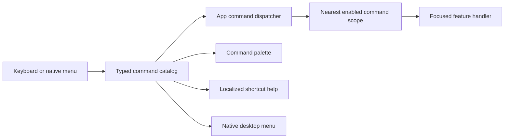

# Desktop Keyboard Power-User Audit

**Date:** 2026-07-15
**Scope:** desktop keyboard command system delivered by PR #3468
**Method:** implementation-backed review through four expert lenses

This is a structured Codex self-review of the implemented behavior, source,
documentation, and automated tests. It is not an independent human usability
study. The desktop power-user lens is weighted most heavily because efficient,
predictable keyboard operation is the product objective.

## Result

| Review lens | Weight | Score | Implementation evidence |
| --- | ---: | ---: | --- |
| Desktop power user | 40% | **9.2/10** | Primary+K palette; F1/Primary+? help; Primary+1…8 navigation; contextual create, save, refresh, edit, rename, delete, zoom, pane, tree, and confirmation commands; rendered-order traversal; wrapping arrows; Home/End; selected-row visibility; shortcut-notation search; native menus sharing the same catalog |
| Keyboard-only and accessibility | 25% | **9.3/10** | F6/Shift+F6 region cycling; focus ownership and restoration; text-entry safety; Enter/Space/Escape interaction grammar; accessible resize and confirmation controls; localized semantic labels; help rows remain readable without pretending to be actions |
| Localization and platform behavior | 15% | **9.3/10** | Command labels, categories, help/search copy, and key terminology localized in English, Czech, German, Spanish, French, and Romanian; Primary resolves to Command on macOS and Control elsewhere; character shortcuts remain layout-aware; displayed shortcuts are searchable exactly as users see them |
| Architecture and reliability | 20% | **9.4/10** | Typed command IDs; one catalog for bindings, help, palette, and native menus; nearest-scope dispatch with availability; lifecycle-safe registration; async re-entry policy; conflict validation; platform adaptation; source-mirrored tests covering modified behavior |
| **Weighted result** | **100%** | **9.3/10** | Exceeds the 9/10 acceptance target, including the highest-weight power-user review |

## Why the power-user score clears 9

The system is fast to enter, predictable to traverse, and consistent across
contexts. A user can discover a command by localized name, category, or the
shortcut printed in the UI; move through the palette without losing the
selection off-screen; jump to either limit; invoke the currently selected
command; and use the same save command in task editors, definition settings,
and AI provider/model forms. Disabled commands are excluded from the active
palette and exposed through the same availability model used by dispatch.

The command catalog is also the source for native desktop menus and help. This
removes a common power-user failure mode where the menu advertises one binding,
help documents another, and a focused widget implements a third.

## Architecture fit

The hierarchy allows a focused editor to own Save or Cancel while preserving
global navigation and help commands. Feature code registers intent and
availability instead of duplicating platform-specific key maps. Palette,
menu, and direct-key invocation therefore converge on the same handler.

## Remaining v1 limits

These are deliberate scope limits rather than blockers for the current power-
user foundation:

- Bindings are fixed. User remapping, multi-stroke chords, and macros remain
  deferred by ADR 0030.
- Palette ranking follows stable visual/category order rather than frequency
  or fuzzy relevance scoring.
- Automated tests cover platform mapping and keyboard behavior, but manual
  usability checks with native macOS, Windows, and Linux keyboards—and with
  desktop screen readers—remain valuable follow-up validation.
- Not every local control gesture is promoted into the global command catalog;
  controls keep native/local keyboard semantics where a named command would add
  noise instead of leverage.

## Merge gates

The rating is valid only while all of these gates remain true on the final PR
head:

1. `fvm flutter analyze` reports zero warnings and infos.
2. Focused source-mirrored tests for every modified behavior pass locally.
3. The approximately 27,000-test full suite passes in CI's 10 standard shards,
   with the separate Glados lane and required integration checks.
4. Codecov reports exactly 100% patch coverage for executable changed lines.
5. Every actionable review thread is addressed and no unresolved thread remains.
