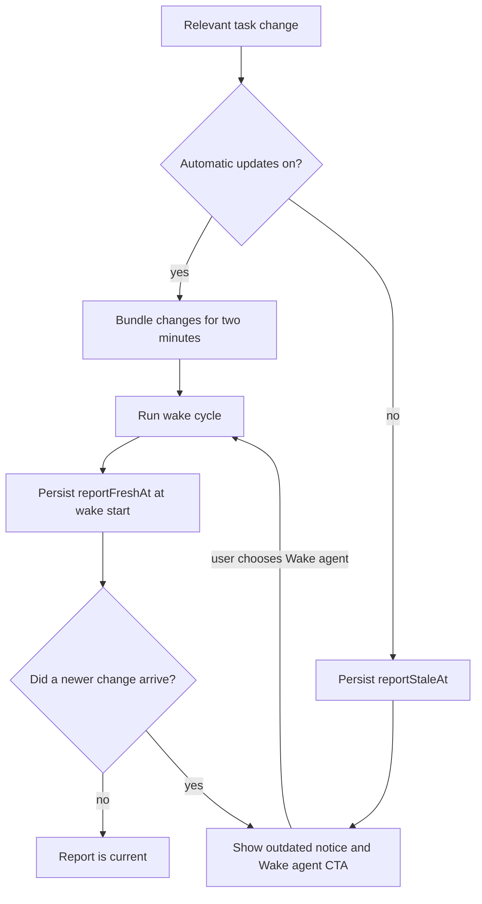

# Task-agent card expert panel review

Date: 2026-07-16

Scope: summary reading, model/setup identity, automatic wake, stale detection,
manual wake, disclosure, and proposals

## Method

The same four-person simulated panel reviewed baseline and final builds across
the same eight deterministic fixtures: scheduled and manual/stale states, dark
and light themes, and desktop and phone widths. The synthetic content, model,
provider, report, proposal history, timestamps, and viewport sizes remained
fixed between passes.

Scores are deliberately critical. A 9 means the interaction is coherent,
trustworthy, efficient, and visually refined across the complete matrix.

Baseline evidence:

- [Desktop scheduled, dark](https://raw.githubusercontent.com/matthiasn/lotti-docs/main/pr-screenshots/task-agent-card-auto-wake/before/desktop_scheduled_dark.png)
- [Desktop manual, light](https://raw.githubusercontent.com/matthiasn/lotti-docs/main/pr-screenshots/task-agent-card-auto-wake/before/desktop_manual_light.png)
- [Phone scheduled, light](https://raw.githubusercontent.com/matthiasn/lotti-docs/main/pr-screenshots/task-agent-card-auto-wake/before/pro_scheduled_light.png)
- [Phone manual, dark](https://raw.githubusercontent.com/matthiasn/lotti-docs/main/pr-screenshots/task-agent-card-auto-wake/before/pro_manual_dark.png)

Final evidence:

- [Desktop scheduled, dark](https://raw.githubusercontent.com/matthiasn/lotti-docs/main/pr-screenshots/task-agent-card-auto-wake/after/desktop_scheduled_dark.png)
- [Desktop manual, light](https://raw.githubusercontent.com/matthiasn/lotti-docs/main/pr-screenshots/task-agent-card-auto-wake/after/desktop_manual_light.png)
- [Phone scheduled, light](https://raw.githubusercontent.com/matthiasn/lotti-docs/main/pr-screenshots/task-agent-card-auto-wake/after/pro_scheduled_light.png)
- [Phone manual, dark](https://raw.githubusercontent.com/matthiasn/lotti-docs/main/pr-screenshots/task-agent-card-auto-wake/after/pro_manual_dark.png)

## Scorecard

| Reviewer | Baseline | First redesign | Final | Verdict |
| --- | ---: | ---: | ---: | --- |
| UX | 5.4 | 8.7 | 9.2 | The default, countdown, cancellation, stale state, and manual recovery now form one understandable control loop. |
| Information architecture | 5.0 | 8.8 | 9.3 | Report/proposals read as content; automation/setup read as controls; disclosure follows the content it owns. |
| Visual design | 6.1 | 8.0 | 8.8 | Nested surfaces are intentional and calm; the final focused stale accent replaces the overly loud full-card red perimeter. |
| Responsible-AI trust | 3.8 | 9.3 | 9.5 | Automatic inference is opt-in, observation remains active, and stale data is explicit without pretending a refresh occurred. |
| **Panel average** | **5.1** | **8.7** | **9.2** | **The same panel clears the requested 9/10 target.** |

## Baseline findings

- The automatic-update control was buried in the model/setup sheet even though
  it governed ongoing inference cost.
- Existing and missing values resolved to automatic wake, making repeated
  inference the path of least resistance.
- Turning automation off removed observation, so the UI could not distinguish
  a current report from an outdated one.
- Model identity, playback, wake, countdown, cancellation, and disclosure
  competed in one header row.
- **Read more** appeared above the report it controlled, weakening cause and
  effect.
- Desktop and phone used space differently without a stable content/control
  hierarchy.

## Iteration findings

The first redesign promoted automation, added stale watermarks and the manual
wake CTA, moved disclosure below report content, and separated model setup from
automation. It cleared 8/10, but the panel rejected a red border around the
entire stale card as visually disproportionate.

The final pass retained only a narrow red stale accent and error title. On
desktop, report plus proposals became the reading column and automation plus
setup became the utility rail, eliminating the large dead zone created by a
full-width proposal footer. Phone layout kept the same hierarchy in a linear
stack.

## Runtime trust contract

This contract prevents an older inference result from erasing a task edit that
arrived while the model was still running. Freshness watermarks also merge by
their latest timestamps across devices.

## Repeatable review cycle

1. Capture scheduled and manual/stale states from the committed harness.
2. Use the same content at desktop and phone widths in dark and light themes.
3. Score UX, IA, visual design, and responsible-AI trust independently.
4. Treat hidden inference, ambiguous freshness, empty disclosures, or a score
   below 8 as a release blocker.
5. Keep the manual screenshots tied to the same fixtures used for panel review.
