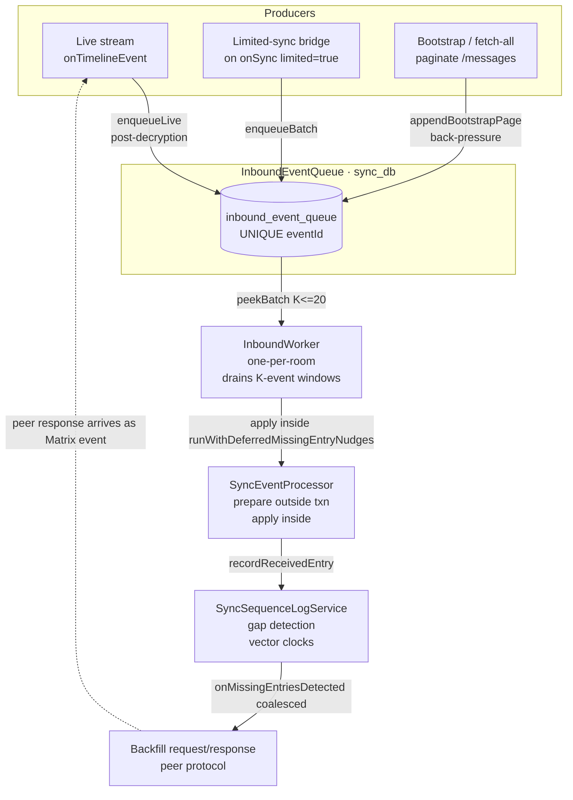

# Inbound Event Queue — 100% Implementation Plan (v2, post-review)

**Date:** 2026-04-20
**Supersedes Phase 1 plan of:** [`2026-04-20_inbound_event_queue_design.md`](./2026-04-20_inbound_event_queue_design.md)
**Motivated by:** [`2026-04-20_inbound_event_queue_design_review.md`](./2026-04-20_inbound_event_queue_design_review.md)
**Status:** Implementation-ready — every concern from the review is resolved with a concrete code change, not a deferred "measurement".

## 0. What changed from the v1 design

The v1 design is structurally correct: three producers → one durable queue
→ one worker → unchanged apply + completeness layers. This plan keeps
that shape. It changes how the queue, worker, and producers are wired
to close the four correctness gaps and five observability/rollback
gaps the review surfaced.

**Fixes folded in, reference → review §:**

| # | Fix | Review ref |
| --- | --- | --- |
| F1 | Worker drains in batched `runWithDeferredMissingEntryNudges` windows, not per-event. | §3.1 |
| F2 | `commitApplied` goes through `shouldAdvanceMarker` before touching the read marker. | §3.2 |
| F3 | E2EE events enqueue only after decryption settles; worker resolves via `room.getEventById` with `Event.fromJson` fallback. | §3.3 |
| F4 | Producers apply `MatrixEventClassifier.isSyncPayloadEvent` at enqueue. | §3.4 |
| F5 | `lastReadMatrixEventTs` moves to `sync_db` so commit + marker-advance is one real transaction. | §3.5 |
| F6 | Stranded-entry sweep runs once per session on room mismatch. | §3.6 |
| F7 | Flag flip from on→off drains the queue first or refuses with a user explanation. | §3.7 |
| F8 | Logging plan spells out enqueue/peek/apply/commit per event ID before Phase 1 lands. | §3.8 |
| F9 | Phase 0 adds apply-throughput, Drift emission rate, `prevBatch` per limited sync, mobile-wake capture. | §3.10 |

Plus the missing considerations:
- M1 Worker honours `UserActivityGate` at the drain boundary (review §4.1).
- M2 Bootstrap + bridge interleaving defined (review §4.2).
- M3 Durable retry semantics documented (review §4.3).
- M4 UI depth signal is a stream, not a pull (review §4.4).
- M5 Test migration is planned, not discovered (review §4.5).
- M6 `useInboundEventQueue` flag plumbing specified across the 3 read
  points (review §4.6).

## 1. High-level architecture (unchanged from v1)



## 2. Storage schema (F5 revision)

```sql
-- sync_db migration v12 → v13
CREATE TABLE inbound_event_queue (
  queue_id      INTEGER PRIMARY KEY AUTOINCREMENT,
  event_id      TEXT    NOT NULL UNIQUE,
  room_id       TEXT    NOT NULL,
  origin_ts     INTEGER NOT NULL,
  producer      TEXT    NOT NULL CHECK (producer IN (
                  'live','bridge','bootstrap','backfill')),
  raw_json      TEXT    NOT NULL,
  enqueued_at   INTEGER NOT NULL,
  attempts      INTEGER NOT NULL DEFAULT 0,
  next_due_at   INTEGER NOT NULL DEFAULT 0,
  lease_until   INTEGER NOT NULL DEFAULT 0       -- process-local lease, survives crash via TTL
);

CREATE INDEX idx_queue_ready ON inbound_event_queue
  (next_due_at, origin_ts, queue_id);
CREATE INDEX idx_queue_room  ON inbound_event_queue
  (room_id, origin_ts);

-- F5: marker lives in sync_db so commitApplied is atomic.
CREATE TABLE queue_markers (
  room_id                       TEXT PRIMARY KEY,
  last_applied_event_id         TEXT,
  last_applied_ts               INTEGER NOT NULL DEFAULT 0,
  last_applied_commit_seq       INTEGER NOT NULL DEFAULT 0
);
```

Migration notes:
- Version bumps to 13 (v12 reserved for the F5-standalone case where we
  pre-seed `queue_markers` from current `settingsDb.lastReadMatrixEventTs`).
- On upgrade, the old `lastReadMatrixEventTs` / `lastReadMatrixEventId`
  in `settingsDb` is copied into `queue_markers` for the current
  `currentRoomId` once, then treated as legacy (written to but no
  longer read).
- `lease_until` is a durable lease: peek stamps it to `now +
  leaseDuration`; only entries with `lease_until <= now` are peekable.
  Survives crash (TTL clears it). Replaces v1's "in-memory lease".

## 3. Public API (post-review)

```dart
enum InboundEventProducer { live, bridge, bootstrap, backfill }

class InboundEventQueue {
  /// F4: silently drops non-payload events.
  /// F3: expects the event to be fully decrypted. Returns notReady
  /// when the event's content is still m.room.encrypted.
  Future<EnqueueResult> enqueueLive(Event event);

  Future<EnqueueResult> enqueueBatch(
    List<Event> events, {
    required InboundEventProducer producer,
  });

  /// Returns false if the queue is over [BootstrapBackPressure.highWater];
  /// sink awaits [waitForDrainAtMostTo] before the next call.
  Future<bool> appendBootstrapPage(List<Event> events);

  Future<void> waitForDrainAtMostTo(int depth);

  /// F1: returns up to [maxBatch] entries ready now (origin_ts asc,
  /// queue_id asc), stamping leases atomically so concurrent workers
  /// (if any) cannot double-deliver.
  Future<List<InboundQueueEntry>> peekBatchReady({int maxBatch = 20});

  /// F2 + F5: checks shouldAdvanceMarker before advancing the marker;
  /// DELETE + conditional UPDATE queue_markers in one sync_db txn.
  Future<void> commitApplied(InboundQueueEntry entry);

  /// No marker touch; schedules retry with exponential backoff.
  Future<void> scheduleRetry(
    InboundQueueEntry entry,
    Duration backoff, {
    required RetryReason reason,
  });

  /// F6: stranded sweep — delete entries whose room_id does not match
  /// currentRoomId at the time of call. Caller: session bootstrap.
  Future<int> pruneStrandedEntries(String currentRoomId);

  Stream<QueueDepthSignal> get depthChanges;   // M4

  Future<QueueStats> stats();
}

class EnqueueResult {
  final int accepted;
  final int duplicatesDropped;
  final int filteredOutByType;   // F4
  final int deferredPendingDecryption;  // F3
  final int oldestTsAccepted;
  final int newestTsAccepted;
}

class InboundQueueEntry {
  final int queueId;
  final String eventId;
  final String roomId;
  final num originTs;
  final InboundEventProducer producer;
  final int attempts;
  final int leaseUntil;
  final String rawJson;  // materialise to Event at worker time
}

class QueueDepthSignal {
  final int total;
  final Map<InboundEventProducer, int> byProducer;
  final int oldestEnqueuedAt;
}

enum RetryReason { missingBase, retriable, decryptionPending }
```

## 4. Worker contract (F1 + F2 + M1)

```
InboundWorker._drainLoop:
repeat:
  await activityGate.waitIfActive()            # M1

  batch := await queue.peekBatchReady(maxBatch: processOrderedChunkSize)
  if batch.isEmpty:
    await Future.any([
      queue.depthChanges.first,
      idleTick(5s),
    ])
    continue

  try:
    await sequenceLogService.runWithDeferredMissingEntries(() async {
      for entry in batch:
        outcome := await applyOne(entry)
        switch outcome:
          applied:
            await queue.commitApplied(entry)   # F2+F5 atomic in sync_db
          retriable:
            await queue.scheduleRetry(entry, backoff(entry.attempts),
                                      reason: RetryReason.retriable)
          missingBase:
            await queue.scheduleRetry(entry, shortBackoff(),
                                      reason: RetryReason.missingBase)
          decryptionPending:
            # F3: happens when a queue entry's raw_json still shows
            # m.room.encrypted (e.g. pre-bootstrap pulls of historical
            # ciphertext where key hasn't propagated yet).
            await queue.scheduleRetry(entry, decryptBackoff(entry.attempts),
                                      reason: RetryReason.decryptionPending)
          permanentSkip:
            await queue.markSkipped(entry)     # logs, removes
    })
    # Wrapper closes here → nudges coalesce into one call.  # F1
  catch unexpected:
    # Any entry without an individual outcome: escalate as retriable.
    ...
```

Concurrency primitives:
- One `_workerLoop` future per room.
- `processOrderedChunkSize = 20` reused from `SyncTuning:143` —
  preserves today's apply-batch granularity and Drift stream
  coalescing benefit (§10.2's "needs measurement" concern resolved
  by matching today's chunk size).
- Producer inserts do not block the worker (separate txns).

## 5. Producers (F3 + F4)

### 5.1 Live producer

```dart
sessionManager.timelineEvents.listen((event) {
  if (event.roomId != roomManager.currentRoomId) return;

  // F4: event-type filter
  if (!MatrixEventClassifier.isSyncPayloadEvent(event)) return;

  // F3: encrypted and not yet decrypted -> defer.
  if (event.type == EventTypes.Encrypted) {
    _pendingDecryption.hold(event);
    return;
  }

  unawaited(queue.enqueueLive(event));
});

// Separate listener for decryption-complete re-fire. The SDK replaces
// the encrypted event object with the decrypted one; the stream emits
// a second time with EventUpdateType.timeline.
// Implementation detail: listen on onEvent with type filter, or
// poll _pendingDecryption.flushDecryptedInto(queue) on a lightweight
// timer. Spec: latency budget 500ms from decryption to enqueue.
```

`_pendingDecryption` is a small in-memory holding pen (bounded 256,
LRU evict) that catches the pre-decryption fire. Not durable because
(a) the SDK persists the ciphertext and will re-fire on restart, and
(b) durability here would require the very raw-json-of-ciphertext
round-trip F3 is avoiding.

### 5.2 Bridge producer

```dart
sessionManager.client.onSync.listen((sync) async {
  final joined = sync.rooms?.join?[roomManager.currentRoomId];
  if (joined?.timeline?.limited != true) return;
  await bridgeCoordinator.bridgeFromMarker(sync.nextBatch);   // single-flight
});
```

`BridgeCoordinator.bridgeFromMarker` uses
`CatchUpStrategy.collectEventsForCatchUp`, filters via
`isSyncPayloadEvent` before `enqueueBatch`. The `prevBatch` returned
by the limited sync is logged (Phase-0 diagnostic F9 carries forward).

### 5.3 Bootstrap producer

```dart
final sink = _QueueBootstrapSink(
  queue: queue,
  cancelSignal: cancelCompleter,
  highWater: BootstrapBackPressure.highWater,   // 1000
  backPressureTimeout: const Duration(seconds: 30),  // M2: UI gets signal if apply stalls
);
await CatchUpStrategy.collectHistoryForBootstrap(
  room: room, sink: sink, logging: logging);
```

Sink filters via `isSyncPayloadEvent`, appends via
`queue.appendBootstrapPage`, awaits `queue.waitForDrainAtMostTo(1000)`
between pages.

### 5.4 Backfill response: no new producer

Peer-backfill responses arrive on `onTimelineEvent` as ordinary Matrix
events; the live producer path handles them. Sequence-log recognises
them in `apply`.

## 6. Logging plan (F8 — specified in advance)

Every event ID gets a greppable triple (plus retries on failure):

```
sync  queue.enqueue eventId=$abc… producer=live    roomId=… ts=… dupe=false
sync  queue.peek    eventId=$abc… batch=3/20       attempt=0
sync  processor.apply eventId=$abc… outcome=applied ms=42
sync  queue.commit  eventId=$abc… markerAdvanced=true
```

Retries:
```
sync  queue.retry   eventId=$abc… reason=missingBase attempts=2 nextDue=…
```

Log domain: `sync`, subDomain: `queue.*` / `processor.apply`. Volume
target: within ±10% of post-#2982 levels on a healthy session.
Verified pre-Phase-1 by dry-run against a replay of
`logs/sync-2026-04-20.log`.

## 7. Feature flag (M6)

`useInboundEventQueue` stored in `settingsDb`, default `false`.

Read sites (exactly three, specified up front):
1. `MatrixService.init` (`lib/features/sync/matrix/matrix_service.dart`)
   — decides whether to construct `InboundWorker` + `BridgeCoordinator`
   or the legacy `MatrixStreamLiveScanController`/signal-binder wiring.
2. `backfill_settings_page.dart` — decides whether to show the
   three-action UI (§11 of v1) or today's refresh button.
3. `MatrixStreamConsumer` (`matrix_stream_consumer.dart`) — no-ops
   its live-scan scheduling when flag is on.

Read timing: synchronous `settingsDb.itemByKey('useInboundEventQueue')`
during init, cached on the `MatrixService` instance. Flag flip
requires `MatrixService.restart()` (not live-toggle) — documented in
settings UI. This avoids the F7 drain-before-disable race, because
restart naturally drains in the "on" mode before teardown.

## 8. Phase-by-phase plan

### Phase 0 — Diagnostic PR (expanded per F9 + M5 prep)

**Goal:** verify the load-bearing behavioural assumptions **and**
baseline the metrics we'll compare Phase 2 against.

Changes:
- `matrix_stream_signals.dart` — hook `client.onSync.listen` to log
  `sync.limited room=… prevBatch=… storedMarkerTs=… gapMs=…` on
  every limited sync (F9).
- `matrix_stream_processor.dart` — add a 1-line summary per-100
  `onTimelineEvent` of observed cross-sync interleaving.
- New `SyncMetricsSnapshot` under `pipeline/sync_metrics.dart`
  exposing `events/sec during live`, `events/sec during catch-up`,
  `events/sec during bootstrap`, plus per-minute counts of
  `_emitMissingEntriesDetected` calls (the baseline F1 will need to
  match).
- New `DriftStreamEmissionCounter` under `database/common.dart`
  sampling `journal` / `sync_sequence_log` watcher emission counts
  per minute.

Capture plan:
- 48h desktop (tester A).
- 48h mobile with **at least two confirmed OS-level background-wake
  cycles** (tester B must tab away ≥ 10 min twice during capture).
- Ship diagnostic as an additive PR; merge to main; collect logs;
  rollback trivial.

Exit criteria for Phase 1:
- `limited=true` observed frequency documented (order-of-magnitude).
- `onTimelineEvent` cross-sync reordering observed frequency
  documented.
- Apply rate baseline recorded: p50 + p95 events/sec in each regime.
- Drift emission count baseline recorded (events/sec).
- `_emitMissingEntriesDetected` rate baseline recorded.

### Phase 1 — Queue + worker, flag default off, not yet switched

**Scope:** 9 files, ~1,200 LOC net add (queue ~300, worker ~250,
bridge coordinator ~100, bootstrap streaming ~200, migration + markers
~120, filter + decryption holding pen ~80, tests ~150 of the 750
total tests add).

Files added:
- `lib/features/sync/queue/inbound_event_queue.dart` — Drift-backed
  queue implementation.
- `lib/features/sync/queue/inbound_worker.dart` — drain loop with F1
  window.
- `lib/features/sync/queue/bridge_coordinator.dart` — onSync listener,
  single-flight.
- `lib/features/sync/queue/pending_decryption_pen.dart` — F3
  decryption gate.
- `lib/features/sync/queue/bootstrap_sink.dart` — sink + back-pressure.

Files edited:
- `lib/database/sync_db.dart` — migration to v13 + schema for
  `inbound_event_queue` + `queue_markers`.
- `lib/features/sync/matrix/pipeline/catch_up_strategy.dart` — add
  `collectHistoryForBootstrap` (additive).
- `lib/features/sync/tuning.dart` — add
  `inboundWorkerBatchSize = processOrderedChunkSize` (re-export).
- `lib/features/sync/matrix/matrix_service.dart` — read flag, but
  wire nothing yet (placeholder; see Phase 2).

Tests added (see §10 for the migration view of existing tests):
- `inbound_event_queue_test.dart` — enqueue/dedup/peek-batch/
  commit+marker-advance/retry/stranded-prune/schema-migration.
  **F2 test:** assert marker does not regress on an older-ts apply.
  **F3 test:** encrypted event rejected with deferredPendingDecryption.
  **F4 test:** state event + redaction filtered at boundary.
  **F5 test:** commitApplied is atomic across delete + marker update
  (crash in the middle leaves consistent state).
  **F6 test:** `pruneStrandedEntries` deletes cross-room rows.
- `inbound_worker_test.dart` — F1 test: 5 gaps in a 20-event window
  emit one `_emitMissingEntriesDetected`; not five.
- `bridge_coordinator_test.dart` — concurrent limited syncs coalesce;
  in-flight bridge defers the next.
- `collect_history_for_bootstrap_test.dart` — back-pressure stalls
  then resumes.
- `pending_decryption_pen_test.dart` — decryption re-fire re-enqueues
  the same eventId exactly once.

Exit criteria:
- All new tests pass.
- No existing test touched.
- Analyzer zero warnings.
- Coverage on new files ≥ 95%.

### Phase 2 — Switch producers behind flag-on, parallel-run

**Scope:** ~300 LOC touched across `matrix_service.dart`,
`matrix_stream_consumer.dart`, `backfill_settings_page.dart`.

Wiring:
- Flag-on path: construct `InboundWorker` + `BridgeCoordinator` +
  `InboundEventQueue`, subscribe live stream to `enqueueLive`,
  disable `MatrixStreamLiveScanController.scheduleLiveScan`.
- Flag-off path: unchanged.

Back-pressure UI (M4):
- New widget reads `queue.depthChanges` stream, shows depth +
  per-producer breakdown + oldest enqueued.

Drain-before-disable (F7):
- Flag change path in Settings shows "Change requires app restart.
  Pending queue: N items — will be drained on disable".
- On disable, `MatrixService.restart` explicitly runs the worker to
  drain before reconstructing.
- If drain exceeds 30s, continue in background with a notification.

Parallel metric emission:
- The `SyncMetricsSnapshot` from Phase 0 stays live. Both old and
  new paths emit, attribute by source. Logs tagged
  `pipeline=legacy` / `pipeline=queue`.

Dogfood plan:
- One release with flag default off, opt-in via Sync Settings.
- Internal tester quorum (3 desktop + 2 mobile) with flag on for
  ≥ 7 days.
- Compare: apply-throughput p95, Drift emission rate, log volume,
  `_emitMissingEntriesDetected` call rate, backfill-request count
  per hour. All within ±15% of Phase 0 baseline.

Exit criteria (go/no-go gate for Phase 3):
- All five metrics above inside ±15% band.
- Zero new error classes in captured logs.
- No user report of stuck scan / missed events.
- Bootstrap flow tested end-to-end on fresh install + lost-phone
  simulation (explicit, not assumed).

### Phase 3 — Delete legacy paths

**Scope:** ~1,100 LOC removed, 7 test files migrated/deleted.

Code deletions (corrected per review §3.9):
- `matrix_stream_live_scan.dart` — the whole file.
- `matrix_stream_helpers.dart::buildLiveScanSlice` — function.
- `MatrixStreamSignalBinder` wiring in `matrix_stream_signals.dart`
  reduced to a bare live-stream subscription for the legacy path;
  entire file removed if flag-off is also removed.
- `_seenEventIds`, `_completedSyncIds`, `_inFlightSyncIds`,
  `_scanInFlight`, `_scanInFlightDepth`, `_scanEpoch`, `_scanStartedAt`,
  `_liveScanDeferred`, `_liveScanTimer`, `_forceRescanCompleter`,
  `_deferredCatchup` (the latter 5 live in
  `matrix_stream_catch_up.dart` + `matrix_stream_live_scan.dart`,
  not processor — see §3.9 of review).
- `CatchUpCollection.incomplete` / `.complete` variants — queue
  removes the distinction; sequence-log decides completeness.
- Best-effort fallback at `catch_up_strategy.dart:246–261` — deleted.

Feature flag removed from all 3 read sites.

Test migration plan (M5 — this is the hidden cost):

| Test file | Current count | Action | Replaces with |
| --- | --- | --- | --- |
| `matrix_stream_live_scan_test.dart` | 11+ | Delete | Covered by `inbound_worker_test.dart` + bridge test |
| `matrix_stream_helpers_test.dart` (buildLiveScanSlice) | 4 | Delete | N/A — feature gone |
| `matrix_stream_signals_test.dart` | 6 | Delete flag-off tests | Convert to live-producer tests |
| `matrix_stream_consumer_signal_live_scan_test.dart` | N | Delete | N/A — feature gone |
| `matrix_stream_catch_up_test.dart` | N | Partial delete | Keep the `collectEventsForCatchUp` bridge-side tests; delete no-anchor branch tests |
| `matrix_stream_processor_test.dart` | 22+ `processOrdered` call sites | Keep | `processOrdered` stays, reshaped; tests migrate to exercise via queue drain |
| `matrix_stream_consumer_test.dart` | N | Rewrite | Exercises `InboundWorker` wiring now |

Schema: the `inbound_event_queue` table and `queue_markers` stay.
Future dumping reserved for a v14 cleanup migration if ever
warranted.

Exit criteria:
- Full suite green.
- Coverage not regressed on journal/sync-feature scope.
- Analyzer zero warnings.
- At least two fresh installs + two upgrade installs verified end
  to end.

## 9. Risk register (post-review)

| # | Risk | Phase that surfaces | Mitigation already in plan |
| --- | --- | --- | --- |
| R1 | Decryption re-fire doesn't catch all encrypted events (SDK edge case). | Phase 1 | `_pendingDecryption` TTL + periodic sweep re-checks `room.getEventById`. |
| R2 | Apply-throughput regresses under single-txn per event. | Phase 2 gate | `inboundWorkerBatchSize=20` preserves chunk; Phase 0 baseline compared. |
| R3 | Stranded rows after account switch accumulate unbounded. | Phase 1 | F6 sweep, scheduled on session start and on `roomManager.currentRoomId` change. |
| R4 | Cross-DB crash between apply and marker leaves re-apply path longer than today. | Phase 1 | F5 collapses to one sync_db txn; idempotent apply unchanged so worst case is a re-apply, not a missed event. |
| R5 | Durable retry tracker survives restart and re-wedges. | Phase 1 + 2 | Durable `attempts` column + cap `attempts<=10`, then `permanentSkip`. |
| R6 | Back-pressure UI confuses users during bootstrap. | Phase 2 | M4 widget design reviewed with UX before Phase 2 ship. |
| R7 | Flag toggle off with non-empty queue on mobile (low power). | Phase 2 | F7 drain-with-notification; 30s budget, else continues in background. |

## 10. What this plan does NOT do

- Does not change `SyncEventProcessor.prepare/apply`.
- Does not change `SyncSequenceLogService`'s gap detection or vector
  clock algebra.
- Does not change the Matrix wire protocol or the `SyncMessage`
  envelope format.
- Does not remove `CatchUpStrategy`; narrows it per review §8.1.
- Does not ship the "Fetch all history" UI in Phase 1 — that's
  Phase 2's M4 pairing.

## 11. Acceptance criteria (the 100%)

An implementation is "done" when all of these hold:

1. Phase 0 diagnostic PR merged; 48h desktop + 48h mobile-with-wake
   data captured; baselines published to this doc as an appendix.
2. Phase 1 PR merged behind `useInboundEventQueue=false`; every F1–F9
   test listed in §8 Phase 1 passes; analyzer clean; new-file
   coverage ≥ 95%.
3. Phase 2 PR merged; parallel metrics within ±15% of baseline for
   ≥ 7 days on internal testers; bootstrap flow exercised on fresh
   install + lost-phone simulation.
4. Phase 3 PR merged; legacy code + tests deleted per §8 table;
   flag removed; full suite green.
5. Every concern in the review (§3.1–§3.10, §4.1–§4.6) has a
   corresponding code change or test in phases 0–3 — no "deferred
   to Phase N+1" entries remain.
6. Feature READMEs updated (`lib/features/sync/README.md`, per
   AGENTS.md) — architecture-first, Mermaid diagram of the queue
   lifecycle included.

When (1)–(6) hold, the refactor is done and the review's verdict —
"90% draft, ship after the remaining 10%" — is discharged.
