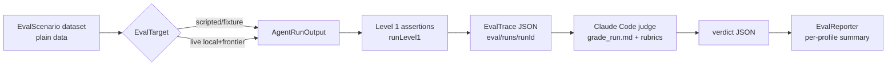

# Agent Evaluation Harness

A custom, data-driven eval framework for Lotti's **task agent**
(`TaskAgentWorkflow`) and **planning agent** (`DayAgentWorkflow`). Design and
rationale: [ADR 0029](../docs/adr/0029-agent-evaluation-harness.md) and the
[implementation plan](../docs/implementation_plans/2026-06-09_agent_evaluation_harness.md).

It follows Hamel Husain's tiered methodology:

| Level | What | Cost | When |
|---|---|---|---|
| 1 | Deterministic assertions on agent output | free, fast | every change (CI) |
| 2 | Real local + frontier models, Claude Code as judge | tokens + time | periodic, manual |
| 3 | Online A/B | — | future |

## Layout

```
eval/
  README.md            ← you are here
  prompts/
    judge_system.md    ← judge persona + JSON output contract
    rubric_task_agent.md
    rubric_planning_agent.md
  grade_run.md         ← Claude Code runbook: trace dir -> verdicts
  run_level2.sh        ← mode-based orchestration (run/grade/verify/report)
  runs/                ← git-ignored artifacts: <runId>/<scenario>__<profile>.*

test/eval/harness/     ← Dart support library (models, assertions, target, IO)
test/eval/scenarios/   ← shared scenario catalog + Level 1/report tests
```

## The flow



## Level 1 — every change

`runLevel1(scenario, output)` returns deterministic `EvalCheck`s (succeeded, no
hallucinated task refs, within capacity, valid status transitions, estimate
range, label cap, no duplicate checklist items, …). The example tests under
`test/eval/scenarios/` show both a passing output and a regression-catching one:

```
fvm flutter test test/eval/scenarios
```

These run with no keys, no network, deterministic time.

## Level 2 — periodic

```
LOTTI_EVAL_LIVE=1 GEMINI_API_KEY=... OLLAMA_BASE_URL=http://localhost:11434 \
  eval/run_level2.sh run <runId>
eval/run_level2.sh grade <runId>
eval/run_level2.sh report <runId>
```

Omit `<runId>` for `grade`, `verify`, or `report` to use the latest
timestamp-named directory under `eval/runs/`.

1. `run` executes each scenario against each profile/model class, writing one
   trace per `(scenario, profile, trialIndex)` to `eval/runs/<runId>/`. The
   live entrypoint is scaffolded but still awaits `LiveEvalTarget`.
2. Grade with Claude Code: `claude -p "Follow eval/grade_run.md to grade eval/runs/<runId>"`.
3. `report` first verifies exact scenario × profile × trial coverage, rejects
   embedded/orphan/stale verdicts, recomputes Level 1 checks, validates the
   judge score/pass contract, then prints the per-profile summary. It never
   regenerates traces.

The judge scores **goal attainment**, **quality/accuracy**, and **efficiency**
(token burn + unnecessary steps), separately per profile, so a plan that is great
on a frontier model but blows the local token budget shows up as a *local*
failure.

## Adding a scenario

Add a plain-data `EvalScenario` (mocked tasks/deadlines + a user transcript +
optional hard expectations) under `test/eval/scenarios/`. No codegen. The same
scenario feeds Level 1 and Level 2 so they never drift. Scenarios may be drafted
by an LLM, but must be human-reviewed before commit.

For scripted Level 1 workflow runs, keep the golden `ScriptedAgentBehavior`
outside the scenario in a side map keyed by `scenario.id` (or by
`scenario.id` + `profile.name` via `ScriptedEvalTarget.fromProfileMap({...})`).
That keeps `EvalScenario` JSON-serializable and keeps the pure harness barrel
free of bench/mock imports.

> Level 2 executes the real workflows, which need the Flutter test binding, so
> the live runner is a tagged `flutter test` entrypoint — not a plain
> `dart run` script. See ADR 0029 for why.
