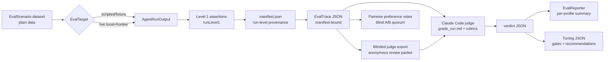

# Agent Evaluation Harness

A custom, data-driven eval framework for Lotti's **task agent**
(`TaskAgentWorkflow`) and **planning agent** (`DayAgentWorkflow`). Design and
rationale: [ADR 0029](../docs/adr/0029-agent-evaluation-harness.md) and the
[implementation plan](../docs/implementation_plans/2026-06-09_agent_evaluation_harness.md).

It follows Hamel Husain's tiered methodology:

| Level | What | Cost | When |
|---|---|---|---|
| 1 | Deterministic assertions on agent output | free, fast | every change (CI) |
| 2 | Real local + frontier models, Claude Code as judge | tokens + time | periodic, manual |
| 3 | Online A/B | — | future |

## Layout

```
eval/
  README.md            ← you are here
  prompts/
    judge_system.md    ← judge persona + JSON output contract
    rubric_task_agent.md
    rubric_planning_agent.md
  calibration/
    README.md          ← non-secret human-label schema for judge calibration
  grade_run.md         ← Claude Code runbook: trace dir -> verdicts
  run_level2.sh        ← mode-based orchestration (run/blind/import/report/tune)
  runs/                ← git-ignored artifacts: <runId>/manifest.json + traces/verdicts

test/eval/harness/     ← Dart support library (models, assertions, matrix runner, target, IO)
test/eval/scenarios/   ← shared scenario catalog + Level 1/report tests
```

## The flow



## Level 1 — every change

`runLevel1(scenario, output)` returns deterministic `EvalCheck`s (succeeded, no
hallucinated task refs, known raw tool names, known durable proposal item names,
no unexpected production tool-result errors, scenario-authored raw tool-call
argument oracles, within capacity, valid status transitions, estimate range,
label cap, persisted label proposal validity, no duplicate checklist items,
…). Scenarios can define `requiredToolCalls` / `forbiddenToolCalls` inside
`EvalExpectations` to hard-check model-facing tool attempts and args before
durable persistence, for example a relative due date resolving to
`update_task_due_date { dueDate: "2026-06-11" }` or a batched
`assign_task_labels.labels[]` entry. Raw tool-call matchers use recursive JSON
containment with distinct list-item matching, so batch order and harmless extra
fields do not make scenarios brittle. Scenarios can also define an
`ExpectedDurableState` oracle, matching required/forbidden persisted proposals
by tool, target, status, parent `changeSetStatus`, optional `changeSetId`,
arguments, and summary text; planned blocks; parsed capture items; report text;
observations; allowed or forbidden mutated entry IDs; required mutations;
accepted `anyOf` alternatives; scoped min/max/exact count checks; and
parsed-capture confidence bands.
Recovery stress scenarios can opt in to a bounded set of named failed tool
results through `allowedFailedToolNames` plus `maxAllowedToolResultFailures`;
the default remains zero failures. Required raw calls and durable
proposal/block/item matchers consume distinct actual records, so one actual
record cannot satisfy two expected outcomes. Scoped counts are aggregate checks
over matching durable records, which lets scenarios count only pending
proposals instead of being distorted by retired proposal history. That keeps
model intent and final-state success code-graded while still allowing multiple
valid plans or proposal summaries. `validateEvalScenarioCatalog` cross-checks
scenario and expectation references before Level 2 verification accepts a run.
The example tests under
`test/eval/scenarios/` show both a passing output and a
regression-catching one:

```
fvm flutter test test/eval/scenarios
```

These run with no keys, no network, deterministic time.

Trace output keeps `toolCalls` as model-attempt diagnostics, records persisted
`toolResults` so production validation failures remain visible, records
workflow `runKey`/`threadId` provenance in `workflowRun`, and grades durable
state separately: drafted `plannedBlocks`, reports/observations from persisted
message/report rows, token usage, persisted planner `parsedCaptureItems`,
`proposals` read from final persisted `ChangeSetEntity.items` with both parent
`changeSetStatus` and item `status`, filtering stale resolved/expired parent
rows whose embedded items still claim `pending` without a decision, and
`resolvedModel` provenance showing the profile/model/provider actually used.
`providerDecision` records the intended
profile slot, model class, selected model/provider rows, duplicate-native decoy
rows, legacy fallback rows, and environment-key presence booleans without
storing secret values. `modelInvocations` records each observed
`ConversationRepository.sendMessage` call with the selected provider/model,
tool names, forced tool choice when present, and prompt/tool hashes; it stores
no raw prompt text or API keys. Live traces also record `providerRequests` for
each internal provider request inside `sendMessage`, including continuation
requests after tool calls, with message/tool-schema hashes, structural counts,
provider/model ids, turn indexes, tool names, and forced tool choice.
`providerResponses` records the corresponding provider-stream metadata:
provider-reported model ids when the adapter has authoritative response
metadata, system fingerprints/provider names/service tiers when exposed, and an
explicit unavailable reason otherwise. Gemini native chunks are recorded as
response-model unavailable today because their normalized `model` field is
adapter-synthesized from the requested model rather than provider-returned
identity.
Failed target exceptions are serialized as failed traces, but the runner
redacts obvious API keys, bearer tokens, private local paths, and prompt-like
payload fields before writing `output.error`.
Every scenario also declares governance metadata: a primary capability id,
optional secondary capability ids, a split (`development`, `holdout`, or
`canary`), source, adversarial flag, tags, and optional digest-bound human
review metadata. Review metadata is intentionally non-secret: status, reviewer,
review time, rationale, optional source provenance, and a `subjectDigest` over
the scenario JSON with the review block omitted. `EvalTrace.schemaVersion` 11
includes a provenance block with canonical scenario/profile hashes, prompt
variant hash, eval prompt/rubric hash, tool-schema hash, code revision, and the
run manifest hash, plus optional `cascadeWake { cascadeId, wakeIndex,
wakeCount }`, model-invocation, provider-request, and provider-response records
for workflow-backed traces. Cascade wake traces preserve real `trialIndex`;
wake identity is separate metadata. Cascade sidecar run manifests also record
`traceTopologyEvidence`, a digest-bound declaration of the task-log cascade id
and per-scenario wake counts, so verify/report can build expected wake traces
from the manifest rather than inferring topology from observed files.
Real workflow benches also record runtime prompt/tool fingerprints as `sha256:`
digests in `output.runtimePrompt` without storing prompt text.
Planning scenarios may seed submitted captures, parsed capture items, existing
baseline blocks, and non-default capacity. The real planner workflow bench maps
those into production `CaptureEntity`, `ParsedItemEntity`, `DayPlanEntity`, and
`DayAgentConfig` state through the real planner services. Drafting wakes keep
the day token, while capture-only wakes preserve the production
`capture_submitted:<id>` trigger set and resolve the day from the submitted
capture. The bench records persisted parsed items and plan capacity so Level 1
can detect either a missed parse or a silent fallback to the production
480-minute default.
Task-agent scenarios may seed pre-existing `proposalSets` plus item-level
`proposalDecisions`, which the workflow bench maps to production
`ChangeSetEntity` and `ChangeDecisionEntity` rows. That lets Level 1 and Level 2
exercise cross-wake deduplication, consolidation, retired proposal rows, and
decision-driven rejected-history suppression where a later raw tool call should
not reopen a previously rejected suggestion, plus same-wake
retract-and-repropose churn where a still-valid open suggestion should remain
open. Resolved or expired parent rows with stale embedded pending items are
filtered from eval proposal output unless they have an item-level decision.
When a task scenario contains a
`decided_task:<id>` trigger token, the real workflow bench uses that task as the
active `AgentSlots.activeTaskId` instead of assuming the first fixture task is
the subject.
They may also seed category definitions, correction examples, task `labelIds`,
task `aiSuppressedLabelIds`, and scoped label definitions. The real task
workflow bench maps those into production `JournalDb` lookups, so available
label prompt context, correction-example context, and persisted label proposal
summaries are scenario-backed rather than raw scripted intent.

## Level 2 — periodic

Preview the exact matrix before spending model calls. `plan` validates the
loaded scenario/profile selectors, run-root safety, artifact collisions,
promotion-plan digests, and live provider/model bindings, but it does not
require `LOTTI_EVAL_LIVE=1` and does not write traces:

```
EVAL_SCENARIO_IDS=task_workflow_structured_update \
EVAL_PROFILE_NAMES=frontier-gemini \
LOTTI_EVAL_FRONTIER_PROVIDER=openAi \
LOTTI_EVAL_FRONTIER_MODEL=gpt-5-mini \
OPENAI_API_KEY=... \
  eval/run_level2.sh plan <runId>
```

The printed `previewManifestDigest` is a dry-run fingerprint, not a reservation.
The actual `run` command writes the authoritative manifest when it executes, so
rerun `plan` with the same env whenever selectors, catalogs, profile JSON,
provider overrides, prompt/rubric files, or git state change.

```
LOTTI_EVAL_LIVE=1 \
LOTTI_EVAL_LOCAL_MODEL=llama3.1:8b OLLAMA_BASE_URL=http://localhost:11434 \
LOTTI_EVAL_FRONTIER_PROVIDER=openAi LOTTI_EVAL_FRONTIER_MODEL=gpt-5-mini \
OPENAI_API_KEY=... \
  eval/run_level2.sh run <runId>
eval/run_level2.sh grade <runId>
eval/run_level2.sh report <runId>
eval/run_level2.sh tune <runId>
EVAL_CALIBRATION_TEMPLATE=/private/tmp/judge_gold_v1.template.json \
EVAL_CALIBRATION_TEMPLATE_MAX_ROWS=24 \
  eval/run_level2.sh template <runId>
EVAL_CALIBRATION=eval/calibration/judge_gold_v1.json \
  eval/run_level2.sh calibrate <runId>
EVAL_CALIBRATION=/private/tmp/judge_gold_v1.json \
  eval/run_level2.sh report <runId>
EVAL_PROMOTION_PLAN=/private/tmp/frontier_gemini_vs_fast.draft-plan.json \
  eval/run_level2.sh run <runId>
EVAL_PROMOTION_PLAN=/private/tmp/frontier_gemini_vs_fast.plan.json \
EVAL_CALIBRATION=/private/tmp/judge_gold_v1.json \
  eval/run_level2.sh report <runId>
EVAL_PROMOTION_PLAN=/private/tmp/frontier_gemini_vs_fast.plan.json \
EVAL_CALIBRATION=/private/tmp/judge_gold_v1.json \
EVAL_TUNING_REPORT=/private/tmp/lotti-tuning-report.json \
  eval/run_level2.sh tune <runId>
EVAL_TUNING_REPORTS=/private/tmp/lotti-tuning-a.json,/private/tmp/lotti-tuning-b.json \
EVAL_TUNING_PORTFOLIO_REPORT=/private/tmp/lotti-tuning-portfolio.json \
  eval/run_level2.sh compare-tuning
EVAL_TUNING_REPORTS=/private/tmp/lotti-tuning-a.json,/private/tmp/lotti-tuning-b.json \
EVAL_TUNING_EVIDENCE_INTAKE_PLAN=/private/tmp/lotti-evidence-intake.json \
  eval/run_level2.sh evidence-intake
EVAL_TUNING_REPORTS=/private/tmp/lotti-tuning-a.json,/private/tmp/lotti-tuning-b.json \
EVAL_USE_CASE_MATRIX_REPORT=/private/tmp/lotti-use-case-matrix.json \
  eval/run_level2.sh use-case-matrix
EVAL_USE_CASE_MATRIX_INPUT=/private/tmp/lotti-use-case-matrix.json \
EVAL_USE_CASE_EXPERIMENT_PLAN=/private/tmp/lotti-use-case-experiment-plan.json \
  eval/run_level2.sh experiment-plan
EVAL_USE_CASE_NEXT_RUN_WORK_ORDER_INPUT=/private/tmp/lotti-use-case-experiment-plan.json \
EVAL_USE_CASE_NEXT_RUN_WORK_ORDER=/private/tmp/lotti-use-case-next-run-work-order.json \
  eval/run_level2.sh next-run-work-order
EVAL_USE_CASE_RUN_WORK_ORDER=/private/tmp/lotti-use-case-next-run-work-order.json \
EVAL_USE_CASE_RUN_WORK_ORDER_BATCH_REFS=<work-order-batch-ref,...> \
EVAL_REQUIRED_CAPABILITIES=<public-capability-selector> \
EVAL_PROMPT_VARIANT_NAMES=<public-prompt-selector> \
  eval/run_level2.sh plan <follow-up-run-id>
EVAL_USE_CASE_RUN_WORK_ORDER=/private/tmp/lotti-use-case-next-run-work-order.json \
EVAL_USE_CASE_RUN_WORK_ORDER_BATCH_REFS=<work-order-batch-ref,...> \
EVAL_REQUIRED_CAPABILITIES=<public-capability-selector> \
EVAL_PROMPT_VARIANT_NAMES=<public-prompt-selector> \
LOTTI_EVAL_LIVE=1 \
  eval/run_level2.sh run <follow-up-run-id>
EVAL_USE_CASE_MODEL_CLASS_EXECUTION_WORK_ORDER=/private/tmp/lotti-use-case-next-run-work-order.json \
EVAL_USE_CASE_MODEL_CLASS_EXECUTION_EXPERIMENT_PLAN=/private/tmp/lotti-use-case-experiment-plan.json \
EVAL_USE_CASE_MODEL_CLASS_EXECUTION_RUNS=<follow-up-run-id,...> \
EVAL_USE_CASE_MODEL_CLASS_EXECUTION_EVIDENCE=/private/tmp/lotti-model-class-execution-evidence.json \
  eval/run_level2.sh model-class-evidence
EVAL_USE_CASE_MODEL_CLASS_COVERAGE_WORK_ORDER=/private/tmp/lotti-use-case-next-run-work-order.json \
EVAL_USE_CASE_MODEL_CLASS_EXECUTION_EXPERIMENT_PLAN=/private/tmp/lotti-use-case-experiment-plan.json \
EVAL_USE_CASE_MODEL_CLASS_EXECUTION_RUNS=<follow-up-run-id,...> \
EVAL_USE_CASE_MODEL_CLASS_EXECUTION_EVIDENCE=/private/tmp/lotti-model-class-execution-evidence.json \
EVAL_USE_CASE_MODEL_CLASS_COVERAGE=/private/tmp/lotti-model-class-execution-coverage.json \
  eval/run_level2.sh model-class-coverage
EVAL_USE_CASE_EXPERIMENT_PLAN_INPUT=/private/tmp/lotti-use-case-experiment-plan.json \
EVAL_TUNING_REPORTS=/private/tmp/lotti-followup-a.json,/private/tmp/lotti-followup-b.json \
EVAL_USE_CASE_MODEL_CLASS_COVERAGE=/private/tmp/lotti-model-class-execution-coverage.json \
EVAL_USE_CASE_MODEL_CLASS_COVERAGE_WORK_ORDER=/private/tmp/lotti-use-case-next-run-work-order.json \
EVAL_USE_CASE_CAMPAIGN_REPORT=/private/tmp/lotti-use-case-campaign.json \
  eval/run_level2.sh campaign
EVAL_ADVERSARIAL_REVIEW_SOURCE=/private/tmp/lotti-use-case-campaign.json \
EVAL_ADVERSARIAL_REVIEW_PACKET=/private/tmp/lotti-campaign-review-packet.json \
  eval/run_level2.sh review-packet
EVAL_ADVERSARIAL_REVIEW_SOURCE=/private/tmp/lotti-use-case-campaign.json \
EVAL_ADVERSARIAL_REVIEW_INPUT=/private/tmp/lotti-completed-campaign-review.json \
EVAL_ADVERSARIAL_REVIEW_ATTESTATIONS=/private/tmp/lotti-campaign-review-attestations.json \
  eval/run_level2.sh import-review
EVAL_USE_CASE_DECISION_MATRIX_INPUT=/private/tmp/lotti-refreshed-use-case-matrix.json \
EVAL_USE_CASE_DECISION_MATRIX_REPORTS=/private/tmp/lotti-followup-a.json,/private/tmp/lotti-followup-b.json \
EVAL_USE_CASE_DECISION_CAMPAIGN_INPUT=/private/tmp/lotti-use-case-campaign.json \
EVAL_USE_CASE_DECISION_CAMPAIGN_EXPERIMENT_PLAN_INPUT=/private/tmp/lotti-use-case-experiment-plan.json \
EVAL_USE_CASE_DECISION_CAMPAIGN_REPORTS=/private/tmp/lotti-followup-a.json,/private/tmp/lotti-followup-b.json \
EVAL_USE_CASE_DECISION_MODEL_CLASS_COVERAGE=/private/tmp/lotti-model-class-execution-coverage.json \
EVAL_USE_CASE_DECISION_MODEL_CLASS_COVERAGE_WORK_ORDER=/private/tmp/lotti-use-case-next-run-work-order.json \
EVAL_USE_CASE_DECISION_REVIEW_ATTESTATIONS=/private/tmp/lotti-campaign-review-attestations.json \
EVAL_USE_CASE_DECISION_LEDGER=/private/tmp/lotti-use-case-decision-ledger.json \
  eval/run_level2.sh decision-gate
EVAL_USE_CASE_DECISION_LEDGERS=/private/tmp/lotti-use-case-decision-ledger.json,/private/tmp/lotti-other-decision-ledger.json \
EVAL_USE_CASE_DECISION_LEDGER_SOURCE_MANIFESTS=/private/tmp/lotti-use-case-decision-ledger.sources.json,/private/tmp/lotti-other-decision-ledger.sources.json \
EVAL_USE_CASE_TUNING_ROADMAP=/private/tmp/lotti-use-case-roadmap.json \
  eval/run_level2.sh roadmap
EVAL_USE_CASE_RELEASE_ROADMAP_INPUT=/private/tmp/lotti-use-case-roadmap.json \
EVAL_USE_CASE_RELEASE_DECISION_LEDGERS=/private/tmp/lotti-use-case-decision-ledger.json \
EVAL_USE_CASE_DECISION_LEDGER_SOURCE_MANIFESTS=/private/tmp/lotti-use-case-decision-ledger.sources.json \
EVAL_USE_CASE_RELEASE_PLAN=/private/tmp/lotti-use-case-release-plan.json \
  eval/run_level2.sh release-plan
EVAL_USE_CASE_RELEASE_ROADMAP_INPUT=/private/tmp/lotti-use-case-roadmap.json \
EVAL_USE_CASE_RELEASE_DECISION_LEDGERS=/private/tmp/lotti-use-case-decision-ledger.json \
EVAL_USE_CASE_RELEASE_REVIEW_SOURCE=/private/tmp/lotti-use-case-release-plan.json \
EVAL_USE_CASE_RELEASE_REVIEW_PACKET=/private/tmp/lotti-release-review-packet.json \
  eval/run_level2.sh release-review-packet
EVAL_USE_CASE_RELEASE_ROADMAP_INPUT=/private/tmp/lotti-use-case-roadmap.json \
EVAL_USE_CASE_RELEASE_DECISION_LEDGERS=/private/tmp/lotti-use-case-decision-ledger.json \
EVAL_USE_CASE_RELEASE_REVIEW_SOURCE=/private/tmp/lotti-use-case-release-plan.json \
EVAL_USE_CASE_RELEASE_REVIEW_INPUT=/private/tmp/lotti-completed-release-review.json \
EVAL_USE_CASE_RELEASE_REVIEW_ATTESTATIONS=/private/tmp/lotti-release-review-attestations.json \
  eval/run_level2.sh import-release-review
EVAL_USE_CASE_RELEASE_GATE_PLAN_INPUT=/private/tmp/lotti-use-case-release-plan.json \
EVAL_USE_CASE_RELEASE_GATE_ROADMAP_INPUT=/private/tmp/lotti-use-case-roadmap.json \
EVAL_USE_CASE_RELEASE_GATE_DECISION_LEDGERS=/private/tmp/lotti-use-case-decision-ledger.json \
EVAL_USE_CASE_RELEASE_GATE_REVIEW_ATTESTATIONS=/private/tmp/lotti-release-review-attestations.json \
EVAL_USE_CASE_RELEASE_GATE=/private/tmp/lotti-release-gate.json \
  eval/run_level2.sh release-gate
EVAL_USE_CASE_RUNTIME_RESOLVER_RELEASE_PLAN=/private/tmp/lotti-use-case-release-plan.json \
EVAL_USE_CASE_RUNTIME_RESOLVER_ROADMAP_INPUT=/private/tmp/lotti-use-case-roadmap.json \
EVAL_USE_CASE_RUNTIME_RESOLVER_DECISION_LEDGERS=/private/tmp/lotti-use-case-decision-ledger.json \
EVAL_USE_CASE_RUNTIME_RESOLVER_RELEASE_GATE=/private/tmp/lotti-release-gate.json \
EVAL_USE_CASE_RUNTIME_RESOLVER_RELEASE_REVIEW_ATTESTATIONS=/private/tmp/lotti-release-review-attestations.json \
EVAL_USE_CASE_RUNTIME_RESOLVER_PACKET=/private/tmp/lotti-runtime-resolver-packet.json \
  eval/run_level2.sh runtime-resolver-packet
EVAL_USE_CASE_RUNTIME_RESOLVER_RELEASE_PLAN=/private/tmp/lotti-use-case-release-plan.json \
EVAL_USE_CASE_RUNTIME_RESOLVER_ROADMAP_INPUT=/private/tmp/lotti-use-case-roadmap.json \
EVAL_USE_CASE_RUNTIME_RESOLVER_DECISION_LEDGERS=/private/tmp/lotti-use-case-decision-ledger.json \
EVAL_USE_CASE_RUNTIME_RESOLVER_RELEASE_GATE=/private/tmp/lotti-release-gate.json \
EVAL_USE_CASE_RUNTIME_RESOLVER_RELEASE_REVIEW_ATTESTATIONS=/private/tmp/lotti-release-review-attestations.json \
EVAL_USE_CASE_RUNTIME_RESOLVER_PACKET=/private/tmp/lotti-runtime-resolver-packet.json \
EVAL_USE_CASE_RUNTIME_LOCATOR_INPUT=/private/tmp/lotti-runtime-locator-rows.json \
EVAL_USE_CASE_RUNTIME_LOCATOR_PACKET=/private/tmp/lotti-runtime-locator-packet.json \
  eval/run_level2.sh runtime-locator-packet
EVAL_USE_CASE_RUNTIME_RESOLVER_RELEASE_PLAN=/private/tmp/lotti-use-case-release-plan.json \
EVAL_USE_CASE_RUNTIME_RESOLVER_ROADMAP_INPUT=/private/tmp/lotti-use-case-roadmap.json \
EVAL_USE_CASE_RUNTIME_RESOLVER_DECISION_LEDGERS=/private/tmp/lotti-use-case-decision-ledger.json \
EVAL_USE_CASE_RUNTIME_RESOLVER_RELEASE_GATE=/private/tmp/lotti-release-gate.json \
EVAL_USE_CASE_RUNTIME_RESOLVER_RELEASE_REVIEW_ATTESTATIONS=/private/tmp/lotti-release-review-attestations.json \
EVAL_USE_CASE_RUNTIME_RESOLVER_PACKET=/private/tmp/lotti-runtime-resolver-packet.json \
EVAL_USE_CASE_RUNTIME_LOCATOR_PACKET=/private/tmp/lotti-runtime-locator-packet.json \
EVAL_USE_CASE_RUNTIME_STATE_INPUT=/private/tmp/lotti-private-runtime-state.json \
EVAL_USE_CASE_RUNTIME_RESOLVER_SNAPSHOT=/private/tmp/lotti-runtime-resolver-snapshot.json \
  eval/run_level2.sh observe-runtime-state
EVAL_USE_CASE_RUNTIME_RESOLVER_RELEASE_PLAN=/private/tmp/lotti-use-case-release-plan.json \
EVAL_USE_CASE_RUNTIME_RESOLVER_ROADMAP_INPUT=/private/tmp/lotti-use-case-roadmap.json \
EVAL_USE_CASE_RUNTIME_RESOLVER_DECISION_LEDGERS=/private/tmp/lotti-use-case-decision-ledger.json \
EVAL_USE_CASE_RUNTIME_RESOLVER_RELEASE_GATE=/private/tmp/lotti-release-gate.json \
EVAL_USE_CASE_RUNTIME_RESOLVER_RELEASE_REVIEW_ATTESTATIONS=/private/tmp/lotti-release-review-attestations.json \
EVAL_USE_CASE_RUNTIME_RESOLVER_PACKET=/private/tmp/lotti-runtime-resolver-packet.json \
EVAL_USE_CASE_RUNTIME_RESOLVER_INPUT=/private/tmp/lotti-completed-runtime-bindings.json \
EVAL_USE_CASE_RUNTIME_RESOLVER_SNAPSHOT=/private/tmp/lotti-runtime-resolver-snapshot.json \
  eval/run_level2.sh import-runtime-resolver
EVAL_USE_CASE_RUNTIME_VERIFY_RELEASE_PLAN=/private/tmp/lotti-use-case-release-plan.json \
EVAL_USE_CASE_RUNTIME_VERIFY_ROADMAP_INPUT=/private/tmp/lotti-use-case-roadmap.json \
EVAL_USE_CASE_RUNTIME_VERIFY_DECISION_LEDGERS=/private/tmp/lotti-use-case-decision-ledger.json \
EVAL_USE_CASE_RUNTIME_VERIFY_RELEASE_GATE=/private/tmp/lotti-release-gate.json \
EVAL_USE_CASE_RUNTIME_VERIFY_RELEASE_REVIEW_ATTESTATIONS=/private/tmp/lotti-release-review-attestations.json \
EVAL_USE_CASE_RUNTIME_RESOLVER_PACKET=/private/tmp/lotti-runtime-resolver-packet.json \
EVAL_USE_CASE_RUNTIME_VERIFY_RESOLVER_INPUTS=/private/tmp/lotti-completed-runtime-bindings.json \
EVAL_USE_CASE_RUNTIME_LOCATOR_PACKET=/private/tmp/lotti-runtime-locator-packet.json \
EVAL_USE_CASE_RUNTIME_RESOLVER_SNAPSHOT=/private/tmp/lotti-runtime-resolver-snapshot.json \
EVAL_USE_CASE_RUNTIME_VERIFICATION=/private/tmp/lotti-runtime-verification.json \
  eval/run_level2.sh runtime-verify
EVAL_USE_CASE_RUNTIME_LEDGER_RELEASE_PLAN=/private/tmp/lotti-use-case-release-plan.json \
EVAL_USE_CASE_RUNTIME_LEDGER_ROADMAP_INPUT=/private/tmp/lotti-use-case-roadmap.json \
EVAL_USE_CASE_RUNTIME_LEDGER_DECISION_LEDGERS=/private/tmp/lotti-use-case-decision-ledger.json \
EVAL_USE_CASE_RUNTIME_LEDGER_RELEASE_GATE=/private/tmp/lotti-release-gate.json \
EVAL_USE_CASE_RUNTIME_LEDGER_RELEASE_REVIEW_ATTESTATIONS=/private/tmp/lotti-release-review-attestations.json \
EVAL_USE_CASE_RUNTIME_VERIFICATIONS=/private/tmp/lotti-runtime-verification.json \
EVAL_USE_CASE_RUNTIME_LEDGER_RESOLVER_SNAPSHOTS=/private/tmp/lotti-runtime-resolver-snapshot.json \
EVAL_USE_CASE_RUNTIME_LEDGER_RESOLVER_PACKETS=/private/tmp/lotti-runtime-resolver-packet.json \
EVAL_USE_CASE_RUNTIME_LEDGER_RESOLVER_INPUTS=/private/tmp/lotti-completed-runtime-bindings.json \
EVAL_USE_CASE_RUNTIME_LEDGER_LOCATOR_PACKETS=/private/tmp/lotti-runtime-locator-packet.json \
EVAL_USE_CASE_RUNTIME_LEDGER=/private/tmp/lotti-runtime-rollout-ledger.json \
  eval/run_level2.sh runtime-ledger
EVAL_USE_CASE_RELEASE_ROADMAP_INPUT=/private/tmp/lotti-use-case-roadmap.json \
EVAL_USE_CASE_RELEASE_DECISION_LEDGERS=/private/tmp/lotti-use-case-decision-ledger.json \
EVAL_USE_CASE_PREVIOUS_RELEASE_PLAN=/private/tmp/lotti-use-case-release-plan.json \
EVAL_USE_CASE_RUNTIME_ROLLOUT_LEDGERS=/private/tmp/lotti-runtime-rollout-ledger.json \
EVAL_USE_CASE_RELEASE_RUNTIME_PREVIOUS_ROLLOUT_LEDGERS=/private/tmp/lotti-previous-runtime-rollout-ledger.json \
EVAL_USE_CASE_RELEASE_RUNTIME_LEDGER_RELEASE_GATES=/private/tmp/lotti-release-gate.json \
EVAL_USE_CASE_RELEASE_RUNTIME_LEDGER_RELEASE_REVIEW_ATTESTATIONS=/private/tmp/lotti-release-review-attestations.json \
EVAL_USE_CASE_RELEASE_RUNTIME_VERIFICATIONS=/private/tmp/lotti-runtime-verification.json \
EVAL_USE_CASE_RELEASE_RUNTIME_LEDGER_RESOLVER_SNAPSHOTS=/private/tmp/lotti-runtime-resolver-snapshot.json \
EVAL_USE_CASE_RELEASE_RUNTIME_LEDGER_RESOLVER_PACKETS=/private/tmp/lotti-runtime-resolver-packet.json \
EVAL_USE_CASE_RELEASE_RUNTIME_LEDGER_RESOLVER_INPUTS=/private/tmp/lotti-completed-runtime-bindings.json \
EVAL_USE_CASE_RELEASE_PLAN=/private/tmp/lotti-next-use-case-release-plan.json \
  eval/run_level2.sh release-plan
EVAL_PROMOTION_CANDIDATE_PROFILE=frontier-gemini \
EVAL_PROMOTION_BASELINE_PROFILE=frontier-fast \
EVAL_CALIBRATION=/private/tmp/judge_gold_v1.json \
  eval/run_level2.sh report <runId>
```

Omit `<runId>` for `grade`, `verify`, `report`, or `tune` to use the latest
timestamp-named directory under `eval/runs/`.

For fast iteration on one use case, select a subset of the loaded matrix with
comma-separated ids and profile names. Use the same selector env for `run`,
`verify`, `report`, `tune`, `template`, and `calibrate`; the run manifest binds
to the selected scenario/profile/prompt-variant set and later phases fail
closed if the selectors drift. `plan` uses the same selectors and prints every
scenario/profile/prompt-variant/trial cell with its future trace and verdict
path.

```
EVAL_SCENARIO_IDS=task_workflow_structured_update \
EVAL_PROFILE_NAMES=local-small,frontier-gemini \
LOTTI_EVAL_LOCAL_MODEL=llama3.1:8b OLLAMA_BASE_URL=http://localhost:11434 \
LOTTI_EVAL_FRONTIER_PROVIDER=openAi LOTTI_EVAL_FRONTIER_MODEL=gpt-5-mini \
OPENAI_API_KEY=... \
  eval/run_level2.sh plan <runId>

EVAL_SCENARIO_IDS=task_workflow_structured_update \
EVAL_PROFILE_NAMES=local-small,frontier-gemini \
LOTTI_EVAL_LIVE=1 \
  eval/run_level2.sh run <runId>

EVAL_SCENARIO_IDS=task_workflow_structured_update \
EVAL_PROFILE_NAMES=local-small,frontier-gemini \
  eval/run_level2.sh report <runId>
EVAL_SCENARIO_IDS=task_workflow_structured_update \
EVAL_PROFILE_NAMES=local-small,frontier-gemini \
  eval/run_level2.sh tune <runId>
```

For report/verify readiness, `EVAL_REQUIRED_CAPABILITIES` can name the exact
primary capability/use-case ids that must be present in the loaded scenario
catalog. Set it during `plan`/`run` so the runner records a non-secret
`tuningReadinessContractEvidence` block in `manifest.json`; the runner also
records `tuningReadinessPolicyEvidence`, a digest of the exact model-class
readiness policy used for the run. Later `report` uses the manifest-bound
contract by default, requires any report-time env value to match that set
exactly, requires manifest-bound policy evidence for model-class tuning claims,
and rejects policy-digest drift. The default model-class policy also gates
judge outcomes, not just verdict presence: every judged trace must pass, the
aggregate run and every primary-capability x agent-kind x model-class x prompt
variant slice must satisfy the configured judge pass rate, Wilson lower bound,
score floors, and measured token/weighted-cost budget ratios, and the rendered
readiness report prints the outcome coverage, pass rate, lower bound, mean
goal/quality/efficiency values, and budget evidence. This is stricter than the
aggregate capability-count gates: a run can have enough capabilities overall and
still fail readiness if a named app use case is absent, and an old manifest
without policy evidence cannot be reinterpreted under the current report-time
policy.

For private production-replay holdouts, provide an external catalog and keep
trace artifacts outside the repo unless you explicitly acknowledge that trace
JSON contains raw scenario payloads:

```
EVAL_SCENARIOS=/private/path/lotti_eval_scenarios_v1.json \
EVAL_RUNS_ROOT=/private/tmp/lotti-eval-runs \
LOTTI_EVAL_LIVE=1 \
  eval/run_level2.sh run <runId>
EVAL_SCENARIOS=/private/path/lotti_eval_scenarios_v1.json \
  eval/run_level2.sh catalog
EVAL_SCENARIOS=/private/path/lotti_eval_scenarios_v1.json \
EVAL_RUNS_ROOT=/private/tmp/lotti-eval-runs \
  eval/run_level2.sh report <runId>
```

By default, external scenarios are appended to the public catalog. Set
`EVAL_SCENARIOS_MODE=replace` when a private catalog should be the whole
scenario set for the run:

```
EVAL_SCENARIOS=/private/path/lotti_eval_scenarios_v1.json \
EVAL_SCENARIOS_MODE=replace \
EVAL_RUNS_ROOT=/private/tmp/lotti-eval-runs \
LOTTI_EVAL_LIVE=1 \
  eval/run_level2.sh run <runId>
```

Custom model/profile matrices can be supplied with `EVAL_PROFILES`. The value
may be a JSON file path or inline JSON; file paths are easier to use from the
shell. The catalog is a JSON array, or an object with a `profiles` array:

```json
{
  "profiles": [
    {
      "name": "gemini-fast-low-thinking",
      "isLocal": false,
      "modelClass": "frontierFast",
      "modelId": "gemini-fast-low-thinking",
      "temperature": 0.3,
      "maxCompletionTokens": 4096,
      "tokenBudget": 60000,
      "trialCount": 3
    },
    {
      "name": "local-qwen-reasoning",
      "isLocal": true,
      "modelClass": "localReasoning",
      "modelId": "local-qwen-reasoning",
      "temperature": 0.4,
      "maxCompletionTokens": 2048,
      "tokenBudget": 12000,
      "trialCount": 3
    }
  ]
}
```

Prompt-policy variants are a separate matrix axis, not part of model profiles.
Use `EVAL_PROMPT_VARIANTS` and optionally `EVAL_PROMPT_VARIANT_NAMES` to compare
the same scenario/profile/trial cells under default and tuned task/day-agent
template directives:

```json
{
  "promptVariants": [
    { "name": "default" },
    {
      "name": "metadata-first-v2",
      "generalDirective": "When the task log or transcript states a due date, priority, estimate, label, checklist item, title, or status change, call the matching metadata tool before update_report.",
      "reportDirective": "Publish the report only after required durable metadata proposals have been created."
    }
  ]
}
```

The runner records `agentDirectiveVariantSetDigest` and the full non-secret
variant list in the manifest, records the selected variant on each trace, and
adds a `prompt-<variant>` suffix to non-default trace filenames. Default-only
runs keep the historical `<scenario>__<profile>[__trial-N].trace.json` names.
Variant text is capped and scenario-id leakage is rejected during matrix
planning.

Bind those slots to live providers through the existing env hierarchy, for
example `LOTTI_EVAL_FRONTIER_PROVIDER=openAi`,
`LOTTI_EVAL_FRONTIER_MODEL=gpt-5-mini`, `OPENAI_API_KEY=...`, or
`LOTTI_EVAL_LOCAL_MODEL=qwen3:8b` for Ollama. Profile-specific keys use the
upper snake-case profile name, so `gemini-fast-low-thinking` can be overridden
with `LOTTI_EVAL_GEMINI_FAST_LOW_THINKING_MODEL` and matching provider/base URL
keys. Use the same `EVAL_PROFILES` value for `run`, `verify`, and `report`; the
run manifest records the profile-set digest and concrete execution bindings.

The external catalog can be a plain scenario JSON list for unprotected local
experiments. Tuning-ready protected evidence requires the object envelope:

```
{
  "schemaVersion": 1,
  "catalogId": "private-production-replay-v1",
  "protectedHoldout": true,
  "scenarios": [ ... EvalScenario JSON ... ]
}
```

Protected holdout scenarios must be `split: "holdout"` and
`source: "productionReplay"`. The loader rejects duplicate public/external ids,
unsafe ids that would collide as trace filenames, protected envelopes without a
catalog id, and protected catalogs without production-replay holdout scenarios.
Tuning readiness also rejects duplicate protected holdout `review.sourceDigest`
values, so one production-replay record cannot be copied into multiple scenario
ids to satisfy protected-holdout depth.
The manifest records only non-secret catalog evidence: merged scenario-set
digest, external catalog digest/id/basename, counts, protected flag, and
protected holdout ids. It does not store the absolute catalog path.
Run `eval/run_level2.sh catalog` with `EVAL_SCENARIOS` before expensive live
model calls. It loads the public + external catalog and applies the
model-class tuning scenario gates only: protected production-replay holdout
depth, planned profile/model-class/trial coverage, agent/split/primary-capability
coverage, adversarial stress taxonomy, and completed digest-current
review/source-digest metadata. Protected catalog files inside the repo are
rejected, and protected scenario ids are redacted in rendered preflight output.
It exits non-zero unless the catalog is `catalog-ready`, but it does **not**
prove tuning readiness: traces, verdicts, provider provenance, model
performance, and human calibration labels are checked later by `report`.

For automation, `catalog` can also write a machine-readable governance artifact:

```
EVAL_SCENARIOS=/private/path/lotti_eval_scenarios_v1.json \
EVAL_CATALOG_PREFLIGHT_REPORT=/private/tmp/lotti-catalog-preflight.json \
  eval/run_level2.sh catalog
```

The artifact is `kind: "lotti.evalScenarioCatalogPreflight"` and is built from
the same `EvalTuningReadiness.assessScenarioCatalog` report as the text
preflight. It records policy/source/profile digests, aggregate coverage,
adversarial, holdout, and review counts, structured issue codes, and a
`nextExperimentPlan` with safe capability/tag/model-class selectors and static
`catalog`/`plan`/`run`/`tune` command templates. It never emits raw scenario
ids, `EVAL_SCENARIO_IDS`, protected-id arrays, protected-id placeholders, or
catalog source descriptions; selected subsets are represented only by counts,
and below-minimum profile trial counts use opaque profile slots rather than
profile names. Forged preflight artifacts are rejected if they replace static
command templates with executable command fields, command env maps, shell
wrappers, inline env assignments, or private env keys.
For external or protected catalogs, in-repo preflight report outputs require
`LOTTI_EVAL_PROTECTED_TRACE_ACK=1` even though the report is count-only, because
it still binds private catalog digests and governance counts.

1. `run` executes each scenario against each profile/model class and selected
   prompt variant through the
   shared `EvalMatrixRunner`, writes `<runsRoot>/<runId>/manifest.json` first,
   then writes one manifest-bound trace per
   `(scenario, profile, promptVariant, trialIndex)`.
   Cascade sidecar runners write one trace per wake with explicit `cascadeWake`
   metadata rather than overloading `trialIndex`; their manifests include
   `traceTopologyEvidence`, and verification rejects cascade traces or direct
   substitutions when that topology evidence is missing or drifted.
   The manifest records the target name/kind, trace schema version, command,
   git revision/dirty-state digest, sanitized environment-key presence, and
   scenario/profile/prompt-variant/prompt/tool-schema set digests, plus
   `profileExecutionBindings` and `profileBindingSetDigest` that bind each
   profile slot to the concrete provider id/type, provider-native model id,
   model/profile config ids, normalized endpoint origin, base URL digest, and
   effective provider request temperature used in the run. Live bindings are
   captured after environment/profile overrides. The
   manifest also records non-secret scenario catalog evidence for public-only
   or public-plus-external catalogs, plus `agentDirectiveVariants` and
   `agentDirectiveVariantSetDigest`. The runner passes the same run id,
   scenario id, profile name, prompt variant, and trial index into the target as
   `EvalTargetRunContext`. Scripted real-workflow benches already derive
   distinct workflow `runKey`/`threadId` values from it and record them in the
   trace; live runs use the same cell id and are gated by `LOTTI_EVAL_LIVE=1`.
   In CI, live runs additionally require `LOTTI_EVAL_ALLOW_CI=1`.
2. `blind` writes a model-identity-redacted review packet for judges or human
   reviewers:

   ```
   EVAL_BLINDED_EXPORT=/private/tmp/lotti-blind-review \
     eval/run_level2.sh blind <runId>
   ```

   The export contains a `judge/` directory with opaque
   `blind-000N.blinded-trace.json` files plus a judge-visible `manifest.json`.
   It also writes `private/key.json`, which maps each anonymous trace back to
   the raw trace/verdict filenames and raw trace digest. Do not give the
   private key to reviewers. The judge packet preserves scenario/output
   evidence, Level 1 checks, prompt/tool digests, coarse profile context needed
   for the efficiency rubric, and a recomputable review payload digest, but
   removes exact profile names, profile model ids, provider ids/types, endpoint
   evidence, provider response metadata, prompt variant names, raw trace
   filenames, raw manifest fingerprints, and raw trace digests. Export order
   and profile/prompt-variant aliases are
   seed-shuffled; set `EVAL_BLINDED_EXPORT_SEED` only when reproducibility is
   more important than fresh randomization. For external catalogs, in-repo
   exports are blocked unless `LOTTI_EVAL_PROTECTED_TRACE_ACK=1`.
3. Grade with Claude Code: `claude -p "Follow eval/grade_run.md to grade eval/runs/<runId>"`.
   For model-identity-blinded grading, hand the judge only the `blind` mode's
   `judge/` directory and keep `private/key.json` with the operator. Judges
   write `blind-000N.blinded-verdict.json` wrappers next to the blinded trace
   files. Import them through the retained private key:

   ```
   EVAL_BLINDED_IMPORT=/private/tmp/lotti-blind-review \
     eval/run_level2.sh import-blind <runId>
   ```

   Import validates `private/key.json`, the judge manifest digest, each
   blinded trace's recomputed review payload digest, the raw trace digest, and
   the verdict wrapper before writing raw sibling `.verdict.json` files. It
   stores a `blindedImport` provenance block in each raw verdict and refuses to
   overwrite existing raw verdicts unless
   `EVAL_BLINDED_IMPORT_OVERWRITE=1` is set.
4. `report` first loads the run through `TraceWriter.readRun`, which requires a
   current manifest, recomputes the manifest hash, and rejects traces bound to a
   different manifest. It then verifies exact scenario × profile × prompt
   variant × trial coverage, rejects embedded/orphan/stale verdicts and
   non-current trace schema
   versions, recomputes Level 1 checks, validates workflow run/thread
   provenance when present, validates runtime prompt/tool digest shape,
   validates every recorded model invocation against `providerDecision`,
   requires provider request provenance for live traces with recorded model
   invocations, including failed traces after a provider call, and validates
   recorded provider requests against both `providerDecision` and the owning
   model invocation, including effective request temperature against the current
   `ConversationRepository` policy (`openAi` -> `1.0`, other provider types ->
   profile temperature), requires one provider response metadata record per live
   provider request, rejects response model drift when a provider-reported model
   is available, requires response models for OpenAI, Mistral, and Ollama live
   traces, validates resolved model/provider provenance against both
   `providerDecision` and the manifest-bound profile execution binding,
   validates model invocations and provider requests against that same binding,
   including endpoint origin and base URL digest,
   rejects selected decoy/legacy provider rows, validates scenario governance
   metadata including stale scenario-review digests, recomputes trace
   provenance against the canonical catalog and current eval prompts/tool
   schemas, validates the judge score/pass contract
   and judge provenance (`schemaVersion`, judge runner/model, prompt digest,
   calibration set version, profile visibility), requires full SHA-256 digest
   shape, rejects mixed judge provenance inside one verified run, and treats
   `judge.modelIdentityVisible: false` as valid only when the verdict carries
   `blindedImport` provenance from the blinded verdict importer. That import
   provenance must bind the blinded packet id, review payload digest, judge
   manifest digest, private key digest, source run manifest digest, and raw
   trace digest back to the verified run; hand-written raw verdicts cannot
   satisfy model-class tuning readiness by flipping the visibility flag. It
   rejects
   trace-embedded scenario/profile payload drift from the canonical catalog,
   validates manifest-bound scenario catalog evidence and emits an actionable
   error if a run was created with an external catalog but report/verify omitted
   that same `EVAL_SCENARIOS` file,
   then prints a tuning-readiness report followed by the per-profile,
   per-capability, and
   split/model-class/capability summaries, plus paired profile comparisons over
   shared complete scenario trial sets. The reporter gets the verified
   scenario/profile matrix and renders split/model-class/capability coverage
   from the canonical catalog rather than from observed traces alone; it
   validates the supplied matrix against the run manifest digests before treating
   coverage as authoritative. It never regenerates traces.
   `tune` runs the same verification first, then writes a versioned
   `lotti.evalTuningReport` JSON file. When `EVAL_TUNING_REPORT` is omitted,
   the output defaults to `<runsRoot>/<runId>/tuning_report.json`; set
   `EVAL_TUNING_REPORT_OVERWRITE=1` to replace an existing file. The JSON is the
   machine interface for tuning loops: it includes run digests and selectors,
   a stable artifact snapshot over logical manifest/trace/verdict refs plus the
   loaded trace/verdict content, the
   readiness policy digest and payload, typed gate results, coverage and outcome
   aggregates, primary-capability x agent-kind x model-class x prompt variant
   slices, structured blocker codes, scoped recommendations, and a
   next-experiment plan with selector env suggestions. The writer validates the
   assembled JSON with `EvalTuningReportContract` before touching the output
   path, so schema drift, malformed digest fields, inconsistent counts, or
   broken next-plan/run identity fail closed. It does not parse or depend on the
   human `report` renderer, and it recursively redacts
   external-catalog scenario ids from strings and map keys, including selectors,
   slices, readiness blockers, recommendations, and pairwise evidence. Sidecar
   files in the run directory, including a previous `tuning_report.json`, are
   excluded from the snapshot so repeated overwrite runs do not create false
   drift. In-repo
   tuning-report outputs for any external catalog are blocked unless
   `LOTTI_EVAL_PROTECTED_TRACE_ACK=1` acknowledges scenario-id exposure.
   `compare-tuning` consumes two or more `lotti.evalTuningReport` JSON files
   through `EVAL_TUNING_REPORTS` and writes a versioned
   `lotti.evalTuningPortfolio` JSON file to `EVAL_TUNING_PORTFOLIO_REPORT`.
   It validates every input report with `EvalTuningReportContract`, groups only
   reports that share fixed evidence (target kind, scenario-set digest,
   readiness-policy digest, required capabilities, and protected-id redaction
   mode), and treats profile/model-class and prompt-variant differences as the
   tuning axes. Reports in different compatibility groups are never ranked
   against each other. The portfolio report names `promotionReady` candidates
   only when the underlying report is ready and carries matched promotion
   evidence; otherwise observed leaders are diagnostic only, and missing
   verdicts, human calibration, pairwise, holdout, or review evidence remain
   `dataDeficient`. It omits scenario ids entirely so redacted external-catalog
   reports cannot leak protected cases through cross-run comparison. The runner
   validates the assembled portfolio before writing it, including summary/count
   consistency, compatibility-key digest binding, and a recursive guard against
   scenario-id fields or redacted scenario placeholders. The portfolio embeds a
   `lotti.evalTuningPortfolioNextExperimentPlan` object with group-scoped
   evidence needs, safe selectors, withheld selector counts, manual
   prerequisites, and a static `compare-tuning` refresh command. The plan
   never emits `EVAL_SCENARIO_IDS`; scenario selection remains manual or
   catalog-bound, especially for external and protected holdouts, and
   validation rejects `EVAL_SCENARIO_IDS` keys in `nextRunEnv`, command env
   maps, and live `plan`/`run`/`tune` recommendations. Unsafe selector values
   are omitted from structured env maps rather than interpolated into command
   strings.
   `evidence-intake` consumes the same tuning report list and writes
   `lotti.evalTuningEvidenceIntakePlan` to
   `EVAL_TUNING_EVIDENCE_INTAKE_PLAN`. It is the operator-facing intake layer
   for the data hardening gates: calibration, protected production-replay
   holdouts, scenario review metadata, pairwise review, verdict grading, and
   coverage expansion. Tasks are grouped by public capability/agent/model-class/
   prompt-variant scope when the source report exposes that slice; report-level
   blockers remain attached only to opaque report refs. Blocker task type is
   classified before private payload sanitization, so redacted blocker digests
   cannot turn a calibration, review, or grading task into the wrong manual
   work queue. The artifact emits no scenario ids, profile names, raw run ids,
   private paths, env values, labels, or protected catalog rows, and its
   commands are static non-live follow-up modes such as `template`,
   `calibrate`, `catalog`, `report`, and `use-case-matrix`.
   `use-case-matrix` consumes the same `EVAL_TUNING_REPORTS` list and writes a
   versioned `lotti.evalUseCaseTuningMatrix` JSON file to
   `EVAL_USE_CASE_MATRIX_REPORT`. It projects tuning reports into use-case x
   agent-kind x model-class x prompt-variant cells after source-checking each
   report against the run manifest, trace snapshot, readiness policy payload,
   recomputed readiness summary, use-case slices, and any supplied calibration,
   pairwise, or promotion plan evidence; promotion decisions are recomputed from
   the source traces and manifest-bound plan before a report can become
   `promotionReady`. Successful source-check results are validator-marked and
   immutable, so direct builder callers cannot mint checked evidence by
   constructing a `sourceChecked` object. Complete matrix source replay also
   creates only a process-local marker by rebuilding the matrix from the exact
   reports and source-check results; serialized JSON fields cannot carry that
   marker into the decision gate. It still does not re-run catalog governance,
   create human labels, or claim promotion without source promotion evidence.
   Input reports are referenced only as
   opaque `report-N` ids, raw run ids become denied values, cell keys are
   digests, and protected scenario ids are omitted from fields, strings,
   selectors, env maps, and command templates. Compatibility groups remain
   isolated by target kind, scenario-set digest, policy digest, protected-id
   redaction mode, and a digest over the raw required-capability selector set
   so protected capability selectors cannot be merged after visible redaction.
   A cell is `promotionReady` only when its source report is ready, the source
   promotion status is `promote`, and the slice has no blockers with
   `recommendation: keep`; clean ready slices without promotion evidence remain
   `diagnosticOnly`, and strong metrics in unready reports remain
   `dataDeficient`. Matrix next plans emit only static `use-case-matrix` and
   `experiment-plan` refresh commands, never command env maps or live
   `plan`/`run`/`tune` recommendations. Missing required primary-capability
   coverage is represented as `requiredPrimaryCapability` gap evidence with a
   raw-set digest, public safe labels when available, omitted-value counts, and
   `coverage.capabilityMissing` blocker codes; protected capability values are
   never copied into the artifact.
   `experiment-plan` consumes one `lotti.evalUseCaseTuningMatrix` JSON file
   from `EVAL_USE_CASE_MATRIX_INPUT` and writes a bounded
   `lotti.evalUseCaseExperimentPlan` to `EVAL_USE_CASE_EXPERIMENT_PLAN`. It
   consumes the matrix only, creates no promotion claims, and emits bounded
   batch plans only for compatible `diagnosticOnly` or `dataDeficient`
   matrices where capability and prompt-variant selectors are safe and
   non-opaque. When `maxBatches` or `maxCellsPerBatch` truncates runnable
   cells, selection is deterministic but stratified across public/internal
   tuning axes such as capability, model class, prompt variant, evidence
   status, blocker family, and their key cross-cells instead of taking the
   first cells in matrix order. Scenario ids, raw run ids, and profile names
   remain withheld.
   Public recommended commands are static `experiment-plan` and
   `next-run-work-order` artifact commands only; live execution commands are
   deferred to the next-run work-order artifact. Every
   plan also includes an `operatorHandoff` block with non-secret action
   categories, env key names, and static templates for catalog preflight,
   verdict grading, calibration, pairwise review, report regeneration, matrix
   regeneration, and experiment-plan regeneration. The handoff intentionally
   omits env values, private paths, profile names, run ids, and scenario ids;
   its contract rejects command env maps and shell-wrapped `plan`/`run`/`tune`
   commands in every public plan scope. Plans also include an
   `adversarialReviewQueue` of pending audit tasks:
   `privacyAudit`, `commandSafetyAudit`, `selectorSafetyAudit`,
   `evidenceSufficiencyAudit`, and conditional holdout/catalog, calibration,
   and pairwise reliability audits. Queue items carry digests, blocker codes,
   batch refs, and checklists only; they cannot contain executable fields,
   env values, private selectors, or review-completion claims.
   `next-run-work-order` consumes one `lotti.evalUseCaseExperimentPlan` from
   `EVAL_USE_CASE_NEXT_RUN_WORK_ORDER_INPUT` and writes a bounded
   `lotti.evalUseCaseNextRunWorkOrder` to
   `EVAL_USE_CASE_NEXT_RUN_WORK_ORDER`. It is the operator handoff for the next
   actual eval pass: ready plan batches become run batches with opaque work
   order refs bound to the plan digest, source matrix digest, source batch ref,
   source cell keys, and public env. The only emitted env values are the
   allowlisted public selectors `EVAL_REQUIRED_CAPABILITIES` and
   `EVAL_PROMPT_VARIANT_NAMES`; scenario ids, profile names, raw run ids,
   private paths, provider/model ids, concrete private env values, and raw
   prompt text stay omitted. Non-ready, invalid, and selector-deficient plans
   produce no run batches. Command content is limited to exact static
   `plan`/`run`/`tune` templates with `<nextRunId>` placeholders and template
   refs; the contract rejects shell wrappers, inline env assignment, pipes,
   separators, unsupported env keys, opaque fallback selectors, and recursive
   private payloads. `workOrderRef` binds the source plan summary, public
   batches, command templates, blocker codes, privacy/limitation claims, and
   pending review queue so exported work orders cannot silently relabel the
   operator handoff. Importers can additionally call the source-aware work-order
   validator against the original experiment plan to reject malicious digest
   restamping from unrelated matrix/plan inputs.
   `plan` and `run` can take `EVAL_USE_CASE_RUN_WORK_ORDER` plus optional
   `EVAL_USE_CASE_RUN_WORK_ORDER_BATCH_REFS` while launching follow-up eval
   passes from a next-run work order. They record
   `useCaseWorkOrderLaunchEvidence` in `manifest.json`: the source work-order
   ref/digest, source experiment-plan and matrix digests, launched batch refs,
   batch-ref set digest, public capability and prompt selectors, and a
   recomputable launch-subject digest. The manifest stores key presence and
   launch digests only; it does not persist the local work-order file path.
   When explicit batch refs are supplied, the launcher rejects refs whose
   public env does not exactly match the selected capability and prompt
   selectors.
   `model-class-evidence` consumes a safe
   `lotti.evalUseCaseNextRunWorkOrder` from
   `EVAL_USE_CASE_MODEL_CLASS_EXECUTION_WORK_ORDER` plus private verified run
   manifests/traces named by `EVAL_USE_CASE_MODEL_CLASS_EXECUTION_RUNS`, then
   writes a sanitized `lotti.evalUseCaseModelClassExecutionEvidence` bundle to
   `EVAL_USE_CASE_MODEL_CLASS_EXECUTION_EVIDENCE`. The extractor rereads the
   run artifacts with `TraceWriter.readRun`, verifies them with
   `EvalRunVerifier`, and emits only source-run refs, issue counts, and
   `evidenceRows` keyed by source-run ref, work-order batch ref, enum model
   class, profile-slot ref, trace counts, and boolean
   resolved-model/provider-request evidence. Source-run refs are recomputed from
   non-secret manifest/catalog digests, every row has an `evidenceRowRef` bound
   to its source run and counts, ready bundles require source runs, and
   `executionEvidenceRef` binds the public bundle subject. Raw run ids,
   scenario ids, profile names, provider/model ids, endpoints, prompt text,
   private paths, and env values stay private. Duplicate source runs are blocked
   before counts can inflate, and missing runtime evidence remains visible only
   as lower verified trace counts. Evidence extraction also requires
   `EVAL_USE_CASE_MODEL_CLASS_EXECUTION_EXPERIMENT_PLAN`, source-checks the work
   order against that exact experiment plan, and records the source plan/matrix
   digests in the public source-work-order summary before rows can be emitted.
   Contributing runs must also carry manifest readiness-contract evidence for
   the work-order public capabilities and prompt variants plus matching
   `useCaseWorkOrderLaunchEvidence`; otherwise the bundle is `invalidSource`.
   The extractor recomputes the launch-subject digest, checks the work-order
   ref/digest and batch-ref set against the source work order, and emits rows
   only for work-order batches explicitly listed in each run's launch evidence,
   so separate per-batch source runs can jointly cover one work order without
   producing false missing-batch blockers. Selector-compatible runs from
   another work order cannot count as coverage.
   `model-class-coverage` consumes a safe
   `lotti.evalUseCaseNextRunWorkOrder` from
   `EVAL_USE_CASE_MODEL_CLASS_COVERAGE_WORK_ORDER` plus validated
   `lotti.evalUseCaseModelClassExecutionEvidence` bundles from
   `EVAL_USE_CASE_MODEL_CLASS_EXECUTION_EVIDENCE`, then
   writes public `lotti.evalUseCaseModelClassExecutionCoverage` to
   `EVAL_USE_CASE_MODEL_CLASS_COVERAGE`. It is a post-execution coverage
   ledger for the four canonical `EvalModelClass` enum values:
   `localSmall`, `localReasoning`, `frontierFast`, and `frontierReasoning`.
   The private evidence may be derived from manifest profile-execution
   bindings or runtime observers, but the public artifact emits only enum
   model-class names, work-order batch refs, public capability/prompt selectors,
   counts, statuses, issue codes, source evidence bundle digests, and
   digest-bound coverage refs. Extractor bundles are mandatory and validated
   before their rows count; raw row lists cannot mint public coverage, and stale
   bundle work-order digests invalidate the coverage source. The coverage writer
   requires the exact source experiment plan and follow-up run ids, accepts a
   single execution-evidence bundle, rebuilds that bundle from the concrete run
   artifacts, and rejects forged or restamped evidence before writing public
   coverage. Artifact-local validation can preserve an evidence proof for
   auditing, but it cannot mint concrete source-checked coverage unless the
   writer replays the exact source plan, evidence bundle, and runs. Public
   coverage marks whether execution evidence was concretely source-checked;
   unchecked bundles are valid only as `invalidSource` blockers, not as
   coverage. Checked coverage requires a `sourceExecutionEvidence`
   `sourceCheckProof` bound by `sourceCheckSetDigest` to the exact work-order
   digest, bundle digests, execution-evidence refs, source-run count, and
   source-run refs digest; a forged `sourceEvidenceSourceChecked` boolean alone
   cannot mint coverage. The coverage artifact also requires evidence bundle
   work-order digests to match the top-level source work order, so source
   metadata cannot be restamped before writing. `coverageArtifactRef` binds the
   source summaries, policy, model-class summaries, coverage cells,
   privacy/limitation claims, issues, and exact recommended command templates.
   It rejects forged source status strings, shell-smuggled command templates,
   non-enum labels such as `frontier`, `local-small`,
   `model-*` fallbacks, provider model ids, profile names, raw run ids,
   scenario ids, prompt text, private paths, provider endpoints, and private
   env keys. Missing enum classes become `partialCoverage` or `noCoverage`; all
   coverage cells and per-class summaries are bound by digests so tampered
   counts, selectors, source bundle digests, or batch refs invalidate the
   artifact.
   `campaign` consumes one `lotti.evalUseCaseExperimentPlan` from
   `EVAL_USE_CASE_EXPERIMENT_PLAN_INPUT` plus follow-up
   `lotti.evalTuningReport` files from `EVAL_TUNING_REPORTS` and optional
   `lotti.evalUseCaseModelClassExecutionCoverage` files from
   `EVAL_USE_CASE_MODEL_CLASS_COVERAGE`, then writes a
   `lotti.evalUseCaseTuningCampaign` report to
   `EVAL_USE_CASE_CAMPAIGN_REPORT`. It source-checks each follow-up report
   against the run artifacts before linking it back to planned batches; reports
   with missing or invalid source checks stay visible as invalid inputs and
   cannot close a batch. Valid reports must still recompute the same fixed
   compatibility key shape as the use-case matrix and cover the planned public
   capability and prompt-variant selectors. Ready evidence requires ready,
   blocker-free relevant use-case slices plus covered model-class execution
   coverage for the exact plan-derived work-order batch ref. Coverage inputs
   require the matching `EVAL_USE_CASE_MODEL_CLASS_COVERAGE_WORK_ORDER`,
   `EVAL_USE_CASE_MODEL_CLASS_EXECUTION_EXPERIMENT_PLAN`,
   `EVAL_USE_CASE_MODEL_CLASS_EXECUTION_EVIDENCE`, and
   `EVAL_USE_CASE_MODEL_CLASS_EXECUTION_RUNS`; campaign import replays each
   coverage artifact against those concrete sources before it can close a
   planned batch. In-process campaign construction also requires coverage maps
   marked by `model-class-coverage` creation or `assertMatchesSources` in the
   same isolate, so JSON-restamped coverage must be replayed before it can
   count. Campaigns can also be replayed as a complete source artifact against
   the exact experiment plan, follow-up reports, report source-check results,
   model-class coverage artifacts, and work orders; this creates only a
   process-local source-replay marker, never a serialized trust bit, so
   JSON-restamped campaigns must be replayed again before downstream gates can
   require source freshness. Missing, partial, stale, omitted-source,
   source-mismatched, or invalid model-class coverage stays visible as blocker
   codes and prevents `readyEvidenceCollected` from being forged. Invalid
   reports, incompatible reports, partial selector coverage, and blocked
   follow-up reports stay visible but cannot close a batch. Coverage source
   summaries are digest-bound, and every campaign with planned model-class
   coverage carries a required `modelClassCoverageAudit` review task even when
   the follow-up evidence is otherwise ready. `campaignRef` binds the source
   plan digest, summary,
   privacy/limitation claims, blocker codes, input report summaries,
   model-class coverage summaries, batch progress, unmatched refs, and review
   queue, so exported campaigns cannot silently relabel their evidence. The
   validator also recomputes the required review categories, `reviewRef`s,
   source refs, and checklist text from blocker codes and batch progress, so
   recomputed campaigns cannot delete required review tasks. The campaign emits
   static matrix/plan refresh commands only, keeps all paths and input report
   names out of stdout, and creates no promotion or review-completion claims.
   `review-packet` consumes a validated campaign from
   `EVAL_ADVERSARIAL_REVIEW_SOURCE` and writes a
   `lotti.evalUseCaseAdversarialReviewPacket` to
   `EVAL_ADVERSARIAL_REVIEW_PACKET`. The packet is reviewer-facing and
   contains the campaign ref, campaign digest, source review-queue digest,
   exact required `reviewRef`s, categories, checklist items, opaque batch refs,
   and blocker codes. It also includes pending attestation templates, but
   creates no approvals or completion claims. `reviewPacketRef` binds the
   source campaign summary, review tasks, templates, issue list, and contract
   claims. `import-review` consumes the same campaign plus completed review JSON
   from `EVAL_ADVERSARIAL_REVIEW_INPUT`, validates that every attestation
   matches the campaign digest, queue digest, `reviewRef`, and category exactly,
   rejects missing, duplicate, stale, or mismatched task approvals, and writes a
   `lotti.evalUseCaseAdversarialReviewAttestationBundle` to
   `EVAL_ADVERSARIAL_REVIEW_ATTESTATIONS`. Each attestation's `evidenceDigest`
   is recomputed from its source digests, review ref, category, status,
   reviewer digest/timestamp fields, and non-executable/privacy flags, so a
   pending or rejected template cannot be relabeled as approved.
   `attestationBundleRef` binds the source campaign summary, required tasks,
   imported attestations, issue list, and contract claims. Bundle validation
   rechecks that every imported attestation still matches the source campaign
   digest, source queue digest, and required review task set, so source-mixed
   or loose pending inputs cannot be used as approval evidence. Both modes
   redact all input/output paths from stdout and reject commands, env maps,
   private selectors, raw run ids, private paths, and
   reviewer identities in the review artifacts.
   `decision-gate` consumes a refreshed `lotti.evalUseCaseTuningMatrix` from
   `EVAL_USE_CASE_DECISION_MATRIX_INPUT`, an optional
   `lotti.evalUseCaseTuningCampaign` from
   `EVAL_USE_CASE_DECISION_CAMPAIGN_INPUT`, optional previous ledger and review
   attestation bundle files, and writes a
   `lotti.evalUseCaseTuningDecisionLedger` to
   `EVAL_USE_CASE_DECISION_LEDGER`. It is the non-executable governance layer:
   a cell can become `accepted` only when it is `promotionReady` in the
   refreshed matrix, its matrix input-report snapshot and matching campaign
   ready report snapshot are both `sourceChecked` with zero source issues, its
   source tuning-report digest is present in campaign ready evidence with a
   batch-bound and model-class-specific coverage proof,
   the campaign compatibility key and safe capability/prompt selectors match,
   and required adversarial review attestations approve the source campaign.
   The decision writer requires process-local source-replay markers before it
   uses serialized matrix or campaign evidence. It rebuilds the matrix from
   `EVAL_USE_CASE_DECISION_MATRIX_REPORTS`, rebuilds the campaign from its
   source plan, reports, report checks, coverage artifacts, and work orders,
   and then calls the ledger builder with matrix and campaign replay
   requirements enabled. A matrix or campaign read from JSON without that
   replay is treated as invalid instead of silently minting accepted
   decisions.
   Accepted candidates carry only proof refs and digests for the campaign
   coverage snapshot, class-level coverage ref, source work-order digest,
   report digest, model-class label, and exact work-order batch; coverage cells,
   source runs, model ids, scenario/profile selectors, and prompt text stay out
   of the ledger. `diagnosticOnly` and `dataDeficient`
   cells remain watch or blocked decisions even with strong metrics, multiple
   promotion-ready cells in the same use-case/agent scope become conflicts even
   when only one has coverage proof, stale matrices are blocked when they omit
   campaign-ready report digests, unsigned matrix/campaign report snapshots are
   blocked with explicit source-evidence blocker codes, and previous accepted
   choices are carried forward as rollback/revalidation requirements if later
   evidence regresses.
   `decisionLedgerRef` binds the source matrix/campaign summaries, including
   the campaign subject ref, review gate, matrix refresh evidence, decisions,
   continuity, blocker summary, and issues so exported ledgers cannot silently
   relabel accepted choices or rewrite the campaign-review outcome. The review
   gate includes sanitized approved-attestation evidence refs, and validation
   derives approval, missing-review, status, and blocker summaries from public
   ledger fields rather than trusting stored counts.
   The ledger emits only static `decision-gate`, `campaign`, or
   `use-case-matrix` command templates and redacts all matrix/campaign/review
   paths from stdout.
   `roadmap` consumes one or more
   `lotti.evalUseCaseTuningDecisionLedger` files from
   `EVAL_USE_CASE_DECISION_LEDGERS` and writes a
   `lotti.evalUseCaseTuningRoadmap` to `EVAL_USE_CASE_TUNING_ROADMAP`. It is
   the cross-ledger governance layer for keeping current accepted model-class
   and prompt choices coherent across independent use-case scopes. It groups
   decisions by the ledger scope key, never merges across compatibility keys,
   carries rollback and revalidation continuity forward, and flags conflicts
   when independent ledgers accept different cells for the same use-case/agent
   scope or when later ledgers contest an accepted choice. Roadmap writer mode
   requires private source manifests from
   `EVAL_USE_CASE_DECISION_LEDGER_SOURCE_MANIFESTS`; each manifest maps one
   input decision ledger back to the matrix, matrix reports, campaign plan,
   campaign reports, review attestations, and optional coverage sources needed
   to replay the decision ledger in-process before aggregation. Valid source
   ledger summaries use each ledger's `decisionLedgerRef` as the public ledger
   ref. The roadmap consumes replay-verified decision ledgers only; it does not
   apply runtime configuration, create labels, or emit live `plan`/`run`/`tune`
   commands.
   All ledger and roadmap paths are redacted from stdout, and the artifact
   rejects scenario ids, profile names, raw run ids, private paths, env maps,
   and live command recommendations.
   `release-plan` consumes a validated roadmap from
   `EVAL_USE_CASE_RELEASE_ROADMAP_INPUT`, source-replayed decision ledgers from
   `EVAL_USE_CASE_RELEASE_DECISION_LEDGERS` plus their private
   `EVAL_USE_CASE_DECISION_LEDGER_SOURCE_MANIFESTS` when the roadmap is
   accepted, and an optional previous release plan from
   `EVAL_USE_CASE_PREVIOUS_RELEASE_PLAN`, then writes a
   `lotti.evalUseCaseTuningReleasePlan` to `EVAL_USE_CASE_RELEASE_PLAN`. This
   is a dry-run runtime-assignment manifest, not an apply command. Accepted
   roadmap scopes become reviewable assignments over public
   `primaryCapabilityId`, `agentKind`, `modelClass`, and `promptVariantName`
   labels with stable digest refs plus the public model-class coverage proof
   ref, coverage artifact ref, class-level coverage ref, work-order batch ref,
   coverage digest, and source work-order digest; the plan also emits a first-class
   `modelClassCoverageProofSummary` and binds
   `releasePlanRef` plus the release-review queue to its
   `modelClassCoverageProofSummaryDigest`. The
   plan explicitly records `runtimeConfigurationApplied: false` and
   `aiConfigMutationsWritten: false`. When source decision ledgers are supplied,
   the release-plan builder replays the roadmap source contract against those
   concrete ledgers before trusting accepted choices, rollback evidence, or
   revalidation evidence; accepted roadmaps additionally fail closed when the
   roadmap's ledger refs and digests are missing. Source-aware release-plan
   validation can rebuild the plan from the concrete roadmap and source ledgers
   and rejects restamped assignment proof anchors even when the exported JSON is
   internally self-consistent.
   Rollback/revalidation states produce no runtime assignments and require
   source decision-ledger continuity evidence such as `previousAcceptedCellKey`
   before release reviewers can reason about the prior accepted identity. The
   release plan rejects local config ids, profile names, agent/task/template
   ids, private paths, env values, live eval commands, mutation command strings,
   and executable review tasks. All input/output paths are redacted from stdout.
   `release-review-packet` consumes a ready
   `lotti.evalUseCaseTuningReleasePlan` from
   `EVAL_USE_CASE_RELEASE_REVIEW_SOURCE`, source-checks it against
   `EVAL_USE_CASE_RELEASE_REVIEW_ROADMAP_INPUT` or
   `EVAL_USE_CASE_RELEASE_ROADMAP_INPUT`, and replays the source decision
   ledgers from `EVAL_USE_CASE_RELEASE_REVIEW_DECISION_LEDGERS` or
   `EVAL_USE_CASE_RELEASE_DECISION_LEDGERS` with their private
   `EVAL_USE_CASE_DECISION_LEDGER_SOURCE_MANIFESTS` before writing a
   `lotti.evalUseCaseTuningReleaseReviewPacket` to
   `EVAL_USE_CASE_RELEASE_REVIEW_PACKET`. When the reviewed plan includes
   runtime rollout continuity evidence, the packet writer also requires and
   replays the same runtime source artifacts as `release-plan` so serialized
   rollout ledgers are source-verified again in the fresh command process. The
   packet binds reviewer tasks to
   the full release-plan digest, `releasePlanRef`, source roadmap digest,
   release review-queue digest, exact `reviewRef`s, categories, assignment-ref
   set digests, model-class coverage proof-summary digest, checklist items, and
   blocker codes. Each exported review task carries a stable
   `sourceReviewTaskDigest` plus the finalized `releaseReviewPacketRef` as
   packet provenance. It preserves the release plan's non-mutating contract and
   creates no approvals. `releaseReviewPacketRef` binds the source release-plan
   summary, release-review tasks, pending templates, issue list, safe command
   templates, and contract claims so reviewer packets cannot be relabeled after
   export. `import-release-review`
   consumes the same release plan plus completed review JSON from
   `EVAL_USE_CASE_RELEASE_REVIEW_INPUT`, source-checks that release plan
   against the same roadmap, decision-ledger, and runtime rollout artifacts as
   `release-review-packet`, accepts only a
   `readyForReleaseReview` source plan, rejects unchanged pending templates,
   and requires exactly one completed attestation for each required release
   review task. Every approval must match the source release-plan digest, queue
   digest, `releaseReviewPacketRef`, `sourceReviewTaskDigest`, `reviewRef`,
   category, assignment-ref set digest, and model-class coverage proof-summary
   digest exactly before the importer writes a
   `lotti.evalUseCaseTuningReleaseReviewAttestationBundle` to
   `EVAL_USE_CASE_RELEASE_REVIEW_ATTESTATIONS`. Each completed attestation's
   `evidenceDigest` is recomputed from source digests, packet ref, review-task
   digest, review ref, category, assignment/proof digests, status, reviewer
   digest/timestamp fields, and
   non-executable/privacy flags; `attestationBundleRef` binds the source
   release-plan summary, required tasks, imported attestations, issue list, and
   contract claims. Standalone review artifacts recompute
   `assignmentRefsDigest`, `reviewRef`, and task/template coverage from public
   task fields instead of trusting supplied digest text. Both modes redact all
   paths from stdout and reject private selectors, raw runtime ids, reviewer
   identities, env maps, executable command fields, live eval commands, and
   AiConfig mutation command strings in review artifacts.
   `release-gate` consumes the same ready release plan from
   `EVAL_USE_CASE_RELEASE_GATE_PLAN_INPUT`, source-checks it against
   `EVAL_USE_CASE_RELEASE_GATE_ROADMAP_INPUT` or
   `EVAL_USE_CASE_RELEASE_ROADMAP_INPUT` plus
   `EVAL_USE_CASE_RELEASE_GATE_DECISION_LEDGERS` or
   `EVAL_USE_CASE_RELEASE_DECISION_LEDGERS`, and consumes one or more release-review
   attestation bundles from `EVAL_USE_CASE_RELEASE_GATE_REVIEW_ATTESTATIONS`,
   then writes a
   `lotti.evalUseCaseTuningReleaseGate` to `EVAL_USE_CASE_RELEASE_GATE`. The
   gate is the final non-mutating governance artifact before any separate
   private runtime apply process: it approves only when the source plan is
   `readyForReleaseReview`, every required release-review task has exactly one
   matching approved attestation bound to the expected release-review packet ref
   and review-task digest, at least one approved review bundle is present, and
   there are no stale, duplicate, unmatched, malformed, or rejected review gaps.
   It carries approved assignment refs for downstream manual action plus the
   source model-class coverage proof-summary digest for runtime audit. The gate
   import path consumes only valid release-review bundle artifacts
   and records each bundle's `attestationBundleRef` and bundle digest; these
   source bundle summaries also include the consumed packet ref and approved
   review-task digest summary, and are part of `releaseGateRef` along with the
   exact approved assignment-ref set and embedded release-plan source summary.
   The release-gate writer and downstream runtime handoff source-check that
   embedded release-plan summary and review-bundle provenance against the
   concrete release plan and its upstream roadmap/ledger/runtime continuity
   sources, including full assignment refs, review-queue digest,
   packet ref, review-task digest summary, and proof-summary digest, so exported
   gates cannot silently become a shortened or restamped downstream root of
   truth, but still records
   `runtimeConfigurationApplied: false`,
   `aiConfigMutationsWritten: false`, and
   `releaseApprovalAppliesConfig: false`. All plan, attestation, and output
   paths are redacted from stdout. The release-gate writer also compares the
   embedded source-review-bundle summaries against the concrete attestation
   bundle artifacts it consumed, so a restamped bundle summary cannot be used as
   the source evidence for generating a gate. Review bundles are validated
   against the concrete release-plan summary, not only their digest-bearing
   task evidence, and `releaseGateRef` binds the gate summary counts so
   post-export summary relabeling is visible.
   `runtime-resolver-packet` consumes the release plan from
   `EVAL_USE_CASE_RUNTIME_RESOLVER_RELEASE_PLAN`, approved release gate from
   `EVAL_USE_CASE_RUNTIME_RESOLVER_RELEASE_GATE`, and the release-review
   attestation bundles from
   `EVAL_USE_CASE_RUNTIME_RESOLVER_RELEASE_REVIEW_ATTESTATIONS`, then writes a
   `lotti.evalUseCaseRuntimeResolverPacket` to
   `EVAL_USE_CASE_RUNTIME_RESOLVER_PACKET`. The packet is the private resolver
   work order: one pending template per approved assignment, bound to the
   release-plan digest, release-gate digest/ref, approved assignment-ref set,
   model-class coverage proof-summary digest, public assignment dimensions, the
   assignment's model-class coverage proof ref and class-level coverage ref,
   the required production agent-kind mapping, and the required effective
   runtime digest fields. Packet build and handoff validation recompute template
   coverage and run source-aware release-gate validation against the concrete
   release plan, upstream roadmap/decision-ledger/runtime continuity sources,
   private `EVAL_USE_CASE_DECISION_LEDGER_SOURCE_MANIFESTS`, and review
   attestation bundles before accepting the gate as a resolver root.
   Approved gate JSON that was restamped or deserialized without replaying those
   release-plan and review sources cannot mint resolver bindings. The packet
   rejects source-summary drift between required bindings, templates, release
   plan, and release gate, including review-bundle summary drift, proof-summary
   drift, and release gates whose source assignment-ref digest no longer matches
   the release plan's full runtime assignment set. It contains no runtime ids,
   profile names, provider ids, raw prompts, private paths, env values, or
   commands. In-process
   observers can fill the packet through a private
   `lotti.evalRuntimeBindingLocatorPacket` keyed by `assignmentRef`: each
   selector-only locator may point at local `agentId` or `taskId` rows, plus an
   optional primary `templateId` / active template-version selector, but it is
   never part of the public release plan or release gate and cannot carry
   expected/observed digests, resolution status, or shadowing claims.
   `runtime-locator-packet` converts a private locator input file from
   `EVAL_USE_CASE_RUNTIME_LOCATOR_INPUT` into that full source-bound locator
   packet at `EVAL_USE_CASE_RUNTIME_LOCATOR_PACKET`. The writer also receives
   the release plan, release gate, and release-review attestation bundles, then
   replays the JSON-loaded resolver packet against the upstream roadmap,
   decision-ledger, private
   `EVAL_USE_CASE_DECISION_LEDGER_SOURCE_MANIFESTS`, and optional runtime
   rollout continuity sources before any locator packet can be minted. The
   input may be a JSON list of locator rows
   or an object with a `locators` array; the output is revalidated against the
   source-verified resolver packet and refuses missing, duplicate, unapproved,
   proof-bearing, or private-payload locator rows.
   The locator packet is source-bound to the resolver-packet digest, release
   plan digest, release-gate ref/digest, approved assignment-ref set, resolver
   packet status, and binding count, and it must contain exactly one locator per
   required assignment ref. Its `locatorPacketRef` binds the source summary,
   privacy/limitations, required refs, and private locator rows. Its
   `sourceResolverPacket.requiredAssignmentRefsDigest` binds the private
   required-ref list, and the observer rechecks both that digest and the
   required refs against the resolver packet before reading runtime rows.
   `observe-runtime-state` consumes that resolver packet, private locator
   packet, and a private `lotti.evalPrivateRuntimeStateExport` from
   `EVAL_USE_CASE_RUNTIME_STATE_INPUT`, then writes the same canonical
   `lotti.evalUseCaseRuntimeResolverSnapshot` as the manual importer. The
   writer also receives the release plan, release gate, and release-review
   attestation bundles so the JSON-loaded resolver packet is replayed against
   the upstream roadmap, decision-ledger, private
   `EVAL_USE_CASE_DECISION_LEDGER_SOURCE_MANIFESTS`, and optional runtime
   rollout continuity sources before any private runtime rows can become
   snapshot evidence.
   The
   private export is a row bundle only: `agentEntities` for
   `AgentIdentityEntity`, `AgentTemplateEntity`, and
   `AgentTemplateVersionEntity`; `links` for `AgentTaskLink` and
   `TemplateAssignmentLink`; and `aiConfigs` for inference providers, models,
   and profiles. It may contain production provider secrets because it never
   becomes public, but it cannot contain locator overrides, expected/observed
   digest fields, resolution statuses, resolver binding digests, or shadowing
   claims. The observer fails closed if the release plan/gate, resolver packet,
   and locator packet are not source-bound to the same approved assignment set,
   or if a locator target has no matching exported runtime rows.
   `EvalUseCaseRuntimeStateResolver` turns those locators plus production
   `AgentIdentityEntity`, `AgentLink`, `AgentTemplateEntity`, active
   template-version, and `AiConfig` rows into completed bindings. It mirrors
   production profile precedence
   (`agent.config.profileId`, then version profile, then template profile,
   then legacy model fallback), uses primary link selection, rejects locator
   selectors that contradict the resolved agent/task/template/active-version
   rows, and hashes provider/model/profile/directive observations without
   serializing provider base URLs, API keys, raw directives, prompt text, or
   local selectors outside the private locator/snapshot artifacts.
   `import-runtime-resolver` consumes completed resolver bindings from
   `EVAL_USE_CASE_RUNTIME_RESOLVER_INPUT` and writes the canonical private
   `lotti.evalUseCaseRuntimeResolverSnapshot` to
   `EVAL_USE_CASE_RUNTIME_RESOLVER_SNAPSHOT`. The writer also consumes the
   release plan, release gate, release-review attestation bundles, and resolver
   packet, then rebuilds the observation source from that replayed packet
   instead of trusting packet metadata embedded in the input rows. Import fails
   closed for missing,
   duplicate, unapproved, pending, stale-source, mismatched-dimension, and
   wrong production-kind rows, then canonicalizes resolver binding digests
   instead of trusting a supplied digest. Each snapshot carries a
   `runtimeObservationSource` block. Manual completed-binding imports record
   `manualCompletedBindingImport` plus a canonical resolver-packet digest;
   direct in-process observations record `directRuntimeObservation`; private
   runtime-state observations record `privateRuntimeStateLocator` plus the
   exact resolver-packet digest, locator-packet digest, and locator-packet ref.
   Observation sources also repeat the resolver packet's release-plan digest,
   release-gate ref/digest, approved assignment-ref digest, proof-summary
   digest, required assignment-ref digest, binding count, and locator count;
   snapshot validation requires the source digest fields, required
   assignment-ref digest, and locator count to match the snapshot's source
   binding, so stale custom observation sources fail closed.
   `runtimeResolverSnapshotRef` binds that
   observation-source digest along with `capturedAt`, the source digests,
   privacy/limitation summaries, counts, and runtime binding rows; each
   `resolverBindingDigest` covers the assignment dimensions, coverage
   proof/class refs, coverage/work-order source refs, runtime target, expected
   and observed effective binding digests, resolution status, and shadowing
   flag.
   `runtime-verify` is the read-only post-apply proof step. It consumes the
   same release plan from `EVAL_USE_CASE_RUNTIME_VERIFY_RELEASE_PLAN`, the
   approved release gate from `EVAL_USE_CASE_RUNTIME_VERIFY_RELEASE_GATE`, and a
   private `lotti.evalUseCaseRuntimeResolverSnapshot` from
   `EVAL_USE_CASE_RUNTIME_RESOLVER_SNAPSHOT`, then writes a public
   `lotti.evalUseCaseRuntimeVerification` to
   `EVAL_USE_CASE_RUNTIME_VERIFICATION`. The private resolver snapshot may
   know production runtime ids, but the public verification only emits
   assignment refs, public assignment dimensions, production agent-kind labels,
   coverage proof/class refs, opaque resolver/runtime digests,
   expected-versus-observed effective binding digests, status counts, and drift
   issues. For `privateRuntimeStateLocator` snapshots, runtime verification
   must also receive the exact resolver packet
   (`EVAL_USE_CASE_RUNTIME_RESOLVER_PACKET`) and locator packet
   (`EVAL_USE_CASE_RUNTIME_LOCATOR_PACKET`) that created the snapshot; missing
   packets or digest/status/count/ref-set drift make the verification `invalid`
   before any expected/observed runtime digest comparison can mark an
   assignment verified. The runtime-verify writer also requires
   `EVAL_USE_CASE_RUNTIME_VERIFY_ROADMAP_INPUT`,
   `EVAL_USE_CASE_RUNTIME_VERIFY_DECISION_LEDGERS`, and
   `EVAL_USE_CASE_DECISION_LEDGER_SOURCE_MANIFESTS`, plus
   `EVAL_USE_CASE_RUNTIME_VERIFY_RELEASE_REVIEW_ATTESTATIONS` so a resolver
   packet loaded from JSON is replayed against the original release plan,
   release gate, review bundles, upstream roadmap/decision-ledger inputs, and
   optional runtime rollout continuity sources before the process marks it as a
   trusted packet source. Every JSON-loaded resolver snapshot is then replayed
   from its own source evidence before it can be trusted: completed-binding imports use
   `EVAL_USE_CASE_RUNTIME_VERIFY_RESOLVER_INPUTS`, direct observations use
   `EVAL_USE_CASE_RUNTIME_VERIFY_DIRECT_OBSERVATIONS` containing
   `lotti.evalUseCaseRuntimeDirectObservationSource` artifacts, and private
   runtime-state observations use `EVAL_USE_CASE_RUNTIME_VERIFY_STATE_INPUTS`
   plus the matching locator packet. Direct-observation sources bind the observed
   completed bindings to the source release plan, release gate, source-verified
   resolver packet digest, observation source digest, observation time, and
   privacy/limitation contract; extra fields or source drift fail closed. Manual
   completed-binding inputs cannot be used to restamp provenance as direct
   observation. It binds to the release-plan
   digest, release-gate digest/ref, approved assignment-ref set, and
   model-class coverage proof-summary digest, and `runtimeVerificationRef`
   binds the public expected-assignment rows, observed binding rows, summary,
   status, verified refs, issues, resolver snapshot ref, and resolver snapshot
   digest; validation recomputes assignment issues, status, verified refs, and
   summary counts from the public expected/observed rows and source-aware
   validation rechecks the concrete release plan, release gate, and resolver
   snapshot and source-verified runtime resolver packet, including the
   snapshot's observation-source digest, so restamping cannot relabel
   not-applied or drifted evidence as verified. Artifact-only resolver packet
   JSON replay is rejected even when the public packet contract and digest
   fields are self-consistent. Private runtime-state locator snapshots must
   also supply the matching locator packet. It verifies that
   every approved assignment resolves exactly once and compares resolved
   profile, provider/model binding, thinking-model binding, prompt-variant, and
   active prompt-directive digests. Missing bindings, duplicate bindings,
   unapproved extras, unsupported agent-kind mappings, prompt/model drift,
   shadowed template overrides, stale source digests, rewritten gate assignment
   source digests, and non-approved gates fail closed. The harness still
   applies no runtime configuration, writes no `AiConfig` mutations, emits no
   live run commands, and rejects leaked runtime ids, profile names, provider
   ids, base URLs, API keys, raw prompts, directives, private paths, env values,
   and mutation commands from the public artifact.
   `runtime-ledger` turns one or more runtime verification artifacts from
   `EVAL_USE_CASE_RUNTIME_VERIFICATIONS` plus the concrete resolver snapshots
   from `EVAL_USE_CASE_RUNTIME_LEDGER_RESOLVER_SNAPSHOTS` into a
   `lotti.evalUseCaseRuntimeRolloutLedger`. This is the feedback artifact for
   the next tuning/release step: every approved assignment is classified as
   `runtimeVerified`, `notApplied`, `drift`, or `invalid`, with blocker codes
   such as `runtime.notApplied`, `runtime.drift`, and `runtime.invalid`.
   The ledger build must also receive the matching resolver-packet list
   (`EVAL_USE_CASE_RUNTIME_LEDGER_RESOLVER_PACKETS`) for every resolver
   snapshot, plus the locator-packet list
   (`EVAL_USE_CASE_RUNTIME_LEDGER_LOCATOR_PACKETS`) for any snapshot that used
   `privateRuntimeStateLocator`, and
   `EVAL_USE_CASE_RUNTIME_LEDGER_ROADMAP_INPUT`,
   `EVAL_USE_CASE_RUNTIME_LEDGER_DECISION_LEDGERS`, and
   `EVAL_USE_CASE_DECISION_LEDGER_SOURCE_MANIFESTS`, plus
   `EVAL_USE_CASE_RUNTIME_LEDGER_RELEASE_REVIEW_ATTESTATIONS` so resolver
   packets loaded from JSON can be replayed against the same upstream
   release-plan, release-gate, review-bundle, and optional runtime continuity
   sources before the ledger re-runs the same source-artifact binding checks as
   `runtime-verify`. It also
   requires snapshot source evidence through
   `EVAL_USE_CASE_RUNTIME_LEDGER_RESOLVER_INPUTS`,
   `EVAL_USE_CASE_RUNTIME_LEDGER_DIRECT_OBSERVATIONS`, or
   `EVAL_USE_CASE_RUNTIME_LEDGER_STATE_INPUTS`, so a serialized resolver
   snapshot cannot be accepted solely because its internal digests are
   self-consistent.
   A locally built ledger is still structurally valid, but it is not marked as
   source-verified continuity evidence unless the upstream source replay runs
   in the same process or `assertMatchesSources` is called with those concrete
   sources.
   Stale release-plan/gate/proof-summary digests, release-gate assignment
   source-digest drift, missing assignment evidence, duplicate assignment
   verification evidence, missing resolver snapshots, unused resolver
   snapshots, and verification/snapshot source drift fail closed. Ledger build
   source-aware validates each verification against its concrete resolver
   snapshot, compares expected assignment rows back to the approved release-plan
   assignment subject, and contract validation requires assignment rows to
   reference real `runtimeVerificationSources`, requires those verification
   sources to reference real `runtimeResolverSnapshotSources`, requires
   non-verified rows to carry matching blockers, and requires top-level
   blockers to equal the flattened assignment blockers. The public
   `rolloutLedgerRef` binds the source summaries, runtime verification sources,
   resolver snapshot sources, previous-ledger provenance, summary counts,
   assignment rows, blocker rows, and final status so exported ledgers cannot
   silently relabel blocked assignments as verified or rewrite ledger-chain
   history. The ledger carries only source refs, digests, public assignment
   dimensions, model-class coverage proof/class refs, blocker codes, and static
   next actions; it omits private runtime ids, provider URLs/API keys, raw
   prompts, directives, private paths, and env values.
   Runtime resolver packets, runtime verifications, and rollout ledgers also
   validate `recommendedCommands` as exact static templates for their current
   status, so a restamped artifact cannot replace a safe next-step command with
   a different workflow.
   `release-plan` can consume previous rollout ledgers through
   `EVAL_USE_CASE_RUNTIME_ROLLOUT_LEDGERS` alongside
   `EVAL_USE_CASE_PREVIOUS_RELEASE_PLAN`. Runtime-verified previous assignments
   may be carried forward as `unchanged`, while missing runtime evidence and
   previous assignments observed as `notApplied`, `drift`, or `invalid` become
   `revalidateRequired` continuity entries and block the next release plan until
   fresh runtime evidence is produced. The release-plan builder validates each
   supplied rollout ledger with the full public rollout-ledger contract and
   requires the ledger object to have been source-verified by the runtime-ledger
   builder/source assertion before reading continuity rows. Artifact-only JSON
   replay is recorded with `sourceArtifactVerified: false`, invalidates the
   release plan, and cannot carry previous assignments forward as `unchanged`.
   The `release-plan` writer can make serialized runtime ledgers trustworthy by
   replaying their sources in the same process: when
   `EVAL_USE_CASE_RUNTIME_ROLLOUT_LEDGERS` is set, also provide
   `EVAL_USE_CASE_RELEASE_RUNTIME_LEDGER_RELEASE_GATES`,
   `EVAL_USE_CASE_RELEASE_RUNTIME_LEDGER_RELEASE_REVIEW_ATTESTATIONS`,
   `EVAL_USE_CASE_RELEASE_RUNTIME_VERIFICATIONS`,
   `EVAL_USE_CASE_RELEASE_RUNTIME_LEDGER_RESOLVER_SNAPSHOTS`, and
   `EVAL_USE_CASE_RELEASE_RUNTIME_LEDGER_RESOLVER_PACKETS`, plus locator
   packets through `EVAL_USE_CASE_RELEASE_RUNTIME_LEDGER_LOCATOR_PACKETS` for
   private-locator snapshots, and
   `EVAL_USE_CASE_RELEASE_RUNTIME_LEDGER_RESOLVER_INPUTS`,
   `EVAL_USE_CASE_RELEASE_RUNTIME_LEDGER_DIRECT_OBSERVATIONS`, or
   `EVAL_USE_CASE_RELEASE_RUNTIME_LEDGER_STATE_INPUTS` so each resolver
   snapshot can be replayed from its completed-binding, direct-observation, or
   private runtime-state source. Runtime ledger chains are replayed as well: if a
   ledger cites
   `sourcePreviousLedger`, the cited previous runtime ledger must be supplied
   through `EVAL_USE_CASE_RELEASE_RUNTIME_PREVIOUS_ROLLOUT_LEDGERS` and must
   itself replay against the same concrete runtime source artifacts before the
   newer ledger can become source-verified.
   The plan uses the ledger's own `rolloutLedgerRef` in source summaries and
   continuity evidence, and binds runtime-ledger summaries, continuity rows,
   issues, blocked reasons, and status into `releasePlanRef`, so a shallow
   restamp cannot waive blockers or mark not-applied assignments as unchanged.
   Runtime and use-case governance artifact writer modes share the same JSON
   writer: existing outputs are refused unless the matching overwrite env var is
   `1`, symlink output paths are rejected, error messages omit concrete local
   paths, and content is written through a same-directory temp file before
   rename. The Level 2 shell banner reports configured file inputs and outputs
   as set while omitting concrete local paths.
5. `template` first performs the same manifest/catalog verification as
   `report`, requires verdict-bound traces, and writes a non-secret human-label
   template to `EVAL_CALIBRATION_TEMPLATE`. The template includes trace keys,
   scenario/profile/prompt-variant digests, `JudgeVerdict.traceDigest`, a
   digest of the parsed `JudgeVerdict` JSON, the verdicts'
   `judge.calibrationSetVersion`, and blank human pass/score fields. It uses
   `labelTemplates`, not `labels`, so `calibrate` rejects it until a human fills
   the fields, clears `needs_review`, and converts it into a completed
   calibration set while preserving `judgeCalibrationSetVersion`. Template mode
   requires an explicit `<runId>`, requires a `.template.json` output path,
   refuses to overwrite unless `EVAL_CALIBRATION_TEMPLATE_OVERWRITE=1` is set,
   and blocks in-repo templates for any external catalog unless
   `LOTTI_EVAL_PROTECTED_TRACE_ACK=1` acknowledges scenario-id exposure.
   By default the template includes every judged trace. Set
   `EVAL_CALIBRATION_TEMPLATE_MAX_ROWS` to create a deterministic bounded review
   queue: the selector validates the full judged run first, then covers
   marginal strata for agent kind, model class, prompt variant, judge
   pass/fail, protected vs. non-protected traces, and primary capability before
   topping up by stable trace key. The template records aggregate selection
   counts, cross-cell counts, the source-run digest, the source-template
   digest, selected-template-row digest, all-candidate trace-material digest,
   template-metadata digest, candidate-set digest, and selected-key digest, not
   raw scenario text, selected trace ids, or protected catalog metadata.
   This is calibration coverage planning only; a sampled queue is not
   tuning-ready unless the completed labels still satisfy the calibration and
   readiness gates.
6. `calibrate` first performs the same manifest/catalog verification as
   `report`, then loads a human-label JSON file through `EVAL_CALIBRATION` and
   compares the run's `JudgeVerdict`s against those labels. Calibration labels
   key into `(scenarioId, profileName, agentDirectiveVariantName, trialIndex)`
   plus optional `cascadeWake` identity, bind the reviewed artifact to
   `scenarioDigest`, `profileDigest`, `agentDirectiveVariantDigest`, and the
   verdict's `traceDigest`, bind the reviewed verdict through `verdictDigest`,
   and record
   inclusive human score bands plus expected pass. Completed calibration files
   must carry non-empty reviewer provenance (`labeler`, `rationale`, terminal
   `adjudicationStatus`, and `labelerCount >= 1`) and are blocked inside the
   repo for external catalogs unless `LOTTI_EVAL_PROTECTED_TRACE_ACK=1` is set.
   Completed calibration JSON is schema-strict: unsupported top-level,
   `sourceRun`, redacted catalog, label, trace-key, and independent-review
   fields are rejected instead of ignored, so raw prompts, transcripts, model
   outputs, API keys, tool arguments, and protected-id arrays cannot ride along
   in extra fields.
   They should also preserve the template's top-level `sourceRun` envelope; the
   model-class tuning policy requires it and compares the manifest digest,
   scenario/profile/prompt variant set digests, prompt/tool schema digests,
   trace schema version, and redacted scenario-catalog counts/digests against
   the current run manifest before accepting human labels as readiness evidence.
   Completed files produced from a bounded template must also preserve the
   template's `calibrationTemplateSelection` proof. Readiness replays the
   stratified selector from the current traces, the copied `sourceRun`, and the
   effective protected-catalog evidence, then compares the source-run,
   source-template, selected-template-row, all-candidate trace-material,
   template-metadata, candidate-set, selected-key, count, and coverage digests
   against the completed labels; the selected-template-row digest must also
   match the completed labels' copied scenario/profile/prompt, trace, verdict,
   and judge-calibration source digests. Missing, edited, stale-row, or
   cherry-picked sampled selection evidence fails closed.
   When a template is bounded with `maxRows`, the stratified selector must cover
   model classes, capabilities, prompt variants, verdict outcomes, protection
   buckets, and the model-class/capability plus protection/capability cross
   cells; too-small row budgets fail instead of silently omitting those cells.
   Multi-review rows keep one final gold label and store pre-adjudication votes
   in `independentReviews`; duplicate completed labels for the same trace remain
   invalid. The calibration report computes pairwise human pass/score agreement
   from those independent reviews and flags any disagreement that has not been
   explicitly adjudicated. Each independent vote records protocol flags for
   blinding to the judge verdict, exact model identity, and peer votes; the
   default model-class readiness policy rejects unblinded human-review evidence.
   They do not store raw prompt text or model output. The calibration-set
   `version` names the human gold labels; `judgeCalibrationSetVersion` names the
   judge provenance expected on the verdicts, so bootstrap calibration can audit
   verdicts produced with `judge.calibrationSetVersion: "uncalibrated"`.
   The calibration report
   prints gold-label coverage, pass/score agreement, Wilson intervals,
   false-pass/false-fail counts, slices by primary capability, model class,
   model-class/capability, and prompt variant, protected-holdout label and
   evaluated counts plus protected-only capability/model-class/cross-cell
   summaries, and coverage findings for
   duplicate labels, stale labels, missing traces, missing verdicts, judged
   traces without labels, verdicts
   graded under a different `judge.calibrationSetVersion`, and unblinded
   verdicts where the judge saw exact provider/model identity.
   When `EVAL_CALIBRATION` is also set for `report`, the same calibration report
   is fed into `EvalTuningReadiness` before the ordinary run summary is printed.

The judge scores **goal attainment**, **quality/accuracy**, and **efficiency**
(token burn + unnecessary steps), separately per profile, so a plan that is great
on a frontier model but blows the local token budget shows up as a *local*
failure. The summary reports both per-trace pass rates and per-scenario
`pass^k` reliability across repeated trials, so an occasionally successful
model is visible as unstable rather than averaged into a misleading pass rate.
Reporter `pass^k` only counts scenario groups with exactly one trace for every
expected trial index; duplicate, shifted, extra, or missing trial indexes are
treated as incomplete, and a missing verdict keeps judge reliability at zero.
Capability summaries use the scenario's primary capability so one multi-tagged
scenario cannot inflate headline denominators. Profile and capability rows show
scenario, complete-scenario, trace, judged-trace, judged-coverage, and
`pass^k` denominators next to trace pass rates, so `judge pass 100%` cannot hide
that only a subset of expected trials was judged.
Split/model-class/capability rows also show profile count, scenario count,
scenario-profile cell count, expected trial count, actual traces, judged traces,
and coverage so model-class tuning cannot hide missing verdicts, incomplete
trial sets, or sparse scenario/profile matrix cells behind a high judged-pass
percentage. Scenario-profile and expected-trial denominators come from the
scenario x profile cross-product, not only from observed cells; in report mode
they come from the verified catalog/profile matrix, so a completely missing
profile, scenario, split, or capability still appears as zero-trace coverage.
Free-text quality is handled separately from these scalar verdicts. Pairwise
preference votes compare two digest-bound trace artifacts for the same run,
scenario, trial, cascade wake, agent kind, and primary capability, with different
profiles under the same prompt variant, or different prompt variants under the
same profile. Votes that change both profile and prompt variant at once are
invalid because they confound the tuning axis. Each vote records the reviewer
kind/id, reviewer model when relevant,
prompt digest, calibration-set version, whether profile/model/peer-vote
identity was visible, whether trace order was randomized, an `optionA` /
`optionB` / `tie` choice, rationale, and issues.
`EvalPairwisePreferenceReporter` then reports
`optionAWins`, `optionBWins`, `tie`, `noConsensus`, `incomplete`, or `invalid`
using a configurable minimum vote count and quorum fraction, canonicalizing
reversed option order before counting votes. Votes for one pair must share the
same review protocol: reviewer kind/model, prompt digest, calibration-set
version, blinding flags, and trace-order randomization flag. Mixed-protocol
votes are invalid instead of being pooled into one quorum. Pairwise vote and
trace-reference JSON is fail-closed: unknown audit-looking fields, blank
identifiers, malformed digests, malformed issue lists, and inconsistent
reviewer-kind/model protocol claims are rejected or marked invalid.
`preferredTrace` points at the winning trace when there is a strict preference.
These A/B
outcomes are diagnostic and audit-friendly: they support the human-or-LLM
quorum workflow for subjective summaries, but they are not `JudgeVerdict`s.
Readiness can optionally require pre-registered blinded A/B evidence through
`EvalTuningPolicy.minBlindedPairwisePreferenceDecisions`,
`requiredBlindedPairwisePreferenceComparisonKeys`, and
`blindedPairwisePreferencePolicy`. That gate checks that imported blinded
quorum decisions exist, use one expected review protocol across the registered
comparisons, and have no invalid, incomplete, no-consensus, missing registered,
or extra unregistered comparisons. Only registered comparison keys count toward
the minimum decision count. Readiness plans generated from a pre-run intent can
also bind an explicit outcome expectation for each pair: the selected intent
option can be required to `mustWin`, or to `mustNotLose` where a tie is
acceptable. These expectations are evaluated against the winning trace after
canonicalizing randomized A/B order, so reviewer-facing option labels never
define candidate direction.
Store one vote per `<safeVoteId>.preference.json` file in the run directory.
`TraceWriter.readRun` deliberately ignores these files so verification,
readiness, calibration, and promotion gates remain driven only by the manifest,
traces, and verdicts. Report mode reads preference files separately after normal
verification and prints a `Subjective A/B preference votes (diagnostic only)`
section when votes are present. The preference reader rejects stale or orphaned
trace bindings by recomputing the referenced trace digests, and trace overwrite
refuses to leave old preference votes behind unless explicitly told to delete
them.

Raw run directories are not a blinded review surface because trace filenames
and payloads include profile names. For model/profile-sensitive A/B review,
write an explicit pair file and export it through the pairwise blinded mode:

```json
{
  "pairs": [
    {
      "pairId": "task-update-frontier-vs-local-trial-0",
      "optionA": {
        "scenarioId": "task_workflow_structured_update",
        "profileName": "frontier-gemini",
        "agentDirectiveVariantName": "default",
        "trialIndex": 0
      },
      "optionB": {
        "scenarioId": "task_workflow_structured_update",
        "profileName": "local-omlx-lfm25",
        "agentDirectiveVariantName": "default",
        "trialIndex": 0
      }
    }
  ]
}
```

```bash
EVAL_PAIRWISE_PAIRS=/private/tmp/pairs.json \
EVAL_PAIRWISE_BLINDED_EXPORT=/private/tmp/lotti-pairwise-blind \
  eval/run_level2.sh blind-pairwise <runId>
```

For first-run tuning gates, pre-register the digestless closed set before traces
exist with `EVAL_PAIRWISE_READINESS_INTENT`. The intent is bound to the planned
scenario/profile/prompt-variant digests and records stable `intentKey` values,
the `profileBindingSetDigest`, and explicit per-pair win/no-loss expectations,
but it intentionally does not include raw trace digests, review payload digests,
or import bindings. `plan` and `run` record its
`pairwiseReadinessPlanEvidence` in the run manifest; `blind-pairwise` can later
derive the review pairs from the same intent and emit the post-run private plan:

```bash
EVAL_PAIRWISE_READINESS_INTENT=/private/tmp/pairwise_intent.json \
  eval/run_level2.sh plan <runId>
EVAL_PAIRWISE_READINESS_INTENT=/private/tmp/pairwise_intent.json \
  eval/run_level2.sh run <runId>
EVAL_PAIRWISE_READINESS_INTENT=/private/tmp/pairwise_intent.json \
EVAL_PAIRWISE_BLINDED_EXPORT=/private/tmp/lotti-pairwise-blind \
  eval/run_level2.sh blind-pairwise <runId>
```

```json
{
  "schemaVersion": 1,
  "kind": "lotti.evalPairwiseReadinessIntent",
  "planId": "task-update-pairwise-gate-v1",
  "baseReadinessPolicy": "modelClassTuning",
  "scenarioSetDigest": "sha256:...",
  "profileSetDigest": "sha256:...",
  "profileBindingSetDigest": "sha256:...",
  "agentDirectiveVariantSetDigest": "sha256:...",
  "minBlindedPairwisePreferenceDecisions": 1,
  "comparisons": [
    {
      "pairId": "task-update-frontier-vs-local-trial-0",
      "intentKey": "profile::task_workflow_structured_update::frontier-vs-local",
      "axis": "profile",
      "scenarioId": "task_workflow_structured_update",
      "scenarioDigest": "sha256:...",
      "agentKind": "taskAgent",
      "capabilityId": "task.grooming.structuredfields",
      "trialIndex": 0,
      "preferredOption": "optionA",
      "outcomeRequirement": "mustNotLose",
      "optionA": {
        "profileName": "frontier-gemini",
        "profileDigest": "sha256:...",
        "modelClass": "frontierFast",
        "agentDirectiveVariantName": "default",
        "agentDirectiveVariantDigest": "sha256:..."
      },
      "optionB": {
        "profileName": "local-omlx-lfm25",
        "profileDigest": "sha256:...",
        "modelClass": "localSmall",
        "agentDirectiveVariantName": "default",
        "agentDirectiveVariantDigest": "sha256:..."
      }
    }
  ],
  "reviewProtocol": {
    "reviewerKind": "human",
    "reviewerModel": null,
    "promptDigest": "sha256:...",
    "calibrationSetVersion": "pairwise-human-gold-v1",
    "profileVisible": false,
    "modelIdentityVisible": false,
    "peerVotesVisible": false,
    "traceOrderRandomized": true
  },
  "blindedPairwisePreferencePolicy": {
    "minVotes": 1,
    "quorumFraction": 1.0,
    "requireModelIdentityBlind": true,
    "requireProfileBlind": true,
    "requirePeerVoteBlind": true,
    "requireTraceOrderRandomized": true,
    "requireBlindedImport": true
  }
}
```

The generated readiness plan can be tightened at export time:

```bash
EVAL_PAIRWISE_PAIRS=/private/tmp/pairs.json \
EVAL_PAIRWISE_BLINDED_EXPORT=/private/tmp/lotti-pairwise-blind \
EVAL_PAIRWISE_READINESS_PLAN_ID=task-update-pairwise-gate-v2 \
EVAL_PAIRWISE_READINESS_MIN_DECISIONS=8 \
EVAL_PAIRWISE_READINESS_MIN_VOTES=2 \
EVAL_PAIRWISE_READINESS_QUORUM_FRACTION=0.75 \
  eval/run_level2.sh blind-pairwise <runId>
```

For an LLM-reviewer protocol, add the expected reviewer identity and prompt
digest to the same `blind-pairwise` invocation. LLM-reviewer exports require
an explicit `EVAL_PAIRWISE_REVIEW_PROMPT_DIGEST`; the human-review default is
not reused for LLM judges.

```bash
EVAL_PAIRWISE_PAIRS=/private/tmp/pairs.json \
EVAL_PAIRWISE_BLINDED_EXPORT=/private/tmp/lotti-pairwise-blind \
EVAL_PAIRWISE_REVIEWER_KIND=llmJudge \
EVAL_PAIRWISE_REVIEWER_MODEL=gpt-5.4 \
EVAL_PAIRWISE_REVIEW_PROMPT_DIGEST=sha256:... \
EVAL_PAIRWISE_REVIEW_CALIBRATION_SET_VERSION=pairwise-llm-gold-v2 \
  eval/run_level2.sh blind-pairwise <runId>
```

The export writes `judge/pairs/*.blinded-pair.json`, `private/key.json`, and
`private/pairwise_readiness_plan.json`. When an intent is supplied, the private
plan embeds that intent and maps each stable `intentKey` to the post-run
`comparisonKey`, `reviewPayloadDigest`, and the intent-bound outcome
expectation. It also records a
`pairwise_readiness_plan.registration.json` artifact in the run directory so
report mode can detect that a generated plan exists and verify its run/manifest
binding. The registration artifact is diagnostic only; readiness and promotion
gates require matching `pairwiseReadinessPlanEvidence` inside the run
manifest. Exact comparison keys include raw trace digests, so the strict
closed-set readiness plan is generated by `blind-pairwise` after traces exist;
the optional readiness intent is the pre-run subject that the plan refines.
Public pair packets contain aliases, model-class context, redacted outputs, a
`reviewPayloadDigest`, and a `preferenceContract`; they do not include raw
profile names, model ids, provider ids, raw trace filenames, or raw trace
digests. Reviewers write sibling `*.blinded-preference.json` wrappers. Import
them with:

```bash
EVAL_PAIRWISE_BLINDED_IMPORT=/private/tmp/lotti-pairwise-blind \
  eval/run_level2.sh import-blind-pairwise <runId>
```

`EvalBlindedPairwisePreference.importVotes` validates the private key, judge
manifest, pair payload digest, raw trace digests, missing/extra wrappers, and
the packet contract before reconstructing raw `.preference.json` votes through
`TraceWriter`. Imported votes carry `blindedImport` provenance, and stricter
policies can set `requireBlindedImport: true` to reject self-attested blinding.
Plain diagnostic reports without an `EVAL_PAIRWISE_READINESS_PLAN` still render
imported-looking votes, but mark their blinded import provenance as not
readiness-plan verified. Treat those rows as review diagnostics, not tuning
evidence.
If a run manifest contains pairwise readiness evidence from an intent or plan,
report mode fails closed unless the matching generated
`EVAL_PAIRWISE_READINESS_PLAN` is supplied.
The readiness gate defaults its blinded pairwise policy to require imported
provenance, hidden model/profile/peer-vote identity, and randomized trace order
whenever pairwise evidence is required. It also requires the run manifest,
checks imported pairwise provenance against the manifest digest, and rejects
vote options whose trace keys or raw trace digests do not match the
writer-derived raw trace refs. Direct `EvalTuningReadiness.assess` callers that
enable blinded pairwise gates must pass `pairwiseTraceRefsByKey` from
`TraceWriter.readPairwisePreferenceArtifacts` or `readPairwiseTraceRefs`; report
mode uses the combined artifact read so votes and refs are validated against the
same raw trace binding snapshot.

Report mode wires that gate through an explicit pairwise readiness plan:

```json
{
  "schemaVersion": 1,
  "kind": "lotti.evalPairwiseReadinessPlan",
  "planId": "task-update-pairwise-gate-v1",
  "baseReadinessPolicy": "modelClassTuning",
  "scenarioSetDigest": "sha256:...",
  "profileSetDigest": "sha256:...",
  "profileBindingSetDigest": "sha256:...",
  "manifestDigest": "sha256:...",
  "minBlindedPairwisePreferenceDecisions": 1,
  "comparisons": [
    {
      "comparisonKey": "profile::<comparison-key-from-imported-preference>",
      "intentKey": "profile::task_workflow_structured_update::frontier-vs-local",
      "outcomeExpectation": {
        "preferredOptionKey": "frontier-gemini::sha256:...::prompt-default::sha256:...",
        "requirement": "mustNotLose"
      },
      "reviewPayloadDigest": "sha256:..."
    }
  ],
  "reviewProtocol": {
    "reviewerKind": "human",
    "reviewerModel": null,
    "promptDigest": "sha256:...",
    "calibrationSetVersion": "pairwise-human-gold-v1",
    "profileVisible": false,
    "modelIdentityVisible": false,
    "peerVotesVisible": false,
    "traceOrderRandomized": true
  },
  "importBinding": {
    "judgeManifestDigest": "sha256:...",
    "privateKeyDigest": "sha256:..."
  },
  "blindedPairwisePreferencePolicy": {
    "minVotes": 1,
    "quorumFraction": 1.0,
    "requireModelIdentityBlind": true,
    "requireProfileBlind": true,
    "requirePeerVoteBlind": true,
    "requireTraceOrderRandomized": true,
    "requireBlindedImport": true
  }
}
```

Use the generated private plan from the blinded export when running report mode
with the imported pairwise votes already in the run directory:

```bash
EVAL_PAIRWISE_READINESS_PLAN=/private/tmp/lotti-pairwise-blind/private/pairwise_readiness_plan.json \
EVAL_CALIBRATION=/private/tmp/judge_gold_v1.json \
  eval/run_level2.sh report <runId>
```

The completed plan is assertion-gated against the run manifest and must match
embedded `pairwiseReadinessPlanEvidence`; the run-side registration artifact
cannot satisfy readiness by itself because it is mutable outside
`manifestDigest`. Report mode also verifies that every registered vote
matches the plan's review protocol fingerprint, judge-manifest digest,
private-key digest, per-comparison `reviewPayloadDigest`, and embedded intent
trace-ref contract before readiness is assessed. Extra observed comparison keys
still flow into readiness and fail the closed-set gate, missing registered keys
fail readiness, and only registered keys count toward
`minBlindedPairwisePreferenceDecisions`.
Summary Wilson 95% confidence intervals cluster repeated trials at the scenario
or scenario-profile-cell level by default; explicit trace-level estimates remain
available only as diagnostics. Cascade wake traces are also diagnostics by
default: reports exclude them from reliability and promotion evidence while
still requiring manifest-bound `traceTopologyEvidence` for run verification and
still rendering provider request/cache diagnostics. Paired profile comparisons
report Level 1 / judge pass deltas only over scenarios where both profiles have
a complete trial set. Profile-only, missing-verdict, and incomplete/ambiguous
scenario groups are
counted separately so the comparison cannot silently overstate coverage. The
rendered table marks zero-overlap pairs as `not comparable` and pairs with fewer
than eight paired scenarios as `low n`.
For model changes, `EvalReporter.evaluateProfilePromotion` adds an explicit
candidate-vs-baseline decision gate over those paired comparisons. It orients
deltas as `candidate - baseline` regardless of profile-name sort order and
defaults to requiring a tuning-ready run, at least 12 paired judged scenarios,
no candidate-only or baseline-only scenario overlap, no missing judge verdicts,
a positive observed judge-pass delta, a conservative Wilson lower-bound
judge-pass delta, enough discordant paired judge outcomes, a
supplemental one-sided exact sign-test p-value over candidate-only vs.
baseline-only scenario wins, no Level 1 regression, no mean goal/quality
regression, bounded efficiency regression, and a maximum 25% paired-token
regression. The paired sign test is not independent evidence; it is derived from
the same scenario-level judge pass/fail outcomes and prevents aggregate pass
rates from hiding that the candidate did not actually win enough matched
scenario disagreements. Relaxing the no-missing-verdict policy does not disable
those discordance/sign-test gates; they still run over the judged paired subset.
`EvalProfile` may opt into non-secret integer cost
weights for reported input, output, cached-input, and thought tokens; default
weights are omitted from JSON and keep legacy token-ratio behavior. When either
the candidate or baseline has explicit weights, the promotion resource gate uses
weighted reported cost instead of raw `input + output` tokens and renders
`costMode=weighted`, token ratio, cost ratio, cost evidence coverage, missing
cost count, and whether each side used weighted/default profile costs. Weighted
cost requires core input/output usage and any cached/thought dimension whose
weight differs from the corresponding input/output rate; missing evidence blocks
promotion rather than being counted as zero cost. The default token mode also
requires paired input/output token evidence before applying the resource gate.
These profile weights are
run-provenance assumptions, not live provider prices. Outcomes are `promote`,
`reject`, `inconclusive`, or `blocked`, so a strong-but-underpowered run cannot
be mistaken for a promotion and an expensive candidate can be rejected even when
it wins on pass rate.
Promotion decisions also render a planning-only evidence plan. This is not a
statistical power calculation; it estimates how many additional paired judged
scenarios would satisfy the current Wilson lower-bound and paired discordant
sign-test reporting gates if the observed pass and candidate-only/baseline-only
win rates remained unchanged. The estimate is suppressed when the observed
effect is not already policy-positive, when paired verdicts or trial sets are
incomplete, or when non-sample gates such as token/cost, Level 1, quality, or
efficiency still fail. Treat it as run-planning guidance only: additional paired
scenarios must come from a pre-registered readiness/protected catalog before
results are known, not from after-the-fact public synthetic cases.
`eval/run_level2.sh report` renders that decision when
`EVAL_PROMOTION_CANDIDATE_PROFILE` and
`EVAL_PROMOTION_BASELINE_PROFILE` are both set for an exploratory report, and
turns it into an assertion gate when `EVAL_PROMOTION_PLAN` points at a
pre-registered JSON plan that was also supplied to `eval/run_level2.sh run`.
The profile names are eval profile names such as `frontier-gemini` and
`frontier-fast`, not provider-native model IDs. With a promotion plan, the
command renders the fixed policy values and exits non-zero unless the status is
`promote`; omit the plan for a descriptive report only when the run manifest
does not already record promotion-plan evidence.
Thresholds are
intentionally not shell-overridable here, because changing the gate after seeing
a run would invalidate a model-selection claim. Direct candidate/baseline env
vars are convenient for local exploration, but they are descriptive unless they
match a manifest-bound `EVAL_PROMOTION_PLAN`. If the run manifest records
promotion-plan evidence, report mode fails closed until `EVAL_PROMOTION_PLAN`
points at the matching final plan; direct candidate/baseline env vars cannot
sidestep the registered gate. Without tuning-ready evidence and a completed
calibration set, the promotion status remains `blocked`, which means
insufficient evidence rather than a model failure.

A promotion plan is non-secret and binds the candidate, baseline, scenario set,
profile set, and fixed promotion policy before the report sees model outcomes:

```json
{
  "schemaVersion": 1,
  "planId": "frontier-gemini-vs-fast-2026-06-10",
  "createdAt": "2026-06-10T00:00:00Z",
  "candidateProfileName": "frontier-gemini",
  "baselineProfileName": "frontier-fast",
  "scenarioSetDigest": "sha256:...",
  "profileSetDigest": "sha256:...",
  "policyDigest": "sha256:...",
  "manifestDigest": "sha256:...",
  "notes": "optional non-secret rationale"
}
```

`manifestDigest` is required for assertion-gated reports. A pre-run draft can
bind the scenario/profile/policy digests before outcomes are known, but the
report gate only treats it as claim-ready when the run manifest recorded the
draft plan's subject digest during `run` and the final plan is anchored to the
verified run manifest. Adding only `manifestDigest` after the run is expected;
changing candidate, baseline, scenario set, profile set, or policy after the
run fails closed. This prevents accidental post-hoc model-selection claims; it
does not cryptographically prevent an operator from fabricating a plan before
rerunning the evaluation. If direct candidate/baseline env vars are also
supplied with a plan, they must match the plan. `policyDigest` is the canonical
digest of the schema-versioned
`EvalReporter.promotionPolicyJson(ProfilePromotionPolicy(...))` payload; if the
code's promotion thresholds change, stale plans fail closed.

`EvalTuningReadiness` is the guardrail between a valid artifact matrix and
evidence that is strong enough for model-class tuning. The development-smoke
policy can pass with a small complete matrix, but the model-class tuning policy
requires a live manifest, canonical scenario/profile-set digests, required
profile names/model classes, multi-trial coverage, full verdict coverage,
calibrated judge verdicts, a completed human calibration label set,
manifest-bound protected holdout evidence, minimum agent/capability/split
coverage, required primary-capability x split cells, explicit adversarial
coverage, required adversarial failure-mode tags per required agent kind,
protected production-replay holdout depth by required agent kind and required
primary capability, and completed review metadata for
adversarial, synthetic, production-replay holdout, and protected holdout
scenario evidence. Custom policies and run-mode configuration can also bind
readiness to exact primary capability ids with `requiredPrimaryCapabilityIds`
or manifest-bound `EVAL_REQUIRED_CAPABILITIES`; the run manifest also stores a
readiness-policy digest so model-class tuning cannot silently swap one app use
case for another, lower thresholds, drop outcome-quality gates, or drop pairwise
gates just to satisfy aggregate capability counts. The default model-class
policy requires all judge verdicts to pass and enforces minimum mean
goal-attainment, quality, and efficiency thresholds plus token/weighted-cost
budget ratios both globally and per primary-capability x agent-kind x
model-class x prompt-variant slice, so a healthy aggregate cannot hide one
failing or over-budget use case/model slice. Synthetic
and protected evidence also requires a review
`sourceDigest`, and protected holdout `sourceDigest` values must be unique, so
a generated/private scenario cannot count with only a rubber-stamp review and a
single replay source cannot inflate holdout depth. The default model-class
policy requires
adversarial coverage for both agents and every capability under test, plus the
tags `ambiguous-reference`, `scope-boundary`, `stale-state`, and
`tool-recovery` for every required agent kind, not merely somewhere in the
aggregate adversarial slice. Readiness counts only
scenarios whose canonical `isAdversarial` flag is true, whose source is
`adversarial`, and whose tags include `adversarial`; any partial source/tag/flag
metadata is rejected as inconsistent. The calibration gate recomputes
`JudgeCalibrationReport` from the raw `JudgeCalibrationSet`; a precomputed
aggregate report is display-only and cannot satisfy readiness gates. For
model-class tuning, the raw set must include the generated template's
`sourceRun` envelope so readiness can fail fast when labels came from a
different manifest, prompt/tool schema, trace schema, or protected catalog
bundle. If the completed set covers only a bounded sample of judged traces, it
must also include the generated `calibrationTemplateSelection` proof; readiness
replays the selector and rejects missing or forged sampled-label provenance
before applying agreement thresholds. The gate uses evaluated-label coverage
over judged traces, evaluated-label minimums
overall and per required model class, capability, model-class/capability,
prompt variant, and model-class/prompt-variant pair, global and
per-prompt-variant pass/score agreement rates,
Wilson lower bounds, false-pass/false-fail limits, exact judge calibration
version checks, optional human gold-label version checks,
stale/missing/mismatch counts, model-identity blinding, independent human-review
pair counts, human-human pass/score agreement with Wilson lower bounds, and zero
unresolved human disagreement plus blinded human-review protocol evidence for
the default model-class policy. It also requires protected calibration holdout
labels: readiness recomputes protected-only evaluated counts from the manifest's
protected holdout ids and requires coverage across model classes, capabilities,
model-class/capability cells, prompt variants, and model-class/prompt cells.
Aggregate calibration labels from development or tuning-selection-visible rows
cannot satisfy that protected split. The same policy rejects unblinded judge verdicts
where exact provider/model identity was visible during grading.
`eval/run_level2.sh blind` creates a separate model-identity-redacted review
packet, and `eval/run_level2.sh import-blind` validates the retained private key
plus blinded review payload digests before normalizing judge verdicts back into
raw digest-bound `.verdict.json` files with `blindedImport` audit provenance.
Public `holdout` split labels are process metadata only; they do not satisfy
protected-holdout readiness unless the run manifest contains evidence from a
protected external production-replay catalog with enough unique protected
holdout scenarios, distributed across required agent kinds and required primary
capabilities.
`eval/run_level2.sh report` prints
this status before the normal summary so a cherry-picked or uncalibrated run is
visibly labeled development-smoke even if `EvalRunVerifier` accepts the
artifacts. The readiness block also renders the
underlying evidence counts: scenarios by agent and split, primary capability
count, primary capability x split cells, profiles by model class, observed
trial range, adversarial totals and tags, adversarial stress-tag x agent-kind
cells, production-replay holdout count, protected holdout count, protected
holdouts by agent and primary capability, duplicate protected evidence ids, and
required/completed/
missing/incomplete/stale scenario review counts.

## Adding a scenario

Add a plain-data `EvalScenario` (mocked tasks/deadlines, optional pre-existing
proposal sets, governance metadata, a user transcript, and optional hard
expectations) under `test/eval/scenarios/`. No codegen. The same scenario feeds
Level 1 and Level 2 so they never drift. Scenarios may be drafted
by an LLM, but must be human-reviewed before commit. Capability ids must be
safe lowercase dot selectors; duplicate ids are invalid, and governed
`task.*`/`planner.*` prefixes must match the scenario's `AgentKind`.
Adversarial scenarios must
set `isAdversarial: true`; source/tag metadata alone is not enough for readiness
counts. They should also carry concrete failure-mode tags, not just the generic
`adversarial` tag. Use `ambiguous-reference`, `scope-boundary`, `stale-state`,
and `tool-recovery` for the default tuning-readiness stress taxonomy unless a
custom policy deliberately replaces that taxonomy. These values live in
`kDefaultAdversarialStressTags`; catalog validation and run verification reject
adversarial scenarios that lack one of those canonical tags. Tool-recovery
scenarios may allow named failed tool results, but only by setting both
`allowedFailedToolNames` and a tight `maxAllowedToolResultFailures`; ordinary
scenarios still fail Level 1 on any production tool-result error.
Public adversarial workflow scenarios must also carry concrete
`ExpectedDurableState` oracles and scripted real-workflow coverage. That keeps
the public corpus useful as regression/stress evidence without pretending it is
a private holdout. Every committed adversarial case must also carry completed
review provenance: `metadata.review.status` must be `reviewed` or
`adjudicated`, `subjectDigest` must match the current scenario payload,
`sourceDigest` must be a valid digest, and either `sourceLabel` or `generator`
must identify the non-secret origin of the adversarial case.
For tuning claims, reviewed evidence is stricter than catalog validity:
unreviewed scenarios can still load and run, but adversarial, synthetic,
production-replay holdout, and protected holdout scenarios do not count as
model-class tuning-ready evidence until `metadata.review.status` is `reviewed`
or `adjudicated` and its `subjectDigest` matches the current scenario payload.
Synthetic and protected external scenarios must also include a valid review
`sourceDigest` that identifies the source artifact without storing raw private
content.

For scripted Level 1 workflow runs, keep the golden `ScriptedAgentBehavior`
outside the scenario in a side map keyed by `scenario.id` (or by
`scenario.id` + `profile.name` via `ScriptedEvalTarget.fromProfileMap({...})`).
That keeps `EvalScenario` JSON-serializable and keeps the pure harness barrel
free of bench/mock imports.

> Level 2 executes the real workflows, which need the Flutter test binding, so
> the live runner is a tagged `flutter test` entrypoint — not a plain
> `dart run` script. See ADR 0029 for why.
