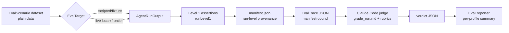

# Agent Evaluation Harness

A custom, data-driven eval framework for Lotti's **task agent**
(`TaskAgentWorkflow`) and **planning agent** (`DayAgentWorkflow`). Design and
rationale: [ADR 0029](../docs/adr/0029-agent-evaluation-harness.md) and the
[implementation plan](../docs/implementation_plans/2026-06-09_agent_evaluation_harness.md).

It follows Hamel Husain's tiered methodology:

| Level | What | Cost | When |
|---|---|---|---|
| 1 | Deterministic assertions on agent output | free, fast | every change (CI) |
| 2 | Real local + frontier models, Claude Code as judge | tokens + time | periodic, manual |
| 3 | Online A/B | — | future |

## Layout

```
eval/
  README.md            ← you are here
  prompts/
    judge_system.md    ← judge persona + JSON output contract
    rubric_task_agent.md
    rubric_planning_agent.md
  calibration/
    README.md          ← non-secret human-label schema for judge calibration
  grade_run.md         ← Claude Code runbook: trace dir -> verdicts
  run_level2.sh        ← mode-based orchestration (run/grade/verify/report)
  runs/                ← git-ignored artifacts: <runId>/manifest.json + traces/verdicts

test/eval/harness/     ← Dart support library (models, assertions, matrix runner, target, IO)
test/eval/scenarios/   ← shared scenario catalog + Level 1/report tests
```

## The flow



## Level 1 — every change

`runLevel1(scenario, output)` returns deterministic `EvalCheck`s (succeeded, no
hallucinated task refs, known raw tool names, known durable proposal item names,
no unexpected production tool-result errors, within capacity, valid status
transitions, estimate range, label cap, persisted label proposal validity, no
duplicate checklist items, …). Scenarios can also define an
`ExpectedDurableState` oracle inside `EvalExpectations`, matching
required/forbidden persisted proposals, planned blocks, parsed capture items,
report text, observations, allowed or forbidden mutated entry IDs, required
mutations, accepted `anyOf` alternatives, scoped min/max/exact count checks, and
parsed-capture confidence bands. Recovery stress scenarios can opt in to a
bounded set of named failed tool results through `allowedFailedToolNames` plus
`maxAllowedToolResultFailures`; the default remains zero failures. Required
proposal/block/item matchers and `anyOf` groups consume distinct actual records,
so one persisted item cannot satisfy two expected outcomes. Scoped counts are
aggregate checks over matching durable records, which lets scenarios count only
pending proposals instead of being distorted by retired proposal history. That
keeps final-state success code-graded while still allowing multiple valid plans
or proposal summaries. `validateEvalScenarioCatalog` cross-checks scenario and
expectation references before Level 2 verification accepts a run. The example
tests under
`test/eval/scenarios/` show both a passing output and a
regression-catching one:

```
fvm flutter test test/eval/scenarios
```

These run with no keys, no network, deterministic time.

Trace output keeps `toolCalls` as model-attempt diagnostics, records persisted
`toolResults` so production validation failures remain visible, records
workflow `runKey`/`threadId` provenance in `workflowRun`, and grades durable
state separately: drafted `plannedBlocks`, reports/observations from persisted
message/report rows, token usage, persisted planner `parsedCaptureItems`,
`proposals` read from final persisted `ChangeSetEntity.items` with both parent
`changeSetStatus` and item `status`, and `resolvedModel` provenance showing the
profile/model/provider actually used. `providerDecision` records the intended
profile slot, model class, selected model/provider rows, duplicate-native decoy
rows, legacy fallback rows, and environment-key presence booleans without
storing secret values. `modelInvocations` records each observed
`ConversationRepository.sendMessage` call with the selected provider/model,
tool names, forced tool choice when present, and prompt/tool hashes; it stores
no raw prompt text or API keys. Live traces also record `providerRequests` for
each internal provider request inside `sendMessage`, including continuation
requests after tool calls, with message/tool-schema hashes, structural counts,
provider/model ids, turn indexes, tool names, and forced tool choice.
`providerResponses` records the corresponding provider-stream metadata:
provider-reported model ids when the adapter has authoritative response
metadata, system fingerprints/provider names/service tiers when exposed, and an
explicit unavailable reason otherwise. Gemini native chunks are recorded as
response-model unavailable today because their normalized `model` field is
adapter-synthesized from the requested model rather than provider-returned
identity.
Failed target exceptions are serialized as failed traces, but the runner
redacts obvious API keys, bearer tokens, private local paths, and prompt-like
payload fields before writing `output.error`.
Every scenario also declares governance metadata: a primary capability id,
optional secondary capability ids, a split (`development`, `holdout`, or
`canary`), source, adversarial flag, tags, and optional digest-bound human
review metadata. Review metadata is intentionally non-secret: status, reviewer,
review time, rationale, optional source provenance, and a `subjectDigest` over
the scenario JSON with the review block omitted. `EvalTrace.schemaVersion` 9
includes a provenance block with canonical scenario/profile hashes, eval
prompt/rubric hash, tool-schema hash, code revision, and the run manifest hash,
plus model-invocation, provider-request, and provider-response records for
workflow-backed traces.
Real workflow benches also record runtime prompt/tool fingerprints as `sha256:`
digests in `output.runtimePrompt` without storing prompt text.
Planning scenarios may seed submitted captures, parsed capture items, existing
baseline blocks, and non-default capacity. The real planner workflow bench maps
those into production `CaptureEntity`, `ParsedItemEntity`, `DayPlanEntity`, and
`DayAgentConfig` state through the real planner services. Drafting wakes keep
the day token, while capture-only wakes preserve the production
`capture_submitted:<id>` trigger set and resolve the day from the submitted
capture. The bench records persisted parsed items and plan capacity so Level 1
can detect either a missed parse or a silent fallback to the production
480-minute default.
Task-agent scenarios may seed pre-existing `proposalSets` plus item-level
`proposalDecisions`, which the workflow bench maps to production
`ChangeSetEntity` and `ChangeDecisionEntity` rows. That lets Level 1 and Level 2
exercise cross-wake deduplication, consolidation, retired proposal rows, and
decision-driven rejected-history suppression where a later raw tool call should
not reopen a previously rejected suggestion. When a task scenario contains a
`decided_task:<id>` trigger token, the real workflow bench uses that task as the
active `AgentSlots.activeTaskId` instead of assuming the first fixture task is
the subject.
They may also seed category definitions, correction examples, task `labelIds`,
task `aiSuppressedLabelIds`, and scoped label definitions. The real task
workflow bench maps those into production `JournalDb` lookups, so available
label prompt context, correction-example context, and persisted label proposal
summaries are scenario-backed rather than raw scripted intent.

## Level 2 — periodic

Preview the exact matrix before spending model calls. `plan` validates the
loaded scenario/profile selectors, run-root safety, artifact collisions,
promotion-plan digests, and live provider/model bindings, but it does not
require `LOTTI_EVAL_LIVE=1` and does not write traces:

```
EVAL_SCENARIO_IDS=task_workflow_structured_update \
EVAL_PROFILE_NAMES=frontier-gemini \
LOTTI_EVAL_FRONTIER_PROVIDER=openAi \
LOTTI_EVAL_FRONTIER_MODEL=gpt-5-mini \
OPENAI_API_KEY=... \
  eval/run_level2.sh plan <runId>
```

The printed `previewManifestDigest` is a dry-run fingerprint, not a reservation.
The actual `run` command writes the authoritative manifest when it executes, so
rerun `plan` with the same env whenever selectors, catalogs, profile JSON,
provider overrides, prompt/rubric files, or git state change.

```
LOTTI_EVAL_LIVE=1 \
LOTTI_EVAL_LOCAL_MODEL=llama3.1:8b OLLAMA_BASE_URL=http://localhost:11434 \
LOTTI_EVAL_FRONTIER_PROVIDER=openAi LOTTI_EVAL_FRONTIER_MODEL=gpt-5-mini \
OPENAI_API_KEY=... \
  eval/run_level2.sh run <runId>
eval/run_level2.sh grade <runId>
eval/run_level2.sh report <runId>
EVAL_CALIBRATION_TEMPLATE=/private/tmp/judge_gold_v1.template.json \
EVAL_CALIBRATION_TEMPLATE_MAX_ROWS=24 \
  eval/run_level2.sh template <runId>
EVAL_CALIBRATION=eval/calibration/judge_gold_v1.json \
  eval/run_level2.sh calibrate <runId>
EVAL_CALIBRATION=/private/tmp/judge_gold_v1.json \
  eval/run_level2.sh report <runId>
EVAL_PROMOTION_PLAN=/private/tmp/frontier_gemini_vs_fast.draft-plan.json \
  eval/run_level2.sh run <runId>
EVAL_PROMOTION_PLAN=/private/tmp/frontier_gemini_vs_fast.plan.json \
EVAL_CALIBRATION=/private/tmp/judge_gold_v1.json \
  eval/run_level2.sh report <runId>
EVAL_PROMOTION_CANDIDATE_PROFILE=frontier-gemini \
EVAL_PROMOTION_BASELINE_PROFILE=frontier-fast \
EVAL_CALIBRATION=/private/tmp/judge_gold_v1.json \
  eval/run_level2.sh report <runId>
```

Omit `<runId>` for `grade`, `verify`, or `report` to use the latest
timestamp-named directory under `eval/runs/`.

For fast iteration on one use case, select a subset of the loaded matrix with
comma-separated ids and profile names. Use the same selector env for `run`,
`verify`, `report`, `template`, and `calibrate`; the run manifest binds to the
selected scenario/profile set and later phases fail closed if the selectors
drift. `plan` uses the same selectors and prints every scenario/profile/trial
cell with its future trace and verdict path.

```
EVAL_SCENARIO_IDS=task_workflow_structured_update \
EVAL_PROFILE_NAMES=local-small,frontier-gemini \
LOTTI_EVAL_LOCAL_MODEL=llama3.1:8b OLLAMA_BASE_URL=http://localhost:11434 \
LOTTI_EVAL_FRONTIER_PROVIDER=openAi LOTTI_EVAL_FRONTIER_MODEL=gpt-5-mini \
OPENAI_API_KEY=... \
  eval/run_level2.sh plan <runId>

EVAL_SCENARIO_IDS=task_workflow_structured_update \
EVAL_PROFILE_NAMES=local-small,frontier-gemini \
LOTTI_EVAL_LIVE=1 \
  eval/run_level2.sh run <runId>

EVAL_SCENARIO_IDS=task_workflow_structured_update \
EVAL_PROFILE_NAMES=local-small,frontier-gemini \
  eval/run_level2.sh report <runId>
```

For private production-replay holdouts, provide an external catalog and keep
trace artifacts outside the repo unless you explicitly acknowledge that trace
JSON contains raw scenario payloads:

```
EVAL_SCENARIOS=/private/path/lotti_eval_scenarios_v1.json \
EVAL_RUNS_ROOT=/private/tmp/lotti-eval-runs \
LOTTI_EVAL_LIVE=1 \
  eval/run_level2.sh run <runId>
EVAL_SCENARIOS=/private/path/lotti_eval_scenarios_v1.json \
  eval/run_level2.sh catalog
EVAL_SCENARIOS=/private/path/lotti_eval_scenarios_v1.json \
EVAL_RUNS_ROOT=/private/tmp/lotti-eval-runs \
  eval/run_level2.sh report <runId>
```

By default, external scenarios are appended to the public catalog. Set
`EVAL_SCENARIOS_MODE=replace` when a private catalog should be the whole
scenario set for the run:

```
EVAL_SCENARIOS=/private/path/lotti_eval_scenarios_v1.json \
EVAL_SCENARIOS_MODE=replace \
EVAL_RUNS_ROOT=/private/tmp/lotti-eval-runs \
LOTTI_EVAL_LIVE=1 \
  eval/run_level2.sh run <runId>
```

Custom model/profile matrices can be supplied with `EVAL_PROFILES`. The value
may be a JSON file path or inline JSON; file paths are easier to use from the
shell. The catalog is a JSON array, or an object with a `profiles` array:

```json
{
  "profiles": [
    {
      "name": "gemini-fast-low-thinking",
      "isLocal": false,
      "modelClass": "frontierFast",
      "modelId": "gemini-fast-low-thinking",
      "temperature": 0.3,
      "maxCompletionTokens": 4096,
      "tokenBudget": 60000,
      "trialCount": 3
    },
    {
      "name": "local-qwen-reasoning",
      "isLocal": true,
      "modelClass": "localReasoning",
      "modelId": "local-qwen-reasoning",
      "temperature": 0.4,
      "maxCompletionTokens": 2048,
      "tokenBudget": 12000,
      "trialCount": 3
    }
  ]
}
```

Bind those slots to live providers through the existing env hierarchy, for
example `LOTTI_EVAL_FRONTIER_PROVIDER=openAi`,
`LOTTI_EVAL_FRONTIER_MODEL=gpt-5-mini`, `OPENAI_API_KEY=...`, or
`LOTTI_EVAL_LOCAL_MODEL=qwen3:8b` for Ollama. Profile-specific keys use the
upper snake-case profile name, so `gemini-fast-low-thinking` can be overridden
with `LOTTI_EVAL_GEMINI_FAST_LOW_THINKING_MODEL` and matching provider/base URL
keys. Use the same `EVAL_PROFILES` value for `run`, `verify`, and `report`; the
run manifest records the profile-set digest and concrete execution bindings.

The external catalog can be a plain scenario JSON list for unprotected local
experiments. Tuning-ready protected evidence requires the object envelope:

```
{
  "schemaVersion": 1,
  "catalogId": "private-production-replay-v1",
  "protectedHoldout": true,
  "scenarios": [ ... EvalScenario JSON ... ]
}
```

Protected holdout scenarios must be `split: "holdout"` and
`source: "productionReplay"`. The loader rejects duplicate public/external ids,
unsafe ids that would collide as trace filenames, protected envelopes without a
catalog id, and protected catalogs without production-replay holdout scenarios.
Tuning readiness also rejects duplicate protected holdout `review.sourceDigest`
values, so one production-replay record cannot be copied into multiple scenario
ids to satisfy protected-holdout depth.
The manifest records only non-secret catalog evidence: merged scenario-set
digest, external catalog digest/id/basename, counts, protected flag, and
protected holdout ids. It does not store the absolute catalog path.
Run `eval/run_level2.sh catalog` with `EVAL_SCENARIOS` before expensive live
model calls. It loads the public + external catalog and applies the
model-class tuning scenario gates only: protected production-replay holdout
depth, planned profile/model-class/trial coverage, agent/split/primary-capability
coverage, adversarial stress taxonomy, and completed digest-current
review/source-digest metadata. Protected catalog files inside the repo are
rejected, and protected scenario ids are redacted in rendered preflight output.
It exits non-zero unless the catalog is `catalog-ready`, but it does **not**
prove tuning readiness: traces, verdicts, provider provenance, model
performance, and human calibration labels are checked later by `report`.

1. `run` executes each scenario against each profile/model class through the
   shared `EvalMatrixRunner`, writes `<runsRoot>/<runId>/manifest.json` first,
   then writes one manifest-bound trace per `(scenario, profile, trialIndex)`.
   The manifest records the target name/kind, trace schema version, command,
   git revision/dirty-state digest, sanitized environment-key presence, and
   scenario/profile/prompt/tool-schema set digests, plus
   `profileExecutionBindings` and `profileBindingSetDigest` that bind each
   profile slot to the concrete provider id/type, provider-native model id,
   model/profile config ids, normalized endpoint origin, base URL digest, and
   effective provider request temperature used in the run. Live bindings are
   captured after environment/profile overrides. The
   manifest also records non-secret scenario catalog evidence for public-only
   or public-plus-external catalogs. The runner passes
   the same run id, scenario id, profile name, and trial index into the target
   as `EvalTargetRunContext`. Scripted real-workflow benches already derive
   distinct workflow `runKey`/`threadId` values from it and record them in the
   trace; live runs use the same cell id and are gated by `LOTTI_EVAL_LIVE=1`.
   In CI, live runs additionally require `LOTTI_EVAL_ALLOW_CI=1`.
2. Grade with Claude Code: `claude -p "Follow eval/grade_run.md to grade eval/runs/<runId>"`.
3. `report` first loads the run through `TraceWriter.readRun`, which requires a
   current manifest, recomputes the manifest hash, and rejects traces bound to a
   different manifest. It then verifies exact scenario × profile × trial
   coverage, rejects embedded/orphan/stale verdicts and non-current trace schema
   versions, recomputes Level 1 checks, validates workflow run/thread
   provenance when present, validates runtime prompt/tool digest shape,
   validates every recorded model invocation against `providerDecision`,
   requires provider request provenance for live traces with recorded model
   invocations, including failed traces after a provider call, and validates
   recorded provider requests against both `providerDecision` and the owning
   model invocation, including effective request temperature against the current
   `ConversationRepository` policy (`openAi` -> `1.0`, other provider types ->
   profile temperature), requires one provider response metadata record per live
   provider request, rejects response model drift when a provider-reported model
   is available, requires response models for OpenAI, Mistral, and Ollama live
   traces, validates resolved model/provider provenance against both
   `providerDecision` and the manifest-bound profile execution binding,
   validates model invocations and provider requests against that same binding,
   including endpoint origin and base URL digest,
   rejects selected decoy/legacy provider rows, validates scenario governance
   metadata including stale scenario-review digests, recomputes trace
   provenance against the canonical catalog and current eval prompts/tool
   schemas, validates the judge score/pass contract
   and judge provenance (`schemaVersion`, judge runner/model, prompt digest,
   calibration set version, profile visibility), requires full SHA-256 digest
   shape, rejects mixed judge provenance inside one verified run, rejects
   trace-embedded scenario/profile payload drift from the canonical catalog,
   validates manifest-bound scenario catalog evidence and emits an actionable
   error if a run was created with an external catalog but report/verify omitted
   that same `EVAL_SCENARIOS` file,
   then prints a tuning-readiness report followed by the per-profile,
   per-capability, and
   split/model-class/capability summaries, plus paired profile comparisons over
   shared complete scenario trial sets. The reporter gets the verified
   scenario/profile matrix and renders split/model-class/capability coverage
   from the canonical catalog rather than from observed traces alone; it
   validates the supplied matrix against the run manifest digests before treating
   coverage as authoritative. It never regenerates traces.
4. `template` first performs the same manifest/catalog verification as
   `report`, requires verdict-bound traces, and writes a non-secret human-label
   template to `EVAL_CALIBRATION_TEMPLATE`. The template includes trace keys,
   scenario/profile digests, `JudgeVerdict.traceDigest`, a digest of the
   parsed `JudgeVerdict` JSON, the verdicts'
   `judge.calibrationSetVersion`, and blank human pass/score fields. It uses
   `labelTemplates`, not `labels`, so `calibrate` rejects it until a human fills
   the fields, clears `needs_review`, and converts it into a completed
   calibration set while preserving `judgeCalibrationSetVersion`. Template mode
   requires an explicit `<runId>`, requires a `.template.json` output path,
   refuses to overwrite unless `EVAL_CALIBRATION_TEMPLATE_OVERWRITE=1` is set,
   and blocks in-repo templates for any external catalog unless
   `LOTTI_EVAL_PROTECTED_TRACE_ACK=1` acknowledges scenario-id exposure.
   By default the template includes every judged trace. Set
   `EVAL_CALIBRATION_TEMPLATE_MAX_ROWS` to create a deterministic bounded review
   queue: the selector validates the full judged run first, then covers
   marginal strata for agent kind, model class, judge pass/fail, protected vs.
   non-protected traces, and primary capability before topping up by stable
   trace key. The template records aggregate selection counts, cross-cell
   counts, and digests, not raw scenario text or protected catalog metadata.
   This is calibration coverage planning only; a sampled queue is not
   tuning-ready unless the completed labels still satisfy the calibration and
   readiness gates.
5. `calibrate` first performs the same manifest/catalog verification as
   `report`, then loads a human-label JSON file through `EVAL_CALIBRATION` and
   compares the run's `JudgeVerdict`s against those labels. Calibration labels
   key into `(scenarioId, profileName, trialIndex)`, bind the reviewed artifact
   to `scenarioDigest`, `profileDigest`, and the verdict's `traceDigest`, bind
   the reviewed verdict through `verdictDigest`, and record
   inclusive human score bands plus expected pass. Completed calibration files
   must carry non-empty reviewer provenance (`labeler`, `rationale`, terminal
   `adjudicationStatus`, and `labelerCount >= 1`) and are blocked inside the
   repo for external catalogs unless `LOTTI_EVAL_PROTECTED_TRACE_ACK=1` is set.
   Multi-review rows keep one final gold label and store pre-adjudication votes
   in `independentReviews`; duplicate completed labels for the same trace remain
   invalid. The calibration report computes pairwise human pass/score agreement
   from those independent reviews and flags any disagreement that has not been
   explicitly adjudicated. Each independent vote records protocol flags for
   blinding to the judge verdict, exact model identity, and peer votes; the
   default model-class readiness policy rejects unblinded human-review evidence.
   They do not store raw prompt text or model output. The calibration-set
   `version` names the human gold labels; `judgeCalibrationSetVersion` names the
   judge provenance expected on the verdicts, so bootstrap calibration can audit
   verdicts produced with `judge.calibrationSetVersion: "uncalibrated"`.
   The calibration report
   prints gold-label coverage, pass/score agreement, Wilson intervals,
   false-pass/false-fail counts, slices by primary capability and model class,
   and coverage findings for duplicate labels, stale labels, missing traces,
   missing verdicts, judged traces without labels, verdicts graded under a
   different `judge.calibrationSetVersion`, and unblinded verdicts where the
   judge saw exact provider/model identity.
   When `EVAL_CALIBRATION` is also set for `report`, the same calibration report
   is fed into `EvalTuningReadiness` before the ordinary run summary is printed.

The judge scores **goal attainment**, **quality/accuracy**, and **efficiency**
(token burn + unnecessary steps), separately per profile, so a plan that is great
on a frontier model but blows the local token budget shows up as a *local*
failure. The summary reports both per-trace pass rates and per-scenario
`pass^k` reliability across repeated trials, so an occasionally successful
model is visible as unstable rather than averaged into a misleading pass rate.
Reporter `pass^k` only counts scenario groups with exactly one trace for every
expected trial index; duplicate, shifted, extra, or missing trial indexes are
treated as incomplete, and a missing verdict keeps judge reliability at zero.
Capability summaries use the scenario's primary capability so one multi-tagged
scenario cannot inflate headline denominators. Profile and capability rows show
scenario, complete-scenario, trace, judged-trace, judged-coverage, and
`pass^k` denominators next to trace pass rates, so `judge pass 100%` cannot hide
that only a subset of expected trials was judged.
Split/model-class/capability rows also show profile count, scenario count,
scenario-profile cell count, expected trial count, actual traces, judged traces,
and coverage so model-class tuning cannot hide missing verdicts, incomplete
trial sets, or sparse scenario/profile matrix cells behind a high judged-pass
percentage. Scenario-profile and expected-trial denominators come from the
scenario x profile cross-product, not only from observed cells; in report mode
they come from the verified catalog/profile matrix, so a completely missing
profile, scenario, split, or capability still appears as zero-trace coverage.
Summary Wilson 95% confidence intervals cluster repeated trials at the scenario
or scenario-profile-cell level by default; explicit trace-level estimates remain
available only as diagnostics. Paired profile comparisons report Level 1 /
judge pass deltas only over scenarios where both profiles have a complete trial
set. Profile-only, missing-verdict, and incomplete/ambiguous scenario groups are
counted separately so the comparison cannot silently overstate coverage. The
rendered table marks zero-overlap pairs as `not comparable` and pairs with fewer
than eight paired scenarios as `low n`.
For model changes, `EvalReporter.evaluateProfilePromotion` adds an explicit
candidate-vs-baseline decision gate over those paired comparisons. It orients
deltas as `candidate - baseline` regardless of profile-name sort order and
defaults to requiring a tuning-ready run, at least 12 paired judged scenarios,
no candidate-only or baseline-only scenario overlap, no missing judge verdicts,
a positive observed judge-pass delta, a conservative Wilson lower-bound
judge-pass delta, enough discordant paired judge outcomes, a
supplemental one-sided exact sign-test p-value over candidate-only vs.
baseline-only scenario wins, no Level 1 regression, no mean goal/quality
regression, bounded efficiency regression, and a maximum 25% paired-token
regression. The paired sign test is not independent evidence; it is derived from
the same scenario-level judge pass/fail outcomes and prevents aggregate pass
rates from hiding that the candidate did not actually win enough matched
scenario disagreements. Relaxing the no-missing-verdict policy does not disable
those discordance/sign-test gates; they still run over the judged paired subset.
`EvalProfile` may opt into non-secret integer cost
weights for reported input, output, cached-input, and thought tokens; default
weights are omitted from JSON and keep legacy token-ratio behavior. When either
the candidate or baseline has explicit weights, the promotion resource gate uses
weighted reported cost instead of raw `input + output` tokens and renders
`costMode=weighted`, token ratio, cost ratio, cost evidence coverage, missing
cost count, and whether each side used weighted/default profile costs. Weighted
cost requires core input/output usage and any cached/thought dimension whose
weight differs from the corresponding input/output rate; missing evidence blocks
promotion rather than being counted as zero cost. The default token mode also
requires paired input/output token evidence before applying the resource gate.
These profile weights are
run-provenance assumptions, not live provider prices. Outcomes are `promote`,
`reject`, `inconclusive`, or `blocked`, so a strong-but-underpowered run cannot
be mistaken for a promotion and an expensive candidate can be rejected even when
it wins on pass rate.
Promotion decisions also render a planning-only evidence plan. This is not a
statistical power calculation; it estimates how many additional paired judged
scenarios would satisfy the current Wilson lower-bound and paired discordant
sign-test reporting gates if the observed pass and candidate-only/baseline-only
win rates remained unchanged. The estimate is suppressed when the observed
effect is not already policy-positive, when paired verdicts or trial sets are
incomplete, or when non-sample gates such as token/cost, Level 1, quality, or
efficiency still fail. Treat it as run-planning guidance only: additional paired
scenarios must come from a pre-registered readiness/protected catalog before
results are known, not from after-the-fact public synthetic cases.
`eval/run_level2.sh report` renders that decision when
`EVAL_PROMOTION_CANDIDATE_PROFILE` and
`EVAL_PROMOTION_BASELINE_PROFILE` are both set for an exploratory report, and
turns it into an assertion gate when `EVAL_PROMOTION_PLAN` points at a
pre-registered JSON plan that was also supplied to `eval/run_level2.sh run`.
The profile names are eval profile names such as `frontier-gemini` and
`frontier-fast`, not provider-native model IDs. With a promotion plan, the
command renders the fixed policy values and exits non-zero unless the status is
`promote`; omit the plan for a descriptive report only.
Thresholds are
intentionally not shell-overridable here, because changing the gate after seeing
a run would invalidate a model-selection claim. Direct candidate/baseline env
vars are convenient for local exploration, but they are descriptive unless they
match a manifest-bound `EVAL_PROMOTION_PLAN`. Without tuning-ready evidence and
a completed calibration set, the promotion status remains `blocked`, which
means insufficient evidence rather than a model failure.

A promotion plan is non-secret and binds the candidate, baseline, scenario set,
profile set, and fixed promotion policy before the report sees model outcomes:

```json
{
  "schemaVersion": 1,
  "planId": "frontier-gemini-vs-fast-2026-06-10",
  "createdAt": "2026-06-10T00:00:00Z",
  "candidateProfileName": "frontier-gemini",
  "baselineProfileName": "frontier-fast",
  "scenarioSetDigest": "sha256:...",
  "profileSetDigest": "sha256:...",
  "policyDigest": "sha256:...",
  "manifestDigest": "sha256:...",
  "notes": "optional non-secret rationale"
}
```

`manifestDigest` is required for assertion-gated reports. A pre-run draft can
bind the scenario/profile/policy digests before outcomes are known, but the
report gate only treats it as claim-ready when the run manifest recorded the
draft plan's subject digest during `run` and the final plan is anchored to the
verified run manifest. Adding only `manifestDigest` after the run is expected;
changing candidate, baseline, scenario set, profile set, or policy after the
run fails closed. This prevents accidental post-hoc model-selection claims; it
does not cryptographically prevent an operator from fabricating a plan before
rerunning the evaluation. If direct candidate/baseline env vars are also
supplied with a plan, they must match the plan. `policyDigest` is the canonical
digest of the schema-versioned
`EvalReporter.promotionPolicyJson(ProfilePromotionPolicy(...))` payload; if the
code's promotion thresholds change, stale plans fail closed.

`EvalTuningReadiness` is the guardrail between a valid artifact matrix and
evidence that is strong enough for model-class tuning. The development-smoke
policy can pass with a small complete matrix, but the model-class tuning policy
requires a live manifest, canonical scenario/profile-set digests, required
profile names/model classes, multi-trial coverage, full verdict coverage,
calibrated judge verdicts, a completed human calibration label set,
manifest-bound protected holdout evidence, minimum agent/capability/split
coverage, explicit adversarial coverage, required adversarial failure-mode tags,
protected production-replay holdout depth, and completed review metadata for
adversarial, synthetic, production-replay holdout, and protected holdout
scenario evidence. Synthetic and protected evidence also requires a review
`sourceDigest`, and protected holdout `sourceDigest` values must be unique, so
a generated/private scenario cannot count with only a rubber-stamp review and a
single replay source cannot inflate holdout depth. The default model-class
policy requires
adversarial coverage for both agents and every capability under test, plus the
tags `ambiguous-reference`, `scope-boundary`, `stale-state`, and
`tool-recovery` somewhere in the adversarial slice. Readiness counts only
scenarios whose canonical `isAdversarial` flag is true; source/tag metadata
without the flag is rejected as inconsistent. The calibration gate recomputes
`JudgeCalibrationReport` from the raw `JudgeCalibrationSet`; a precomputed
aggregate report is display-only and cannot satisfy readiness gates. The gate
uses evaluated-label coverage over judged traces, evaluated-label minimums
overall and per required model class/capability, pass/score agreement rates and
Wilson lower bounds, false-pass/false-fail limits, exact judge calibration
version checks, optional human gold-label version checks,
stale/missing/mismatch counts, model-identity blinding, independent human-review
pair counts, human-human pass/score agreement with Wilson lower bounds, and zero
unresolved human disagreement plus blinded human-review protocol evidence for
the default model-class policy. The same policy rejects unblinded judge verdicts
where exact provider/model identity was visible during grading.
Until first-class blinded trace exports exist, the verdict flag is a
provenance/protocol assertion rather than proof that raw trace identity was
cryptographically hidden.
Public `holdout` split labels are process metadata only; they do not satisfy
protected-holdout readiness unless the run manifest contains evidence from a
protected external production-replay catalog with enough unique protected
holdout scenarios, distributed across required agent kinds.
`eval/run_level2.sh report` prints
this status before the normal summary so a cherry-picked or uncalibrated run is
visibly labeled development-smoke even if `EvalRunVerifier` accepts the
artifacts. The readiness block also renders the
underlying evidence counts: scenarios by agent and split, primary capability
count, profiles by model class, observed trial range, adversarial totals and
tags, production-replay holdout count, protected holdout count, protected
holdouts by agent, duplicate protected evidence ids, and required/completed/
missing/incomplete/stale scenario review counts.

## Adding a scenario

Add a plain-data `EvalScenario` (mocked tasks/deadlines, optional pre-existing
proposal sets, governance metadata, a user transcript, and optional hard
expectations) under `test/eval/scenarios/`. No codegen. The same scenario feeds
Level 1 and Level 2 so they never drift. Scenarios may be drafted
by an LLM, but must be human-reviewed before commit. Adversarial scenarios must
set `isAdversarial: true`; source/tag metadata alone is not enough for readiness
counts. They should also carry concrete failure-mode tags, not just the generic
`adversarial` tag. Use `ambiguous-reference`, `scope-boundary`, `stale-state`,
and `tool-recovery` for the default tuning-readiness stress taxonomy unless a
custom policy deliberately replaces that taxonomy. These values live in
`kDefaultAdversarialStressTags`; catalog validation and run verification reject
adversarial scenarios that lack one of those canonical tags. Tool-recovery
scenarios may allow named failed tool results, but only by setting both
`allowedFailedToolNames` and a tight `maxAllowedToolResultFailures`; ordinary
scenarios still fail Level 1 on any production tool-result error.
Public adversarial workflow scenarios must also carry concrete
`ExpectedDurableState` oracles and scripted real-workflow coverage. That keeps
the public corpus useful as regression/stress evidence without pretending it is
a private holdout. If a committed adversarial case is synthetic rather than
hand-authored, its review metadata must include a valid `sourceDigest` plus a
`sourceLabel` or `generator` so generated evidence remains auditable.
For tuning claims, reviewed evidence is stricter than catalog validity:
unreviewed scenarios can still load and run, but adversarial, synthetic,
production-replay holdout, and protected holdout scenarios do not count as
model-class tuning-ready evidence until `metadata.review.status` is `reviewed`
or `adjudicated` and its `subjectDigest` matches the current scenario payload.
Synthetic and protected external scenarios must also include a valid review
`sourceDigest` that identifies the source artifact without storing raw private
content.

For scripted Level 1 workflow runs, keep the golden `ScriptedAgentBehavior`
outside the scenario in a side map keyed by `scenario.id` (or by
`scenario.id` + `profile.name` via `ScriptedEvalTarget.fromProfileMap({...})`).
That keeps `EvalScenario` JSON-serializable and keeps the pure harness barrel
free of bench/mock imports.

> Level 2 executes the real workflows, which need the Flutter test binding, so
> the live runner is a tagged `flutter test` entrypoint — not a plain
> `dart run` script. See ADR 0029 for why.
