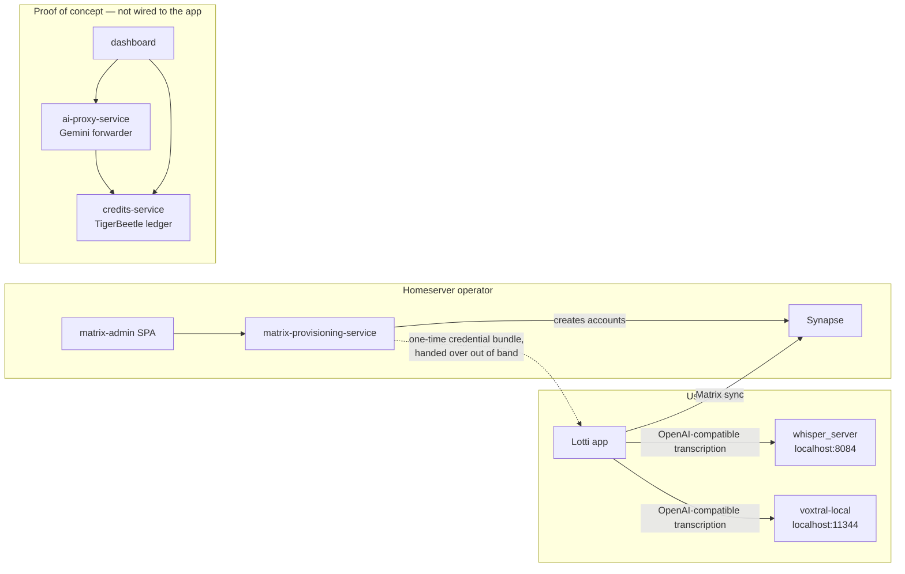

# Three kinds of service

`services/` holds everything that is not the Flutter app. The directories look
alike, but they fall into three groups that differ in whether the app depends on
them and whether anything keeps them working:

| Group | Directories | App depends on it | Built or tested in CI |
|-------|-------------|-------------------|-----------------------|
| **Local inference servers** the user installs beside the app | `whisper_server`, `voxtral-local` | Yes, as optional providers at a default `localhost` URL | Released as binaries by `python-services-release.yml` on a version tag |
| **Sync account provisioning** run by whoever hosts the homeserver | `matrix-provisioning-service`, `matrix-admin`, `shared` | Indirectly: the app redeems the bundles it issues, and never calls it over HTTP | Tested on every push touching them by `matrix-admin-ci.yml` |
| **Hosted-AI billing proof of concept** | `ai-proxy-service`, `credits-service`, `dashboard` | No | No |

`qwen/` is not a service: it is a README recipe for running a Qwen model locally
with `mlx_vlm`.

# Local inference servers

`whisper_server` and `voxtral-local` expose an OpenAI-compatible transcription
API on the user's machine. The app knows them only as provider types whose
default base URLs are `http://localhost:8084` and `http://localhost:11344`
(`ProviderConfig.defaultBaseUrls`); routing to them is described in
[AI provider routing](../features/ai/provider-routing.md), and how a desktop
node advertises them in [node profiles](../features/sync/node-profiles-and-auto-trigger.md).
Their release is part of the tag pipeline in
[Platform targets, CI and release](platform-and-release.md).

# Sync account provisioning

`matrix-provisioning-service` creates sync accounts on a Synapse homeserver and
tracks the one-time bundles that grant access to them; `matrix-admin` is its
admin UI, and `shared` is the Python package both it and the
`tools/matrix_provisioner` CLI import. The three are one deployable unit with
their own CI workflow. The app's side — redeeming a bundle, and what it trusts
afterwards — is in the [sync overview](../features/sync/overview.md).

# The billing proof of concept

`ai-proxy-service` forwards OpenAI-style requests to Gemini and records usage,
`credits-service` keeps balances in TigerBeetle with a SQLite registry, and
`dashboard` is a customer-care UI over both. `services/DEPLOYMENT_GUIDE.md`
describes how to deploy the proxy and the credits service.

What the repository shows about them:

- **No app caller.** The only trace in `lib/` is the default base URL of the
  generic OpenAI-compatible provider, `http://localhost:8002/v1`, named
  "AI Proxy (local)" — the proxy's local port. A user who never points a
  provider there never reaches it.
- **No CI.** No workflow, Makefile target or Buildkite step builds, tests or
  deploys any of the three. Their recent commits are dependency bumps.
- **No deployment record.** Nothing in the repository says whether an instance
  runs anywhere. Treat the three as unmaintained proofs of concept: their
  security findings are exposure only for someone who deploys them, and anyone
  who does should first bring them under CI.

# Related

* [Platform targets, CI and release](platform-and-release.md) - the release
  pipeline that ships the local inference servers.
* [Security and privacy posture](security-and-privacy.md) - what leaves the
  device, and to which provider.
