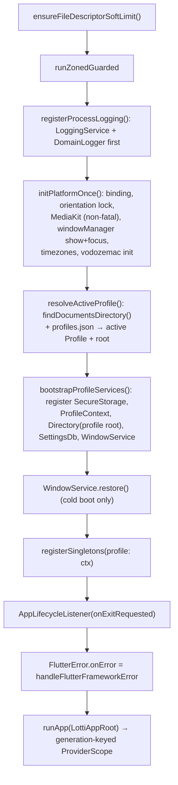
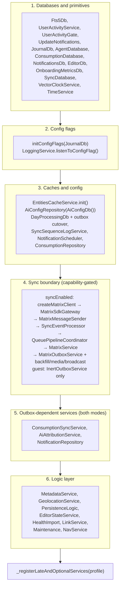

# Two containers, one boundary

Lotti runs two dependency containers side by side, and the split is not
arbitrary.

| Container | Holds | Lifetime |
|-----------|-------|----------|
| **GetIt** (`getIt`) | Process-wide services and database handles that exist before any widget does: `JournalDb`, `MatrixService`, `OutboxService`, `LoggingService`, `PersistenceLogic`. | Registered during startup, disposed at process exit. |
| **Riverpod** (`ProviderScope`) | Everything scoped to the widget tree: controllers, repositories built on top of GetIt services, UI state. | Created on first watch, disposed with its scope. |

The rule that falls out of this: **Riverpod providers may resolve GetIt
services; GetIt services must not resolve Riverpod providers.** A GetIt
singleton that needed a provider would have to reach for a container that does
not exist yet at registration time.

`LottiAppRoot` bridges the two once **per service generation**:
`buildProviderOverrides()` (in `lib/app_bootstrap.dart`) overrides a handful
of providers with the already-constructed singletons, and the `ProviderScope`
carries a generation-keyed `ValueKey` so that an in-app profile switch (see
[profiles and demo mode](profiles-and-demo-mode.md)) discards the whole scope
and rebinds every provider against the freshly registered generation. In
guest worlds `matrixServiceProvider` is deliberately left unoverridden — the
Matrix stack does not exist there, and accidental resolution fails loudly.

It carries a second, different kind of override. Beyond bridging getIt
singletons, `buildProviderOverrides()` is where features that own an *agent
kind* register it with the shared agent runtime — wake runners, runtime
maintenance hooks, prompt-log wrap renderers and the Daily OS setup-sheet
launcher. Those registries live in `features/agents` and default to empty
precisely so that feature need not import the features that fill them; the
composition root is the only place permitted to see both sides. See
[agent kinds](../features/agents/overview.md#how-an-owning-feature-plugs-a-kind-in).
Unlike a missing getIt bridge, a missing registration here fails **silently** —
an unregistered kind falls through to the task-agent workflow — so the
registrations are pinned by
`test/app_bootstrap_test.dart` (the `agent runtime registrations` group).

```dart
ProviderScope(
  key: ValueKey('profile-gen-$_generation'),
  overrides: buildProviderOverrides(getIt<ProfileContext>()),
  child: const MyBeamerApp(),
);
```

# Startup sequence

The bootstrap is split along the profile-switch boundary
(`lib/app_bootstrap.dart`): `registerProcessLogging()` and
`initPlatformOnce()` run exactly once per process, while
`resolveActiveProfile()` + `bootstrapProfileServices()` run once per service
generation — on cold boot and again after every in-app profile switch.



The registered `Directory` is the **active profile root**, not the raw OS
documents directory — every database open and file write resolves through it
(`openDbConnection` falls back to it; see
[profiles and demo mode](profiles-and-demo-mode.md) for the isolation
contract).

Four details in that sequence are deliberate and easy to break:

- **The file-descriptor bump runs before anything opens an FD.** macOS GUI apps
  inherit launchd's soft limit of 256, which sockets, SQLite handles,
  attachments, and log files exhaust quickly. The adjustment is captured
  synchronously and only *logged* later, once `LoggingService` exists.
- **`LoggingService` and `DomainLogger` are registered before anything else**,
  so startup diagnostics and the `runZonedGuarded` error handler can resolve a
  logger. `registerSingletons()` reuses that instance rather than
  re-registering it.
- **`handleUncaughtZoneError` guards its own lookup** with
  `getIt.isRegistered<DomainLogger>()`. An error thrown before the logger
  exists must surface as itself, not as a GetIt lookup failure inside the
  handler.
- **The Flutter framework hook bounds repeated diagnostics before they reach
  durable logging.** The fingerprinting and sampling contract lives in
  [Logging and diagnostics](logging-and-diagnostics.md#the-gate-and-what-bypasses-it).

# Registration order inside `registerSingletons()`

`registerSingletons({required ProfileContext profile})` is a single long
function, and its order encodes a real dependency graph rather than a filing
preference. The Matrix phase is conditional on the profile's capabilities:
real profiles build the full sync stack (`_registerMatrixSyncStack` in
`lib/get_it_sync.dart`), guest/demo worlds register only an
`InertOutboxService` — no Matrix client, no inbound queue, no backfill
timers, no startup broadcast (see
[profiles and demo mode](profiles-and-demo-mode.md)).



**Config flags gate construction.** `initConfigFlags(getIt<JournalDb>())` runs
before any service that reads a flag is built. `MatrixService`, for example,
takes `collectSyncMetrics` as a constructor argument read from
`enableLoggingFlag`.

**The sync chain has a cycle, broken by a set-once field.**
`BackfillResponseHandler` needs `OutboxService`, which needs `MatrixService`,
which needs `SyncEventProcessor`. Constructor injection cannot express that, so
`SyncEventProcessor.backfillResponseHandler` is a `late final` assigned after
both exist — and it must be assigned before `MatrixService` consumes any
inbound timeline event.

**Startup never awaits network or metrics work.** The onboarding first-seen
write, the sync-node profile broadcast, and the vector-clock burn
reconciliation are all `unawaited(...)` with their own try/catch, so a failure
is logged under its domain instead of escaping to the zone handler and taking
down boot.

**`NotificationService` is lazily registered**, and callers receive a thunk
(`() => getIt<NotificationService>()`) rather than a resolved instance, so
start-up itself never initialises the platform plugin — which is what keeps a
sandboxed build such as the Flatpak startable when plugin registration fails.

What it does *not* mean is that the plugin waits for a notification to be
scheduled. The first resolution is normally the **first entry write**, because
`updateBadge()` runs at the end of every `createDbEntity` — before anything has
been scheduled and regardless of whether notifications are switched on at all.
Toggling the notifications config flag resolves it too.

**Construction must therefore be free of user-visible side effects**,
permission prompts above all: the moment it happens is arbitrary from the
user's point of view, and delivery is gated separately and later. What the
plugin may ask the OS for, and when, is in
[synced notifications](../features/notifications.md#nothing-reaches-the-os-before-the-config-flag-says-so).

# Shutdown

Desktop close paths converge on one ordered teardown. `AppLifecycleListener`'s
`onExitRequested` and the window-manager close event both call
`WindowService.closeWindow()`, which releases SQLite handles before the process
is allowed to exit. On macOS the immediate-exit path is only reached after
that release — exiting earlier risks a half-flushed WAL. The pre-flush callback
then drains pending framework-error counts after service/player teardown and
immediately before `LoggingService.flush()`, as described in
[Logging and diagnostics](logging-and-diagnostics.md#the-gate-and-what-bypasses-it).

# Where to look

| Concern | File |
|---------|------|
| Entry point, zone guard, error handlers | [`lib/main.dart`](../../lib/main.dart) |
| Process-once vs per-generation bootstrap | [`lib/app_bootstrap.dart`](../../lib/app_bootstrap.dart) |
| Generation-keyed ProviderScope + switch splash | [`lib/app_root.dart`](../../lib/app_root.dart) |
| Singleton graph | [`lib/get_it.dart`](../../lib/get_it.dart) |
| Capability-gated sync registration | [`lib/get_it_sync.dart`](../../lib/get_it_sync.dart) |
| Late/optional and platform-conditional services | [`lib/get_it_helpers.dart`](../../lib/get_it_helpers.dart) |
| Maintenance-only registrations | [`lib/get_it_maintenance.dart`](../../lib/get_it_maintenance.dart) |
| Provider overrides bridging GetIt into Riverpod | [`lib/providers/service_providers.dart`](../../lib/providers/service_providers.dart) |

Related: [persistence](persistence.md) for the databases registered in phase 1,
[the sync feature](../features/sync/) for the chain built in phase 4.
