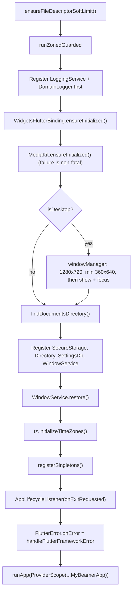
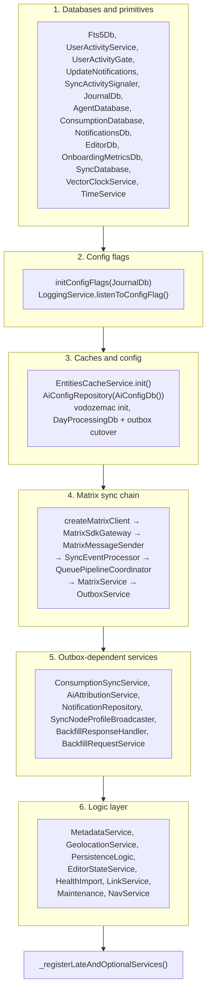

# Two containers, one boundary

Lotti runs two dependency containers side by side, and the split is not
arbitrary.

| Container | Holds | Lifetime |
|-----------|-------|----------|
| **GetIt** (`getIt`) | Process-wide services and database handles that exist before any widget does: `JournalDb`, `MatrixService`, `OutboxService`, `LoggingService`, `PersistenceLogic`. | Registered during startup, disposed at process exit. |
| **Riverpod** (`ProviderScope`) | Everything scoped to the widget tree: controllers, repositories built on top of GetIt services, UI state. | Created on first watch, disposed with its scope. |

The rule that falls out of this: **Riverpod providers may resolve GetIt
services; GetIt services must not resolve Riverpod providers.** A GetIt
singleton that needed a provider would have to reach for a container that does
not exist yet at registration time.

`main()` bridges the two exactly once, overriding a handful of providers with
the already-constructed singletons so the widget tree and the service layer
share one instance rather than building a second:

```dart
runApp(
  ProviderScope(
    overrides: [
      matrixServiceProvider.overrideWithValue(getIt<MatrixService>()),
      maintenanceProvider.overrideWithValue(getIt<Maintenance>()),
      journalDbProvider.overrideWithValue(getIt<JournalDb>()),
      syncDatabaseProvider.overrideWithValue(getIt<SyncDatabase>()),
      loggingServiceProvider.overrideWithValue(getIt<LoggingService>()),
      outboxServiceProvider.overrideWithValue(getIt<OutboxService>()),
      aiConfigRepositoryProvider.overrideWithValue(getIt<AiConfigRepository>()),
    ],
    child: const MyBeamerApp(),
  ),
);
```

# Startup sequence



Three details in that sequence are deliberate and easy to break:

- **The file-descriptor bump runs before anything opens an FD.** macOS GUI apps
  inherit launchd's soft limit of 256, which sockets, SQLite handles,
  attachments, and log files exhaust quickly. The adjustment is captured
  synchronously and only *logged* later, once `LoggingService` exists.
- **`LoggingService` and `DomainLogger` are registered before anything else**,
  so startup diagnostics and the `runZonedGuarded` error handler can resolve a
  logger. `registerSingletons()` reuses that instance rather than
  re-registering it.
- **`handleUncaughtZoneError` guards its own lookup** with
  `getIt.isRegistered<DomainLogger>()`. An error thrown before the logger
  exists must surface as itself, not as a GetIt lookup failure inside the
  handler.
- **The Flutter framework hook deduplicates identical diagnostics.** It keeps
  the first full console and file stack, then replaces repeated copies with
  periodic counted summaries. The fingerprint includes the complete stack and
  collected diagnostics, so exceptions from different call sites or widget and
  render-object contexts remain separately diagnosable. A pending sub-threshold
  burst is flushed after one minute even if no later occurrence arrives.

# Registration order inside `registerSingletons()`

`registerSingletons()` is a single long function, and its order encodes a real
dependency graph rather than a filing preference.



**Config flags gate construction.** `initConfigFlags(getIt<JournalDb>())` runs
before any service that reads a flag is built. `MatrixService`, for example,
takes `collectSyncMetrics` as a constructor argument read from
`enableLoggingFlag`.

**The sync chain has a cycle, broken by a set-once field.**
`BackfillResponseHandler` needs `OutboxService`, which needs `MatrixService`,
which needs `SyncEventProcessor`. Constructor injection cannot express that, so
`SyncEventProcessor.backfillResponseHandler` is a `late final` assigned after
both exist — and it must be assigned before `MatrixService` consumes any
inbound timeline event.

**Startup never awaits network or metrics work.** The onboarding first-seen
write, the sync-node profile broadcast, and the vector-clock burn
reconciliation are all `unawaited(...)` with their own try/catch, so a failure
is logged under its domain instead of escaping to the zone handler and taking
down boot.

**`NotificationService` is lazily registered**, and callers receive a thunk
(`() => getIt<NotificationService>()`) rather than a resolved instance, so
sandboxed builds such as the Flatpak do not initialise the platform plugin
until something actually schedules a notification.

# Shutdown

Desktop close paths converge on one ordered teardown. `AppLifecycleListener`'s
`onExitRequested` and the window-manager close event both call
`WindowService.closeWindow()`, which releases SQLite handles before the process
is allowed to exit. On macOS the immediate-exit path is only reached after
that release — exiting earlier risks a half-flushed WAL.

# Where to look

| Concern | File |
|---------|------|
| Entry point, zone guard, error handlers | [`lib/main.dart`](../../lib/main.dart) |
| Singleton graph | [`lib/get_it.dart`](../../lib/get_it.dart) |
| Late/optional and platform-conditional services | [`lib/get_it_helpers.dart`](../../lib/get_it_helpers.dart) |
| Maintenance-only registrations | [`lib/get_it_maintenance.dart`](../../lib/get_it_maintenance.dart) |
| Provider overrides bridging GetIt into Riverpod | [`lib/providers/service_providers.dart`](../../lib/providers/service_providers.dart) |

Related: [persistence](persistence.md) for the databases registered in phase 1,
[the sync feature](../features/sync/) for the chain built in phase 4.
