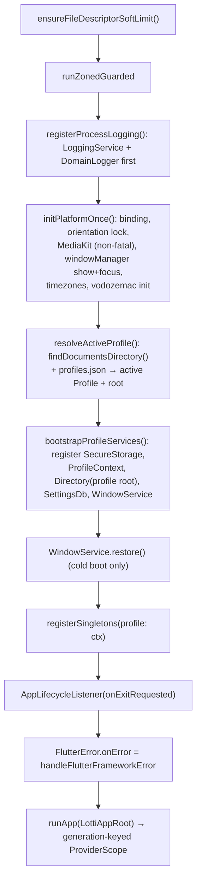
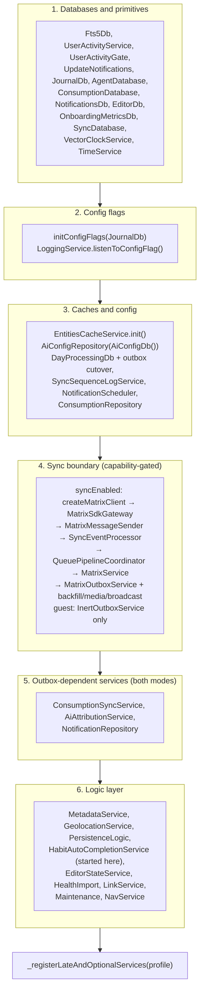
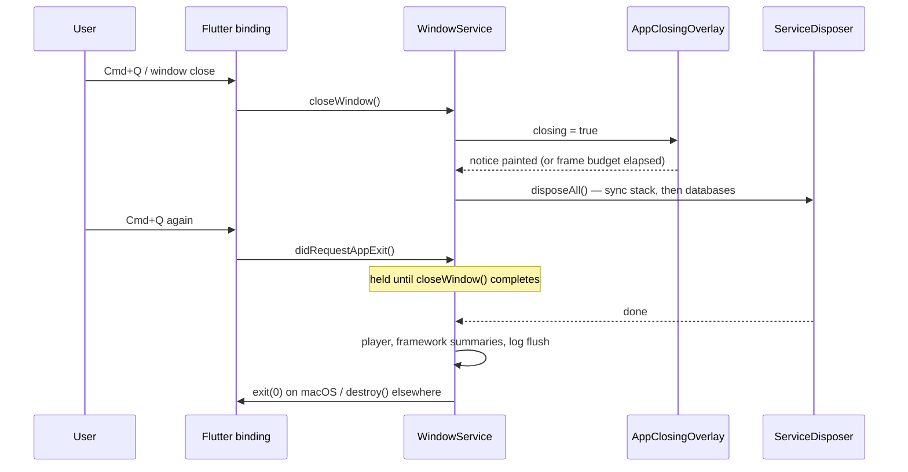

# Two containers, one boundary

Lotti runs two dependency containers side by side, and the split is not
arbitrary.

| Container | Holds | Lifetime |
|-----------|-------|----------|
| **GetIt** (`getIt`) | Profile services and database handles constructed before their widget tree: `JournalDb`, `MatrixService`, `OutboxService`, `LoggingService`, `PersistenceLogic`. | Registered per service generation, disposed on profile switch or process shutdown. |
| **Riverpod** (`ProviderScope`) | Everything scoped to the widget tree: controllers, repositories built on top of GetIt services, UI state. | Created on first watch, disposed with its scope. |

The rule that falls out of this: **Riverpod providers may resolve GetIt
services; GetIt services must not resolve Riverpod providers.** A GetIt
singleton that needed a provider would have to reach for a container that does
not exist yet at registration time.

`LottiAppRoot` bridges the two once **per service generation**:
`buildProviderOverrides()` (in `lib/app_bootstrap.dart`) overrides a handful
of providers with the already-constructed singletons, and the `ProviderScope`
carries a generation-keyed `ValueKey` so that an in-app profile switch (see
[profiles and demo mode](profiles-and-demo-mode.md)) discards the whole scope
and rebinds every provider against the freshly registered generation. In
guest worlds `matrixServiceProvider` is deliberately left unoverridden — the
Matrix stack does not exist there, and accidental resolution fails loudly.

It carries a second, different kind of override. Beyond bridging getIt
singletons, `buildProviderOverrides()` is where features that own an *agent
kind* register it with the shared agent runtime — wake runners, runtime
maintenance hooks, prompt-log wrap renderers and the Daily OS setup-sheet
launcher. Those registries live in `features/agents` and default to empty
precisely so that feature need not import the features that fill them; the
composition root is the only place permitted to see both sides. See
[agent kinds](../features/agents/overview.md#how-an-owning-feature-plugs-a-kind-in).
Unlike a missing getIt bridge, a missing registration here fails **silently** —
an unregistered kind falls through to the task-agent workflow — so the
registrations are pinned by
`test/app_bootstrap_test.dart` (the `agent runtime registrations` group).

The getIt registrations in `lib/get_it.dart` carry one seam of the same kind:
`RelationshipCascadeFactory`. The journal repository lives in `lib/logic`,
below every feature, yet its generic delete path must still write people
through the relationship repository (ADR 0037 §5). It resolves the factory,
which the composition root registers as `buildRelationshipCascade`; a missing
registration fails loudly, on the first delete of a person. The test harness
registers the same factory.

```dart
ProviderScope(
  key: ValueKey('profile-gen-$_generation'),
  overrides: buildProviderOverrides(getIt<ProfileContext>()),
  child: const MyBeamerApp(),
);
```

# Where getIt may be read

GetIt is the composition root's tool: `lib/get_it.dart` with its parts
(`lib/get_it_helpers.dart`, `lib/get_it_maintenance.dart`, `lib/get_it_sync.dart`),
`lib/app_bootstrap.dart` and `lib/main.dart` build a
generation and hand it to Riverpod. Anywhere else a `getIt<T>()` lookup is a
dependency that does not show in the constructor and that no `ProviderScope`
override can reach. Widgets and controllers watch a provider; plain services take
what they need as constructor arguments.

The codebase does not meet that yet. Roughly nine hundred lookups and 170
`getIt.isRegistered` checks sit outside the composition root, most of the latter
being test seams ("use the logger if one is wired"). `tool/di/validate.dart`
ratchets both counts per file against `tool/di/baseline.json`. It counts on the
Dart token stream, so a lookup mentioned in a comment or a string literal never
counts. CI runs it in the
analyze workflow, and `make getit_check` runs it locally. A file's count may fall
or vanish but never rise, and a file absent from the baseline may not introduce
any lookup. After migrating a file, `dart run tool/di/validate.dart
--update-baseline` tightens the baseline. It refuses while any file is above its
count, so the baseline cannot absorb growth — and the check itself fails while
any file is *below* its count, so the change that removes a lookup is the one
that records it.

Each service has **one** provider. `aiConfigRepositoryProvider` used to be
declared twice, once in `lib/providers/service_providers.dart` and once in
`lib/features/ai/repository/ai_config_repository.dart`. Which one a widget read
then depended on its imports, so a test override could silently miss. When you
bridge a service, check first that no provider for it already exists.

# Startup sequence

The bootstrap is split along the profile-switch boundary
(`lib/app_bootstrap.dart`): `initPlatformOnce()` runs exactly once per process.
`registerProcessLogging()`, `resolveActiveProfile()`, and
`bootstrapProfileServices()` run once per service generation — on cold boot
and again after every in-app profile switch. Each generation has its own
logging pair; destination binding is described in
[logging and diagnostics](logging-and-diagnostics.md).


```mermaid
flowchart TD
  FD["ensureFileDescriptorSoftLimit()"] --> Zone["runZonedGuarded"]
  Zone --> Log["registerProcessLogging(): LoggingService + DomainLogger first"]
  Log --> Platform["initPlatformOnce(): binding, orientation lock,<br/>MediaKit (non-fatal), windowManager show+focus,<br/>timezones, vodozemac init"]
  Platform --> Resolve["resolveActiveProfile(): findDocumentsDirectory()<br/>+ profiles.json → active Profile + root"]
  Resolve --> Early["bootstrapProfileServices(): register SecureStorage,<br/>ProfileContext, Directory(profile root), SettingsDb, WindowService"]
  Early --> Restore["WindowService.restore() (cold boot only)"]
  Restore --> Singletons["registerSingletons(profile: ctx)"]
  Singletons --> Lifecycle["AppLifecycleListener(onExitRequested)"]
  Lifecycle --> ErrorHook["FlutterError.onError = handleFlutterFrameworkError"]
  ErrorHook --> Run["runApp(LottiAppRoot) → generation-keyed ProviderScope"]
```

The registered `Directory` is the **active profile root**, not the raw OS
documents directory — every database open and file write resolves through it
(`openDbConnection` falls back to it; see
[profiles and demo mode](profiles-and-demo-mode.md) for the isolation
contract).

Four details in that sequence are deliberate and easy to break:

- **The file-descriptor bump runs before anything opens an FD.** macOS GUI apps
  inherit launchd's soft limit of 256, which sockets, SQLite handles,
  attachments, and log files exhaust quickly. The adjustment is captured
  synchronously and only *logged* later, once `LoggingService` exists.
- **`LoggingService` and `DomainLogger` are registered before anything else**,
  so startup diagnostics and the `runZonedGuarded` error handler can resolve a
  logger. `registerSingletons()` reuses that instance rather than
  re-registering it.
- **`handleUncaughtZoneError` guards its own lookup** with
  `getIt.isRegistered<DomainLogger>()`. An error thrown before the logger
  exists must surface as itself, not as a GetIt lookup failure inside the
  handler.
- **The Flutter framework hook bounds repeated diagnostics before they reach
  durable logging.** The fingerprinting and sampling contract lives in
  [Logging and diagnostics](logging-and-diagnostics.md#the-gate-and-what-bypasses-it).

# Registration order inside `registerSingletons()`

`registerSingletons({required ProfileContext profile})` is a single long
function, and its order encodes a real dependency graph rather than a filing
preference. The Matrix phase is conditional on the profile's capabilities:
real profiles build the full sync stack (`_registerMatrixSyncStack` in
`lib/get_it_sync.dart`), guest/demo worlds register only an
`InertOutboxService` — no Matrix client, no inbound queue, no backfill
timers, no startup broadcast (see
[profiles and demo mode](profiles-and-demo-mode.md)).


```mermaid
flowchart TD
  subgraph Phase1["1. Databases and primitives"]
    P1["Fts5Db, UserActivityService, UserActivityGate,<br/>UpdateNotifications, JournalDb, AgentDatabase,<br/>ConsumptionDatabase, NotificationsDb, EditorDb,<br/>OnboardingMetricsDb, SyncDatabase,<br/>VectorClockService, TimeService"]
  end
  subgraph Phase2["2. Config flags"]
    P2["initConfigFlags(JournalDb)<br/>LoggingService.listenToConfigFlag()"]
  end
  subgraph Phase3["3. Caches and config"]
    P3["EntitiesCacheService.init()<br/>AiConfigRepository(AiConfigDb())<br/>DayProcessingDb + outbox cutover,<br/>SyncSequenceLogService, NotificationScheduler,<br/>ConsumptionRepository"]
  end
  subgraph Phase4["4. Sync boundary (capability-gated)"]
    P4["syncEnabled: createMatrixClient → MatrixSdkGateway<br/>→ MatrixMessageSender → SyncEventProcessor<br/>→ QueuePipelineCoordinator → MatrixService<br/>→ MatrixOutboxService + backfill/media/broadcast<br/>guest: InertOutboxService only"]
  end
  subgraph Phase5["5. Outbox-dependent services (both modes)"]
    P5["ConsumptionSyncService, AiAttributionService,<br/>NotificationRepository"]
  end
  subgraph Phase6["6. Logic layer"]
    P6["MetadataService, GeolocationService, PersistenceLogic,<br/>HabitAutoCompletionService (started here),<br/>EditorStateService, HealthImport, LinkService,<br/>Maintenance, NavService"]
  end
  Phase1 --> Phase2 --> Phase3 --> Phase4 --> Phase5 --> Phase6
  Phase6 --> Late["_registerLateAndOptionalServices(profile)"]
```

**Config flags gate construction.** `initConfigFlags(getIt<JournalDb>())` runs
before any service that reads a flag is built. `MatrixService`, for example,
takes `collectSyncMetrics` as a constructor argument read from
`enableLoggingFlag`.

**The sync chain has a cycle, broken by a set-once field.**
`BackfillResponseHandler` needs `OutboxService`, which needs `MatrixService`,
which needs `SyncEventProcessor`. Constructor injection cannot express that, so
`SyncEventProcessor.backfillResponseHandler` is a `late final` assigned after
both exist — and it must be assigned before `MatrixService` consumes any
inbound timeline event.

**Startup never awaits network or metrics work.** The onboarding first-seen
write, the sync-node profile broadcast, and the vector-clock burn
reconciliation are all `unawaited(...)` with their own try/catch, so a failure
is logged under its domain instead of escaping to the zone handler and taking
down boot.

**`NotificationService` is lazily registered**, and callers receive a thunk
(`() => getIt<NotificationService>()`) rather than a resolved instance, so
start-up on Linux and Windows never initialises the platform plugin — which is
what keeps a sandboxed build such as the Flatpak startable when plugin
registration fails.

On the platforms Lotti notifies on, start-up *does* resolve it, deliberately:
`routeNotificationLaunch` reads the launching notification right after
`restoreNavigationState`, and iOS parks any tap that arrives before the plugin
is initialised, so an uninitialised plugin would swallow warm taps too (see
[a tap on the OS alert opens the same place](../features/notifications.md#a-tap-on-the-os-alert-opens-the-same-place)).
Where the launch read is skipped, the first resolution is the **first entry
write**, because `updateBadge()` runs at the end of every `createDbEntity` —
before anything has been scheduled and regardless of whether notifications
are switched on at all. Toggling the notifications config flag resolves it
too.

**Construction must therefore be free of user-visible side effects**,
permission prompts above all: the moment it happens is arbitrary from the
user's point of view, and delivery is gated separately and later. What the
plugin may ask the OS for, and when, is in
[synced notifications](../features/notifications.md#nothing-reaches-the-os-before-the-config-flag-says-so).

# Shutdown

`ServiceDisposer` stops `HabitAutoCompletionService` first — it holds a
journal-update subscription and timers that must not fire into a closing
database — before the sync stack and then every Drift database in order.

Desktop close paths converge on one ordered teardown. `AppLifecycleListener`'s
`onExitRequested` and the window-manager close event both call
`WindowService.closeWindow()`, which releases SQLite handles before the process
is allowed to exit. On macOS the immediate-exit path is only reached after
that release — exiting earlier risks a half-flushed WAL. The pre-flush callback
then drains pending framework-error counts after service/player teardown and
immediately before `LoggingService.flush()`, as described in
[Logging and diagnostics](logging-and-diagnostics.md#the-gate-and-what-bypasses-it).

Closing every database takes a few seconds, so a quit is made visible.
`closeWindow()` first raises `WindowService.closing`; `AppClosingOverlay`, in
`MaterialApp.router`'s builder, answers with an undismissable scrim and a
spinner card over every page and dialog, and takes focus away from the shell so
nothing keeps typing into a closing store. The macOS menu bar
(`DesktopMenuWrapper`) takes the same flag and drops every item's handler,
because native menu key equivalents are dispatched outside Flutter's focus tree
and would slip past the overlay. Teardown waits for the frame that carries the
notice, bounded by `closingNoticeFrameBudget` because an occluded window may
never render it, and skipped entirely when frames are disabled (a hidden window,
or a detached engine on SIGTERM or logout); a failure there is logged and never
blocks the quit. The flag is never lowered — the process ends with the notice up.

A second Cmd+Q during teardown cannot cut it short. `WindowService` is itself a
`WidgetsBindingObserver`, and its `didRequestAppExit` holds any exit request
until the running `closeWindow()` has finished — including after the
`AppLifecycleListener` was disposed by the pre-flush callback, which would
otherwise let the framework answer "exit" at once.


```mermaid
sequenceDiagram
  participant U as User
  participant F as Flutter binding
  participant W as WindowService
  participant O as AppClosingOverlay
  participant D as ServiceDisposer
  U->>F: Cmd+Q / window close
  F->>W: closeWindow()
  W->>O: closing = true
  O-->>W: notice painted (or frame budget elapsed)
  W->>D: disposeAll() — sync stack, then databases
  U->>F: Cmd+Q again
  F->>W: didRequestAppExit()
  Note over W: held until closeWindow() completes
  D-->>W: done
  W->>W: player, framework summaries, log flush
  W->>F: exit(0) on macOS / destroy() elsewhere
```

# Where to look

| Concern | File |
|---------|------|
| Entry point, zone guard, error handlers | [`lib/main.dart`](../../lib/main.dart) |
| Process-once vs per-generation bootstrap | [`lib/app_bootstrap.dart`](../../lib/app_bootstrap.dart) |
| Generation-keyed ProviderScope + switch splash | [`lib/app_root.dart`](../../lib/app_root.dart) |
| Ordered shutdown, repeated-quit guard | [`lib/services/window_service.dart`](../../lib/services/window_service.dart) |
| Closing notice shown during a quit | [`lib/widgets/app_closing_overlay.dart`](../../lib/widgets/app_closing_overlay.dart) |
| Singleton graph | [`lib/get_it.dart`](../../lib/get_it.dart) |
| Capability-gated sync registration | [`lib/get_it_sync.dart`](../../lib/get_it_sync.dart) |
| Late/optional and platform-conditional services | [`lib/get_it_helpers.dart`](../../lib/get_it_helpers.dart) |
| Maintenance-only registrations | [`lib/get_it_maintenance.dart`](../../lib/get_it_maintenance.dart) |
| Provider overrides bridging GetIt into Riverpod | [`lib/providers/service_providers.dart`](../../lib/providers/service_providers.dart) |

Related: [persistence](persistence.md) for the databases registered in phase 1,
[the sync feature](../features/sync/) for the chain built in phase 4.
