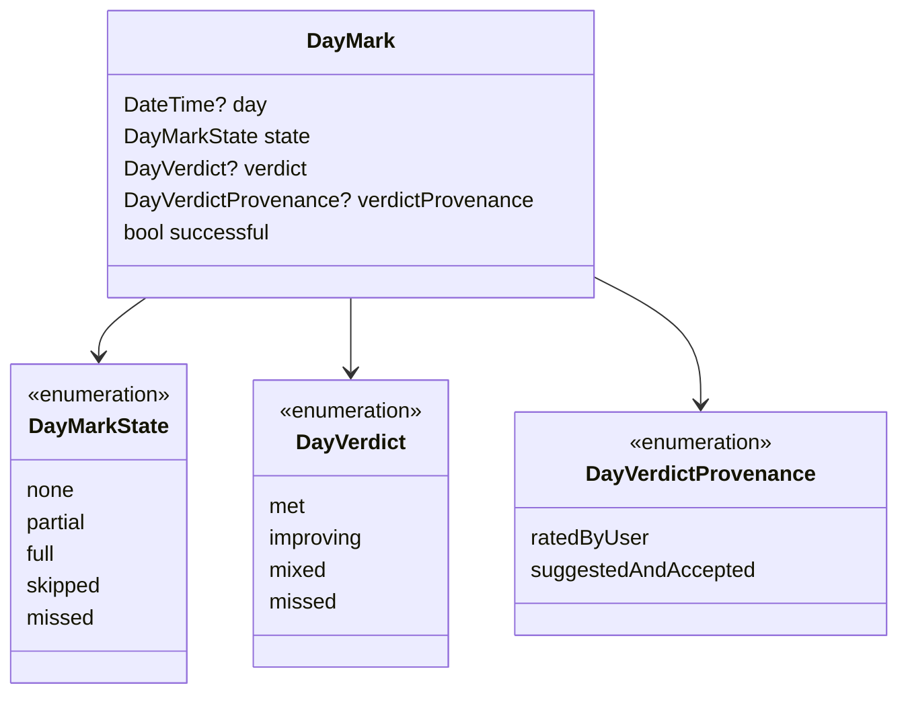
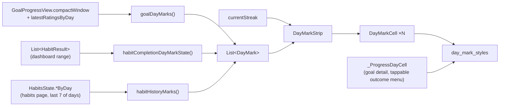
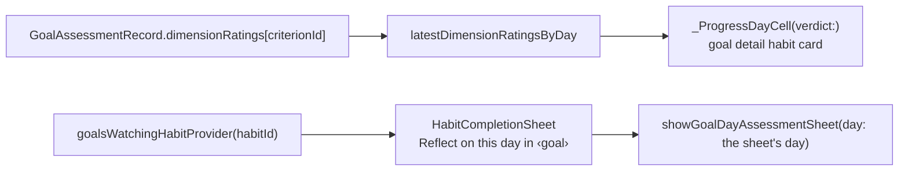

`lib/widgets/day_indicators/` exists because a goal's habit dimension and a
habit's own history strip are **two views of the same day**, and for a while
they drew it two ways — different fills, different corner radii, one with a
today ring and one without. The package draws the square the habits design
handover specifies — an 11px `--interactive` square at radius 3 in a 3px-gap
row, rendered at `IconSizes.xs`, `radii.xs` and `spacing.step2` — and both
features consume it. It imports neither `features/goals` nor
`features/habits`; each feature adapts its own state into the shared model.

# The model

- **`DayMarkState` is what the app measured.** `full` means the requirement
  held as of that day; `partial` means the routine was kept while a window
  target was still building (a wash of the kept fill); `skipped` and
  `missed` are recorded habit outcomes. The strip is a record of what was
  KEPT, so `skipped`, `missed` and `none` share the neutral fill — which of
  the three a grey square stands for is said in its tooltip and semantics,
  never drawn.
- **`DayVerdict` is the user's ruling**, and a recorded verdict outranks the
  measurement wherever both are shown. The enum is persisted by `name` in
  goal assessment records (see [goals](../features/goals.md)), so the names
  are frozen even though the type moved here.
- **`day` is nullable** only for undated figures — a loading placeholder or a
  streak chain, whose squares stand for a count of days. A tappable strip
  asserts that every mark is dated, because a tap must resolve to a day.
- **`isToday` marks the open day, not a ring.** An empty, unjudged today
  (`DayMark.pending`) draws as the dashed unresolved outline — the same
  encoding a loading placeholder uses — so an alive streak never ends on the
  grey of a missed day; a kept or judged today is an ordinary square. The
  tooltip names the date, and a tappable square carries its weekday initial
  above it inside the hit slot (`DayMarkCell.caption`, `dayCellWithCaption`)
  because an action has to say which day it acts on.

# The component set

| Piece | File | Role |
| --- | --- | --- |
| Fills, labels, the verdict scheme | `day_mark_styles.dart` | The ONE mapping from state/verdict to token colors. `dayVerdictGlyph` and `dayVerdictSurfaceInk` serve the reflections history and the reflect button, not the squares. |
| `DayTrack`, `dayTrackMetrics`, `fitOrScrollDayTrack`, `LinkedDayTrackScroller` | `day_track.dart` | Column geometry shared by every day row on a page — one square plus `step2` — and the fit-or-pan policy. |
| `kDaySquareSize`, `DayMarkCell`, `PlaceholderDayCell` | `day_mark_cell.dart` | One square, nothing inside it. Read-only by default; with `onTap` it becomes a labelled button whose hit slot clears the touch floor while the square keeps its size. |
| `DayMarkStrip` | `day_mark_strip.dart` | A row of squares on the shared track with one semantic summary, and — with `streak` — the handover's flame and count after the last square. |

# Invariants

- **Two fills for a measured day.** A kept day is `interactive.enabled` —
  the handover's `--interactive` square — a partial day its `muted` wash, and
  everything else `background.level03`. No alert hue on a habit square: a
  struggling habit is never a wall of red.
- **Nothing is drawn inside or around a square.** No glyph, no ring around
  a filled square, no dot. The words — weekday and date, outcome, verdict, ages-out — live in
  the `DsTooltip` and the semantics of every dated square; only a TAPPABLE
  square adds a one-letter weekday caption above itself.
- **Verdict hues are the goal-assessment layer's.** The whole-goal strip and
  the goal detail's habit rows paint a recorded verdict in its own hue — met
  in the same interactive green a kept day wears, so a card is a baseline
  plus judgements rather than two greens; the habit dashboard strip and the
  habits page rows show measured outcomes only.
- **Read-only strips publish one semantics node** (the successful-day count,
  or the streak length, plus any verdicts); tappable strips publish one
  button per day, each naming its date and outcome.
- **A verdict outranks a state** for the fill and the success tally.
- **One pitch per page.** Anything that draws days on a goal detail page —
  the whole-goal strip, the habit squares, the metric bars, the page chrome —
  sizes its columns with `dayTrackMetrics` so a date lines up down the page.

# Gotchas

- `_ProgressDayCell` in `goal_progress_card.dart` is not a `DayMarkCell`: it
  hosts the outcome menu and the saving spinner. It draws the same
  `kDaySquareSize` square with the shared styles and the shared state enum,
  so its squares still match; only its interaction shell is its own. The
  ages-out fact it used to draw as an outline is a tooltip line now.
- A tappable track is `TapTargets.minimum` tall with the caption and square
  centred in it, so the cards drop the `step1` they put above a read-only
  track — the slot brings its own air.
- The habits page rows and the dashboard card pass `HabitActionRow.history`
  (a `List<DayMark>`) plus `currentStreak`; the row renders one
  `DayMarkStrip(streak:)`. There is no separate streak chain.
- The habit dashboard strip used to drop its oldest days to fit; it now pans
  like every other track. There is no `LinkedScrollGroup` on a dashboard, so
  each card pans alone.
- The strip's semantics strings are still the `goalProgress*` l10n keys. They
  read generically ("3 successful days in the trailing seven-day window") and
  renaming them would touch every catalogue for no user-visible change.

# Verdicts reach the habit side

A verdict is always a goal's: `GoalAssessmentRecord.dimensionRatings` files
the user's per-dimension ruling under the goal's criterion id. Habits reach
those rulings through `lib/features/goals/state/goal_habit_watchers.dart`:

- `goalsWatchingHabitProvider(habitId)` — the active goals whose current spec
  names the habit, each with the criterion id the habit is filed under. It
  feeds the completion sheet's reflect actions; the habit strips themselves
  do not paint verdicts.
- `latestDimensionRatingsByDay` in `goal_assessment_state.dart` is the
  per-dimension sibling of `latestRatingsByDay`, and what the goal detail
  page feeds its own habit cells.

The habit sheet is the reflect doorway on the habit side because it already
knows the day: reflecting on a backfilled day judges that day, not today. The
reflection sheet itself stays the goal's — it needs the goal's spec, progress
view and history — so the habit only contributes the day.

# There is no key

The squares carry their own meaning — kept or not, at a glance — and every
dated square answers hover or long-press with its day and its outcome or
verdict. A static key was tried twice — an eleven-entry wrap under
a dashboard, then a present-states-only line under the goal's habit squares —
and a design-review panel rated both as more legend than data. Do not
reintroduce one; if a mark needs explaining, give the mark a better cue or a
better tooltip.

# Cell sizing is a decision, not a gap

Cells never size proportionally to a value or a count, and they never
shrink or grow: every day track sizes its columns from `dayTrackMetrics` —
one square, `step2` of air, widened only when scaled text needs the
weekday caption — and a span that does not fit its width pans. A proportional cell (wider for a longer window, taller
for a bigger number) was considered in the 2026-08-15 audit and rejected: a
date has to line up down the page across strips, habit squares and metric
bars, which one grid guarantees and per-cell sizing cannot. Longer spans are
handled the same way — the habits chart offers 14/30/90 days, the goal detail
page keys every track to its shared range, and a dashboard strip follows the
dashboard's range — never by a differently-shaped cell.
