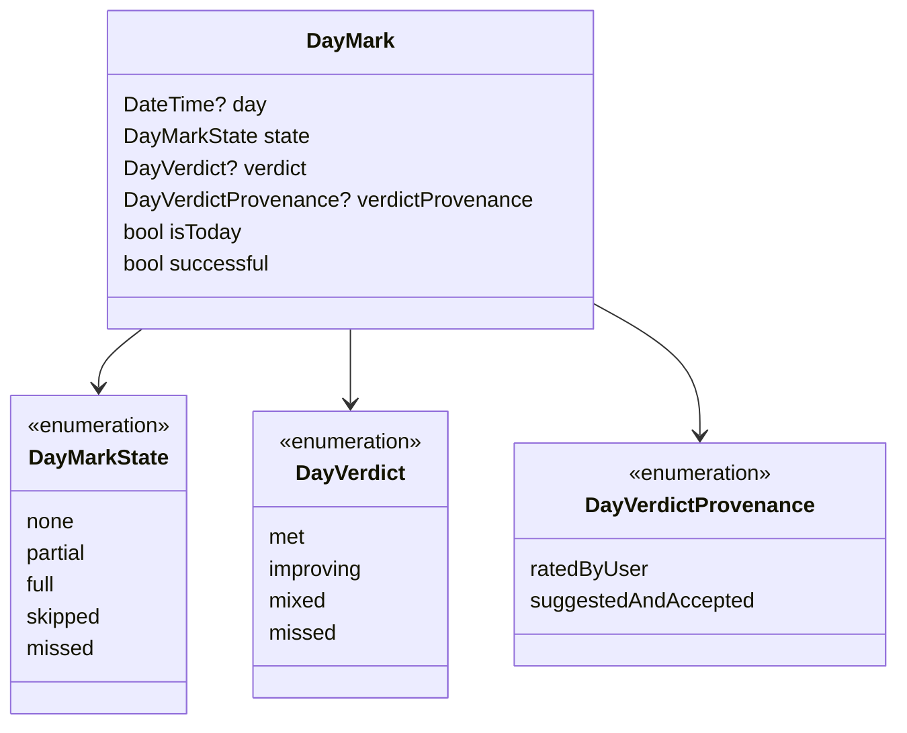
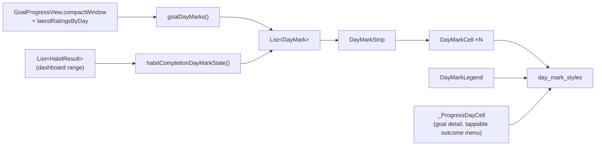
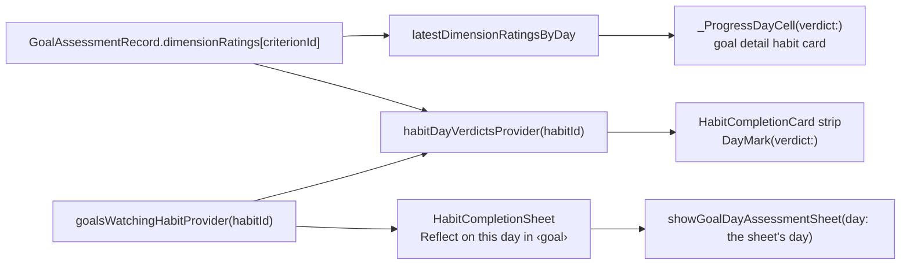

`lib/widgets/day_indicators/` exists because a goal's habit dimension and a
habit's own history strip are **two views of the same day**, and for a while
they drew it two ways — different fills, different corner radii, one with a
today ring and one without. The package promotes the goal side's primitives
into a module both features consume. It imports neither `features/goals` nor
`features/habits`; each feature adapts its own state into the shared model.

# The model

- **`DayMarkState` is what the app measured.** `full` means the requirement
  held as of that day; `partial` means the routine was kept while a window
  target was still building (the lighter wash plus a dot); `skipped` and
  `missed` are recorded habit outcomes. `missed` is never the grey of `none`:
  deciding a day was missed and never looking at it are different facts.
- **`DayVerdict` is the user's ruling**, and a recorded verdict outranks the
  measurement wherever both are shown. The enum is persisted by `name` in
  goal assessment records (see [goals](../features/goals.md)), so the names
  are frozen even though the type moved here.
- **`day` is nullable** only for undated figures — a loading placeholder or a
  strip whose cells carry no dates and therefore no weekday letters. A
  tappable strip asserts that every mark is dated, because a tap must resolve
  to a day.
- **`isToday` is explicit.** The goal adapter flags the last cell; the habit
  card compares each day against `clock.now()`.

# The component set

| Piece | File | Role |
| --- | --- | --- |
| Fills, glyphs, inks, labels, letter, ring, dot | `day_mark_styles.dart` | The ONE mapping from state/verdict to token colors and shapes. Every cell and every legend swatch goes through it. |
| `DayTrack`, `dayTrackMetrics`, `fitOrScrollDayTrack`, `LinkedDayTrackScroller` | `day_track.dart` | Column geometry shared by every day row on a page, and the fit-or-pan policy. |
| `DayMarkCell`, `PlaceholderDayCell` | `day_mark_cell.dart` | One square. Read-only by default; with `onTap` it becomes a labelled button whose hit slot clears the touch floor while the square keeps its size. |
| `DayMarkStrip` | `day_mark_strip.dart` | A row of cells with one semantic summary; dated strips sit on the shared track, undated ones on a plain row. |
| `DayMarkLegend` | `day_mark_legend.dart` | The key, drawn from the same helpers as the cells. |

# Invariants

- **Data never wears the interactive teal.** States use the `alert` families
  and `background.level03`; the today ring is `text.mediumEmphasis`.
- **Every non-neutral state has a non-color cue**: the partial dot, the skip
  dash, the missed cross, a verdict's own glyph. A red-green deficiency can
  read the strip.
- **Read-only strips publish one semantics node** (the successful-day count
  plus any verdicts); tappable strips publish one button per day, each naming
  its date and outcome.
- **A verdict outranks a state** for fill, glyph and the success tally.
- **One pitch per page.** Anything that draws days on a goal detail page —
  the whole-goal strip, the habit squares, the metric bars, the page chrome —
  sizes its columns with `dayTrackMetrics` so a date lines up down the page.

# Gotchas

- `_ProgressDayCell` in `goal_progress_card.dart` is not a `DayMarkCell`: it
  hosts the outcome menu, the saving spinner and the ages-out ring. It draws
  with the shared styles and the shared state enum, so its squares still
  match; only its interaction shell is its own.
- The habit dashboard strip used to drop its oldest days to fit; it now pans
  like every other track. There is no `LinkedScrollGroup` on a dashboard, so
  each card pans alone.
- The strip's semantics strings are still the `goalProgress*` l10n keys. They
  read generically ("3 successful days in the trailing seven-day window") and
  renaming them would touch every catalogue for no user-visible change.

# Verdicts reach the habit side

A verdict is always a goal's: `GoalAssessmentRecord.dimensionRatings` files
the user's per-dimension ruling under the goal's criterion id. Habits reach
those rulings through `lib/features/goals/state/goal_habit_watchers.dart`:

- `goalsWatchingHabitProvider(habitId)` — the active goals whose current spec
  names the habit, each with the criterion id the habit is filed under.
- `habitDayVerdictsProvider(habitId)` — the verdict standing for each of the
  habit's days across every watching goal, keyed by UTC day; when two goals
  judged one day, the most recently recorded judgement wins.
- `latestDimensionRatingsByDay` in `goal_assessment_state.dart` is the
  per-dimension sibling of `latestRatingsByDay`, and what the goal detail
  page feeds its own habit cells.

The habit sheet is the reflect doorway on the habit side because it already
knows the day: reflecting on a backfilled day judges that day, not today. The
reflection sheet itself stays the goal's — it needs the goal's spec, progress
view and history — so the habit only contributes the day.

# The legend keys only what is on the strip

`DayMarkLegend` takes the states and verdicts *present* on the strip it sits
under and keys only what a reader cannot get from the mark itself: the
colour-only states (done, done-but-target-still-building with its dot, no
entry), the two rings where the strip draws them, and the verdict hues a
judged day wears. It never lists the outcome glyphs — the skip dash and the
missed cross name themselves, and every cell answers hover with its day and
outcome — and it renders nothing when nothing needs keying.

It rides in exactly one place: inside the goal detail's first habit card,
derived from that habit's days (`goalProgressDayMarkState`) and its
per-dimension verdicts. Dashboards and the whole-goal week card carry no key.
A design-review panel rated the earlier eleven-entry wrap under a dashboard
at 3.6/10: more legend than data, listing states that were not on screen,
and two red crosses with different names.

# Cell sizing is a decision, not a gap

Cells never size proportionally to a value or a count. Every day track sizes
its columns from `dayTrackMetrics`: one pitch per page derived from the
available width, the square shrinking with its column down to `IconSizes.xs`
and never growing past `ControlSizes.iconChipCompact`, and a track that
still cannot fit pans. A proportional cell (wider for a longer window, taller
for a bigger number) was considered in the 2026-08-15 audit and rejected: a
date has to line up down the page across strips, habit squares and metric
bars, which one grid guarantees and per-cell sizing cannot. Longer spans are
handled the same way — the habits chart offers 14/30/90 days, the goal detail
page keys every track to its shared range, and a dashboard strip follows the
dashboard's range — never by a differently-shaped cell.
