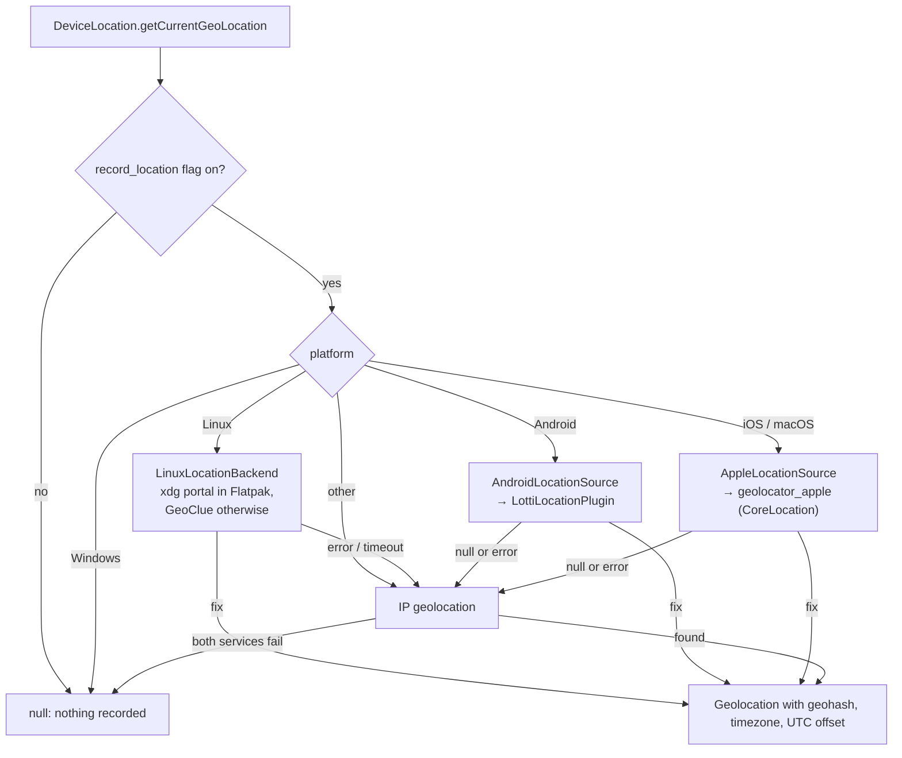
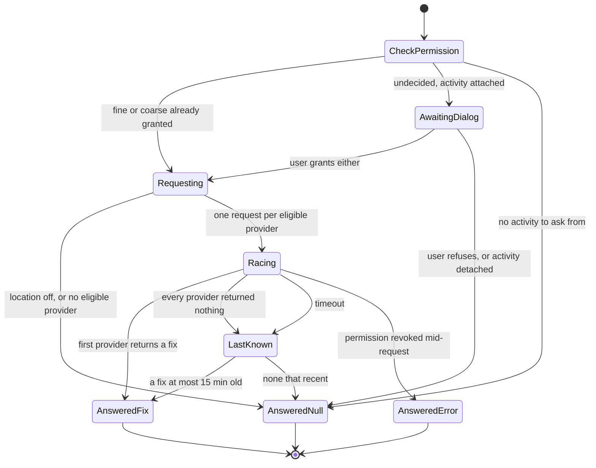

# What asks for a location, and when

A location is read **once per entry, when it is created**, and never
overwritten. Entry creation calls `PersistenceLogic.addGeolocation`, which hands
off to [`GeolocationService`](../../lib/logic/services/geolocation_service.dart)
fire-and-forget: the entry is saved first, and the geolocation arrives later
as an ordinary update. The service guards against two concurrent reads for the
same entry and skips an entry that already has a geolocation.

`GeolocationService` owns an optional
[`DeviceLocation`](../../lib/utils/location.dart), registered in
[`get_it.dart`](../../lib/get_it.dart) on every platform except Windows, which
records no location at all.

# Routing

- The platform is read from the flags in
  [`utils/platform.dart`](../../lib/utils/platform.dart), not `Platform.*`, so
  tests pin it and every branch runs on any host.
- `defaultNativeLocationSource()` makes the native choice; a test injects its
  own `NativeLocationSource` instead.
- Every native read is bounded by `LocationConstants.locationTimeout` (10 s).
- A native **null** means an expected outcome — permission refused, location
  switched off, no valid fix — and falls back silently. A native **error** is
  logged under `LogDomain.location` / `native_location_fallback` before
  falling back.

# No Google Play Services

**Nothing may link Google Play Services' fused location provider**, because the
Android build has to run on de-Googled phones and be buildable for F-Droid.
That rules out the `location` and `geolocator` packages as they ship: both
pull in `play-services-location` on Android.

- **Android** is open source end to end: the AOSP `LocationManager` with
  AndroidX, through the app's own plugin.
- **Linux** uses xdg-desktop-portal and GeoClue, also open source.
- **iOS and macOS** get the location from CoreLocation, Apple's own
  proprietary framework, through the open-source `geolocator_apple` plugin —
  the Apple implementation behind `geolocator`, used without the front-end
  package that would drag its Android side in. No third-party SDK sits in
  between.

One consequence is visible to users: **Lotti never asks to switch location
services on.** Android's in-app prompt for that is a Play Services API, and
Apple platforms have none. With services off, entries get the IP fallback.

# Apple: `AppleLocationSource`

1. Location services off → null, without touching permission.
2. Permission `denied` (never decided) → ask once. Anything but `whileInUse` or
   `always` afterwards → null. `deniedForever` is never re-asked.
3. `getCurrentPosition` with the timeout as `timeLimit`; a timeout throws.
4. CoreLocation's "invalid" markers are not stored as measurements:
   - negative horizontal accuracy means the coordinates themselves are invalid
     → null, no fix;
   - altitude is kept only when its vertical accuracy is positive — otherwise
     it is a 0 placeholder, not sea level;
   - a negative course, speed or speed accuracy means unknown → null field.

Usage strings live in `ios/Runner/Info.plist` and `macos/Runner/Info.plist`;
the macOS sandbox entitlement is `com.apple.security.personal-information.location`.

# Android: `LottiLocationPlugin`

An in-app plugin registered in `MainActivity`, next to the timezone and health
plugins, on the channel `com.matthiasn.lotti/location`. `AndroidLocationSource`
calls `getCurrentLocation` with a `timeoutMs` argument and gets back a map of
the fix, or null.

- **Permission.** `ACCESS_FINE_LOCATION` and `ACCESS_COARSE_LOCATION` are
  declared in the app manifest and requested together, so Android 12+ can
  offer "approximate". Calls that arrive while the dialog is up queue behind
  it rather than opening a second one. A rotation keeps them queued; losing
  the activity answers them null.
- **Providers are raced, not ranked.** Eligible are Android's own fused
  provider (API 31+, part of AOSP), the network provider when enabled, and GPS
  when enabled *and* precise permission was granted. All are asked at once,
  each with its own `CancellationSignal` (a signal holds one cancel listener,
  so a shared one would stop only the last request); the first real fix wins
  and cancels the rest. Committing to one provider is unsafe on de-Googled
  phones, whose network provider can report itself enabled with nothing
  behind it.
- **Timeout.** A main-thread timer cancels every request. Then, or when every
  provider has come back empty, the freshest last-known fix from any enabled
  provider stands in if it is at most 15 minutes old.
- `FOREGROUND_SERVICE_LOCATION` is removed from the merged manifest: location
  is only ever read in the foreground.

# Linux

The Flatpak build asks through the xdg-desktop-portal Location portal, so
the app appears under the desktop's location permissions. A build run outside
Flatpak talks to GeoClue directly, because the portal refuses unsandboxed
callers. Both backends are closed after every read, and a failing close never
discards a fix it already produced.

# IP fallback

[`IpGeolocationService`](../../lib/services/ip_geolocation_service.dart) asks
`ipapi.co`, then `ip-api.com`, each with a 5 s timeout, and records the
result with a fixed ~50 km accuracy. **This sends the device's public IP
address to a third party**, and it is what every platform falls back to
whenever location recording is on and the native path yields nothing. The
recording flag is the one switch that stops both.
