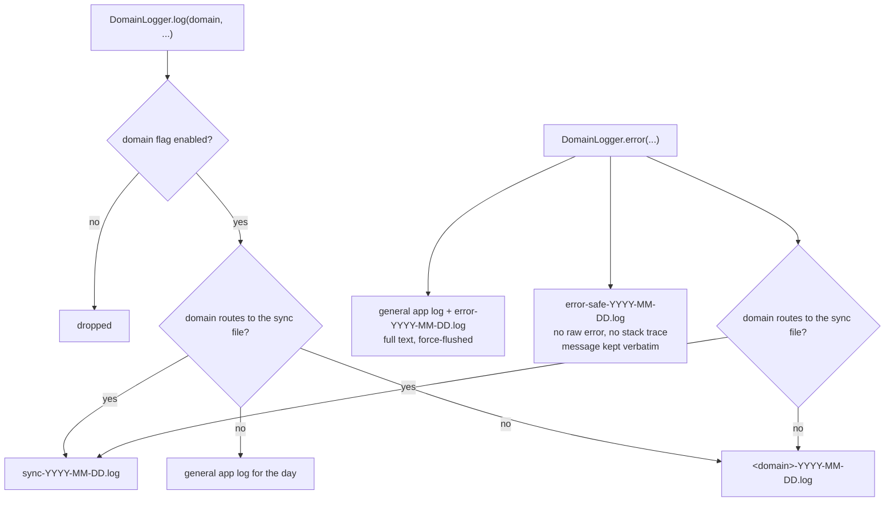

# A closed set of domains

Lotti's logging is **domain-scoped and off by default**. `LogDomain` is a Dart
enum, and it is the single source of truth: each value carries the config-flag
name, the Settings label, the default state and the file it routes to. There
are 24 of them:

`sync`, `ai`, `chat`, `speech`, `persistence`, `database`, `agentRuntime`,
`agentWorkflow`, `tasks`, `labels`, `health`, `habits`, `location`,
`screenshots`, `calendar`, `navigation`, `theming`, `notifications`,
`whatsNew`, `onboarding`, `settings`, `ratings`, `dailyOs`, `general`.

The enum consolidated roughly 70 ad-hoc domain strings that had accumulated as
free text. The original fine-grained string was not thrown away — it survives as
the `subDomain` argument, so a line still says *which* part of sync spoke, while
the domain stays enumerable, toggleable and greppable.

```dart
getIt<DomainLogger>().log(
  LogDomain.sync,
  'vc.burn.broadcast host=$hostId counter=$counter',
  subDomain: 'vc.burn.broadcast',
);
```

Adding a domain means adding an enum value. That single edit wires the config
flag, the Settings toggle, the file routing and the stable wire name at once —
there is no separate registry to keep in step.

# The gate, and what bypasses it



**A production `DomainLogger.error` call targets four files**: the general log,
the full `error-<date>.log` mirror, the PII-safe `error-safe-<date>.log`, and then
either the shared `sync-<date>.log` or its own `<domain>-<date>.log`.

**The PII-safe log is the one to know about — and its guarantee is conditional.**
`error-safe-<date>.log` omits two things that reliably carry content: the raw
exception string and the stack trace (whose frames embed absolute paths, and with
them the user's system username). What it does **not** omit is the caller's
`message`: `safeErrorDescription` renders `'<message> (errorType=<Type>)'`
verbatim.

So the file is shareable **because callers are required to treat a log message as
telemetry, never as content** — the contract `DomainLogger` states — not because
the sink sanitises it. Putting a task title or a transcript in `message` puts it in
the shareable log. The full mirror is for diagnosis on the device; this one is what
may leave it, and that only holds if the contract does.

There are therefore more files on disk than routing suggests — and two more that
`LoggingService` does not own at all: `slow_queries` and `super_slow_queries`, both
written by the database interceptor.

**Files are the only sink.** There is no database table and no in-app log viewer.
The `InsightType` parameter on the capture methods is vestigial — no reader in the
app ever consults it — so diagnosing a report means reading the log files off the
device, not opening a screen.

**Errors are always logged**, whether or not their domain is enabled. A user who
has everything toggled off still produces a diagnosable record when something
breaks; only the chatty success path is silenced.

The global Flutter framework hook bounds one special amplification case before
it reaches that always-on path. A SHA-256 fingerprint covers the exception type
and text, library, context, stack and rendered `informationCollector`
diagnostics. The first observation keeps Flutter's full console presentation,
durable stack, and collected widget/render-object diagnostics; identical
repeats emit only a counted, stack-free summary every 100 observations. A timer
flushes any smaller pending burst after at most one minute even when the error
stops recurring. Orderly shutdown drains pending counts after service and
player teardown, immediately before the final log flush, so a short burst from
either normal operation or teardown is not lost when the app closes inside
that minute. Distinct fingerprints remain independent, and an LRU cap of 256
signatures bounds the in-memory sampler itself. Evicting a fingerprint emits
its pending count before removing the state. This preserves both the diagnostic
context and evidence of a rebuild loop without allowing one framework
exception to generate an unbounded error file.

**Routine `sync` events omit the general log.** Sync is off by default;
a catch-up can produce thousands of lines in a second. Those events go to
`sync-<date>.log` without burying the rest of the app's general telemetry.

Flags are toggled in *Settings → Advanced → Logging Domains* and stored as
config flags in `JournalDb`. `domainLoggerProvider` listens to each domain flag
and updates the shared logger in place without restarting the agent runtime.
`LoggingService.listenToConfigFlag()` separately tracks the general logging and
slow-query flags, so these gates also update without a restart.

# File writing is batched

`LoggingService` owns the shared file sink for general, sync, per-domain and
safe-error files. Routine lines are buffered per file stem and flushed on a
**500 ms** timer or after **40 lines**. Domain logging no longer creates a
synchronous, force-flushed disk write for every event. Queued routine payloads
are capped at 1,048,576 UTF-16 code units per file, including batches waiting
behind active disk I/O. Excess routine records remain an aggregate counter
behind at most one queued or in-flight summary per destination. The summary
reads that counter when its write starts, so prolonged disk stalls cannot
accumulate a separate summary for every timer window. Drops arriving during
that write produce at most one successor summary. The payload budget is
released after each write completes or fails.
Error records bypass this limit and the timer and request a durable flush;
per-file drains serialize appends. `LoggingService.flush()` waits until every
destination is stable and empty, including successor summaries created while
an earlier write finishes during orderly shutdown.

Each logger lazily binds to the first registered documents directory observed
at record admission. Bootstrap can construct it before that registration;
unbound early records retry resolution when their drain runs. A profile switch
creates a fresh logging pair, while queued and buffered writes in the outgoing
instance retain its original destination even if its final flush times out.

Files are named `<stem>-<yyyy-MM-dd>.log`, using the date at write time. In the
test environment `DomainLogger` skips its additional file destinations;
`LoggingService` uses a synchronous sink for deterministic legacy file tests.
File-sink integration tests exercise production buffering explicitly.

Routine Matrix initialization logs readiness without account IDs, device IDs
or device names. Recorder start/delete telemetry omits absolute paths while
retaining recording configuration for diagnosis. Full exception diagnostics
remain available locally under the error policy above.

# Slow queries

The database layer has its own gate, described in
[persistence](persistence.md#slow-query-capture). `SlowQueryInterceptor` wraps
every connection. Timing bookkeeping still runs with logging disabled, while
file output, plans, and transaction tracking are gated. `LoggingService` keeps
that gate in sync with the config flag alongside the general logging gate.

**It has two tiers, and they write different files** — 10 ms to `slow_queries`,
200 ms to `super_slow_queries` with an `EXPLAIN QUERY PLAN` attached. Start with
the second file, since it is the only one carrying a plan; the thresholds and what
each tier is for are in [persistence](persistence.md). The files also contain
transaction operations and lifetime spans; their interpretation and limits
are documented under [transaction overlap](persistence.md#transaction-overlap).

# Where to look

| Concern | File |
|---------|------|
| Domain enum, flags, labels, routing | [`lib/services/logging_domains.dart`](../../lib/services/logging_domains.dart) |
| Structured entry point | [`lib/services/domain_logging.dart`](../../lib/services/domain_logging.dart) |
| Buffering, files, flag subscription | [`lib/services/logging_service.dart`](../../lib/services/logging_service.dart) |
| Developer-only console helper | [`lib/services/dev_logger.dart`](../../lib/services/dev_logger.dart) |
| Slow-query interceptor | [`lib/database/slow_query_logging.dart`](../../lib/database/slow_query_logging.dart) |
