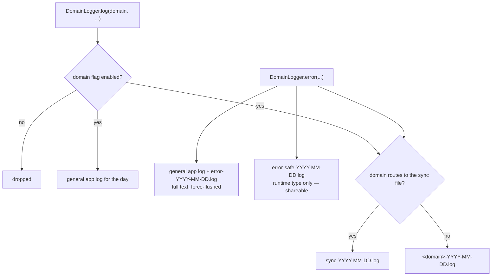

# A closed set of domains

Lotti's logging is **domain-scoped and off by default**. `LogDomain` is a Dart
enum, and it is the single source of truth: each value carries the config-flag
name, the Settings label, the default state and the file it routes to. There
are 24 of them:

`sync`, `ai`, `chat`, `speech`, `persistence`, `database`, `agentRuntime`,
`agentWorkflow`, `tasks`, `labels`, `health`, `habits`, `location`,
`screenshots`, `calendar`, `navigation`, `theming`, `notifications`,
`whatsNew`, `onboarding`, `settings`, `ratings`, `dailyOs`, `general`.

The enum consolidated roughly 70 ad-hoc domain strings that had accumulated as
free text. The original fine-grained string was not thrown away — it survives as
the `subDomain` argument, so a line still says *which* part of sync spoke, while
the domain stays enumerable, toggleable and greppable.

```dart
getIt<DomainLogger>().log(
  LogDomain.sync,
  'vc.burn.broadcast host=$hostId counter=$counter',
  subDomain: 'vc.burn.broadcast',
);
```

Adding a domain means adding an enum value. That single edit wires the config
flag, the Settings toggle, the file routing and the stable wire name at once —
there is no separate registry to keep in step.

# The gate, and what bypasses it



**An error reaches two to four files**, depending on its domain: the general log,
the full `error-<date>.log` mirror, the PII-safe `error-safe-<date>.log`, and then
either the shared `sync-<date>.log` or its own `<domain>-<date>.log`.

**The PII-safe log is the one to know about.** `error-safe-<date>.log` records only
the error's **runtime type**, never the raw exception string, precisely so it can be
shared or inspected without leaking user-authored content. The full mirror is for
diagnosis on the device; the safe log is what may leave it.

There are therefore more files on disk than routing suggests — and two more that
`LoggingService` does not own at all: `slow_queries` and `super_slow_queries`, both
written by the database interceptor.

**Files are the only sink.** There is no database table and no in-app log viewer.
The `InsightType` parameter on the capture methods is vestigial — no reader in the
app ever consults it — so diagnosing a report means reading the log files off the
device, not opening a screen.

**Errors are always logged**, whether or not their domain is enabled. A user who
has everything toggled off still produces a diagnosable record when something
breaks; only the chatty success path is silenced.

**`sync` is the one domain that routes to its own file.** It is off by default
and far noisier than everything else — a catch-up can produce thousands of lines
in a second — so it goes to `sync-<date>.log` where it can be read in isolation
without burying the rest.

Flags are toggled in *Settings → Advanced → Logging Domains* and stored as
config flags in `JournalDb`. `LoggingService.listenToConfigFlag()` subscribes at
startup, so a toggle takes effect immediately rather than at next launch.

# File writing is batched

Log lines are buffered per file stem and flushed on a **500 ms** timer rather
than written synchronously. Files are named `<stem>-<yyyy-MM-dd>.log`, so a day
is one file and rotation is implicit. In the test environment file writing is
skipped entirely — tests assert on the logger, not on disk.

# Slow queries

The database layer has its own gate, described in
[persistence](persistence.md). `SlowQueryInterceptor` wraps every connection but
stays inert until its logging domain is enabled, so it costs nothing in normal
use. `LoggingService` keeps that gate in sync with the config flag alongside the
general logging gate.

**It has two tiers, and they write different files** — 10 ms to `slow_queries`,
200 ms to `super_slow_queries` with an `EXPLAIN QUERY PLAN` attached. Start with
the second file, since it is the only one carrying a plan; the thresholds and what
each tier is for are in [persistence](persistence.md).

# Where to look

| Concern | File |
|---------|------|
| Domain enum, flags, labels, routing | [`lib/services/logging_domains.dart`](../../lib/services/logging_domains.dart) |
| Structured entry point | [`lib/services/domain_logging.dart`](../../lib/services/domain_logging.dart) |
| Buffering, files, flag subscription | [`lib/services/logging_service.dart`](../../lib/services/logging_service.dart) |
| Developer-only console helper | [`lib/services/dev_logger.dart`](../../lib/services/dev_logger.dart) |
| Slow-query interceptor | [`lib/database/slow_query_logging.dart`](../../lib/database/slow_query_logging.dart) |
