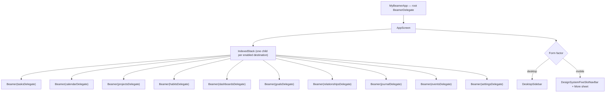
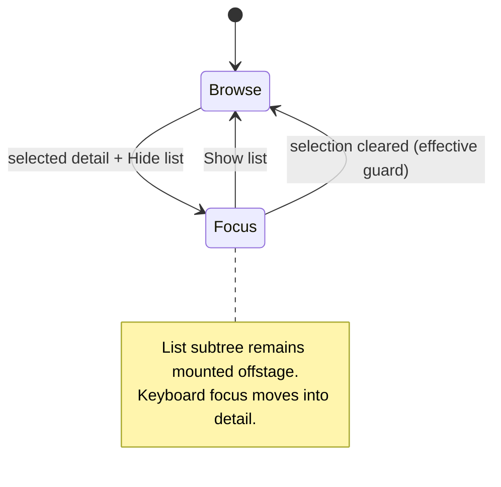
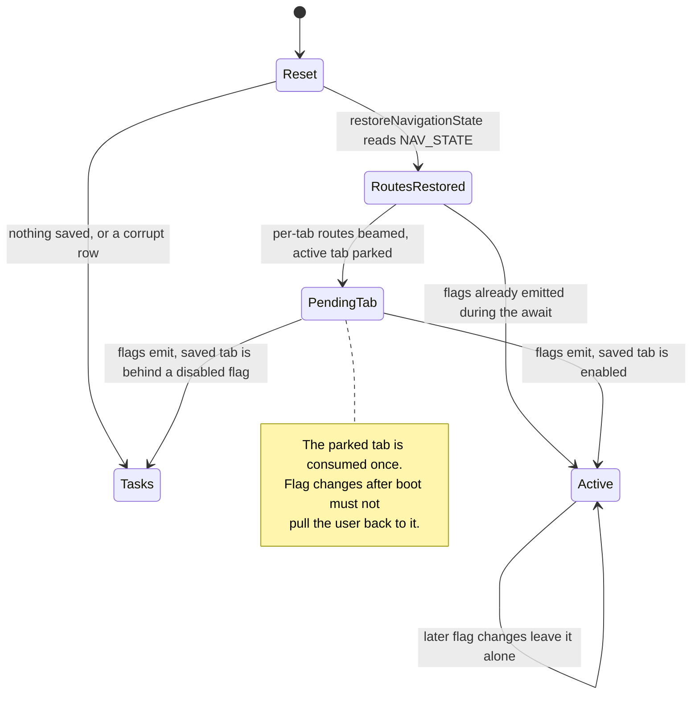
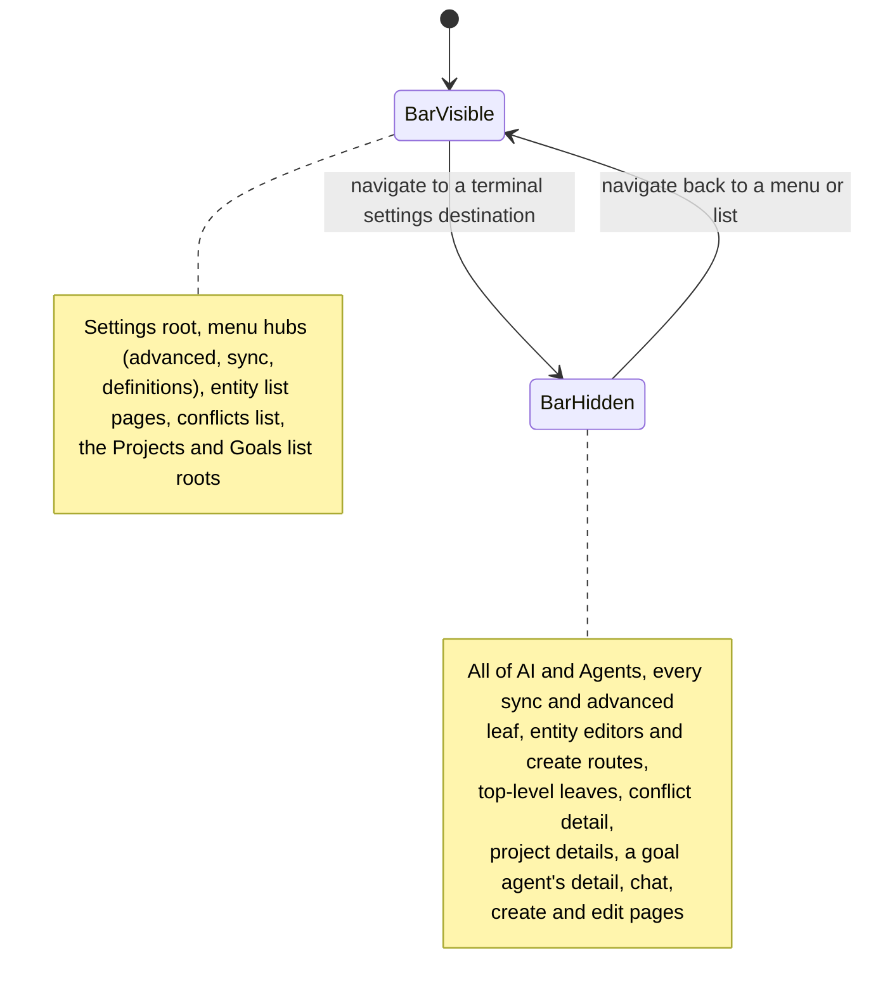

# One stack per tab

Lotti does not have a single navigation stack. It has **ten**, one per
top-level destination, each a `BeamerDelegate` with its own history:

| Destination | Root path | Enabled |
|-------------|-----------|---------|
| Tasks | `/tasks` | always |
| Daily OS (calendar) | `/calendar` | `enable_daily_os_page` |
| Projects | `/projects` | flag |
| Goals (unified) | `/goals` | `enable_unified_goals` |
| Habits | `/habits` | flag |
| Dashboards | `/dashboards` | flag |
| People | `/people` | `enable_relationships` |
| Journal | `/journal` | always |
| Events | `/events` | flag |
| Settings | `/settings` | always |

The unified Goals tab (the Habits + Goal Agents merge) sits in the slot
directly before Habits; while its flag is off nothing changes, and while it
is on it coexists with the Habits tab. It is the sole host of the goal
detail, chat and wizard pages, all under `/goals/...` paths built by the
helpers in `lib/features/goals/ui/goal_routes.dart`. (The never-released
Goal Agents tab that previously hosted the same pages under `/agents/...`
behind `enable_agents_page` was removed once the unified surface landed;
the flag row is deleted from existing installs via `retiredConfigFlags`.)

The delegates live in `lib/beamer/beamer_delegates.dart` and are all configured
`updateParent: false, updateFromParent: false`. That is what keeps the stacks
independent: switching tabs does not rewrite the other tabs' histories, so
returning to a tab restores exactly where the user left it.



An `IndexedStack` keeps every tab **mounted**. Tabs preserve scroll position and
in-flight state across switches, at the cost of every enabled tab holding its
widgets in memory.

# Desktop list focus is not Back navigation

The Tasks and Projects desktop splits can hide their browse list once a detail
is selected. This is a **focus-mode layout change**, not a navigation event:
the list remains mounted inside `Offstage`, excluded from focus and semantics,
so its query, filters, search text, selection and scroll position survive. The
divider is offstage and excluded from focus with it, and the detail expands
into the released width. Invoking the primary search command while focused on
the detail restores the list before moving focus into its search field. The
detail stays under one stable `Stack` parent while only the restore-button
overlay changes, preserving its scroll position and local widget state.

The shared `PaneWidthController` persists one Tasks/Projects collapse
preference alongside the shared expanded list width. Width changes are ignored
while collapsed, making expand restore the exact previous width. A split with no
selected detail always forces the list visible even if the saved preference is
collapsed; there must be somewhere meaningful for focus mode to land. Because
that forced-visible divider is actionable, its drag may update the stored width
without clearing the latent collapse preference.
`ListDetailFocusTraversal` observes the effective visibility input itself, so a
persisted collapsed preference taking effect when a new selection appears moves
focus into the detail just as reliably as pressing Hide list; every transition
back to visible returns focus to the list.



**Back continues to mean history.** A Projects detail embedded in the desktop
split never shows Back; its sibling list or Show list control owns lateral
movement. A Tasks detail shows Back only when a linked task was pushed above the
base task in `desktopTaskDetailStack`. Show list is a separate control and stays
available over loading, error and empty detail states, so hiding the list cannot
strand the user.

# NavService owns the index

`NavService` (a GetIt singleton) is the single source of truth for which tab is
active. It exposes:

- `beamerDelegates` — the ordered list of *enabled* delegates, cached and
  invalidated when navigation feature flags change.
- `index` plus `indexStreamController`, a `BehaviorSubject` the shell and the
  per-tab controllers listen to. It **replays** the current index to every new
  subscriber: nav state is restored before `runApp`, so the emission that
  selects the restored tab happens before any of them has subscribed, and a
  plain broadcast stream would drop it and leave them all believing the app is
  on Tasks.
- `setPath(path)`, which resolves a path to its owning delegate and switches the
  index to match.

Because the flag-gated destinations can appear and disappear,
**indices are positional, not stable**. Nothing may hard-code "projects is tab
3"; call `navService.projectsIndex` instead, which re-derives it from the
current list. The `IndexedStack` children and the delegate list are built from
the same ordering — reordering one without the other silently mismatches tab and
content.

Daily OS reuses its historical `enable_daily_os_page` row. `initConfigFlags`
inserts that row as `false` only when it is absent, so new installs do not enter
the still-experimental planner while an existing install that previously opted
in keeps its stored `true`. Turning the flag off while `/calendar` is selected
normalizes the active route back to `/tasks`, just like the other removable
destinations. The global Daily OS command uses the same live flag as its
availability predicate, so shortcuts, menus and the command palette cannot
dispatch the removed destination's `-1` index.

# Navigation state is persisted, per tab

The app comes back on the screen it was left on — same tab, same route inside
that tab — after a cold start or a hot restart. `NavService` writes the whole
picture to the settings row `NAV_STATE` as one `NavStateSnapshot` JSON blob:

```json
{ "v": 1, "active": "/tasks", "routes": { "/tasks": "/tasks/<uuid>", "/journal": "/journal/<uuid>" } }
```

The active tab is stored as its **root path**, never as an index: indices are
positional, so a stored `3` names a different tab as soon as a flag toggles.
Every navigation writes the row fire-and-forget; `NAV_LAST_ROUTE` is the
pre-JSON single-route key and is still read once as a migration fallback, never
written.

`registerSingletons` awaits `restoreNavigationState()` before `runApp`, so the
first frame is already correct rather than flashing Tasks. Restore has to
straddle the config flags, which arrive asynchronously and decide which tabs
exist at all:



A corrupt or unknown-version row degrades to "nothing saved" — the Tasks
landing — rather than throwing during bootstrap.

**A restored route is stacked on its tab root, never substituted for it.**
Restore beams each tab with `beamToNamed` on top of the root the constructor's
`resetTabsToRoots` just set, so the tab's beaming history is two entries long
and `canBeamBack` is true. Replacing the root instead (`beamToReplacementNamed`)
left a one-entry history: `BeamerDelegate.beamBack` then does nothing, and since
the mobile shell *removes* the bottom bar on `/tasks/<id>`, a cold start
restored onto a task detail had no exit at all — no bar, a dead back chevron,
and a blank page when the task had since been deleted.

`NavService.beamBack` is the second half of that guarantee: when the delegate
reports it cannot beam back, it beams to the active tab's root rather than
doing nothing, so no route reached by any means is a dead end. That fallback
**replaces** the dead route (`beamToReplacementNamed`) instead of stacking the
root above it — a push would leave the detail underneath, and the next back
would drop the user straight back into the page they just escaped. The tab root
is therefore terminal: `canBeamBack` stays false and further backs are no-ops.

## Background tabs must not steal the foreground

Every tab is mounted at once, so a tab the user is not looking at still builds
and can navigate. `beamToNamed` switches the **active tab** as a side effect, so
it is for user-initiated navigation only; anything firing from a background tab
uses **`beamWithinTab`**, which moves that tab's delegate and records its route
without touching `index`.

The logbook's newest-entry auto-selection (`_AutoSelectNewestEntry` in
`journal_root_page.dart`) is the case that proved it: it only exists in the
desktop split, so it first mounted on every crossing of the desktop breakpoint
— from the *offstage* Logbook tab — and through `beamToNamed` it yanked the user
onto Logbook from wherever they actually were. Its "already there" guard reads
`routeForTab('/journal')`, that tab's own route, not `currentPath`, which is the
active tab's.

## Crossing the breakpoint keeps the stacks alive

The desktop and mobile branches of `AppScreen.build` are structurally different
trees. The tab content is therefore rendered through one `_buildContentStack`
helper carrying a `GlobalKey`, so crossing 960px **reparents** the subtree
instead of destroying it. Without the key, every `Beamer` was unmounted and
re-inflated: `BeamerState.dispose` nulls its delegate's `parent` *after* the
replacement's `didChangeDependencies` has already short-circuited on the parent
it still had, leaving every nested delegate orphaned from the root router — and
every page stack, scroll offset and piece of in-flight state discarded.

Because nothing rebuilds the delegates by accident any more, the form-factor
change has to be announced: `NavService.isDesktopMode` is a **setter** that, on
an actual change, schedules a post-frame `update()` on every delegate so each
location re-runs `buildPages` for the new form factor (`AppScreen.build` assigns
it during build, hence the deferral). That is what turns a desktop right-pane
task detail into a pushed mobile detail page on the way down, and back again on
the way up.

# Locations and path patterns

Each delegate routes into one `BeamLocation` under
`lib/beamer/locations/`, which declares its `pathPatterns` and builds pages:

| Location | Patterns |
|----------|----------|
| `JournalLocation` | `/journal`, `/journal/:entryId`, `/journal/fill_survey/:surveyType` |
| `TasksLocation` | `/tasks`, `/tasks/:taskId` and task sub-surfaces |
| `CalendarLocation` | `/calendar`, `/calendar/time`, `/calendar/refine/:date`, `/calendar/commit/:date`, `/calendar/shutdown/:date` |
| `ProjectsLocation` | `/projects`, `/projects/:projectId` |
| `DashboardsLocation` | `/dashboards`, `/dashboards/impact`, `/dashboards/:dashboardId` |
| `EventsLocation` | `/events`, `/events/:eventId` |
| `GoalsLocation` | `/goals`, `/goals/create`, `/goals/details/:agentId[/chat\|/edit]` |
| `HabitsLocation` | `/habits` |
| `SettingsLocation` | the deepest tree in the app — `/settings` plus AI, agents, sync, advanced and entity-definition subtrees |

Matching is per-delegate and mostly substring-based, which is a trap the
`EventsLocation` delegate already had to work around: it matches
`path == '/events' || path.startsWith('/events/')` so that `/settings/events`
and `/prevents` do not get routed into the events tab. New delegates should
follow that root-path form rather than `contains`.

## Route mirrors defer past the frame

`CalendarLocation` and `DashboardsLocation` mirror the route into
`NavService.desktopShowTimeAnalysis` / `desktopShowAiImpact`, whose listeners
are the desktop sidebar's sub-entries — siblings of the Beamer delegate, not
descendants. Beamer calls `buildPages` from the delegate's `build`, so a
synchronous write there is a `setState() called during build`. Both go through
`mirrorRouteState` (`lib/beamer/locations/route_state_mirror.dart`), which
defers the write to the end of the frame when called inside one and applies it
at once otherwise. The `desktopSelected*` mirrors stay synchronous: their
listeners are the split-pane pages inside the delegate's navigator, and the
settings tree's URL sync defers on its own side.

# A pop walks one URI segment

Beamer's default pop (`BeamPage.pathSegmentPop`) strips exactly **one** path
segment. Any page sitting two or more segments below the page it should return
to therefore pops onto an intermediate URL that no page was written for — and
since `canBeamLocationHandleUri` matches a prefix of a pattern, `SettingsLocation`
still claims it and rebuilds the parent list from it. The back tap looks like it
worked, but the route is stranded: the *next* back tap pops that dead URL to the
real parent, builds the same parent page again, and the user watches the list
slide out and an identical list slide straight back in without going anywhere.

Such a page must name its destination with `BeamPage.popToNamed`, so one tap is
one level and the pop plays as a pop:

| Page | URL | `popToNamed` |
|------|-----|--------------|
| Habit editor | `/settings/habits/by_id/:habitId` | `/settings/habits` |
| Habit search | `/settings/habits/search/:searchTerm` | `/settings/habits` |
| AI provider detail | `/settings/ai/provider/:providerId` | `/settings/ai` |
| AI model edit | `/settings/ai/model/:modelId` | `/settings/ai` |
| AI profile edit | `/settings/ai/profile/:profileId` | `/settings/ai` |
| Every definition leaf | `/settings/categories`, `/settings/labels`, `/settings/habits`, `/settings/dashboards`, `/settings/measurables` | `/settings/definitions` |
| Every preference leaf | `/settings/theming`, `/settings/recording-style`, `/settings/speech`, `/settings/keyboard-shortcuts`, `/settings/advanced/animations` | `/settings/preferences` |
| Advanced's two flat leaves | `/settings/flags`, `/settings/health_import` | `/settings/advanced` |

The AI rows all use `aiSettingsParentRoute`, the same constant the detail pages'
own back affordance beams to (`popAiSettingsDetail`), so the gesture and the
chevron cannot drift apart. The three branch rows are derived rather than
written out, by
[`settingsBranchHubOf`](../../lib/beamer/locations/settings_location.dart) —
the same predicates that decide whether a hub is *in* the stack decide where
its leaves pop to, so the two cannot disagree. The hub URLs themselves sit
beside `aiSettingsParentRoute` in
[`settings_tree_index.dart`](../../lib/features/settings_v2/domain/settings_tree_index.dart)
and are read out of `settingsNodeUrls`, for the reason that constant documents:
the tree tap, the hub page and the leaf's `popToNamed` all have to name one
string, and the tree is where a settings URL is decided.

A one-segment leaf like `/settings/daily-os` needs no `popToNamed`: the default
pop already lands on its parent, the Settings root, which is where that leaf
belongs.

# A branch leaf pops to its hub, not to its URL's parent

The rule above is about *depth*. The branch hubs add a second, independent way
to strand a back tap: the leaf's URL is not under its hub's.

Definitions, Preferences and Advanced are pure-navigation hubs that
`buildPages` keeps beneath their leaves. Whether a hub stays there is decided
by a path predicate (`_inDefinitionsBranch` and friends) evaluated against
whatever URL the pop produces — and most branch leaves kept the flat URLs they
shipped with. `/settings/categories` does not nest under
`/settings/definitions`; `/settings/theming` does not nest under
`/settings/preferences`; and `/settings/advanced/animations` nests under the
*wrong* branch's hub, since Animations belongs to Preferences.

So the single-segment pop lands on `/settings`, the hub predicate stops
matching, and `buildPages` drops the hub along with the leaf: **one back tap
left the branch entirely**. It read as a page bouncing back on its own, because
the Navigator still uncovered the hub for the length of the pop animation
before the route rebuild replaced it with the Settings root.

Depth and branch membership are separate questions, and a page can need
`popToNamed` for either. A nested leaf like `/settings/advanced/maintenance`
needs none: it is one segment deep *and* its URL sits under its own hub's.

But landing on the right URL is only half of it. The page the leaf pops *onto*
must already be in the stack beneath it, on a stable key, or Navigator swaps
the leaf for a freshly built parent instead of uncovering the one that was
there — a push animation on a back gesture, the same thing the reader sees in
the two-segment case. That is why `SettingsLocation` emits the AI Settings list
under every `/settings/ai/*` URL and the Sync hub under every
`/settings/sync/*` URL, each always on one key (`settings-ai`,
`settings-sync`). A child URL that opts out of its parent page gets the wrong
transition even when its URL is correct — which is what the legacy
`/settings/ai/profiles` leaf used to do.

# Chrome rules are pure functions of router state

Mobile chrome decisions are derived, not stored. Four pure functions of router
state decide what the bottom edge belongs to, following one product rule:
**menus keep the bar, terminal destinations take the bottom edge.**

| Predicate | Routes | Effect |
| --- | --- | --- |
| `isTaskDetailRoute` | `/tasks/<uuid>` | Bar **unmounted** — `TaskActionBar` replaces it outright |
| `settingsRouteHidesBottomNav` | AI and Agents sections, sync/advanced leaves, entity editors | Bar **slides away** |
| `projectsRouteHidesBottomNav` | `/projects/<id>` | Bar **slides away** |
| `goalsRouteHidesBottomNav` | `/goals/create`, `/goals/details/<id>[/chat\|/edit]` | Bar **slides away** |

Removal and slide-away differ on purpose: a page that docks its own bar can
swap instantly, while a page that replaces the bar with nothing would read as a
glitch, so the bar animates out and back instead.

The predicates match **exact route shapes, not prefixes.** A malformed or
restored URL like `/goals/details` with no id renders the plain list, and that
list must keep its tab bar — so matching on the second path segment alone is a
bug, not a shortcut.

**Hiding the bar is only half of it.** Pages pad their content by
`DesignSystemBottomNavigationBar.occupiedHeight`, so a hidden bar must also
stop being reserved, or the page keeps a bar-sized empty gutter exactly where
its own pinned surface was meant to dock. `_MobileNavOverlayHeightScope`
therefore publishes `barDocked` alongside the indicator-row height, and
`occupiedHeight` adds the bar's own height only when it is docked. The flag
defaults to true when no scope exists, so a page rendered outside the shell
(previews, widget tests) reserves room exactly as before.



Two consequences worth knowing before adding a settings page:

- **AI and Agents hide the bar across the whole section**, not per leaf. Their
  mobile tabs swap in place without changing the URL, so a per-leaf rule would
  make the bar flicker as the user moved between tabs.
- **Pushed editors cannot be matched here.** Surfaces pushed on top of another
  settings route — the AI provider connect form, the evolution chat — keep the
  URL of the page that pushed them. They escape the nav by pushing onto the root
  navigator through `bottomNavSafeNavigatorOf` instead.

Mobile slot allocation is likewise derived from width. Tasks, Daily OS and
Journal are the primary destinations that survive the narrowest window; the rest
start behind a *More* sheet and are promoted into their own slots as width
allows, until everything fits and the More slot disappears.

## The Settings row and its counts

The desktop sidebar is user-resizable between 200 px and 500 px, and Settings is
the one row that carries a trailing widget: `SyncQueueCounts`, up to two
sync-queue counts — quiet low-emphasis text, not chips; see
[the neutral badge tone](../features/design_system/component-contracts.md#status-without-an-alert-the-neutral-badge-tone)
for why they carry no shell. That makes it the only row where a *label*, a *glyph* and a
*number* compete for the same width, and the rail's 200 px minimum is not wide
enough for all three at once. Which one gives is therefore a decision, not an
accident:

1. **The counts are never shortened while anything else can give.** A count
   clipped to `↓ 1…` is wrong rather than merely short.
2. **The label ellipsizes, down to nothing if the row demands it.** It is pinned
   to `maxLines: 1` — a wrapping label does not degrade, it stacks into a column
   of single letters and multiplies the row's height. The gear identifies the
   row on its own, which is exactly why the label is the affordable one.
3. **The counts are bounded before any of this**, by `formatSyncQueueCount`:
   exact through 999, one decimal below 10K, whole thousands above. An unbounded
   integer is what made the row unresolvable in the first place.
4. **Only when the counts alone exceed the row** — six-figure queues in both
   directions at 200 px — does the trailing slot clamp, and then both counts
   shorten together rather than one winning the row.

Steps 3 and 4 are what keep a `RenderFlex` overflow off the rail: a `Row` hands
its inflexible children infinite width, so without the clamp a wide trailing
group overflows no matter how far the label has already ellipsized.

Icon and label are **centred** on each other rather than top-aligned. The glyph
is a fixed 20 px and deliberately does not scale with the platform text scale —
at large scales it would cost the label more width than it is worth — so
top-aligning strands the icon above a label several times its height.

# The one thing in the chrome that is not a destination

`ContactSupportRow` — equal glyph buttons for email, the Manual, the repository
and the Discord invite — is the exception to everything above. Nothing in it
changes the tab index, opens a `BeamLocation`, or touches `NavService`; every
one of its four targets leaves the app through `url_launcher`.

That is why it renders **below the last real destination**, on both form
factors:

| Form factor | Where | Suppressed when |
|-------------|-------|-----------------|
| Desktop | sidebar `footerBand`, under Settings | the sidebar is collapsed |
| Mobile | last child of the *More* sheet | never — the sheet is its only home |

**No rule separates it from the rows above, on either surface.** These are the
quietest controls the app's navigation has, and a divider gave them the weight
of a section boundary — announcing a separation that neither surface actually
has. Distance and the glyph-only treatment carry it instead.

`footerBand` is the sidebar's one **full-bleed** slot: it spans the rail edge to
edge rather than sitting inside the 16 px gutters every other row shares, and
owns its own smaller inset. That is a width argument, not a decorative one —
four 44 px targets need 176 px, and a gutter-inset row at the 200 px minimum
offers 168. The band is always the expanded sidebar's final child, with no
optional status row beneath Settings to displace it. Collapsing the sidebar
removes the band entirely — the icon-only rail is 72 px, narrower than the four
glyphs — and the Manual stays reachable from Settings meanwhile.

The actions themselves are one right-aligned group. Email is a plain envelope
button with the same 44 px target, colour, tooltip and semantics as Manual,
GitHub and Discord; its localized “Contact Us” wording remains the accessible
name rather than visible copy. With no label competing for width, all four
targets fit on one line at the 200 px sidebar minimum.

Two rules hold it together:

- **The Manual URL is resolved in exactly one place.** Both the Settings tree row
  and this footer call `manualUriForCurrentLocale`, so a stored language override
  cannot send one of them to a different locale than the other. Resolution is
  deliberately split from opening, because the footer wraps every launch in its
  own guard.
- **A launch that fails must not throw.** The row fires launches without
  awaiting them, so an uncaught rejection — a desktop with no mail client is the
  ordinary case — would surface as an unhandled async error instead of the
  no-op the user actually experiences. `_launchSupportUri` catches it, and
  reports through `DomainLogger.error` rather than `log`, which is gated on the
  navigation domain being enabled.

# Where to look

| Concern | File |
|---------|------|
| App shell, tab chrome, mobile/desktop split | [`lib/beamer/beamer_app.dart`](../../lib/beamer/beamer_app.dart) |
| Delegate definitions | [`lib/beamer/beamer_delegates.dart`](../../lib/beamer/beamer_delegates.dart) |
| Per-tab locations and path patterns | [`lib/beamer/locations/`](../../lib/beamer/locations) |
| Index, delegate registry, flag gating, state persistence | [`lib/services/nav_service.dart`](../../lib/services/nav_service.dart) |
| Restore hook, awaited before `runApp` | [`lib/get_it.dart`](../../lib/get_it.dart) |
| Logbook auto-selection, the background-navigation case | [`lib/features/journal/ui/pages/journal_root_page.dart`](../../lib/features/journal/ui/pages/journal_root_page.dart) |
| Mobile overflow sheet | [`lib/widgets/nav_bar/mobile_nav_more_sheet.dart`](../../lib/widgets/nav_bar/mobile_nav_more_sheet.dart) |
| Contact Us footer, wired | [`lib/widgets/misc/contact_support_row.dart`](../../lib/widgets/misc/contact_support_row.dart) |
| Contact Us footer, presentation | [`lib/features/design_system/components/navigation/design_system_contact_row.dart`](../../lib/features/design_system/components/navigation/design_system_contact_row.dart) |
| External addresses | [`lib/utils/support_links.dart`](../../lib/utils/support_links.dart) |

Related: [the settings feature](../features/settings.md) for the tree that
`SettingsLocation` routes into.
