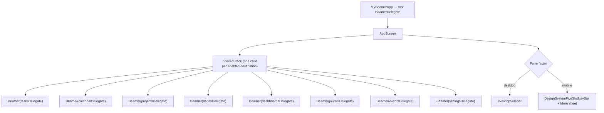
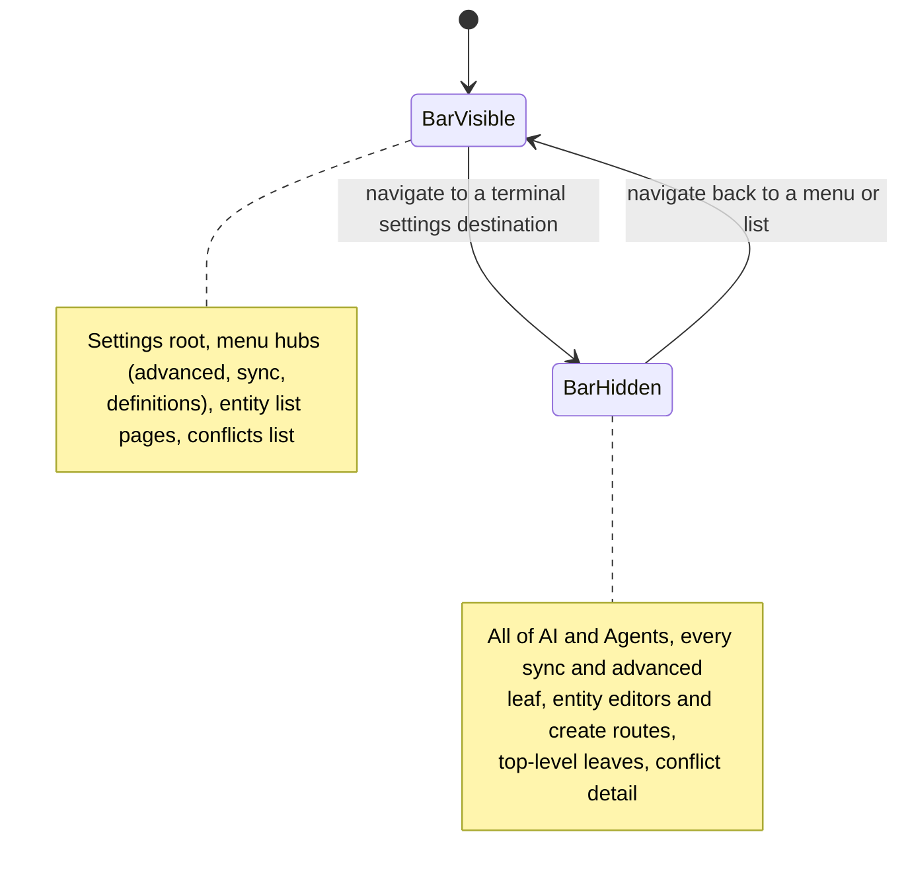

# One stack per tab

Lotti does not have a single navigation stack. It has **eight**, one per
top-level destination, each a `BeamerDelegate` with its own history:

| Destination | Root path | Enabled |
|-------------|-----------|---------|
| Tasks | `/tasks` | always |
| Daily OS (calendar) | `/calendar` | `enable_daily_os_page` |
| Projects | `/projects` | flag |
| Habits | `/habits` | flag |
| Dashboards | `/dashboards` | flag |
| Journal | `/journal` | always |
| Events | `/events` | flag |
| Settings | `/settings` | always |

The delegates live in `lib/beamer/beamer_delegates.dart` and are all configured
`updateParent: false, updateFromParent: false`. That is what keeps the stacks
independent: switching tabs does not rewrite the other tabs' histories, so
returning to a tab restores exactly where the user left it.

An `IndexedStack` keeps every tab **mounted**. Tabs preserve scroll position and
in-flight state across switches, at the cost of every enabled tab holding its
widgets in memory.

# NavService owns the index

`NavService` (a GetIt singleton) is the single source of truth for which tab is
active. It exposes:

- `beamerDelegates` — the ordered list of *enabled* delegates, cached and
  invalidated when navigation feature flags change.
- `index` plus `indexStreamController`, the broadcast stream the shell listens
  to.
- `setPath(path)`, which resolves a path to its owning delegate and switches the
  index to match.

Because the flag-gated destinations can appear and disappear,
**indices are positional, not stable**. Nothing may hard-code "projects is tab
3"; call `navService.projectsIndex` instead, which re-derives it from the
current list. The `IndexedStack` children and the delegate list are built from
the same ordering — reordering one without the other silently mismatches tab and
content.

Daily OS reuses its historical `enable_daily_os_page` row. `initConfigFlags`
inserts that row as `false` only when it is absent, so new installs do not enter
the still-experimental planner while an existing install that previously opted
in keeps its stored `true`. Turning the flag off while `/calendar` is selected
normalizes the active route back to `/tasks`, just like the other removable
destinations. The global Daily OS command uses the same live flag as its
availability predicate, so shortcuts, menus and the command palette cannot
dispatch the removed destination's `-1` index.

# Locations and path patterns

Each delegate routes into one `BeamLocation` under
`lib/beamer/locations/`, which declares its `pathPatterns` and builds pages:

| Location | Patterns |
|----------|----------|
| `JournalLocation` | `/journal`, `/journal/:entryId`, `/journal/fill_survey/:surveyType` |
| `TasksLocation` | `/tasks`, `/tasks/:taskId` and task sub-surfaces |
| `CalendarLocation` | `/calendar`, `/calendar/time`, `/calendar/refine/:date`, `/calendar/commit/:date`, `/calendar/shutdown/:date` |
| `ProjectsLocation` | `/projects`, `/projects/:projectId` |
| `DashboardsLocation` | `/dashboards`, `/dashboards/impact`, `/dashboards/:dashboardId` |
| `EventsLocation` | `/events`, `/events/:eventId` |
| `HabitsLocation` | `/habits` |
| `SettingsLocation` | the deepest tree in the app — `/settings` plus AI, agents, sync, advanced and entity-definition subtrees |

Matching is per-delegate and mostly substring-based, which is a trap the
`EventsLocation` delegate already had to work around: it matches
`path == '/events' || path.startsWith('/events/')` so that `/settings/events`
and `/prevents` do not get routed into the events tab. New delegates should
follow that root-path form rather than `contains`.

# A pop walks one URI segment

Beamer's default pop (`BeamPage.pathSegmentPop`) strips exactly **one** path
segment. Any page sitting two or more segments below the page it should return
to therefore pops onto an intermediate URL that no page was written for — and
since `canBeamLocationHandleUri` matches a prefix of a pattern, `SettingsLocation`
still claims it and rebuilds the parent list from it. The back tap looks like it
worked, but the route is stranded: the *next* back tap pops that dead URL to the
real parent, builds the same parent page again, and the user watches the list
slide out and an identical list slide straight back in without going anywhere.

Such a page must name its destination with `BeamPage.popToNamed`, so one tap is
one level and the pop plays as a pop:

| Page | URL | `popToNamed` |
|------|-----|--------------|
| Habit editor | `/settings/habits/by_id/:habitId` | `/settings/habits` |
| Habit search | `/settings/habits/search/:searchTerm` | `/settings/habits` |
| AI provider detail | `/settings/ai/provider/:providerId` | `/settings/ai` |
| AI model edit | `/settings/ai/model/:modelId` | `/settings/ai` |
| AI profile edit | `/settings/ai/profile/:profileId` | `/settings/ai` |

The AI rows all use `aiSettingsParentRoute`, the same constant the detail pages'
own back affordance beams to (`popAiSettingsDetail`), so the gesture and the
chevron cannot drift apart.

A one-segment leaf like `/settings/theming` needs no `popToNamed`: the default
pop already lands on its parent.

But landing on the right URL is only half of it. The page the leaf pops *onto*
must already be in the stack beneath it, on a stable key, or Navigator swaps
the leaf for a freshly built parent instead of uncovering the one that was
there — a push animation on a back gesture, the same thing the reader sees in
the two-segment case. That is why `SettingsLocation` emits the AI Settings list
under every `/settings/ai/*` URL and the Sync hub under every
`/settings/sync/*` URL, each always on one key (`settings-ai`,
`settings-sync`). A child URL that opts out of its parent page gets the wrong
transition even when its URL is correct — which is what the legacy
`/settings/ai/profiles` leaf used to do.

# Chrome rules are pure functions of router state

Mobile chrome decisions are derived, not stored. `settingsRouteHidesBottomNav`
takes a `BeamLocation` and returns whether the bottom navigation bar should
slide away, following one product rule: **menus keep the bar, terminal
destinations take the bottom edge.**

Two consequences worth knowing before adding a settings page:

- **AI and Agents hide the bar across the whole section**, not per leaf. Their
  mobile tabs swap in place without changing the URL, so a per-leaf rule would
  make the bar flicker as the user moved between tabs.
- **Pushed editors cannot be matched here.** Surfaces pushed on top of another
  settings route — the AI provider connect form, the evolution chat — keep the
  URL of the page that pushed them. They escape the nav by pushing onto the root
  navigator through `bottomNavSafeNavigatorOf` instead.

Mobile slot allocation is likewise derived from width. Tasks, Daily OS and
Journal are the primary destinations that survive the narrowest window; the rest
start behind a *More* sheet and are promoted into their own slots as width
allows, until everything fits and the More slot disappears.

## The Settings row and its counts

The desktop sidebar is user-resizable between 200 px and 500 px, and Settings is
the one row that carries a trailing widget: `OutboxTrailingBadge`, up to two
sync-queue pills. That makes it the only row where a *label*, a *glyph* and a
*number* compete for the same width, and the rail's 200 px minimum is not wide
enough for all three at once. Which one gives is therefore a decision, not an
accident:

1. **The counts are never shortened while anything else can give.** A count
   clipped to `↓ 1…` is wrong rather than merely short.
2. **The label ellipsizes, down to nothing if the row demands it.** It is pinned
   to `maxLines: 1` — a wrapping label does not degrade, it stacks into a column
   of single letters and multiplies the row's height. The gear identifies the
   row on its own, which is exactly why the label is the affordable one.
3. **The counts are bounded before any of this**, by `formatSyncQueueCount`:
   exact through 999, one decimal below 10K, whole thousands above. An unbounded
   integer is what made the row unresolvable in the first place.
4. **Only when the counts alone exceed the row** — six-figure queues in both
   directions at 200 px — does the trailing slot clamp, and then both pills
   shorten together rather than one winning the row.

Steps 3 and 4 are what keep a `RenderFlex` overflow off the rail: a `Row` hands
its inflexible children infinite width, so without the clamp a wide trailing
group overflows no matter how far the label has already ellipsized.

Icon and label are **centred** on each other rather than top-aligned. The glyph
is a fixed 20 px and deliberately does not scale with the platform text scale —
at large scales it would cost the label more width than it is worth — so
top-aligning strands the icon above a label several times its height.

# The one thing in the chrome that is not a destination

`ContactSupportRow` — equal glyph buttons for email, the Manual, the repository
and the Discord invite — is the exception to everything above. Nothing in it
changes the tab index, opens a `BeamLocation`, or touches `NavService`; every
one of its four targets leaves the app through `url_launcher`.

That is why it renders **below the last real destination**, on both form
factors:

| Form factor | Where | Suppressed when |
|-------------|-------|-----------------|
| Desktop | sidebar `footerBand`, under Settings | the sidebar is collapsed |
| Mobile | last child of the *More* sheet | never — the sheet is its only home |

**No rule separates it from the rows above, on either surface.** These are the
quietest controls the app's navigation has, and a divider gave them the weight
of a section boundary — announcing a separation that neither surface actually
has. Distance and the glyph-only treatment carry it instead.

`footerBand` is the sidebar's one **full-bleed** slot: it spans the rail edge to
edge rather than sitting inside the 16 px gutters every other row shares, and
owns its own smaller inset. That is a width argument, not a decorative one —
four 44 px targets need 176 px, and a gutter-inset row at the 200 px minimum
offers 168. The band is always the expanded sidebar's final child, with no
optional status row beneath Settings to displace it. Collapsing the sidebar
removes the band entirely — the icon-only rail is 72 px, narrower than the four
glyphs — and the Manual stays reachable from Settings meanwhile.

The actions themselves are one right-aligned group. Email is a plain envelope
button with the same 44 px target, colour, tooltip and semantics as Manual,
GitHub and Discord; its localized “Contact Us” wording remains the accessible
name rather than visible copy. With no label competing for width, all four
targets fit on one line at the 200 px sidebar minimum.

Two rules hold it together:

- **The Manual URL is resolved in exactly one place.** Both the Settings tree row
  and this footer call `manualUriForCurrentLocale`, so a stored language override
  cannot send one of them to a different locale than the other. Resolution is
  deliberately split from opening, because the footer wraps every launch in its
  own guard.
- **A launch that fails must not throw.** The row fires launches without
  awaiting them, so an uncaught rejection — a desktop with no mail client is the
  ordinary case — would surface as an unhandled async error instead of the
  no-op the user actually experiences. `_launchSupportUri` catches it, and
  reports through `DomainLogger.error` rather than `log`, which is gated on the
  navigation domain being enabled.

# Where to look

| Concern | File |
|---------|------|
| App shell, tab chrome, mobile/desktop split | [`lib/beamer/beamer_app.dart`](../../lib/beamer/beamer_app.dart) |
| Delegate definitions | [`lib/beamer/beamer_delegates.dart`](../../lib/beamer/beamer_delegates.dart) |
| Per-tab locations and path patterns | [`lib/beamer/locations/`](../../lib/beamer/locations) |
| Index, delegate registry, flag gating | [`lib/services/nav_service.dart`](../../lib/services/nav_service.dart) |
| Mobile overflow sheet | [`lib/widgets/nav_bar/mobile_nav_more_sheet.dart`](../../lib/widgets/nav_bar/mobile_nav_more_sheet.dart) |
| Contact Us footer, wired | [`lib/widgets/misc/contact_support_row.dart`](../../lib/widgets/misc/contact_support_row.dart) |
| Contact Us footer, presentation | [`lib/features/design_system/components/navigation/design_system_contact_row.dart`](../../lib/features/design_system/components/navigation/design_system_contact_row.dart) |
| External addresses | [`lib/utils/support_links.dart`](../../lib/utils/support_links.dart) |

Related: [the settings feature](../features/settings.md) for the tree that
`SettingsLocation` routes into.
