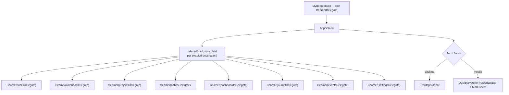
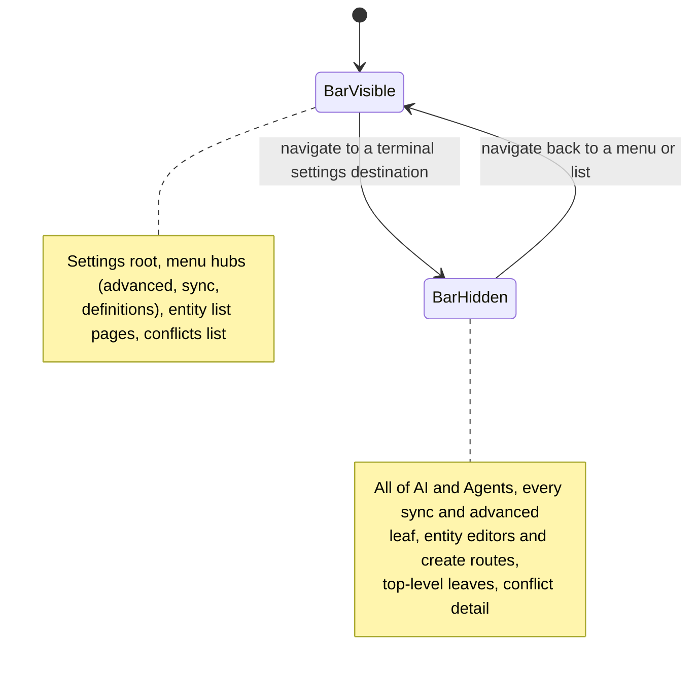

# One stack per tab

Lotti does not have a single navigation stack. It has **eight**, one per
top-level destination, each a `BeamerDelegate` with its own history:

| Destination | Root path | Enabled |
|-------------|-----------|---------|
| Tasks | `/tasks` | always |
| Daily OS (calendar) | `/calendar` | always |
| Projects | `/projects` | flag |
| Habits | `/habits` | flag |
| Dashboards | `/dashboards` | flag |
| Journal | `/journal` | always |
| Events | `/events` | flag |
| Settings | `/settings` | always |

The delegates live in `lib/beamer/beamer_delegates.dart` and are all configured
`updateParent: false, updateFromParent: false`. That is what keeps the stacks
independent: switching tabs does not rewrite the other tabs' histories, so
returning to a tab restores exactly where the user left it.

An `IndexedStack` keeps every tab **mounted**. Tabs preserve scroll position and
in-flight state across switches, at the cost of every enabled tab holding its
widgets in memory.

# NavService owns the index

`NavService` (a GetIt singleton) is the single source of truth for which tab is
active. It exposes:

- `beamerDelegates` — the ordered list of *enabled* delegates, cached and
  invalidated when navigation feature flags change.
- `index` plus `indexStreamController`, the broadcast stream the shell listens
  to.
- `setPath(path)`, which resolves a path to its owning delegate and switches the
  index to match.

Because the flag-gated destinations can appear and disappear,
**indices are positional, not stable**. Nothing may hard-code "projects is tab
3"; call `navService.projectsIndex` instead, which re-derives it from the
current list. The `IndexedStack` children and the delegate list are built from
the same ordering — reordering one without the other silently mismatches tab and
content.

# Locations and path patterns

Each delegate routes into one `BeamLocation` under
`lib/beamer/locations/`, which declares its `pathPatterns` and builds pages:

| Location | Patterns |
|----------|----------|
| `JournalLocation` | `/journal`, `/journal/:entryId`, `/journal/fill_survey/:surveyType` |
| `TasksLocation` | `/tasks`, `/tasks/:taskId` and task sub-surfaces |
| `CalendarLocation` | `/calendar`, `/calendar/time`, `/calendar/refine/:date`, `/calendar/commit/:date`, `/calendar/shutdown/:date` |
| `ProjectsLocation` | `/projects`, `/projects/:projectId` |
| `DashboardsLocation` | `/dashboards`, `/dashboards/impact`, `/dashboards/:dashboardId` |
| `EventsLocation` | `/events`, `/events/:eventId` |
| `HabitsLocation` | `/habits` |
| `SettingsLocation` | the deepest tree in the app — `/settings` plus AI, agents, sync, advanced and entity-definition subtrees |

Matching is per-delegate and mostly substring-based, which is a trap the
`EventsLocation` delegate already had to work around: it matches
`path == '/events' || path.startsWith('/events/')` so that `/settings/events`
and `/prevents` do not get routed into the events tab. New delegates should
follow that root-path form rather than `contains`.

# Chrome rules are pure functions of router state

Mobile chrome decisions are derived, not stored. `settingsRouteHidesBottomNav`
takes a `BeamLocation` and returns whether the bottom navigation bar should
slide away, following one product rule: **menus keep the bar, terminal
destinations take the bottom edge.**

Two consequences worth knowing before adding a settings page:

- **AI and Agents hide the bar across the whole section**, not per leaf. Their
  mobile tabs swap in place without changing the URL, so a per-leaf rule would
  make the bar flicker as the user moved between tabs.
- **Pushed editors cannot be matched here.** Surfaces pushed on top of another
  settings route — the AI provider connect form, the evolution chat — keep the
  URL of the page that pushed them. They escape the nav by pushing onto the root
  navigator through `bottomNavSafeNavigatorOf` instead.

Mobile slot allocation is likewise derived from width. Tasks, Daily OS and
Journal are the primary destinations that survive the narrowest window; the rest
start behind a *More* sheet and are promoted into their own slots as width
allows, until everything fits and the More slot disappears.

# Where to look

| Concern | File |
|---------|------|
| App shell, tab chrome, mobile/desktop split | [`lib/beamer/beamer_app.dart`](../../lib/beamer/beamer_app.dart) |
| Delegate definitions | [`lib/beamer/beamer_delegates.dart`](../../lib/beamer/beamer_delegates.dart) |
| Per-tab locations and path patterns | [`lib/beamer/locations/`](../../lib/beamer/locations) |
| Index, delegate registry, flag gating | [`lib/services/nav_service.dart`](../../lib/services/nav_service.dart) |

Related: [the settings feature](../features/settings.md) for the tree that
`SettingsLocation` routes into.
