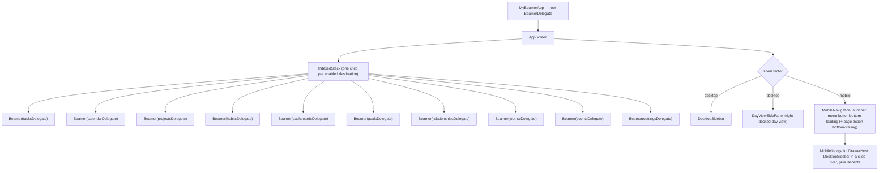
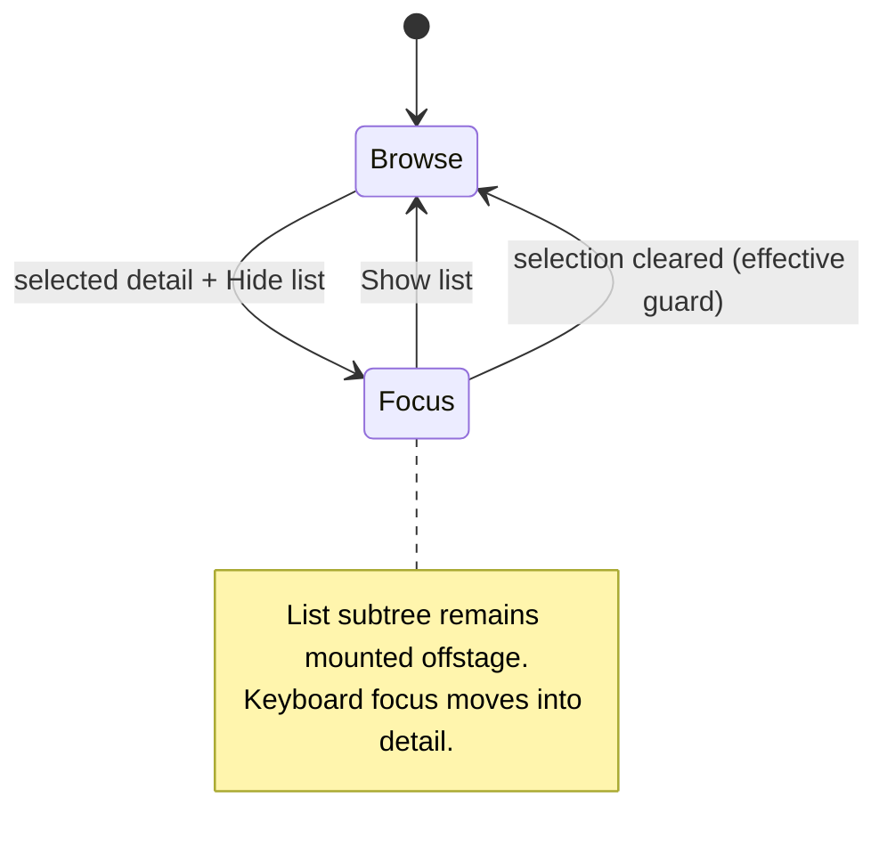
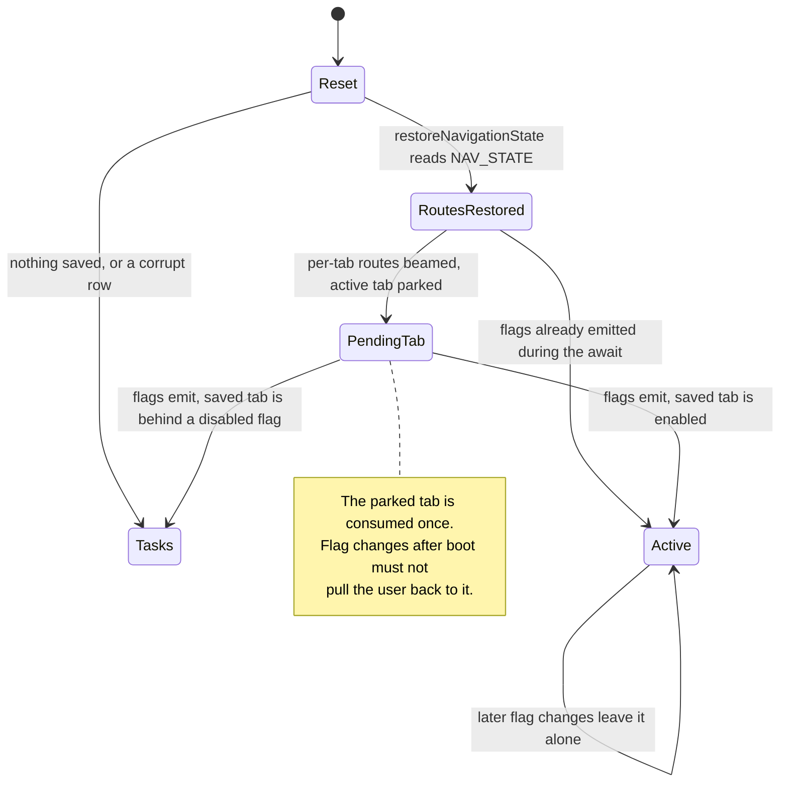
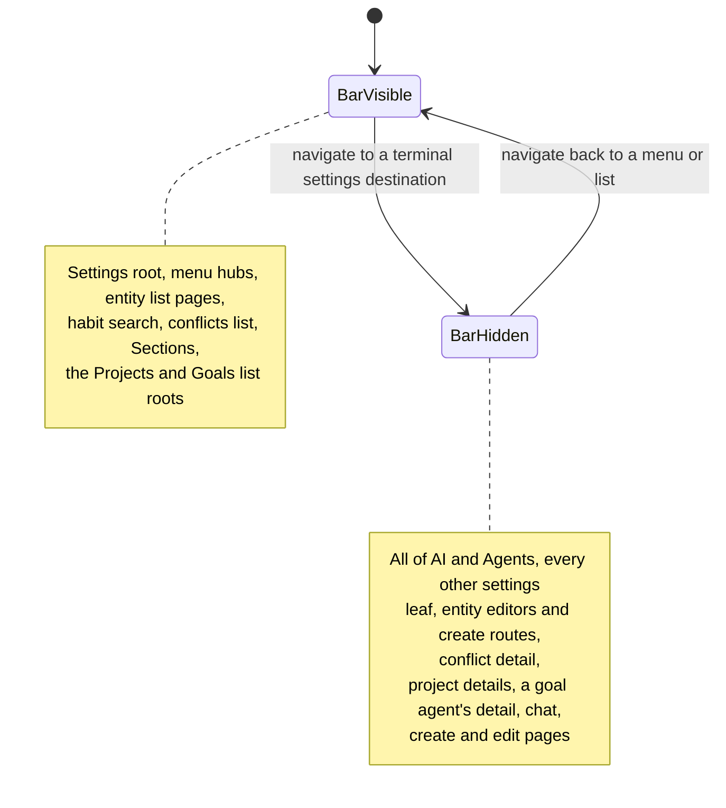
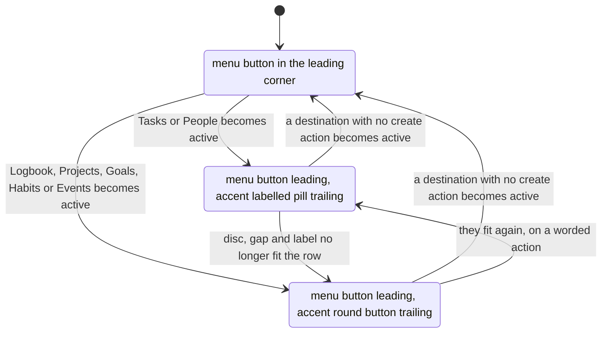
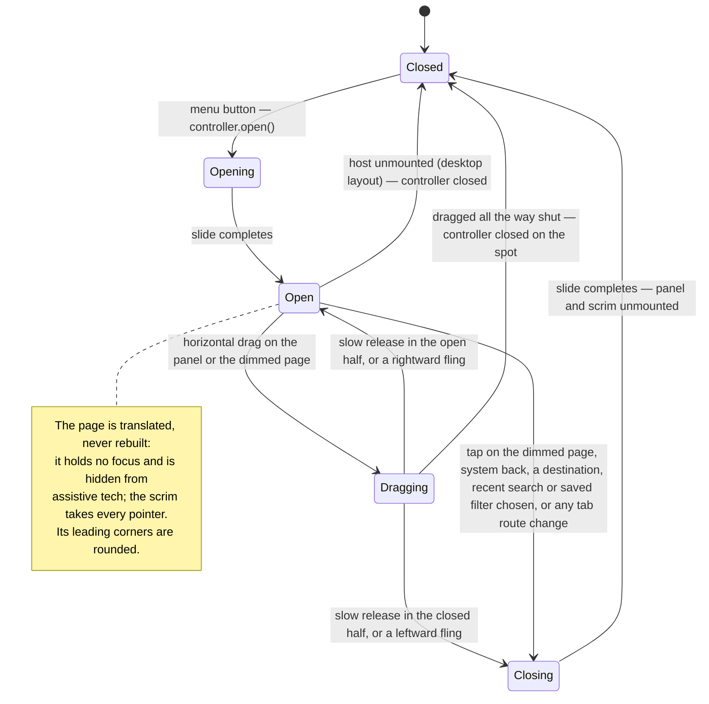

# One stack per tab

Lotti does not have a single navigation stack. It has **ten**, one per
top-level destination, each a `BeamerDelegate` with its own history:

| Destination | Root path | Enabled |
|-------------|-----------|---------|
| Tasks | `/tasks` | always |
| Daily OS (calendar) | `/calendar` | `enable_daily_os_page` |
| Projects | `/projects` | flag |
| Goals (unified) | `/goals` | `enable_unified_goals` |
| Habits | `/habits` | flag |
| Dashboards | `/dashboards` | flag |
| People | `/people` | `enable_relationships` |
| Journal | `/journal` | always |
| Events | `/events` | flag |
| Settings | `/settings` | always |

The unified Goals tab (the Habits + Goal Agents merge) sits in the slot
directly before Habits; while its flag is off nothing changes, and while it
is on it coexists with the Habits tab. It is the sole host of the goal
detail, chat and wizard pages, all under `/goals/...` paths built by the
helpers in `lib/utils/goal_routes.dart`. (The never-released
Goal Agents tab that previously hosted the same pages under `/agents/...`
behind `enable_agents_page` was removed once the unified surface landed;
the flag row is deleted from existing installs via `retiredConfigFlags`.)

The delegates live in `lib/beamer/beamer_delegates.dart` and are all configured
`updateParent: false, updateFromParent: false`. That is what keeps the stacks
independent: switching tabs does not rewrite the other tabs' histories, so
returning to a tab restores exactly where the user left it.


```mermaid
flowchart TD
  Root["MyBeamerApp — root BeamerDelegate"] --> Screen["AppScreen"]
  Screen --> Stack["IndexedStack (one child per enabled destination)"]
  Stack --> T["Beamer(tasksDelegate)"]
  Stack --> C["Beamer(calendarDelegate)"]
  Stack --> P["Beamer(projectsDelegate)"]
  Stack --> H["Beamer(habitsDelegate)"]
  Stack --> D["Beamer(dashboardsDelegate)"]
  Stack --> G["Beamer(goalsDelegate)"]
  Stack --> R["Beamer(relationshipsDelegate)"]
  Stack --> J["Beamer(journalDelegate)"]
  Stack --> E["Beamer(eventsDelegate)"]
  Stack --> S["Beamer(settingsDelegate)"]
  Screen --> Chrome{"Form factor"}
  Chrome -->|desktop| Sidebar["DesktopSidebar"]
  Chrome -->|desktop| DayCol["DayViewSidePanel (right-docked day view)"]
  Chrome -->|mobile| Launcher["MobileNavigationLauncher: menu button bottom-leading (+ page action bottom-trailing)"]
  Launcher --> Drawer["MobileNavigationDrawerHost: DesktopSidebar in a slide-over, plus Recents"]
```

An `IndexedStack` keeps every tab **mounted**. Tabs preserve scroll position and
in-flight state across switches, at the cost of every enabled tab holding its
widgets in memory. `TickerMode` and `ExcludeFocus` disable animation and
keyboard focus in inactive tabs. `HeroMode` also excludes their retained images
from root-route Hero discovery: Flutter visits the current route of every nested
Navigator even when its IndexedStack child is offstage. Only the active tab may
supply an image for a full-screen transition; otherwise opening or returning
from a root overlay such as Plaza can throw a duplicate-Hero-tag assertion.

The desktop `Row` has up to four children: the sidebar, its `ResizableDivider`,
the expanded content stack, and — while the **Tasks tab is active**, the Daily
OS flag is on and `dayViewColumnAllowance` grants it room — a second divider
plus the right-docked day-view column (`DayViewSidePanel`, or its collapsed
rail). The allowance is a `kDayViewPanelMinWindowWidth` (1200 px) window gate
plus a clamp: while a task detail is open, the tasks split prefers a
`kDesktopBreakpoint`-wide region — the column is clamped narrower to protect
it, but never below its minimum, so the rail and its toggle stay reachable on
every window above the gate. The
column starts hidden as its rail and, once shown, pages through days with the
compact Daily OS date strip, showing that day's planned-vs-recorded timeline
beside the tasks list. Its visibility and width persist through `PaneWidthController`
(`PANE_WIDTH_DAY_VIEW*` keys).
Because its divider sits on the column's leading edge, the shell inverts drag
deltas before forwarding them. See
[Daily OS UI surfaces](../features/daily_os_next/ui-surfaces.md#the-docked-day-view-column-desktop-shell)
for the column's own behaviour.

# Desktop list focus is not Back navigation

The Tasks and Projects desktop splits can hide their browse list once a detail
is selected. This is a **focus-mode layout change**, not a navigation event:
the list remains mounted inside `Offstage`, excluded from focus and semantics,
so its query, filters, search text, selection and scroll position survive. The
divider is offstage and excluded from focus with it, and the detail expands
into the released width. Invoking the primary search command while focused on
the detail restores the list before moving focus into its search field. The
detail stays under one stable `Stack` parent while only the restore-button
overlay changes, preserving its scroll position and local widget state.

The shared `PaneWidthController` persists one Tasks/Projects collapse
preference alongside the shared expanded list width. Width changes are ignored
while collapsed, making expand restore the exact previous width. A split with no
selected detail always forces the list visible even if the saved preference is
collapsed; there must be somewhere meaningful for focus mode to land. Because
that forced-visible divider is actionable, its drag may update the stored width
without clearing the latent collapse preference.
Task discussions also coordinate temporary pane visibility through the
[query companion](../features/agents/query-chat.md#ownership-and-entry-points):
the selected task's open chat can yield list/day-view space without changing the
saved pane preferences.

`ListDetailFocusTraversal` observes the effective visibility input itself, so a
persisted collapsed preference taking effect when a new selection appears moves
focus into the detail just as reliably as pressing Hide list; every transition
back to visible returns focus to the list.


```mermaid
stateDiagram-v2
  [*] --> Browse
  Browse --> Focus: selected detail + Hide list
  Focus --> Browse: Show list
  Focus --> Browse: selection cleared (effective guard)
  note right of Focus
    List subtree remains mounted offstage.
    Keyboard focus moves into detail.
  end note
```

**Back continues to mean history.** A Projects detail embedded in the desktop
split never shows Back; its sibling list or Show list control owns lateral
movement. A Tasks detail shows Back only when a linked task was pushed above the
base task in `desktopTaskDetailStack`. Show list is a separate control and stays
available over loading, error and empty detail states, so hiding the list cannot
strand the user.

# NavService owns the index

`NavService` (a GetIt singleton) is the single source of truth for which tab is
active. It exposes:

- `beamerDelegates` — the ordered list of *enabled* delegates, cached and
  invalidated when navigation feature flags change.
- `index` plus `indexStreamController`, a `BehaviorSubject` the shell and the
  per-tab controllers listen to. It **replays** the current index to every new
  subscriber: nav state is restored before `runApp`, so the emission that
  selects the restored tab happens before any of them has subscribed, and a
  plain broadcast stream would drop it and leave them all believing the app is
  on Tasks.
- `setPath(path)`, which resolves a path to its owning delegate and switches the
  index to match.

Because the flag-gated destinations can appear and disappear,
**indices are positional, not stable**. Nothing may hard-code "projects is tab
3"; call `navService.projectsIndex` instead, which re-derives it from the
current list. The `IndexedStack` children and the delegate list are built from
the same ordering — reordering one without the other silently mismatches tab and
content.

Daily OS reuses its historical `enable_daily_os_page` row. `initConfigFlags`
inserts that row as `false` only when it is absent, so new installs do not enter
the still-experimental planner while an existing install that previously opted
in keeps its stored `true`. Turning the flag off while `/calendar` is selected
normalizes the active route back to `/tasks`, just like the other removable
destinations. The global Daily OS command uses the same live flag as its
availability predicate, so shortcuts, menus and the command palette cannot
dispatch the removed destination's `-1` index.

# Navigation state is persisted, per tab

The app comes back on the screen it was left on — same tab, same route inside
that tab — after a cold start or a hot restart. `NavService` writes the whole
picture to the settings row `NAV_STATE` as one `NavStateSnapshot` JSON blob:

```json
{ "v": 1, "active": "/tasks", "routes": { "/tasks": "/tasks/<uuid>", "/journal": "/journal/<uuid>" } }
```

The active tab is stored as its **root path**, never as an index: indices are
positional, so a stored `3` names a different tab as soon as a flag toggles.
Every navigation writes the row fire-and-forget; `NAV_LAST_ROUTE` is the
pre-JSON single-route key and is still read once as a migration fallback, never
written.

`registerSingletons` awaits `restoreNavigationState()` before `runApp`, so the
first frame is already correct rather than flashing Tasks. Restore has to
straddle the config flags, which arrive asynchronously and decide which tabs
exist at all:


```mermaid
stateDiagram-v2
  [*] --> Reset
  Reset --> RoutesRestored: restoreNavigationState reads NAV_STATE
  Reset --> Tasks: nothing saved, or a corrupt row
  RoutesRestored --> PendingTab: per-tab routes beamed, active tab parked
  RoutesRestored --> Active: flags already emitted during the await
  PendingTab --> Active: flags emit, saved tab is enabled
  PendingTab --> Tasks: flags emit, saved tab is behind a disabled flag
  Active --> Active: later flag changes leave it alone
  note right of PendingTab
    The parked tab is consumed once.
    Flag changes after boot must not
    pull the user back to it.
  end note
```

A corrupt or unknown-version row degrades to "nothing saved" — the Tasks
landing — rather than throwing during bootstrap.

**A notification tap arriving during boot is parked the same way.** Every
flag still reads `false` while the streams are pending, so a route into a
flag-gated tab would be normalised to Tasks. `beamToNamedWhenReady` holds the
route and the first flag emission beams it — after the restored tab has been
selected, so the tap lands on top of the restored position rather than under
it, and the restored route stays in its own tab's history. Where the tap
comes from and what it carries is the notifications concept's:
[a tap on the OS alert opens the same place](../features/notifications.md#a-tap-on-the-os-alert-opens-the-same-place).

**A restored route is stacked on its tab root, never substituted for it.**
Restore beams each tab with `beamToNamed` on top of the root the constructor's
`resetTabsToRoots` just set, so the tab's beaming history is two entries long
and `canBeamBack` is true. Replacing the root instead (`beamToReplacementNamed`)
left a one-entry history: `BeamerDelegate.beamBack` then does nothing, and since
the mobile shell *removes* the bottom bar on `/tasks/<id>`, a cold start
restored onto a task detail had no exit at all — no bar, a dead back chevron,
and a blank page when the task had since been deleted.

`NavService.beamBack` is the second half of that guarantee: when the delegate
reports it cannot beam back, it beams to the active tab's root rather than
doing nothing, so no route reached by any means is a dead end. That fallback
**replaces** the dead route (`beamToReplacementNamed`) instead of stacking the
root above it — a push would leave the detail underneath, and the next back
would drop the user straight back into the page they just escaped. The tab root
is therefore terminal: `canBeamBack` stays false and further backs are no-ops.

## A pageless push is invisible to the router

`Navigator.of(context).push(MaterialPageRoute(...))` from inside a tab lands
on that tab's Beamer navigator as a *pageless* route: it sits above the pages
`buildPages` produced, and neither the delegate's configuration nor its
beaming history records it. Every exit the shell offers reads that state and
nothing else. `NavService.beamBack` pops the delegate's history, and its
fallback compares `routeForTab` with the tab root — both see a tab standing at
its root and do nothing. `tapIndex` on the already-active tab re-beams that
root, a no-op for a delegate already there. The mobile bottom bar shows or
hides on `TasksLocation`'s path parameters, which never changed. So a pageless
page has a dead back chevron, survives a tap on its own tab, and keeps the
bottom bar docked underneath it.

The notification bell was the case that proved it. Its task rows went through
`openLinkedTaskDetail`, whose mobile branch is exactly that push, and a task
opened from the bell on a phone could not be left. **A global entry point
opens a task by beaming to `/tasks/<id>`** — the list, the logbook cards, the
Daily OS lanes and the bell all do — so the route is the router's on every
form factor: on a phone `TasksLocation` stacks `TaskDetailsPage` above the tab
root with a history entry behind it, on desktop it returns the root page alone
and selects the task in the split through `resetDesktopTaskDetail`. The beam
stacks on whatever the Tasks tab already held, like every other beam into a
tab: a Tasks tab parked on `/tasks/A` while the bell is tapped elsewhere walks
back through A before reaching the list. That is deliberate — a notification
tap must not discard the tab's history — and `beamBack` always has a step to
take. `openLinkedTaskDetail` remains what its name says: a linked task layered
on top of an *open* task detail, where the base task's own history still gives
`beamBack` something to pop.

## Background tabs must not steal the foreground

Every tab is mounted at once, so a tab the user is not looking at still builds
and can navigate. `beamToNamed` switches the **active tab** as a side effect, so
it is for user-initiated navigation only; anything firing from a background tab
uses **`beamWithinTab`**, which moves that tab's delegate and records its route
without touching `index`.

The logbook's newest-entry auto-selection (`_AutoSelectNewestEntry` in
`journal_root_page.dart`) is the case that proved it: it only exists in the
desktop split, so it first mounted on every crossing of the desktop breakpoint
— from the *offstage* Logbook tab — and through `beamToNamed` it yanked the user
onto Logbook from wherever they actually were. Its "already there" guard reads
`routeForTab('/journal')`, that tab's own route, not `currentPath`, which is the
active tab's.

## Crossing the breakpoint keeps the stacks alive

The desktop and mobile branches of `AppScreen.build` are structurally different
trees. The tab content is therefore rendered through one `_buildContentStack`
helper carrying a `GlobalKey`, so crossing 960px **reparents** the subtree
instead of destroying it. Without the key, every `Beamer` was unmounted and
re-inflated: `BeamerState.dispose` nulls its delegate's `parent` *after* the
replacement's `didChangeDependencies` has already short-circuited on the parent
it still had, leaving every nested delegate orphaned from the root router — and
every page stack, scroll offset and piece of in-flight state discarded.

Because nothing rebuilds the delegates by accident any more, the form-factor
change has to be announced: `NavService.isDesktopMode` is a **setter** that, on
an actual change, schedules a post-frame `update()` on every delegate so each
location re-runs `buildPages` for the new form factor (`AppScreen.build` assigns
it during build, hence the deferral). That is what turns a desktop right-pane
task detail into a pushed mobile detail page on the way down, and back again on
the way up.

# Locations and path patterns

Each delegate routes into one `BeamLocation` under
`lib/beamer/locations/`, which declares its `pathPatterns` and builds pages:

| Location | Patterns |
|----------|----------|
| `JournalLocation` | `/journal`, `/journal/:entryId`, `/journal/fill_survey/:surveyType` |
| `TasksLocation` | `/tasks`, `/tasks/:taskId` and task sub-surfaces |
| `CalendarLocation` | `/calendar`, `/calendar/time`, `/calendar/refine/:date`, `/calendar/commit/:date`, `/calendar/shutdown/:date` |
| `ProjectsLocation` | `/projects`, `/projects/:projectId` |
| `DashboardsLocation` | `/dashboards`, `/dashboards/impact`, `/dashboards/:dashboardId` |
| `EventsLocation` | `/events`, `/events/:eventId` |
| `GoalsLocation` | `/goals`, `/goals/create`, `/goals/details/:agentId[/chat\|/edit]` |
| `HabitsLocation` | `/habits` |
| `SettingsLocation` | the deepest tree in the app — `/settings` plus AI, agents, sync, advanced and entity-definition subtrees |

Matching is per-delegate and mostly substring-based, which is a trap the
`EventsLocation` delegate already had to work around: it matches
`path == '/events' || path.startsWith('/events/')` so that `/settings/events`
and `/prevents` do not get routed into the events tab. New delegates should
follow that root-path form rather than `contains`.

## Route mirrors defer past the frame

`CalendarLocation` and `DashboardsLocation` mirror the route into
`NavService.desktopShowTimeAnalysis` / `desktopShowAiImpact`, whose listeners
are the desktop sidebar's sub-entries — siblings of the Beamer delegate, not
descendants. Beamer calls `buildPages` from the delegate's `build`, so a
synchronous write there is a `setState() called during build`. Both go through
`mirrorRouteState` (`lib/beamer/locations/route_state_mirror.dart`), which
defers the write to the end of the frame when called inside one and applies it
at once otherwise. The `desktopSelected*` mirrors stay synchronous: their
listeners are the split-pane pages inside the delegate's navigator, and the
settings tree's URL sync defers on its own side.

# A pop walks one URI segment

Beamer's default pop (`BeamPage.pathSegmentPop`) strips exactly **one** path
segment. Any page sitting two or more segments below the page it should return
to therefore pops onto an intermediate URL that no page was written for — and
since `canBeamLocationHandleUri` matches a prefix of a pattern, `SettingsLocation`
still claims it and rebuilds the parent list from it. The back tap looks like it
worked, but the route is stranded: the *next* back tap pops that dead URL to the
real parent, builds the same parent page again, and the user watches the list
slide out and an identical list slide straight back in without going anywhere.

Such a page must name its destination with `BeamPage.popToNamed`, so one tap is
one level and the pop plays as a pop. The habit editor reached from the Habits
tab (`/habits/create`, `/habits/edit/:habitId`) names `/habits`.

**Settings never relies on the default.** Its URLs are the worst case for a
one-segment pop: detail routes sit two segments below their list, Matrix
maintenance three below the Sync hub, and most branch leaves kept the flat URLs
they shipped with, so `/settings/categories` does not nest under its hub at
`/settings/definitions` at all. Each of those once stranded a back tap — the
user saw the page they were leaving slide out and an identical one slide back
in, or watched a hub bounce back to the Settings root.

So the settings route registry gives *every* page in a mobile settings stack an
explicit pop target: the URL of the page beneath it, read from the same
resolution that built the stack. The tree path decides which hub sits beneath a
leaf — never the URL's shape — and each page keeps one key at every URL that
shows it, so the pop uncovers the existing page instead of swapping in a fresh
one. A test resolves every URL the registry answers on and checks that each
page's pop target rebuilds exactly the stack beneath it. The mechanism is in
[settings](../features/settings.md#how-a-url-becomes-a-page-stack).

# Chrome rules are pure functions of router state

Mobile chrome decisions are derived, not stored. Pure functions of router
state decide what the bottom edge belongs to, following one product rule:
**menus keep the bar, terminal destinations take the bottom edge.**

| Predicate | Routes | Effect |
| --- | --- | --- |
| `isTaskDetailRoute` | `/tasks/<uuid>` | Bar **unmounted** — `TaskActionBar` replaces it outright |
| `isLogbookEntryDetailRoute` | `/journal/<uuid>`, journal tab active | Bar **unmounted** — `EntryActionBar` replaces it outright |
| `isEventDetailRoute` | `/events/<uuid>`, events tab active | Bar **unmounted** — the same `EntryActionBar` replaces it outright |
| `settingsRouteHidesBottomNav` | AI and Agents sections, settings leaves (except Sections), entity editors | Bar **slides away** |
| `projectsRouteHidesBottomNav` | `/projects/<id>` | Bar **slides away** |
| `goalsRouteHidesBottomNav` | `/goals/create`, `/goals/details/<id>[/chat\|/edit]` | Bar **slides away** |

Removal and slide-away differ on purpose: a page that docks its own bar can
swap instantly, while a page that replaces the bar with nothing would read as a
glitch, so the bar animates out and back instead.

The predicates match **exact route shapes, not prefixes.** A malformed or
restored URL like `/goals/details` with no id renders the plain list, and that
list must keep its tab bar — so matching on the second path segment alone is a
bug, not a shortcut.

**Hiding the bar is only half of it.** Pages pad their content by
`DesignSystemBottomNavigationBar.occupiedHeight`, so a hidden bar must also
stop being reserved, or the page keeps a bar-sized empty gutter exactly where
its own pinned surface was meant to dock. `_MobileNavOverlayHeightScope`
therefore publishes `barDocked` alongside the activity island's reserved
height, and `occupiedHeight` adds the bar's own height only when it is docked. The flag
defaults to true when no scope exists, so a page rendered outside the shell
(previews, widget tests) reserves room exactly as before.


```mermaid
stateDiagram-v2
    [*] --> BarVisible
    BarVisible --> BarHidden: navigate to a terminal settings destination
    BarHidden --> BarVisible: navigate back to a menu or list
    note right of BarVisible
      Settings root, menu hubs, entity list pages,
      habit search, conflicts list, Sections,
      the Projects and Goals list roots
    end note
    note right of BarHidden
      All of AI and Agents, every other settings
      leaf, entity editors and create routes,
      conflict detail,
      project details, a goal agent's detail, chat,
      create and edit pages
    end note
```

For settings the rule is not a separate table: each settings route declares
`keepsBottomNav`, and the predicate reads it off the page on top of the URL's
resolved stack, so a new page decides it where it is declared. Sections is the
one leaf that keeps the bar — its switches add and remove the bar's own tabs.

Two consequences worth knowing before adding a settings page:

- **AI and Agents hide the bar across the whole section**, not per leaf. Their
  mobile tabs swap in place without changing the URL, so a per-leaf rule would
  make the bar flicker as the user moved between tabs.
- **Pushed editors cannot be matched here.** Surfaces pushed on top of another
  settings route — the AI provider connect form, the evolution chat — keep the
  URL of the page that pushed them. They escape the nav by pushing onto the root
  navigator through `bottomNavSafeNavigatorOf` instead.

## The mobile launcher

`MobileNavigationLauncher` is the mobile shell's navigation: a floating row
over the page rather than an edge-to-edge bar of slots. It holds a **round
menu button pinned to the bottom-leading corner**, which slides the sidebar
in from the side and pushes the page aside (see [the drawer](#the-drawer)),
and — on the tabs that hand one over — the page's create action pinned to the
bottom-trailing corner. Desktop never shows it: the sidebar replaces it there.

`DesignSystemBottomNavigationBar.occupiedHeight` reads
`MobileNavigationLauncher.barHeight` directly, so page/FAB clearance and the
activity island follow the launcher's rendered height on every window and text
scale; there is no second navigation design whose height the shell would have
to publish. The route-hiding rules above apply to it unchanged: every route
that hides the launcher hides the menu button with it, and nothing above the
page is added — no row takes the status-bar inset or any height from the
page's own header.

The launcher replaced, in turn, the five-slot bar with its More sheet and
then a labelled glass *Navigate* chip that raised a two-column grid of every
destination. Both flags that chose between these arrangements —
`enable_mobile_navigation_launcher` and `enable_mobile_sidebar_navigation` —
are in `retiredConfigFlags`, so an upgraded install drops the stored rows on
its next start whichever way they were set.

### The menu button

The row puts both controls under the thumb and keeps the button still: it
sits in the leading corner on every tab, action or none.

The button is a
[`DsGlassRoundButton.glyph`](../../lib/features/design_system/components/glass_action_bar.dart)
around
[`DsMenuGlyph`](../../lib/features/design_system/components/navigation/ds_menu_glyph.dart),
the two-stroke mark — a long stroke over a shorter one, painted because no icon
font carries it — at `chipHeight` diameter, so the row keeps one baseline and
one height. It wears the accent (`colors.interactive.enabled`) twice: as a thin
ring (`outlineColor`) and as the glyph's ink (`iconColor`), over the
translucent, blurred glass fill — the row floats over scrolling content. That
is the treatment of the idle record button the task and entry action bars
share — one widget,
[`glass_record_button.dart`](../../lib/features/speech/ui/widgets/recording/glass_record_button.dart)
— so the app's round lead-action buttons read as one family. It is keyed
`MobileNavigationLauncherKeys.menuButton` and announces `navSidebarOpenLabel`.

The gutters are asymmetric: `leadingGutter` (`spacing.step5`) before the menu
button, `trailingGutter` (`spacing.step3`) after the action — a round control
against the screen's rounded corner reads as crowded at the narrower inset.
Each gutter adds the matching safe-area inset, chosen by reading direction, so
in a right-to-left locale the two corners mirror.
`availableRowWidth` is the window less both insets and both gutters.

The action takes whatever width the row has left, at least `chipGap`
(`spacing.step4`) from the button, and hugs its trailing end.


```mermaid
stateDiagram-v2
  [*] --> MenuAlone
  MenuAlone --> MenuAndWorded: Tasks or People becomes active
  MenuAlone --> MenuAndGlyph: Logbook, Projects, Goals, Habits or Events becomes active
  MenuAndWorded --> MenuAlone: a destination with no create action becomes active
  MenuAndGlyph --> MenuAlone: a destination with no create action becomes active
  MenuAndWorded --> MenuAndGlyph: disc, gap and label no longer fit the row
  MenuAndGlyph --> MenuAndWorded: they fit again, on a worded action
  MenuAlone: menu button in the leading corner
  MenuAndWorded: menu button leading, accent labelled pill trailing
  MenuAndGlyph: menu button leading, accent round button trailing
```

The menu button's position is the same in all three states.

An early version put the button in a slim lane of the shell's own above every
page. It cost every page a row of height at the top, and it was the one
control on the phone out of the thumb's reach, so the button moved to the
launcher's row.

### The drawer

The panel is the desktop rail's own
[`DesktopNavigationSidebar`](../../lib/features/design_system/components/navigation/desktop_navigation_sidebar.dart),
hosted by
[`MobileNavigationDrawerHost`](../../lib/widgets/nav_bar/mobile_navigation_drawer.dart),
which the mobile shell always wraps around itself.
`_SidebarDestinations` in the shell is the one place that pins Settings apart
from the other destinations and works out which row is active, so the two form
factors cannot disagree. Settings carries the same `SyncQueueCounts` trailing
widget as on desktop, and the activity summary sits above it through the same
`_SidebarAboveSettings` composer. What differs from the desktop rail:

| | Desktop rail | Mobile drawer |
|---|---|---|
| Collapse toggle | shown | `showToggle: false` — the panel is dismissed, never collapsed to icons |
| Gap between destination rows | `spacing.step4` | `destinationGap: spacing.step1` — each row is a full touch target already, and Recents should show without a scroll on a phone with every section on |
| Under-row subtrees | saved filters, month calendar, impact entry, for the active row | the Tasks row's saved filters only, as `SidebarSavedTaskFilters(onApplied: close)` passed through `toDesktopSidebarDestination(expandedChild:)`; the month calendar and the impact entry are desktop surfaces that do not size for touch |
| `aboveSettings` | `SidebarActivitySummary` — recording, timer, agent wakes | the same |
| `belowDestinations` | empty | the app-wide [Recents](../features/recent_searches.md) list, scrolling with the destinations |
| Scroll region | plain | its last `spacing.step7` fades out, and Settings stands a step clear — an open-ended section makes scrolling the normal case, so the region says where it ends instead of butting against the pinned row as if they were one list |

The logo menu is not passed either, so
[lockdown](../features/lockdown.md) stays the desktop-only feature it is.


```mermaid
stateDiagram-v2
  [*] --> Closed
  Closed --> Opening: menu button — controller.open()
  Opening --> Open: slide completes
  Open --> Dragging: horizontal drag on the panel or the dimmed page
  Dragging --> Open: slow release in the open half, or a rightward fling
  Dragging --> Closing: slow release in the closed half, or a leftward fling
  Dragging --> Closed: dragged all the way shut — controller closed on the spot
  Open --> Closing: tap on the dimmed page, system back, a destination, recent search or saved filter chosen, or any tab route change
  Open --> Closed: host unmounted (desktop layout) — controller closed
  Closing --> Closed: slide completes — panel and scrim unmounted
  note right of Open
    The page is translated, never rebuilt:
    it holds no focus and is hidden from
    assistive tech; the scrim takes every pointer.
    Its leading corners are rounded.
  end note
```

These contracts hold it together:

- **Back is caught at the root, never inside the shell.** Every tab's nested
  `Beamer` registers a child back-button dispatcher that takes priority over
  the root, and no tab delegate is ever deactivated — so a back press reaches
  the tabs, offstage ones included, before anything on the root route. A
  `PopScope` in the drawer would hear back only when no tab could pop or beam
  back; otherwise the page would change under a drawer that stays open.
  `MyBeamerApp` therefore installs
  [`DrawerFirstBackButtonDispatcher`](../../lib/beamer/drawer_first_back_button_dispatcher.dart),
  which closes an open drawer and consumes the press before any child
  dispatcher is asked. The shell and the dispatcher share one
  `MobileNavigationDrawerController` through
  `mobileNavigationDrawerControllerProvider`.
- **The controller never says "open" with no drawer showing.** The dispatcher
  trusts it, so a stale "open" would spend a back press on nothing. The host
  closes it when it is unmounted — the window crossed into the desktop
  layout — and when a drag carries the panel all the way shut, since the
  panel's gesture detector leaves with it and no drag end ever arrives.
- **The slide moves the panel, it does not rebuild it.** The panel's content
  is built when the host builds, while the drawer is at least partly on
  screen; the per-frame builder only translates, clips and dims what was
  built.
- **The page is moved, not re-parented.** Open, closed or mid-slide, the shell's
  `Scaffold` sits under the same `Transform.translate`, so tab state survives a
  visit to the drawer. Crossing the desktop breakpoint does change the tree
  above the content stack, and `_contentStackKey` re-parents the stack then.
- **The whole mobile shell is pushed aside** — page, launcher and activity
  island together — so nothing of it floats over the panel.
- **The page leaves as a card.** Its leading corners round off (`radii.xl`) in
  step with the slide, over a backdrop in the panel's own `background.level02`,
  and the scrim is clipped with the page — so the rounded corner reveals more
  sidebar rather than a dimmed wedge of whatever lies behind the shell. At rest
  nothing is clipped at all.
- **The panel is a `Material`, not a bare coloured box.** It sits outside the
  page's `Scaffold`, and plain text inside it — the Recents heading — would
  otherwise have no text style to inherit and render with Flutter's yellow
  debug underline.
- **Every choice closes the drawer.** A destination or a recent search closes
  it before navigating; a saved filter (or All tasks) once it has been
  applied, through `onApplied` — Manage, More and Show fewer leave it open.
  `onApplied` is skipped if the list unmounted while the filter was landing
  (e.g. the window crossed the desktop breakpoint), so a late completion
  cannot close a drawer opened since; the MRU touch still happens.
  The activity rows that navigate on their own — a running timer opening its
  task, an agent wake opening its agent — know nothing of the drawer:
  `_closeMobileDrawerOnRouteChange`, listening on `_routeChangeListenable`
  from `initState` to `dispose`, closes an open drawer on any tab route
  change. Destination indices are resolved at tap time through
  `_currentDestinationIndex`, since a section flag can change while the panel
  is open and a stale index would route the tap to the wrong tab.
- **There is no edge-swipe to open.** Pushed pages own the leading edge for the
  iOS back gesture, and habit rows and the Daily OS timeline own horizontal
  drags of their own. The menu button opens it; the exits above close it.

The panel's width is the window less a `spacing.step11` strip of page left
showing — what tells the user the page is still there, and where the
tap-to-close lands — clamped to the sidebar's own `minSidebarWidth` /
`maxSidebarWidth`. The scrim is the shared modal barrier colour, faded in step
with the slide. With animations disabled the panel jumps instead of sliding.

## The activity island

While a time recording and/or an audio recording runs somewhere other than
the page on screen, the mobile shell floats one glass capsule —
[`MobileActivityIsland`](../../lib/beamer/chrome/mobile_activity_island.dart)
— `spacing.step3` above the launcher. A running timer is a red dot
(`alert.error`) and its elapsed time; a live recording is the level orb and its
elapsed time; both at once share the capsule with a hairline between them.
Each half is its own button: the timer opens the running entry through
`navigateToTimerTarget` (the same routing the desktop sidebar's timer card
uses), the recording reopens its modal. With nothing running the island
renders nothing and reserves nothing.

It replaced two square-bottomed *tabs* that were drawn to sit flush on the top
edge of the old full-width bar, in the legacy Material palette. The launcher
is not a bar, so over it the tabs floated in mid-air above the chips with
nothing to be an extension of. The island is built from the launcher chips'
own vocabulary — `DsGlassChipSurface`, `dsGlassChipFill`, `dsGlassChipBorder`,
`radii.badgesPills`, subtitle2 in tabular figures — at `spacing.step8` tall at
the default text size, a step under the 48 px chips so it reads as their
subordinate rather than a third peer, growing with the system text scale the
way the launcher's chips do (`capsuleHeight`: the scaled subtitle2 line inside
`spacing.step2` of air, never below `step8`).

Three contracts hold it together:

- **One rule for what counts.** `MobileActivityIsland.showsRecording` decides
  which recorder states show (a session in flight — recording or paused, which
  the modal treats as active too — with its modal closed, and not on a Flatpak
  build, which omits the recording half). Two consumers read that one
  predicate and the same `TimeService` stream: `MobileActivityIsland`, which
  decides what to render, and `_MobileNavOverlayHeightScope`, which publishes
  the height pages pad by (`MobileActivityIsland.reservedHeight`, the capsule
  plus its gap). Because they share the rule, the space a page reserves and
  the island it reserves it for can never disagree. Both seed from
  `TimeService.getCurrent()`, so a timer already running shows, and is
  reserved for, on the first frame.
- **Outside the slide-away subtree.** The island is positioned by the shell,
  not by the launcher: on routes that slide the launcher away it animates down to
  its gap above the bottom safe-area edge in the same motion, so a running
  timer stays visible inside settings editors; on task and entry details the
  whole bottom stack, island included, yields to the page's own action bar.
- **A broken recorder never takes it down.** If the recorder controller fails
  to build (MediaKit on some hosts), the island degrades to its timer half.
- **Prose degrades before payloads**, as on the launcher beside it.
  `MobileActivityIsland.bothHalvesFit` measures both elapsed times at the live
  text scale against the window inside its insets; when they no longer share
  the capsule (large accessibility text on a narrow phone) the recording half
  drops to its orb — the orb still says "live", the timer's digits have no
  glyph-only reading — and its button keeps announcing the time. The halves
  carry the capsule's insets and the air around the hairline themselves, so
  every point of the pill is one of the two targets.

### The launcher's row, and the page action docked on it

The launcher is not a bar. It is a transparent strip holding a row of
chips built from the shared glass primitives in
[`glass_action_bar.dart`](../../lib/features/design_system/components/glass_action_bar.dart)
— the same `DsGlassPill` / `DsGlassRoundButton` vocabulary the task and entry
action bars use, so every floating glass row in the app has one silhouette, one fill
alpha, one hairline and one `spacing.step4` gap. The menu button is translucent and
self-blurring: the `BackdropFilter` lives inside each chip's `ClipRRect` rather
than around the row, because a filter spanning the row would also blur the
transparent gap between the chips and smear the page the launcher exists to
leave visible.

`MobileNavigationLauncher.pageAction` is the second slot. The **shell** decides
who fills it, from the active destination alone
(`_AppScreenState._launcherDockAction`) — exactly the seven destinations whose
list page floats a create button:

| Destination | Factory | Chip |
|---|---|---|
| Tasks | `tasksTabDockAction` | worded — "Add a task" |
| People | `peopleTabDockAction` | worded — "Add person" |
| Logbook | `logbookDockAction` | glyph |
| Projects | `projectsTabDockAction` | glyph |
| Goals | `unifiedGoalsDockAction` | glyph |
| Habits | `habitsTabDockAction` | glyph |
| Events | `eventsTabDockAction` | glyph — off on an event's page |
| Daily OS, Dashboards, Settings | — | none |

Nothing is registered from inside a page: the `IndexedStack` keeps every tab
mounted, so a page-owned registry would keep its action docked on every other
tab too.

Each page decides its own wording, through the two `MobileNavDockAction`
constructors, and it is the decision its floating button already made. The task
and people lists word their actions because the app creates tasks, people,
entries, habits, goals and projects from one glyph and the plus alone does not
say which; the lists whose heading already answers that stay glyph-only.

Docked actions resolve their page state at *tap* time, not when the shell built
the row — `createTaskFromTaskListFilters` reads the task list's filters,
`logbookCreateCategoryId` the feed's single-category selection — so a filter
changed since the last shell rebuild still applies.

One predicate decides the handover:
`mobileNavigationLauncherOwnsPageActions(context)` — a non-desktop window — is
what each of the seven pages reads to drop its own
`DesignSystemFloatingActionButton`, on exactly the windows where the shell
floats the launcher and docks the action on it. One rule, one place; the action
moves onto the row rather than being duplicated above it.

It decides a third thing on the lists that reserve scroll clearance for
their floating button on top of the bar's own height — Goals, Projects and
People all add a `spacing.step12` allowance to
`DesignSystemBottomNavigationBar.occupiedHeight`. With the action docked there
is no floating button to clear, and that allowance is an empty gutter, so the
same predicate drops it.

Two deliberate divergences from what the floating button did:

- **The Logbook keeps its docked action during the first-run zero state**,
  where the page withholds the corner button so its inline "Create new entry"
  CTA is the single primary action. In the corner a second copy competed; on
  the rail the create chip is persistent chrome opposite the menu button, and dropping
  it only there would make the rail inconsistent across tabs.
- **Projects docks unconditionally**, where the floating button waits for
  `visibleProjectGroupsProvider`. The create modal needs nothing from that
  query, and a chip arriving one beat late would pop into the row under the
  user's thumb; on its own layer in the corner the same delay cost nothing.

The dock-action switch itself is not route-sensitive. Projects, Goals, Habits
and People slide the whole launcher away on their detail routes
(`slideNavAway`), so a stale action there is off screen anyway, and the journal
and events tabs unmount it on an entry's or an event's page
(`isLogbookEntryDetailRoute`, `isEventDetailRoute`), where the page docks its
own `EntryActionBar` — add a linked task, record, and the Add sheet the floating
button used to open — exactly as a task's page does. Opening an entry or an
event moves only that tab's delegate, not the tab index, which is why
`navService.journalDelegate` and `navService.eventsDelegate` both join
`_routeChangeListenable` — without them the launcher would never leave an
entry's or an event's page.

The row's states are [the menu button's](#the-menu-button) diagram.

`labelsFit` budgets the menu button's one `chipHeight` (the disc), `chipGap`
and the action's pill width (`DsGlassPill.intrinsicWidth`, which measures the
label with a `TextPainter` at the current scaler) against
`availableRowWidth`. It is
consulted only for a `MobileNavDockAction.worded` action; a `.glyph` one is
round at every width. Below the threshold a worded action drops to
`DsGlassRoundButton` at the same diameter as the row's chip height — it keeps
its place, its accent and its accessible name, and only its word goes. The
row's height is `chipHeight` in every case, so `barHeight` — and every
clearance derived from it — does not move when an action docks, undocks or
collapses.

## The Settings row and its counts

The desktop sidebar is user-resizable between 200 px and 500 px, and Settings is
the one row that carries a trailing widget: `SyncQueueCounts`, up to two
sync-queue counts — quiet low-emphasis text, not chips; see
[the neutral badge tone](../features/design_system/component-contracts.md#status-without-an-alert-the-neutral-badge-tone)
for why they carry no shell. That makes it the only row where a *label*, a *glyph* and a
*number* compete for the same width, and the rail's 200 px minimum is not wide
enough for all three at once. Which one gives is therefore a decision, not an
accident:

1. **The counts are never shortened while anything else can give.** A count
   clipped to `↓ 1…` is wrong rather than merely short.
2. **The label ellipsizes, down to nothing if the row demands it.** It is pinned
   to `maxLines: 1` — a wrapping label does not degrade, it stacks into a column
   of single letters and multiplies the row's height. The gear identifies the
   row on its own, which is exactly why the label is the affordable one.
3. **The counts are bounded before any of this**, by `formatSyncQueueCount`:
   exact through 999, one decimal below 10K, whole thousands above. An unbounded
   integer is what made the row unresolvable in the first place.
4. **Only when the counts alone exceed the row** — six-figure queues in both
   directions at 200 px — does the trailing slot clamp, and then both counts
   shorten together rather than one winning the row.

Steps 3 and 4 are what keep a `RenderFlex` overflow off the rail: a `Row` hands
its inflexible children infinite width, so without the clamp a wide trailing
group overflows no matter how far the label has already ellipsized.

Icon and label are **centred** on each other rather than top-aligned. The glyph
is a fixed 20 px and deliberately does not scale with the platform text scale —
at large scales it would cost the label more width than it is worth — so
top-aligning strands the icon above a label several times its height.

# The one thing in the chrome that is not a destination

`ContactSupportRow` — equal glyph buttons for email, the Manual, the repository
and the Discord invite — is the exception to everything above. Nothing in it
changes the tab index, opens a `BeamLocation`, or touches `NavService`; every
one of its four targets leaves the app through `url_launcher`.

That is why it renders **below the last real destination**, on both form
factors:

| Form factor | Where | Suppressed when |
|-------------|-------|-----------------|
| Desktop | sidebar `footerBand`, under Settings | the sidebar is collapsed |
| Mobile | the drawer's sidebar `footerBand`, as on desktop | never — the drawer's sidebar is never collapsed |

**No rule separates it from the rows above, on either surface.** These are the
quietest controls the app's navigation has, and a divider gave them the weight
of a section boundary — announcing a separation that neither surface actually
has. Distance and the glyph-only treatment carry it instead.

`footerBand` is the sidebar's one **full-bleed** slot: it spans the rail edge to
edge rather than sitting inside the 16 px gutters every other row shares, and
owns its own smaller inset. That is a width argument, not a decorative one —
four 44 px targets need 176 px, and a gutter-inset row at the 200 px minimum
offers 168. The band is always the expanded sidebar's final child, with no
optional status row beneath Settings to displace it. Collapsing the sidebar
removes the band entirely — the icon-only rail is 72 px, narrower than the four
glyphs — and the Manual stays reachable from Settings meanwhile.

The actions are right-aligned in the sidebar, on both form factors. Email is a plain envelope
button with the same 44 px target, colour, tooltip and semantics as Manual,
GitHub and Discord; its localized “Contact Us” wording remains the accessible
name rather than visible copy. With no label competing for width, all four
targets fit on one line at the 200 px sidebar minimum.

Two rules hold it together:

- **The Manual URL is resolved in exactly one place.** Both the Settings tree row
  and this footer call `manualUriForCurrentLocale`, so a stored language override
  cannot send one of them to a different locale than the other. Resolution is
  deliberately split from opening, because the footer wraps every launch in its
  own guard.
- **A launch that fails must not throw.** The row fires launches without
  awaiting them, so an uncaught rejection — a desktop with no mail client is the
  ordinary case — would surface as an unhandled async error instead of the
  no-op the user actually experiences. `_launchSupportUri` catches it, and
  reports through `DomainLogger.error` rather than `log`, which is gated on the
  navigation domain being enabled.

# Where to look

| Concern | File |
|---------|------|
| App shell, tab chrome, mobile/desktop split | [`lib/beamer/beamer_app.dart`](../../lib/beamer/beamer_app.dart) |
| Delegate definitions | [`lib/beamer/beamer_delegates.dart`](../../lib/beamer/beamer_delegates.dart) |
| Per-tab locations and path patterns | [`lib/beamer/locations/`](../../lib/beamer/locations) |
| Index, delegate registry, flag gating, state persistence | [`lib/services/nav_service.dart`](../../lib/services/nav_service.dart) |
| Restore hook, awaited before `runApp` | [`lib/get_it.dart`](../../lib/get_it.dart) |
| Logbook auto-selection, the background-navigation case | [`lib/features/journal/ui/pages/journal_root_page.dart`](../../lib/features/journal/ui/pages/journal_root_page.dart) |
| Mobile launcher — the menu button — and its docked page action | [`lib/widgets/nav_bar/mobile_navigation_launcher.dart`](../../lib/widgets/nav_bar/mobile_navigation_launcher.dart) |
| Sidebar drawer host | [`lib/widgets/nav_bar/mobile_navigation_drawer.dart`](../../lib/widgets/nav_bar/mobile_navigation_drawer.dart) |
| The two-stroke menu mark | [`lib/features/design_system/components/navigation/ds_menu_glyph.dart`](../../lib/features/design_system/components/navigation/ds_menu_glyph.dart) |
| The sidebar both form factors host | [`lib/features/design_system/components/navigation/desktop_navigation_sidebar.dart`](../../lib/features/design_system/components/navigation/desktop_navigation_sidebar.dart) |
| Saved task filters under the Tasks row (desktop rail and drawer) | [`lib/features/tasks/ui/saved_filters/desktop/sidebar_saved_task_filters.dart`](../../lib/features/tasks/ui/saved_filters/desktop/sidebar_saved_task_filters.dart) |
| Activity summary above Settings (desktop rail and drawer) | [`lib/beamer/chrome/sidebar_activity_summary.dart`](../../lib/beamer/chrome/sidebar_activity_summary.dart) |
| Recents list in the drawer | [`lib/features/recent_searches/`](../../lib/features/recent_searches) |
| Bottom clearance contract, activity island scope | [`lib/widgets/nav_bar/design_system_bottom_navigation_bar.dart`](../../lib/widgets/nav_bar/design_system_bottom_navigation_bar.dart) |
| Contact Us footer, wired | [`lib/widgets/misc/contact_support_row.dart`](../../lib/widgets/misc/contact_support_row.dart) |
| Contact Us footer, presentation | [`lib/features/design_system/components/navigation/design_system_contact_row.dart`](../../lib/features/design_system/components/navigation/design_system_contact_row.dart) |
| External addresses | [`lib/utils/support_links.dart`](../../lib/utils/support_links.dart) |

Related: [the settings feature](../features/settings.md) for the tree that
`SettingsLocation` routes into.
