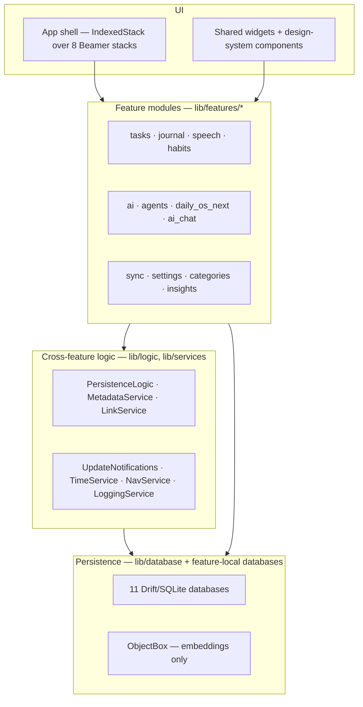

# What Lotti is

Lotti is a local-first personal assistant: a journal, task manager, habit
tracker and day planner that keeps its data on the user's own devices and runs
AI agents over it. It is one Flutter codebase targeting macOS, iOS, Android,
Linux and Windows.

Four properties shape nearly every design decision in the tree:

1. **Local-first.** SQLite is the source of truth. No server is required, and
   the app is fully functional offline.
2. **Privacy by construction.** No telemetry, no account, no vendor keys. See
   [security and privacy](security-and-privacy.md).
3. **Feature-modular.** `lib/features/<name>` is the unit of ownership. Modules
   own their UI, state, repositories and — where warranted — their own database.
4. **Provider-agnostic AI.** Cloud and local models sit behind one configuration
   model, so an on-device Ollama endpoint and a hosted API are the same kind of
   thing to the rest of the app.

# Layers

The layering is a convention, not an enforced boundary: a feature may reach the
database directly, and many do. What is enforced by structure is the
[GetIt/Riverpod split](bootstrap-and-di.md) — process-wide services in GetIt,
scoped state in Riverpod, never the reverse.

# The source tree

| Path | Contents |
|------|----------|
| `lib/features/` | Feature modules — the bulk of the app |
| `lib/database/` | The primary store and shared connection plumbing |
| `lib/classes/` | Freezed domain models shared across features |
| `lib/services/` | Process-wide services registered in GetIt |
| `lib/logic/` | Cross-feature write logic (`PersistenceLogic`, health import) |
| `lib/beamer/` | Router delegates, locations, app shell |
| `lib/widgets/` | Shared widgets not owned by a feature |
| `lib/themes/`, `lib/features/design_system/` | Theming and design tokens |
| `lib/l10n/` | ARB catalogues — twelve locales (`en`, `en_GB`, `cs`, `da`, `de`, `es`, `fr`, `it`, `nl`, `pt`, `ro`, `sv`) |
| `lib/utils/` | Small helpers |

Generated code (`*.g.dart`, `*.freezed.dart`, `objectbox.g.dart`) is checked in
and regenerated with `make build_runner`. It is never hand-edited.

# Where the interesting complexity lives

Three subsystems carry most of the app's difficulty, and each has its own
concept tree:

- **[Sync](../features/sync/)** — single-user multi-device replication over
  end-to-end encrypted Matrix, with an outbox, an ordered inbound queue,
  `(hostId, counter)` coverage tracking and peer backfill for gaps.
- **[Agents](../features/agents/)** — a persisted agent runtime with wake
  scheduling, change proposals under human review, and state modelled as a log
  projection.
- **[Daily OS](../features/daily_os_next/)** — long-lived day planning built
  on the agent runtime, with per-day agents and durable draft/refine jobs.

Architectural decisions behind these are recorded as ADRs in
[`docs/adr/`](../../docs/adr) — 44 of them at the time of writing. Concepts here
cite the ADRs they implement, rather than restating them: an ADR is a decision
at a point in time, while a concept describes what runs today.

# Reading order

| If you want to know… | Read |
|----------------------|------|
| How the app starts and what owns what | [Bootstrap and dependency injection](bootstrap-and-di.md) |
| Where data lives and how writes reach the UI | [Persistence layer](persistence.md) |
| How routing and the app shell work | [Navigation and app shell](navigation.md) |
| What is encrypted and what leaves the device | [Security and privacy](security-and-privacy.md) |
| How to diagnose a running app | [Logging and diagnostics](logging-and-diagnostics.md) |
| How it ships | [Platform targets, CI and release](platform-and-release.md) |
| What a journal entry actually *is* | [Domain concepts](../domain/) |
| How a specific feature behaves | [Feature concepts](../features/) |
