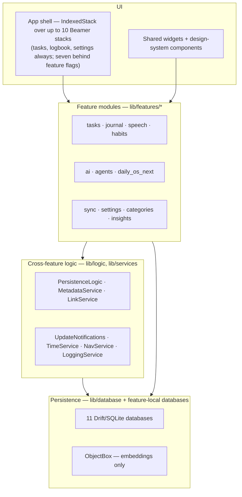
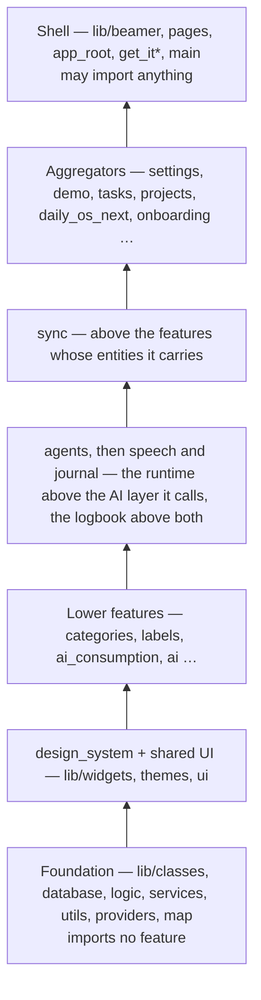

# What Lotti is

Lotti is a local-first personal assistant: a journal, task manager, habit
tracker and day planner that keeps its data on the user's own devices and runs
AI agents over it. It is one Flutter codebase targeting macOS, iOS, Android,
Linux and Windows.

Four properties shape nearly every design decision in the tree:

1. **Local-first.** SQLite is the source of truth. No server is required, and
   the app is fully functional offline.
2. **Privacy by construction.** No telemetry, no account, no vendor keys. See
   [security and privacy](security-and-privacy.md).
3. **Feature-modular.** `lib/features/<name>` is the unit of ownership. Modules
   own their UI, state, repositories and — where warranted — their own database.
4. **Provider-agnostic AI.** Cloud and local models sit behind one configuration
   model, so an on-device Ollama endpoint and a hosted API are the same kind of
   thing to the rest of the app.

# Layers

```mermaid
flowchart TD
  subgraph UI["UI"]
    Shell["App shell — IndexedStack over up to 10 Beamer stacks<br/>(tasks, logbook, settings always; seven behind feature flags)"]
    Widgets["Shared widgets + design-system components"]
  end
  subgraph Features["Feature modules — lib/features/*"]
    F1["tasks · journal · speech · habits"]
    F2["ai · agents · daily_os_next"]
    F3["sync · settings · categories · insights"]
  end
  subgraph Logic["Cross-feature logic — lib/logic, lib/services"]
    Persist["PersistenceLogic · MetadataService · LinkService"]
    Svc["UpdateNotifications · TimeService · NavService · LoggingService"]
  end
  subgraph Data["Persistence — lib/database + feature-local databases"]
    Dbs["11 Drift/SQLite databases"]
    OB["ObjectBox — embeddings only"]
  end
  Shell --> Features
  Widgets --> Features
  Features --> Logic
  Logic --> Data
  Features --> Data
```

## Intended dependency directions

The arrows are the intended direction of imports: the shell and shared widgets
depend on features, features on cross-feature logic and persistence, and logic
on persistence. Two consequences follow, and both are the target rather than
the state of the tree:

- **The lower layers do not import features.** `lib/classes`, `lib/database`,
  `lib/services`, `lib/logic` and `lib/utils` hold what features share; a type
  that one of them needs from a feature belongs below the feature instead.
- **Features depend on each other only through a seam.** Where one feature has
  to drive another, a registry or interface in the lower feature is filled by
  the higher one at startup — the agent-runtime registries in
  [bootstrap and DI](bootstrap-and-di.md) are the pattern — rather than one
  importing the other's internals.

A feature reaching the database directly, skipping the logic layer, is allowed
and common. The arrows forbid upward imports, not shortcuts downward.

## What is enforced

**The layer order.** `tool/architecture/layer_guard.dart` gives every module a
rank and holds every import in `lib/` to it; CI runs it in the analyze job, and
`make layer_check` runs it locally:

```mermaid
flowchart BT
  Foundation["Foundation — lib/classes, database, logic, services, utils, providers, map<br/>imports no feature"]
  DS["design_system + shared UI — lib/widgets, themes, ui"]
  Low["Lower features — categories, labels, ai_consumption, ai …"]
  Agents["agents, then speech and journal — the runtime above the AI layer it calls, the logbook above both"]
  Sync["sync — above the features whose entities it carries"]
  High["Aggregators — settings, demo, tasks, projects, daily_os_next, onboarding …"]
  Shell["Shell — lib/beamer, pages, app_root, get_it*, main<br/>may import anything"]
  Foundation --> DS --> Low --> Agents --> Sync --> High --> Shell
```

Read the arrows as "is imported by". The full order is the `featureOrder` list
in the guard, bottom to top: a feature may import the features before it,
never the ones after, and the order is the one that left the fewest upward
imports when the guard was introduced, adjusted by hand where the domain
decides (sync above the features it carries, the agent runtime above AI).
Two kinds of import break it:

- **upward** — a file imports a feature ranked above its own, including any
  foundation file importing a feature at all;
- **ui** — non-UI code (models, repositories, services, state) imports another
  feature's UI, whatever the ranks. A feature's UI is any file under one of its
  `ui`, `widgets`, `pages`, `routing`, `view(s)` or `widgetbook` directories.

The imports that already broke the order are listed in
`tool/architecture/baseline.json`, whose `_total` is the number left to fix.
A new break fails CI, and so does a listed one that no longer occurs, until
`--update-baseline` drops it — so the list only ever shrinks, and the change
that removes an import records it. A feature directory missing from the order
also fails, which makes ranking a new feature an explicit decision.

**Named rules.** `test/architecture/feature_import_direction_test.dart` keeps
four rules that predate the order, two of them finer than a feature:

| Rule | Why |
|------|-----|
| `features/agents` does not import `features/daily_os_next` | The agent runtime is generic; Daily OS registers itself into it |
| `lib/classes` does not import `features/agents` or `features/daily_os_next` | The shared models must not pull in the runtimes built on them |
| Nothing imports `features/settings_v2` | It was folded into `features/settings` and must not return as a second home |
| `features/settings/{domain,state}` do not import `features/settings/{routing,ui}` | The route registry imports every settings page, so the tree would depend on all of them |

Both checks look at direct imports only. A transitive check was tried and
rejected: almost everything reaches almost everything through
`nav_service → beamer → app_root`, so it would have flagged dozens of paths
that no single import can fix.

To remove a break, move the shared type down — into the lower feature or into
`lib/` — or invert the dependency through an interface the lower layer owns,
as the agent-runtime registries do.

**Debt counters.** Beside the layer order, CI holds six per-file counts to
baselines that may only shrink — and that fail while they are *behind* the
tree, so the change that removes a debt is the one that records it:

| Count | Tool | Make target |
|-------|------|-------------|
| getIt lookups outside the composition root | `tool/di` | `make getit_check` |
| `dart:developer` log calls outside `lib/services/` | `tool/logging` | `make developer_log_check` |
| legacy icon references | `tool/icons` | `make icon_check` |
| raw spacing, typography and colour values | `tool/design_tokens` | `make token_check` |
| `unawaited(...)` fire-and-forget futures | `tool/async` | `make unawaited_check` |
| lines in a file above 1,000 | `test/architecture/file_size_ratchet_test.dart` | — |

The [GetIt/Riverpod split](bootstrap-and-di.md) — process-wide services in
GetIt, scoped state in Riverpod — is held by a ratchet rather than by
structure: `tool/di` keeps each file's count of service-locator lookups from
growing, so existing lookups are tolerated while new ones fail CI.

# The source tree

| Path | Contents |
|------|----------|
| `lib/features/` | Feature modules — the bulk of the app |
| `lib/database/` | The primary store and shared connection plumbing |
| `lib/classes/` | Freezed domain models shared across features |
| `lib/services/` | Process-wide services registered in GetIt |
| `lib/logic/` | Cross-feature write logic (`PersistenceLogic`, health import) and the repositories every layer shares (`lib/logic/repositories/`: journal, checklists, projects) |
| `lib/beamer/` | Router delegates, locations, app shell |
| `lib/widgets/` | Shared widgets not owned by a feature |
| `lib/themes/`, `lib/features/design_system/` | Theming and design tokens |
| `lib/l10n/` | ARB catalogues — twelve locales (`en`, `en_GB`, `cs`, `da`, `de`, `es`, `fr`, `it`, `nl`, `pt`, `ro`, `sv`) |
| `lib/utils/` | Small helpers |

Generated code (`*.g.dart`, `*.freezed.dart`, `objectbox.g.dart`) is checked in
and regenerated with `make build_runner`. It is never hand-edited.

# Where the interesting complexity lives

Three subsystems carry most of the app's difficulty, and each has its own
concept tree:

- **[Sync](../features/sync/)** — single-user multi-device replication over
  end-to-end encrypted Matrix, with an outbox, an ordered inbound queue,
  `(hostId, counter)` coverage tracking and peer backfill for gaps.
- **[Agents](../features/agents/)** — a persisted agent runtime with wake
  scheduling, change proposals under human review, and state modelled as a log
  projection.
- **[Daily OS](../features/daily_os_next/)** — long-lived day planning built
  on the agent runtime, with per-day agents and durable draft/refine jobs.

Architectural decisions behind these are recorded as ADRs in
[`docs/adr/`](../../docs/adr), listed in its README. Concepts here
cite the ADRs they implement, rather than restating them: an ADR is a decision
at a point in time, while a concept describes what runs today.

# Reading order

| If you want to know… | Read |
|----------------------|------|
| How the app starts and what owns what | [Bootstrap and dependency injection](bootstrap-and-di.md) |
| Where data lives and how writes reach the UI | [Persistence layer](persistence.md) |
| How routing and the app shell work | [Navigation and app shell](navigation.md) |
| What is encrypted and what leaves the device | [Security and privacy](security-and-privacy.md) |
| How to diagnose a running app | [Logging and diagnostics](logging-and-diagnostics.md) |
| How it ships | [Platform targets, CI and release](platform-and-release.md) |
| What a journal entry actually *is* | [Domain concepts](../domain/) |
| How a specific feature behaves | [Feature concepts](../features/) |
