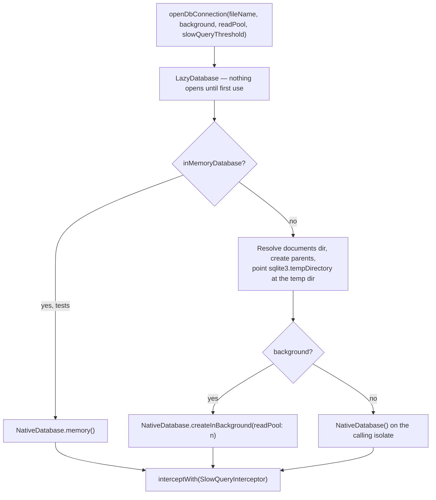
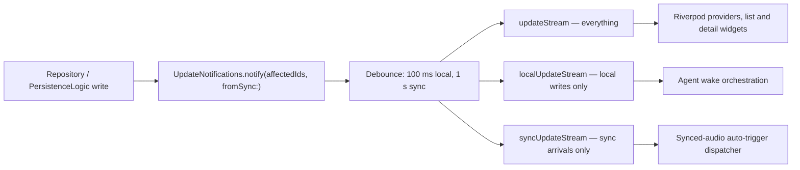

# One store per concern

Lotti is local-first: everything the user owns lives in the documents directory,
and nothing is required to leave the device. Rather than one monolithic schema,
the app runs **eleven Drift databases**, each with its own file, schema version
and migration history.

**Not every byte is in SQLite.** The databases hold structured data and metadata;
**audio recordings and images are separate files** under the documents directory,
referenced by path — the sync sender reads them through `AudioUtils.getAudioPath()`
and `getFullImagePath()` rather than pulling bytes out of a row. Backup and
migration work has to cover both, and embeddings are a third store again (below).

| Database | File | Schema | Owns |
|----------|------|--------|------|
| `JournalDb` | `db.sqlite` | 45 | Journal entities, tasks, links, tags, config flags — the primary store |
| `SyncDatabase` | `sync.sqlite` | 27 | Outbox, sequence log, host activity, inbound event queue, queue markers |
| `AgentDatabase` | `agent.sqlite` | 17 | Agent state, reports, observations, change proposals, wake history |
| `EditorDb` | `editor_drafts_db.sqlite` | 2 | Unsaved rich-text editor drafts |
| `ConsumptionDatabase` | `ai_consumption.sqlite` | 2 | AI token usage and the interaction ledger |
| `SettingsDb` | `settings.sqlite` | 1 | Key/value app settings, sync watermarks, saved filters |
| `Fts5Db` | `fts5_db.sqlite` | 1 | Full-text search index |
| `NotificationsDb` | `notifications.sqlite` | 1 | Scheduled and delivered notifications |
| `OnboardingMetricsDb` | `onboarding_metrics.sqlite` | 1 | First-run and activation measurement |
| `AiConfigDb` | (feature-local) | 1 | Providers, models, prompts, inference profiles |
| `DayProcessingDb` | `day_processing.sqlite` | 1 | Daily OS day-processing outbox |

Splitting by concern is what makes a heavy background writer — sync ingestion,
agent wake runs — unable to block a foreground journal read behind the same
write lock. It costs cross-database joins, which the app does not do: features
that need data from two stores read both and combine in Dart.

Embeddings are the exception to "everything is Drift". Vector search uses
**ObjectBox** (`lib/features/ai/database/objectbox_embedding_store.dart`),
because it provides on-device approximate nearest-neighbour search that SQLite
does not.

# Opening a connection

Every database goes through `openDbConnection()`, so they share one set of
decisions:

- **Background isolates by default.** `background: true` moves SQLite work off
  the UI isolate. It is set to `false` only when opening from an actor isolate,
  where nesting isolates would be wrong.
- **`readPool` offloads heavy reads** to read-only isolates. It only takes
  effect when `background` is true.
- **Pragmas are applied per connection** through the `setup` callback, so read-
  pool isolates inherit them:

  | Pragma | Value | Why |
  |--------|-------|-----|
  | `journal_mode` | `WAL` | Concurrent readers during writes |
  | `busy_timeout` | `5000` | Wait rather than fail on contention |
  | `synchronous` | `NORMAL` | WAL-appropriate durability/speed trade |
  | `wal_autocheckpoint` | `200` pages | Lowered from SQLite's 1000. Slow-query capture caught a 9-minute stall on a `sync_sequence_log` read whose p95 is under 60 ms — a checkpoint pause, not a bad plan. Shorter WAL means smaller, more frequent checkpoints and a narrower starvation window. |

- **`PRAGMA foreign_keys = ON` is connection-local**, so `JournalDb` re-applies
  it in `beforeOpen` on every connection, not once at migration time.

# Slow-query capture

Every connection is wrapped in a `SlowQueryInterceptor` with a default
threshold of **10 ms** — a fraction of the 16 ms frame budget, so anything it
logs is already a meaningful slice of a frame. Writing is gated behind the
logging domain in *Settings → Advanced → Logging Domains*, so the interceptor
costs nothing until someone is investigating.

The threshold deliberately does not catch N+1 chains: each individual link sits
under the bar. Those are caught by the coalescers in `JournalDb` and by
counting round-trips in tests. Tests and deep-dive captures pass
`Duration.zero` to surface every query.

# Migrations

`JournalDb` carries the only substantial migration history (45 versions). Its
strategy, in `database_migration.dart` and `database_migration_recent.dart`:

1. `onUpgrade` **takes a timestamped backup first** — `backup/db.<ts>.sqlite`
   — unless the database is in-memory. A failed backup is logged, not fatal.
2. Version steps run in order, adding tables, columns and partial indexes.
3. Partial index DDL lives in **top-level constants** shared by the `onUpgrade`
   migration, the `beforeOpen` self-heal, and the migration tests, so the three
   can never drift apart. Each string starts with `CREATE INDEX ` so callers
   can splice in `IF NOT EXISTS` with a single `replaceFirst`.
4. `beforeOpen` re-asserts indexes that a partially-applied migration may have
   left missing.

The indexes matter: `idx_journal_tasks_due_open` is keyed on the denormalized
`due_at` column added in v41, which replaced an expression index over
`json_extract(serialized,'$.data.due')`. The column lets the planner stream
`ORDER BY due_at ASC` straight from the index instead of parsing JSON per row.

# From write to UI

Nothing in the UI polls. Writes announce themselves through
`UpdateNotifications`, which fans one write out to three streams:

Picking the right stream is a correctness decision, not a preference:

- **`localUpdateStream`** drives agent wakes. If wakes listened to everything,
  a synced change would wake an agent on the receiving device for work the
  originating device already did.
- **`syncUpdateStream`** drives the synced-audio auto-trigger. If it listened to
  local edits, typing in a linked task would re-process the same audio.
- **`updateStream`** is for UI. `notifyUiOnly` exists to refresh widgets without
  reaching the wake orchestrator at all.

Notifications are **batched** — 100 ms for local writes, 1 s for sync arrivals —
so a bulk import or a sync catch-up produces a handful of rebuilds rather than
thousands.

# Backups and maintenance

`createDbBackup(fileName)` copies a database to
`backup/db.<yyyy-MM-dd_HH-mm-ss-S>.sqlite`. It runs automatically before a
`JournalDb` migration and on demand from the maintenance surfaces in
`lib/database/maintenance.dart`, which can also re-run FTS indexing, purge
deleted entries and recreate derived state. Timestamps come from
`package:clock`'s `clock.now()`, so tests can drive them with `withClock`.

# Where to look

| Concern | File |
|---------|------|
| Connection, pragmas, backup helpers | [`lib/database/common.dart`](../../lib/database/common.dart) |
| Primary store and its query mixins | [`lib/database/database.dart`](../../lib/database/database.dart) |
| Migration steps | [`lib/database/database_migration.dart`](../../lib/database/database_migration.dart), [`database_migration_recent.dart`](../../lib/database/database_migration_recent.dart) |
| Sync-side tables | [`lib/database/sync_db.dart`](../../lib/database/sync_db.dart) |
| Change notification | [`lib/services/db_notification.dart`](../../lib/services/db_notification.dart) |
| Slow-query interceptor | [`lib/database/slow_query_logging.dart`](../../lib/database/slow_query_logging.dart) |
| Maintenance operations | [`lib/database/maintenance.dart`](../../lib/database/maintenance.dart) |

Related: [bootstrap and dependency injection](bootstrap-and-di.md) for when each
database is registered, [the sync feature](../features/sync/) for what fills
`sync.sqlite`.
