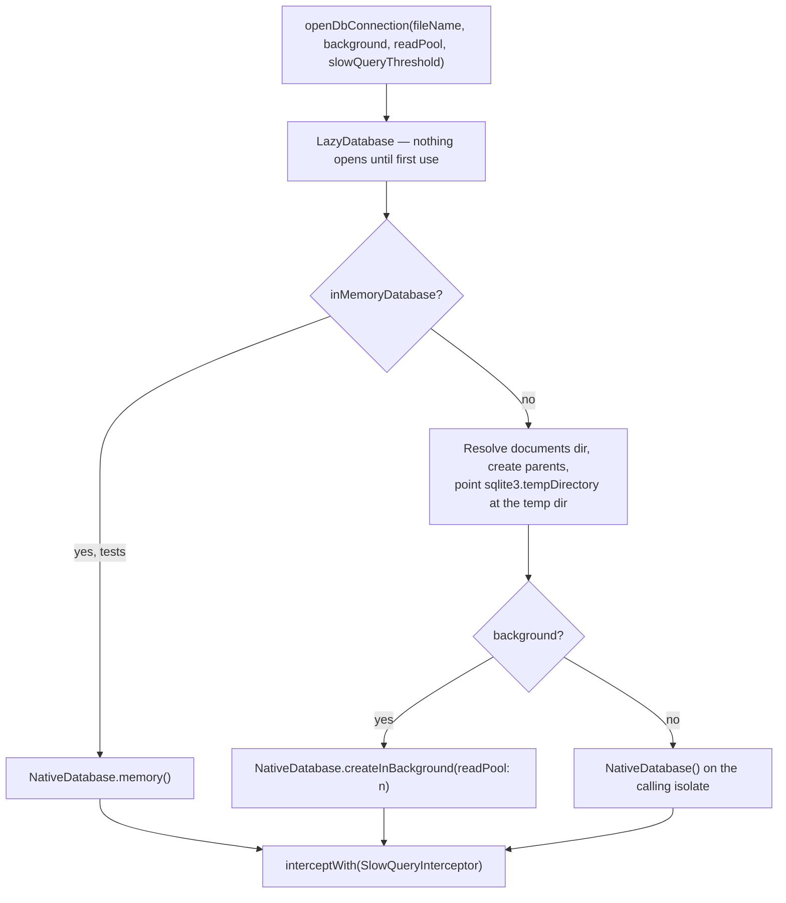
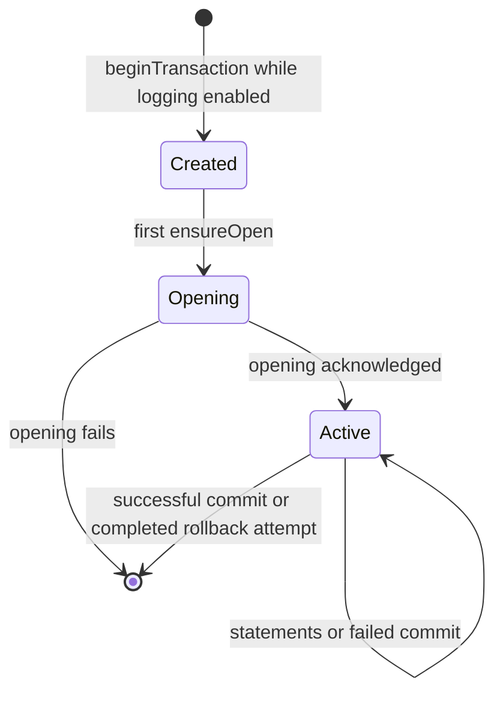
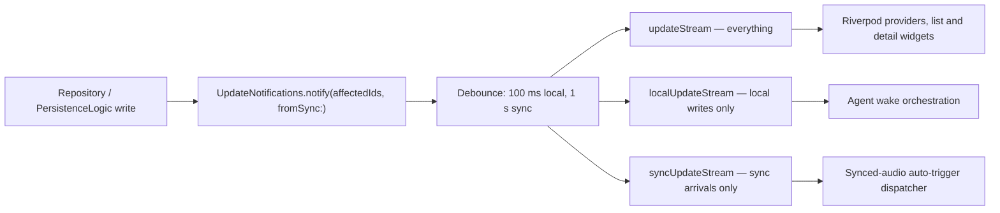
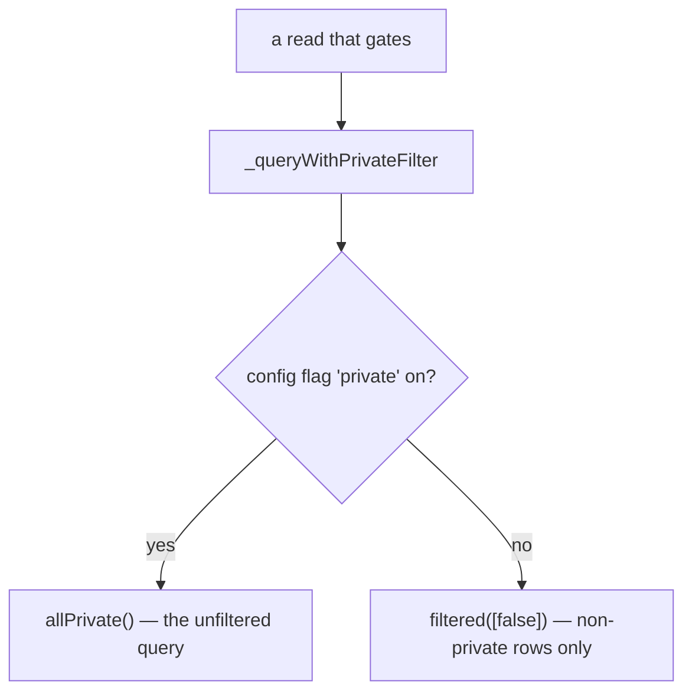

# One store per concern

Lotti is local-first: everything the user owns lives in the documents directory,
and nothing is required to leave the device. Rather than one monolithic schema,
the app runs **eleven Drift databases**, each with its own file, schema version
and migration history.

**Not every byte is in SQLite.** The databases hold structured data and metadata;
**audio recordings and images are separate files** under the documents directory,
referenced by path — the sync sender reads them through `AudioUtils.getAudioPath()`
and `getFullImagePath()` rather than pulling bytes out of a row. Backup and
migration work has to cover both, and embeddings are a third store again (below).

| Database | File | Schema | Owns |
|----------|------|--------|------|
| `JournalDb` | `db.sqlite` | 48 | Journal entities, tasks, links, tags, config flags — the primary store |
| `SyncDatabase` | `sync.sqlite` | 29 | Outbox, sequence log, host activity, inbound event queue, queue markers |
| `AgentDatabase` | `agent.sqlite` | 19 | Agent state, reports, observations, change proposals, wake history |
| `EditorDb` | `editor_drafts_db.sqlite` | 2 | Unsaved rich-text editor drafts |
| `ConsumptionDatabase` | `ai_consumption.sqlite` | 4 | AI token usage and the interaction ledger |
| `SettingsDb` | `settings.sqlite` | 1 | Key/value app settings, sync watermarks, saved filters |
| `Fts5Db` | `fts5_db.sqlite` | 1 | Full-text search index |
| `NotificationsDb` | `notifications.sqlite` | 1 | Scheduled and delivered notifications |
| `OnboardingMetricsDb` | `onboarding_metrics.sqlite` | 1 | First-run and activation measurement |
| `AiConfigDb` | `ai_config.sqlite` | 1 | Providers, models, prompts, inference profiles |
| `DayProcessingDb` | `day_processing.sqlite` | 1 | Daily OS day-processing outbox |

Splitting by concern is what makes a heavy background writer — sync ingestion,
agent wake runs — unable to block a foreground journal read behind the same
write lock. It costs cross-database joins, which the app does not do: features
that need data from two stores read both and combine in Dart.

Embeddings are the exception to "everything is Drift". Vector search uses
**ObjectBox** (`lib/features/ai/database/objectbox_embedding_store.dart`),
because it provides on-device approximate nearest-neighbour search that SQLite
does not.

Label assignment tolerates SQLite constraint errors for duplicate assignments
and label definitions that have not arrived through sync. The classifier uses
the primary code's low byte, including extended codes transported through a
background isolate. Other SQL errors propagate so reconciliation transactions
roll back instead of committing a partial label set.

# Opening a connection

Every database goes through `openDbConnection()`, so they share one set of
decisions:

- **Background isolates by default.** `background: true` moves SQLite work off
  the UI isolate. Callers can opt into same-isolate connections with `false`;
  `SettingsDb` defaults to that mode, as do many focused tests.
- **`readPool` offloads heavy reads** to read-only isolates. It only takes
  effect when `background` is true, and `inMemoryDatabase: true` bypasses it —
  a test that wants to exercise a pool must be file-backed.

  | Database | `readPool` |
  |----------|-----------:|
  | `db.sqlite` (`JournalDb`) | 4 |
  | `agent.sqlite` (`AgentDatabase`) | 2 |
  | `notifications.sqlite` (`NotificationsDb`) | 2 |
  | `ai_consumption.sqlite` (`ConsumptionDatabase`) | 1 |
  | `day_processing.sqlite` (`DayProcessingDb`) | 1 |

  Anything not listed — including `sync.sqlite` — takes `openDbConnection`'s
  default of 0.

  **A pool is not a free win, and `readPool: 0` is not a substitute for a
  transaction.** A single executor serialises individual *statements*, not
  *sequences*: a read, an `await`, and a later write can still interleave with
  another caller's statements on the same executor. So a check-then-act pair
  that is not wrapped in a transaction is **already racy at 0**.

  What a pool changes is how easy the race is to hit. Pooled reads can also
  serve a snapshot taken before a queued write commits, which widens the window
  from "interleaved between statements" to "stale by a whole transaction".

  Giving `sync.sqlite` a pool was attempted and abandoned on those grounds
  (#3720): review surfaced four read-after-write pairs in the outbox,
  sequence-log and inbound-queue paths — none inside a transaction — that the
  pool would have made materially more likely to fire, without the PR
  addressing any of them. The durable fix for those sites is a transaction
  around the read and the write, which is worth doing whether or not a pool is
  ever added.
- **Pragmas are applied per connection** through the `setup` callback, so read-
  pool isolates inherit them:

  | Pragma | Value | Why |
  |--------|-------|-----|
  | `journal_mode` | `WAL` | Concurrent readers during writes |
  | `busy_timeout` | `5000` | Wait rather than fail on contention |
  | `synchronous` | `NORMAL` | WAL-appropriate durability/speed trade |
  | `wal_autocheckpoint` | `200` pages | Lowered from SQLite's 1000, targeting smaller, more frequent checkpoints. Executor timing alone does not establish that checkpoints caused historical stalls. |

- **`PRAGMA foreign_keys = ON` is connection-local**, so `JournalDb` re-applies
  it in `beforeOpen` on every connection, not once at migration time.

# Slow-query capture

Every connection is wrapped in a `SlowQueryInterceptor` with a default
threshold of **10 ms**. It times the awaited executor call even when logging
is off; file writing and additional wall-clock metadata are gated behind
*Settings → Advanced → Logging Domains*.

The measured duration includes executor scheduling, isolate transport, waiting
behind other work, and native SQLite execution. It is neither native SQL time
nor UI-blocked time. The optional `TIMING` row records `scope=executorAwait`,
`started`, `completed`, and `inFlightAtStart`. Both timestamps bracket the
executor call, before query-plan capture. `inFlightAtStart` counts outstanding
calls through that interceptor, including the new call; it is not the executor's
queue depth. Correlated completion times can expose shared stalls without
misattributing them to individual SQL statements. Wall-clock bounds can jump
with clock changes; the duration still comes from a monotonic stopwatch.

**The second tier is 200 ms.** A query crossing `superSlowThreshold` captures
**`EXPLAIN QUERY PLAN`** (selects only) and is duplicated into the daily
`super_slow_queries` file alongside `slow_queries`. The plan describes the SQL
access path; it does not explain scheduler, lock, I/O, or suspend delays. The
header timestamp is the later report time, which can include EXPLAIN latency.
The two files contain overlapping events and must not be summed as independent
work. Their percentiles describe only calls exceeding the logging threshold.

The background factory's setup callbacks expose SQLite setup or isolate startup,
not a per-call native timing hook. Exact queue/native attribution would need a
worker-side executor measurement with a correlation identifier transported
through the isolate protocol. The current metadata makes no such attribution.

## Transaction overlap

When logging is enabled as `beginTransaction` runs, the interceptor assigns a
local transaction ID and records its parent ID for nested transactions.
`transaction.open` times the first `ensureOpen` await, which includes acquiring
the executor's transaction turn. `transaction.commit` and
`transaction.rollback` time their respective executor awaits. They use
`scope=executorAwait`, just like queries.

The separate `operation=transaction`, `scope=transactionLifetime` record covers
the opening acknowledgement through the ending acknowledgement. Its statement
is the outcome (`COMMIT`, `ROLLBACK`, or `ROLLBACK_FAILED`), not another SQL
execution. It includes application work between queries and the end await;
it is not exact lock-hold time. Do not add these spans to statement duration
totals. All transaction records use the same reporting thresholds and duplicate
super-slow records to both files.

`TRANSACTION` rows attach the owning `id`, optional `parent`, and
`activeAtStart` IDs to operations. Active means the opening acknowledgement
has arrived and the end has not; the transaction's own ID can appear in its
active list. These IDs belong to one interceptor instance, so correlate them
within that database connection and timing window, not across app sessions.
Overlap is evidence of concurrent transaction lifetime, not proof that it
blocked a query: read pools may bypass that executor. Transactions still
opening are excluded from the active list.

A failed commit retains its observation for Drift's subsequent rollback;
rollback completion releases it even if rollback throws. Reporter failures are
contained so diagnostics cannot turn an acknowledged BEGIN or COMMIT into an
application failure, or replace the original database exception.

Visibility is deliberately incomplete: transactions created before the gate
is enabled are not tracked, and unfinished transactions have no lifetime
record. Disabling logging suppresses output but completed transactions still
release their observations. The optional first-call stack setting captures
each transaction's initiating stack, reused for its opening and lifetime;
ordinary SQL retains one capture per unique statement. Stack rows are emitted
only in the super-slow file and retain application frames.

The threshold deliberately does not catch N+1 chains: each individual link sits
under the bar. Counting round-trips in tests catches those chains;
`JournalDb` coalesces adjacent entity lookups to reduce them. Deep-dive captures pass
`Duration.zero` to surface every query.

Own-host reservation and pending-burn audits select only `counter`, using the
existing `idx_sync_sequence_log_host_status` index and sorting that sparse
subset. This deliberately avoids SQLite choosing a host/counter history scan
merely to satisfy ordering. The query has no new index or migration cost.

# Migrations

`JournalDb`, `SyncDatabase`, and `AgentDatabase` each have substantial migration
histories. The journal strategy lives in `database_migration.dart` and
`database_migration_recent.dart`:

1. `onUpgrade` takes a timestamped backup first — `backup/db.<ts>.sqlite` —
   unless the database is in-memory. A failed backup is logged, not fatal.
2. **Every version step, the index reconcile that ends them, and the
   version stamp run in one transaction.** Drift runs `onUpgrade` outside
   one and writes `user_version` only after `onUpgrade` and `beforeOpen`
   have both completed, so the transaction stamps `PRAGMA user_version`
   itself before committing (Drift's later write only repeats it). SQLite's
   DDL is transactional, so an interrupted upgrade rolls back to the version
   that was running instead of leaving a half-applied schema at the old
   `user_version` for the next launch to migrate again, and a kill after the
   commit cannot leave the new schema under the old stamp. That is why the
   steps no longer probe for tables before acting: on a database that
   shipped, every table a step needs exists, and a real schema bug should
   fail the upgrade loudly (the history verifier catches it in development).
   The probes that remain are conditional on an install's history:
   `_ensureLabelTables` for pre-release v26 installs, the v47 drop of the
   v20 `category_id` column, and `_addColumnUnlessPresent` around every
   column-adding step before v48 — those steps shipped without the
   transaction, so an install killed mid-step can already hold the column,
   and a duplicate-column refusal inside the atomic upgrade would roll it
   back on every launch. Steps from v48 on need no such check.
   `_columnExists` propagates a failing PRAGMA rather than reading it as
   "absent". Foreign-key enforcement is off during the upgrade (it cannot
   change inside a transaction) and on from `beforeOpen` onward.
3. Version steps run in order, adding tables, columns and partial indexes.
   Current index definitions may reference columns absent in historical
   schemas: the task priority index is created only after v29 adds priority
   columns, even for a journal upgrading from before v25.
4. Partial index DDL lives in top-level constants used by migrations. Callers
   can add `IF NOT EXISTS` with `replaceFirst` where needed.
5. `beforeOpen` repairs the specific indexes named there; it does not rebuild
   every index in the schema.

Every migration test starts from a schema that shipped, seeded through
`test/database/schema_fixtures.dart` (`createJournalSchema(sqlite, N)`).
Versions that were introduced and superseded inside one pull request (26,
27, 31–36) never existed on a device, so a test for a step in that range
starts from the last version that did (25 or 30) and lets the ladder run.
The one hand-written shape that remains is deliberate: the v28 tests in
`labels_migration_test.dart` seed the real v25 schema, add the pre-cascade
`label_definitions`/`labeled` tables by hand and stamp the database v27,
because that pre-release shape is exactly what the v28 rebuild exists to
repair and no shipped schema contains it. The v18 test in
`test/database/database_test.dart` exercises the complete upgrade and
verifies that its existing row survives with default priority.

**The real historical schemas are committed.** `test/database/schemas/`
holds `journal_v<N>.sql` for every journal version that ever shipped since
v18: the DDL of `database.drift` at the last commit where N was current,
extracted by `tool/db_schema/extract_journal_schema.dart` (Drift's own
`schema dump` does not build with the drift_dev this repository can resolve).
`test/database/journal_schema_history_test.dart` creates a database from each
file, upgrades it, and diffs tables, columns and indexes against a fresh
install — the check `SchemaVerifier` would run. Bumping `schemaVersion`
means running the tool for the new version and committing the file; the test
fails until you do. That test is what found the v24 drift below.

**Indexes are reconciled from the declared schema on every upgrade.**
`_reconcileIndexesWithSchema` ends `onUpgrade`: it drops explicit indexes on
Drift-managed tables that `database.drift` no longer declares, recreates
declared ones whose stored definition differs (compared through
`normaliseIndexDefinition`, which discards only case, whitespace, quoting
and the default `COLLATE BINARY`/`ASC`), and creates declared ones that are
missing. An index change — new, gone, or reshaped under the same name — is
therefore an edit to `database.drift` plus a version bump, never a
hand-written `CREATE INDEX` in a migration step. It exists because installs from before v25 (October
2025) still carried up to seventeen single-column indexes the original schema
created and later versions stopped declaring but never dropped, and lacked
the two date indexes a fresh install has; v47 is the release that ran it for
them. Tables Drift does not manage — `tag_entities` and `tagged`, left in
place when tags were removed — are not touched.

The indexes matter: `idx_journal_tasks_due_open` is keyed on the denormalized
`due_at` column added in v41, which replaced an expression index over
`json_extract(serialized,'$.data.due')`. The column lets the planner stream
`ORDER BY due_at ASC` straight from the index instead of parsing JSON per row.

They also cost: every journal upsert rewrites the row, so each index is paid
for on every write. v46 dropped nine that duplicated an index SQLite already
had — the single-column DESC twins of the `date_from`/`date_to` indexes (an
index is walked in either direction), the `idx_*_definitions_id` indexes on
primary keys, the single-column `linked_entries` indexes shadowed by their
composite prefixes, and the lone boolean `idx_linked_entries_hidden`. A new
index needs a query that the planner demonstrably picks it for; the EXPLAIN
tests under `test/database/` are where that is shown.

# Write atomicity

Three write paths do a check before they write, and each runs the check and
the write in **one Drift transaction**. Drift serialises transactions on the
write connection, so the second of two concurrent writes to the same row waits
for the first and then sees its result — a pooled read snapshot cannot slip
between the check and the write.

- **`JournalDb.updateJournalEntity`** reads the stored row, compares vector
  clocks, upserts, records or resolves the conflict row, and reconciles the
  `labeled` table inside the transaction. Two concurrent writes of one id with
  concurrent clocks therefore end with one applied and one recorded in
  `conflicts`, never a silent overwrite. The JSON sidecar — the sync payload —
  is written **after** commit, so it never describes a row that rolled back and
  the writer lock is never held across file I/O; sidecar writes for one entity
  are published in commit order, so two accepted writes cannot leave the earlier
  document on disk for the later row. The sync inbound handler wraps the same
  call together with the entity's embedded links in an outer transaction; the
  inner one nests. A sidecar write that fails after commit is not yet retried
  durably — that repair is tracked separately.
- **`JournalDb.upsertEntryLink`** runs its equality pre-read, the
  `(from_id, to_id, type)` duplicate check, the tombstone replacement and the
  upsert the same way, so a local link creation racing the same link arriving by
  sync is blocked as a duplicate instead of colliding on the UNIQUE constraint.
  A failing pre-read propagates; it is not swallowed.
- **Definition upserts** (`upsertEntityDefinition` and the five typed
  variants) refuse a definition that is **strictly older** than the stored one.
  Definitions replicate as whole documents and every local edit path refreshes
  `updatedAt`, so "the later edit wins" — and this gate is where that rule is
  enforced against a delayed sync event or a historical re-send. When both
  sides carry a vector clock that orders them the clock decides; otherwise
  `updatedAt` does, an exact tie applies the incoming copy, and the stored row
  is read by id with no `deleted`/`private` filter so an older live copy cannot
  resurrect a newer deletion. The gate returns 0 for a refused write, and both
  callers honour it: the sync apply path neither reindexes nor announces a
  refused definition, and `PersistenceDefinitionOps` rebuilds a refused local
  edit from the stored stamp — a timestamp strictly above the stored one, the
  stored vector clock carried over — and writes it again, so a user's action
  applies and wins on every peer; an edit refused twice is reported as unsaved
  and never announced or synced.

# From write to UI

Journal writes announce themselves to the UI through
`UpdateNotifications`, which fans one write out to three streams:

Picking the right stream is a correctness decision, not a preference:

- **`localUpdateStream`** drives agent wakes. If wakes listened to everything,
  a synced change would wake an agent on the receiving device for work the
  originating device already did.
- **`syncUpdateStream`** drives the synced-audio auto-trigger. If it listened to
  local edits, typing in a linked task would re-process the same audio.
- **`updateStream`** is for UI. `notifyUiOnly` exists to refresh widgets without
  reaching the wake orchestrator at all.

Notifications are **batched** — 100 ms for local writes, 1 s for sync arrivals —
so a bulk import or a sync catch-up produces a handful of rebuilds rather than
thousands.

## What a notification carries

The payload is a `Set<String>` of **routing keys**, and they are heterogeneous —
this is the part that surprises people. `JournalEntityExtension.affectedIds` seeds
the set with the **entity's own id**, adds **related ids** (a habit completion adds
its `habitId`, a checklist its items), *and* adds a static type token; a task-agent
notification carries `agentId` and `taskId` the same way. So a listener may be
matching an id, a type, or a change class:

| Kind | Examples |
|------|----------|
| **Entity ids** | the written entity's `id`, plus linked ids the write touched |
| Static type tokens — **most** `JournalEntity` variants, not all sixteen | `TEXT_ENTRY`, `TASK`, `AUDIO`, `IMAGE`, `EVENT`, `SURVEY`, `WORKOUT`, `HABIT_COMPLETION`, `AI_RESPONSE`, `DAY_PLAN`, `RATING`, `PROJECT`. `checklist`, `checklistItem`, `measurement` and `quantitative` have no token of their own |
| Definition and settings changes | `CATEGORIES_CHANGED`, `HABITS_CHANGED`, `DASHBOARDS_CHANGED`, `MEASURABLES_CHANGED`, `LABELS_CHANGED`, `LABEL_USAGE_CHANGED`, `SETTINGS_CHANGED`, `PRIVATE_FLAG_TOGGLED` |
| Cross-cutting | `LINK_CHANGED`, `AGENT_CHANGED`, `AI_CONSUMPTION_CHANGED`, `INBOX_CHANGED` |
| **Dynamic, prefixed** | `PROJECT_ENTITY_UPDATE:<projectId>`, and `PROPAGATED::<token>` below |

**No entity *data* travels** — only identifiers and labels — so a listener always
re-reads. What it must not assume is that a key is one of the static tokens: two of
the five kinds are computed at emit time.

**The `PROPAGATED::` prefix is additive, and it exists for the wake orchestrator.**
When a write is a *fan-out* — the project that gained a task because someone linked
one, rather than the task that was edited — the emitter puts **both** forms in the
same set: the bare token *and* `PROPAGATED::<token>`. The bare one is kept
deliberately, so consumers reacting to the legacy form keep refreshing.

So a UI provider matching only the bare token is **correct and complete** — it
cannot miss a fan-out, because the bare token is always there too. The prefix is
for the one consumer that needs to tell the two apart:
`WakeBatchRouter` **can** defer a propagated-only match to the next morning, so a
project agent does not spend tokens every time a task appears under it.

**That deferral is opt-in per subscription, not a global rule.** `WakeOrchestrator`
defaults `deferPropagatedMatches` to `true`, and subscriptions that need immediacy
pass `false` — task agents and the sync event handlers both opt out.

`agentExecutionZoneKey` is the other half of the same concern. Writes made *inside*
an agent's own execution run in a zone carrying that key, which
`PersistenceLogic` reads as `isAgentExecution` — so an agent's own writes do not
feed back as a reason to wake it again.

# Private visibility is gated three different ways

`_JournalDbConfigFlags` owns the in-memory config-flag cache and
`_queryWithPrivateFilter`, which dispatches a read to an all-private or a
filtered variant:

**That helper is only one of three mechanisms**, which is why grepping for it
undercounts the gate badly:

| Mechanism | Where |
|-----------|-------|
| `_queryWithPrivateFilter` | `journal_queries`, `definitions`, `project_queries`, `links_ratings` |
| **`privateStatuses` passed as a parameter**, so the caller decides | `task_queries`, `task_query_builders`, `task_due_queries` |
| **Raw SQL reading the flag directly** | `insights_queries` uses a `private_flag` CTE; `data_queries` uses a direct `config_flags` subquery in `getHabitCompletionRecordsInRange` |

Of the ten query-bearing mixins, **nine gate on private one of these ways**. The
exception is `_JournalDbEntityOps`, which is maintenance and write operations
rather than a read path.

## What is genuinely not filtered

Not "by-id reads" as a class — `getLabelDefinitionById` and the id-**batch**
journal reads (`getJournalEntitiesForIds` and friends) go through the helper.
What does not filter is narrower:

- **`journalEntityById`** — the single-entity read behind every detail page.
- `getDayAudioEntries`.
- `countAllJournalEntries`, which counts deleted rows too.

So the shape is: **lists, searches and batches thin out private entries; fetching
one entity you already have the id for does not.** That is coherent with what the
flag is for — it changes what browsing surfaces, not what you can open when you
already hold the identifier.

Two consequences worth holding on to:

- **The gate is a read filter, not encryption, and not a boundary.** The row is
  stored like any other, a detail page shows it, and a deep link to one resolves.
  See [security and privacy](security-and-privacy.md).
- **A new list or search query must gate deliberately**, by one of the three
  mechanisms above. Nothing in the type system obliges it, so a read that queries
  the journal tables directly simply returns private rows — and looks like a
  working query.

# Backups and maintenance

## Journal image paths and screenshot repair

`JournalImage.data.imageDirectory` stores a platform-neutral,
documents-relative directory with forward slashes and leading/trailing
separators, for example `/images/2026-08-15/`. It is not an absolute filesystem
path. Writers strip the metadata-only leading separator and construct physical
paths with `path.join`; AI image readers resolve only this canonical location
inside the documents directory.

A legacy screenshot writer persisted `images/...` and concatenated it directly
to the documents path. A profile rooted at `Documents` therefore wrote the file
under the sibling `Documentsimages` directory. Inline rendering historically
used the same malformed concatenation, so the screenshot remained visible,
while AI's containment check correctly rejected it as outside the profile.

Settings → Advanced → Maintenance exposes the explicit, repeatable **Repair
screenshot storage** pass implemented by `ImagePathMigrationService`. It scans
all non-deleted `JournalImage` rows, including private, starred, and every flag
state. For each legacy file it:

1. copies to a uniquely named temporary file in the canonical target directory;
2. verifies length and SHA-256 before atomically renaming the temporary file;
3. persists the canonical metadata through `PersistenceLogic`; and
4. deletes the legacy file only after the metadata write succeeds.

If a crash or persistence failure interrupts the pass, the legacy source is
retained and a later run can finish safely. Existing canonical files are never
overwritten with different bytes; conflicts, genuinely missing files, invalid
paths, and failures are counted and reported without aborting the whole pass.
The normal display resolver retains a read-only legacy fallback until repair,
so affected screenshots do not disappear from existing journal entries.

`createDbBackup(fileName)` snapshots a database to
`backup/<stem>.<yyyy-MM-dd_HH-mm-ss-S>.sqlite` — `db.…` for the journal,
`sync.…` and `agent.…` for the others — with `VACUUM INTO` on a private
connection, run off the caller's isolate. The snapshot therefore holds every
committed transaction, including those still in the WAL that a plain copy of
the main file would miss, and arrives compacted. A file SQLite cannot open
(the corrupt store a user is about to reset) is copied byte for byte with its
WAL instead, and the fallback is logged, so a reset is never blocked on a
backup. It runs automatically before a **journal, sync or agent migration**
(`backupBeforeMigration`, which logs a failure and continues rather than
refusing to open the app) and on demand from
*Settings → Advanced → Maintenance*. Once a snapshot is complete, older
snapshots of the same source beyond the three newest are deleted, WAL
sidecar included, so `backup/` holds at most three snapshots per store (plus
the `-wal` sidecar a raw-copy fallback keeps beside its snapshot); the
snapshot just written is always among the three, even if the device clock
has moved backwards since the previous one, and a failed snapshot never costs
an existing one.
That helper is a **legacy per-database fallback**, not a supported profile
backup. It has no store identity, manifest, checksum, media coverage,
encryption, coordinated quiescence, or restore path. The corruption fallback's
raw copy is not safe while WAL-backed writers are active.

The implementation-consumable profile inventory now lives in
`ProfileBackupCatalog`. It includes authoritative databases, media and sync
sidecars; marks FTS, ObjectBox embeddings and waveform previews rebuildable;
excludes logs, sibling guest worlds, the device-global profile registry and the
legacy `backup/` directory. It also excludes the legacy Daily OS file outbox
after its mandatory startup import into `day_processing.sqlite`, including
recovered atomic scratch files retained for rollback. SQLite journal companions
remain a hard rejection because they show that strict quiescence has not been
proven. `QuiescedProfileSnapshotService`
can then copy a closed profile into a partial stage, rehash the source, validate
SQLite integrity and schema versions, verify the manifest against the payload,
and publish with one rename. It does not stop writers; lifecycle orchestration
must satisfy that precondition. The full contract and remaining runtime layers
are in [backup and restore](../features/backup-and-restore.md).

`lib/database/maintenance.dart` owns physical database upkeep. Two shapes,
chosen by what the services holding a database can survive:

- **Empty through the live connection** — `clearEditorDb`, `clearSyncDb`
  delete every row of every table (enumerated from `sqlite_master`, so the
  raw-SQL `sync_sequence_watermarks` is included), `VACUUM`, and then call
  `notifyUpdates` for those tables, because raw statements bypass Drift's
  stream invalidation and the outbox count behind the sync badge would
  otherwise keep its pre-reset value. Every service keeps a valid handle and
  the reset takes effect immediately. `clearEditorDb` also calls
  `EditorStateService.resetDrafts`, since drafts live in memory with a
  debounced write and would otherwise be restored into an open editor or
  written back moments later. Unlinking the file instead would leave those
  handles writing into a ghost inode until restart and an orphaned `-wal`
  beside the file created on the next launch, ready to be replayed into it.
- **Close, then delete with companions** — `deleteAgentDb` backs up, closes
  the registered `AgentDatabase`, removes the file with `-wal`, `-shm` and
  `-journal`, and its caller quits the app, because every holder is now on a
  closed handle. `recreateFts5` does the same for the search index and then
  registers a fresh instance.

The `sent`-outbox purge lives here too. Historical re-send orchestration
belongs to Sync and lives in
`lib/features/sync/services/historical_sync_service.dart`; it uses database
and repository row APIs without making queueing, retry, or Sync result types
part of the database maintenance layer. **The deleted-entry purge is not in
either service** — `purgeDeleted` lives in
`lib/database/database_entity_ops.dart` alongside the rest of `JournalDb`'s
entity operations, which is where to look for it.

Both whole-journal walks are **rowid keyset scans**, not `OFFSET` pages:
`purgeDeletedFiles` reads soft-deleted rows 500 at a time with
`WHERE deleted = 1 AND rowid > ?`, deleting each entity's media and JSON
sidecar as it goes, and `recreateFts5` reads live rows the same way to feed
the index (order is irrelevant to FTS). An `OFFSET` page re-scans every
earlier row, which made a rebuild quadratic in the journal's size. Counts
come from `COUNT(*)`, progress is reported after each table (purge) or each
percent (rebuild), and nothing sleeps to make it visible. Neither walk takes
a transaction: a row inserted or deleted concurrently is simply seen or not
by the next chunk, which is correct for both — a new live entry gets indexed
by the app's own write path, and a row deleted mid-purge has nothing left to
purge.

# Where to look

| Concern | File |
|---------|------|
| Connection, pragmas, backup helpers | [`lib/database/common.dart`](../../lib/database/common.dart) |
| Primary store and its query mixins | [`lib/database/database.dart`](../../lib/database/database.dart) |
| Migration steps | [`lib/database/database_migration.dart`](../../lib/database/database_migration.dart), [`database_migration_recent.dart`](../../lib/database/database_migration_recent.dart) |
| Sync-side tables | [`lib/database/sync_db.dart`](../../lib/database/sync_db.dart) |
| Change notification | [`lib/services/db_notification.dart`](../../lib/services/db_notification.dart) |
| Slow-query interceptor | [`lib/database/slow_query_logging.dart`](../../lib/database/slow_query_logging.dart) |
| Maintenance operations | [`lib/database/maintenance.dart`](../../lib/database/maintenance.dart) |
| Historical Sync staging and retry | [`lib/features/sync/services/historical_sync_service.dart`](../../lib/features/sync/services/historical_sync_service.dart) |
| Journal image paths and legacy screenshot repair | [`lib/utils/image_utils.dart`](../../lib/utils/image_utils.dart), [`lib/features/journal/service/image_path_migration_service.dart`](../../lib/features/journal/service/image_path_migration_service.dart) |
| Profile backup inventory, manifest and staging | [Backup and restore](../features/backup-and-restore.md) |

Related: [bootstrap and dependency injection](bootstrap-and-di.md) for when each
database is registered, [the sync feature](../features/sync/) for what fills
`sync.sqlite`.
