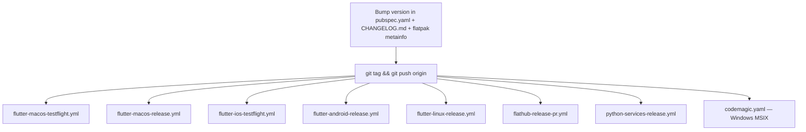

# One codebase, five targets

| Platform | Distribution |
|----------|--------------|
| macOS | TestFlight and direct release build |
| iOS | TestFlight |
| Android | APK / AAB |
| Linux | Flatpak (Flathub) and tarball |
| Windows | MSIX |

The Flutter SDK is **pinned in `.fvmrc`** (currently 3.44.8). *Locally*, every
command is expected to run through FVM — `fvm flutter …`, `fvm dart …`. CI does
not use that prefix: each provider selects the pinned SDK for the build machine
and then invokes bare `flutter` and `dart`. The pin is honoured by SDK
selection there, not by the command prefix.

Dart SDK constraint: `>=3.12.0 <4.0.0`; Flutter `>=3.44.0`.

## Bumping the Flutter version

`.fvmrc` is the source of truth, but it is not the only place the version is
written down. Most consumers follow it automatically; one does not:

| Consumer | Follows `.fvmrc`? |
|----------|-------------------|
| GitHub Actions lanes | Yes — `kuhnroyal/flutter-fvm-config-action` reads it |
| Codemagic Windows release | Yes — `environment.flutter: fvm` reads it |
| [`.vscode/settings.json`](../../.vscode/settings.json) | Yes — points at the `.fvm/flutter_sdk` symlink, which `fvm use` repoints |
| [`flatpak/com.matthiasn.lotti.flatpak-flutter.yml`](../../flatpak/com.matthiasn.lotti.flatpak-flutter.yml) | **No — hand-edit the Flutter `tag:`** |

So a Flutter bump is `.fvmrc` **plus** the Flatpak manifest's Flutter `tag:`.
Both currently read 3.44.8. Drift there is easy to miss because a stale tag
still resolves as long as it clears the `>=3.44.0` constraint floor — the
manifest sat at 3.44.0 through several pin bumps before anyone noticed, meaning
Flathub users ran an engine nobody else was building against.

A stale pin does not announce itself. It surfaces one layer down, as
`pub get` failing version solving — "the current Dart SDK version is X, because
lotti requires SDK version >=3.12.0 <4.0.0, version solving failed" — which
reads like a dependency problem rather than a toolchain one. The Windows lane
sat broken this way across a dozen consecutive release tags.

# Continuous integration

Every push to every branch runs:

| Workflow | What it enforces |
|----------|------------------|
| `flutter-analyze.yml` | `flutter analyze` — the zero-warning policy |
| `flutter-test-linux-faster.yml` | The fast unit/widget test lane on Linux |
| `flutter-matrix-test.yml` | Sync tests against a real Matrix homeserver |
| `okf-validate.yml` | This knowledge bundle stays conformant and its code pointers still resolve |

Two more run on **every** branch push despite looking scoped:

- `type-check.yml` — mypy, with **no path filter at all**. Advisory: it runs
  with `continue-on-error`.
- `flatpak-foreign-deps.yml` — path-filtered on *pull requests*, but unfiltered
  on branch pushes.

Genuinely path-filtered, both on pushes *and* pull requests to `main`:
`python-tools-ci.yml` (the Python tools) and `manual.yml` (docs-site) — the latter
also runs on a nightly cron (`23 2 * * *`) and on manual dispatch.

`manual-capture-check.yml` is pull-request-only and exists because the two
cadences above leave a gap: the harnesses render real production widgets, so
app code is what usually breaks them, but `manual.yml` does not watch `lib/`
and no longer captures on push at all. It runs the same capture for **one**
locale and publishes nothing. The locale defaults to German rather than the
authoring locale, because every other locale falls back to English — a
rendering that only breaks once a translation is involved stays green there.
Override with the `MANUAL_CHECK_LOCALE` repository variable.

`manual.yml` is also the manual's **publishing** lane, built around a
Cloudflare R2 bucket rather than git or Pages alone. Screenshots publish to
`manual/screenshots/<version>/` and each version's built site to
`manual-site/<version>/`; `development` prefixes are mutable (synced with
deletion), release prefixes are immutable — publishing refuses to overwrite an
existing manifest or `.snapshot.json` marker, and markers upload last so a
half-uploaded snapshot is never publishable. Every Pages deploy mirrors the
whole `manual-site/` store into one tree, writes a live `manual/releases.json`
derived from what is actually published, and redirects the root to the latest
release (or `development` before the first). Publishing a release manual is a
`workflow_dispatch` with the marketing version and `deploy` enabled: the run
resolves the newest app tag of that version, captures and builds **from that
tag**, and refuses to advertise a release whose screenshot catalog is not in
the bucket. Pull requests only validate; nothing publishes without the `R2_*`
repository secrets.

The capture itself is **sharded one job per manual locale**, with the matrix
read from the screenshot registry so a newly registered locale cannot go
uncaptured. A locale takes roughly twelve minutes, so the eleven-locale
catalog needs over two hours in sequence — as a single job it was killed at
its timeout every night and published nothing. Capture runs **nightly and on
dispatch, never on push**, at `max-parallel: 4`: eleven runners is too large a
share of the pool to spend per merge when almost nothing that lands changes a
screenshot. The site itself still builds and deploys per push, so the two
cadences differ — prose is immediate, media is at most a day behind. Each shard converts only its
own locale to WebP (`make manual_screenshots_shard`); a following
`screenshot_catalog` job merges the slices, writes the manifest across all of
them and validates the complete matrix (`make manual_screenshots_manifest`)
before anything reaches the bucket. All jobs check out one commit resolved
once by the `metadata` job, so a run's site, screenshots and snapshot marker
can never describe different commits.

The ten-way shard belongs to `flutter-test-linux-faster.yml` above: it runs
`very_good test` across a ten-job matrix. **Buildkite is not sharded** — the
pipelines under `.buildkite/` run a bare `flutter test` for the Linux and Windows
lanes plus the JUnit upload. What the sharded lane means for how tests must be
written is in [testing conventions](../conventions/testing.md).

# Release

Release is triggered by **pushing a git tag whose name is the `pubspec.yaml`
version**. Seven GitHub workflows listen on `push: tags: ['**']`, and Windows
fans out from the same tag on a different provider:

**Windows is the one target not built on GitHub Actions.** It runs on
[Codemagic](../../codemagic.yaml), on a `windows_x2` instance, triggered by the
same `*.*.*+*` tag pattern, and it reports back as a `Windows Release` check on
the tagged commit. Because it lives outside `.github/workflows/`, it is easy to
overlook when auditing CI — its failures show up only on tag commits and in the
build-notification email, never on a pull request.

`flathub-release-pr.yml` also accepts `workflow_dispatch` with an explicit
commit SHA and version override, for re-cutting a Flathub PR without moving the
tag.

Two files must move together with every user-visible change, and the repo treats
them as a pair:

- `CHANGELOG.md` — an entry under the **current** `pubspec.yaml` version, not
  under `[Unreleased]`.
- `flatpak/com.matthiasn.lotti.metainfo.xml` — the same release, in AppStream
  form, which is what Flathub renders.

Entries are only for things a user would notice. Dependency bumps, refactors,
test-only changes and CI tweaks get none.

# Local commands

| Task | Command |
|------|---------|
| Install dependencies | `make deps` |
| Static analysis | `make analyze` |
| Unit tests | `make test` (coverage report: `make coverage`) |
| Code generation | `make build_runner` (watch: `make watch`) |
| Localization | `make l10n`, `make sort_arb_files` |
| Integration tests | `make integration_test` |
| Knowledge bundle check | `make knowledge_check` (validator + mermaid) |
| Run the app | `fvm flutter run -d <device>` |

Generated files — `*.g.dart`, `*.freezed.dart` — are checked in and must never
be hand-edited; regenerate with `make build_runner`. One build-runner flag
combination is actively destructive; see
[code style and analysis](../conventions/code-style.md) for it, which is where the
generated-code rules live.

# Where to look

| Concern | File |
|---------|------|
| CI and release pipelines | [`.github/workflows/`](../../.github/workflows) |
| Windows release (Codemagic) | [`codemagic.yaml`](../../codemagic.yaml) |
| Buildkite lanes | [`.buildkite/`](../../.buildkite) |
| Build, test, packaging targets | [`Makefile`](../../Makefile) |
| Flatpak manifest and metainfo | [`flatpak/`](../../flatpak) |
| Pinned SDK | [`.fvmrc`](../../.fvmrc) |
