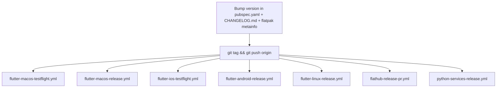

# One codebase, five targets

| Platform | Distribution |
|----------|--------------|
| macOS | TestFlight and direct release build |
| iOS | TestFlight |
| Android | APK / AAB |
| Linux | Flatpak (Flathub) and tarball |
| Windows | MSIX |

The Flutter SDK is **pinned in `.fvmrc`** (currently 3.44.7) and every command
is expected to run through FVM — `fvm flutter …`, `fvm dart …`. CI reads the
same file via `kuhnroyal/flutter-fvm-config-action`, so a local build and a CI
build use the same SDK by construction rather than by convention.

Dart SDK constraint: `>=3.12.0 <4.0.0`; Flutter `>=3.44.0`.

# Continuous integration

Every push to every branch runs:

| Workflow | What it enforces |
|----------|------------------|
| `flutter-analyze.yml` | `flutter analyze` — the zero-warning policy |
| `flutter-test-linux-faster.yml` | The fast unit/widget test lane on Linux |
| `flutter-matrix-test.yml` | Sync tests against a real Matrix homeserver |
| `okf-validate.yml` | This knowledge bundle stays conformant and its code pointers still resolve |

Two more run on **every** branch push despite looking scoped:

- `type-check.yml` — mypy, with **no path filter at all**. Advisory: it runs
  with `continue-on-error`.
- `flatpak-foreign-deps.yml` — path-filtered on *pull requests*, but unfiltered
  on branch pushes.

Genuinely path-filtered: `manual.yml` (docs-site), which runs **only** on pull
requests to `main`, and `python-tools-ci.yml` (the Python tools), which is
path-filtered on **both** branch pushes and pull requests.

Buildkite pipelines under `.buildkite/` cover the Linux and Windows test lanes
and JUnit upload. The Linux lane shards `very_good test` ten ways across matrix
jobs; what that means for how tests must be written is in
[testing conventions](../conventions/testing.md).

# Release

Release is triggered by **pushing a git tag whose name is the `pubspec.yaml`
version**. Seven workflows listen on `push: tags: ['**']` and fan out:

`flathub-release-pr.yml` also accepts `workflow_dispatch` with an explicit
commit SHA and version override, for re-cutting a Flathub PR without moving the
tag.

Two files must move together with every user-visible change, and the repo treats
them as a pair:

- `CHANGELOG.md` — an entry under the **current** `pubspec.yaml` version, not
  under `[Unreleased]`.
- `flatpak/com.matthiasn.lotti.metainfo.xml` — the same release, in AppStream
  form, which is what Flathub renders.

Entries are only for things a user would notice. Dependency bumps, refactors,
test-only changes and CI tweaks get none.

# Local commands

| Task | Command |
|------|---------|
| Install dependencies | `make deps` |
| Static analysis | `make analyze` |
| Unit tests | `make test` (coverage report: `make coverage`) |
| Code generation | `make build_runner` (watch: `make watch`) |
| Localization | `make l10n`, `make sort_arb_files` |
| Integration tests | `make integration_test` |
| Knowledge bundle check | `make okf_check` |
| Run the app | `fvm flutter run -d <device>` |

Generated files — `*.g.dart`, `*.freezed.dart` — are checked in and must never
be hand-edited; regenerate with `make build_runner`. One build-runner flag
combination is actively destructive; see
[code style and analysis](../conventions/code-style.md) for it, which is where the
generated-code rules live.

# Where to look

| Concern | File |
|---------|------|
| CI and release pipelines | [`.github/workflows/`](../../.github/workflows) |
| Buildkite lanes | [`.buildkite/`](../../.buildkite) |
| Build, test, packaging targets | [`Makefile`](../../Makefile) |
| Flatpak manifest and metainfo | [`flatpak/`](../../flatpak) |
| Pinned SDK | [`.fvmrc`](../../.fvmrc) |
