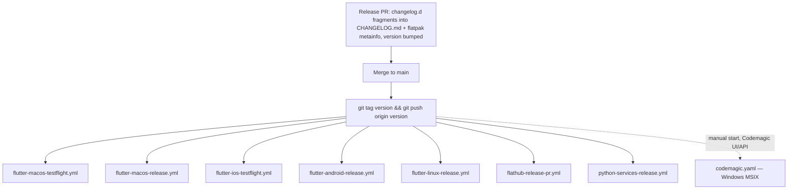
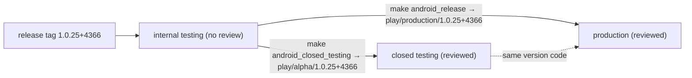

# One codebase, five targets

| Platform | Distribution |
|----------|--------------|
| macOS | TestFlight and direct release build |
| iOS | TestFlight |
| Android | APK on GitHub Releases; app bundle on Google Play — internal testing on every release tag, closed testing and production by promotion |
| Linux | Flatpak (Flathub) and tarball |
| Windows | MSIX |

The Flutter SDK is **pinned in `.fvmrc`** (currently 3.47.0). *Locally*, every
command is expected to run through FVM — `fvm flutter …`, `fvm dart …`. CI does
not use that prefix: each provider selects the pinned SDK for the build machine
and then invokes bare `flutter` and `dart`. The pin is honoured by SDK
selection there, not by the command prefix.

Dart SDK constraint: `>=3.12.0 <4.0.0`; Flutter `>=3.47.0`.

## Bumping the Flutter version

`.fvmrc` is the source of truth, but it is not the only place the version is
written down. Most consumers follow it automatically; one does not:

| Consumer | Follows `.fvmrc`? |
|----------|-------------------|
| GitHub Actions lanes | Yes — `kuhnroyal/flutter-fvm-config-action` reads it |
| Codemagic Windows release | Yes — `environment.flutter: fvm` reads it |
| [`.fvm/fvm_config.json`](../../.fvm/fvm_config.json) | No — legacy FVM clients read their own versioned pin |
| [`.vscode/settings.json`](../../.vscode/settings.json) | No — its SDK path includes the pinned version |
| [`flatpak/com.matthiasn.lotti.flatpak-flutter.yml`](../../flatpak/com.matthiasn.lotti.flatpak-flutter.yml) | **No — hand-edit the Flutter `tag:`**, but CI fails if you forget |

So a Flutter bump updates `.fvmrc`, the legacy FVM config, the VS Code SDK path,
and the Flatpak manifest's Flutter `tag:`. All four currently read 3.47.0.

The manifest keeps a literal tag on purpose. Flathub builds from the committed
file and reviewers read it, so deriving the tag at build time would make the
committed pin stale and *invisible* rather than stale and wrong.
[`flatpak/check_flutter_pin.py`](../../flatpak/check_flutter_pin.py) closes the
gap instead: `flatpak-foreign-deps.yml` runs it on every push, and on any PR
touching `.fvmrc` or `flatpak/`.

The guard exists because drift can be silent. Historically, while the Flutter
constraint floor was `>=3.44.0`, the manifest's stale 3.44.0 tag still resolved
through later pin bumps, so Flathub users ran an engine nobody else was building
against. With the current `>=3.47.0` floor, that same 3.44.0 tag would instead
surface one layer down as `pub get` failing version solving — "the current Dart
SDK version is X, because lotti requires SDK version >=3.12.0 <4.0.0, version
solving failed" — which reads like a dependency problem rather than a toolchain
one. The Windows lane sat broken this way across a dozen consecutive release
tags.

# Continuous integration

Every push to every branch runs:

| Workflow | What it enforces |
|----------|------------------|
| `flutter-analyze.yml` | `flutter analyze` — the zero-warning policy |
| `flutter-test-linux-faster.yml` | The fast unit/widget test lane on Linux |
| `flutter-matrix-test.yml` | Sync tests against a real Matrix homeserver |
| `okf-validate.yml` | This knowledge bundle stays conformant and its code pointers still resolve |

Two more run on **every** branch push despite looking scoped:

- `type-check.yml` — mypy, with **no path filter at all**. Advisory: it runs
  with `continue-on-error`.
- `flatpak-foreign-deps.yml` — path-filtered on *pull requests*, but unfiltered
  on branch pushes.

Genuinely path-filtered, both on pushes *and* pull requests to `main`:
`python-tools-ci.yml` (the Python tools) and `manual.yml` (docs-site) — the latter
also runs on a nightly cron (`23 2 * * *`) and on manual dispatch.

`manual-capture-check.yml` is pull-request-only and exists because the two
cadences above leave a gap: the harnesses render real production widgets, so
app code is what usually breaks them, but `manual.yml` does not watch `lib/`
and no longer captures on push at all. It runs the same capture for **one**
locale and publishes nothing. The locale defaults to German rather than the
authoring locale, because every other locale falls back to English — a
rendering that only breaks once a translation is involved stays green there.
Override with the `MANUAL_CHECK_LOCALE` repository variable.

`manual.yml` is also the manual's **publishing** lane, built around a
Cloudflare R2 bucket rather than git or Pages alone. Screenshots publish to
`manual/screenshots/<version>/` and each version's built site to
`manual-site/<version>/`; `development` prefixes are mutable (synced with
deletion), release prefixes are immutable — publishing refuses to overwrite an
existing manifest or `.snapshot.json` marker, and markers upload last so a
half-uploaded snapshot is never publishable. Every Pages deploy mirrors the
whole `manual-site/` store into one tree, writes a live `manual/releases.json`
derived from what is actually published, and redirects the root to the latest
release (or `development` before the first). Publishing a release manual is a
`workflow_dispatch` with the marketing version and `deploy` enabled: the run
resolves the newest app tag of that version, captures and builds **from that
tag**, and refuses to advertise a release whose screenshot catalog is not in
the bucket. Pull requests only validate; nothing publishes without the `R2_*`
repository secrets.

The capture itself is **sharded one job per manual locale**, with the matrix
read from the screenshot registry so a newly registered locale cannot go
uncaptured. A locale takes roughly twelve minutes, so the eleven-locale
catalog needs over two hours in sequence — as a single job it was killed at
its timeout every night and published nothing. Capture runs **nightly and on
dispatch, never on push**, at `max-parallel: 4`: eleven runners is too large a
share of the pool to spend per merge when almost nothing that lands changes a
screenshot. The site itself still builds and deploys per push, so the two
cadences differ — prose is immediate, media is at most a day behind. Each shard converts only its
own locale to WebP (`make manual_screenshots_shard`); a following
`screenshot_catalog` job merges the slices, writes the manifest across all of
them and validates the complete matrix (`make manual_screenshots_manifest`)
before anything reaches the bucket. All jobs check out one commit resolved
once by the `metadata` job, so a run's site, screenshots and snapshot marker
can never describe different commits.

The ten-way shard belongs to `flutter-test-linux-faster.yml` above: it runs
`very_good test` across a ten-job matrix. **Buildkite is not sharded** — the
pipelines under `.buildkite/` run a bare `flutter test` for the Linux and Windows
lanes plus the JUnit upload. What the sharded lane means for how tests must be
written is in [testing conventions](../conventions/testing.md).

# Release

Release is triggered by **pushing a git tag whose name is the `pubspec.yaml`
version**. Seven GitHub workflows listen on `push: tags: ['**']`, minus the
`play/` namespace that belongs to [Google Play tracks](#google-play-tracks)
below; Windows lives on a different provider and, since September 2026, is
started by hand:

**Windows is the one target not built on GitHub Actions.** It runs on
[Codemagic](../../codemagic.yaml), on a `windows_x2` instance, and reports back
as a `Windows Release` check on the commit it builds. It **no longer triggers
on the tag**: the `windows_x2` minutes made it the most expensive lane per
release, so the `triggering` block was removed and a Windows build is started
manually from the Codemagic UI (Start new build → *Windows Release*, choosing
the release tag) or the builds API, only for releases that ship a Windows
package. Reinstating the `*.*.*+*` tag trigger is one block in
`codemagic.yaml`. Because it lives outside `.github/workflows/`, it is easy to
overlook when auditing CI — its failures show up only on the built commit and
in the build-notification email, never on a pull request.

`flathub-release-pr.yml` also accepts `workflow_dispatch` with an explicit
commit SHA and version override, for re-cutting a Flathub PR without moving the
tag.

## Google Play tracks

The release tag puts the app bundle on Play's **internal testing** track and
stops there. Moving a build further is a second, separate tag namespace,
because Play refuses a version code it has already seen and the build number
moves once per release: by the time a build graduates it is already on
internal, so a store-track release **promotes that build rather than
rebuilding it** — the bytes internal testers had, sent to Google for review.

`play-promote.yml` listens on `push: tags: ['play/**']` and runs
[`tool/play_promote.py`](../../tool/play_promote.py), which reads the track
from the tag, the version code from `pubspec.yaml` at the tagged commit, finds
that version code on the internal track and writes it to the target track as
one completed release, then commits the edit for review. Two refusals guard
it. The tag has to name the version the checkout carries — a tag that
disagrees is refused, since the version code that moves comes from the
checkout, not the tag. And a target track holding a draft, halted or
in-progress release — a staged rollout someone started in the Console — is
not written over: Play's reference says only that an update carries "desired
changes", so the run stops and names the release instead. The same job runs
from `workflow_dispatch` with a chosen track and an optional dry run that
validates the edit server-side and discards it, for reruns against the release
tag's ref. Every other release lane carries `'!play/**'` in its tag filter, so a
promotion tag builds nothing.

| Tag | Play track | Make target | Reviewed by Google |
|-----|-----------|-------------|--------------------|
| `<version>` | `internal` | `make tag_push` | no |
| `play/alpha/<version>` | closed testing | `make android_closed_testing` | yes |
| `play/beta/<version>` | open testing | tag by hand | yes |
| `play/production/<version>` | production | `make android_release` | yes |

The store listing — screenshots included — is one object per language, shared
by every track, so it is deliberately outside this lane; `make
store_screenshots_android` still produces listing images as an artifact (see
[screenshots](../conventions/screenshots.md)), and uploading them stays a
separate, production-time concern.

**No ordinary change writes the release files.** `CHANGELOG.md`,
`flatpak/com.matthiasn.lotti.metainfo.xml` and the `version:` line in
`pubspec.yaml` are all written at their top, so every pull request that edited
them conflicted with every other one still open. Instead each change drops a
note in [`changelog.d/`](../../changelog.d/README.md) — one new file, which
cannot conflict — and a release pull request assembles them into the three
files, once, and deletes what it consumed. `make changelog_check` gates both
halves: the fragments' shape, and that the three files agree on the released
version. Assembling a release is
[`.agents/skills/release/SKILL.md`](../../.agents/skills/release/SKILL.md).

Because the tag carries the build number and every lane above triggers on tag
push rather than on merges to `main`, the build number moves once per release
too — not once per pull request.

# Local commands

| Task | Command |
|------|---------|
| Install dependencies | `make deps` |
| Static analysis | `make analyze` |
| Unit tests | `make test` (coverage report: `make coverage`) |
| Code generation | `make build_runner` (watch: `make watch`) |
| Localization | `make l10n`, `make sort_arb_files` |
| Integration tests | `make integration_test` |
| Promote the Play build | `make android_closed_testing`, `make android_release` |
| Knowledge bundle check | `make knowledge_check` (validator + mermaid) |
| Release-note fragments | `make changelog_check` |
| Run the app | `fvm flutter run -d <device>` |

Generated files — `*.g.dart`, `*.freezed.dart` — are checked in and must never
be hand-edited; regenerate with `make build_runner`. One build-runner flag
combination is actively destructive; see
[code style and analysis](../conventions/code-style.md) for it, which is where the
generated-code rules live.

# Where to look

| Concern | File |
|---------|------|
| CI and release pipelines | [`.github/workflows/`](../../.github/workflows) |
| Google Play track promotion | [`tool/play_promote.py`](../../tool/play_promote.py) |
| Windows release (Codemagic) | [`codemagic.yaml`](../../codemagic.yaml) |
| Buildkite lanes | [`.buildkite/`](../../.buildkite) |
| Build, test, packaging targets | [`Makefile`](../../Makefile) |
| Flatpak manifest and metainfo | [`flatpak/`](../../flatpak) |
| Pinned SDK | [`.fvmrc`](../../.fvmrc) |
