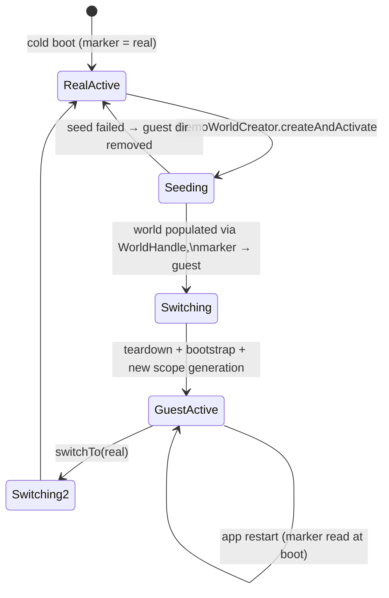

# One process, many worlds

A **profile** is a complete world: its own root directory holding every
database, JSON sidecar, media file, log, and setting. The **real** profile is
the pre-existing documents root — existing installs never move a byte. Each
**guest** profile (the demo workspace) lives under
`<realRoot>/guest_profiles/<uuid>/`.

```text
<realRoot>/                      ← real world (unchanged layout)
  profiles.json                  ← registry: profiles + active marker (global)
  db.sqlite, settings.sqlite, …
  images/, tasks/, logs/, matrix/, …
  guest_profiles/
    <uuid>/                      ← one guest world, same layout
      db.sqlite, settings.sqlite, …
      images/, tasks/, logs/, …  (never matrix/ — no sync stack)
```

`ProfileRegistry` owns `profiles.json` (atomic writes, lenient parsing — a
corrupt file degrades to "real world, active"). It is deliberately **not** in
getIt: getIt is reset on every switch, the registry must survive them.

# The isolation contract

1. **One path authority.** The getIt `Directory` singleton is registered to
   the active profile root, and `openDbConnection` falls back to it instead
   of re-deriving the OS documents directory
   ([`lib/database/common.dart`](../../lib/database/common.dart)). Every
   Drift file, sidecar, media file, and log follows the active root. The
   regression tests in
   [`test/database/common_test.dart`](../../test/database/common_test.dart)
   make path_provider throw to prove no code path re-derives the OS root.
2. **Sync is structurally absent in guest worlds.** `registerSingletons`
   consults `ProfileCapabilities`: guests get an `InertOutboxService`
   (counted no-op enqueues, never-emitting login-gate stream) and none of the
   Matrix stack — the client (and its `matrix/` store), inbound queue,
   backfill timers, node-profile startup broadcast, and VC-burn handlers are
   never constructed. The device-global keychain credentials
   (`MATRIX_CONFIG`) therefore have no reader in a guest world.
3. **Own sync identity for free.** The host ID (`VC_HOST`) lives in
   `settings.sqlite`; a guest world has its own settings database, so
   `VectorClockService.setNewHost()` mints a fresh host ID on the world's
   first boot. Guest worlds can never collide with the real sync identity.
4. **Device state stays global.** Window geometry (SharedPreferences), UI
   hint/whats-new flags (SharedPreferences), keychain sync credentials
   (unread in guests), the TTS model cache, and the OS temp directory are
   deliberately not world-scoped — the rationale per item is in
   [ADR 0049](../../docs/adr/0049-profile-scoped-storage-and-demo-mode.md).
5. **Demo media stays best-effort and tenant-local.** A demo manifest starts
   checksum reconciliation of its R2 catalog after bootstrap without awaiting
   it or adding it to switch-blocking `StartupTasks`. Downloads land only below
   the active guest root; slow, corrupt, or unavailable objects cannot fail
   seeding or boot, leaving the demo cancels in-flight requests, and the next
   startup retries anything incomplete.

The audit test
[`test/features/profiles/service/world_handle_test.dart`](../../test/features/profiles/service/world_handle_test.dart)
plants a canary real root and asserts it stays byte-identical while a guest
world is written.

# Switching worlds



`ProfileSwitcher.switchTo` (owned by `LottiAppRoot`, outside getIt) runs:

1. **Persist the marker first** — a crash mid-switch reopens the intended
   world on next launch.
2. Splash replaces the tree (unmounting every widget listener), one frame
   settles.
3. **Quiesce**: `TimeService.stop()` persists a running timer,
   `AudioPlayerController.disposeActivePlayer()`, app-exit listener
   disposed, `WindowService.detachForRestart()`.
4. **Teardown**: `ServiceDisposer.disposeAll()` (services then databases,
   settings last), bounded log flush, `getIt.reset()` (fires remaining
   dispose callbacks).
5. **Bootstrap**: fresh process logging, `resolveActiveProfile()`,
   `bootstrapProfileServices(restoreWindow: false)`, new app-exit listener.
6. The root bumps its generation key; the new `ProviderScope` recomputes the
   getIt bridge overrides (`buildProviderOverrides`).

A teardown/bootstrap failure leaves the app on the splash; recovery is an
app restart, which boots the marked world from a clean process.

# Populate first, then migrate

Demo creation deliberately populates the world **before** the live app is
re-pointed at it: `WorldHandle.open(root)` builds a second, non-active set of
database handles with explicit documents-directory providers (nothing can
fall back to the active root), the seeder writes through them, then
`DemoWorldCreator` hot-switches. The "documents migration" is the re-pointing
of the whole documents layer at the seeded root — not a data move.

`WorldHandle` writes must arrive with fully formed metadata: getIt-coupled
logic (PersistenceLogic, repositories) must never run against a non-active
world.

# Riverpod surface

`profileContextProvider` (overridden per generation) exposes the active
world; `syncFeatureAvailableProvider` gates every sync UI surface, and
`demoModeActiveProvider` drives demo-only chrome. In guest worlds
`matrixServiceProvider` is left unoverridden so accidental resolution fails
loudly instead of silently no-opping.

# Where to look

| Concern | File |
|---------|------|
| Registry + profiles.json | [`lib/features/profiles/repository/profile_registry.dart`](../../lib/features/profiles/repository/profile_registry.dart) |
| Capabilities + context | [`lib/features/profiles/model/profile_context.dart`](../../lib/features/profiles/model/profile_context.dart) |
| Switch orchestration | [`lib/features/profiles/service/profile_switcher.dart`](../../lib/features/profiles/service/profile_switcher.dart) |
| Non-active world access | [`lib/features/profiles/service/world_handle.dart`](../../lib/features/profiles/service/world_handle.dart) |
| Demo creation ordering | [`lib/features/profiles/service/demo_world_creator.dart`](../../lib/features/profiles/service/demo_world_creator.dart) |
| Sync boundary registration | [`lib/get_it_sync.dart`](../../lib/get_it_sync.dart) |
| Inert outbox | [`lib/features/sync/outbox/inert_outbox_service.dart`](../../lib/features/sync/outbox/inert_outbox_service.dart) |
| Capability providers | [`lib/features/profiles/state/profile_providers.dart`](../../lib/features/profiles/state/profile_providers.dart) |

Related: [bootstrap and DI](bootstrap-and-di.md) for the generation loop,
[sync overview](../features/sync/overview.md) for what the real stack does,
and [ADR 0049](../../docs/adr/0049-profile-scoped-storage-and-demo-mode.md)
for the storage-scoping decision.

The switch machinery above is type-blind: it would carry any profile, not
just the demo. What it would take to run *peer* tenants — separate work and
private worlds, both synced — is recorded in
[ADR 0050](../../docs/adr/0050-multi-tenant-worlds.md). It is proposed, not
built; the practical rule it imposes on code touching this area is to never
treat "guest" and "not the real world" as the same predicate, and to read
capabilities from `ProfileContext.capabilities` rather than re-deriving them
from `ProfileType`.
