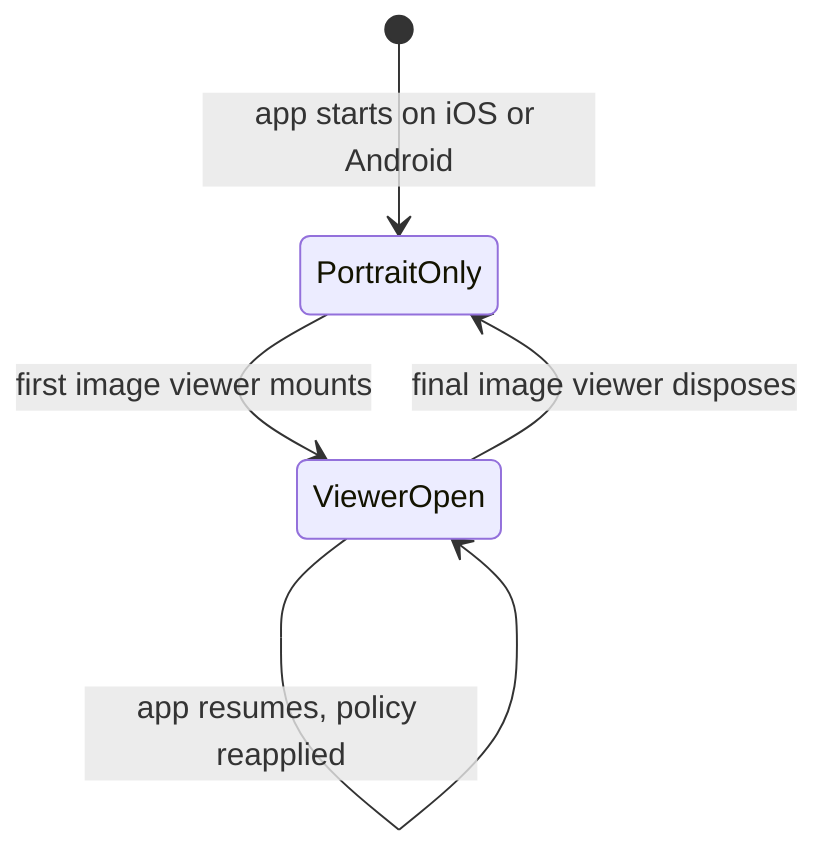
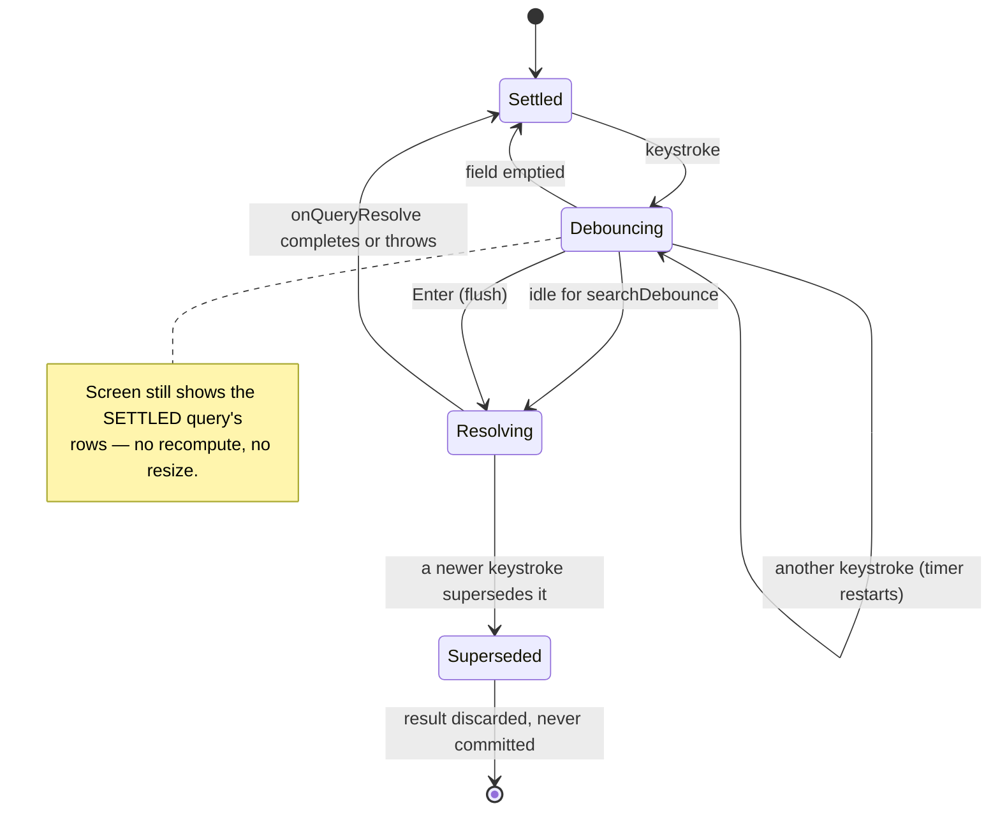

`lib/widgets/` holds the reusable widgets that belong to no single feature.
Anything with a token-backed visual identity lives in
[the design system](../features/design_system/) instead; what remains here is
composition and app-shell chrome.

# What lives here

| Group | Contents |
|-------|----------|
| `app_bar/` | Back and glass action buttons, the sliver settings header, title bars |
| `modal/` | `ModalUtils` over `wolt_modal_sheet`, the confirmation modal, and small list/card animation widgets |
| `selection/` | Reusable selection-modal primitives and the unified toggle family |
| `settings/` | The settings page grid and detail scaffold every editor sits on |
| `picker/` | `EntityPickerSheet`, shared by categories, labels and the task link pickers |
| `nav_bar/` | The bottom navigation shell and its FAB clearance wrapper |
| `media/` | The lifecycle scope that temporarily permits landscape in full-screen image viewers |
| `misc/` | The sidebar activity summary and similar cross-feature pieces |

**Buttons are not here.** They all come from `DesignSystemButton` and its
relatives.

**That table is the documented subset, not the directory listing.** `lib/widgets/`
holds sixteen groups; the eight not described above — `cards/`, `charts/`,
`create/`, `date_time/`, `flags/`, `form/`, `search/`, `ui/` — are
undocumented here. Read them directly, and do not infer from this concept that a
widget has no shared home just because it is absent.

# Image viewers temporarily widen the mobile orientation policy

App startup locks iOS and Android to portrait. `ImageViewerOrientationScope`
temporarily changes the preferred set to portrait plus both landscape
directions while a full-screen image viewer is mounted. It reference-counts
viewers, so closing a nested viewer cannot restore portrait under a parent that
is still visible, and it reasserts the viewer policy when the app resumes from
the background. Disposing the final scope restores portrait. On desktop the
controller is a no-op; window orientation remains a desktop concern.

iOS must declare the three phone orientations in `Info.plist` before Flutter's
runtime preference can select between them. Android uses the same runtime
controller for portrait-only and viewer-specific sets. Because the app targets
API 36, `MainActivity` also declares Android's temporary restricted-resizability
compatibility property; without it, Android 16 ignores orientation requests on
`sw600dp` and larger displays. That property stops applying at API 37, so the
non-viewer UI must become fully adaptive before that target upgrade rather than
assuming the portrait lock can remain enforceable on large screens.

# Modal presentation is mostly centralized

`ModalUtils` is the **only public export** of `lib/widgets/modal/`, and it is how
most adaptive sheets are presented: a draggable bottom sheet on narrow layouts, a
centred dialog on wide ones, from one call. It backs the single-page pickers and
the multi-page settings flows.

Centralizing it is what keeps the responsive contract consistent — a feature that
builds its own sheet has to re-derive the breakpoint, the insets, the barrier
behaviour and the glass footer treatment, and will drift.

**Two flows own their own Wolt presentation** and are worth knowing about before
assuming a single entry point:

| Flow | Why |
|------|-----|
| [The Daily OS planning modal](../features/daily_os_next/ui-surfaces.md) | Calls `WoltModalSheet.show` directly and picks its responsive type itself, because it needs a right-anchored full-height **side panel** on wide screens rather than a centred dialog. It still borrows `ModalUtils` helpers for the barrier colour and its sliver pages |
| [What's New](../features/whats_new.md) | Invokes Wolt directly for its own presentation |

So the accurate rule is: `ModalUtils` owns the shared styling and navigation
helpers, and a flow may own its presentation when its layout genuinely differs —
but it should still reuse those helpers rather than re-deriving them.

# Selection primitives exist to stop duplication

The selection widgets were extracted because several modals — AI modality
selection, the Gemini thinking-mode picker, and others — had each grown their own
option row with slightly different padding, selection markers and semantics.

They now share one option anatomy, which is also what
`DesignSystemSelectionRow` builds on. See
[component contracts](../features/design_system/component-contracts.md).

# The entity picker shows one query's answer at a time

`EntityPickerSheet` is the search-and-pick body behind the category, label and
task-link modals. Its rows, its "create from search" row, its empty message and
what Enter acts on are all derived from **one** query — the *settled* query,
which is not necessarily what is in the field right now.

That distinction only matters for a picker whose results need loading. Category
and label pickers filter a list already in memory, pass no
`onQueryResolve`, and apply every keystroke immediately. The task pickers
(`TaskSearchPickerBody`) need a full-text lookup, supply the hook, and get this
instead:

Enter does not shortcut to `Settled`: it cancels the timer and resolves the
typed query immediately, then acts only if the sheet settled on exactly that
query. An emptied field is the one transition that skips `Resolving` outright,
because there is nothing to look up.

The rule the diagram encodes: **for a non-empty query on an asynchronous
picker, nothing on screen moves until the next answer is complete.** An empty
query and a picker with no `onQueryResolve` both apply at once and are outside
the rule. Recomputing on each keystroke against results still in flight is what
made the link modal claim "No tasks found" mid-word, withhold the create row,
and then repopulate a frame later — resizing the sheet twice per character. It
also opened a fresh Drift subscription per keystroke.

Two consequences worth knowing before changing this:

* **The create row is labelled from the settled query too.** Its label, its
  eligibility, and the rows beside it must describe the same query, or the sheet
  offers to create a name nothing has checked for duplicates.
* **Enter flushes rather than waits.** It resolves the typed query first and
  then acts, and does nothing at all if a further keystroke overtook the flush —
  acting on the older answer would commit the wrong entity.

Both the sheet and `TaskSearchPickerBody` carry their own generation counter, so
a lookup for an abandoned query cannot commit over a newer one that landed
first. The body's counter is not redundant with the sheet's: without it a stale
lookup still writes its matches into the body's fields, and the next rebuild —
for any unrelated reason — then finds them describing the wrong query and drops
the current query's results.

# The bottom-nav shell is app-level

`DesignSystemBottomNavigationBar` and its FAB clearance wrapper live here rather
than in the design system, because the shell is **an app-level overlay docked flush
to the screen edge**, not a `Scaffold.bottomNavigationBar`. Its height contract —
and the clearance any screen-level FAB must respect — is documented in
[component contracts](../features/design_system/component-contracts.md).
