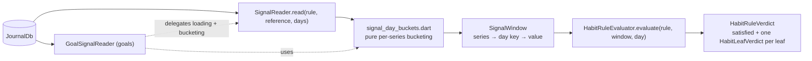

`lib/logic/signals/` exists so that **goals and habits can read the journal
the same way without importing each other**. Goals are a config-flagged
feature; habits are not. Anything both need lives here, and this package
imports neither `features/goals` nor `features/habits` — that direction is the
tier boundary, and it is what makes an auto-completing habit possible without
pulling the goal runtime into the free surface.

# What lives here

| File | Role |
|------|------|
| `signal_day_buckets.dart` | Pure functions: `signalDayKey`, `trailingAverageOn`, `bucketQuantitativeByDay`, `bucketMeasurableTotalsByDay`, `bucketWorkoutsByDay`, `workoutSignalValue`, `habitSuccessDays`. No I/O, no feature imports. |
| `signal_window.dart` | `SignalWindow` — an immutable value of day-keyed series with deep equality, so providers and tests compare by content. |
| `signal_needs.dart` | `SignalNeeds.of(rule)` — the distinct series an `AutoCompleteRule` tree references, so each is queried once. |
| `signal_reader.dart` | `SignalReader` — the only thing here that touches `JournalDb`. |
| `habit_rule_evaluator.dart` | `HabitRuleEvaluator` — pure, table-driven "is this tree satisfied today". |
| `health_signal_refresh_service.dart` | Shared platform-health request mapping, de-duplication and failure containment for goal and habit page-entry refreshes. |

# Day keys and aggregation are borrowed, not invented

A day key is the entity's **local calendar date re-stamped as midnight UTC**
(`signalDayKey`, the same rule as `GoalWindow.dayUtc`). It is a calendar-date
key, not a timezone conversion, and it is what keeps window arithmetic immune
to DST: there is no 23- or 25-hour day in the space the maths runs in. The DB
range end is the *next local midnight built by component*, because adding a
24 h `Duration` on a fall-back day lands at 23:00 and drops the final hour.

Per-series semantics, all inherited from the surfaces the user already sees:

- **Quantitative (health)** follows the health charts' per-type aggregation:
  `dailyMax` for cumulative counters (steps), `dailySum` / `dailyTimeSum` for
  totals, and for `none` (point samples such as weight) the day's **latest**
  sample with entity-id as the tie-break on equal timestamps — return order is
  not a contract, and two replicas must bucket the same journal identically.
  Unknown types get a daily sum, never silence. Percentage types are scaled to
  whole percentages.
- **Measurables** are summed per day. A recorded zero is *present*; a day
  with no entry is absent from the map. That distinction is the whole meaning
  of an "any entry" rule. A choice measurable records `value: 1` per entry,
  so its day total is an occurrence count — enough for "any entry", and the
  reason the habit editor offers no threshold for one.
- **Workouts** keep the `WorkoutData` list per day so thresholds can be applied
  later; `workoutSignalValue` reports minutes, kilometres (stored metres ÷
  1000) or kcal — the units the workout chart labels. They are loaded through
  `JournalDb.getWorkoutsByType`, an indexed `type + subtype` lookup (the
  `subtype` column holds the raw `workoutType`); `getWorkoutTypes` lists the
  distinct imported types for pickers, because those strings arrive from
  Apple Health / Health Connect un-normalised and no fixed list is honest.
- **Habit completions** count only `success` days from the
  latest-completion-per-day collapse the query already performs.

# The evaluator

`HabitRuleEvaluator` walks the tree once and records a `HabitLeafVerdict`
for **every** leaf, even after an `or` is already decided — the completion
sheet shows one status pill per associated signal, and the engine names the
leaf that fired. `and` is vacuously true when empty, `or` is false,
`multiple(successes)` counts satisfied children; the property tests pin `and`
to `multiple(all)` and `or` to `multiple(1)`.

Leaf rules:

| Leaf | Satisfied when |
|------|----------------|
| measurable / health | the selected basis — today's daily aggregate, its trailing seven-day average, or either — is within `minimum` / `maximum`; with no bounds, any entry today |
| workout, `valueType == null` | any workout of that type that day (no numeric value reported) |
| workout, `valueType` set | the selected basis of the summed daily dimension is within the bounds |
| habit | the referenced habit's latest completion that day is a success |

A `maximum`-only rule still requires an entry: silence is not "≤ 2 coffees".
`trailingAverageOn` uses the recorded daily values in the inclusive seven-day
window; missing days are gaps rather than invented zeroes. The auto-completion
service reads seven days ending on each day it evaluates. Older or unknown
`HabitSignalValueBasis` values safely resolve to `today`, and unbounded rules
ignore the basis so *Any reading* keeps its original meaning.

# Gotchas

- `SignalReader.read` clips every series to entries not after `reference`, so
  a live read and a later re-read for the same instant describe one snapshot
  even when an import lands mid-await.
- Goal and habit surfaces read journal rows rather than the platform health
  store directly. On entry they use `HealthSignalRefreshService` to queue each
  watched health type once; the resulting journal notifications repaint the
  established page without replacing it with a loading shell.
- `GoalSignalReader` keeps its own window arithmetic (periods, lookback,
  category and label time); only the leaf loaders and bucketing moved here.
  Its tests did not change when it started delegating, which is the point.
