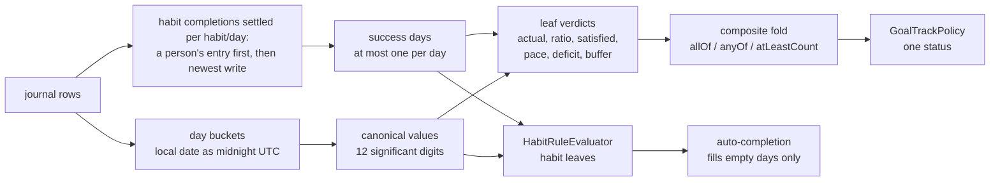
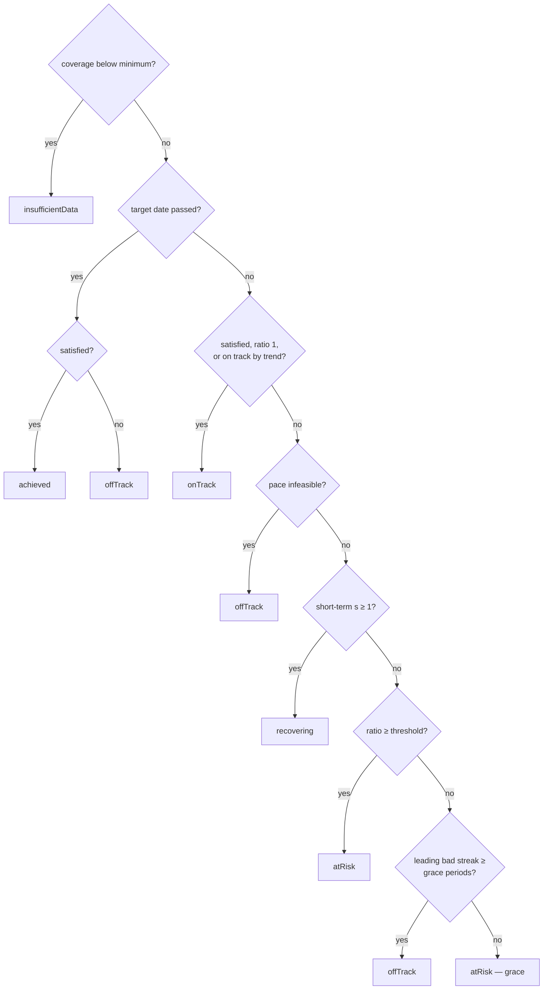

A goal's status and a habit's automatic check-off are **decided by code, not by
a model** ([ADR 0054](../../docs/adr/0054-deterministic-first-two-tier-wakes.md)).
Every replica recomputes them from its own copy of the journal. The model only
restates the result. This concept states that decision layer precisely enough to
prove things about it, and lists which checks discharge which claim.

The runtime around it — wakes, registers, escalation — is in
[goals](../features/goals.md). The journal loading is in [signals](signals.md).

# The pipeline

# Definitions

## Values

Every aggregate is **canonical** before it meets a threshold:
`canonicalSignalValue(x)` rounds a double to 12 significant digits. Integers and
non-finite values are left as they are. Binary doubles cannot represent the
decimals people log: ten entries of 0.1 l sum to `0.9999999999999999`, which
would miss "at least 1 l" by one bit, and the same values summed in a different
order can differ in the last bit. Twelve digits is far finer than anything a
person enters, and far coarser than the error a few thousand additions build up.
So a decision matches the exact decimal arithmetic, whatever order a replica
read the rows in.

The canonical form is applied at these points:

- daily measurable totals;
- the trailing seven-day mean (`trailingAverageOn`), which both the goal detail
  and habit rules use;
- the goal leaf aggregate (`sum`, `dailySumThenAverage`, `count`, `max`);
- the habit numeric leaf's day value;
- each point of the goal metric chart's seven-day series.

## Leaves

For a numeric leaf with canonical aggregate `a`, target `t` and `n` sampled days:

| | `satisfied` | `ratio` |
|---|---|---|
| `n = 0` | false | 0 — no signal, no conclusion (coverage routes it to *insufficient data*) |
| `atLeast` | `a ≥ t` | `t ≤ 0`: 1 if satisfied, else 0; otherwise `clamp(a / t, 0, 1)` |
| `atMost` | `a ≤ t` | 1 if satisfied; `t ≤ 0`: 0; otherwise `t / a` |

A **habit day is credited** when the completion that settles it is a `success`.
`compareHabitCompletionPrecedence` settles a habit/day on a person's own entry
above any automatic one, then on `updatedAt`, `createdAt`, `dateTo` and finally
the id — a total order, so every replica settles the same rows alike. The SQL
ranking behind the habits page orders identically. Each day is worth at most
one success. With `D` the credited days in the period and
`T` the target:

- **Rolling window of `k` days:** `actual = |D|`, `satisfied ⇔ |D| ≥ T`.
  - **Days to recover** (`deficit`) is the smallest `f` such that `f` days of
    perfect adherence bring the window that ends on the last of them to `T`.
    Adherence starts **today while today is still uncredited**, and tomorrow
    otherwise. It is 0 when the leaf is satisfied.
  - **Buffer** is the number of midnights the window stays at `T` or above if no
    new success arrives. It is null below target.
- **Calendar week or month:** `actual` is the count of successes and there is no
  deficit. When the leaf is unsatisfied, `paceFeasible` says whether crediting
  every remaining open day (today if uncredited, plus every later day of the
  period) could still reach `T`.

## Composites

| | `satisfied` | `ratio` | `paceFeasible` |
|---|---|---|---|
| `allOf(c₁…cₙ)` | all | mean | false if any child is false; true if some child is true; else null |
| `atLeastCount(k)` | ≥ k children | mean of the top-k ratios | false when fewer than `k` children are still *possible* (satisfied, or not ruled out); true when ≥ `k` are satisfied or affirmatively feasible; else null |
| `anyOf` | ≥ 1 | max | exactly `atLeastCount(1)` |

An unmet composite reports a ratio of at most `1 − 2⁻⁵³`. The binary mean
`(1 + (1 − 2⁻⁵³)) / 2` rounds to exactly 1.0, which would read as full attainment
for a goal that is not met.

Coverage is the minimum over the leaves. For a numeric leaf it is sampled days
divided by elapsed days. Habit and tracked-time leaves always have coverage 1,
because a missing completion or a missing timer row is itself a real signal.

## Status

`GoalTrackPolicy.derive` takes the root evaluation, the short-term attainment `s`,
the prior attainments (most recent first) and whether the target date has passed.
The first matching rule wins:

## Habit rules and auto-completion

`HabitRuleEvaluator` is a Boolean fold:

- `and` is `multiple(all)`, `or` is `multiple(1)`, and `multiple(k)` counts
  satisfied leaves.
- A numeric leaf compares its canonical value with its bounds. The value is
  today's value, the trailing seven-day mean, or whichever of the two passes.
- A leaf with no bounds means "any entry today".

The auto-completion engine writes a success **only on a day with no completion at
all**, private ones included. That keeps a manual entry or a skip on top on the
device that runs it. Across devices the day can look empty while the person's
entry is still in flight, and it is the settlement order that keeps it on top
once it lands.

# What is proven, and how

The authoring validator (`GoalSpecValidator.authoringIssues`) defines the domain.
A tree it accepts has no empty composite, no duplicate id, `1 ≤ k ≤ n`, no habit
quota above `goalWindowCreditableDays(window)`, and no rolling window beyond
`maxGoalRollingDays`.

**Decoding a persisted spec applies only the structural layer.** A version minted
before a check existed still loads on every replica. The evaluator then scores it,
and an unmeetable quota simply stays unmet.

The checks use three methods:

- **Exhaustive**: every case in a finite domain that covers the claim.
- **Property**: glados samples, tagged `glados`.
- **Directed**: a constructed witness.

| Claim | Method | Check |
|---|---|---|
| Each status holds **iff** its declarative characterisation does, and the six characterisations partition the input space. `derive` reads each real input only through a threshold comparison, so the representatives on each side of every threshold (and the threshold itself) cover all behaviour. | exhaustive, 28,800 cases × 2 configurations | [policy test](../../test/features/goals/evaluation/goal_track_policy_test.dart) |
| Rolling habit leaves: `satisfied`, `actual`, `ratio`, days to recover and buffer match a day-by-day calendar simulation, and every accepted quota is recoverable | exhaustive over windows of 1–8 days, all success patterns and targets (3,586 cases) | [evaluator test](../../test/features/goals/evaluation/goal_progress_evaluator_test.dart) |
| Calendar-week pace is feasible **iff** perfect adherence from today reaches the quota | exhaustive over every weekday, pattern and target (1,778 cases) | evaluator test |
| `anyOf ≡ atLeastCount(1)` on satisfaction, ratio and pace; `allOf ≡ atLeastCount(n)` on satisfaction and dead pace; `anyOf` and `atLeastCount` do not depend on child order | property | evaluator test |
| At every node `ratio ∈ [0, 1]` and `ratio = 1 ⇔ satisfied`; results do not depend on the order signals were recorded in — for integer and decimal inputs | property + directed rounding witness | evaluator test |
| A total logged in tenths meets a target of exactly that total, in both directions, and for day and rolling windows | property | evaluator test |
| A canonical sum of 3-decimal values is the exact decimal total, in any order. Canonicalisation is idempotent and moves a value by at most half a unit in the twelfth digit. Daily measurement totals are exact and independent of order | property | [bucket test](../../test/logic/signals/signal_day_buckets_test.dart) |
| A habit bound equal to the exact decimal amount is met, whether the basis is today, the seven-day mean, or either | property | [habit rule test](../../test/logic/signals/habit_rule_evaluator_test.dart) |
| The completion collapse settles each habit/day on the person's latest entry, else the latest automatic one, under any arrival order, and is idempotent under re-delivery — so replicas converge | property | [resolution test](../../test/logic/habits/habit_completion_resolution_test.dart) |
| Across devices, with the engine filling empty days and sync delivering in any order: replicas converge, no automatic success ever replaces a person's entry, the person's last entry stands, and every device eventually records the day | model check (TLC), 2 and 3 devices | [`HabitDaySettlement.tla`](../../specs/tla/HabitDaySettlement.tla) |
| The SQL ranking settles a raced day exactly as the Dart collapse does | directed | [query test](../../test/database/database_data_queries_test.dart) |
| The authoring validator accepts a habit quota **iff** perfect adherence meets it in the shortest period of its window | exhaustive over window shapes × targets 1–40 (600 cases) | [validator test](../../test/classes/goal_spec_validator_test.dart) |
| `goalWindowCreditableDays` is the shortest period length, 2024–2026 | exhaustive | [window test](../../test/classes/goal_window_test.dart) |

## Not covered

- **The SQL and the reader.** The proofs start from a `GoalSignalWindow` or a
  `SignalWindow`. The reader's clipping, time bands and category attribution are
  covered by example tests in [the reader test](../../test/features/goals/evaluation/goal_signal_reader_test.dart),
  not by these proofs.
- **Longer windows.** The rolling-window proof is small-scope: windows up to
  8 days. Nothing in the code depends on `k`, but longer windows are not
  enumerated.
- **Trend projection** (`onTrackByTrend`) is covered by examples only.
- **Local time.** Day keys use each device's local calendar. Two replicas in
  different time zones bucket an entry near midnight differently by design, so
  convergence assumes a shared zone.
- **Clock skew.** The model stamps every write with one global clock. Skewed
  device clocks reorder any last-write-wins decision, between two of a
  person's own entries included.

# Gotchas

- The two settlement implementations do not share a day definition. The Dart
  collapse keys a completion by its recorded wall-clock date
  (`meta.dateFrom`); the SQL ranking partitions by `date_from` in the reading
  device's current zone. After a time-zone change the SQL can put a
  late-evening entry in the next day's partition and drop one of the two days'
  rows, while the goal reader keeps both.

- Put a new threshold on the canonical value, never on a raw sum. A raw
  `a ≥ t` on binary sums reopens the 0.1-litre bug.
- A new window kind needs a `goalWindowCreditableDays` entry. The validator, the
  revision path's cadence check, and this concept's capacity theorem all read
  that one function.
- A policy rule that reads an input through anything other than a threshold
  comparison (a difference, say) breaks the argument that the exhaustive table
  covers the whole space. Extend the representatives with it.

# Related

- [Goals](../features/goals.md) — the runtime that persists these verdicts.
- [Habits](../features/habits.md) — completion writes and the auto-completion engine.
- [Signals](signals.md) — how the journal becomes day-keyed series.
- [Testing](../conventions/testing.md) — property-test tagging.
