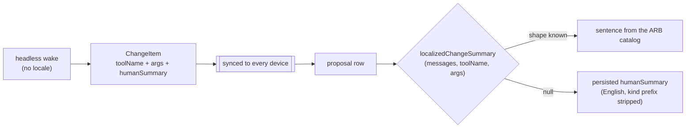

# The rule

**All user-visible label text MUST be localized** through the ARB files in
`lib/l10n/`. Never hardcode a string a user will see.

There are **twelve** catalogs: `app_en.arb` (primary) plus `cs`, `da`, `de`,
`en_GB`, `es`, `fr`, `it`, `nl`, `pt`, `ro`, `sv` — matching
`AppLocalizations.supportedLocales`.

**A new label goes into every one of them.** All twelve are shipped locales, so a
label added to a subset is a visible English island for the users of the rest.
Translate as you add; do not leave the gap for someone else to find later.

`app_en_GB.arb` is the one exception, and only in one direction: it gets an entry
when the spelling differs from US English, and nothing when it does not.

`missing_translations.txt` is the backstop that reports what slipped through, not
the plan.

Access is through `context.messages.labelName`.

After adding labels, run `make l10n` to regenerate and `make sort_arb_files` to
keep the catalogs consistently sorted. **Never edit the generated
`app_localizations_*.dart` files** — edit the ARB source and regenerate.

# It applies to the corners too

The rule includes debug and QA-only actions. It matters most in
*Settings → Advanced → Maintenance*, whose onboarding preview and animation
gallery rows are **real app UI** and would otherwise be an English island inside
another locale. See [settings](../features/settings.md).

# Text generated with no locale: rebuild it, do not translate it

Some strings are produced where there is **no `BuildContext` and no locale** —
an agent wake runs headless — and are then **persisted into a synced entity**.
`ChangeItem.humanSummary` is the case to reason from: written in English during
a wake, replicated to every device, and read back months later.

Such a string **cannot be localized in place**. Translating it at write time
picks the *author's* language for every future reader, and rewriting it later
would mean rewriting history on every peer. It is also load-bearing beyond
display — `ChangeItem.displayDuplicateKey` and the retraction matcher hash it —
so its value has to stay stable regardless of who is looking.

The rule is therefore: **persist the structured facts, and compose the sentence
at render time.**

`localized_change_summary.dart` is the reference implementation. Three
properties of it are contract rather than detail:

- **It returns `null`, not a guess.** A tool it has no shape for — an older
  client's, or one added after this build — falls back to the persisted string.
  Showing stale English beats showing a rebuilt half-sentence or nothing. The
  same applies to a non-numeric estimate: the estimate sentence is an ICU
  plural, and no language can conjugate "minutes" around a non-number.
- **Prefix-stripping differs per path.** The proposal row strips a leading bare
  kind label from the *fallback*, because the headless generator duplicated it
  ("Estimate: 1h 30m" under an *Estimate* chip). A *rebuilt* sentence is
  stripped only when the label is followed by a colon (`Add: "Buy milk"` under
  an *Add* prefix — the checklist sentences are authored as `Verb: object` for
  surfaces without a chip). A sentence that merely opens with the label word —
  German's "Status auf … setzen" — keeps it, because stripping the bare word
  would leave a fragment.
- **A value the user supplied is data, not copy — but wire vocabulary is
  vocabulary.** Titles and free text pass through untranslated; only the frame
  around them comes from the catalog. Values with an enumerable wire vocabulary
  (task status, task priority `P0`–`P3`, project status and its aliases) render
  through the same localized labels the rest of the UI uses, normalized exactly
  as their apply-path handlers normalize them — so a proposal can never display
  a different value than accepting it would set. Outside the vocabulary the raw
  value passes through verbatim.
- **A relation to a task that does not exist yet is its own sentence.** The
  create-follow-up clause cannot reuse the `linkSummary*` `{target}` templates
  with a pronoun: that slot is a direct object in some templates and a
  prepositional object in others, and case languages decline the two
  differently (Romanian needs the clitic `o`, German dative `ihr` after
  `von`). The `linkSummaryNewTask*` keys are whole sentences per catalog with
  "the new task" declined in place.

**What is not in `args` cannot be rebuilt.** A checklist title or label name
resolved from the database during the wake lives only in the persisted summary,
so those rows still fall back. Widening `args` would change
`ChangeItem.fingerprint` and therefore cross-wake dedup — not a display change.

# Register: informal

The app addresses users **informally**:

| Language | Uses | Not |
|----------|------|-----|
| German | du / deine | Sie / Ihre |
| French | tu / tes | vous / vos |
| Spanish | tú / tus | usted / sus |

**Romanian is the deliberate exception** — it uses the formal `dvs.` register
consistently.

`missing_translations.txt` records gaps, and `make l10n` prints them.

# Where dates and numbers are localized instead

Persisted values stay **locale-neutral**: a due date is a `DateTime`, a status is
an enum. Localization happens at the presentation boundary — for example
`DateFormat.yMMMd` in the active locale for a due-date chip, and localized status
labels resolved when an event renders.

That split is what lets a language change update every surface immediately
without migrating a single record. See [events](../features/events.md).
