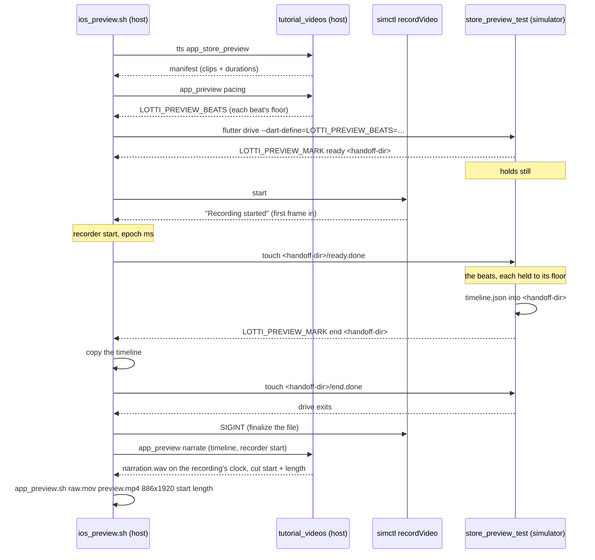

# Images do not live in this repository

`assets/` holds what the *app* ships — icons, tutorial media, design-system
exports. **Everything captured for humans to look at leaves this repository.**
The generated manual catalog and pull-request review evidence publish to the
Cloudflare R2 bucket that also hosts the tutorial videos. Pull-request images
use commit-addressed public URLs:

```markdown

```

That split keeps a Flutter checkout from carrying megabytes of PNGs that change
every time a surface is redesigned, and it is why `README.md` embeds remote
images rather than local ones.

The enforcement is thin, so know it: `.gitignore` ignores any directory named
`screenshots`, which is exactly the harness's default output directory. Capture
lands somewhere ignored by default — but an image saved anywhere else **will**
be committed if you `git add` it.

# Two destinations, two lifecycles

Both live in the R2 bucket. **No *captured* image belongs in a git
repository** — not this one, and not a docs repository either. (What `assets/`
ships is a different thing: icons, tutorial media and design-system exports are
part of the app, not evidence of it.) Which prefix a capture belongs under
follows from who regenerates it:

| Destination | Contents | Lifecycle |
|-------------|----------|-----------|
| R2 bucket, `manual/screenshots/<version>/<case-id>/` | The **generated** manual catalog — `mobile-light`, `mobile-dark`, `desktop-light`, `desktop-dark` per case, plus `manifest.json` | Produced by `make manual_screenshots` and published by the `manual.yml` CI lane; never hand-edited or renamed. `development/` is refreshed with deletion (retired cases disappear), numbered release prefixes are immutable — publishing refuses to overwrite an existing manifest. The app `README.md` embeds from this catalog too, so its screenshots age with the app rather than with whoever last remembered to retake them |
| R2 bucket, `pr-screenshots/<topic-slug>/<app-commit>/` | **Review evidence** for a pull request | Published from an external capture directory by `make pr_screenshots_publish`. Objects are immutable: an identical retry is a no-op, while changed pixels require a new filename or commit prefix |

`make manual_screenshots` stages captures and the materialized catalog under
the gitignored `build/manual_capture/` and `build/manual_media/` directories;
only the CI publish step talks to R2, using the `R2_*` repository secrets.

It is a loop over two smaller targets, and CI uses those directly rather than
the loop: `manual_screenshots_shard` captures **one** locale and converts only
that locale to WebP, and `manual_screenshots_manifest` writes and validates the
manifest over whatever complete media tree exists. CI runs one shard job per
locale and merges them, because a locale takes about twelve minutes and the
full catalog does not fit in a single job's timeout — nightly and on dispatch
only, four at a time, because eleven runners per merge is more than a catalog
that rarely changes is worth. **A UI change therefore ships before its manual
media does**; dispatch the workflow when a screenshot needs to be current
sooner.

Whether the harness still *runs* is checked earlier and separately:
`manual-capture-check.yml` captures one locale on any pull request touching
`lib/`, `assets/`, a harness, or a registered screenshot test. It publishes
nothing — it exists because these suites are opt-in, so no other *pull
request* lane executes them and a UI change would otherwise only be found to
have broken the catalog by the nightly capture.

It defaults to **German**, not the authoring locale: every other locale falls
back to English, so a rendering that only breaks once a translation is
involved stays green there. That is not hypothetical — a proposal row whose
quotation marks come from the locale (`„…“` in German and Czech, `"…"` in
English) passed English and failed the other ten. Override with the
`MANUAL_CHECK_LOCALE` repository variable. Run a single locale the same way CI
does when iterating on one language:

```bash
make manual_screenshots_shard MANUAL_LOCALE=de
```

# Store listing screenshots come from a phone

The store listings — Play Store and App Store — are the one place a screenshot
must come from the platform it advertises: a widget-test capture at a phone size
is the right shape but not the real thing — no device fonts, no device image
decoding, no platform text input. `integration_test/store_screenshots_test.dart`
therefore runs on a device under `flutter drive`, booting the production app
shell on the tutorial harness with the penguin world seeded in full (habits,
time records, notes, links) and *no demo-mode banner*, then walks the screens
that say what the app is. One driven test, two drivers:

| Platform | Script | Where it runs | What the script does that the test cannot |
|----------|--------|---------------|--------------------------------------------|
| Android | `tool/store_screenshots/android.sh` (`make store_screenshots_android`) | an emulator, booted from `LOTTI_AVD` if none is attached; CI in `store-screenshots-android.yml` | pins the window to 1080×1920 and turns Private DNS off (below) |
| iOS | `tool/store_screenshots/ios.sh` (`make store_screenshots_ios`) | the simulators named in `LOTTI_IOS_DEVICES`, booted if they are not; CI in `store-screenshots-ios.yml` | dresses the status bar to Apple's 9:41 / full battery / full signal convention, takes every PNG itself with `simctl` (below) and clears the status bar afterwards |

Both run the test once per theme. On Android the driver writes the PNGs the
device captured; on iOS the script writes them, one whole-screen `simctl`
capture per marker, split per device under `build/store_screenshots/ios/<slug>/`.
Both CI lanes run on manual dispatch or on a pull request touching the capture,
and upload the PNGs as an artifact.

Device facts that shape the two scripts:

- **Play rejects a screenshot whose long side is more than twice its short
  side**, and the stock Pixel profiles are 20:9. The Android script pins the
  emulator window to 1080×1920 (9:16, which Play also asks for when it features
  a listing) with `adb shell wm size` and resets it afterwards.
- **App Store Connect's listing sizes are device sizes**, so the iOS script pins
  nothing: the 6.9" iPhone slot takes 1320×2868, which is what an iPhone 17 Pro
  Max simulator renders, and the 13" iPad slot takes 2064×2752, which is what an
  iPad Pro 13-inch renders. The default `LOTTI_IOS_DEVICES` names exactly those
  two — the app is universal (`TARGETED_DEVICE_FAMILY = 1,2`), so the iPad set
  is required, not optional.
- **The test runs on the device, whose environment is not the host's.** Theme
  and locale arrive as `--dart-define`s, not environment variables; the
  driver, which does run on the host, still writes to `LOTTI_SCREENSHOT_DIR`.
  And there is no `curl` on a phone, so the fixture media comes down through
  `package:http` instead of the widget-test downloader.
- **Android renders Flutter into a `SurfaceView`, which a screenshot cannot
  read**; the test swaps in an `ImageView` for the run
  (`convertFlutterSurfaceToImage`).
- **The iOS plugin's screenshot is the Flutter view alone** — no status bar,
  a blank band under the notch — and its bytes reach the driver only after the
  run, in a batch, so nothing host-side can be timed off them. On a simulator
  the test therefore announces each capture point on stdout
  (`LOTTI_STORE_CAPTURE <name> <ack-dir>`) and **waits** — the script streams
  the drive output, takes the whole screen with `simctl io screenshot` on the
  marker (status bar and its override included), flattens it, then touches
  `<ack-dir>/<name>.done`, and only then does the test move on. The ack
  directory is inside the app's sandbox, which on a simulator is a plain host
  directory. A handshake rather than a fixed hold, because a cold CI runner
  took over ten seconds per frame and every capture drifted one screen late.
  The driver, told the UDID through `LOTTI_SIMULATOR_UDID`, leaves the
  device-side bytes unwritten and fails the run if the host's file is missing.
- **App Store Connect rejects a PNG with an alpha channel**, and says so with
  the same "dimensions should be …" message it uses for a wrong size.
  `simctl` always writes RGBA, so the script flattens each capture to opaque
  RGB with `tool/store_screenshots/strip_alpha.py` (standard library only, so
  a stock runner needs no pip step; the sRGB profile chunk is kept).
- **The Android emulator's DNS fails silently under Private DNS.** Android's
  opportunistic DNS-over-TLS "validates" against the emulator's virtual
  resolver at 10.0.2.3 and then answers nothing: ICMP works, no hostname
  resolves, and the fixture media never arrives. The script turns
  `private_dns_mode` off on the guest before driving; plain DNS through the
  same resolver is fine.

The output is a listing asset, not review evidence: it is uploaded to the
Play Console and App Store Connect by hand and does not go to R2.

# The App Preview is the same world, walked by touch

App Store Connect's listing also takes video: up to three **App Previews** per
device size and language, 15 to 30 seconds each.
`integration_test/store_preview_test.dart` boots the same penguin world as the
screenshot walk — both go through `bootStoreWorld` in
`integration_test/store_walk.dart` — but where the screenshot walk jumps
between routes and holds still, this one moves the way a person does, and
**only through what a phone can reach by touch**: it scrolls the task list,
opens a task onto its cover art, ticks a checklist item, goes back, completes
two habits through the Navigate sheet, and ends in the logbook, where both
completions have just landed — what you did is what it keeps.
Time analysis, which the screenshots show, is absent on purpose — its only entry
point is the desktop sidebar, so on a phone the screenshot walk reaches it by
route, and a video of a screen nobody can tap their way to would misdescribe
the app. Daily OS is absent too: in this world it opens on its set-up card.

The walk plays that storyboard as four **beats** — `tasks`, `task`, `habits`,
`logbook` — and each one is narrated. The narration is the tutorial videos'
own machinery, reused rather than rebuilt: the lines live in
`tools/tutorial_videos/config/scenarios/app_store_preview.yaml`, one step per
beat, and the workbench's TTS pre-pass speaks them in the narrator's voice the
manual's videos use (Gemini TTS, cached by content). What the preview does not
take from the tutorials is everything a real-time video has no use for: no
time warp, no OpenMontage, no on-screen cursor — Apple wants no fingers on
the screen, and a drawn pointer is one.

`tool/store_screenshots/ios_preview.sh` (`make store_preview_ios`) narrates,
records and cuts:



What shapes it:

- **The camera starts on the walk's word, not the script's.** A cold build
  holds the simulator on its home screen for minutes. The walk announces
  `ready` once the app is up and waits for the script's acknowledgement — the
  `holdForHost` handshake the screenshot walk uses for its PNGs — so the file
  holds the walk and nothing before it.
- **Every beat lasts as long as its line needs.** The tutorial driver's rule,
  `max(min_duration, narration + 0.6 s)`, computed on the host
  (`tutorial_videos/app_preview.py`) and handed to the walk as
  `LOTTI_PREVIEW_BEATS`; a beat whose moves finish early holds its last frame.
  `min_duration` is roughly what the moves take on their own, so a line that
  fits costs no time. A locale whose floors alone overrun 30 seconds fails
  before the build, and a beat the walk does not have fails before recording.
- **The cut and the narration are timed by a timeline, not by log lines.** The
  walk records when the cut and every beat began, in epoch milliseconds, and
  leaves `timeline.json` in the handoff directory — the app's sandbox, a
  plain host directory on a simulator — before a closing `end` handshake that
  lets the script copy it while the app is still up. A simulator runs on its
  host's clock, so those times set against the recorder's start place the cut
  and each line exactly; a line printed to the drive output would reach the
  script late by however long the log transport took. Each line starts where
  its beat began, and a line that would run into the next beat or past the
  cut fails the run instead of talking over itself.
- **Every wait renders frames.** A recording takes real frames: the walk pumps
  one every 16 ms while it holds, scrolls by animating the page's own scroll
  position, and would otherwise record a page transition at a few frames per
  second.
- **A simulator is addressed by UDID, never as `booted`.** With two simulators
  running `simctl` picks one, and the other may be somebody's debugging
  session. `tool/store_screenshots/ios_simulator_lib.sh` resolves the name to a
  UDID, shared with the screenshot script; it shuts down only what it booted.
- **`app_preview.sh` writes what App Store Connect takes and refuses what it
  would not.** 886×1920 for the 6.9" and 6.5" iPhone slots, H.264 High 4.0,
  progressive, constant 30 fps — a simulator recording has a variable frame
  rate, a frame per screen change — and a stereo AAC track: the narration,
  normalized to the tutorials' -16 LUFS and cut by the same output-side seek
  as the picture, or silence with `LOTTI_PREVIEW_NARRATION=off`. The result is
  measured; one outside 15–30 seconds is removed and fails the run.
- **It has to work muted.** A preview autoplays without sound, so every line
  restates what the footage already shows; nothing depends on hearing it.

**What this produces is the rehearsal.** Apple wants a preview built from
footage captured on a device, and nothing on the command line records a
physical iPhone — `devicectl` can neither record nor screenshot. The simulator
cut settles the storyboard, the pacing and the narration; the footage that
ships is the same walk on a phone, captured with QuickTime Player over USB
(File › New Movie Recording, the phone as camera), which goes through
`app_preview.sh` unchanged. A phone's sandbox is not a host directory, so the
timeline handoff — and with it the narration, which is laid by that
timeline — is the simulator's alone for now: a phone capture has no beat
times to place the lines by. The walk drives the phone layout, so the 13" iPad
slot (1200×1600) needs a walk of its own. Like the listing PNGs, previews land
under `build/`, are uploaded by hand and are never committed.

# A UI pull request shows before *and* after

**One picture of the new thing is not review evidence.** A reviewer cannot tell
an improvement from a regression without the state it replaced, and the author is
the only person who still has that state cheaply to hand.

So a UI pull request carries a pair, per surface and per relevant variant
(mobile/desktop, light/dark where the change touches theming):

```text
pr-screenshots/<topic-slug>/
├── before/
│   └── <surface>_<mobile|desktop>_<light|dark>.png
└── after/
    └── <surface>_<mobile|desktop>_<light|dark>.png
```

Matching filenames on both sides are what make the pair readable — a reviewer
should be able to flip between two images of the same name and see only the
change.

**Fixtures are never the user's own data.** A capture harness populates its
surface from `test/test_data` and the penguin demo world — never from a habit,
task, goal, note or description seen in a maintainer's own app, database or bug
screenshot. Everything captured here is published to a public bucket and
embedded in a public pull request, so a real entry in a fixture is a real entry
on the internet. Read every string in a scratch harness before running it, and
every image before publishing it.

**Capture `before/` first, from the base commit**, before the change exists.
Reconstructing it afterwards means stashing work and re-running the harness, which
is the step people skip; that is why the pairs go missing.

Publish the pair from its external staging directory after the app commit exists:

```bash
make pr_screenshots_publish \
  PR_SCREENSHOT_SOURCE=/tmp/lotti-pr-screenshots/<topic-slug> \
  PR_SCREENSHOT_TOPIC=<topic-slug> \
  PR_SCREENSHOT_COMMIT=$(git rev-parse HEAD) \
  PR_SCREENSHOT_ENV=/path/to/lotti/.env
```

The command requires `boto3` and the same five `R2_*` values as tutorial-video
publishing. It records a SHA-256 on every object and refuses to overwrite a key
whose content differs. Published objects have `image/png` and
`Cache-Control: public,max-age=31536000,immutable`; that one year is the client
cache lifetime, not object expiration. The R2 object remains until explicitly
deleted by a bucket lifecycle or maintainer.

Link the printed public URLs from the pull-request body. A contributor without
R2 credentials should attach images through GitHub's own upload instead. What
is not acceptable is committing generated screenshots to this repository,
overwriting a published review object, or omitting the before state.

# The pair is the contract

`before/` + `after/` with **matching filenames** is what new work produces.

Other shapes exist in the project's history — a single `after/`, files loose in
a topic directory, one-off `baseline/` or `current/` subdirectories. They are
historical exceptions, predating this convention. **None of them is valid for a
new publication.**

# Related

* [Platform targets, CI and release](../architecture/platform-and-release.md) - the `manual.yml` lane that rebuilds the docs site.
* [Testing conventions](testing.md) - the harness is a widget test, so the same fake-time and determinism rules apply.
