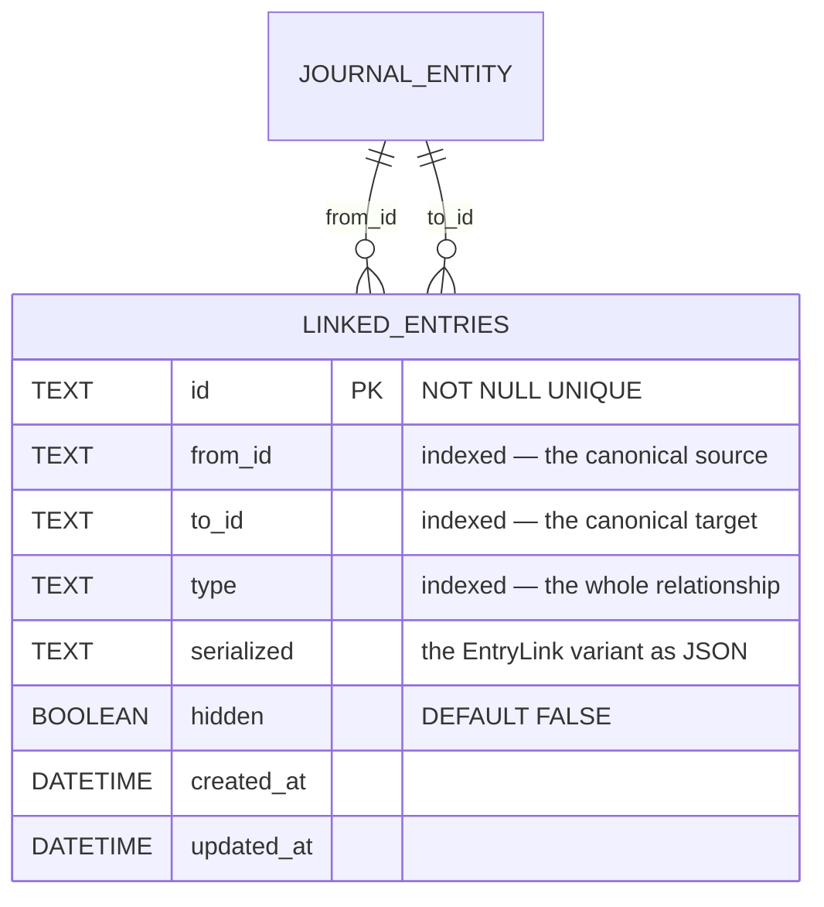

# Eight variants, one shape

`EntryLink` is a union of `basic`, `rating`, `project`, `blocks`, `followsUp`,
`duplicates`, `fixes`, `supersedes` — mirrored by `EntryLinkType`.

**Every variant has the same shape**: id, `fromId`, `toId`, timestamps, vector
clock. The relationship lives entirely in the **type column**.

That is the load-bearing design decision: because the shape is identical, every
existing `type = 'BasicLink'` consumer — recorded-time attribution, capture
attachment, the generic linked-entries list — stays **structurally blind** to
typed edges. Typed relationships were added without migrating a single consumer.

`UNIQUE(from_id, to_id, type)` is what lets one pair hold several different
relationships while keeping each one singular.

**Only these columns are queryable.** Everything else an `EntryLink` carries —
`vectorClock`, `collapsed`, `deletedAt` — lives inside `serialized`.

That is a real constraint, not an encoding detail: **a soft-deleted link cannot be
excluded in SQL.** `TaskDependencyResolver`, `TaskBlockersController` and
`TaskLinkGroupsController` each filter `deletedAt != null` in Dart, after
deserializing every row the query returned, because there is no column to filter
on. Any new link consumer inherits the same obligation — and forgetting it means
silently treating removed relationships as live.

# One row per relationship

"Is blocked by" and "has follow-up" are **rendering labels for the reverse
direction of the same row**, never separate rows. Picking an inverse phrase in the
UI swaps `fromId`/`toId` before persisting, so the canonical stored direction is
always the primary one — a `blocks` link's `fromId` is always the blocker.

The schema's `UNIQUE(from_id, to_id, type)` lets one pair hold several different
relationships, and **direction is part of the identity**, so the inverse of an
existing link stays offerable.

`PersistenceLogic.createLink` runs a best-effort local cycle guard for `blocks`
only. **Read-time traversal tolerates cycles regardless**, because two offline
devices can always race one into existence.

# Links are synced first-class

Updating a link emits `UpdateNotifications` **and** writes a sync outbox message
with a fresh vector clock. Links are their own `SyncMessage` family
(`entryLink`), sequence-tracked like journal entities.

# Related

* [Typed relationships and blockedness](../features/tasks/relationships.md) - how the task layer presents and derives from these.
* [Dependency-aware planning](../features/daily_os_next/dependency-aware-planning.md) - how the planner consumes `blocks`.
